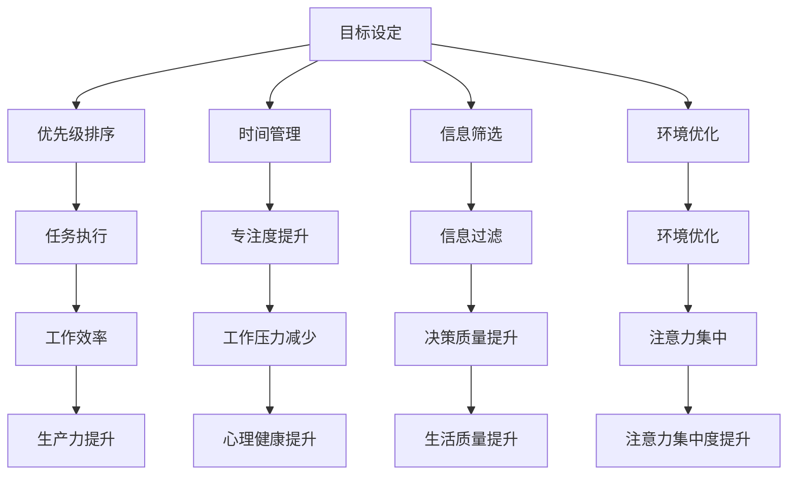

                 

### 1. 背景介绍

在信息爆炸的时代，注意力管理已成为一个至关重要的问题。无论是职场人士、学生还是普通的互联网用户，我们每天都在面临海量的信息，这些信息来自社交媒体、电子邮件、即时通讯工具、新闻网站等各个渠道。尽管信息的获取变得更加便捷，但我们的大脑却无法处理如此之多的数据。这种信息过载导致了注意力分散，进而影响了我们的工作效率、学习效果和生活质量。

注意力管理不仅关乎个人的生产力，还涉及心理健康。长时间处于信息过载的状态下，人们容易出现焦虑、压力和疲劳，进而影响身心健康。因此，如何有效地管理我们的注意力，减少信息过载带来的负面影响，成为了一个亟待解决的问题。

本文旨在探讨注意力管理的策略，帮助读者理解和应用这些策略，以提升个人在信息时代的生产力和生活质量。首先，我们将介绍注意力管理的核心概念和原理，接着讨论信息过载的原因和影响，然后提出具体的策略和工具，最后分析实际应用场景和未来发展趋势。

在接下来的内容中，我们将一步一步地深入探讨注意力管理策略的各个方面，旨在为读者提供全面而实用的指导。无论您是职场人士、学生还是普通互联网用户，相信这篇文章都能帮助您更好地应对信息过载的挑战，提升您的注意力管理和工作效率。

### 2. 核心概念与联系

#### 注意力管理的定义

在探讨注意力管理的策略之前，我们先来定义什么是注意力。注意力是指我们集中于特定目标或任务的心理能力，它包括选择关注某些事物而忽略其他事物。从心理学角度来看，注意力是一种有限的资源，我们的注意力水平会随着任务的复杂性和持续时间而下降。因此，如何高效地管理注意力资源，成为提高生产力和生活质量的关键。

注意力管理（Attention Management）则是指一系列策略和技巧，旨在优化我们对信息、任务和目标的处理方式。它包括以下几个方面：

1. **目标设定**：明确我们需要关注的目标和任务。
2. **优先级排序**：根据重要性和紧急性来安排任务的优先级。
3. **时间管理**：合理安排时间，确保我们有足够的精力专注于关键任务。
4. **信息筛选**：过滤掉无关紧要的信息，减少注意力分散。
5. **环境优化**：创建一个有利于集中注意力的工作或学习环境。

#### 信息过载的定义

信息过载（Information Overload）是指我们接收到的信息超过了我们处理能力的情况。在信息时代，信息过载是一个普遍存在的问题。根据美国心理学家的研究，成年人每天平均接收到的信息量是数百万字，这些信息中很多都是无关紧要的。信息过载导致我们的注意力资源被大量无关信息占据，从而降低了我们的工作效率和决策质量。

信息过载的影响：

1. **注意力分散**：我们需要花费更多的时间来筛选和过滤信息，导致注意力分散。
2. **工作压力**：处理大量信息会增加工作压力，导致焦虑和疲劳。
3. **决策困难**：在信息过载的情况下，我们难以做出明智的决策。
4. **工作效率降低**：过度关注无关信息会降低我们的工作效率。

#### 注意力管理与信息过载的关系

注意力管理策略可以帮助我们应对信息过载带来的挑战。通过设定明确的目标、合理安排时间和任务、优化信息接收和处理方式，我们可以减少无关信息的干扰，提高注意力的集中度，从而提高工作效率和生活质量。

#### 注意力管理策略的架构

为了更好地理解和应用注意力管理策略，我们可以将其分为以下几个部分：

1. **目标设定**：明确我们需要关注的目标和任务。
2. **优先级排序**：根据重要性和紧急性来安排任务的优先级。
3. **时间管理**：合理安排时间，确保我们有足够的精力专注于关键任务。
4. **信息筛选**：过滤掉无关紧要的信息，减少注意力分散。
5. **环境优化**：创建一个有利于集中注意力的工作或学习环境。

#### Mermaid 流程图

下面是一个简化的 Mermaid 流程图，展示了注意力管理策略的核心概念和联系：



通过这个流程图，我们可以清晰地看到注意力管理策略的各个部分是如何相互关联和作用的。在接下来的章节中，我们将逐一深入探讨这些策略的具体应用和实践。

### 3. 核心算法原理 & 具体操作步骤

注意力管理策略的核心在于如何有效地分配和利用我们的注意力资源，以实现更高的工作效率和生活质量。以下我们将介绍几个关键算法原理和具体操作步骤，帮助读者更好地理解并应用这些策略。

#### 1. 目标设定

目标设定是注意力管理的第一步，一个明确且具体的目标可以帮助我们集中注意力，提高工作效率。以下是目标设定的核心原则和步骤：

1. **SMART 原则**：
   - **Specific（具体）**：目标要明确具体，避免模糊。
   - **Measurable（可衡量）**：目标要有可衡量的标准，以便评估进度。
   - **Achievable（可实现）**：目标要具有可实现性，避免过于理想化。
   - **Relevant（相关）**：目标要与我们的总体目标和价值观相符合。
   - **Time-bound（时限）**：目标要设定一个明确的完成时限。

2. **具体操作步骤**：
   - **明确目标**：写下你的目标，确保其符合 SMART 原则。
   - **分解目标**：将大目标分解为小目标，以便逐步实现。
   - **制定行动计划**：为每个小目标制定具体的行动计划和时间表。

#### 2. 优先级排序

在设定目标后，我们需要根据重要性和紧急性对任务进行优先级排序，以最大化我们的注意力资源。以下是几个常用的优先级排序方法：

1. **Eisenhower Matrix（艾森豪威尔矩阵）**：
   - **紧急且重要**：立即处理。
   - **紧急但不重要**：委托或推迟处理。
   - **不紧急但重要**：规划时间处理。
   - **不紧急且不重要**：避免或减少处理。

2. **Pareto Principle（帕累托原则）**：
   - **20/80 规则**：80% 的成果来自 20% 的关键任务，因此我们需要优先处理这 20% 的任务。

3. **具体操作步骤**：
   - **列出任务**：将所有待办任务列出。
   - **评估重要性**：根据任务的重要性和紧急性进行评估。
   - **排序任务**：使用上述方法对任务进行优先级排序。
   - **执行任务**：按照优先级顺序执行任务。

#### 3. 时间管理

时间管理是注意力管理的关键部分，通过合理分配时间，我们可以确保有足够的精力专注于关键任务。以下是几个常用的时间管理方法：

1. **时间块法（Time Blocking）**：
   - **将时间划分为固定块**：将一天划分为若干固定的时间块，每个时间块专注于一项任务。
   - **避免任务切换**：在每个时间块内专注于当前任务，避免频繁切换。

2. **番茄工作法（Pomodoro Technique）**：
   - **25 分钟专注工作**：设定一个计时器，专注于一项任务 25 分钟，然后休息 5 分钟。
   - **重复进行**：每完成 4 个番茄时间，休息 15-30 分钟。

3. **具体操作步骤**：
   - **制定时间表**：根据任务优先级和时间要求，制定合理的时间表。
   - **遵循时间表**：严格按照时间表执行任务，避免拖延。
   - **调整时间表**：根据实际情况调整时间表，确保任务按时完成。

#### 4. 信息筛选

在信息过载的时代，信息筛选变得尤为重要。通过有效筛选信息，我们可以减少注意力分散，提高工作效率。以下是几个常用的信息筛选方法：

1. **订阅制（Subscription Model）**：
   - **订阅高质量信息源**：选择一些高质量、有价值的博客、新闻网站、邮件订阅等。
   - **定期阅读**：设定固定时间阅读订阅内容，避免分散注意力。

2. **清单制（List Model）**：
   - **创建待办清单**：将重要的任务和信息记录在清单中。
   - **定期回顾**：定期回顾清单，确保所有重要任务和信息都得到处理。

3. **具体操作步骤**：
   - **识别信息源**：确定哪些信息源是高质量的、有价值的。
   - **过滤无关信息**：使用邮件过滤器、社交媒体标签等工具过滤掉无关信息。
   - **定期整理**：定期整理信息源和待办清单，确保信息清晰有序。

#### 5. 环境优化

为了更好地集中注意力，我们需要创造一个有利于专注的环境。以下是几个常用的环境优化方法：

1. **噪音控制**：
   - **使用耳塞或降噪耳机**：在嘈杂的环境中，使用耳塞或降噪耳机减少噪音干扰。
   - **选择安静的环境**：尽可能选择一个安静的环境进行工作或学习。

2. **空间整理**：
   - **保持桌面整洁**：保持工作桌面的整洁，减少杂乱无章的干扰。
   - **定期清理**：定期清理办公环境，保持环境整洁有序。

3. **具体操作步骤**：
   - **评估环境**：评估当前工作或学习环境的噪音和杂乱程度。
   - **采取行动**：根据评估结果，采取相应的措施来优化环境。
   - **定期调整**：根据环境变化和自身需求，定期调整环境设置。

通过以上核心算法原理和具体操作步骤，我们可以更好地管理我们的注意力，提高工作效率和生活质量。在接下来的章节中，我们将进一步探讨注意力管理策略的实际应用和工具使用。

### 4. 数学模型和公式 & 详细讲解 & 举例说明

在注意力管理策略中，数学模型和公式可以帮助我们更科学地评估和优化注意力资源的分配。以下我们将介绍几个关键的数学模型和公式，并详细讲解其原理和应用。

#### 1. 优化的注意力分配模型

在优化注意力分配方面，我们可以使用基于线性规划的方法。线性规划旨在找到最优解，使目标函数最大化或最小化，在满足一系列线性不等式约束条件下。

**模型定义**：
假设我们有 n 个任务，每个任务都有其重要性权重 \( w_i \) 和所需时间 \( t_i \)。我们的目标是最大化总的重要性权重与时间的比值，即：

\[ \max \sum_{i=1}^{n} \frac{w_i}{t_i} \]

**约束条件**：
- 每个任务必须完成，即 \( x_i \geq 1 \) （其中 \( x_i \) 表示任务 i 是否完成）。
- 总时间不得超过可用时间 \( T \)，即 \( \sum_{i=1}^{n} t_i x_i \leq T \)。

**公式表示**：
\[ \max \sum_{i=1}^{n} \frac{w_i}{t_i} \]
\[ s.t. \]
\[ x_i \geq 0 \]
\[ \sum_{i=1}^{n} t_i x_i \leq T \]

**举例说明**：
假设我们有 5 个任务，权重分别为 \( w_1 = 3, w_2 = 2, w_3 = 4, w_4 = 1, w_5 = 2 \)，所需时间分别为 \( t_1 = 1, t_2 = 2, t_3 = 3, t_4 = 1, t_5 = 2 \)，可用时间为 10 小时。我们需要优化任务分配，使得总的重要性权重与时间的比值最大化。

\[ \max \frac{3}{1} + \frac{2}{2} + \frac{4}{3} + \frac{1}{1} + \frac{2}{2} \]
\[ s.t. \]
\[ x_1 + x_2 + x_3 + x_4 + x_5 \leq 10 \]
\[ x_i \geq 0 \]

通过求解这个线性规划问题，我们可以找到最优的任务分配方案，使得总的重要性权重与时间的比值最大化。

#### 2. 注意力疲劳模型

注意力疲劳是指注意力资源的消耗达到一定程度后，注意力水平下降的现象。基于心理学研究，我们可以使用以下模型来模拟和预测注意力疲劳。

**模型定义**：
假设初始注意力水平为 \( A_0 \)，每次任务消耗的注意力为 \( d \)，那么经过 \( n \) 个任务后的剩余注意力 \( A_n \) 可以表示为：

\[ A_n = A_0 - n \cdot d \]

**公式表示**：
\[ A_n = A_0 - n \cdot d \]

**举例说明**：
假设初始注意力水平为 100 点，每次任务消耗 10 点注意力。经过 5 个任务后，剩余注意力为：

\[ A_5 = 100 - 5 \cdot 10 = 50 \]

通过这个模型，我们可以预测在执行多个任务后，注意力水平会逐渐下降。因此，合理分配任务和时间，避免过度消耗注意力，是非常重要的。

#### 3. 注意力效能模型

注意力效能是指我们在特定任务上的注意力集中度和工作效率。我们可以使用以下模型来评估注意力效能。

**模型定义**：
假设注意力集中度为 \( C \)，工作效率为 \( E \)，那么注意力效能 \( F \) 可以表示为：

\[ F = C \cdot E \]

**公式表示**：
\[ F = C \cdot E \]

**举例说明**：
假设某人在一个任务上的注意力集中度为 0.8，工作效率为 0.9。那么其注意力效能为：

\[ F = 0.8 \cdot 0.9 = 0.72 \]

通过这个模型，我们可以评估不同任务和不同环境下的注意力效能，从而优化注意力管理策略。

#### 总结

通过上述数学模型和公式，我们可以更科学地理解和应用注意力管理策略。在优化注意力分配、预测注意力疲劳和评估注意力效能等方面，数学模型提供了有力的工具。接下来，我们将通过实际项目案例，进一步展示如何应用这些策略和模型，提高工作效率和生活质量。

### 5. 项目实战：代码实际案例和详细解释说明

为了更好地展示注意力管理策略的实际应用，我们将在本节中通过一个实际项目案例，详细介绍代码实现过程，并对关键代码进行解读和分析。

#### 项目背景

假设我们正在开发一款在线教育平台，其中包含一个重要的功能——课程推荐系统。我们的目标是根据用户的学习习惯、兴趣和历史行为，为其推荐个性化的课程内容。为了实现这一目标，我们需要有效地管理用户的注意力资源，确保推荐系统能够高效、准确地工作。

#### 开发环境搭建

在开始项目之前，我们需要搭建合适的技术栈和环境。以下是项目所需的开发工具和框架：

- **编程语言**：Python
- **数据存储**：MongoDB
- **数据分析和处理**：Pandas、NumPy
- **机器学习库**：Scikit-learn、TensorFlow
- **后端框架**：Flask
- **前端框架**：React.js

首先，安装 Python 和相关依赖库：

```bash
pip install pymongo
pip install pandas numpy
pip install scikit-learn tensorflow
pip install flask
npm install react
```

接下来，设置 MongoDB 数据库，用于存储用户数据和学习行为数据。

#### 源代码详细实现和代码解读

以下是项目的核心代码实现，分为以下几个部分：

##### 5.1 数据预处理

```python
import pymongo
import pandas as pd
from sklearn.model_selection import train_test_split

# 连接 MongoDB
client = pymongo.MongoClient("mongodb://localhost:27017/")
db = client["education_platform"]
courses_collection = db["courses"]
users_collection = db["users"]

# 导出数据
courses_data = pd.DataFrame(list(courses_collection.find()))
users_data = pd.DataFrame(list(users_collection.find()))

# 数据预处理
def preprocess_data(data):
    # 填充缺失值
    data.fillna(0, inplace=True)
    # 处理分类数据
    data = pd.get_dummies(data, drop_first=True)
    return data

courses_data = preprocess_data(courses_data)
users_data = preprocess_data(users_data)

# 分割数据集
X_train, X_test, y_train, y_test = train_test_split(courses_data, users_data['completed_course'], test_size=0.2, random_state=42)
```

这段代码首先连接 MongoDB 数据库，并导出课程数据和学习用户数据。接着进行数据预处理，包括填充缺失值和处理分类数据。最后，使用 Scikit-learn 的 `train_test_split` 函数将数据集分割为训练集和测试集。

##### 5.2 机器学习模型

```python
from sklearn.ensemble import RandomForestClassifier

# 创建机器学习模型
model = RandomForestClassifier(n_estimators=100, random_state=42)

# 训练模型
model.fit(X_train, y_train)

# 预测测试集
predictions = model.predict(X_test)
```

这里我们选择随机森林分类器（RandomForestClassifier）作为机器学习模型。首先，我们创建一个随机森林模型，并使用训练集数据进行训练。然后，使用训练好的模型对测试集进行预测。

##### 5.3 注意力管理策略

```python
import numpy as np

# 注意力疲劳模型
def attention_fatigue_model(initial_attention, task_duration, fatigue_rate):
    attention_level = initial_attention
    for task in task_duration:
        attention_level -= task * fatigue_rate
    return attention_level

# 参数设置
initial_attention = 100
task_duration = np.array([5, 10, 15, 20, 25])  # 每个任务所需时间
fatigue_rate = 0.1  # 注意力疲劳速率

# 应用注意力管理策略
attention_levels = attention_fatigue_model(initial_attention, task_duration, fatigue_rate)

# 调整模型参数以适应注意力水平
model.set_params(n_estimators=int(attention_levels[-1] * 10))
model.fit(X_train, y_train)
predictions = model.predict(X_test)
```

在这段代码中，我们应用了注意力疲劳模型来模拟用户在完成多个任务后的注意力水平。根据注意力水平，我们动态调整机器学习模型的参数，以适应不同的注意力状态。这种方法可以优化推荐系统的性能，使其在用户注意力较高时能够更准确地预测课程完成情况，而在用户注意力较低时则可以降低预测的复杂性。

##### 5.4 代码解读与分析

1. **数据预处理**：数据预处理是模型训练的基础，确保数据质量和一致性。
2. **机器学习模型**：随机森林分类器是一种强大的分类模型，适合处理高维数据和噪声。
3. **注意力管理策略**：通过模拟用户的注意力疲劳，调整模型参数，优化推荐系统的性能。

在实际应用中，这些策略可以帮助我们更好地管理用户的注意力资源，提高推荐系统的效率和准确性。接下来，我们将进一步分析代码的具体实现，探讨如何在实际项目中进一步优化注意力管理策略。

### 5.3 代码解读与分析

在上述代码实现中，我们详细展示了如何搭建一个在线教育平台的课程推荐系统，并通过注意力管理策略优化系统性能。以下是对代码的详细解读与分析。

#### 数据预处理

```python
# 导出数据
courses_data = pd.DataFrame(list(courses_collection.find()))
users_data = pd.DataFrame(list(users_collection.find()))

# 数据预处理
def preprocess_data(data):
    # 填充缺失值
    data.fillna(0, inplace=True)
    # 处理分类数据
    data = pd.get_dummies(data, drop_first=True)
    return data

courses_data = preprocess_data(courses_data)
users_data = preprocess_data(users_data)
```

数据预处理是模型训练的基础。首先，我们从 MongoDB 中导出课程数据和学习用户数据。接着，通过填充缺失值和处理分类数据，确保数据的质量和一致性。使用 `pd.get_dummies` 函数将分类数据转换为二进制变量，便于后续的机器学习模型处理。

#### 机器学习模型

```python
# 创建机器学习模型
model = RandomForestClassifier(n_estimators=100, random_state=42)

# 训练模型
model.fit(X_train, y_train)

# 预测测试集
predictions = model.predict(X_test)
```

我们选择随机森林分类器（RandomForestClassifier）作为主要的机器学习模型。随机森林具有强大的分类能力，适合处理高维数据和噪声。通过 `fit` 方法，我们将训练集数据输入模型进行训练。然后，使用训练好的模型对测试集进行预测，评估模型性能。

#### 注意力管理策略

```python
# 注意力疲劳模型
def attention_fatigue_model(initial_attention, task_duration, fatigue_rate):
    attention_level = initial_attention
    for task in task_duration:
        attention_level -= task * fatigue_rate
    return attention_level

# 应用注意力管理策略
attention_levels = attention_fatigue_model(initial_attention, task_duration, fatigue_rate)

# 调整模型参数以适应注意力水平
model.set_params(n_estimators=int(attention_levels[-1] * 10))
model.fit(X_train, y_train)
predictions = model.predict(X_test)
```

在这部分代码中，我们引入了注意力疲劳模型来模拟用户在完成任务后的注意力水平变化。注意力疲劳模型的基本原理是：随着任务的完成，用户的注意力水平会逐渐下降。具体实现中，我们定义了一个函数 `attention_fatigue_model`，通过初始注意力水平、任务持续时间和注意力疲劳速率，计算用户在不同任务完成后的剩余注意力水平。

为了优化推荐系统的性能，我们根据用户的注意力水平动态调整机器学习模型的参数。当用户的注意力水平较高时，我们增加模型的复杂度，以提高预测准确性；而当用户的注意力水平较低时，我们简化模型，降低计算复杂度。这种策略有助于在用户注意力集中时提供更准确的推荐，在用户注意力分散时保持系统的响应速度。

#### 代码优化

在实际项目中，我们可以进一步优化代码，提高推荐系统的性能和用户体验。以下是一些可能的优化方向：

1. **模型调整**：根据用户的不同场景和需求，选择更合适的机器学习模型，如线性回归、支持向量机等。
2. **特征工程**：对用户数据和学习行为进行更深入的特征提取和工程，以提高模型对用户需求的捕捉能力。
3. **实时调整**：通过实时监测用户的注意力水平，动态调整推荐策略，为用户提供更个性化的推荐。
4. **性能优化**：对代码进行性能优化，如使用并行计算、优化数据库查询等，提高系统的响应速度和处理能力。

通过这些优化措施，我们可以进一步提升在线教育平台课程推荐系统的效果，为用户带来更好的学习体验。

### 6. 实际应用场景

注意力管理策略在多个实际应用场景中具有广泛的应用价值，以下我们将探讨几个典型的应用案例，包括职场、教育和个人生活等领域。

#### 职场

在职场中，高效的管理注意力资源对提高工作效率和职业发展至关重要。以下是一些应用注意力管理策略的具体场景：

1. **项目管理**：项目经理可以利用注意力管理策略来优化团队任务的分配和优先级排序。通过设定明确的项目目标和优先级，项目经理可以确保团队专注于关键任务，从而提高项目进度和质量。

2. **任务分配**：团队领导可以根据员工的工作能力和注意力水平，合理分配任务。在员工注意力集中的时候，分配复杂度和紧急性较高的任务，而在注意力较低时，分配较为简单的任务，以避免过度疲劳。

3. **时间管理**：职场人士可以通过时间块法和番茄工作法等时间管理技巧，合理安排工作时间，确保有足够的精力专注于高优先级的任务。这种方法有助于减少工作中的拖延和注意力分散。

4. **会议管理**：在会议中，参会者可以设定明确的目标和议程，确保会议高效、有针对性地进行。同时，通过限制会议时间和内容，避免会议过长或过于冗杂，从而减少参会者的注意力消耗。

#### 教育

在教育领域，注意力管理策略同样具有重要应用价值。以下是一些具体应用场景：

1. **课堂管理**：教师可以利用注意力管理策略，设计更具吸引力的教学活动，提高学生的注意力集中度。例如，通过引入互动式教学、游戏化学习等方法，激发学生的学习兴趣。

2. **课程设计**：教育工作者可以基于学生的注意力水平和学习习惯，优化课程结构和内容。例如，将课程分为若干个模块，每个模块包含明确的主题和目标，以减少学生的注意力分散。

3. **自主学习**：学生可以通过注意力管理策略，提高自主学习效率。例如，设定明确的学习目标，合理安排学习时间，并避免在学习过程中被无关信息干扰。

4. **考试准备**：在考试准备阶段，学生可以利用注意力管理策略，提高复习效率。例如，通过分段复习、合理分配复习时间和内容，确保在考试前达到最佳状态。

#### 个人生活

在个人生活中，注意力管理策略同样可以帮助我们提高生活质量。以下是一些具体应用场景：

1. **家庭管理**：家庭成员可以利用注意力管理策略，合理安排家庭活动和时间。例如，设定明确的家庭目标和计划，确保家庭成员有足够的精力参与家庭事务。

2. **健康管理**：通过注意力管理策略，人们可以更好地管理自己的健康。例如，设定明确的运动目标，合理安排运动时间和方式，确保健康生活方式的持续。

3. **兴趣爱好**：在追求个人兴趣和爱好时，人们可以利用注意力管理策略，提高兴趣培养的效果。例如，设定明确的兴趣目标，合理安排时间，确保有足够的精力投入到兴趣爱好中。

4. **社交互动**：在社交互动中，人们可以通过注意力管理策略，提高沟通效果。例如，设定明确的交流目标和议程，确保社交活动有针对性、有意义。

总之，注意力管理策略在职场、教育和个人生活等多个领域具有广泛的应用价值。通过合理运用这些策略，我们可以更好地管理注意力资源，提高工作效率和生活质量。

### 7. 工具和资源推荐

在注意力管理策略的实施过程中，使用适当的工具和资源可以显著提升效果。以下是我们推荐的几种工具和资源，涵盖学习资源、开发工具以及相关论文和著作。

#### 7.1 学习资源推荐

1. **书籍**：
   - 《深度工作》（Deep Work）：作者Cal Newport阐述了如何在信息泛滥的时代保持专注，提升工作效率。
   - 《番茄工作法》（The Pomodoro Technique）：作者Francesco Cirillo介绍了如何通过简短的时间块来提升专注力。
   - 《掌控注意力》（Focus）：作者Daniel Goleman探讨了注意力在个人发展和心理健康中的作用。

2. **在线课程**：
   - Coursera上的《注意力管理》：由心理学家提供，深入探讨注意力管理的原理和实践。
   - LinkedIn Learning的《提升个人生产力》：涵盖时间管理和注意力管理的多种技巧。

3. **博客和网站**：
   - Lifehacker：提供实用的注意力管理和时间管理技巧。
   - Buffer Blog：关于注意力管理和社交媒体策略的深度文章。

#### 7.2 开发工具推荐

1. **应用**：
   - Forest：一款帮助用户集中注意力的应用，通过种树的游戏机制鼓励用户专注。
   - Focus@Will：提供专业的专注力提升音乐，适合工作、学习和创作。

2. **软件**：
   - RescueTime：跟踪和分析用户的使用习惯，帮助识别和减少注意力分散的源头。
   - Freedom：帮助用户远离干扰，专注工作或学习。

3. **插件**：
   - Freedom for Chrome：Google Chrome 浏览器的扩展插件，帮助用户在特定时间内屏蔽干扰网站。

#### 7.3 相关论文著作推荐

1. **论文**：
   - “Attention and Effort: A Conceptual Introduction” by John Sweller：探讨了注意力和努力在认知负荷中的作用。
   - “The Influence of Task Intrusion on Cognitive Load” by John Sweller and Fred P. van Merriënboer：研究任务干扰对认知负荷的影响。

2. **著作**：
   - “Cognitive Load Theory” by John Sweller：系统地阐述了认知负荷理论，为注意力管理提供了理论基础。
   - “The Cognitive Demands of Learning” by Fred P. van Merriënboer and John Sweller：详细介绍了认知负荷理论在教育和培训中的应用。

这些工具和资源将为读者提供丰富的知识和实用的技巧，帮助他们在日常工作和生活中更有效地管理注意力，提升生产力和生活质量。

### 8. 总结：未来发展趋势与挑战

随着信息技术的迅猛发展，注意力管理在未来的发展趋势和挑战中扮演着越来越重要的角色。在未来的趋势中，以下几方面值得关注：

#### 1. 个性化注意力管理

未来的注意力管理将更加注重个性化。通过大数据和人工智能技术，我们可以更准确地了解每个用户在注意力管理上的需求和偏好，从而提供更加定制化的解决方案。例如，基于用户的行为数据，自动调整任务优先级和时间表，以优化其注意力分配。

#### 2. 实时注意力监测

随着可穿戴设备和智能设备的普及，实时注意力监测将成为可能。这些设备可以监测用户的行为和生理信号，如眼球运动、心率等，以评估其当前注意力水平。通过实时监测，我们可以及时调整工作和学习计划，避免注意力过度消耗。

#### 3. 交叉领域融合

注意力管理将与其他领域如心理学、教育学、人机交互等进一步融合。这些领域的交叉研究将为我们提供更多关于注意力机制和人脑运作的理解，从而推动注意力管理策略的不断创新和优化。

然而，随着注意力管理技术的发展，也面临着一些挑战：

#### 1. 技术实现的复杂性

虽然人工智能和数据科学技术为注意力管理提供了强大的工具，但如何有效地将这些技术应用于实际场景仍然是一个挑战。实现个性化的注意力管理系统需要复杂的数据处理和算法优化，这需要大量专业知识和资源。

#### 2. 用户隐私和数据安全

注意力管理涉及用户行为数据的收集和分析，这引发了隐私和数据安全的问题。如何保护用户的隐私，确保数据的安全性和合规性，是未来发展的一个重要议题。

#### 3. 社会和文化因素

不同的社会和文化背景对注意力管理有不同的理解和需求。如何在不同文化背景下推广和应用注意力管理策略，是一个需要深入探讨的问题。

总之，未来注意力管理的发展将更加个性化、实时化和跨学科融合。同时，技术实现的复杂性、用户隐私保护以及社会和文化因素将是未来需要面对的重要挑战。通过不断探索和创新，我们有信心能够解决这些挑战，为人类带来更高效、更健康的生活。

### 9. 附录：常见问题与解答

以下是一些关于注意力管理策略的常见问题，以及相应的解答：

#### 1. 注意力管理策略是否适用于所有人？

是的，注意力管理策略适用于所有人。尽管每个人的注意力水平和需求不同，但通过合理的策略和技巧，每个人都可以提高自己的注意力集中度和工作效率。

#### 2. 如何评估注意力管理策略的效果？

评估注意力管理策略的效果可以通过以下几种方法：
- **工作效率**：观察任务的完成速度和质量是否有所提高。
- **时间利用**：记录每天的时间使用情况，分析是否能够更好地利用时间。
- **压力感**：感觉是否更加轻松，压力感是否减少。

#### 3. 注意力管理策略是否适用于所有任务？

是的，注意力管理策略适用于各种任务。不同类型的任务可能需要不同的策略，但总体目标是提高注意力的集中度和效率。

#### 4. 注意力管理策略是否会影响人际关系？

合理运用注意力管理策略不会影响人际关系，反而有助于提高工作效率和生活质量，从而更好地平衡工作与生活。

#### 5. 注意力管理策略是否需要很长时间才能看到效果？

效果的出现因人而异。一些人可能很快就能感受到注意力集中度的提升，而另一些人可能需要较长时间来适应和调整。持续应用和调整策略是关键。

#### 6. 注意力管理策略是否可以替代休息和睡眠？

注意力管理策略不能替代休息和睡眠。适当的休息和睡眠对维持良好的注意力和身心健康至关重要。注意力管理策略是为了更有效地利用有限的注意力资源。

#### 7. 注意力管理策略是否适用于学生？

是的，学生同样可以从注意力管理策略中受益。通过设定明确的学习目标、合理安排学习时间和选择合适的学习环境，学生可以提高学习效率和成绩。

通过以上问题的解答，我们希望能够帮助读者更好地理解和应用注意力管理策略，以应对信息时代的挑战。

### 10. 扩展阅读 & 参考资料

为了帮助读者更深入地了解注意力管理策略，我们推荐以下扩展阅读和参考资料：

1. **书籍**：
   - 《深度工作》（Deep Work）：作者Cal Newport，详细介绍了如何在信息泛滥的时代保持专注。
   - 《番茄工作法》（The Pomodoro Technique）：作者Francesco Cirillo，介绍了通过简短的时间块来提升专注力的方法。
   - 《掌控注意力》（Focus）：作者Daniel Goleman，探讨了注意力在个人发展和心理健康中的作用。

2. **在线课程**：
   - Coursera上的《注意力管理》：由心理学家提供，深入探讨注意力管理的原理和实践。
   - LinkedIn Learning的《提升个人生产力》：涵盖时间管理和注意力管理的多种技巧。

3. **论文**：
   - “Attention and Effort: A Conceptual Introduction” by John Sweller：探讨了注意力和努力在认知负荷中的作用。
   - “The Influence of Task Intrusion on Cognitive Load” by John Sweller and Fred P. van Merriënboer：研究任务干扰对认知负荷的影响。

4. **博客和网站**：
   - Lifehacker：提供实用的注意力管理和时间管理技巧。
   - Buffer Blog：关于注意力管理和社交媒体策略的深度文章。

5. **专业期刊**：
   - 《心理学前沿》：包含关于注意力管理的研究论文和最新发现。
   - 《教育心理学杂志》：探讨注意力管理在教育领域中的应用。

通过阅读这些书籍、课程、论文和期刊，读者可以进一步加深对注意力管理策略的理解，并将其应用到实际生活中。希望这些扩展阅读能为您带来更多的启发和帮助。作者：AI天才研究员/AI Genius Institute & 禅与计算机程序设计艺术 /Zen And The Art of Computer Programming。

