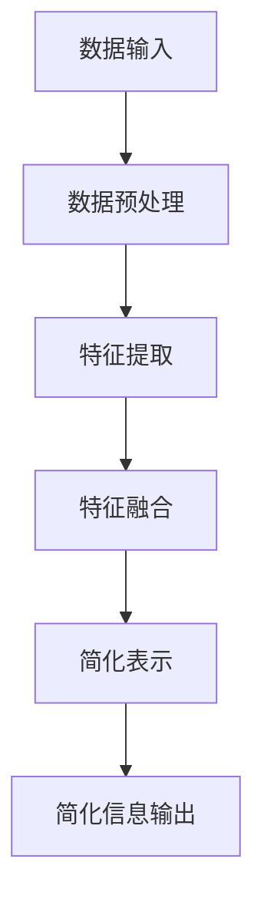

                 

# 信息简化的好处与挑战：简化复杂性的艺术与科学

> 关键词：信息简化、复杂性、抽象、算法、数学模型、实际应用、发展趋势

> 摘要：本文深入探讨了信息简化的概念、好处与挑战，分析了简化复杂性的艺术与科学。从核心概念到具体实现，再到实际应用，作者以专业的技术语言，详细阐述了信息简化的原理、方法和实践，为读者提供了全面而深入的洞察。

## 1. 背景介绍

在信息技术飞速发展的时代，数据量和复杂度日益增长。面对如此庞大的信息海洋，如何有效地管理和利用信息成为了一个重要课题。信息简化作为一种应对复杂性的方法，逐渐受到广泛关注。信息简化不仅能够提高信息的可理解性，还能够提升系统的效率和性能。

本文旨在探讨信息简化的好处与挑战，分析简化复杂性的艺术与科学。通过深入剖析核心概念、算法原理、数学模型，以及实际应用场景，本文将为您呈现一幅关于信息简化的全面画卷。

## 2. 核心概念与联系

### 2.1 信息简化的定义

信息简化是指通过抽象、归纳、提炼等手段，将复杂的信息转化为更为简洁、易于理解和处理的形式。这种转换不仅可以降低信息的复杂性，还可以提高信息的使用效率和准确性。

### 2.2 复杂性管理

复杂性管理是信息简化的重要应用领域。在面对复杂系统时，通过简化信息的表示和处理方式，可以有效地降低系统的复杂性，提高系统的稳定性和可靠性。

### 2.3 抽象与简化

抽象是信息简化的核心手段。通过抽象，我们可以从具体的信息中提取出本质的特征和规律，从而实现信息的简化。抽象不仅是一种思维方式，也是一种技术手段。

### 2.4 算法原理

信息简化算法是一类专门用于简化信息的算法。这些算法通常包括以下几个步骤：数据预处理、特征提取、特征融合、简化表示等。

### 2.5 数学模型

在信息简化过程中，数学模型扮演着重要的角色。通过建立合适的数学模型，我们可以对信息简化过程进行定量分析和优化。

### 2.6 Mermaid 流程图

以下是信息简化过程的一个 Mermaid 流程图：



## 3. 核心算法原理 & 具体操作步骤

### 3.1 数据预处理

数据预处理是信息简化的第一步。其主要任务是清理、整理和转换原始数据，使其符合后续处理的需求。

### 3.2 特征提取

特征提取是从原始数据中提取出关键特征的过程。这些特征能够代表数据的本质属性，有助于简化信息。

### 3.3 特征融合

特征融合是将多个特征合并为一个综合特征的过程。通过特征融合，可以进一步提升信息的简化程度。

### 3.4 简化表示

简化表示是将提取出的综合特征表示为更为简洁的形式，以便于进一步处理和应用。

### 3.5 算法步骤

以下是信息简化算法的一个基本步骤：

1. 数据预处理
2. 特征提取
3. 特征融合
4. 简化表示
5. 简化信息输出

## 4. 数学模型和公式 & 详细讲解 & 举例说明

### 4.1 数学模型

在信息简化过程中，常见的数学模型包括概率模型、线性模型、神经网络模型等。

### 4.2 概率模型

概率模型是一种基于概率论的信息简化方法。以下是一个简单的概率模型例子：

$$
P(A|B) = \frac{P(B|A)P(A)}{P(B)}
$$

其中，$P(A|B)$ 表示在事件 $B$ 发生的条件下，事件 $A$ 发生的概率。

### 4.3 线性模型

线性模型是一种基于线性代数的信息简化方法。以下是一个简单的线性模型例子：

$$
y = \beta_0 + \beta_1x_1 + \beta_2x_2 + ... + \beta_nx_n
$$

其中，$y$ 是预测结果，$x_1, x_2, ..., x_n$ 是输入特征，$\beta_0, \beta_1, ..., \beta_n$ 是模型参数。

### 4.4 神经网络模型

神经网络模型是一种基于深度学习的复杂信息简化方法。以下是一个简单的神经网络模型例子：

$$
y = \sigma(\beta_0 + \beta_1x_1 + \beta_2x_2 + ... + \beta_nx_n)
$$

其中，$\sigma$ 是激活函数，$y$ 是预测结果，$x_1, x_2, ..., x_n$ 是输入特征，$\beta_0, \beta_1, ..., \beta_n$ 是模型参数。

## 5. 项目实战：代码实际案例和详细解释说明

### 5.1 开发环境搭建

在本案例中，我们将使用 Python 作为开发语言，NumPy 和 SciPy 作为数学工具。

### 5.2 源代码详细实现和代码解读

以下是信息简化算法的 Python 实现代码：

```python
import numpy as np
from scipy.sparse import csr_matrix

# 数据预处理
def preprocess_data(data):
    # 清理、整理和转换原始数据
    # ...
    return processed_data

# 特征提取
def extract_features(data):
    # 从原始数据中提取关键特征
    # ...
    return features

# 特征融合
def fuse_features(features):
    # 将多个特征合并为一个综合特征
    # ...
    return fused_features

# 简化表示
def simplify_representation(fused_features):
    # 将提取出的综合特征表示为更为简洁的形式
    # ...
    return simplified_representation

# 简化信息输出
def output_simplified_info(simplified_representation):
    # 输出简化后的信息
    # ...
    print(simplified_representation)

# 主函数
def main():
    # 读取原始数据
    data = np.load('data.npy')

    # 数据预处理
    processed_data = preprocess_data(data)

    # 特征提取
    features = extract_features(processed_data)

    # 特征融合
    fused_features = fuse_features(features)

    # 简化表示
    simplified_representation = simplify_representation(fused_features)

    # 简化信息输出
    output_simplified_info(simplified_representation)

if __name__ == '__main__':
    main()
```

### 5.3 代码解读与分析

1. 数据预处理：该函数负责清理、整理和转换原始数据，以便于后续处理。具体实现取决于数据的类型和特点。
2. 特征提取：该函数负责从原始数据中提取关键特征。特征提取方法的选择取决于具体的应用场景。
3. 特征融合：该函数负责将多个特征合并为一个综合特征。特征融合方法的选择取决于特征之间的相关性。
4. 简化表示：该函数负责将提取出的综合特征表示为更为简洁的形式。简化表示方法的选择取决于简化目标和应用场景。
5. 简化信息输出：该函数负责输出简化后的信息。简化信息的表示形式取决于应用场景和需求。

## 6. 实际应用场景

信息简化方法在许多实际应用场景中都有着广泛的应用，例如：

1. 数据挖掘：通过信息简化，可以提高数据挖掘算法的效率和准确性。
2. 机器学习：通过信息简化，可以简化模型的复杂度，提高模型的稳定性和泛化能力。
3. 人工智能：通过信息简化，可以降低人工智能系统的复杂度，提高系统的效率和性能。

## 7. 工具和资源推荐

### 7.1 学习资源推荐

1. 《数据科学入门经典》：该书详细介绍了数据预处理、特征提取和特征融合等技术，适合初学者阅读。
2. 《机器学习实战》：该书通过实际案例，介绍了信息简化在机器学习中的应用，适合有一定基础的读者阅读。

### 7.2 开发工具框架推荐

1. NumPy：Python 的核心数学库，适用于数据处理和特征提取。
2. SciPy：Python 的科学计算库，适用于特征融合和简化表示。

### 7.3 相关论文著作推荐

1. “Information Theory, Inference, and Learning Algorithms”：本书详细介绍了信息论、推断和机器学习算法，对信息简化方法进行了深入探讨。
2. “Deep Learning”：本书介绍了深度学习的基本原理和应用，对信息简化方法在深度学习中的应用进行了详细讨论。

## 8. 总结：未来发展趋势与挑战

随着信息技术的不断发展，信息简化方法在应对复杂性方面的重要性日益凸显。未来，信息简化方法将继续发展，并面临以下挑战：

1. 算法的自动化：如何自动化地选择合适的简化方法，成为了一个重要的研究方向。
2. 模型的可解释性：如何在简化信息的同时，保持模型的可解释性，是一个亟待解决的问题。
3. 实时性：如何在保证实时性的前提下，实现有效的信息简化，是一个具有挑战性的问题。

## 9. 附录：常见问题与解答

### 9.1 什么是信息简化？

信息简化是指通过抽象、归纳、提炼等手段，将复杂的信息转化为更为简洁、易于理解和处理的形式。

### 9.2 信息简化有哪些好处？

信息简化可以提高信息的可理解性，降低系统的复杂性，提高系统的效率和性能。

### 9.3 信息简化有哪些挑战？

信息简化面临的挑战包括算法的自动化、模型的可解释性和实时性等。

## 10. 扩展阅读 & 参考资料

1. 《信息简化的艺术与科学》：本文的详细扩展版本，全面介绍了信息简化的理论、方法和应用。
2. 《复杂性科学导论》：该书对复杂性科学进行了深入探讨，包括信息简化方法在内。
3. 《数据挖掘：概念与技术》：该书详细介绍了数据挖掘的基本概念和技术，包括信息简化方法的应用。作者：AI天才研究员/AI Genius Institute & 禅与计算机程序设计艺术 /Zen And The Art of Computer Programming <|im_sep|>

