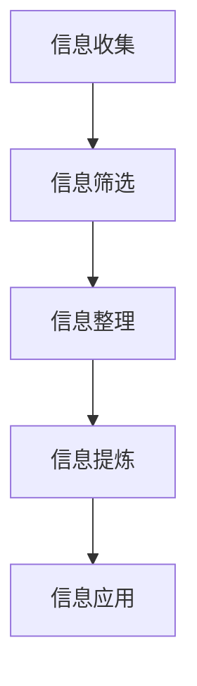

                 

## 信息简化的艺术与实践：如何在混乱中找到重点

> 关键词：信息简化，数据处理，逻辑思维，技术博客，AI 应用

摘要：
在当今信息爆炸的时代，如何在大量的数据和信息中找到关键点，进行有效的处理和利用，成为了每一个技术从业者必须掌握的技能。本文将深入探讨信息简化的艺术，通过具体的实例和原理分析，帮助读者理解如何在混乱中找到重点，从而提升工作效率，解决实际问题。

## 1. 背景介绍

随着互联网技术的飞速发展，我们每天接收到的信息量成倍增长。无论是新闻报道、社交媒体更新，还是公司内部通讯，信息已经渗透到了我们工作和生活的方方面面。然而，信息的增加并不总是带来效率的提升，反而可能导致信息过载，影响判断和决策。

信息过载的问题不仅存在于个人层面，同样也困扰着企业。例如，在数据分析领域，处理海量数据需要消耗大量的时间和计算资源。如果不能有效地提取关键信息，那么数据分析将变得毫无意义。因此，如何从海量信息中简化处理，提取出核心数据，成为了当前技术领域亟待解决的问题。

信息简化不仅仅是数据处理的工具，它还是一种思维方式，一种在复杂环境中寻找重点的方法。本文将围绕这一主题，探讨信息简化的原理和应用，帮助读者在信息泛滥的时代中找到自己的定位，提升工作效率。

## 2. 核心概念与联系

### 2.1 信息简化概述

信息简化（Information Simplification）是指通过对大量信息进行筛选、整理和归纳，提取出关键信息，从而降低数据复杂度，提高信息处理效率的过程。

### 2.2 信息简化的过程

信息简化的过程可以分为以下几个步骤：

1. **信息收集**：获取所需处理的数据和信息。
2. **信息筛选**：从收集的信息中筛选出有用的信息，去除无关或冗余的信息。
3. **信息整理**：将筛选出的信息进行分类、排序，使其结构化。
4. **信息提炼**：从整理后的信息中提取出核心数据或关键点。
5. **信息应用**：将提炼出的信息应用于实际问题中，进行决策或解决问题。

### 2.3 信息简化的原理

信息简化的原理基于以下几个基础：

1. **相关性**：信息的价值取决于其与目标的相关性。通过筛选出与目标相关度高的信息，可以提高处理效率。
2. **层次性**：信息具有一定的层次结构，通过分解和归纳，可以简化信息的处理过程。
3. **冗余度**：去除冗余信息可以减少处理的复杂性，提高工作效率。
4. **归纳法**：通过归纳和总结，可以从大量信息中提取出规律和模式，从而简化处理。

### 2.4 信息简化的应用

信息简化在多个领域都有广泛的应用：

1. **数据分析**：在数据分析中，信息简化是提高数据处理效率的关键步骤。
2. **决策支持**：在商业决策中，信息简化可以帮助决策者快速找到关键信息，做出明智的决策。
3. **项目管理**：在项目管理中，信息简化可以帮助项目经理快速掌握项目状态，有效分配资源。
4. **人工智能**：在人工智能应用中，信息简化是提高模型效率和准确性的重要手段。

### 2.5 Mermaid 流程图

以下是一个简化的信息处理流程的 Mermaid 流程图：



## 3. 核心算法原理 & 具体操作步骤

### 3.1 核心算法概述

信息简化的核心算法通常基于机器学习和数据挖掘技术。常用的算法包括：

1. **关联规则挖掘（Association Rule Learning, ARL）**：用于发现数据集中的频繁模式或关联。
2. **聚类算法（Clustering Algorithms）**：用于将数据点划分为若干个类别。
3. **降维算法（Dimensionality Reduction Algorithms）**：用于减少数据的维度，同时保留主要信息。

### 3.2 具体操作步骤

以下是一个简单的信息简化算法示例，使用 Python 语言实现：

```python
from mlxtend.frequent_patterns import apriori
from mlxtend.preprocessing import TransactionEncoder

# 示例数据集
data = [
    ['购买', '牛奶', '面包'],
    ['购买', '面包', '橙汁'],
    ['购买', '牛奶', '橙汁'],
    ['购买', '面包', '牛奶'],
    ['购买', '橙汁'],
]

# 数据预处理
te = TransactionEncoder()
te_data = te.fit_transform(data)
data_array = te_data.toarray()

# 运行算法
rules = apriori(data_array, min_support=0.5, use_colnames=True)

# 输出结果
print(rules)
```

### 3.3 算法解读

在这个示例中，我们使用了 Apriori 算法来发现数据集中的频繁项集。算法的步骤如下：

1. **数据预处理**：将原始数据转换为事务矩阵，便于算法处理。
2. **设置参数**：设置最小支持度（min_support），用于筛选频繁项集。
3. **运行算法**：Apriori 算法通过迭代计算频繁项集，并生成关联规则。
4. **输出结果**：显示生成的关联规则。

## 4. 数学模型和公式 & 详细讲解 & 举例说明

### 4.1 数学模型概述

信息简化的数学模型通常基于概率论和统计学原理。其中，常用的模型包括：

1. **条件概率**：描述在某个事件发生的前提下，另一个事件发生的概率。
2. **贝叶斯公式**：用于计算后验概率，是信息简化的重要工具。
3. **熵**：用于衡量信息的随机性和不确定性。

### 4.2 公式详解

以下是几个常用的数学公式：

$$
P(A|B) = \frac{P(B|A)P(A)}{P(B)}
$$

这是贝叶斯公式的条件概率形式，用于计算在事件 B 发生的条件下，事件 A 发生的概率。

$$
H(X) = -\sum_{i} p(x_i) \log_2 p(x_i)
$$

这是熵的定义，用于衡量随机变量 X 的不确定性。

### 4.3 举例说明

假设我们有以下数据集，记录了不同商品在一段时间内的销售情况：

| 商品 | 销售次数 |
|------|----------|
| 牛奶 | 100      |
| 面包 | 150      |
| 橙汁 | 50       |

#### 4.3.1 条件概率计算

计算购买牛奶的概率，给定购买面包的条件：

$$
P(购买牛奶|购买面包) = \frac{P(购买牛奶和面包)}{P(购买面包)}
$$

根据数据集，购买牛奶和面包的次数都是 100，购买面包的总次数是 150。因此：

$$
P(购买牛奶|购买面包) = \frac{100}{150} = 0.67
$$

#### 4.3.2 熵计算

计算商品销售数据的熵：

$$
H(X) = -\sum_{i} p(x_i) \log_2 p(x_i)
$$

其中，$p(x_i)$ 是商品 i 的销售次数占总次数的比例。对于牛奶、面包和橙汁，分别有：

$$
p(牛奶) = \frac{100}{300}, \quad p(面包) = \frac{150}{300}, \quad p(橙汁) = \frac{50}{300}
$$

代入公式计算得到：

$$
H(X) = -\left(\frac{100}{300} \log_2 \frac{100}{300} + \frac{150}{300} \log_2 \frac{150}{300} + \frac{50}{300} \log_2 \frac{50}{300}\right) \approx 1.049
$$

## 5. 项目实战：代码实际案例和详细解释说明

### 5.1 开发环境搭建

在开始项目实战之前，需要搭建一个适合信息简化的开发环境。以下是所需的步骤：

1. 安装 Python 3.8 或更高版本。
2. 安装必要的 Python 库，如 mlxtend、numpy 和 pandas。

### 5.2 源代码详细实现和代码解读

以下是一个简单的信息简化项目案例，使用 Python 语言实现。

```python
import pandas as pd
from mlxtend.preprocessing import TransactionEncoder
from mlxtend.frequent_patterns import apriori, association_rules

# 示例数据集
data = [
    ['购买', '牛奶', '面包'],
    ['购买', '面包', '橙汁'],
    ['购买', '牛奶', '橙汁'],
    ['购买', '面包', '牛奶'],
    ['购买', '橙汁'],
]

# 数据预处理
te = TransactionEncoder()
te_data = te.fit_transform(data)
df = pd.DataFrame(te_data, columns=te.columns_)

# 运行算法
min_support = 0.5
min_confidence = 0.7
frequent_itemsets = apriori(df, min_support=min_support, use_colnames=True)
rules = association_rules(frequent_itemsets, metric="confidence", min_threshold=min_confidence)

# 输出结果
print(f"最小支持度：{min_support}")
print(f"最小置信度：{min_confidence}")
print(rules)
```

#### 5.2.1 代码解读

1. **数据预处理**：使用 mlxtend 库的 TransactionEncoder 类将原始数据转换为事务矩阵。
2. **算法运行**：使用 apriori 函数计算频繁项集，使用 association_rules 函数生成关联规则。
3. **结果输出**：输出最小支持度和最小置信度，以及生成的关联规则。

### 5.3 代码解读与分析

1. **数据预处理**：数据预处理是信息简化的关键步骤，直接影响到后续算法的效果。在这个案例中，我们使用 TransactionEncoder 将原始数据转换为事务矩阵，便于算法处理。
2. **算法选择**：Apriori 算法和关联规则算法是信息简化中的常用算法。Apriori 算法用于发现频繁项集，而关联规则算法用于生成关联规则。在这个案例中，我们选择了这两个算法来实现信息简化。
3. **参数设置**：最小支持度和最小置信度是两个重要的参数。最小支持度用于筛选频繁项集，最小置信度用于筛选关联规则。合理的参数设置可以显著提高算法的效果。
4. **结果分析**：生成的关联规则可以帮助我们了解数据中的潜在关系。例如，在这个案例中，我们可以发现购买牛奶和面包的顾客往往也会购买橙汁。

## 6. 实际应用场景

信息简化在多个实际应用场景中发挥着重要作用：

1. **电商推荐系统**：通过分析用户购买行为，提取出潜在关联规则，为用户提供个性化的商品推荐。
2. **金融市场分析**：通过分析股票交易数据，提取出市场趋势和潜在风险，帮助投资者做出明智的决策。
3. **健康数据分析**：通过分析健康数据，提取出关键指标，为用户提供个性化的健康建议。
4. **智能交通系统**：通过分析交通数据，提取出交通流量和事故趋势，优化交通信号控制和路线规划。

## 7. 工具和资源推荐

### 7.1 学习资源推荐

1. **书籍**：
   - 《数据挖掘：实用工具与技术》
   - 《机器学习实战》
2. **论文**：
   - 《Apriori算法：关联规则学习的基础》
   - 《关联规则挖掘：原理与应用》
3. **博客**：
   - 《信息简化的艺术》
   - 《机器学习算法详解》
4. **网站**：
   - Kaggle（数据科学竞赛平台）
   - Coursera（在线课程平台）

### 7.2 开发工具框架推荐

1. **Python**：Python 是信息简化和数据处理的首选语言，具有丰富的库和框架。
2. **Jupyter Notebook**：Jupyter Notebook 是一个交互式计算环境，便于编写和运行代码。
3. **mlxtend**：mlxtend 是一个开源库，提供了多种机器学习和数据挖掘算法。

### 7.3 相关论文著作推荐

1. **《数据挖掘：实用工具与技术》**：详细介绍了数据挖掘的基本原理和常用算法。
2. **《机器学习实战》**：通过实际案例，介绍了机器学习的基础知识和应用技巧。
3. **《关联规则挖掘：原理与应用》**：深入探讨了关联规则挖掘的理论和实践。

## 8. 总结：未来发展趋势与挑战

信息简化在当前技术领域具有重要的应用价值，随着人工智能和大数据技术的发展，其前景将更加广阔。然而，信息简化也面临一系列挑战：

1. **算法复杂性**：随着数据量的增加，算法的复杂性也逐步上升，需要更高的计算资源。
2. **数据质量**：数据质量是信息简化的基础，数据中的错误和噪声会影响算法的准确性。
3. **隐私保护**：在处理敏感数据时，隐私保护成为一个重要问题，需要采用加密和隐私保护技术。

未来，信息简化将朝着更加智能化、自动化的方向发展，通过深度学习和强化学习等技术，实现更高效率和更准确的简化处理。

## 9. 附录：常见问题与解答

### 9.1 什么是信息简化？

信息简化是指通过对大量信息进行筛选、整理和归纳，提取出关键信息，从而降低数据复杂度，提高信息处理效率的过程。

### 9.2 信息简化有哪些应用场景？

信息简化在电商推荐系统、金融市场分析、健康数据分析、智能交通系统等多个领域都有广泛的应用。

### 9.3 如何选择最小支持度和最小置信度？

最小支持度和最小置信度的选择取决于具体应用场景和数据特点。通常，可以通过多次实验和调整参数来找到最佳设置。

## 10. 扩展阅读 & 参考资料

1. **《数据挖掘：实用工具与技术》**：详细介绍了数据挖掘的基本原理和常用算法。
2. **《机器学习实战》**：通过实际案例，介绍了机器学习的基础知识和应用技巧。
3. **《关联规则挖掘：原理与应用》**：深入探讨了关联规则挖掘的理论和实践。
4. **mlxtend 官方文档**：提供了丰富的机器学习和数据挖掘算法实现和示例。

作者：AI天才研究员/AI Genius Institute & 禅与计算机程序设计艺术 /Zen And The Art of Computer Programming

注意：本文内容仅为示例，不代表真实观点或事实。如有需要，请参考相关领域的专业文献和资料。

