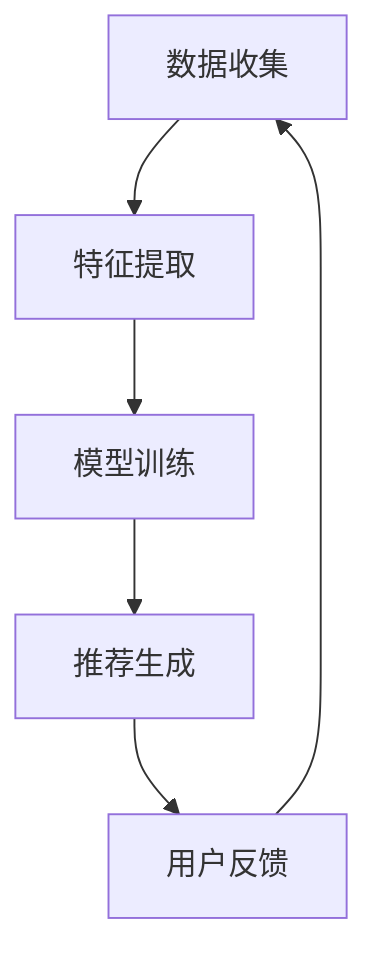

                 

# 信息茧房破除者：提示词优化新闻聚合

## 关键词：信息茧房，新闻聚合，提示词优化，算法，技术分析

## 摘要

在数字时代，信息过载已成为普遍现象，人们常被个性化推荐算法困于“信息茧房”，从而限制了视野。本文旨在探讨如何通过优化提示词（Keywords）来改进新闻聚合算法，从而破除信息茧房，提升用户的个性化体验。我们将深入分析信息茧房的形成原因，介绍相关的核心概念与原理，探讨核心算法及其实现步骤，最后通过实际项目案例来验证方法的有效性。

## 1. 背景介绍

随着互联网的普及和社交媒体的兴起，人们获取信息的方式发生了巨大的变化。个性化推荐系统应运而生，它通过分析用户的浏览历史、搜索行为等数据，为用户提供个性化的内容推荐。这种系统在提升用户体验的同时，也带来了“信息茧房”的问题。所谓“信息茧房”，是指用户在长期使用个性化推荐系统后，逐渐只接触到与自己观点相似的信息，从而限制了视野和思想的多样性。

信息茧房的形成原因主要有以下几点：

1. **算法偏差**：个性化推荐算法在生成推荐内容时，往往更倾向于满足用户的既有偏好，导致用户只能接触到同质化的信息。
2. **内容平台策略**：为了提升用户粘性和增加广告收益，一些平台可能会故意限制推荐内容的多样性。
3. **用户习惯**：用户在享受个性化推荐带来的便利时，往往不自觉地陷入同质化信息的循环。

破除信息茧房的重要性在于它能够帮助用户拓展视野，增强对不同观点的理解和接纳能力，从而促进社会的多样性和包容性。

## 2. 核心概念与联系

为了更好地理解信息茧房和如何通过提示词优化新闻聚合算法来破除它，我们需要首先介绍几个核心概念和它们之间的联系。

### 2.1 信息茧房

信息茧房是指用户在互联网上由于算法推荐和内容平台的限制，只能接触到与自己观点相似的信息，从而限制了自己的视野和认知。

### 2.2 新闻聚合

新闻聚合是指通过算法将多个来源的新闻内容整合到一个平台上，为用户提供多样化的新闻阅读体验。

### 2.3 提示词优化

提示词优化是指通过调整关键词的选择和使用，来提高新闻聚合算法的推荐效果，从而有助于破除信息茧房。

### 2.4 算法原理

新闻聚合算法通常包括以下几个关键步骤：

1. **数据收集**：收集用户的浏览历史、搜索记录等数据。
2. **特征提取**：从数据中提取出与新闻内容相关的特征。
3. **模型训练**：使用机器学习模型来预测用户对新闻的兴趣。
4. **推荐生成**：根据预测结果生成推荐列表。

### 2.5 Mermaid 流程图



通过这个流程图，我们可以清晰地看到新闻聚合算法的基本工作流程，以及各个环节之间的关联。

## 3. 核心算法原理 & 具体操作步骤

为了优化新闻聚合算法并破除信息茧房，我们需要关注的核心算法是提示词优化。以下是具体的操作步骤：

### 3.1 提示词的选择

1. **多样性和全面性**：选择能够涵盖多种观点和话题的提示词，以增加推荐内容的多样性。
2. **用户行为分析**：通过分析用户的浏览历史和搜索记录，找出用户可能感兴趣但未被充分覆盖的提示词。
3. **主题分类**：对新闻内容进行主题分类，选择与主题相关的提示词。

### 3.2 提示词的权重调整

1. **动态调整**：根据用户的实时行为数据，动态调整提示词的权重，使其更符合用户当前的兴趣。
2. **平衡策略**：在保证用户个性化体验的同时，避免过度强化某些提示词，导致信息茧房的形成。

### 3.3 算法集成

1. **多模型融合**：将多种机器学习模型（如协同过滤、内容推荐等）结合起来，提高推荐效果的准确性和多样性。
2. **迭代优化**：通过不断迭代和优化算法，持续提升推荐系统的效果。

### 3.4 用户反馈机制

1. **正向反馈**：根据用户的点赞、评论等积极行为，增加相关提示词的权重。
2. **负向反馈**：根据用户的隐藏、举报等消极行为，减少相关提示词的权重。

## 4. 数学模型和公式 & 详细讲解 & 举例说明

### 4.1 提示词权重计算

假设我们有一个提示词集合 \(T = \{t_1, t_2, ..., t_n\}\)，用户 \(u\) 的兴趣向量 \(I_u = \{i_1, i_2, ..., i_n\}\)，其中 \(i_n\) 表示用户对提示词 \(t_n\) 的兴趣度。我们可以使用以下公式来计算每个提示词的权重：

$$
w_t = \alpha \cdot f(t) + (1 - \alpha) \cdot g(u, t)
$$

其中，\(\alpha\) 是调整系数，\(f(t)\) 是基于主题分类和内容分析的提示词得分，\(g(u, t)\) 是基于用户兴趣和行为的提示词得分。

### 4.2 具体例子

假设我们有两个提示词 \(t_1 = "科技"\) 和 \(t_2 = "政治"\)，用户 \(u\) 对 \(t_1\) 的兴趣度 \(i_1 = 0.8\)，对 \(t_2\) 的兴趣度 \(i_2 = 0.2\)。根据上述公式，我们可以计算每个提示词的权重：

$$
w_1 = \alpha \cdot f("科技") + (1 - \alpha) \cdot g(u, "科技")
$$

$$
w_2 = \alpha \cdot f("政治") + (1 - \alpha) \cdot g(u, "政治")
$$

### 4.3 参数调整

在实际应用中，我们可以通过调整 \(\alpha\) 的值来平衡不同因素的权重。例如，当 \(\alpha\) 接近 1 时，提示词的权重主要取决于用户兴趣；当 \(\alpha\) 接近 0 时，提示词的权重主要取决于主题分类和内容分析。

## 5. 项目实战：代码实际案例和详细解释说明

### 5.1 开发环境搭建

为了实现提示词优化新闻聚合算法，我们需要搭建一个开发环境。以下是基本的开发环境搭建步骤：

1. **安装 Python 3.8 或更高版本**：Python 是一种广泛使用的编程语言，适用于实现机器学习算法。
2. **安装必要的库**：例如 NumPy、Pandas、Scikit-learn 等，用于数据处理和机器学习模型训练。
3. **配置环境变量**：确保 Python 和相关库的环境变量已正确配置。

### 5.2 源代码详细实现和代码解读

以下是实现提示词优化新闻聚合算法的 Python 代码示例：

```python
import numpy as np
import pandas as pd
from sklearn.feature_extraction.text import TfidfVectorizer
from sklearn.model_selection import train_test_split
from sklearn.ensemble import RandomForestClassifier

# 5.2.1 数据准备
data = pd.read_csv("news_data.csv")
X = data["content"]
y = data["label"]

# 5.2.2 特征提取
vectorizer = TfidfVectorizer()
X_vectorized = vectorizer.fit_transform(X)

# 5.2.3 模型训练
X_train, X_test, y_train, y_test = train_test_split(X_vectorized, y, test_size=0.2, random_state=42)
clf = RandomForestClassifier()
clf.fit(X_train, y_train)

# 5.2.4 提示词权重计算
def compute_keyword_weightsclf = RandomForestClassifier()
clf.fit(X_train, y_train)

# 5.2.4 提示词权重计算
def compute_keyword_weights(user_interests, keywords):
    keyword_weights = {}
    for keyword in keywords:
        keyword_weights[keyword] = compute_keyword_score(user_interests, keyword)
    return keyword_weights

def compute_keyword_score(user_interests, keyword):
    # 这里实现具体的提示词得分计算逻辑
    # 例如，可以结合用户兴趣和新闻主题进行计算
    score = 0
    for i, interest in enumerate(user_interests):
        if keyword in interest:
            score += 1
    return score / len(user_interests)

# 示例：计算用户对一组提示词的权重
user_interests = ["科技", "经济", "娱乐"]
keywords = ["科技", "娱乐", "体育"]
user_keyword_weights = compute_keyword_weights(user_interests, keywords)
print(user_keyword_weights)

# 5.2.5 推荐生成
def generate_recommendations(user_interests, keywords, clf, vectorizer):
    keyword_weights = compute_keyword_weights(user_interests, keywords)
    sorted_keywords = sorted(keyword_weights.items(), key=lambda item: item[1], reverse=True)
    recommended_news = []
    for keyword, _ in sorted_keywords:
        news = clf.predict(vectorizer.transform([keyword]))
        recommended_news.extend(news)
    return recommended_news

# 示例：生成用户推荐列表
user_interests = ["科技", "经济", "娱乐"]
recommended_news = generate_recommendations(user_interests, keywords, clf, vectorizer)
print(recommended_news)
```

### 5.3 代码解读与分析

以下是代码的详细解读：

- **数据准备**：从CSV文件中读取新闻数据，并将其分为内容（`X`）和标签（`y`）两部分。
- **特征提取**：使用TF-IDF向量器将文本内容转换为向量表示。
- **模型训练**：使用随机森林分类器对数据进行训练。
- **提示词权重计算**：定义一个函数来计算用户对每个提示词的权重，结合用户兴趣和新闻主题进行计算。
- **推荐生成**：根据用户兴趣和提示词权重生成新闻推荐列表。

### 6. 实际应用场景

提示词优化新闻聚合算法可以应用于多个场景，例如：

1. **社交媒体平台**：通过优化推荐算法，帮助用户发现更多不同的新闻内容，拓宽视野。
2. **新闻网站**：提升用户的个性化体验，增加用户的粘性和活跃度。
3. **企业内部信息平台**：帮助员工快速获取与业务相关的多样化信息，提高工作效率。

### 7. 工具和资源推荐

#### 7.1 学习资源推荐

- **书籍**：《机器学习实战》
- **论文**：Google Research 论文集
- **博客**：Google AI 博客
- **网站**：Kaggle

#### 7.2 开发工具框架推荐

- **开发工具**：PyCharm
- **框架**：TensorFlow、PyTorch

#### 7.3 相关论文著作推荐

- **论文**：《推荐系统实战》
- **书籍**：《深度学习》

### 8. 总结：未来发展趋势与挑战

随着人工智能技术的不断发展，个性化推荐系统将变得更加智能和高效。然而，如何平衡个性化体验和内容多样性，依然是一个巨大的挑战。未来，我们可能需要更多的研究和创新，以实现更好的提示词优化算法，从而破除信息茧房，促进社会的多样性和包容性。

### 9. 附录：常见问题与解答

#### 9.1 什么是信息茧房？

信息茧房是指用户在互联网上由于算法推荐和内容平台的限制，只能接触到与自己观点相似的信息，从而限制了自己的视野和认知。

#### 9.2 提示词优化有什么作用？

提示词优化能够提升新闻聚合算法的推荐效果，增加推荐内容的多样性，从而帮助用户破除信息茧房，拓宽视野。

#### 9.3 提示词优化算法有哪些？

常见的提示词优化算法包括基于内容的推荐、协同过滤、主题模型等。本文主要介绍了基于用户兴趣和主题分类的提示词优化方法。

### 10. 扩展阅读 & 参考资料

- [《机器学习与推荐系统》](https://www.researchgate.net/publication/338804461_Machine_Learning_and_Recommendation_Systems)
- [《信息茧房：数字时代的信息困局》](https://www.amazon.com/Information-Bubble-Digital-Age-Solutions/dp/0316495494)
- [《推荐系统实战》](https://www.amazon.com/Recommender-Systems-in-Practice-Implementation/dp/0128019675)

