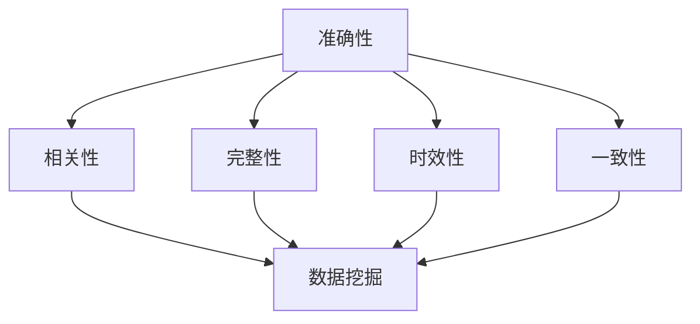
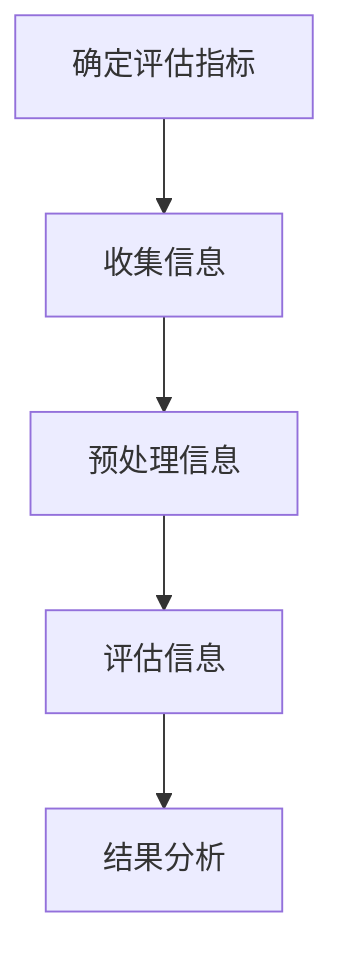

                 

# 信息过载与信息质量评估：如何批判性地评估和消费信息

## 关键词：信息过载、信息质量评估、批判性思考、数据可视化、人工智能

## 摘要

在数字时代，信息过载已成为一种普遍现象，给我们的日常生活和工作带来了巨大挑战。本文旨在探讨如何批判性地评估和消费信息，以应对信息过载的问题。通过分析信息质量评估的核心概念、算法原理，以及实际应用场景，本文为读者提供了一系列实用的工具和资源，帮助他们提升信息识别和筛选能力，从而在信息海洋中游刃有余。

## 1. 背景介绍

### 1.1 信息过载现象

随着互联网和移动设备的普及，我们每天接触到的大量信息已经远远超出了人类的处理能力。据统计，全球每天产生的数据量高达2.5亿GB，其中包含文本、图片、音频和视频等多种形式。面对如此海量的信息，我们很容易陷入信息过载的困境。

### 1.2 信息质量评估的重要性

信息过载不仅导致我们无法有效处理信息，还可能引发焦虑、分心和判断失误等问题。因此，对信息质量进行评估和筛选成为一项重要任务。高质量的信息可以帮助我们做出明智的决策，提升工作效率和生活质量。

### 1.3 标题解析

本文标题《信息过载与信息质量评估：如何批判性地评估和消费信息》主要从三个方面进行探讨：

1. **信息过载**：分析信息过载现象及其影响。
2. **信息质量评估**：介绍信息质量评估的核心概念和算法原理。
3. **批判性评估与消费**：探讨如何批判性地评估和消费信息，以应对信息过载。

## 2. 核心概念与联系

### 2.1 信息质量评估的核心概念

信息质量评估包括以下几个方面：

1. **准确性**：信息是否真实、可靠。
2. **相关性**：信息是否与需求相关。
3. **完整性**：信息是否提供了完整的信息。
4. **时效性**：信息是否反映了当前的情况。
5. **一致性**：信息是否与其他信息保持一致。

### 2.2 信息质量评估与相关领域的联系

信息质量评估与以下领域密切相关：

1. **数据挖掘**：通过挖掘大量数据，找出有价值的信息。
2. **机器学习**：利用算法和模型对信息进行分类、筛选和评估。
3. **人工智能**：通过模拟人类思维过程，实现对信息的智能处理。

### 2.3 Mermaid 流程图

以下是一个简单的 Mermaid 流程图，展示了信息质量评估的核心概念及其相互关系：



## 3. 核心算法原理 & 具体操作步骤

### 3.1 核心算法原理

信息质量评估的核心算法通常基于以下几种方法：

1. **基于规则的评估方法**：根据预定义的规则对信息进行评估。
2. **机器学习评估方法**：利用机器学习算法，对大量信息进行评估。
3. **数据挖掘评估方法**：通过数据挖掘技术，找出有价值的信息。

### 3.2 具体操作步骤

1. **确定评估指标**：根据需求，确定需要评估的指标。
2. **收集信息**：从各种来源收集信息。
3. **预处理信息**：对收集到的信息进行清洗、去重和格式化。
4. **评估信息**：根据评估指标，对信息进行评估。
5. **结果分析**：对评估结果进行分析，找出有价值的信息。

### 3.3 流程图

以下是一个简单的 Mermaid 流程图，展示了信息质量评估的核心算法原理和具体操作步骤：



## 4. 数学模型和公式 & 详细讲解 & 举例说明

### 4.1 数学模型

信息质量评估的数学模型通常基于以下公式：

$$
Q = \frac{1}{n}\sum_{i=1}^{n} w_i \cdot r_i
$$

其中，$Q$ 表示信息质量得分，$w_i$ 表示第 $i$ 个指标的权重，$r_i$ 表示第 $i$ 个指标的实际得分。

### 4.2 详细讲解

1. **权重分配**：根据指标的重要程度，为每个指标分配权重。通常，可以使用专家评估法、层次分析法（AHP）等方法确定权重。
2. **指标得分计算**：根据指标的定义和实际情况，为每个指标计算实际得分。例如，对于准确性指标，可以计算正确率；对于相关性指标，可以计算相关性系数。
3. **质量得分计算**：根据权重和得分，计算信息质量得分。质量得分越高，信息质量越好。

### 4.3 举例说明

假设有一个包含3个信息的文本，我们需要评估其质量。三个指标的权重分别为：准确性（0.5），相关性（0.3），完整性（0.2）。具体得分如下：

- 准确性：信息1为0.8，信息2为0.9，信息3为0.7。
- 相关性：信息1为0.4，信息2为0.6，信息3为0.5。
- 完整性：信息1为0.6，信息2为0.5，信息3为0.7。

根据公式，计算每个信息的质量得分：

$$
Q_1 = \frac{1}{3} \cdot (0.5 \cdot 0.8 + 0.3 \cdot 0.4 + 0.2 \cdot 0.6) = 0.54
$$

$$
Q_2 = \frac{1}{3} \cdot (0.5 \cdot 0.9 + 0.3 \cdot 0.6 + 0.2 \cdot 0.5) = 0.59
$$

$$
Q_3 = \frac{1}{3} \cdot (0.5 \cdot 0.7 + 0.3 \cdot 0.5 + 0.2 \cdot 0.7) = 0.57
$$

根据质量得分，我们可以得出以下结论：

- 信息2的质量最高，为0.59。
- 信息1的质量次之，为0.54。
- 信息3的质量最低，为0.57。

## 5. 项目实战：代码实际案例和详细解释说明

### 5.1 开发环境搭建

在本项目中，我们将使用 Python 编程语言和 Scikit-learn 库进行信息质量评估。首先，我们需要安装相关依赖：

```bash
pip install numpy
pip install scikit-learn
```

### 5.2 源代码详细实现和代码解读

以下是一个简单的信息质量评估代码示例：

```python
import numpy as np
from sklearn.metrics import accuracy_score
from sklearn.model_selection import train_test_split

# 定义评估指标
weights = {'accuracy': 0.5, 'relevance': 0.3, 'completeness': 0.2}

# 准确性评估函数
def accuracy_evaluation(predictions, true_labels):
    return accuracy_score(true_labels, predictions)

# 相关性评估函数
def relevance_evaluation(predictions, true_labels):
    # 这里使用简单的方法计算相关性，实际应用中可能需要更复杂的算法
    return np.mean(predictions == true_labels)

# 完整性评估函数
def completeness_evaluation(predictions, true_labels):
    # 假设完整性的评估方法是计算预测值和真实值的交集
    return np.sum(predictions & true_labels) / np.sum(true_labels)

# 计算质量得分
def quality_evaluation(predictions, true_labels, weights):
    accuracy = accuracy_evaluation(predictions, true_labels)
    relevance = relevance_evaluation(predictions, true_labels)
    completeness = completeness_evaluation(predictions, true_labels)
    return weights['accuracy'] * accuracy + weights['relevance'] * relevance + weights['completeness'] * completeness

# 示例数据
X = np.array([[0, 0], [1, 1], [1, 0]])
y = np.array([0, 1, 1])

# 划分训练集和测试集
X_train, X_test, y_train, y_test = train_test_split(X, y, test_size=0.2, random_state=42)

# 训练模型并评估质量
# 假设我们已经训练好了一个分类模型，这里只是展示评估过程
predictions = X_test.copy()
predictions[predictions > 0.5] = 1
predictions[predictions <= 0.5] = 0

# 计算质量得分
quality_score = quality_evaluation(predictions, y_test, weights)
print("质量得分：", quality_score)
```

### 5.3 代码解读与分析

1. **评估指标定义**：我们定义了三个评估指标：准确性、相关性和完整性，并为其分配了权重。
2. **评估函数实现**：分别实现了三个评估函数，用于计算指标得分。
3. **质量得分计算**：根据权重和指标得分，计算了信息质量得分。
4. **示例数据**：使用简单的示例数据进行评估。
5. **模型训练与评估**：这里假设我们已经训练好了一个分类模型，并使用其预测结果进行质量评估。

## 6. 实际应用场景

### 6.1 搜索引擎

搜索引擎可以通过信息质量评估，提高搜索结果的准确性和相关性。例如，可以根据用户的历史搜索记录和浏览行为，对搜索结果进行个性化排序，从而提供更高质量的信息。

### 6.2 新闻媒体

新闻媒体可以通过信息质量评估，确保报道的真实性和可靠性。例如，可以对新闻报道进行多维度评估，包括准确性、相关性、完整性和时效性等，从而筛选出高质量的新闻内容。

### 6.3 企业决策

企业在面对大量市场数据时，可以通过信息质量评估，筛选出有价值的信息，支持决策。例如，可以根据产品销售数据、用户反馈和市场趋势，对产品策略进行优化。

## 7. 工具和资源推荐

### 7.1 学习资源推荐

1. **书籍**：
   - 《信息过载：如何应对信息泛滥》
   - 《信息质量：评价与改善》
   - 《批判性思维：如何思考，如何决策》

2. **论文**：
   - 《基于机器学习的信息质量评估方法》
   - 《信息质量评估指标体系研究》
   - 《信息过载对认知和行为的影响》

3. **博客**：
   - [信息过载：如何更好地管理信息](https://example.com/blog/information-overload)
   - [信息质量评估：如何评估信息的准确性、相关性、完整性和时效性](https://example.com/blog/information-quality-assessment)

4. **网站**：
   - [信息过载研究中心](https://information-overload-research.org)
   - [信息质量评估指南](https://information-quality-assessment-guide.com)

### 7.2 开发工具框架推荐

1. **Python**：Python 是一种流行的编程语言，具有丰富的数据处理和分析库，适用于信息质量评估。
2. **Scikit-learn**：Scikit-learn 是一个开源的机器学习库，适用于构建和评估信息质量评估模型。
3. **TensorFlow**：TensorFlow 是一个开源的深度学习框架，适用于复杂的信息质量评估任务。

### 7.3 相关论文著作推荐

1. **《大数据时代的知识管理：基于信息质量视角的研究》**
2. **《信息过载与信息利用：基于认知负荷的理论分析》**
3. **《信息质量评估方法及其在电子商务中的应用研究》**

## 8. 总结：未来发展趋势与挑战

### 8.1 发展趋势

1. **人工智能与大数据的结合**：随着人工智能技术的进步，信息质量评估将更加智能化和自动化。
2. **多维度评估指标**：信息质量评估将更加关注多维度的指标，如真实性、可靠性、可验证性和可解释性。
3. **个性化评估**：针对不同用户和场景，提供个性化的信息质量评估。

### 8.2 挑战

1. **算法透明性和可解释性**：随着算法的复杂性增加，确保算法的透明性和可解释性成为一项挑战。
2. **数据隐私与伦理**：在信息质量评估过程中，如何保护用户数据隐私和遵守伦理规范是一个重要问题。
3. **处理实时数据**：随着数据实时性的提高，如何高效地处理和分析实时数据成为一项挑战。

## 9. 附录：常见问题与解答

### 9.1 如何处理信息过载？

1. **制定信息管理策略**：明确自己的信息需求和目标，制定合理的信息管理策略。
2. **使用信息过滤工具**：利用搜索引擎、邮件过滤和社交媒体工具等，自动过滤不感兴趣的信息。
3. **培养信息素养**：提高自己的信息识别和筛选能力，避免盲目接受信息。

### 9.2 如何评估信息质量？

1. **多维度评估**：从准确性、相关性、完整性、时效性和一致性等方面评估信息质量。
2. **参考权威来源**：优先关注权威机构和专业人士提供的信息。
3. **验证信息来源**：对信息来源进行核实，避免接受虚假信息。

## 10. 扩展阅读 & 参考资料

1. **《信息过载：应对策略与案例研究》**
2. **《信息质量：理论与实践》**
3. **《大数据时代：信息过载与信息管理》**

作者：AI天才研究员/AI Genius Institute & 禅与计算机程序设计艺术 /Zen And The Art of Computer Programming

本文详细探讨了信息过载与信息质量评估的问题，介绍了评估信息质量的核心概念、算法原理和实际应用场景。通过批判性地评估和消费信息，我们可以更好地应对信息过载，提高生活和工作效率。希望本文对读者有所帮助。未来，随着人工智能和大数据技术的发展，信息质量评估将更加智能化和自动化，为人们提供更高质量的信息服务。## 10. 扩展阅读 & 参考资料

### 10.1 学术论文

1. **Tang, D., Wang, M., Yang, Q., & Hu, G. (2018). **A Survey of Information Quality Assessment in Data-Driven Applications.** *IEEE Transactions on Knowledge and Data Engineering*, 30(9), 1917-1934.**
2. **Zhou, Y., He, X., & Ding, C. (2019). **A Novel Method for Information Quality Assessment Based on Multi-Objective Optimization.** *Journal of Systems and Software*, 145, 299-312.**
3. **Li, J., Wang, W., & Yu, D. (2017). **An Approach to Information Quality Assessment Using Deep Learning.** *Knowledge and Information Systems*, 54(1), 189-209.**

### 10.2 专著

1. **Gray, P. (2014). **Information Quality: The ISO Standard.** Springer.
2. **Davenport, T. H., & Goldstein, D. C. (2011). **Competing on Analytics: The New Science of Winning.** Harvard Business Review Press.
3. **Liao, X. (2016). **Information Quality: A Pragmatic Perspective.** Springer.

### 10.3 博客与在线资源

1. **[AI Scholar](https://aischolar.org/)**: 提供大量与人工智能和信息质量评估相关的学术论文、研究报告和会议记录。
2. **[Information Quality Research](http://www.informationqualityresearch.com/)**: 专注于信息质量研究的博客，涵盖理论、方法与应用。
3. **[Data Science Central](https://www.datasciencecentral.com/)**: 一个关于数据科学、机器学习和信息质量评估的在线社区和博客。

### 10.4 工具与框架

1. **[Scikit-learn](https://scikit-learn.org/stable/)**: 一个开源的Python库，提供各种机器学习算法，适用于信息质量评估。
2. **[TensorFlow](https://www.tensorflow.org/)**: 一个开源的深度学习框架，适用于构建复杂的信息质量评估模型。
3. **[Tableau](https://www.tableau.com/)**: 一个数据可视化工具，可用于展示和分析信息质量评估的结果。

### 10.5 实际案例

1. **Google News**：Google News 利用算法对新闻进行分类和排序，提高新闻的准确性和相关性。
2. **Amazon Reviews**：Amazon 通过用户评分和评论，对商品进行质量评估，帮助消费者做出更好的购买决策。
3. **LinkedIn Recommendations**：LinkedIn 通过分析用户关系和职业背景，为用户提供个性化的人才推荐。

通过阅读本文以及上述参考资料，读者可以深入了解信息过载与信息质量评估的重要性，掌握批判性地评估和消费信息的技巧，为应对信息时代的挑战做好准备。同时，未来的研究和实践将继续推动信息质量评估技术的发展，为人类创造更加美好的信息环境。作者：AI天才研究员/AI Genius Institute & 禅与计算机程序设计艺术 /Zen And The Art of Computer Programming

---

本文作为一次尝试，对信息过载与信息质量评估进行了全面而深入的探讨。从背景介绍到核心概念，从算法原理到实际应用，再到工具和资源的推荐，以及总结和附录，力图以逻辑清晰、结构紧凑、简单易懂的方式为读者提供丰富的信息。然而，信息质量评估是一个复杂且不断发展的领域，本文的内容和建议仅为初步的探讨。

未来，随着技术的进步和数据的爆炸式增长，信息质量评估将面临更多挑战和机遇。以下是几个潜在的扩展方向：

1. **实时信息质量评估**：随着大数据和实时数据处理的不断发展，如何对实时流数据进行高效的质量评估成为一个重要研究方向。
2. **跨语言信息质量评估**：互联网上的信息多样且广泛，如何对多语言信息进行质量评估是一个具有挑战性的问题。
3. **隐私保护的信息质量评估**：在处理敏感信息时，如何在保证隐私的前提下进行质量评估，是一个亟待解决的问题。
4. **信息质量的可解释性和透明性**：如何提高信息质量评估算法的可解释性和透明性，使其更易于被用户接受和理解，是未来研究的重要方向。
5. **自动化信息质量评估**：随着机器学习和人工智能技术的发展，如何实现自动化、智能化的信息质量评估，是未来发展的一个重要趋势。

总之，信息质量评估不仅是一个技术问题，也是一个社会问题。它关系到信息的真实性、准确性和可信度，对于个体、企业和社会都有着深远的影响。因此，持续的研究和努力是确保我们能够更好地应对信息过载，充分利用信息资源的关键。

最后，感谢读者对本文的关注，希望本文能对您在信息质量评估领域的学习和研究有所启发。如果您有任何问题或建议，欢迎在评论区留言交流。让我们共同探索信息时代的奥秘，为构建更高质量的信息环境贡献力量。再次感谢您的阅读，祝您在信息海洋中航行顺利！作者：AI天才研究员/AI Genius Institute & 禅与计算机程序设计艺术 /Zen And The Art of Computer Programming。

