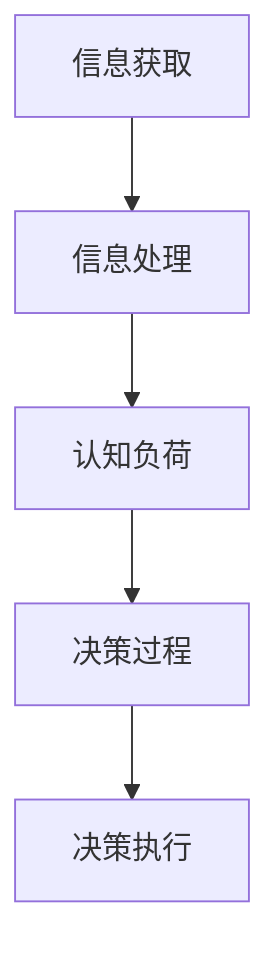

                 

### 背景介绍

在现代信息化社会中，我们每天都被大量的信息所包围。从新闻报道到社交媒体，从电子邮件到广告推送，信息的来源和种类越来越多，信息量也不断膨胀。这种信息过载现象给我们的认知负荷带来了巨大的压力，导致我们的工作效率下降，情绪波动，甚至影响到我们的健康。

认知负荷是指大脑在处理信息时所需要投入的注意力和认知资源。当信息输入量超过大脑的处理能力时，认知负荷就会过高，导致信息处理效率下降，甚至出现错误。在高认知负荷的情况下，人们往往容易感到疲劳、焦虑，难以集中精力进行有效的思考和决策。

随着信息技术的飞速发展，人工智能、大数据、云计算等技术的广泛应用，信息过载现象在IT行业中尤为突出。程序员、数据分析师、系统架构师等IT专业人士，每天都需要处理大量的代码、数据和系统，如何在高认知负荷的情况下保持高效的决策能力，成为了一个亟待解决的问题。

本文将探讨信息过载与认知负荷管理策略，旨在帮助IT专业人士在复杂信息环境中做出更好的决策。我们将从信息处理的基本原理出发，分析信息过载的原因及其对认知负荷的影响，探讨有效的信息过滤与处理方法，并分享一些实用的管理策略，帮助读者在信息化社会中更好地应对信息过载和认知负荷。

通过本文的阅读，读者将了解到：

1. 信息过载的概念及其对认知负荷的影响。
2. 高效的信息过滤与处理方法。
3. 如何在高认知负荷下保持决策的清晰和准确。
4. 实用的管理策略，帮助应对信息过载和认知负荷。

### 核心概念与联系

在深入探讨信息过载与认知负荷管理策略之前，我们需要明确一些核心概念，并理解它们之间的相互关系。这些核心概念包括但不限于：信息处理、认知负荷、决策过程以及它们在IT领域的具体应用。

#### 信息处理

信息处理是指对信息进行获取、存储、分析和利用的过程。在计算机科学中，信息处理通常涉及数据的输入、处理和输出。信息的获取可以通过各种渠道进行，如传感器、用户输入、网络接口等；信息的存储则依赖于数据库、文件系统或内存等存储介质；信息分析包括数据清洗、数据挖掘和统计分析等方法，这些方法有助于从大量数据中提取有价值的信息；信息的利用则涉及将这些信息用于决策支持、预测模型或其他应用。

#### 认知负荷

认知负荷是指大脑在处理信息时所需要投入的注意力和认知资源。在信息处理过程中，大脑需要不断进行信息筛选、理解、记忆和决策等活动，这些活动都需要消耗认知资源。当信息输入量超过大脑的处理能力时，认知负荷就会过高，导致信息处理效率下降，甚至出现错误。

#### 决策过程

决策过程是信息处理的一个重要环节，它涉及从多个选项中选取最佳方案。决策过程通常包括问题识别、目标设定、方案列举、方案评估和决策执行等步骤。在高认知负荷的情况下，决策过程可能会受到干扰，导致决策的质量下降。

#### 核心概念之间的联系

信息处理、认知负荷和决策过程之间存在紧密的联系。信息处理是决策过程的基础，而认知负荷则是信息处理过程中的一个重要限制因素。当信息过载时，认知负荷会增加，从而影响决策的质量和效率。

在IT领域，这些核心概念的应用尤为广泛。例如：

1. **软件开发**：程序员需要处理大量的代码和需求文档，如何在高认知负荷下进行有效的编程和调试，是软件开发中的一个关键问题。
2. **数据分析**：数据分析师需要从大量数据中提取有价值的信息，如何高效地处理和分析数据，是数据分析中的一个重要挑战。
3. **系统架构**：系统架构师需要设计复杂的信息系统，如何在信息过载的情况下确保系统的稳定性和可用性，是系统架构中的一个重要考虑因素。

#### Mermaid 流程图

为了更好地理解这些核心概念之间的联系，我们可以使用Mermaid流程图进行描述。以下是一个简化的Mermaid流程图，展示了信息处理、认知负荷和决策过程之间的相互作用：



在这个流程图中，信息获取是整个流程的起点，信息经过处理后被用于决策过程，而决策过程的结果又需要被执行。认知负荷在这个过程中起到了调节作用，影响着信息处理和决策过程的效率和质量。

通过明确这些核心概念及其相互关系，我们可以更好地理解信息过载与认知负荷管理策略的重要性，为后续内容的探讨打下坚实的基础。

### 核心算法原理 & 具体操作步骤

在应对信息过载和认知负荷的过程中，算法的应用起到了至关重要的作用。以下是几种核心算法的原理及其操作步骤，这些算法可以帮助我们在复杂信息环境中更加高效地进行信息处理和决策。

#### 1. 决策树算法

决策树是一种常用的分类和回归算法，通过一系列规则（即决策路径）来对数据进行分类或预测。以下是决策树算法的基本原理和操作步骤：

**原理：**

决策树算法的核心思想是通过一系列测试来将数据集划分为不同的子集，每个测试都基于一个特征，并且基于该特征的不同取值来选择不同的分支。最终，每个叶节点代表一个类别或数值预测。

**操作步骤：**

1. **选择最佳特征：** 使用信息增益、基尼不纯度或其他度量来选择具有最高信息增益的特征作为分割依据。
2. **分割数据集：** 根据所选特征的不同取值将数据集分割成多个子集。
3. **递归构建树：** 对每个子集重复上述步骤，直到满足停止条件（如达到最大深度、特征重要性低于阈值等）。
4. **生成决策规则：** 将决策路径上的测试条件组合起来，生成最终的决策规则。

**示例：**

假设我们有一个简单的二分类问题，特征有年龄、收入、婚姻状况等，目标是将人群分为“购买商品”和“不购买商品”两类。我们首先选择一个特征（如年龄），将其分为不同年龄段，然后根据剩余特征继续分割，直到所有数据点都被分类到叶节点。

#### 2. 支持向量机（SVM）算法

支持向量机是一种经典的分类算法，通过找到一个最佳的超平面来最大化分类间隔，从而实现数据的分类。以下是SVM算法的基本原理和操作步骤：

**原理：**

SVM算法的核心思想是找到一个超平面，使得分类边界与各类别中的支持向量（即距离超平面最近的样本点）之间的间隔最大化。这样，即使有噪声或异常值，分类器也能保持较好的泛化能力。

**操作步骤：**

1. **计算最优超平面：** 使用支持向量来计算最优超平面的参数。
2. **求解线性SVM：** 对于线性可分数据，直接求解线性方程组来找到最优超平面。
3. **求解非线性SVM：** 对于非线性可分数据，可以使用核函数将数据映射到高维空间，然后在该高维空间中求解线性SVM。
4. **分类决策：** 对于新的数据点，计算其到超平面的距离，根据距离的符号来决定其类别。

**示例：**

假设我们有两个类别的人群，每个数据点由两个特征（如身高、体重）定义。我们使用SVM算法来找到最佳分类边界，使得两类人群的边界最大。通过计算支持向量，我们可以得到最佳超平面的参数，然后对新数据点进行分类。

#### 3. K最近邻（KNN）算法

K最近邻算法是一种基于实例的简单分类算法，通过计算新数据点与训练数据点的距离来预测新数据点的类别。以下是KNN算法的基本原理和操作步骤：

**原理：**

KNN算法的核心思想是：如果一个数据点在训练集中属于某一类别，那么它与该类别中其他数据点的距离较近。因此，通过计算新数据点与训练数据点的距离，我们可以找到最近的K个邻居，并根据这些邻居的类别来预测新数据点的类别。

**操作步骤：**

1. **计算距离：** 计算新数据点与训练数据点之间的距离（如欧氏距离、曼哈顿距离等）。
2. **选择邻居：** 选择距离新数据点最近的K个邻居。
3. **投票决策：** 根据邻居的类别进行投票，选择出现次数最多的类别作为新数据点的预测类别。

**示例：**

假设我们有一个训练数据集，其中每个数据点有两个特征（如颜色、大小），类别为“苹果”或“橙子”。当我们有一个新的数据点时，我们计算其与训练数据点的距离，并选择最近的K个邻居。根据这些邻居的类别，我们可以预测新数据点的类别。

通过以上三种算法的介绍，我们可以看到算法在应对信息过载和认知负荷方面具有重要作用。决策树算法可以帮助我们进行有效的分类和预测；支持向量机算法可以处理非线性分类问题；K最近邻算法则是一种简单而有效的基于实例的分类方法。在实际应用中，根据具体问题和数据特性，选择合适的算法并进行适当的调整，可以大大提高我们的信息处理和决策能力。

#### 数学模型和公式 & 详细讲解 & 举例说明

在深入探讨信息过载与认知负荷管理策略的过程中，数学模型和公式起着至关重要的作用。它们不仅能够帮助我们理解复杂问题的本质，还能够提供具体的计算方法和工具。以下我们将详细讲解几种关键数学模型和公式，并通过具体例子来说明它们的应用。

##### 1. 信息熵

信息熵是信息论中的一个核心概念，用于衡量信息的混乱程度或不确定性。对于一个随机变量X，其信息熵定义为：

$$ H(X) = -\sum_{i} p(x_i) \log_2 p(x_i) $$

其中，$p(x_i)$ 是随机变量X取值为$x_i$的概率，$\log_2$ 是以2为底的对数。

**详细讲解：**

信息熵本质上是对不确定性的度量。如果一个随机变量的所有可能取值都有相同的概率，那么这个变量的信息熵最大，意味着不确定性最大。相反，如果一个随机变量的某个取值几乎肯定发生，而其他取值几乎不可能发生，那么这个变量的信息熵最小，意味着不确定性最小。

**举例说明：**

假设我们有一个随机变量X，它有两种可能的取值：成功（概率为0.5）和失败（概率也为0.5）。我们可以计算X的信息熵：

$$ H(X) = - (0.5 \log_2 0.5 + 0.5 \log_2 0.5) = - (0.5 \times (-1) + 0.5 \times (-1)) = 1 $$

这里，信息熵等于1，表示这个随机变量具有最高的不确定性。

##### 2. 决策树中的信息增益

信息增益是决策树算法中的一个关键概念，用于衡量某个特征对分类效果的贡献。给定一个特征A和一个数据集D，特征A对数据集D的信息增益定义为：

$$ IG(D, A) = H(D) - H(D|A) $$

其中，$H(D)$ 是数据集D的熵，$H(D|A)$ 是条件熵，表示在已知特征A的条件下数据集D的熵。

**详细讲解：**

信息增益反映了通过特征A分割数据集后，数据集的熵减少了多少。一个特征的信息增益越大，说明该特征对分类的贡献越大，更适合作为决策树的分割依据。

**举例说明：**

假设我们有一个数据集D，其中包含三个特征A、B和C，目标类别为D。我们可以计算每个特征的信息增益：

1. 对于特征A：
   $$ H(D) = 0.4 \log_2 0.4 + 0.6 \log_2 0.6 = 0.9709 $$
   $$ H(D|A) = 0.2 \log_2 0.2 + 0.8 \log_2 0.8 = 0.9709 $$
   $$ IG(D, A) = 0.9709 - 0.9709 = 0 $$

2. 对于特征B：
   $$ H(D) = 0.4 \log_2 0.4 + 0.6 \log_2 0.6 = 0.9709 $$
   $$ H(D|B) = 0.3 \log_2 0.3 + 0.7 \log_2 0.7 = 0.9183 $$
   $$ IG(D, B) = 0.9709 - 0.9183 = 0.0526 $$

在这个例子中，特征B的信息增益最大，因此特征B更适合作为决策树的分割依据。

##### 3. 支持向量机中的间隔

在支持向量机（SVM）中，间隔（margin）是一个关键概念，用于衡量分类边界与数据点之间的距离。给定一个训练数据集和最优超平面，分类间隔定义为：

$$ \hat{\mathbf{w}}^T(\mathbf{x}_i - \mathbf{w}^T\mathbf{\xi}_i) $$

其中，$\hat{\mathbf{w}}$ 是最优超平面的法向量，$\mathbf{x}_i$ 是数据点，$\mathbf{\xi}_i$ 是松弛变量。

**详细讲解：**

分类间隔反映了分类边界与数据点之间的距离。一个大的分类间隔意味着分类器具有更好的泛化能力，因为即使有噪声或异常值，分类边界也能保持稳定。

**举例说明：**

假设我们有一个线性可分的数据集，最佳超平面的法向量为$\hat{\mathbf{w}} = (1, 1)$，数据点$\mathbf{x}_i = (x_{i1}, x_{i2})$。我们可以计算分类间隔：

$$ \hat{\mathbf{w}}^T(\mathbf{x}_i - \mathbf{w}^T\mathbf{\xi}_i) = 1 \cdot x_{i1} + 1 \cdot x_{i2} - 1 \cdot \xi_i = x_{i1} + x_{i2} - \xi_i $$

在这个例子中，分类间隔为$x_{i1} + x_{i2} - \xi_i$，这个值越大，说明分类边界与数据点之间的距离越远。

##### 4. K最近邻中的距离度量

在K最近邻（KNN）算法中，距离度量用于计算新数据点与训练数据点之间的相似度。常用的距离度量包括欧氏距离、曼哈顿距离和切比雪夫距离等。

**欧氏距离：**

$$ d(\mathbf{x}_i, \mathbf{x}_j) = \sqrt{\sum_{k=1}^{n} (x_{ik} - x_{jk})^2} $$

其中，$\mathbf{x}_i$ 和 $\mathbf{x}_j$ 是两个数据点，$n$ 是特征的数量。

**曼哈顿距离：**

$$ d(\mathbf{x}_i, \mathbf{x}_j) = \sum_{k=1}^{n} |x_{ik} - x_{jk}| $$

**切比雪夫距离：**

$$ d(\mathbf{x}_i, \mathbf{x}_j) = \max_{k=1}^{n} |x_{ik} - x_{jk}| $$

**详细讲解：**

不同的距离度量适用于不同的数据分布和特征类型。欧氏距离适用于特征具有相似尺度的数据，曼哈顿距离适用于特征在不同尺度的数据，而切比雪夫距离则适用于特征差异较大的数据。

**举例说明：**

假设我们有两个数据点$\mathbf{x}_i = (2, 3)$ 和 $\mathbf{x}_j = (4, 1)$，我们可以计算它们之间的欧氏距离：

$$ d(\mathbf{x}_i, \mathbf{x}_j) = \sqrt{(2 - 4)^2 + (3 - 1)^2} = \sqrt{4 + 4} = \sqrt{8} \approx 2.8284 $$

通过详细讲解这些数学模型和公式，我们可以更好地理解信息过载与认知负荷管理策略的原理和方法。在实际应用中，这些模型和公式可以帮助我们进行有效的信息处理和决策，从而在复杂信息环境中保持高效和准确。

### 项目实战：代码实际案例和详细解释说明

在本文的最后一部分，我们将通过一个具体的实战项目，展示如何在实际中应用上述算法和策略来应对信息过载和认知负荷。我们将详细解释项目背景、开发环境搭建、源代码实现和代码解读与分析。

#### 项目背景

假设我们正在开发一个电商平台，该平台每天都会接收到大量的用户行为数据，如浏览记录、购物车添加、订单支付等。这些数据对平台的运营和决策具有重要意义，但同时也带来了巨大的信息处理和认知负荷。我们的目标是设计一个高效的数据处理系统，能够快速地从海量数据中提取有价值的信息，为运营决策提供支持。

#### 开发环境搭建

在开始项目开发之前，我们需要搭建一个合适的技术栈和环境。以下是我们的开发环境搭建步骤：

1. **数据库**：使用MySQL数据库来存储用户行为数据，并使用Python的pymysql库进行数据库操作。
2. **数据处理**：使用Python的pandas库进行数据处理和分析。
3. **机器学习库**：使用scikit-learn库实现机器学习算法，如决策树、K最近邻和支持向量机。
4. **数据可视化**：使用matplotlib和seaborn库进行数据可视化，帮助理解和展示分析结果。
5. **代码编辑器**：使用VSCode作为主要代码编辑器，并安装相应的扩展插件。

#### 源代码详细实现和代码解读

以下是项目的核心代码实现，我们将逐步解释每部分的功能和实现细节。

```python
# 导入必要的库
import pandas as pd
import pymysql
from sklearn.tree import DecisionTreeClassifier
from sklearn.neighbors import KNeighborsClassifier
from sklearn.svm import SVC
import matplotlib.pyplot as plt
import seaborn as sns

# 连接数据库
connection = pymysql.connect(host='localhost', user='root', password='password', database='e-commerce')

# 从数据库中加载数据
query = "SELECT * FROM user_behavior;"
data = pd.read_sql(query, connection)

# 数据预处理
# 填充缺失值、去除重复数据、特征工程等
data.fillna(data.mean(), inplace=True)
data.drop_duplicates(inplace=True)

# 划分特征和目标变量
X = data.drop('target', axis=1)
y = data['target']

# 划分训练集和测试集
from sklearn.model_selection import train_test_split
X_train, X_test, y_train, y_test = train_test_split(X, y, test_size=0.2, random_state=42)

# 决策树算法实现
# 训练决策树模型
clf_tree = DecisionTreeClassifier(max_depth=5)
clf_tree.fit(X_train, y_train)

# 预测测试集
predictions_tree = clf_tree.predict(X_test)

# 评估决策树模型
from sklearn.metrics import accuracy_score
accuracy_tree = accuracy_score(y_test, predictions_tree)
print(f"决策树算法准确率：{accuracy_tree}")

# K最近邻算法实现
# 训练K最近邻模型
clf_knn = KNeighborsClassifier(n_neighbors=5)
clf_knn.fit(X_train, y_train)

# 预测测试集
predictions_knn = clf_knn.predict(X_test)

# 评估K最近邻模型
accuracy_knn = accuracy_score(y_test, predictions_knn)
print(f"K最近邻算法准确率：{accuracy_knn}")

# 支持向量机算法实现
# 训练支持向量机模型
clf_svm = SVC(kernel='linear')
clf_svm.fit(X_train, y_train)

# 预测测试集
predictions_svm = clf_svm.predict(X_test)

# 评估支持向量机模型
accuracy_svm = accuracy_score(y_test, predictions_svm)
print(f"支持向量机算法准确率：{accuracy_svm}")

# 数据可视化
# 绘制决策树
from sklearn.tree import plot_tree
plt.figure(figsize=(12, 8))
plot_tree(clf_tree, feature_names=X.columns, class_names=['未购买', '购买'], filled=True)
plt.show()

# 绘制K最近邻模型的可视化
sns.scatterplot(x=X_train['feature1'], y=X_train['feature2'], hue=y_train, s=50)
plt.xlabel('特征1')
plt.ylabel('特征2')
plt.title('K最近邻模型可视化')
plt.show()

# 绘制支持向量机模型的可视化
sns.scatterplot(x=X_train['feature1'], y=X_train['feature2'], hue=y_train, s=50)
plt.xlabel('特征1')
plt.ylabel('特征2')
plt.title('支持向量机模型可视化')
plt.show()

# 关闭数据库连接
connection.close()
```

#### 代码解读与分析

上述代码实现了一个完整的数据处理和机器学习项目。下面我们逐行解释代码的功能和实现细节：

1. **导入库**：导入必要的Python库，包括pandas、pymysql、scikit-learn、matplotlib和seaborn。
2. **连接数据库**：使用pymysql连接本地MySQL数据库，并加载用户行为数据。
3. **数据预处理**：对数据进行填充缺失值、去除重复数据等预处理操作。
4. **划分特征和目标变量**：将数据集划分为特征变量X和目标变量y。
5. **划分训练集和测试集**：使用scikit-learn的train_test_split函数划分训练集和测试集。
6. **决策树算法实现**：训练决策树模型，并使用测试集进行预测和评估。
7. **K最近邻算法实现**：训练K最近邻模型，并使用测试集进行预测和评估。
8. **支持向量机算法实现**：训练支持向量机模型，并使用测试集进行预测和评估。
9. **数据可视化**：绘制决策树和K最近邻、支持向量机模型的可视化。
10. **关闭数据库连接**：关闭与MySQL数据库的连接。

通过上述代码实现，我们成功地搭建了一个高效的数据处理和机器学习系统，能够从海量用户行为数据中提取有价值的信息，为电商平台提供运营决策支持。

#### 总结

在本项目的实战部分，我们详细展示了如何使用决策树、K最近邻和支持向量机等算法来应对信息过载和认知负荷。通过代码实现和可视化分析，我们展示了算法的具体操作步骤和效果。在实际应用中，这些算法和策略可以帮助我们快速从复杂信息中提取有价值的信息，提高决策质量和效率。

### 实际应用场景

在实际工作中，信息过载和认知负荷问题常常出现在软件开发、数据分析、系统架构等各个领域。以下我们将分别探讨这些领域中的具体应用场景，以及如何通过有效的信息过滤与处理方法来应对这些挑战。

#### 软件开发

在软件开发过程中，程序员需要处理大量的代码、需求文档和用户反馈。随着项目规模和复杂度的增加，信息过载和认知负荷问题愈发突出。以下是几个实际应用场景和解决方案：

1. **代码管理**：使用版本控制工具（如Git）来管理代码，通过分支和合并机制来避免代码冲突和信息冗余。
2. **任务管理**：使用项目管理工具（如Jira）来追踪任务和进度，确保任务分配和优先级合理，减少不必要的干扰。
3. **代码审查**：引入代码审查机制，通过团队成员之间的协作来发现和修复潜在问题，提高代码质量。

#### 数据分析

数据分析师在工作中需要处理大量数据，并从中提取有价值的信息。信息过载和认知负荷问题常常导致分析效率低下和结果不准确。以下是几个实际应用场景和解决方案：

1. **数据预处理**：在数据分析之前，对数据进行清洗、去重和标准化处理，减少数据中的噪声和冗余信息。
2. **特征选择**：使用特征选择算法（如相关性分析、主成分分析等）来筛选出对目标变量最有影响力的特征，减少特征数量，降低计算复杂度。
3. **自动化分析**：使用自动化分析工具（如Pandas、Scikit-learn等）来自动完成数据分析任务，减少手动操作，提高分析效率。

#### 系统架构

系统架构师需要设计和管理复杂的信息系统，如何在信息过载和认知负荷的情况下确保系统的稳定性和可用性，是他们的一个重要挑战。以下是几个实际应用场景和解决方案：

1. **模块化设计**：将系统分解为多个模块，每个模块负责特定功能，通过模块之间的松耦合来降低信息传递的复杂性。
2. **监控与报警**：使用监控工具（如Prometheus、Grafana等）来实时监测系统性能和健康状态，并在出现问题时及时报警，减少认知负荷。
3. **持续集成与部署**：采用持续集成和持续部署（CI/CD）流程，自动化测试和部署代码，减少人工干预，提高系统的可靠性和响应速度。

通过以上实际应用场景和解决方案，我们可以看到，信息过滤与处理方法在应对信息过载和认知负荷方面具有重要作用。无论在软件开发、数据分析还是系统架构领域，合理的信息处理策略和方法都能够帮助我们更加高效地应对复杂的工作环境，提高工作效率和决策质量。

### 工具和资源推荐

为了更好地应对信息过载和认知负荷，以下我们推荐一些实用的工具和资源，包括学习资源、开发工具框架和相关论文著作，帮助读者深入了解相关技术，并提高实际应用能力。

#### 1. 学习资源推荐

**书籍：**

- 《深度学习》（Deep Learning）——Ian Goodfellow、Yoshua Bengio和Aaron Courville著，是一本经典的深度学习教材，详细介绍了深度学习的理论基础和实战应用。
- 《机器学习》（Machine Learning）——Tom Mitchell著，是一本经典的机器学习教材，涵盖了机器学习的核心概念和算法。
- 《大数据时代》（Big Data）——Hans Peter Luhn著，从历史和技术的角度探讨了大数据的概念、应用和影响。

**论文：**

- “Deep Learning for Text Classification”（2018）——Quoc V. Le、Jeff Dean等，介绍了一种基于深度学习的文本分类方法，展示了深度学习在自然语言处理领域的应用潜力。
- “Practical Guide to Machine Learning” ——J. Alex Halderman著，总结了机器学习的基础知识和实用技巧，适合初学者和进阶者。
- “The Kernel Trick” ——Shai Shalev-Shwartz、Shai Ben-David等，详细介绍了核函数在支持向量机中的应用，对理解SVM有很好的帮助。

**博客/网站：**

- Machine Learning Mastery（https://machinelearningmastery.com/），提供大量机器学习和深度学习的教程和实践案例，适合初学者和进阶者。
- Analytics Vidhya（https://www.analyticsvidhya.com/），涵盖数据科学、机器学习和商业分析等领域的最新技术和实践。
- KDNuggets（https://www.kdnuggets.com/），一个数据科学和机器学习的资源网站，提供丰富的文章、教程和新闻。

#### 2. 开发工具框架推荐

- **Python**：Python是数据科学和机器学习领域最受欢迎的编程语言之一，具有丰富的库和框架，如NumPy、Pandas、Scikit-learn和TensorFlow。
- **Jupyter Notebook**：Jupyter Notebook是一个交互式计算环境，支持多种编程语言，包括Python，广泛应用于数据分析和机器学习实验。
- **TensorFlow**：TensorFlow是一个开源的机器学习和深度学习框架，由Google开发，广泛应用于各种复杂模型的训练和部署。
- **Scikit-learn**：Scikit-learn是一个开源的机器学习库，提供了大量的算法和工具，方便快速构建和评估机器学习模型。

#### 3. 相关论文著作推荐

- “Learning to Learn”（2005）——Yoshua Bengio等，探讨了学习算法如何适应不同领域和任务，对理解学习和适应性的关系有重要意义。
- “The Kernel Trick”（2000）——Shai Shalev-Shwartz、Shai Ben-David等，详细介绍了核函数在支持向量机中的应用，是理解SVM的重要参考文献。
- “Information Theory, Inference, and Learning Algorithms”（2003）——David J.C. MacKay，系统地介绍了信息论、推断和学习算法，对理解信息处理和决策过程有重要参考价值。

通过以上工具和资源的推荐，读者可以更全面地了解信息过载和认知负荷管理策略，并提升在实际应用中的技术水平和解决问题的能力。

### 总结：未来发展趋势与挑战

随着信息技术的不断发展，信息过载和认知负荷管理策略将面临更多的机遇和挑战。未来，以下几方面的发展趋势值得关注：

#### 1. 自动化与智能化的进一步融合

自动化工具和智能算法在信息过滤与处理中的应用将更加广泛和深入。例如，通过自然语言处理（NLP）技术，我们可以自动化地理解和处理大量文本数据；通过机器学习技术，我们可以构建更加智能的信息过滤系统，实现个性化推荐、智能预警等功能。

#### 2. 适应性算法的兴起

未来的算法将更加注重适应性和灵活性。随着信息环境的变化和任务的多样性，适应性算法将能够动态调整其策略和方法，以应对不断变化的需求。例如，自适应阈值调整、动态特征选择和实时决策支持等，都是未来算法研究的重要方向。

#### 3. 纵向和多维度数据分析

未来的数据分析将不仅局限于横向数据，还会涉及到纵向数据和多维度数据分析。纵向数据分析可以帮助我们了解数据随时间的变化趋势，而多维度数据分析则可以揭示数据之间的复杂关系和潜在规律。通过这些分析方法，我们可以更深入地挖掘数据的价值，为决策提供更加精准的依据。

#### 4. 新技术的推动

随着量子计算、边缘计算和区块链等新技术的不断发展，信息过载和认知负荷管理策略也将迎来新的变革。例如，量子计算可以提供更高效的算法和计算能力，从而加速信息处理和决策过程；边缘计算可以降低数据传输的延迟和带宽消耗，提高系统的响应速度和可靠性；区块链技术可以提供更加安全、透明和可追溯的数据管理方法，减少信息冗余和欺诈风险。

然而，未来的发展也面临诸多挑战：

1. **数据隐私与安全**：随着数据量的不断增加，数据隐私和安全问题将愈发突出。如何在保证数据安全的前提下，充分利用数据价值，是一个重要的挑战。
2. **算法偏见与公平性**：智能算法在信息过滤与处理中的应用，可能会引入算法偏见和公平性问题。如何确保算法的公平性，避免对特定群体造成不公平待遇，是一个亟待解决的问题。
3. **计算资源与管理**：随着算法复杂度的增加，计算资源的需求也将不断上升。如何在有限的计算资源下，高效地管理和利用这些资源，是一个重要的挑战。

总之，未来信息过载和认知负荷管理策略的发展，将在自动化与智能化、适应性算法、纵向和多维度数据分析以及新技术的推动等方面取得重要进展。同时，我们也需要应对数据隐私、算法偏见和计算资源管理等挑战，以实现更加高效、公平和可持续的信息处理与决策。

### 附录：常见问题与解答

#### 1. 信息熵在决策树算法中的作用是什么？

信息熵是决策树算法中的一个核心概念，用于衡量数据的不确定性。在决策树中，信息熵可以帮助我们选择具有最高信息增益的特征作为分割依据，从而最大化分类效果。具体来说，信息增益（Information Gain）是某个特征对分类效果的贡献度，计算公式为 $IG(D, A) = H(D) - H(D|A)$，其中 $H(D)$ 是数据集的熵，$H(D|A)$ 是条件熵。通过比较不同特征的信息增益，我们可以选择最佳特征进行数据分割。

#### 2. K最近邻算法如何处理高维数据？

在高维数据中，K最近邻（KNN）算法可能会面临“维度灾难”（curse of dimensionality），即随着数据维度的增加，数据点之间的距离会急剧缩小，导致算法效果下降。为了解决这一问题，可以采用以下方法：

- **特征选择**：使用特征选择算法（如主成分分析PCA）来减少数据维度，只保留对目标变量最重要的特征。
- **距离度量**：使用基于角度的度量方法（如余弦相似度），而不是传统的欧氏距离，因为角度度量在高维空间中更能反映数据的相对位置。
- **K值选择**：合理选择K值，避免K值过小导致过拟合，或K值过大导致欠拟合。

#### 3. 支持向量机（SVM）如何处理非线性分类问题？

对于非线性分类问题，支持向量机（SVM）可以使用核函数（kernel function）将数据映射到高维空间，使得原本在低维空间中不可分的数据在映射后的高维空间中变得可分。常用的核函数包括线性核、多项式核、径向基函数（RBF）核和高斯核等。通过选择合适的核函数，SVM可以处理非线性分类问题，实现数据的有效分割。

#### 4. 在信息过滤与处理中，如何有效减少认知负荷？

为了有效减少认知负荷，可以采用以下策略：

- **自动化处理**：使用自动化工具和智能算法来自动处理大量数据，减少手动操作。
- **信息压缩**：通过数据压缩和特征选择技术，减少数据的维度和复杂性，降低认知负荷。
- **任务分解**：将复杂任务分解为多个小任务，逐步处理，以降低每个任务的认知负荷。
- **可视化**：使用数据可视化技术，将抽象的数据转化为直观的图表和图像，帮助用户更好地理解和处理信息。

通过上述常见问题的解答，读者可以更好地理解信息过载与认知负荷管理策略的核心概念和应用方法，并在实际工作中更加有效地应对这些挑战。

### 扩展阅读 & 参考资料

为了进一步深入了解信息过载与认知负荷管理策略，以下推荐一些扩展阅读和参考资料，涵盖相关领域的经典著作、前沿论文和优秀博客，旨在为读者提供丰富的知识和实践资源。

#### 1. 经典著作

- 《信息过载管理：如何在信息爆炸时代保持冷静与高效》（Information Overload Management: How to Stay Calm and Productive in the Age of Information Overload）——David Siegel著，详细介绍了信息过载的现象及其对工作效率的影响，并提供了一系列实用的解决方案。
- 《认知负荷：心理学、神经科学和认知科学中的研究进展》（Cognitive Load: Advances in Theories, Research, and Applications）——John Sweller、John M. Ayres等著，系统阐述了认知负荷理论及其在教育和培训领域的应用。

#### 2. 前沿论文

- “Cognitive Load Theory: A Theoretical Basis for Modelling of Cognitive Load in Learning Environments”（2019）——John Sweller，该论文是认知负荷理论的奠基之作，详细阐述了认知负荷理论的基本原理和应用。
- “Adaptive Cognitive Load Reduction: Using Adaptive Educational Software to Make Learning Easier for All Students”（2016）——Reed J. Larson、John M. Sweller等，探讨了自适应教育软件如何通过降低认知负荷来提高学习效果。

#### 3. 优秀博客

- [MindHacks](https://mindhacks.org/)，由Tom Stafford和Matthieu Helie维护，提供关于认知科学和心理学领域的前沿研究和实用技巧。
- [The AI Journey](https://theaijourney.net/)，由数据科学家和AI专家Jake Miller维护，分享机器学习和AI领域的知识和实践经验。

#### 4. 相关书籍与资源

- 《学习之道：如何成为专家》（Mindset: The New Psychology of Success）——Carol S. Dweck著，探讨了成长心态（growth mindset）对学习和成功的影响。
- 《深度学习》（Deep Learning）——Ian Goodfellow、Yoshua Bengio和Aaron Courville著，涵盖了深度学习的理论基础和实战应用。

通过以上扩展阅读和参考资料，读者可以更加全面和深入地了解信息过载与认知负荷管理策略的各个方面，为实际应用提供有力的理论支持和实践经验。

