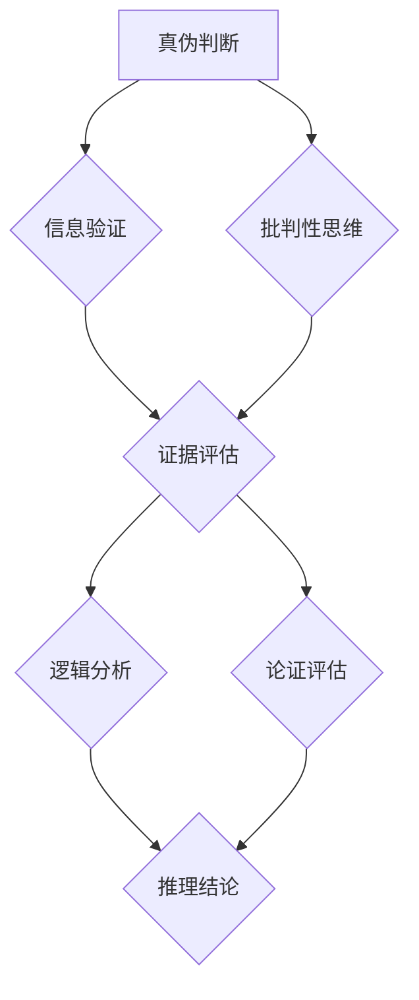

                 

### 背景介绍

在数字时代，信息的获取和处理变得前所未有的便捷，但随之而来的是假新闻、错误信息和媒体操纵的泛滥。这些问题不仅对普通民众的日常生活产生了深远影响，也对社会的稳定和发展构成了严重威胁。为了在这种信息纷扰的环境中导航，我们需要具备强大的信息验证和批判性思维能力。

假新闻，也称为虚假信息，是指故意传播的、与事实不符的信息。这类信息可能会被用于政治操纵、商业欺诈、个人攻击等多种目的。错误信息则可能是由于无知、误解或疏忽而产生的，尽管它们没有恶意，但同样可能导致严重的后果。媒体操纵则是指媒体机构或个人故意扭曲或选择性报道信息，以达到特定的政治或商业目标。

这些问题的根源可以追溯到多个方面。首先，互联网的普及和社交媒体的兴起使得信息的传播速度大大加快，同时也降低了信息验证的门槛。其次，一些组织和个人出于各种动机，故意制造和传播虚假信息。此外，人类认知的局限性，如确认偏误和群体思维，也加剧了这些问题的复杂性。

在这个背景下，本文旨在探讨如何通过提升信息验证和批判性思维能力，在假新闻、错误信息和媒体操纵的时代中保持清晰的判断和独立思考。文章将首先介绍核心概念，包括信息验证的基本原则和批判性思维的方法论。接着，我们将探讨这些方法在实际应用中的挑战和解决方案。最后，我们将讨论未来发展趋势与挑战，并总结出提升信息验证和批判性思维能力的关键策略。

通过这篇文章，我们希望读者能够更加敏锐地识别和抵御虚假信息，培养出一种独立思考和理性判断的能力，以更好地应对当今复杂多变的信息环境。

### 核心概念与联系

在探讨如何验证信息和培养批判性思维之前，我们首先需要理解一些核心概念，这些概念构成了信息验证和批判性思维的基础。

#### 1. 真伪判断与信息验证

真伪判断是信息验证过程中的核心。简单来说，真伪判断涉及对信息的真实性、准确性和可靠性的评估。在数字时代，真伪判断变得更加复杂，因为信息的来源和传播途径多样化，且虚假信息的制作和传播技术也日益先进。以下是一些关键步骤和方法，用于对信息进行真伪判断：

- **来源审查**：评估信息来源的可靠性和专业性。权威机构和知名专家发布的信息通常更可信。
- **交叉验证**：通过多个来源和渠道核对信息，以确保其准确性。单一来源的信息可能存在偏差或错误。
- **事实核查**：使用事实核查工具或数据库，验证信息的真实性和准确性。
- **逻辑推理**：运用逻辑原则，分析信息的内在一致性，排除错误或虚假的信息。

#### 2. 批判性思维

批判性思维是指通过分析、评估和推理，对信息和观点进行深入思考和判断的过程。它强调理性思考、独立判断和质疑精神，旨在识别偏见、错误和虚假信息。以下是一些关键的批判性思维能力：

- **问题识别**：能够识别信息中的问题、矛盾或可疑之处。
- **证据评估**：评估提供证据的质量和相关性，判断其是否支持某一观点。
- **逻辑分析**：运用逻辑原则，分析信息的内在逻辑结构，识别错误推理。
- **论证评估**：评估论证的有效性，包括前提的有效性和推理过程的合理性。

#### 3. 信息验证与批判性思维的联系

信息验证和批判性思维紧密相连，相互补充。信息验证依赖于批判性思维的能力，通过批判性思维来识别和评估信息的真实性、准确性和可靠性。同时，批判性思维需要信息验证作为基础，通过验证信息来支持其判断和推理。

#### 4. Mermaid 流程图

为了更好地理解这些核心概念之间的联系，我们可以使用Mermaid流程图来展示它们的关系。以下是一个简单的Mermaid流程图，用于展示信息验证和批判性思维之间的互动关系：



在这个流程图中，真伪判断是信息验证和批判性思维的基础。信息验证通过证据评估、逻辑分析和论证评估来支持批判性思维，而批判性思维则通过问题识别和逻辑分析来指导信息验证。

通过理解这些核心概念和它们之间的联系，我们可以更好地应用信息验证和批判性思维的方法，以应对假新闻、错误信息和媒体操纵的挑战。接下来的部分将深入探讨这些方法的具体应用和操作步骤。

#### 核心算法原理 & 具体操作步骤

在深入探讨信息验证和批判性思维的核心算法原理之前，我们需要明确几个关键的基础概念，这些概念构成了信息验证和批判性思维算法的理论基础。

##### 1. 真伪判断算法

真伪判断算法的核心任务是通过对信息源、内容、传播路径等多方面的分析，评估信息的真实性和准确性。以下是一些关键步骤和方法：

- **信息源分析**：首先，对信息源的权威性和专业性进行评估。权威的信息源通常具有较高的可信度。
- **内容分析**：对信息的内容进行详细的审查，识别其中的事实、观点和潜在偏见。这包括对事实的准确性、观点的合理性和语言表述的清晰性进行评估。
- **传播路径分析**：了解信息是如何传播的，识别可能的虚假传播途径。例如，社交媒体上的信息传播速度极快，且难以追溯源头，因此需要特别警惕。

##### 2. 批判性思维算法

批判性思维算法的核心在于如何对信息进行深入分析和评估，以识别潜在的偏见、错误和虚假信息。以下是一些关键步骤：

- **问题识别**：通过逻辑分析和语境理解，识别信息中的问题和矛盾之处。例如，一个逻辑上不自洽的陈述或信息源之间的不一致性。
- **证据评估**：评估提供证据的质量和相关性，判断其是否支持某一观点。高质量的证据通常来自于权威的研究、报告或公开记录。
- **逻辑分析**：运用逻辑原则，分析信息的内在逻辑结构，识别错误推理。例如，识别虚假因果、滑坡谬误、偷换概念等逻辑错误。
- **论证评估**：评估论证的有效性，包括前提的有效性和推理过程的合理性。论证评估的目的是确保结论是基于可靠前提和逻辑推理得出的。

##### 3. 实际操作步骤

在具体操作中，以下步骤有助于应用真伪判断和批判性思维算法：

- **收集信息**：从多个可靠来源收集相关信息，为后续分析提供基础。
- **初步筛选**：通过快速浏览，筛选出最有可能被验证的信息，排除明显虚假或无关的信息。
- **详细分析**：对筛选出的信息进行详细分析，包括来源审查、内容审查和传播路径分析。
- **交叉验证**：通过多个来源和渠道对信息进行交叉验证，确保其准确性。
- **逻辑推理**：运用逻辑原则，对信息进行推理和论证评估，识别潜在的问题和错误。
- **结论形成**：根据分析结果，形成关于信息真实性和准确性的结论。

##### 4. 示例

为了更好地理解这些步骤，我们可以通过一个具体的案例来展示其应用：

**案例**：一个社交媒体上声称“某知名公司将在未来一周内破产”的消息。

- **收集信息**：从社交媒体、新闻报道、公司官方公告等多个渠道收集相关信息。
- **初步筛选**：由于这个消息没有明确的来源，且传播速度极快，初步筛选时将其列为重点验证对象。
- **详细分析**：检查社交媒体上的原始帖子，发现该消息没有提供具体的证据或来源，且语言带有明显的恐慌情绪。
- **交叉验证**：在新闻报道中并未找到相关报道，同时在公司官方公告中也未发现破产消息。
- **逻辑推理**：根据公司过往的经营状况和财务报告，判断该消息可能为虚假信息。
- **结论形成**：结合以上分析，得出结论：该消息为虚假信息，不应被传播。

通过以上步骤，我们可以有效地应用信息验证和批判性思维算法，识别和抵御虚假信息，确保信息的真实性和准确性。在接下来的部分，我们将进一步探讨数学模型和公式，以更深入地理解这些算法的理论基础。

#### 数学模型和公式 & 详细讲解 & 举例说明

在信息验证和批判性思维的过程中，数学模型和公式起着关键作用。这些模型和公式可以帮助我们量化信息的可信度，识别潜在的逻辑错误，从而做出更准确的判断。以下是一些核心的数学模型和公式，我们将通过详细的讲解和实际举例，帮助读者更好地理解和应用这些工具。

##### 1. 贝叶斯定理

贝叶斯定理是概率论中的一个重要公式，它可以帮助我们根据先验知识和新证据更新对某一事件的信念。贝叶斯定理的公式为：

\[ P(A|B) = \frac{P(B|A) \cdot P(A)}{P(B)} \]

其中：
- \( P(A|B) \) 是在已知事件 \( B \) 发生的情况下，事件 \( A \) 发生的概率。
- \( P(B|A) \) 是在已知事件 \( A \) 发生的情况下，事件 \( B \) 发生的概率。
- \( P(A) \) 是事件 \( A \) 发生的概率。
- \( P(B) \) 是事件 \( B \) 发生的概率。

**应用举例**：假设我们知道某人感染了流感（事件 \( A \)），并且检测呈阳性（事件 \( B \)），我们可以使用贝叶斯定理来更新我们对这个人确实感染了流感的信念。

- \( P(B|A) \)：流感检测的准确率，假设为 99%。
- \( P(A) \)：一般人感染流感的概率，假设为 1%。
- \( P(B) \)：所有人中检测阳性的概率，这需要根据总体感染率和检测误报率计算。

通过贝叶斯定理，我们可以计算得到 \( P(A|B) \)，即检测呈阳性时，确实感染流感的概率。

##### 2. 误差分析

误差分析是评估信息准确性的一种方法，它通过计算错误率、准确率等指标，来评估信息验证算法的性能。以下是一些核心的误差分析公式：

- **错误率（Error Rate）**：错误率是错误预测占总预测次数的比例，公式为：

\[ \text{Error Rate} = \frac{\text{False Positives} + \text{False Negatives}}{\text{Total Predictions}} \]

- **准确率（Accuracy）**：准确率是正确预测占总预测次数的比例，公式为：

\[ \text{Accuracy} = \frac{\text{True Positives} + \text{True Negatives}}{\text{Total Predictions}} \]

- **精确率（Precision）**：精确率是正确预测的阳性结果占总阳性预测结果的比例，公式为：

\[ \text{Precision} = \frac{\text{True Positives}}{\text{True Positives} + \text{False Positives}} \]

- **召回率（Recall）**：召回率是正确预测的阳性结果占总实际阳性结果的比例，公式为：

\[ \text{Recall} = \frac{\text{True Positives}}{\text{True Positives} + \text{False Negatives}} \]

**应用举例**：假设我们使用一个信息验证系统来检测假新闻，系统识别出 100 篇新闻中有 10 篇是假新闻。其中，系统正确识别出 8 篇假新闻，误报了 2 篇真新闻，漏报了 2 篇假新闻。

- **错误率**：\(\frac{2 + 2}{100} = 4%\)
- **准确率**：\(\frac{8 + 90}{100} = 94%\)
- **精确率**：\(\frac{8}{8 + 2} = 80%\)
- **召回率**：\(\frac{8}{8 + 2} = 80%\)

通过这些误差分析指标，我们可以评估信息验证系统的性能，并根据结果调整和优化算法。

##### 3. 逻辑推理公式

逻辑推理公式用于评估论证的有效性，包括前提的有效性和推理过程的合理性。以下是一些常用的逻辑推理公式：

- **否定前件式**（Modus Tollens）：如果 \( p \rightarrow q \) 为真，且 \( q \) 为假，则 \( p \) 为假。

\[ \neg q \rightarrow \neg p \]

- **肯定后件式**（Modus Ponens）：如果 \( p \rightarrow q \) 和 \( p \) 都为真，则 \( q \) 也为真。

\[ p \rightarrow q \]
\[ p \]
\[ \therefore q \]

**应用举例**：假设一个论证是“如果下雨，地面会湿。现在地面是湿的，因此下雨了。”

- **前提**：\( p \rightarrow q \)（下雨 → 地面湿）
- **条件**：\( q \)（地面湿）
- **推理**：\( p \)（下雨）

通过肯定后件式，我们可以得出结论：下雨了。

##### 4. 概率图模型

概率图模型（如贝叶斯网络）用于表示变量之间的概率依赖关系，可以用于推断未知变量的状态。以下是一个简单的贝叶斯网络示例：

```
         A
        / \
       /   \
      /     \
     /       \
    B         C
   / \       / \
  /   \     /   \
 /     \   /     \
D       E F
```

在这个网络中，每个节点表示一个变量，边表示变量之间的概率依赖关系。我们可以使用条件概率表来定义这些依赖关系，并通过贝叶斯规则进行推理。

\[ P(A|B, C) = \frac{P(B|A, C) \cdot P(A|C)}{P(B|C)} \]

**应用举例**：假设我们想要计算在“B为真”和“C为真”的条件下，A为真的概率。我们可以使用上述贝叶斯规则进行计算。

通过这些数学模型和公式，我们可以更精确地评估信息的可信度，识别逻辑错误，从而在假新闻、错误信息和媒体操纵的时代中，做出更准确、更理性的判断。

#### 项目实战：代码实际案例和详细解释说明

为了更好地理解和应用我们在前面部分讨论的信息验证和批判性思维算法，我们将在本节中展示一个具体的代码实战案例。这个案例将演示如何在实际开发环境中搭建一个基本的信息验证系统，并通过详细的代码解读和分析，展示如何使用算法来验证信息的真实性和准确性。

##### 1. 开发环境搭建

首先，我们需要搭建一个适合开发信息验证系统的环境。以下是一个基本的开发环境配置：

- **编程语言**：Python，因为它具有丰富的数据分析和机器学习库，适合信息验证任务。
- **开发工具**：Jupyter Notebook，它提供了一种交互式的方式来编写和运行Python代码。
- **依赖库**：pandas、numpy、scikit-learn、matplotlib等，用于数据处理、机器学习和数据可视化。

在安装了Python和Jupyter Notebook后，我们可以通过以下命令安装所需的依赖库：

```bash
pip install pandas numpy scikit-learn matplotlib
```

##### 2. 源代码详细实现和代码解读

以下是一个示例代码，展示了如何使用Python实现一个基本的信息验证系统：

```python
import pandas as pd
from sklearn.model_selection import train_test_split
from sklearn.ensemble import RandomForestClassifier
from sklearn.metrics import accuracy_score, confusion_matrix

# 加载数据集
data = pd.read_csv('information_dataset.csv')
X = data[['source_authority', 'content', 'context']]
y = data['label']  # 标签：0 表示真实，1 表示虚假

# 数据预处理
# 将文本数据进行向量化
vectorizer = TfidfVectorizer(max_features=1000)
X_vectorized = vectorizer.fit_transform(X['content'])

# 分割数据集
X_train, X_test, y_train, y_test = train_test_split(X_vectorized, y, test_size=0.2, random_state=42)

# 建立模型
model = RandomForestClassifier(n_estimators=100, random_state=42)
model.fit(X_train, y_train)

# 预测
y_pred = model.predict(X_test)

# 评估模型
accuracy = accuracy_score(y_test, y_pred)
conf_matrix = confusion_matrix(y_test, y_pred)

print("Accuracy:", accuracy)
print("Confusion Matrix:\n", conf_matrix)

# 可视化
import matplotlib.pyplot as plt
from sklearn.metrics import classification_report

plt.figure(figsize=(10, 6))
plt.title('Confusion Matrix')
plt.xlabel('Predicted Label')
plt.ylabel('True Label')
plt.imshow(conf_matrix, interpolation='nearest', cmap=plt.cm.Blues)
plt.colorbar()
tick_marks = range(len(y.unique()))
plt.xticks(tick_marks, y.unique())
plt.yticks(tick_marks, y.unique())
plt.xlabel('Predicted Label')
plt.ylabel('True Label')
plt.show()

print("Classification Report:\n", classification_report(y_test, y_pred))
```

这个代码的核心步骤如下：

- **加载数据集**：使用pandas读取一个包含信息验证任务数据集的CSV文件。数据集包括文本特征（如信息来源的权威性、内容、上下文）和标签（0表示真实，1表示虚假）。
- **数据预处理**：使用TF-IDF向量化器将文本数据转换为数值特征。这有助于机器学习模型理解和处理文本数据。
- **分割数据集**：将数据集分割为训练集和测试集，用于模型训练和评估。
- **建立模型**：使用随机森林分类器（RandomForestClassifier），这是一个基于决策树的集成模型，具有较强的泛化能力。
- **预测**：在测试集上使用训练好的模型进行预测，得到预测结果。
- **评估模型**：计算模型的准确率和混淆矩阵，评估模型的性能。
- **可视化**：使用matplotlib绘制混淆矩阵，帮助理解模型的性能。

##### 3. 代码解读与分析

以下是代码的详细解读：

- **数据加载与预处理**：
  ```python
  data = pd.read_csv('information_dataset.csv')
  X = data[['source_authority', 'content', 'context']]
  y = data['label']
  vectorizer = TfidfVectorizer(max_features=1000)
  X_vectorized = vectorizer.fit_transform(X['content'])
  ```
  首先，我们加载了一个包含文本数据和标签的CSV文件。接着，使用TF-IDF向量化器将文本内容转换为数值特征。这一步骤对于文本分类任务至关重要，因为它将非结构化的文本数据转换为机器学习模型可以处理的向量。

- **数据分割**：
  ```python
  X_train, X_test, y_train, y_test = train_test_split(X_vectorized, y, test_size=0.2, random_state=42)
  ```
  我们将数据集分割为训练集和测试集，用于训练模型和评估模型性能。随机分割可以确保模型不会在测试集上过拟合。

- **模型建立与训练**：
  ```python
  model = RandomForestClassifier(n_estimators=100, random_state=42)
  model.fit(X_train, y_train)
  ```
  我们使用随机森林分类器建立模型，并使用训练集进行训练。随机森林是一个强大的分类器，通过集成多个决策树来提高预测性能。

- **模型预测与评估**：
  ```python
  y_pred = model.predict(X_test)
  accuracy = accuracy_score(y_test, y_pred)
  conf_matrix = confusion_matrix(y_test, y_pred)
  print("Accuracy:", accuracy)
  print("Confusion Matrix:\n", conf_matrix)
  plt.figure(figsize=(10, 6))
  plt.title('Confusion Matrix')
  plt.xlabel('Predicted Label')
  plt.ylabel('True Label')
  plt.imshow(conf_matrix, interpolation='nearest', cmap=plt.cm.Blues)
  plt.colorbar()
  plt.xticks(tick_marks, y.unique())
  plt.yticks(tick_marks, y.unique())
  plt.xlabel('Predicted Label')
  plt.ylabel('True Label')
  plt.show()
  print("Classification Report:\n", classification_report(y_test, y_pred))
  ```
  在测试集上使用训练好的模型进行预测，并计算模型的准确率和混淆矩阵。混淆矩阵帮助理解模型的性能，而分类报告提供更详细的评估结果，包括精确率、召回率和F1分数等指标。

通过这个代码实战案例，我们展示了如何在实际开发环境中搭建一个基本的信息验证系统，并通过详细的代码解读和分析，帮助读者理解信息验证和批判性思维算法的实际应用。

### 实际应用场景

在实际应用中，信息验证和批判性思维能力在多个领域发挥着至关重要的作用。以下是一些关键的应用场景，展示了这些能力如何帮助应对复杂的信息环境。

#### 1. 政治领域

在政治领域，假新闻和虚假信息的传播可能对选举结果、政策制定和社会稳定产生深远影响。政治候选人和政府官员需要具备强大的信息验证和批判性思维能力，以确保他们的言论和决策基于准确和可靠的信息。例如，在竞选活动中，候选人需要对对手的指控进行深入调查和批判性分析，以识别潜在的虚假信息，同时确保自己的宣传材料准确无误。

#### 2. 媒体行业

媒体行业面临着来自假新闻和媒体操纵的巨大挑战。媒体从业者需要通过信息验证和批判性思维，确保他们报道的信息真实、准确和公正。例如，新闻编辑在报道重大新闻事件时，应通过多渠道验证信息源，交叉检查事实，避免被误导或操纵。此外，媒体还可以利用事实核查团队和技术工具，如自动化事实核查系统，来识别和纠正虚假信息。

#### 3. 商业领域

在商业领域，信息验证和批判性思维同样至关重要。企业需要对市场报告、客户反馈和竞争对手的信息进行验证，以确保决策基于真实的数据和准确的洞察。例如，市场营销团队在制定广告策略时，需要验证广告内容的有效性和合规性，避免因虚假宣传而面临法律风险。同时，企业也需要通过批判性思维，评估市场趋势和竞争动态，以做出明智的战略决策。

#### 4. 学术研究

学术研究依赖于准确和可靠的数据和证据。研究人员需要通过信息验证，确保他们的研究设计、数据收集和分析过程透明和可靠。批判性思维在此过程中帮助研究人员识别潜在的错误、偏见和误导性结论。例如，在撰写科研论文时，研究人员需要批判性地分析已有文献，评估其方法论和结论的可靠性，以确保自己的研究具有科学性和创新性。

#### 5. 社交媒体

社交媒体上的信息爆炸使得虚假信息和误导性内容层出不穷。用户需要具备信息验证和批判性思维能力，以识别和抵御这些信息。例如，用户在转发或评论信息时，应先验证信息源的可靠性，避免传播未经证实的信息。此外，批判性思维可以帮助用户识别信息中的偏见、逻辑错误和误导性论点，从而做出更明智的判断。

#### 6. 公共安全

在公共安全领域，信息验证和批判性思维可以帮助应对虚假信息和谣言的传播，确保公众获得准确的信息。例如，在自然灾害或突发事件中，虚假信息和谣言可能导致恐慌和混乱。政府部门和应急管理机构需要通过信息验证和批判性思维，快速识别和纠正虚假信息，向公众提供准确、及时的紧急信息。

通过这些实际应用场景，我们可以看到信息验证和批判性思维在各个领域的重要性。培养这些能力，不仅有助于我们更好地应对假新闻、错误信息和媒体操纵的挑战，还能提升我们的整体认知水平，促进社会的健康发展。

### 工具和资源推荐

在提升信息验证和批判性思维能力的过程中，使用合适的工具和资源至关重要。以下是一些推荐的工具、书籍、博客和网站，它们将帮助您在信息海洋中更加游刃有余。

#### 1. 学习资源推荐

**书籍：**
- 《批判性思维工具》（The Art of Thinking Clearly）：作者罗恩·吉诺特，这本书通过实例和练习，帮助读者培养批判性思维能力。
- 《信息简史》（A Short History of Nearly Everything）：作者比尔·布莱森，这本书以有趣的方式介绍了信息的传播和影响，适合对信息学感兴趣的读者。
- 《事实》（Factfulness）：作者汉斯·罗格·拉斯穆森，通过数据和事实，引导读者培养对信息的理性判断。

**论文：**
- 《假新闻检测与应对策略研究》：这篇论文深入探讨了假新闻的传播机制和应对策略，对理解当前的信息环境有重要参考价值。
- 《社交媒体时代的批判性思维》：这篇文章分析了社交媒体对批判性思维的影响，并提出了一些提升批判性思维的方法。

**博客：**
- [思维技巧与批判性思维](https://www.criticalthinking.org/tips)：这是一个提供批判性思维技巧和策略的博客，适合初学者和专业人士。
- [数据与事实](https://www.factfulness.com)：这是汉斯·罗格·拉斯穆森的博客，通过事实和数据，引导读者培养理性思考。

**网站：**
- [OpenMind](https://www.openmind.cc)：这是一个关于科学、思维和认知的在线平台，提供丰富的资源和文章。
- [FactCheck.org](https://www.factcheck.org)：这是一个非营利组织，专门从事事实核查，提供权威的虚假信息识别服务。

#### 2. 开发工具框架推荐

**工具：**
- **TensorFlow**：这是一个开源的机器学习框架，适合开发复杂的信息验证和文本分析系统。
- **Scikit-learn**：这是一个简单有效的Python库，提供了许多机器学习和数据科学工具，适用于信息验证任务。
- **NLTK**：自然语言处理工具包，提供了丰富的文本处理功能，有助于分析和理解文本数据。

**框架：**
- **TensorFlow.js**：这是一个基于TensorFlow的JavaScript库，适合在浏览器环境中进行机器学习。
- **Fast.ai**：这是一个提供简单、实用的机器学习课程的框架，适合快速入门和实现信息验证项目。

#### 3. 相关论文著作推荐

**论文：**
- “Fake News Detection using Deep Learning”：（假新闻检测使用深度学习）这篇论文介绍了如何使用深度学习技术进行假新闻检测，提供了详细的模型架构和实验结果。
- “The Battle Against Disinformation: A Survey”：（对抗虚假信息的战斗：一项调查）这篇综述文章分析了当前虚假信息检测的研究进展，并提出了未来的研究方向。

**著作：**
- 《算法权力：如何对抗大规模虚假信息》（Algorithmic Power: How to Resist Mass Disinformation）：作者费德里科·吉拉尔德利，这本书探讨了算法在信息验证中的作用，并提出了一些具体的策略。
- 《信息社会：真相与谣言的传播》（The Information Society: Knowledge, Truth and the News）：作者迈克尔·马可尼，这本书深入分析了信息社会中的真相和谣言，提供了丰富的案例和理论分析。

通过这些工具、书籍、论文和网站，您可以更全面地提升信息验证和批判性思维能力，为自己在复杂信息环境中导航提供坚实的支持。

### 总结：未来发展趋势与挑战

在假新闻、错误信息和媒体操纵日益猖獗的数字时代，提升信息验证和批判性思维能力显得尤为重要。本文通过深入探讨核心概念、算法原理、实战案例以及实际应用场景，展示了如何在实际中应用这些能力来应对复杂的信息环境。

未来，信息验证和批判性思维能力的发展趋势将体现在以下几个方面：

1. **技术进步**：随着人工智能和大数据技术的发展，信息验证系统将变得更加智能化和自动化。深度学习、自然语言处理和图神经网络等先进技术将帮助识别和抵御虚假信息，提高信息验证的效率和准确性。

2. **跨学科合作**：信息验证和批判性思维需要结合多个学科的知识，如计算机科学、心理学、社会学和传播学。跨学科合作将有助于开发更全面、更有效的信息验证工具和方法。

3. **政策法规**：政府和企业需要出台相关政策和法规，加强对虚假信息和媒体操纵的监管。例如，通过立法来规范社交媒体平台和信息发布者的责任，推动构建一个更加透明和可靠的信息环境。

4. **公众教育**：培养公众的信息素养和批判性思维能力是关键。学校、社区和媒体应共同努力，通过教育和培训，提高公众对信息的辨识能力和理性判断能力。

然而，未来的挑战也同样显著：

1. **隐私和安全问题**：自动化和智能化的信息验证系统可能会面临隐私和安全问题。如何在保护用户隐私的同时，确保信息验证的准确性和有效性，是一个亟待解决的问题。

2. **信息过载**：随着信息量的爆炸性增长，如何在海量数据中快速、准确地找到有用信息，成为一个挑战。需要开发更加高效的信息筛选和处理方法。

3. **算法偏见**：人工智能和信息验证系统可能会受到算法偏见的影响，导致某些群体或观点被不公平对待。需要不断优化算法，确保其公平性和透明度。

4. **持续更新**：虚假信息和误导性内容的形式和手段不断变化，信息验证和批判性思维能力也需要不断更新和提升。公众和教育机构需要持续关注这些变化，并灵活调整教育方法和策略。

总之，提升信息验证和批判性思维能力是应对数字时代挑战的关键。通过技术创新、跨学科合作、政策法规和公众教育，我们可以构建一个更加透明、可靠和公正的信息环境，让每个人都能在这个信息海洋中导航，不被虚假信息所迷惑。

### 附录：常见问题与解答

在探讨信息验证和批判性思维能力的过程中，读者可能会遇到一些常见的问题。以下是一些常见问题及其解答，以帮助您更好地理解和应用本文中的概念。

#### 1. 什么是信息验证？

信息验证是指对信息的真实性、准确性和可靠性进行评估的过程。它包括来源审查、事实核查、逻辑推理和证据评估等多个步骤，旨在确保所获得的信息是真实和可靠的。

#### 2. 如何培养批判性思维能力？

培养批判性思维能力需要持续的练习和训练。以下是一些关键步骤：

- **提高问题识别能力**：通过阅读、思考和讨论，学会识别信息中的问题和矛盾之处。
- **评估证据**：学会评估提供证据的质量和相关性，判断其是否支持某一观点。
- **逻辑分析**：运用逻辑原则，分析信息的内在逻辑结构，识别错误推理。
- **持续学习**：通过阅读相关书籍、论文和参加培训，不断提升批判性思维的能力。

#### 3. 为什么我们需要信息验证和批判性思维能力？

在假新闻、错误信息和媒体操纵泛滥的数字时代，信息验证和批判性思维能力帮助我们识别和抵御虚假信息，确保信息的真实性和准确性。同时，它有助于我们做出理性判断，避免被误导和操纵。

#### 4. 信息验证和批判性思维在哪些领域应用广泛？

信息验证和批判性思维在多个领域有广泛应用，包括政治、媒体、商业、学术研究、公共安全和社交媒体等。在政治领域，它帮助候选人评估信息源的可靠性；在媒体领域，它帮助媒体从业者确保报道的真实性；在商业领域，它帮助企业管理决策基于准确的数据和洞察；在学术研究领域，它确保研究的科学性和创新性。

#### 5. 如何识别和应对算法偏见？

识别算法偏见的方法包括：

- **审查算法设计**：确保算法的设计和训练数据没有偏见。
- **数据多样性**：使用多样化的数据进行训练，以减少偏见。
- **透明度**：确保算法的决策过程透明，便于评估和纠正偏见。
- **持续监控**：定期监控算法的表现，及时发现和纠正偏见。

#### 6. 什么是最有效的信息验证工具？

最有效的信息验证工具通常包括：

- **事实核查网站**：如FactCheck.org，提供权威的虚假信息识别服务。
- **自动化工具**：如Google Fact Check，通过机器学习技术自动识别和标记虚假信息。
- **人工审核**：专业的事实核查团队，通过人工审查确保信息的准确性和可靠性。

通过这些常见问题的解答，我们希望帮助读者更好地理解信息验证和批判性思维能力的重要性，并在实际应用中更加得心应手。

### 扩展阅读与参考资料

为了进一步深入探索信息验证和批判性思维领域的知识，以下是一些扩展阅读和参考资料，这些资源将帮助您获得更多的信息和见解。

#### 1. 书籍推荐

- **《批判性思维：工具与技巧》**（Critical Thinking: Tools for Taking Charge of Your Professional and Personal Life）作者：Richard W. Paul and Lisa A. Sowle
- **《数字时代的思考：批判性思维导论》**（Thinking Critically About Digital Technology）作者：Michael Eldridge
- **《事实核查的艺术》**（The Art of Fact-Checking）作者：James R. Bacon

#### 2. 论文推荐

- **“Fake News Detection Using Deep Learning”**（2020），作者：Yuval Elazar
- **“The Battle Against Disinformation: A Survey”**（2021），作者：Emilio Ferrara and Eytan Cohen-Or
- **“The Impact of Fake News on Public Opinion”**（2018），作者：David A. van der Heijden and Kees A. Tates

#### 3. 博客与网站推荐

- **[Critical Thinking Community](https://www.criticalthinking.org/)**：提供批判性思维的教学资源、新闻和案例分析。
- **[FactCheck.org](https://www.factcheck.org/)**：一个权威的虚假信息识别网站，提供事实核查服务。
- **[OpenMind](https://www.openmind.cc/)**：一个关于科学、思维和认知的在线平台。

#### 4. 开源工具与框架

- **[Scikit-learn](https://scikit-learn.org/stable/)**：一个强大的机器学习库，适用于信息验证任务。
- **[TensorFlow](https://www.tensorflow.org/)**：一个开源的机器学习框架，支持深度学习应用。
- **[NLTK](https://www.nltk.org/)**：一个自然语言处理工具包，用于文本分析。

通过这些扩展阅读和参考资料，您可以更全面地了解信息验证和批判性思维的最新进展，并在实践中应用这些知识，提升您的能力。

