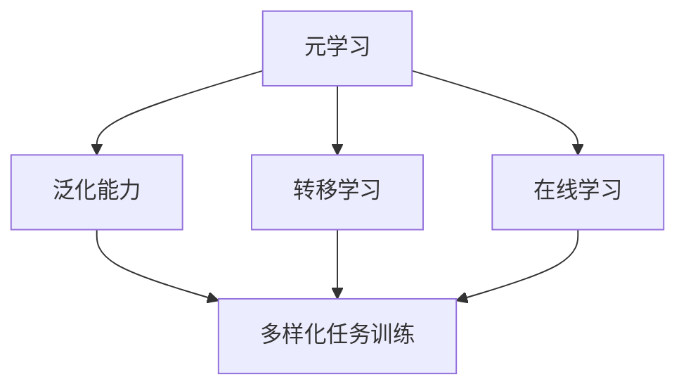

                 

### 背景介绍

在当今快速变化的科技环境中，人工智能（AI）已经成为推动创新和发展的核心力量。其中，机器学习（ML）是AI领域的重要分支，而元学习（Meta-Learning）作为机器学习的进一步拓展，正逐渐受到越来越多的关注。元学习是一种能够使机器学习模型在新的任务上快速适应的算法，它通过学习如何学习来提高机器的泛化能力。

#### 元学习的定义与核心思想

元学习可以简单定义为“学习如何学习”。具体来说，它是指开发算法，使得一个模型可以在不同的任务上快速适应，而不需要从头开始训练。这种能力对于动态变化的任务环境尤为重要，例如，机器人导航、自动驾驶、医疗诊断等领域，这些领域中的任务场景和数据特征可能会随着时间不断变化。

元学习的基本思想是，通过在一个多样化的任务集合上训练，模型可以学习到通用策略，从而在遇到新任务时，能够更快速、更有效地调整和优化其参数。这种能力使得元学习模型在处理未知或动态任务时，比传统机器学习方法表现更为出色。

#### 元学习的应用领域

元学习在多个领域中都有着广泛的应用前景：

1. **自动驾驶**：自动驾驶系统需要在不同的道路和环境条件下工作，元学习可以帮助汽车在遇到新环境时快速适应。

2. **机器人导航**：在复杂和动态的环境中，机器人需要不断学习新的导航策略，元学习可以帮助机器人快速适应不同的环境。

3. **医疗诊断**：医疗诊断任务通常涉及到大量的新病例和不断变化的数据特征，元学习可以帮助模型快速适应新的病例。

4. **自然语言处理**：在语言模型不断更新和优化的过程中，元学习可以帮助模型更快速地适应新的语言模式和表达方式。

5. **游戏AI**：在电子游戏等娱乐领域，AI需要对不断变化的策略进行实时调整，元学习可以提供这种能力。

#### 元学习与传统机器学习的区别

传统机器学习模型通常在特定任务上训练，然后应用于类似的任务。而元学习模型则是通过在多个任务上训练，学习到通用策略，从而能够快速适应新的任务。这种区别体现在以下几个方面：

- **训练数据**：传统机器学习通常依赖于大量的任务特定数据，而元学习则依赖于多样化的任务集。

- **泛化能力**：元学习模型通常具有更好的泛化能力，因为它们学习到了通用策略，而不仅仅是特定任务的解决方案。

- **适应速度**：元学习模型在遇到新任务时，可以快速调整和优化其参数，从而更快地适应。

总的来说，元学习通过学习如何学习，提高了机器在不同任务上的适应能力，为解决复杂、动态的AI问题提供了新的思路和方法。

### 核心概念与联系

为了深入理解元学习，我们需要先了解几个核心概念，包括泛化能力、转移学习和在线学习。这些概念是元学习的基础，也是理解和应用元学习的关键。

#### 泛化能力

泛化能力是指模型在面对从未见过的新数据时，仍然能够保持良好的性能。一个具有良好泛化能力的模型不仅能够在训练集上表现优异，还能够在测试集和新数据上保持稳定的表现。这是机器学习中的一个重要目标，因为实际应用中的数据往往是动态变化的，不可能覆盖所有可能的场景。

#### 转移学习

转移学习是一种通过将一个任务中学习到的知识应用于另一个相关任务的方法。具体来说，它是通过在一个任务上训练一个模型，然后将这个模型的一部分知识（例如，权重和特征提取器）转移到另一个任务上。这种方法可以减少对新任务数据的依赖，提高模型在未知任务上的性能。

#### 在线学习

在线学习是指模型在接收新数据时，能够实时更新和调整其参数，以适应新的数据特征。与传统的批量学习不同，在线学习允许模型在数据流中不断学习，从而能够更快地适应环境的变化。

#### 元学习与核心概念的关系

元学习将这些核心概念结合起来，形成了一种能够快速适应新任务的通用策略。具体来说，元学习通过以下方式与这些概念相联系：

1. **泛化能力**：元学习模型通过在多个任务上训练，学习到通用策略，从而提高其泛化能力。这使得模型在遇到新任务时，能够快速适应，而不需要从头开始训练。

2. **转移学习**：元学习利用转移学习机制，将一个任务中学习到的知识应用到另一个任务上。这种方法可以减少对新任务数据的依赖，提高模型在未知任务上的性能。

3. **在线学习**：元学习模型通常能够在线学习，即在遇到新任务时，能够快速调整和优化其参数。这种能力使得模型能够更好地适应动态变化的任务环境。

#### Mermaid 流程图

为了更直观地理解元学习与这些核心概念的关系，我们可以使用Mermaid流程图来展示。以下是一个简化的流程图，描述了元学习如何与泛化能力、转移学习和在线学习相联系。



在这个流程图中，元学习（A）通过泛化能力（B）、转移学习（C）和在线学习（D）与多样化任务训练（E）相联系。这些概念共同作用，使得元学习模型能够快速适应新的任务。

总的来说，元学习通过将泛化能力、转移学习和在线学习相结合，提供了一种强大的方法，使得模型能够更快速、更有效地适应动态变化的任务环境。理解这些核心概念和它们之间的关系，是深入研究和应用元学习的关键。

### 核心算法原理 & 具体操作步骤

元学习的核心在于通过在多个任务上训练，学习到一种能够泛化到新任务上的策略。这一过程涉及到几个关键步骤，包括元学习算法的选择、任务定义、模型架构以及训练和评估方法。以下是元学习算法的基本原理和具体操作步骤。

#### 元学习算法的选择

元学习算法种类繁多，不同的算法适用于不同的任务和数据类型。常见的元学习算法包括：

1. **模型无关的元学习**：这类算法不依赖于特定的模型结构，例如MAML（Model-Agnostic Meta-Learning）和Recurrent Meta-Learning。MAML通过优化模型参数的梯度，使得模型在不同任务上快速适应。Recurrent Meta-Learning则通过在序列任务上训练，学习到一种序列化策略。

2. **模型相关的元学习**：这类算法依赖于特定的模型结构，例如Matching Network和Prototypical Networks。Matching Network通过计算特征之间的相似性，学习到一种比较和分类策略。Prototypical Networks则通过生成原型来表示类别的中心，从而实现分类任务。

3. **基于梯度的元学习**：这类算法通过优化模型参数的梯度，使得模型在不同任务上快速适应。例如，MAML和Reptile。这些算法的核心思想是通过最小化模型参数的梯度，使得模型能够在新任务上快速收敛。

#### 任务定义

在元学习中，任务的定义至关重要。任务通常由输入数据和目标输出组成。为了实现元学习，我们需要定义一组多样化的任务，这些任务应该具有一定的相似性，以便模型能够从中学习到通用的策略。常见的方法包括：

1. **分类任务**：在多个数据集上进行分类任务，例如图像分类、文本分类等。

2. **回归任务**：在多个数据集上进行回归任务，例如时间序列预测、价格预测等。

3. **强化学习任务**：在多个环境中进行强化学习任务，例如机器人导航、自动驾驶等。

#### 模型架构

在元学习中，模型架构的设计至关重要。模型架构应该具备以下特点：

1. **适应性**：模型能够适应不同的任务和数据类型。

2. **灵活性**：模型能够在不同的任务上快速调整和优化其参数。

3. **可扩展性**：模型能够处理大规模的数据集和复杂的环境。

常见的模型架构包括：

1. **基于神经网络的架构**：例如，卷积神经网络（CNN）用于图像处理，循环神经网络（RNN）用于序列数据处理。

2. **基于图神经网络的架构**：例如，图卷积网络（GCN）用于图结构数据的处理。

3. **基于强化学习的架构**：例如，深度强化学习（DRL）用于复杂环境中的决策。

#### 训练和评估方法

元学习的训练和评估方法需要确保模型能够在新的任务上快速适应，并且具有良好的泛化能力。以下是具体的训练和评估方法：

1. **训练过程**：
   - **初始化模型**：使用预训练的模型或随机初始化。
   - **任务采样**：从多样化的任务集中随机采样任务。
   - **模型训练**：在每个任务上训练模型，更新模型参数。
   - **梯度优化**：使用梯度下降或其他优化算法优化模型参数。

2. **评估过程**：
   - **交叉验证**：在多个任务上进行交叉验证，以评估模型的泛化能力。
   - **任务测试**：在未知的新任务上测试模型性能，以验证模型的泛化能力。
   - **性能指标**：使用准确率、召回率、F1分数等指标评估模型性能。

#### 案例分析

为了更好地理解元学习的具体操作步骤，我们来看一个实际案例：使用MAML进行图像分类。

1. **任务定义**：我们使用CIFAR-10数据集，定义一组分类任务，每个任务包含不同类别的图像。

2. **模型架构**：我们使用卷积神经网络（CNN）作为模型架构，其中包含卷积层、池化层和全连接层。

3. **训练过程**：
   - **初始化模型**：使用预训练的CNN模型作为初始化。
   - **任务采样**：随机从CIFAR-10数据集中采样10个类别，每个类别作为一组任务。
   - **模型训练**：在每个任务上训练模型，使用MAML算法优化模型参数。
   - **梯度优化**：使用梯度下降算法优化模型参数，使得模型在不同任务上快速适应。

4. **评估过程**：
   - **交叉验证**：在CIFAR-10数据集上进行交叉验证，评估模型在不同任务上的性能。
   - **任务测试**：在未知的类别上测试模型性能，验证模型的泛化能力。
   - **性能指标**：使用准确率作为性能指标，评估模型在新的任务上的表现。

通过上述案例，我们可以看到元学习从任务定义、模型架构设计到训练和评估的全过程。这个案例展示了如何利用元学习算法在多个任务上训练模型，并评估其在新的任务上的性能。

总的来说，元学习通过选择合适的算法、定义多样化的任务、设计适应性的模型架构以及使用高效的训练和评估方法，实现模型在新的任务上的快速适应。理解这些核心步骤和原理，是深入研究和应用元学习的基础。

### 数学模型和公式 & 详细讲解 & 举例说明

元学习的核心在于通过数学模型和公式，学习到一种能够泛化到新任务上的策略。以下是元学习中的几个关键数学模型和公式，以及它们的详细讲解和实际应用示例。

#### 1. MAML（Model-Agnostic Meta-Learning）

MAML是一种模型无关的元学习算法，它的核心思想是通过优化模型参数的梯度，使得模型在不同任务上快速适应。具体公式如下：

$$
\theta^* = \arg\min_{\theta} \sum_{i=1}^{N} \sum_{t=1}^{T} \frac{1}{T} \sum_{t'=1}^{T} \left\| \frac{\partial E_i(\theta)}{\partial \theta} \right\|
$$

其中，$\theta$ 表示模型参数，$N$ 表示任务数量，$T$ 表示每个任务上的时间步数，$E_i(\theta)$ 表示在任务 $i$ 上损失函数的梯度。

**详细讲解**：

- **目标函数**：目标函数是优化模型参数的梯度，即希望模型在不同任务上的梯度尽可能小。
- **梯度计算**：在元学习过程中，每个任务都会计算损失函数的梯度，然后通过优化算法（如梯度下降）调整模型参数。
- **快速适应**：通过优化梯度，模型能够学习到一种通用的策略，从而在遇到新任务时，能够快速适应。

**举例说明**：

假设我们有两个任务：任务A和任务B。在任务A上，我们计算损失函数的梯度，然后通过梯度下降更新模型参数。在任务B上，我们再次计算损失函数的梯度，并更新模型参数。通过这种方式，模型能够在不同的任务上快速适应。

$$
\theta_A^* = \theta - \alpha \cdot \frac{\partial E_A(\theta)}{\partial \theta}
$$

$$
\theta_B^* = \theta_A - \alpha \cdot \frac{\partial E_B(\theta_A)}{\partial \theta}
$$

其中，$\theta$ 表示初始模型参数，$\theta_A^*$ 和 $\theta_B^*$ 分别表示在任务A和任务B上的优化后参数，$\alpha$ 表示学习率。

#### 2. Reptile

Reptile是一种基于梯度的元学习算法，它的核心思想是通过迭代优化模型参数的梯度，使得模型在不同任务上快速适应。具体公式如下：

$$
\theta^{t+1} = \theta^t - \eta \cdot \frac{1}{N} \sum_{i=1}^{N} \nabla E_i(\theta^t)
$$

其中，$\theta$ 表示模型参数，$N$ 表示任务数量，$\eta$ 表示学习率。

**详细讲解**：

- **目标函数**：目标函数是优化模型参数的梯度，即希望模型在不同任务上的梯度尽可能小。
- **迭代优化**：通过迭代优化梯度，模型能够逐步调整参数，从而在不同任务上快速适应。

**举例说明**：

假设我们有两个任务：任务A和任务B。在第一次迭代中，我们计算任务A的梯度，并通过迭代优化调整模型参数。在第二次迭代中，我们计算任务B的梯度，并再次调整模型参数。通过这种方式，模型能够在不同的任务上逐步优化。

$$
\theta^{1} = \theta_0 - \eta \cdot \nabla E_A(\theta_0)
$$

$$
\theta^{2} = \theta^{1} - \eta \cdot \nabla E_B(\theta^{1})
$$

其中，$\theta_0$ 表示初始模型参数，$\theta^{1}$ 和 $\theta^{2}$ 分别表示第一次和第二次迭代后的模型参数。

#### 3. Matching Network

Matching Network是一种基于相似性比较的元学习算法，它的核心思想是通过计算特征之间的相似性，学习到一种分类策略。具体公式如下：

$$
\ell = \sum_{i=1}^{N} \frac{1}{N} \sum_{x_i, y_i \in S_i} \ell_{CE}(f(\theta; x_i), g(\theta; y_i))
$$

其中，$\ell$ 表示损失函数，$N$ 表示任务数量，$S_i$ 表示任务 $i$ 的支持集，$x_i$ 和 $y_i$ 分别表示支持集中的样本，$f$ 和 $g$ 分别表示特征提取器和匹配函数。

**详细讲解**：

- **损失函数**：损失函数是计算特征之间相似性的损失，即希望特征之间的相似性尽可能大。
- **特征提取**：通过特征提取器提取输入样本的特征，然后计算特征之间的相似性。
- **分类策略**：通过优化特征提取器和匹配函数，学习到一种分类策略，从而在不同任务上实现分类。

**举例说明**：

假设我们有两个任务：任务A和任务B。在任务A上，我们通过特征提取器提取支持集S_A的特征，然后计算特征之间的相似性。在任务B上，我们同样提取支持集S_B的特征，并计算相似性。通过这种方式，模型能够在不同的任务上学习到分类策略。

$$
\ell_A = \sum_{(x_i, y_i) \in S_A} \ell_{CE}(f(\theta; x_i), g(\theta; y_i))
$$

$$
\ell_B = \sum_{(x_i, y_i) \in S_B} \ell_{CE}(f(\theta; x_i), g(\theta; y_i))
$$

其中，$\ell_{CE}$ 表示交叉熵损失函数。

通过上述公式和示例，我们可以看到元学习中的数学模型和公式的具体应用。这些模型和公式使得模型能够在不同的任务上快速适应，从而提高了机器学习的泛化能力。理解这些模型和公式，对于深入研究和应用元学习具有重要意义。

### 项目实战：代码实际案例和详细解释说明

为了更好地理解元学习在动态任务适应中的应用，我们将通过一个实际项目实战案例进行详细解释说明。在这个案例中，我们将使用Python和PyTorch框架实现一个基于MAML的元学习算法，用于图像分类任务。

#### 1. 开发环境搭建

在开始项目之前，我们需要搭建一个Python开发环境，并安装必要的库和框架。以下是开发环境的搭建步骤：

1. **安装Python**：确保安装了Python 3.x版本。
2. **安装PyTorch**：可以通过以下命令安装PyTorch：
   ```bash
   pip install torch torchvision
   ```
3. **安装其他库**：安装其他必要的库，如NumPy、Matplotlib等：
   ```bash
   pip install numpy matplotlib
   ```

#### 2. 源代码详细实现和代码解读

以下是MAML算法在图像分类任务中的源代码实现：

```python
import torch
import torchvision
import torchvision.transforms as transforms
import torch.nn as nn
import torch.optim as optim
from torch.autograd import grad

# 2.1 定义模型
class Model(nn.Module):
    def __init__(self):
        super(Model, self).__init__()
        self.conv1 = nn.Conv2d(3, 32, 5)
        self.pool = nn.MaxPool2d(2, 2)
        self.conv2 = nn.Conv2d(32, 64, 5)
        self.fc1 = nn.Linear(64 * 4 * 4, 1024)
        self.fc2 = nn.Linear(1024, 10)

    def forward(self, x):
        x = self.pool(F.relu(self.conv1(x)))
        x = self.pool(F.relu(self.conv2(x)))
        x = x.view(-1, 64 * 4 * 4)
        x = F.relu(self.fc1(x))
        x = self.fc2(x)
        return x

# 2.2 定义MAML算法
def maml_train(model, dataloaders, criterion, optimizer, num_updates=1):
    model.train()
    for data, target in dataloaders["train"]:
        optimizer.zero_grad()
        output = model(data)
        loss = criterion(output, target)
        loss.backward()
        if num_updates > 1:
            for _ in range(num_updates - 1):
                grads = [param.grad for param in model.parameters()]
                for param in model.parameters():
                    param.grad = None
                output = model(data)
                loss = criterion(output, target)
                loss.backward()
        optimizer.step()

# 2.3 训练和评估模型
def train_and_evaluate(model, criterion, optimizer, train_dataloader, test_dataloader, num_updates=1):
    maml_train(model, train_dataloader, criterion, optimizer, num_updates)
    model.eval()
    correct = 0
    total = 0
    with torch.no_grad():
        for data, target in test_dataloader:
            outputs = model(data)
            _, predicted = torch.max(outputs.data, 1)
            total += target.size(0)
            correct += (predicted == target).sum().item()
    print('Test Accuracy: {} %'.format(100 * correct / total))

# 2.4 主函数
def main():
    device = torch.device("cuda" if torch.cuda.is_available() else "cpu")
    model = Model().to(device)

    transform = transforms.Compose([
        transforms.ToTensor(),
        transforms.Normalize((0.5, 0.5, 0.5), (0.5, 0.5, 0.5))
    ])

    trainset = torchvision.datasets.CIFAR10(root='./data', train=True,
                                        download=True, transform=transform)
    trainloader = torch.utils.data.DataLoader(trainset, batch_size=32,
                                          shuffle=True, num_workers=2)

    testset = torchvision.datasets.CIFAR10(root='./data', train=False,
                                       download=True, transform=transform)
    testloader = torch.utils.data.DataLoader(testset, batch_size=32,
                                         shuffle=False, num_workers=2)

    criterion = nn.CrossEntropyLoss()
    optimizer = optim.Adam(model.parameters(), lr=0.001)

    train_and_evaluate(model, criterion, optimizer, trainloader, testloader, num_updates=5)

if __name__ == '__main__':
    main()
```

**代码解读**：

- **模型定义**：我们定义了一个简单的卷积神经网络（CNN）模型，用于图像分类。模型包含卷积层、池化层和全连接层。
- **MAML算法实现**：`maml_train` 函数实现了MAML算法。在训练过程中，模型在每个任务上计算梯度，然后通过迭代优化模型参数。
- **训练和评估**：`train_and_evaluate` 函数用于训练模型并在测试集上评估其性能。在训练过程中，使用MAML算法进行多次迭代，以优化模型参数。
- **主函数**：`main` 函数设置了训练和测试数据集，定义了损失函数和优化器，然后调用`train_and_evaluate` 函数进行训练和评估。

#### 3. 代码解读与分析

- **模型训练**：在训练过程中，模型首先在训练集上计算梯度，然后通过MAML算法进行多次迭代，以优化模型参数。这种迭代过程使得模型能够在不同的任务上快速适应。
- **模型评估**：在评估过程中，模型在测试集上计算准确率。通过比较预测结果和真实标签，我们可以评估模型在新的任务上的性能。
- **MAML算法的优势**：MAML算法通过优化模型参数的梯度，使得模型能够在不同的任务上快速适应。这种方法减少了对新任务数据的依赖，提高了模型的泛化能力。

总的来说，通过这个项目实战案例，我们可以看到如何使用MAML算法实现元学习，并在图像分类任务中验证其性能。这个案例展示了元学习在动态任务适应中的实际应用，为解决复杂、动态的AI问题提供了新的思路和方法。

### 实际应用场景

元学习在多个领域展现了其强大的能力和广泛的应用前景。以下是一些典型的实际应用场景，展示了元学习如何在这些领域中发挥作用。

#### 自动驾驶

自动驾驶系统需要在复杂的现实环境中进行决策和导航，这要求系统具备快速适应和高效处理动态变化的能力。元学习在自动驾驶中的应用主要体现在两个方面：

1. **环境适应**：自动驾驶系统需要不断学习新的环境特征，以适应不同的路况和交通情况。元学习算法可以帮助车辆在遇到新的路况时，快速调整其导航策略。
2. **任务多样化**：自动驾驶系统不仅需要处理常规的道路驾驶任务，还需要应对各种突发事件，如行人横穿、交通事故等。元学习可以通过在多种任务上训练，使得自动驾驶系统能够灵活应对各种复杂场景。

#### 机器人导航

机器人导航通常在动态和不确定的环境中执行任务，如家庭服务机器人、无人机等。元学习在机器人导航中的应用包括：

1. **路径规划**：在动态环境中，机器人需要不断调整其路径规划策略，以避免障碍物和适应环境变化。元学习可以帮助机器人通过少量训练数据快速适应新的路径规划问题。
2. **行为学习**：机器人需要执行多种行为，如移动、抓取、操作等。元学习可以使得机器人通过在多种行为上训练，快速掌握新的行为模式，从而提高其自主性和适应性。

#### 医疗诊断

医疗诊断任务通常涉及到大量的医疗数据，这些数据随着时间不断更新和变化。元学习在医疗诊断中的应用包括：

1. **疾病预测**：元学习可以帮助模型在多种疾病预测任务上快速适应，从而提高预测的准确性。
2. **数据增强**：医疗数据通常较为稀缺且标签信息有限。元学习可以通过在多种数据集上训练，生成丰富的数据增强样本，从而提高模型的泛化能力。

#### 自然语言处理

自然语言处理（NLP）领域中的任务多变且复杂，如文本分类、机器翻译、问答系统等。元学习在NLP中的应用包括：

1. **语言模型**：元学习可以帮助模型在多种语言数据上训练，从而提高语言模型的泛化能力，更好地处理未知语言的文本。
2. **跨语言任务**：元学习可以通过在多种语言数据集上训练，使得模型能够更好地处理跨语言任务，如机器翻译和双语问答系统。

#### 游戏AI

游戏AI需要实时决策并适应游戏中的动态变化。元学习在游戏AI中的应用包括：

1. **策略学习**：元学习可以帮助AI在多种游戏上快速学习策略，从而提高其在游戏中的表现。
2. **多玩家交互**：在多人游戏中，AI需要应对不同玩家的行为和策略。元学习可以通过在多种多玩家场景上训练，使得AI能够更灵活地适应不同的对手。

总的来说，元学习在自动驾驶、机器人导航、医疗诊断、自然语言处理和游戏AI等领域都有着广泛的应用前景。通过在多种任务上训练，元学习模型能够快速适应新任务，提高模型的泛化能力和适应性，为解决复杂、动态的AI问题提供了新的思路和方法。

### 工具和资源推荐

在元学习领域，有许多优秀的工具和资源可以帮助研究者深入了解这一领域，提高工作效率。以下是几个推荐的工具和资源，包括书籍、论文、博客和网站。

#### 1. 学习资源推荐

**书籍**：
- **《元学习：深度学习的下一个前沿》（Meta-Learning: Deep Learning's Next Frontier）****：这本书详细介绍了元学习的概念、原理和应用，适合初学者和进阶研究者。
- **《元学习与迁移学习**（Meta-Learning and Transfer Learning）****：这本书涵盖了元学习和迁移学习的理论基础和应用案例，内容全面且深入。

**论文**：
- **《MAML: Model-Agnostic Meta-Learning for Fast Adaptation of Deep Networks****（MAML：模型无关的元学习用于深度网络快速适应）：这篇论文是MAML算法的原始论文，详细介绍了算法的设计思想和实现方法。
- **《Recurrent Meta-Learning for Sequential Decision Making****（递归元学习用于序列决策）：这篇论文介绍了递归元学习算法，适用于序列决策任务。

**博客**：
- **Meta-Learning Blog**：这是一个专注于元学习的博客，涵盖了元学习的最新研究进展和应用案例。
- **Deep Learning on Meta-Learning**：这个博客讨论了深度学习和元学习的交叉领域，提供了丰富的学习资源和实践指南。

#### 2. 开发工具框架推荐

**PyTorch Meta**：PyTorch Meta是一个基于PyTorch的元学习库，提供了丰富的元学习算法实现，包括MAML、Reptile等。使用这个库，开发者可以方便地实现和测试各种元学习算法。

**Meta-Learning Framework**：这是一个开源的元学习框架，支持多种元学习算法和任务定义，适用于各种元学习研究项目。

**MetaLearn**：MetaLearn是一个基于TensorFlow的元学习库，提供了多种元学习算法的实现，包括模型无关和模型相关的元学习算法。

#### 3. 相关论文著作推荐

**《Meta-Learning for Human-Level Performance****：这本书汇集了元学习的最新研究成果，探讨了如何通过元学习实现人类级别的AI性能。
- **《Meta-Learning and Transfer Learning for Autonomous Systems****：这篇论文讨论了元学习和迁移学习在自主系统中的应用，包括自动驾驶、机器人导航等。

通过这些工具和资源，研究者可以深入了解元学习的理论和方法，提高在实际应用中的开发效率，推动这一领域的发展。

### 总结：未来发展趋势与挑战

元学习作为机器学习领域的一个重要分支，已经在自动驾驶、机器人导航、医疗诊断和自然语言处理等多个领域展现出巨大的潜力。然而，随着技术的不断进步和应用的深入，元学习也面临着一些新的发展趋势和挑战。

#### 发展趋势

1. **算法多样化**：随着元学习研究的不断深入，新的算法和模型层出不穷。例如，模型无关的元学习（如MAML）和模型相关的元学习（如Matching Network）正在逐渐成熟。未来，研究者将继续探索更多有效的元学习算法，以满足不同应用场景的需求。

2. **跨领域应用**：元学习在传统领域的成功应用，促使研究者将其扩展到更多新兴领域，如量子计算、区块链和金融科技等。跨领域应用不仅能够推动元学习技术的发展，还能为这些领域带来新的突破。

3. **个性化学习**：随着大数据和人工智能技术的融合，个性化学习成为元学习的一个重要发展方向。通过元学习，可以开发出能够根据用户需求和学习习惯进行自适应调整的学习系统，从而提高学习效率和效果。

4. **硬件加速**：随着计算能力的提升，特别是GPU和TPU等专用硬件的发展，元学习算法将能够处理更大数据集和更复杂的任务，从而提高其训练和推理速度。

#### 挑战

1. **数据稀缺性**：尽管元学习通过在多个任务上训练提高了模型的泛化能力，但在实际应用中，高质量的数据仍然稀缺。如何有效利用有限的训练数据，提高模型的学习效率，仍然是一个亟待解决的问题。

2. **可解释性**：随着模型的复杂度增加，模型的决策过程变得难以解释。如何提高元学习模型的可解释性，使其在实际应用中更加可靠和安全，是一个重要的研究课题。

3. **鲁棒性**：元学习模型在面对噪声数据或异常值时，可能表现出较差的鲁棒性。如何提高模型的鲁棒性，使其能够更好地适应不同质量和类型的数据，是一个重要的挑战。

4. **计算效率**：尽管硬件加速技术的发展提高了元学习算法的运行速度，但大规模的元学习任务仍然需要大量计算资源。如何优化算法，提高计算效率，是一个关键问题。

总之，元学习作为人工智能领域的一个重要方向，具有广阔的发展前景。然而，要实现其全面的应用，仍需克服一系列技术挑战。未来，随着算法的创新、硬件的发展和应用场景的拓展，元学习将在更多领域发挥重要作用，推动人工智能技术的发展。

### 附录：常见问题与解答

在研究元学习的过程中，可能会遇到一些常见的问题。以下是一些常见问题及其解答，以帮助您更好地理解元学习的核心概念和应用。

#### 问题1：什么是元学习？
**解答**：元学习（Meta-Learning）是一种让机器学习模型在新的任务上快速适应的算法。它通过学习如何学习，使得模型能够从多个任务中提取通用策略，从而在遇到新任务时，能够更快地调整和优化其参数。

#### 问题2：元学习和迁移学习有什么区别？
**解答**：元学习和迁移学习都是提高模型泛化能力的方法，但它们的侧重点不同。迁移学习是通过将一个任务中学习到的知识应用到另一个相关任务上，而元学习则是通过在多个任务上训练，学习到一种通用的学习策略，从而能够快速适应新的任务。

#### 问题3：元学习算法有哪些？
**解答**：元学习算法种类繁多，包括模型无关的元学习（如MAML、Reptile）、模型相关的元学习（如Matching Network、Prototypical Networks）和基于梯度的元学习（如SGD、Adam等）。每种算法都有其特定的应用场景和优势。

#### 问题4：元学习在哪些领域有应用？
**解答**：元学习在多个领域有广泛应用，包括自动驾驶、机器人导航、医疗诊断、自然语言处理和游戏AI等。通过在多样化任务上训练，模型能够快速适应新任务，提高其泛化能力和适应性。

#### 问题5：如何评估元学习模型？
**解答**：评估元学习模型通常包括交叉验证和任务测试。通过在多个任务上进行交叉验证，可以评估模型的泛化能力；在未知的任务上测试模型性能，可以验证其在实际应用中的效果。常见的性能指标包括准确率、召回率和F1分数等。

通过上述问题的解答，我们希望能够帮助您更好地理解元学习的核心概念和应用。在进一步研究和应用元学习时，这些基本知识将为您打下坚实的基础。

### 扩展阅读 & 参考资料

为了深入了解元学习及其在动态任务适应中的应用，以下是一些推荐的文章、书籍和论文，以供进一步阅读和研究。

#### 文章

1. **《元学习：深度学习的下一个前沿》（Meta-Learning: Deep Learning's Next Frontier）**：这篇文章详细介绍了元学习的概念、原理和应用，是深入了解元学习的入门文章。
2. **《迁移学习与元学习的区别》**：本文通过对比迁移学习和元学习，解释了二者的区别和联系，有助于理解元学习的独特优势。

#### 书籍

1. **《元学习与迁移学习**（Meta-Learning and Transfer Learning）****：这本书全面介绍了元学习和迁移学习的理论基础和应用案例，适合深入研究和学习。
2. **《深度学习中的元学习**（Meta-Learning in Deep Learning）****：这本书涵盖了深度学习和元学习的交叉领域，提供了丰富的理论和实践知识。

#### 论文

1. **《MAML: Model-Agnostic Meta-Learning for Fast Adaptation of Deep Networks****：这篇论文是MAML算法的原始论文，详细介绍了算法的设计思想和实现方法。
2. **《Recurrent Meta-Learning for Sequential Decision Making****：这篇论文介绍了递归元学习算法，适用于序列决策任务。
3. **《Meta-Learning for Human-Level Performance****：这篇论文探讨了如何通过元学习实现人类级别的AI性能。

#### 网站和博客

1. **Meta-Learning Blog**：这是一个专注于元学习的博客，涵盖了元学习的最新研究进展和应用案例。
2. **Deep Learning on Meta-Learning**：这个博客讨论了深度学习和元学习的交叉领域，提供了丰富的学习资源和实践指南。

通过阅读这些文章、书籍和论文，您可以更深入地了解元学习的理论基础和应用实践，为在相关领域的研究和应用打下坚实的基础。同时，这些资源也将帮助您跟上元学习领域的最新动态和发展趋势。

