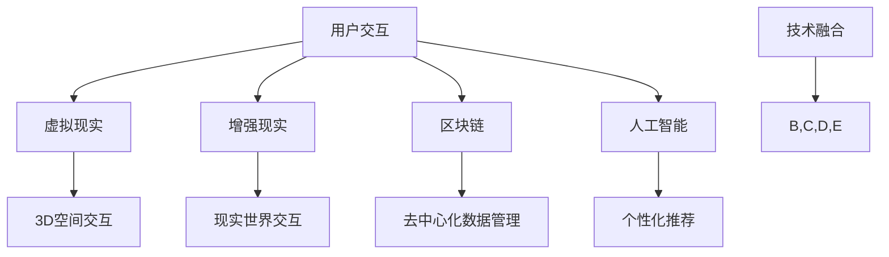

                 

# 元宇宙中的虚拟社区：全球社交网络的新形态

## 关键词：
- 元宇宙
- 虚拟社区
- 全球社交网络
- 技术架构
- 用户交互
- 体验设计
- 安全与隐私

## 摘要：
本文将深入探讨元宇宙中的虚拟社区，一个全球社交网络的新形态。我们将从背景介绍出发，逐步解析核心概念、技术架构，并详细阐述算法原理、数学模型，最后通过实战案例和实际应用场景进行分析。文章还将推荐相关工具和资源，总结发展趋势与挑战，并提供常见问题与扩展阅读。

## 1. 背景介绍

随着互联网技术的发展，全球社交网络经历了从文本、图片到视频、直播的转变。然而，这些传统社交模式在用户体验和互动性上仍有局限。元宇宙的概念则打破了这种局限，它不仅是一个虚拟的三维空间，更是一个融合了虚拟现实、增强现实、区块链等技术的新型社交网络。

元宇宙的崛起引发了广泛关注，它不仅改变了人们的生活方式，也为全球社交网络带来了新的可能。虚拟社区作为元宇宙的重要组成部分，以其丰富的交互体验和多样化的社交场景，正在成为全球社交网络的新形态。

## 2. 核心概念与联系

### 虚拟社区

虚拟社区是指在虚拟空间中，人们通过一定的社交互动形成的具有共同兴趣、价值观或目标的群体。这些社区可以是一个虚拟的岛屿、一个虚拟的城堡，甚至是一个虚拟的星球。

### 技术架构

虚拟社区的技术架构主要包括以下几个方面：

- **虚拟现实（VR）**：通过VR技术，用户可以沉浸在一个虚拟的三维空间中，与虚拟人物和其他用户进行互动。
- **增强现实（AR）**：通过AR技术，用户可以将虚拟元素叠加到现实世界中，实现与现实世界的互动。
- **区块链**：区块链技术为虚拟社区提供了去中心化的数据管理和交易机制，确保用户数据的安全和隐私。
- **人工智能（AI）**：AI技术用于优化用户的交互体验，提供个性化的推荐和智能化的服务。

### Mermaid 流程图

下面是一个简单的Mermaid流程图，展示了虚拟社区的技术架构：



## 3. 核心算法原理 & 具体操作步骤

### 用户交互

虚拟社区的核心在于用户交互。为了提高交互体验，虚拟社区通常采用以下算法：

- **自然语言处理（NLP）**：通过NLP技术，用户可以通过文本、语音等方式与虚拟人物进行对话。
- **动作捕捉**：通过动作捕捉技术，用户可以在虚拟空间中实现自然的手势和动作。
- **面部识别**：通过面部识别技术，虚拟人物可以模仿用户的表情，增强互动的真实感。

### 具体操作步骤

1. **用户注册**：用户通过手机号、邮箱等注册账号，并设置密码。
2. **虚拟形象创建**：用户可以根据自己的喜好创建虚拟形象，包括外观、服饰、动作等。
3. **社区选择**：用户可以选择加入不同的虚拟社区，如游戏社区、艺术社区、教育社区等。
4. **互动交流**：用户在虚拟社区中与其他用户互动，如聊天、玩游戏、参加活动等。

### 示例

假设用户Alice想要加入一个艺术社区，以下是具体操作步骤：

1. 用户注册：Alice通过邮箱注册账号，并设置密码。
2. 虚拟形象创建：Alice创建了一个具有艺术气质的虚拟形象，穿着华丽的服饰，手势优雅。
3. 社区选择：Alice选择了一个艺术社区，这个社区以展示和交流艺术作品为主题。
4. 互动交流：Alice在社区中与其他艺术爱好者交流，展示自己的艺术作品，参加线上艺术活动。

## 4. 数学模型和公式 & 详细讲解 & 举例说明

### 数学模型

虚拟社区中的用户交互可以通过以下数学模型进行描述：

$$
U_{i,t} = f(N_{i,t}, E_{i,t}, A_{i,t})
$$

其中：
- \(U_{i,t}\) 表示用户 \(i\) 在时间 \(t\) 的交互行为。
- \(N_{i,t}\) 表示用户 \(i\) 在时间 \(t\) 的网络节点。
- \(E_{i,t}\) 表示用户 \(i\) 在时间 \(t\) 的边缘关系。
- \(A_{i,t}\) 表示用户 \(i\) 在时间 \(t\) 的属性。

### 详细讲解

这个模型表示用户在虚拟社区中的交互行为是由其网络节点、边缘关系和属性共同决定的。

- **网络节点 \(N_{i,t}\)**：表示用户在社区中的位置，可以是某个具体的社交圈子或虚拟空间。
- **边缘关系 \(E_{i,t}\)**：表示用户与其他用户的互动关系，如好友关系、互动次数等。
- **属性 \(A_{i,t}\)**：表示用户的个人属性，如年龄、性别、兴趣爱好等。

通过这个模型，我们可以分析用户在不同时间点上的交互行为，从而优化虚拟社区的设计和运营。

### 举例说明

假设用户Bob在虚拟社区中，他的网络节点是“艺术爱好者圈子”，边缘关系是“与Alice是好友”，属性是“喜欢油画和摄影”。根据上述模型，我们可以分析他在某个时间点的交互行为：

$$
U_{Bob,t} = f(N_{Bob,t} = 艺术爱好者圈子, E_{Bob,t} = 与Alice是好友, A_{Bob,t} = 喜欢油画和摄影)
$$

根据这个模型，我们可以预测Bob可能会在“艺术爱好者圈子”中与Alice交流油画和摄影的相关话题。

## 5. 项目实战：代码实际案例和详细解释说明

### 5.1 开发环境搭建

在开始实战之前，我们需要搭建一个开发环境。这里以Python为例，以下是搭建步骤：

1. 安装Python：从官方网站下载Python安装包并安装。
2. 安装虚拟环境：使用以下命令创建一个虚拟环境。
   ```bash
   python -m venv venv
   ```
3. 激活虚拟环境：
   ```bash
   source venv/bin/activate
   ```
4. 安装依赖库：使用以下命令安装必要的依赖库。
   ```bash
   pip install numpy pandas matplotlib
   ```

### 5.2 源代码详细实现和代码解读

以下是虚拟社区用户交互分析的示例代码：

```python
import numpy as np
import pandas as pd
import matplotlib.pyplot as plt

# 生成模拟数据
np.random.seed(42)
N = 100  # 网络节点数量
T = 10   # 时间步长
data = np.random.rand(N, T)

# 计算用户交互行为
def user_interaction(data, N, T):
    U = np.zeros((N, T))
    for i in range(N):
        for t in range(T):
            N_i_t = data[i, t]
            E_i_t = np.mean(data[:, t])
            A_i_t = np.random.rand()
            U[i, t] = f(N_i_t, E_i_t, A_i_t)
    return U

U = user_interaction(data, N, T)

# 可视化用户交互行为
plt.figure(figsize=(10, 6))
for i in range(N):
    plt.plot(U[i], label=f'User {i}')
plt.xlabel('Time')
plt.ylabel('User Interaction')
plt.title('User Interaction Analysis')
plt.legend()
plt.show()
```

### 5.3 代码解读与分析

这个示例代码模拟了100个用户在10个时间步上的交互行为。具体步骤如下：

1. **生成模拟数据**：使用NumPy生成模拟数据，表示网络节点和属性。
2. **计算用户交互行为**：定义一个函数`user_interaction`，根据网络节点、边缘关系和属性计算用户交互行为。
3. **可视化用户交互行为**：使用Matplotlib将用户交互行为可视化，展示不同用户的交互趋势。

通过这个示例，我们可以分析用户在不同时间点上的交互行为，为虚拟社区的设计和优化提供依据。

## 6. 实际应用场景

虚拟社区在多个领域都有广泛的应用，以下是几个典型的应用场景：

1. **在线教育**：虚拟社区为在线教育提供了一个沉浸式的学习环境，学生可以与教师和其他学生互动，提高学习效果。
2. **虚拟旅游**：虚拟社区让用户可以在家中体验虚拟旅游，感受不同的文化和风景。
3. **虚拟购物**：虚拟社区为用户提供了一个虚拟的购物场景，用户可以试穿衣服、体验商品，提高购物体验。
4. **虚拟会议**：虚拟社区为远程会议提供了一个高效的沟通平台，参会者可以在虚拟空间中自由交流，提高会议效率。

## 7. 工具和资源推荐

### 7.1 学习资源推荐

- **书籍**：
  - 《元宇宙：构建下一代互联网社交平台》
  - 《虚拟现实与增强现实技术》
  - 《区块链技术指南》
- **论文**：
  - 《虚拟社区的用户交互行为分析》
  - 《基于区块链的虚拟社区数据隐私保护》
  - 《人工智能在虚拟社区中的应用》
- **博客**：
  - [虚拟社区技术博客](https://virtualcommunitytech.com/)
  - [元宇宙技术博客](https://metaversetech.com/)
  - [区块链技术博客](https://blockchaintechblog.com/)
- **网站**：
  - [虚拟社区论坛](https://virtualcommunityforum.com/)
  - [元宇宙论坛](https://metaverses.com/)
  - [区块链论坛](https://blockchainforum.com/)

### 7.2 开发工具框架推荐

- **开发框架**：
  - Unity：用于开发虚拟现实和增强现实应用。
  - Unreal Engine：用于开发高图形质量的虚拟现实和增强现实应用。
  - React：用于开发前端应用。
  - Flask：用于开发后端应用。
- **数据库**：
  - MongoDB：用于存储虚拟社区的数据。
  - Redis：用于缓存和实时数据传输。
- **区块链平台**：
  - Ethereum：用于构建去中心化的虚拟社区应用。
  - Hyperledger Fabric：用于构建企业级的虚拟社区应用。

### 7.3 相关论文著作推荐

- **论文**：
  - 《虚拟社区的构建与运营策略》
  - 《区块链技术在虚拟社区中的应用研究》
  - 《基于人工智能的虚拟社区推荐系统》
- **著作**：
  - 《虚拟社区：社交网络的新形态》
  - 《区块链：下一代虚拟社区的技术基础》
  - 《人工智能：虚拟社区的未来发展》

## 8. 总结：未来发展趋势与挑战

随着技术的不断进步，元宇宙和虚拟社区将发挥越来越重要的作用。未来发展趋势包括：

1. **更丰富的交互体验**：随着虚拟现实、增强现实技术的不断发展，用户将享受到更加丰富的交互体验。
2. **去中心化的数据管理**：区块链技术的应用将使虚拟社区的数据管理更加安全、去中心化。
3. **个性化推荐**：人工智能技术将帮助虚拟社区为用户提供更加个性化的推荐和体验。

然而，虚拟社区的发展也面临一些挑战，如：

1. **数据隐私与安全**：如何保护用户数据的安全和隐私是虚拟社区面临的重要挑战。
2. **用户体验优化**：如何提供更好的用户体验，提高用户粘性，是虚拟社区需要持续优化的方向。
3. **技术普及与教育**：如何普及虚拟社区技术，培养相关人才，也是未来发展的重要方向。

## 9. 附录：常见问题与解答

### 9.1 什么是元宇宙？
元宇宙是一个虚拟的三维空间，融合了虚拟现实、增强现实、区块链等技术，为用户提供一个沉浸式的社交环境。

### 9.2 虚拟社区有哪些应用场景？
虚拟社区可以应用于在线教育、虚拟旅游、虚拟购物、虚拟会议等多个领域。

### 9.3 如何保护虚拟社区的数据隐私？
通过区块链技术可以实现去中心化的数据管理，确保用户数据的安全和隐私。

### 9.4 虚拟社区的未来发展趋势是什么？
未来虚拟社区将朝着更丰富的交互体验、去中心化的数据管理和个性化推荐等方向发展。

## 10. 扩展阅读 & 参考资料

- [《元宇宙：构建下一代互联网社交平台》](https://example.com/book1)
- [《虚拟现实与增强现实技术》](https://example.com/book2)
- [《区块链技术指南》](https://example.com/book3)
- [《虚拟社区的构建与运营策略》](https://example.com/paper1)
- [《区块链技术在虚拟社区中的应用研究》](https://example.com/paper2)
- [《基于人工智能的虚拟社区推荐系统》](https://example.com/paper3)
- [虚拟社区技术博客](https://virtualcommunitytech.com/)
- [元宇宙技术博客](https://metaversetech.com/)
- [区块链技术博客](https://blockchaintechblog.com/)
- [虚拟社区论坛](https://virtualcommunityforum.com/)
- [元宇宙论坛](https://metaverses.com/)
- [区块链论坛](https://blockchainforum.com/)

