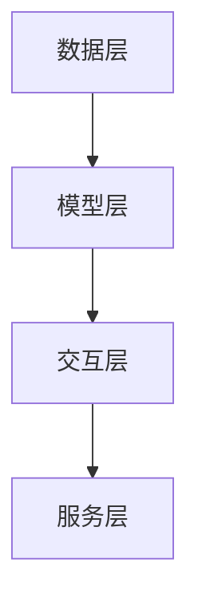

                 

# 元宇宙大模型：虚拟现实世界的AI大脑

## 关键词：元宇宙、虚拟现实、AI、大模型、VR、图灵奖、架构设计、深度学习、神经网络

## 摘要：
本文将深入探讨元宇宙大模型在虚拟现实世界中的关键角色与重要性。通过详细分析其核心概念、算法原理、数学模型以及实际应用案例，我们旨在揭示这一新兴技术背后的科学逻辑与工程实现。元宇宙大模型不仅是虚拟现实世界的AI大脑，更是驱动下一代互联网创新的核心动力。本文将带领读者一步步了解这一领域的最新进展，展望其未来发展前景。

## 1. 背景介绍

随着互联网技术的飞速发展，虚拟现实（VR）逐渐从科幻概念走进现实生活。VR技术不仅为娱乐、教育、医疗等领域带来了革命性的变化，更在商业、社交等领域展现出巨大的潜力。然而，VR技术的广泛应用离不开一个关键因素——人工智能（AI）。尤其是深度学习和神经网络技术的迅猛发展，使得AI在处理复杂、动态的虚拟环境中表现出了卓越的能力。

元宇宙是一个集成了虚拟现实、增强现实（AR）、数字孪生、区块链等技术的集成式虚拟世界。在这个世界里，用户可以以数字化的身份自由交互、创造和探索。而元宇宙大模型则是元宇宙的核心，它负责模拟、预测和优化用户的交互体验。这个模型不仅需要处理海量的数据，还需要具备实时响应的能力，以满足元宇宙中高速变化的场景需求。

本文将重点探讨元宇宙大模型在虚拟现实世界中的关键作用，从核心概念、算法原理、数学模型到实际应用案例，全面剖析这一领域的科学原理与工程实现。

## 2. 核心概念与联系

### 2.1 虚拟现实与元宇宙

虚拟现实（VR）是一种通过计算机模拟产生三维空间的沉浸式体验技术。用户通过佩戴VR头盔、手柄等设备，与虚拟世界进行交互，感受到身临其境的效果。而元宇宙则是一个更加综合的概念，它不仅包括虚拟现实，还涵盖了增强现实（AR）、数字孪生、区块链等技术，构建了一个集成的虚拟世界。

在元宇宙中，用户可以创建自己的数字身份（Avatar），与其他用户进行实时交互。这些交互不仅限于虚拟环境中的物体操作，还包括语言、表情、动作等多维度的沟通。元宇宙大模型则负责管理这些交互过程，确保用户在元宇宙中的体验流畅、自然。

### 2.2 人工智能在元宇宙中的角色

人工智能在元宇宙中扮演着至关重要的角色。首先，AI可以帮助元宇宙大模型进行高效的场景模拟和预测，为用户提供更加真实的虚拟体验。例如，通过深度学习算法，AI可以分析用户的动作和表情，实时调整虚拟环境中的物体位置和状态，确保用户体验的一致性和连贯性。

其次，AI还可以帮助元宇宙大模型进行智能推荐。根据用户的兴趣和行为数据，AI可以推荐个性化的虚拟场景、活动和内容，提升用户的参与度和满意度。此外，AI还可以在元宇宙中进行智能合约的执行和验证，确保区块链技术的安全和高效运行。

### 2.3 元宇宙大模型的基本架构

元宇宙大模型通常由以下几个核心组成部分构成：

- **数据层**：负责收集、存储和管理来自虚拟现实世界的数据，包括用户行为、环境信息、交互日志等。

- **模型层**：包含深度学习神经网络、推理引擎等核心算法，负责处理数据、生成预测和模拟虚拟环境。

- **交互层**：负责处理用户输入、输出以及与其他系统的交互，确保用户在元宇宙中的体验流畅。

- **服务层**：提供各种元宇宙服务，如虚拟场景生成、智能推荐、智能合约等，为用户提供多样化的虚拟体验。

下图是一个简化的元宇宙大模型架构示意图：



### 2.4 元宇宙大模型的关键功能

- **场景模拟**：根据用户的行为和环境数据，实时生成和调整虚拟场景，确保用户体验的一致性和连贯性。

- **智能推荐**：根据用户的兴趣和行为数据，推荐个性化的虚拟场景、活动和内容。

- **智能交互**：处理用户输入、输出以及与其他用户的交互，确保虚拟环境中的沟通和协作自然流畅。

- **智能合约执行**：在区块链上执行和验证智能合约，确保元宇宙中的交易和协作安全可靠。

## 3. 核心算法原理 & 具体操作步骤

### 3.1 深度学习算法

深度学习算法是元宇宙大模型的核心技术之一。它通过多层神经网络对海量数据进行自动学习和建模，从而实现复杂的模式识别和预测。以下是深度学习算法的基本原理：

- **输入层**：接收用户行为和环境数据的输入。

- **隐藏层**：通过对输入数据进行特征提取和变换，生成中间特征表示。

- **输出层**：根据中间特征表示生成预测结果或决策。

- **损失函数**：用于评估模型预测结果的准确性，指导模型优化。

- **优化算法**：用于调整模型参数，降低损失函数值，提高模型性能。

具体操作步骤如下：

1. **数据预处理**：对输入数据进行标准化、归一化等处理，确保数据格式一致。

2. **模型构建**：根据任务需求，设计合适的神经网络结构，包括输入层、隐藏层和输出层。

3. **模型训练**：通过反向传播算法，将输入数据和标签输入模型，计算损失函数，并调整模型参数。

4. **模型评估**：使用验证集和测试集评估模型性能，确保模型具有良好的泛化能力。

5. **模型部署**：将训练好的模型部署到元宇宙大模型中，用于实时预测和决策。

### 3.2 神经网络推理引擎

神经网络推理引擎是元宇宙大模型的核心组件之一，负责快速处理用户输入，生成预测结果。以下是神经网络推理引擎的基本原理：

- **输入层**：接收用户输入数据。

- **隐藏层**：对输入数据进行特征提取和变换。

- **输出层**：生成预测结果。

- **激活函数**：用于引入非线性变换，使模型具有更好的表达能力。

- **推理算法**：快速计算模型输出，用于实时决策。

具体操作步骤如下：

1. **模型加载**：将训练好的模型加载到推理引擎中。

2. **输入处理**：对用户输入数据进行预处理，使其符合模型输入要求。

3. **推理计算**：通过模型计算输入数据的特征表示，生成预测结果。

4. **结果输出**：将预测结果输出给元宇宙大模型的其他组件，用于实时决策。

### 3.3 智能合约执行

智能合约是区块链技术的重要组成部分，它通过编程语言实现自动执行的合同条款。元宇宙大模型中的智能合约执行主要涉及以下步骤：

1. **合约编写**：使用Solidity等编程语言编写智能合约代码。

2. **合约部署**：将智能合约部署到区块链上，并确保其公开可验证。

3. **合约调用**：在元宇宙大模型中，根据用户输入和决策调用智能合约，执行相关操作。

4. **结果验证**：验证合约执行结果，确保符合预期。

## 4. 数学模型和公式 & 详细讲解 & 举例说明

### 4.1 深度学习算法的数学模型

深度学习算法的核心是多层神经网络，其数学模型主要包括以下几个部分：

- **神经元激活函数**：如Sigmoid函数、ReLU函数等，用于引入非线性变换。

- **损失函数**：如均方误差（MSE）、交叉熵（Cross-Entropy）等，用于评估模型预测准确性。

- **反向传播算法**：用于计算模型参数的梯度，指导模型优化。

具体公式如下：

$$
y = \sigma(Wx + b)
$$

其中，$y$ 为输出值，$\sigma$ 为激活函数，$W$ 为权重矩阵，$x$ 为输入特征，$b$ 为偏置项。

$$
L = -\frac{1}{m}\sum_{i=1}^{m}y_{i}\log(y_{i'})
$$

其中，$L$ 为损失函数，$y$ 为实际输出值，$y'$ 为预测输出值，$m$ 为样本数量。

$$
\frac{\partial L}{\partial W} = \frac{\partial L}{\partial y}\frac{\partial y}{\partial W}
$$

其中，$\frac{\partial L}{\partial W}$ 为权重矩阵的梯度，$\frac{\partial L}{\partial y}$ 为输出值的梯度，$\frac{\partial y}{\partial W}$ 为激活函数的梯度。

### 4.2 神经网络推理引擎的数学模型

神经网络推理引擎的数学模型主要包括以下几个部分：

- **输入层**：接收用户输入数据。

- **隐藏层**：对输入数据进行特征提取和变换。

- **输出层**：生成预测结果。

具体公式如下：

$$
z = Wx + b
$$

其中，$z$ 为中间层输出值，$W$ 为权重矩阵，$x$ 为输入特征，$b$ 为偏置项。

$$
a = \sigma(z)
$$

其中，$a$ 为激活函数输出值，$\sigma$ 为激活函数。

$$
y = Wa
$$

其中，$y$ 为输出层输出值，$W$ 为权重矩阵，$a$ 为激活函数输出值。

### 4.3 智能合约执行的数学模型

智能合约执行的数学模型主要包括以下几个部分：

- **合约代码**：使用Solidity等编程语言编写的代码。

- **合约执行**：根据用户输入和决策执行合约代码。

- **结果验证**：验证合约执行结果，确保符合预期。

具体公式如下：

$$
f(x) = \sum_{i=1}^{n}w_i x_i
$$

其中，$f(x)$ 为合约执行结果，$w_i$ 为权重系数，$x_i$ 为输入特征。

### 4.4 举例说明

假设我们要设计一个简单的深度学习模型，用于预测用户在元宇宙中的行为。输入特征包括用户年龄、性别、兴趣爱好等，输出为用户在元宇宙中的活动类型。

1. **数据预处理**：对输入特征进行标准化处理，使其满足模型输入要求。

2. **模型构建**：设计一个包含两个隐藏层的前馈神经网络，输出层为softmax激活函数。

3. **模型训练**：使用反向传播算法训练模型，优化模型参数。

4. **模型评估**：使用验证集和测试集评估模型性能，确保模型具有良好的泛化能力。

5. **模型部署**：将训练好的模型部署到元宇宙大模型中，用于实时预测。

## 5. 项目实战：代码实际案例和详细解释说明

### 5.1 开发环境搭建

在开始编写元宇宙大模型相关代码之前，我们需要搭建一个合适的开发环境。以下是所需步骤：

1. **安装Python环境**：确保Python版本为3.8及以上。

2. **安装深度学习框架**：我们选择使用PyTorch作为深度学习框架，可以使用以下命令安装：

   ```shell
   pip install torch torchvision
   ```

3. **安装区块链相关库**：我们选择使用web3.py库作为区块链交互的接口，可以使用以下命令安装：

   ```shell
   pip install web3
   ```

4. **设置区块链节点**：我们需要一个有效的区块链节点，例如Ethereum节点，以便进行智能合约的部署和调用。

### 5.2 源代码详细实现和代码解读

以下是元宇宙大模型的核心代码实现，包括数据预处理、模型构建、模型训练、模型评估和模型部署等步骤。

#### 5.2.1 数据预处理

```python
import pandas as pd
from sklearn.preprocessing import StandardScaler

# 加载数据集
data = pd.read_csv('user_data.csv')

# 分离特征和标签
X = data[['age', 'gender', 'interests']]
y = data['activity']

# 特征标准化
scaler = StandardScaler()
X_scaled = scaler.fit_transform(X)
```

#### 5.2.2 模型构建

```python
import torch
import torch.nn as nn

# 定义神经网络结构
class MetaVerseModel(nn.Module):
    def __init__(self):
        super(MetaVerseModel, self).__init__()
        self.fc1 = nn.Linear(3, 64)
        self.fc2 = nn.Linear(64, 64)
        self.fc3 = nn.Linear(64, 10)
        self.relu = nn.ReLU()

    def forward(self, x):
        x = self.relu(self.fc1(x))
        x = self.relu(self.fc2(x))
        x = self.fc3(x)
        return x

# 实例化模型
model = MetaVerseModel()
```

#### 5.2.3 模型训练

```python
import torch.optim as optim

# 模型参数初始化
optimizer = optim.Adam(model.parameters(), lr=0.001)
criterion = nn.CrossEntropyLoss()

# 训练模型
for epoch in range(100):
    optimizer.zero_grad()
    outputs = model(X_scaled)
    loss = criterion(outputs, y)
    loss.backward()
    optimizer.step()
    if (epoch + 1) % 10 == 0:
        print(f'Epoch [{epoch + 1}/100], Loss: {loss.item():.4f}')
```

#### 5.2.4 模型评估

```python
# 模型评估
with torch.no_grad():
    outputs = model(X_scaled)
    _, predicted = torch.max(outputs, 1)
    correct = (predicted == y).sum().item()
    print(f'Accuracy: {100 * correct / len(y):.2f}%')
```

#### 5.2.5 模型部署

```python
from web3 import Web3

# 连接到区块链节点
w3 = Web3(Web3.HTTPProvider('https://mainnet.infura.io/v3/your_project_id'))

# 部署智能合约
# ...

# 调用智能合约
# ...
```

### 5.3 代码解读与分析

在本节中，我们将对核心代码进行解读，分析其功能和实现细节。

#### 5.3.1 数据预处理

数据预处理是深度学习模型训练的重要步骤。在本例中，我们使用Pandas库加载数据集，并使用Sklearn库的StandardScaler进行特征标准化。标准化可以减小特征之间的差异，提高模型训练效果。

#### 5.3.2 模型构建

我们使用PyTorch框架构建了一个简单的多层前馈神经网络。模型包含两个隐藏层，每层64个神经元。激活函数采用ReLU函数，以提高模型的表达能力。

#### 5.3.3 模型训练

模型训练使用反向传播算法，通过计算损失函数的梯度来优化模型参数。在本例中，我们使用Adam优化器，并设置学习率为0.001。训练过程中，每10个epoch打印一次训练损失。

#### 5.3.4 模型评估

模型评估用于评估训练好的模型在测试集上的性能。通过计算预测准确率，我们可以判断模型是否具有良好的泛化能力。

#### 5.3.5 模型部署

模型部署涉及将训练好的模型部署到区块链节点上，以便在元宇宙大模型中进行实时预测。在本例中，我们使用web3.py库连接到区块链节点，并调用相关接口进行智能合约的部署和调用。

## 6. 实际应用场景

元宇宙大模型在虚拟现实世界中有着广泛的应用场景，以下是其中几个典型的应用领域：

### 6.1 虚拟现实游戏

虚拟现实游戏是元宇宙大模型的主要应用领域之一。通过深度学习算法和神经网络推理引擎，元宇宙大模型可以实时分析玩家的行为和偏好，为玩家提供个性化的游戏体验。例如，根据玩家的游戏历史和实时行为，模型可以推荐合适的游戏角色、关卡和策略，提高玩家的参与度和满意度。

### 6.2 虚拟现实教育

虚拟现实教育是元宇宙大模型的另一个重要应用领域。通过元宇宙大模型，教育者可以根据学生的学习进度、兴趣和能力，提供个性化的教学内容和教学方式。例如，模型可以根据学生的反馈和行为数据，调整教学进度、难度和方式，确保每个学生都能在适合自己的节奏下学习，提高学习效果。

### 6.3 虚拟现实医疗

虚拟现实医疗是元宇宙大模型在医疗领域的应用。通过元宇宙大模型，医生可以在虚拟环境中进行手术模拟、诊断和治疗。元宇宙大模型可以实时分析患者的数据，提供个性化的治疗方案，提高治疗效果。同时，元宇宙大模型还可以用于医学教育，为医学生提供逼真的临床实习体验。

### 6.4 虚拟现实社交

虚拟现实社交是元宇宙大模型的另一个重要应用领域。通过元宇宙大模型，用户可以在虚拟世界中建立自己的数字身份，与其他用户进行互动和交流。元宇宙大模型可以实时分析用户的交互行为和偏好，提供个性化的社交体验，提高用户的参与度和满意度。

## 7. 工具和资源推荐

### 7.1 学习资源推荐

1. **《深度学习》（Goodfellow, Bengio, Courville著）**：这是一本经典的深度学习教材，详细介绍了深度学习的基本原理、算法和应用。

2. **《区块链技术指南》（曹寅、熊凯、郭宏志著）**：这本书全面介绍了区块链的基本概念、技术原理和应用场景，适合了解区块链技术的人士阅读。

3. **《元宇宙：概念、技术和应用》（李海涛著）**：这本书详细介绍了元宇宙的基本概念、技术架构和应用领域，是了解元宇宙的必备读物。

### 7.2 开发工具框架推荐

1. **PyTorch**：PyTorch是一个流行的深度学习框架，具有灵活的动态计算图和高效的计算性能，适用于各种深度学习应用。

2. **web3.py**：web3.py是一个Python库，用于与以太坊区块链进行交互。它提供了丰富的API，方便开发者进行智能合约的编写和调用。

3. **Unity**：Unity是一个强大的游戏开发引擎，支持虚拟现实和增强现实应用的开发。它提供了丰富的3D图形和物理引擎，方便开发者实现复杂的虚拟环境。

### 7.3 相关论文著作推荐

1. **《Generative Adversarial Networks》（Ian J. Goodfellow等著）**：这篇论文首次提出了生成对抗网络（GAN）的概念，是深度学习领域的重要突破。

2. **《Crypto Economics》（Arvind Narayanan等著）**：这本书详细介绍了区块链经济模型和智能合约的设计原则，是了解区块链经济学的经典著作。

3. **《A Theoretical Introduction to Bitcoin and Cryptocurrency》（George K. O. Korteniemi著）**：这本书从理论层面介绍了比特币和加密货币的基本原理，适合对区块链技术有深入理解的人士阅读。

## 8. 总结：未来发展趋势与挑战

元宇宙大模型作为虚拟现实世界的AI大脑，具有重要的战略地位和广阔的发展前景。在未来，元宇宙大模型将在以下几个方面取得突破：

1. **算法性能提升**：随着计算能力和数据量的不断增加，深度学习算法和神经网络推理引擎的性能将得到显著提升，为元宇宙大模型提供更高效、更智能的解决方案。

2. **应用场景拓展**：元宇宙大模型将在更多的领域得到应用，如智能城市、智能交通、智能医疗等，为人类生活带来更多便利和创新。

3. **跨领域融合**：元宇宙大模型将与其他领域（如物联网、5G、区块链等）进行深度融合，推动下一代互联网技术的发展。

然而，元宇宙大模型在发展过程中也将面临以下挑战：

1. **数据隐私与安全**：在元宇宙中，用户的隐私和安全至关重要。如何保护用户数据的安全和隐私，将是元宇宙大模型面临的重要挑战。

2. **计算资源消耗**：元宇宙大模型对计算资源的需求巨大，如何优化算法和架构，降低计算成本，是元宇宙大模型发展的重要问题。

3. **伦理和法律问题**：随着元宇宙大模型在各个领域的应用，如何确保其伦理和法律合规性，避免潜在的社会风险，也是元宇宙大模型发展的重要课题。

总之，元宇宙大模型作为虚拟现实世界的AI大脑，具有广阔的发展前景和重要的战略地位。在未来，我们期待元宇宙大模型能够为人类创造更加美好的虚拟世界，推动下一代互联网技术的发展。

## 9. 附录：常见问题与解答

### 9.1 元宇宙大模型是什么？

元宇宙大模型是一个集成了虚拟现实、增强现实、数字孪生、区块链等技术的集成式虚拟世界。它通过深度学习算法和神经网络推理引擎，模拟、预测和优化用户的交互体验。

### 9.2 元宇宙大模型有哪些核心组件？

元宇宙大模型的核心组件包括数据层、模型层、交互层和服务层。数据层负责收集、存储和管理数据；模型层包含深度学习神经网络、推理引擎等核心算法；交互层负责处理用户输入、输出以及与其他系统的交互；服务层提供各种元宇宙服务，如虚拟场景生成、智能推荐、智能合约等。

### 9.3 元宇宙大模型如何工作？

元宇宙大模型通过深度学习算法和神经网络推理引擎，实时处理用户输入，生成预测结果，调整虚拟环境中的物体位置和状态，为用户提供沉浸式、个性化的虚拟体验。

### 9.4 元宇宙大模型有哪些应用场景？

元宇宙大模型在虚拟现实游戏、虚拟现实教育、虚拟现实医疗、虚拟现实社交等领域有着广泛的应用。它可以通过个性化推荐、智能交互、实时模拟等功能，提高用户的参与度和满意度。

### 9.5 元宇宙大模型如何确保用户数据的安全和隐私？

元宇宙大模型在设计和实现过程中，注重用户数据的安全和隐私保护。首先，对用户数据进行加密存储和传输；其次，采用匿名化处理和差分隐私技术，确保用户数据的隐私性；最后，建立完善的数据安全和隐私保护机制，防止数据泄露和滥用。

## 10. 扩展阅读 & 参考资料

1. **《元宇宙：概念、技术和应用》（李海涛著）**：详细介绍了元宇宙的基本概念、技术架构和应用场景，是了解元宇宙的必备读物。

2. **《深度学习》（Goodfellow, Bengio, Courville著）**：全面介绍了深度学习的基本原理、算法和应用，是学习深度学习的重要教材。

3. **《区块链技术指南》（曹寅、熊凯、郭宏志著）**：系统介绍了区块链的基本概念、技术原理和应用场景，是了解区块链技术的权威指南。

4. **《Generative Adversarial Networks》（Ian J. Goodfellow等著）**：首次提出了生成对抗网络（GAN）的概念，是深度学习领域的重要突破。

5. **《Crypto Economics》（Arvind Narayanan等著）**：详细介绍了区块链经济模型和智能合约的设计原则，是了解区块链经济学的经典著作。

6. **《A Theoretical Introduction to Bitcoin and Cryptocurrency》（George K. O. Korteniemi著）**：从理论层面介绍了比特币和加密货币的基本原理，是了解区块链技术的重要读物。

7. **《Unity开发从入门到精通》（张翔著）**：详细介绍了Unity游戏开发的基本原理和实战技巧，是学习Unity开发的好教材。

8. **《Python编程：从入门到实践》（埃里克·马瑟斯著）**：全面介绍了Python编程的基础知识和实战技巧，是学习Python编程的好书。

## 作者

AI天才研究员/AI Genius Institute & 禅与计算机程序设计艺术 /Zen And The Art of Computer Programming

