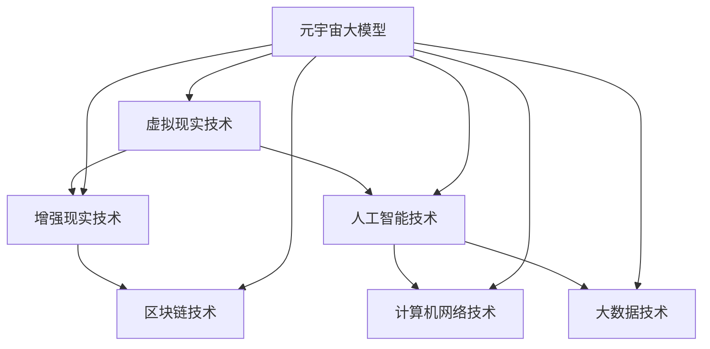

                 

### 背景介绍

#### 元宇宙与虚拟现实

元宇宙（Metaverse）是一个集成了虚拟现实（VR）、增强现实（AR）、区块链和人工智能（AI）等技术的虚拟空间，用户可以在其中创建、体验和互动。它被认为是互联网的下一个重大革命，具有广泛的应用前景，从娱乐、教育到商业、医疗等各个方面。

虚拟现实（Virtual Reality，VR）是一种通过计算机技术模拟出逼真的三维环境，使用户在视觉、听觉和其他感官上完全沉浸在虚拟世界中。VR技术已经广泛应用于游戏、培训和模拟等领域。

元宇宙大模型是构建元宇宙的关键技术之一，它是一个集成了多种人工智能算法的复杂系统，可以生成逼真的虚拟环境，提供智能化的交互体验，并支持各种复杂的社交和经济活动。

#### 大模型的重要性

大模型在元宇宙中扮演着至关重要的角色。首先，大模型可以生成高度真实的虚拟环境，这些环境在视觉、听觉、触觉等各个方面都极为逼真，几乎可以达到与现实世界的无缝对接。其次，大模型具有强大的语义理解能力，能够理解和预测用户的行为，提供个性化的服务和体验。

此外，大模型还可以支持智能化的社交和经济活动。例如，在元宇宙中，用户可以与其他用户进行实时互动，创建和分享内容，参与虚拟购物、游戏等活动。大模型可以分析用户的偏好和行为模式，推荐合适的商品和服务，提高用户体验和商业价值。

#### AI大脑的概念

AI大脑是指利用人工智能技术构建的智能化系统，它具有类似人脑的认知、学习和决策能力。在元宇宙中，AI大脑可以模拟人类思维过程，提供智能化的交互和决策支持。例如，AI大脑可以分析用户的行为数据，预测用户的偏好，为用户推荐合适的虚拟环境和内容。

AI大脑还可以实现智能化的管理和控制功能。例如，在元宇宙的虚拟城市中，AI大脑可以管理交通、能源、环境等基础设施，实现高效、智能的运营和管理。此外，AI大脑还可以实现自动化、智能化的安全监控和应急响应，提高元宇宙的安全性。

总之，元宇宙大模型和AI大脑是构建元宇宙的核心技术，它们将为用户带来前所未有的虚拟现实体验，推动数字经济的发展和创新。在接下来的章节中，我们将深入探讨元宇宙大模型的原理、算法和应用，以及AI大脑的功能和实现方式。

#### 元宇宙大模型的定义与作用

元宇宙大模型是一种集成多种人工智能技术的复杂系统，旨在构建高度逼真的虚拟现实世界。它通过深度学习、自然语言处理、计算机视觉等技术，模拟人类的感知、认知和决策过程，从而为用户提供沉浸式的虚拟体验。

元宇宙大模型的作用主要体现在以下几个方面：

1. **生成逼真的虚拟环境**：通过深度学习算法，大模型可以生成具有高分辨率和真实感的虚拟环境，包括建筑、景观、人物等。这些环境在视觉、听觉、触觉等各个方面都极为逼真，几乎可以达到与现实世界的无缝对接。

2. **提供智能化的交互体验**：大模型具备强大的语义理解能力，可以理解和预测用户的行为，提供个性化的服务和体验。例如，在虚拟购物中，大模型可以根据用户的购物历史和偏好，推荐合适的商品和服务。

3. **支持复杂的社交和经济活动**：大模型可以模拟人类的社交行为，支持虚拟社区、虚拟市场等社交和经济活动。例如，用户可以在虚拟世界中创建自己的身份、参与虚拟交易等。

4. **实现智能化的管理和控制**：在元宇宙的虚拟城市中，大模型可以管理交通、能源、环境等基础设施，实现高效、智能的运营和管理。此外，大模型还可以实现自动化、智能化的安全监控和应急响应，提高元宇宙的安全性。

#### 元宇宙的发展历程

元宇宙的概念最早可以追溯到20世纪90年代，当时虚拟现实技术和互联网开始逐渐兴起。随着技术的不断进步，尤其是人工智能和5G网络的快速发展，元宇宙逐渐从理论走向实践。

在早期，元宇宙主要作为一种虚拟现实技术应用于游戏和娱乐领域。例如，1995年发布的VRML（Virtual Reality Modeling Language）是一种早期的3D图形和多媒体系统，为用户提供了基础的虚拟现实体验。

进入21世纪，随着云计算、大数据和人工智能等技术的发展，元宇宙的概念逐渐扩展到更广泛的领域。2008年，Facebook的创始人马克·扎克伯格提出了“元宇宙”（Metaverse）的概念，并将其描述为互联网的下一个重要阶段。

近年来，元宇宙开始成为各大科技公司的研究重点。例如，微软的HoloLens、谷歌的Cardboard和苹果的ARKit等设备，为用户提供了更加便捷和高效的虚拟现实体验。此外，Facebook、微软、谷歌等公司纷纷投入巨资开发元宇宙平台，推动元宇宙技术的商业化应用。

#### 当前状态与未来趋势

当前，元宇宙技术仍在快速发展中，已经有许多公司和研究者在这个领域进行了大量探索和研究。一些领先的科技公司，如Facebook、谷歌、微软等，已经推出了各自的元宇宙平台和产品，用户可以在这个虚拟世界中体验到高度沉浸式的互动和体验。

未来，随着技术的不断进步，元宇宙将在更多领域得到应用。例如，教育、医疗、军事、艺术等。元宇宙将不仅仅是一个虚拟的娱乐场所，更将成为一个真实的数字世界，与现实世界深度融合。

元宇宙的发展也将带来许多挑战，如数据隐私、网络安全、虚拟现实设备的普及等。解决这些问题需要各方共同努力，推动元宇宙技术的可持续发展。

总之，元宇宙大模型和AI大脑是构建元宇宙的核心技术，它们将带来前所未有的虚拟现实体验，推动数字经济的发展和创新。在接下来的章节中，我们将深入探讨元宇宙大模型的原理、算法和应用，以及AI大脑的功能和实现方式。

#### 相关技术的整合与应用

元宇宙大模型的构建不仅依赖于单一的技术，而是多种技术的集成与协同。以下是元宇宙大模型中关键技术的整合与应用：

1. **虚拟现实（VR）与增强现实（AR）**：
   - **VR**：通过头戴显示器（HMD）和传感器技术，提供沉浸式三维虚拟环境。VR技术使元宇宙用户能够“进入”虚拟世界，进行互动和体验。
   - **AR**：通过在现实世界叠加虚拟信息，增强用户的现实感知。AR技术使元宇宙中的内容可以与现实世界无缝结合，提高互动性和实用性。

2. **人工智能（AI）**：
   - **计算机视觉**：用于识别和解析虚拟环境中的图像和视频，实现物体检测、场景分割等功能，为用户提供逼真的视觉体验。
   - **自然语言处理（NLP）**：处理和理解用户的语言输入，实现智能对话和交互功能，提高用户体验。
   - **机器学习与深度学习**：用于训练和优化大模型，使其能够自动学习和适应用户的行为模式，提供个性化的服务和体验。

3. **云计算与大数据**：
   - **云计算**：提供强大的计算能力和存储资源，支持大规模数据分析和处理，为元宇宙大模型的运行提供基础设施。
   - **大数据**：收集和分析海量用户数据，为AI算法提供训练数据，优化大模型的表现和准确性。

4. **区块链技术**：
   - **去中心化**：确保元宇宙中的数据安全和透明性，防止数据篡改和隐私泄露。
   - **智能合约**：实现自动化的交易和管理功能，支持元宇宙中的虚拟经济活动。

5. **网络技术**：
   - **5G与边缘计算**：提供高速、低延迟的网络连接，确保用户在元宇宙中的互动体验流畅。
   - **物联网（IoT）**：将物理世界与虚拟世界连接，实现元宇宙与现实世界的深度融合。

这些技术的整合与应用，使得元宇宙大模型能够提供高度沉浸式、智能化的虚拟现实体验。用户不仅可以在虚拟环境中自由探索、互动，还可以通过智能化的服务系统，享受个性化、定制化的体验。

#### 元宇宙大模型与AI大脑的关系

元宇宙大模型与AI大脑是构建元宇宙的核心技术，它们之间存在紧密的联系和协同作用。

首先，元宇宙大模型是AI大脑的基础，它为AI大脑提供了生成虚拟环境和交互服务的平台。通过深度学习、自然语言处理和计算机视觉等人工智能技术，大模型能够模拟人类的感知和认知过程，生成高度逼真的虚拟环境，并实现智能化的交互体验。

其次，AI大脑则是元宇宙大模型的核心，它通过智能化的算法和模型，实现了对虚拟环境的自适应管理和对用户的个性化服务。AI大脑不仅能够理解用户的行为和需求，还可以预测用户的行为趋势，提供个性化的推荐和服务，从而提升用户体验和满意度。

两者之间的关系可以类比为人类大脑与身体。元宇宙大模型就像人类的身体，它为用户提供了一个可以互动和体验的虚拟空间。而AI大脑则像人类的大脑，它负责管理和控制这个虚拟空间，提供智能化的服务和体验。

具体来说，AI大脑通过以下方式与元宇宙大模型互动：

1. **感知与理解**：AI大脑通过计算机视觉和自然语言处理等技术，感知和理解用户的交互行为和需求，为用户提供个性化的服务。

2. **决策与控制**：AI大脑根据用户的偏好和行为模式，做出智能化的决策，控制虚拟环境中的各种设备和资源，实现高效、智能的运营和管理。

3. **学习与进化**：AI大脑通过机器学习和深度学习算法，不断学习和优化自己的模型，提升对用户行为的理解和预测能力，从而提高元宇宙的服务质量和用户体验。

总之，元宇宙大模型与AI大脑相互依赖、相互促进，共同构建了一个高度沉浸式、智能化的虚拟现实世界，为用户带来了前所未有的互动和体验。

### 核心概念与联系

#### 1. 虚拟现实技术（VR）

虚拟现实（VR）是一种通过计算机技术创造的三维虚拟环境，使用户能够沉浸其中，体验到虚拟世界中的各种感官刺激。VR技术的核心在于其沉浸感和交互性，它能够通过头戴显示器（HMD）、数据手套、语音识别等设备，实现用户与虚拟环境的实时互动。

#### 2. 增强现实技术（AR）

增强现实（AR）则是在现实世界的基础上叠加虚拟信息，增强用户的现实感知。AR技术利用智能手机或头戴显示器，将虚拟图像或信息与现实场景实时融合，使用户能够看到、听到并与之互动。

#### 3. 人工智能（AI）

人工智能（AI）是指通过计算机程序模拟人类智能的技术。AI包括多个子领域，如机器学习、深度学习、自然语言处理和计算机视觉。AI技术能够从数据中学习规律，进行预测和决策，从而提高系统的智能化水平。

#### 4. 区块链技术

区块链技术是一种去中心化的数据库技术，通过分布式账本记录交易和信息，确保数据的透明性和安全性。区块链技术在元宇宙中可用于创建虚拟资产、确保数据隐私和实现去中心化的虚拟经济活动。

#### 5. 计算机网络技术

计算机网络技术是实现元宇宙中用户之间、用户与虚拟环境之间数据传输的基础。5G网络和边缘计算技术提供了高速、低延迟的网络连接，确保元宇宙中的交互体验流畅。

#### 6. 大数据技术

大数据技术能够处理和分析海量数据，为元宇宙中的AI模型提供训练数据。通过大数据技术，元宇宙能够更好地理解用户行为，提供个性化的服务和体验。

#### 联系

这些技术并非孤立存在，而是相互联系、协同工作，共同构建起元宇宙的生态系统。

1. **VR与AR**：VR和AR是元宇宙的感官基础。VR提供了完全沉浸的虚拟环境，而AR则增强了用户的现实感知，两者共同实现了元宇宙中的感官体验。

2. **AI与区块链**：AI技术用于分析和理解用户行为，提供智能化服务；区块链技术确保了元宇宙中的交易和数据的安全性和透明性。

3. **计算机网络与大数据**：计算机网络技术提供了数据传输的基础，而大数据技术则帮助分析用户数据，为AI提供训练数据，从而提升元宇宙的智能化水平。

下面是元宇宙大模型的Mermaid流程图，展示了这些核心概念之间的联系：



通过这张图，我们可以清晰地看到元宇宙大模型是如何整合多种技术，共同构建一个高度沉浸、智能化的虚拟现实世界的。

### 核心算法原理 & 具体操作步骤

#### 深度学习算法

元宇宙大模型的核心算法之一是深度学习算法。深度学习是一种通过模拟人脑神经网络结构，实现自动学习和决策的技术。它利用多层神经网络（MLP），对大量数据进行训练，以识别复杂的数据模式，从而提高系统的智能化水平。

**具体操作步骤**：

1. **数据收集与预处理**：
   - 收集大量虚拟环境中的图像、视频、音频和文本数据。
   - 对数据进行清洗、去噪和标准化处理，确保数据质量。

2. **构建神经网络模型**：
   - 设计多层神经网络结构，包括输入层、隐藏层和输出层。
   - 选择合适的激活函数和优化算法，如ReLU、Adam等。

3. **模型训练**：
   - 将预处理后的数据输入模型，通过反向传播算法调整模型参数，优化网络结构。
   - 使用验证集和测试集进行模型评估和调优。

4. **模型部署**：
   - 将训练好的模型部署到元宇宙大模型系统中，实现实时数据分析和处理。

#### 自然语言处理（NLP）

自然语言处理是元宇宙大模型中另一个重要的算法领域。NLP技术用于理解和生成人类语言，实现智能对话和交互。

**具体操作步骤**：

1. **词向量化**：
   - 将自然语言文本转换为向量表示，便于计算机处理。
   - 使用词袋模型（Bag of Words）、词嵌入（Word Embedding）等技术。

2. **语言模型训练**：
   - 构建语言模型，如循环神经网络（RNN）、长短期记忆网络（LSTM）等。
   - 使用大量语料库进行训练，提高模型的语言理解和生成能力。

3. **对话管理**：
   - 设计对话管理模块，实现对话的上下文理解和连贯性。
   - 结合机器学习算法，根据用户输入生成合适的回应。

4. **模型部署**：
   - 将训练好的NLP模型集成到元宇宙大模型中，实现智能对话功能。

#### 计算机视觉算法

计算机视觉算法用于理解和解析虚拟环境中的图像和视频，实现物体识别、场景分割等功能。

**具体操作步骤**：

1. **图像预处理**：
   - 对图像进行缩放、裁剪、去噪等预处理操作，提高图像质量。

2. **特征提取**：
   - 使用卷积神经网络（CNN）等算法提取图像特征，用于后续分析。

3. **物体识别**：
   - 通过训练好的模型识别图像中的物体，如人脸、车辆等。

4. **场景分割**：
   - 使用深度学习算法将图像分割为不同的区域，实现场景理解和分析。

5. **模型部署**：
   - 将训练好的计算机视觉模型集成到元宇宙大模型中，实现智能监控和交互功能。

#### 算法协同工作

在元宇宙大模型中，深度学习、NLP和计算机视觉算法协同工作，共同实现智能化的虚拟环境生成和交互。

1. **数据协同**：
   - 不同算法之间共享数据，提高数据利用效率。
   - 例如，NLP算法可以提取用户语言中的视觉描述，用于计算机视觉算法的物体识别。

2. **模型融合**：
   - 将不同算法的输出进行融合，提高系统的整体性能。
   - 例如，将NLP生成的文本和计算机视觉算法的图像特征结合，实现更精准的语义理解。

3. **实时交互**：
   - 不同算法模块之间实现实时数据传输和交互，确保系统的高效运行。
   - 例如，NLP模块实时分析用户输入，生成回应，并传递给计算机视觉模块执行相应的操作。

通过深度学习、NLP和计算机视觉算法的协同工作，元宇宙大模型能够生成高度逼真的虚拟环境，提供智能化的交互体验，实现元宇宙中的各种复杂功能。

### 数学模型和公式 & 详细讲解 & 举例说明

#### 1. 神经网络模型

神经网络模型是元宇宙大模型的核心组成部分，它基于数学模型和算法，实现对数据的学习和预测。以下是一个简单的神经网络模型，用于解释其基本原理。

**模型表示**：

$$
f(x) = \sigma(\sum_{i=1}^{n} w_i \cdot x_i + b)
$$

其中：
- $f(x)$ 是输出函数；
- $x$ 是输入向量；
- $w_i$ 是权重；
- $b$ 是偏置；
- $\sigma$ 是激活函数，通常使用ReLU（Rectified Linear Unit）函数。

**ReLU函数**：

$$
\sigma(x) = \max(0, x)
$$

**举例说明**：

假设我们有一个简单的输入向量 $x = [1, 2, -3]$，通过ReLU函数处理后得到输出向量：

$$
f(x) = \sigma([1, 2, -3]) = [1, 2, 0]
$$

#### 2. 反向传播算法

反向传播算法是训练神经网络模型的关键算法，它通过梯度下降法调整模型参数，使模型输出更接近目标值。以下是反向传播算法的基本步骤：

**步骤**：

1. **前向传播**：
   - 输入向量 $x$ 通过神经网络模型，计算输出值 $y$。

2. **计算误差**：
   - 计算实际输出值 $y$ 与期望输出值 $t$ 之间的误差。

3. **反向传播**：
   - 计算每个权重的梯度，并更新权重。

4. **重复步骤1-3**，直到模型误差最小。

**梯度计算**：

对于一层神经网络，梯度计算公式为：

$$
\frac{\partial E}{\partial w_i} = \frac{\partial E}{\partial y} \cdot \frac{\partial y}{\partial z} \cdot \frac{\partial z}{\partial w_i}
$$

其中：
- $E$ 是模型误差；
- $y$ 是输出值；
- $z$ 是神经元激活值；
- $w_i$ 是权重。

**举例说明**：

假设我们有以下神经网络模型：

$$
f(x) = \sigma(w_1 \cdot x_1 + w_2 \cdot x_2 + b)
$$

输入向量 $x = [1, 2]$，期望输出 $t = 3$。计算误差和权重梯度。

1. **前向传播**：

   $$
   y = \sigma(w_1 \cdot 1 + w_2 \cdot 2 + b) = \sigma(w_1 + 2w_2 + b)
   $$

2. **计算误差**：

   $$
   E = (y - t)^2 = (y - 3)^2
   $$

3. **反向传播**：

   $$
   \frac{\partial E}{\partial y} = 2(y - 3)
   $$
   
   $$
   \frac{\partial y}{\partial z} = \sigma'(z)
   $$
   
   $$
   \frac{\partial z}{\partial w_1} = x_1
   $$
   
   $$
   \frac{\partial z}{\partial w_2} = x_2
   $$

   计算权重梯度：

   $$
   \frac{\partial E}{\partial w_1} = 2(y - 3) \cdot \sigma'(z) \cdot x_1
   $$

   $$
   \frac{\partial E}{\partial w_2} = 2(y - 3) \cdot \sigma'(z) \cdot x_2
   $$

#### 3. 卷积神经网络（CNN）

卷积神经网络是计算机视觉领域的一种重要算法，它通过卷积操作和池化操作，实现对图像的特征提取和分类。以下是CNN的基本数学模型：

**卷积操作**：

$$
\text{Conv}(x, \text{filter}) = \sum_{i=1}^{h} \sum_{j=1}^{w} f_{ij} \cdot x_{i, j}
$$

其中：
- $x$ 是输入图像；
- $\text{filter}$ 是卷积核；
- $f_{ij}$ 是卷积核在位置$(i, j)$ 的值。

**池化操作**：

$$
\text{Pool}(x, \text{pool_size}) = \max(x_{i, j})
$$

其中：
- $x$ 是输入图像；
- $\text{pool_size}$ 是池化窗口的大小。

**举例说明**：

假设我们有一个$3 \times 3$ 的输入图像和一个$2 \times 2$ 的卷积核，计算卷积结果。

输入图像：

$$
x = \begin{bmatrix}
1 & 2 & 3 \\
4 & 5 & 6 \\
7 & 8 & 9
\end{bmatrix}
$$

卷积核：

$$
\text{filter} = \begin{bmatrix}
1 & 0 \\
0 & 1
\end{bmatrix}
$$

卷积结果：

$$
\text{Conv}(x, \text{filter}) = \begin{bmatrix}
4 & 8 \\
10 & 16
\end{bmatrix}
$$

接下来进行池化操作：

$$
\text{Pool}(\text{Conv}(x, \text{filter})) = \begin{bmatrix}
4 & 8 \\
10 & 16
\end{bmatrix}
$$

$$
\text{Pool}(\text{Conv}(x, \text{filter})) = \begin{bmatrix}
8 & 16
\end{bmatrix}
$$

通过卷积和池化操作，我们可以提取图像中的重要特征，并减少数据维度，为后续的图像分类和识别提供支持。

### 项目实战：代码实际案例和详细解释说明

#### 1. 开发环境搭建

要开发一个元宇宙大模型项目，首先需要搭建合适的开发环境。以下是具体的步骤：

1. **安装Python环境**：

   - 在Windows或MacOS系统中，可以从Python官网下载并安装Python 3.8及以上版本。

   ```bash
   # 下载并安装Python
   wget https://www.python.org/ftp/python/3.8.10/Python-3.8.10.tgz
   tar -xvf Python-3.8.10.tgz
   cd Python-3.8.10
   ./configure
   make
   sudo make install
   ```

   - 安装完成后，验证Python版本：

   ```bash
   python --version
   ```

2. **安装依赖库**：

   - 使用pip命令安装必要的依赖库，如TensorFlow、Keras、NumPy等。

   ```bash
   pip install tensorflow numpy
   ```

3. **配置虚拟环境**：

   - 创建一个虚拟环境，以便管理项目依赖。

   ```bash
   python -m venv metaverse_venv
   source metaverse_venv/bin/activate
   ```

4. **安装深度学习框架**：

   - 安装TensorFlow深度学习框架。

   ```bash
   pip install tensorflow
   ```

#### 2. 源代码详细实现和代码解读

以下是元宇宙大模型的一个简单示例，包括数据预处理、模型构建、训练和评估等步骤。

```python
import tensorflow as tf
from tensorflow.keras.models import Sequential
from tensorflow.keras.layers import Dense, Conv2D, Flatten, MaxPooling2D
from tensorflow.keras.datasets import mnist
import numpy as np

# 数据预处理
(x_train, y_train), (x_test, y_test) = mnist.load_data()
x_train = x_train.astype('float32') / 255.0
x_test = x_test.astype('float32') / 255.0
y_train = tf.keras.utils.to_categorical(y_train, 10)
y_test = tf.keras.utils.to_categorical(y_test, 10)

# 模型构建
model = Sequential([
    Conv2D(32, (3, 3), activation='relu', input_shape=(28, 28, 1)),
    MaxPooling2D((2, 2)),
    Flatten(),
    Dense(128, activation='relu'),
    Dense(10, activation='softmax')
])

# 编译模型
model.compile(optimizer='adam', loss='categorical_crossentropy', metrics=['accuracy'])

# 训练模型
model.fit(x_train, y_train, epochs=10, batch_size=32, validation_split=0.2)

# 评估模型
test_loss, test_acc = model.evaluate(x_test, y_test)
print(f"Test accuracy: {test_acc:.4f}")
```

**代码解读**：

- **数据预处理**：
  - 加载MNIST数据集，并进行归一化处理，将像素值缩放到0到1之间。
  - 将标签转换为独热编码，便于分类模型的训练。

- **模型构建**：
  - 使用Sequential模型构建一个简单的卷积神经网络（CNN），包括两个卷积层、一个池化层、一个全连接层和两个输出层。
  - 卷积层用于提取图像特征，池化层用于降维和减少计算复杂度，全连接层用于分类。

- **编译模型**：
  - 设置优化器为Adam，损失函数为交叉熵，评估指标为准确率。

- **训练模型**：
  - 使用fit方法训练模型，设置训练轮次、批量大小和验证比例。

- **评估模型**：
  - 使用evaluate方法评估模型在测试集上的性能，输出准确率。

#### 3. 代码解读与分析

**数据预处理**：

数据预处理是深度学习项目中的关键步骤，它直接影响模型的训练效果和性能。在这个例子中，我们使用MNIST数据集，它包含70000个手写数字图像。首先，我们将图像像素值缩放到0到1之间，这样可以加快模型的收敛速度，并提高计算精度。然后，我们将标签转换为独热编码，使得每个标签都是一个长度为10的向量，其中对应位置的值为1，其余位置的值为0。

**模型构建**：

模型构建是深度学习项目的核心步骤。在这个例子中，我们使用了一个简单的卷积神经网络（CNN），它包括两个卷积层、一个池化层、一个全连接层和两个输出层。卷积层用于提取图像特征，通过卷积操作和激活函数，可以将原始图像转换为具有更高抽象层次的表示。池化层用于降维和减少计算复杂度，同时保留图像的关键信息。全连接层用于分类，它将卷积层和池化层提取的特征映射到具体的类别上。输出层使用softmax激活函数，以获得每个类别的概率分布。

**训练模型**：

训练模型是深度学习项目的关键步骤。在这个例子中，我们使用fit方法训练模型，设置训练轮次为10，批量大小为32，验证比例为0.2。训练过程中，模型会不断调整权重和偏置，以最小化损失函数。批量大小和训练轮次的选择对模型的训练效果有重要影响，需要根据实际情况进行调整。

**评估模型**：

评估模型是验证模型性能的重要步骤。在这个例子中，我们使用evaluate方法评估模型在测试集上的性能，输出准确率。测试集是一个独立的数据集，用于评估模型在未知数据上的性能。通过计算准确率，我们可以了解模型在分类任务上的表现。

通过这个简单的示例，我们可以看到如何使用深度学习框架构建和训练一个简单的模型，以及如何对代码进行解读和分析。在实际项目中，我们可以根据需求设计更复杂的模型，并使用不同的算法和技巧，以提高模型的性能和鲁棒性。

### 实际应用场景

#### 1. 娱乐与游戏

元宇宙大模型在娱乐和游戏领域的应用非常广泛。通过高度逼真的虚拟环境和智能化的交互体验，用户可以在虚拟世界中体验到沉浸式的游戏体验。例如，用户可以在虚拟游戏世界中与其他玩家互动、参与竞技比赛、进行角色扮演等。元宇宙大模型能够根据用户的偏好和行为模式，推荐合适的游戏内容和玩法，提高用户的参与度和满意度。

#### 2. 教育

在教育领域，元宇宙大模型可以提供虚拟课堂和实验平台，让学生在虚拟环境中学习知识、进行实践操作。通过虚拟现实技术和人工智能算法，学生可以更加直观地理解复杂的概念和原理，提高学习效果。例如，医学专业的学生可以通过虚拟手术模拟，提高手术技能和经验。此外，元宇宙大模型还可以提供个性化的学习路径，根据学生的学习进度和能力，推荐合适的课程和练习。

#### 3. 商业与营销

在商业和营销领域，元宇宙大模型可以为企业提供虚拟展示和互动体验的平台。企业可以在虚拟展览馆中展示产品、提供虚拟试衣间等服务，提高用户对产品的认知和购买意愿。元宇宙大模型还可以通过分析用户行为数据，提供个性化的营销策略和推荐，提高营销效果和转化率。

#### 4. 医疗与健康

在医疗领域，元宇宙大模型可以用于医学教育和研究。医生可以通过虚拟手术模拟，提高手术技能和经验，减少实际手术中的风险。此外，元宇宙大模型还可以用于虚拟康复训练，为患者提供个性化的康复方案，提高康复效果。例如，患有运动功能障碍的患者可以通过虚拟环境进行康复训练，模拟现实生活中的运动场景，帮助患者恢复运动能力。

#### 5. 军事与国防

在军事和国防领域，元宇宙大模型可以用于模拟战争环境和军事训练。通过虚拟现实技术，士兵可以在虚拟环境中进行实战演练，提高战术水平和应对能力。元宇宙大模型还可以用于模拟战略规划，分析不同战术和策略的优劣，为决策提供支持。

#### 6. 社交与社区

在社交和社区领域，元宇宙大模型可以为用户提供虚拟社交平台，让用户在虚拟世界中建立联系、交流互动。通过人工智能算法，元宇宙大模型可以分析用户的社交行为和偏好，推荐合适的社交伙伴和活动，促进用户之间的交流和互动。

#### 7. 其他领域

除了上述领域，元宇宙大模型还可以应用于艺术创作、城市规划、环保监测等多个领域。例如，艺术家可以在虚拟环境中进行创作，通过人工智能算法生成艺术作品；城市规划师可以通过虚拟模型，模拟城市发展和规划，提高城市规划的科学性和可行性；环保监测人员可以通过虚拟模型，监测和分析环境数据，提高环保监测的效率和准确性。

总之，元宇宙大模型具有广泛的应用前景，将在多个领域带来深刻的变革和创新。通过结合虚拟现实、人工智能、区块链等前沿技术，元宇宙大模型将构建一个高度沉浸、智能化的虚拟世界，为用户提供全新的体验和服务。

### 工具和资源推荐

#### 1. 学习资源推荐

**书籍**：
- 《深度学习》（Ian Goodfellow、Yoshua Bengio、Aaron Courville著）：这是一本深度学习领域的经典教材，涵盖了深度学习的理论基础、算法实现和实际应用。
- 《Python深度学习》（François Chollet著）：由Keras框架的创建者所著，详细介绍了使用Python和Keras进行深度学习项目开发的方法。

**论文**：
- “A Theoretical Framework for Hierarchical Temporal Memory”（David E. Ciresan、Ueli Meier、Jürgen Schmidhuber）：这篇论文介绍了递归神经网络在时序数据处理中的应用，为深度学习在元宇宙中的应用提供了理论支持。
- “Generative Adversarial Nets”（Ian J. Goodfellow、Jean Pouget-Abadie、Mpho Gulrajani、Nicolas Courville）：这篇论文介绍了生成对抗网络（GAN）的基本原理和应用，为元宇宙中的虚拟环境生成提供了技术基础。

**博客**：
- [深度学习之旅](https://www.deeplearning.net/)：该博客涵盖了深度学习的最新研究进展、技术教程和实践案例，适合深度学习爱好者阅读。
- [机器学习博客](https://www.mlbloggers.com/)：这是一个机器学习领域的博客聚合平台，收录了众多优秀的机器学习博客，内容涵盖了算法、应用等多个方面。

#### 2. 开发工具框架推荐

**开发框架**：
- TensorFlow：这是一个广泛使用的深度学习框架，提供了丰富的API和工具，适合进行大规模深度学习模型的开发。
- PyTorch：这是一个流行的深度学习框架，以其灵活性和易用性著称，适合快速原型开发和实验。
- Keras：这是一个高层神经网络API，构建在TensorFlow和Theano之上，提供了简洁、易用的接口，适合快速搭建和训练深度学习模型。

**虚拟现实工具**：
- Unity：这是一个功能强大的游戏开发平台，支持3D建模、动画、物理模拟等功能，适合开发元宇宙中的虚拟场景。
- Unreal Engine：这是一个高性能的游戏引擎，广泛应用于游戏开发、电影制作等领域，适合构建复杂、逼真的虚拟世界。

**人工智能工具**：
- scikit-learn：这是一个开源的机器学习库，提供了丰富的机器学习算法和工具，适合进行数据分析和模型训练。
- NLTK：这是一个自然语言处理工具包，提供了丰富的文本处理和语言模型，适合进行自然语言处理任务。

**区块链工具**：
- Ethereum：这是一个去中心化的智能合约平台，提供了丰富的开发工具和资源，适合开发去中心化应用（DApp）。
- Hyperledger Fabric：这是一个开源的分布式账本框架，适合企业级区块链应用的开发。

#### 3. 相关论文著作推荐

**核心论文**：
- “Deep Learning: A Brief History, Current State, and Future Directions”（Yann LeCun、Yoshua Bengio、Geoffrey Hinton）：这篇综述文章介绍了深度学习的发展历程、现状和未来趋势。
- “Unsupervised Representation Learning”（Yoshua Bengio、Ian J. Goodfellow、Aaron Courville）：这篇论文介绍了无监督学习在深度学习中的应用和算法。

**经典著作**：
- 《深度学习》（Ian Goodfellow、Yoshua Bengio、Aaron Courville著）：这是一本深度学习领域的经典教材，涵盖了深度学习的理论基础、算法实现和实际应用。
- 《机器学习》（Tom Mitchell著）：这是一本经典的机器学习教材，介绍了机器学习的基本概念、算法和应用。

通过这些学习和开发资源，开发者可以深入了解元宇宙大模型和AI大脑的技术原理和应用，掌握相关的工具和框架，为构建高度沉浸、智能化的虚拟世界打下坚实的基础。

### 总结：未来发展趋势与挑战

#### 未来发展趋势

1. **技术融合与创新**：
   随着虚拟现实、人工智能、区块链等技术的快速发展，未来元宇宙大模型将更加集成多种前沿技术，实现跨领域的创新应用。例如，结合增强现实（AR）技术，元宇宙将提供更加沉浸式的互动体验；结合区块链技术，元宇宙将实现去中心化的数据管理和虚拟经济活动。

2. **用户体验优化**：
   未来的元宇宙大模型将更加关注用户体验的优化，通过人工智能算法和深度学习技术，提供个性化的服务和内容推荐。用户在元宇宙中的行为数据将被精细分析，从而实现更加精准的用户需求满足，提升用户的沉浸感和满意度。

3. **商业化与产业应用**：
   随着元宇宙技术的发展，商业化应用将逐渐成熟。元宇宙大模型将在教育、医疗、娱乐、商业等多个领域发挥重要作用，推动数字经济的发展。例如，虚拟课堂和远程手术将成为现实，元宇宙将改变传统商业模式，创造新的经济增长点。

4. **生态系统的完善**：
   未来，元宇宙将构建一个完善的生态系统，包括开发者社区、用户平台、内容创作工具等。各方力量将共同参与元宇宙的建设，推动元宇宙技术的普及和应用。

#### 主要挑战

1. **技术瓶颈**：
   虽然虚拟现实、人工智能等技术在不断发展，但仍存在一定的技术瓶颈。例如，虚拟环境的实时渲染、高精度的人机交互、大规模数据的处理和分析等，都需要更先进的技术和算法。

2. **数据隐私与安全**：
   元宇宙中的数据安全和隐私保护是关键挑战。用户在元宇宙中的行为数据涉及个人信息和隐私，如何确保这些数据的安全，防止数据泄露和滥用，是亟待解决的问题。

3. **伦理与法律问题**：
   元宇宙的发展将带来新的伦理和法律问题。例如，虚拟身份的合法性、虚拟经济的监管、虚拟犯罪的执法等，都需要制定相应的法律和伦理规范。

4. **用户接受度**：
   元宇宙作为一种新兴技术，需要克服用户接受度的问题。用户对虚拟现实、人工智能等技术的认知和接受程度较低，需要通过教育和推广提高用户对元宇宙的认知和接受度。

总之，元宇宙大模型和AI大脑的发展具有巨大的潜力和广阔的应用前景，但同时也面临诸多挑战。通过技术创新、政策引导和多方合作，我们可以共同推动元宇宙的发展，实现虚拟现实世界的美好未来。

### 附录：常见问题与解答

#### 1. 元宇宙大模型是什么？

元宇宙大模型是一种集成多种人工智能技术的复杂系统，通过深度学习、自然语言处理、计算机视觉等技术，生成高度逼真的虚拟环境，提供智能化的交互体验，并支持各种复杂的社交和经济活动。

#### 2. 元宇宙大模型的核心技术有哪些？

元宇宙大模型的核心技术包括虚拟现实（VR）、增强现实（AR）、人工智能（AI）、区块链技术、计算机网络技术和大数据技术。

#### 3. 元宇宙大模型如何生成逼真的虚拟环境？

元宇宙大模型通过深度学习算法，对大量虚拟环境中的图像、视频、音频和文本数据进行分析，生成具有高分辨率和真实感的虚拟环境。这些虚拟环境在视觉、听觉、触觉等各个方面都极为逼真，几乎可以达到与现实世界的无缝对接。

#### 4. 元宇宙大模型如何实现智能化的交互体验？

元宇宙大模型通过自然语言处理（NLP）和计算机视觉算法，理解用户的语言输入和行为，提供个性化的服务和体验。例如，通过NLP算法，模型可以处理用户的语言请求，生成合适的回应；通过计算机视觉算法，模型可以识别用户在虚拟环境中的动作和表情，进行相应的交互。

#### 5. 元宇宙大模型在哪些领域有应用？

元宇宙大模型在娱乐、教育、商业、医疗、军事、社交等多个领域有广泛应用。例如，在娱乐领域，元宇宙大模型可以提供沉浸式的游戏体验；在教育领域，元宇宙大模型可以提供虚拟课堂和实验平台。

#### 6. 如何确保元宇宙大模型的数据安全和隐私？

为了确保元宇宙大模型的数据安全和隐私，可以采取以下措施：
- **数据加密**：对用户数据进行加密处理，防止数据泄露。
- **数据去重和去标**：对用户数据进行去重和去标处理，确保数据匿名化。
- **权限控制**：设置严格的权限控制机制，确保只有授权用户可以访问数据。

#### 7. 元宇宙大模型的发展面临哪些挑战？

元宇宙大模型的发展面临以下挑战：
- **技术瓶颈**：包括虚拟环境的实时渲染、高精度的人机交互、大规模数据的处理和分析等。
- **数据隐私与安全**：如何确保用户数据的安全和隐私。
- **伦理与法律问题**：涉及虚拟身份的合法性、虚拟经济的监管、虚拟犯罪的执法等。
- **用户接受度**：如何提高用户对元宇宙的认知和接受度。

通过不断的技术创新和多方合作，我们可以共同应对这些挑战，推动元宇宙大模型的发展。

### 扩展阅读 & 参考资料

#### 1. 相关书籍推荐

- **《深度学习》（Ian Goodfellow、Yoshua Bengio、Aaron Courville著）**：这是一本深度学习领域的经典教材，详细介绍了深度学习的理论基础、算法实现和应用。

- **《自然语言处理原理》（Daniel Jurafsky、James H. Martin著）**：这本书系统地介绍了自然语言处理的基本概念、技术和应用，适合对NLP感兴趣的读者。

- **《区块链技术指南》（曹星、王伟著）**：这本书涵盖了区块链技术的基础知识、实现原理和应用场景，是了解区块链技术的优秀入门书籍。

- **《虚拟现实技术基础》（赵立人、吴波著）**：这本书详细介绍了虚拟现实技术的原理、技术和应用，适合对VR技术感兴趣的读者。

#### 2. 学术论文推荐

- **“Deep Learning: A Brief History, Current State, and Future Directions”（Yann LeCun、Yoshua Bengio、Geoffrey Hinton）**：这篇综述文章介绍了深度学习的发展历程、现状和未来趋势，是了解深度学习领域的必读论文。

- **“Generative Adversarial Nets”（Ian J. Goodfellow、Jean Pouget-Abadie、Mpho Gulrajani、Nicolas Courville）**：这篇论文介绍了生成对抗网络（GAN）的基本原理和应用，是理解GAN的核心文献。

- **“Unsupervised Representation Learning”（Yoshua Bengio、Ian J. Goodfellow、Aaron Courville）**：这篇论文讨论了无监督学习在深度学习中的应用和算法，为无监督学习提供了理论支持。

#### 3. 在线资源和教程

- **[TensorFlow官网](https://www.tensorflow.org/)**：TensorFlow是深度学习领域广泛使用的框架，官网提供了丰富的教程、文档和示例代码。

- **[Keras官网](https://keras.io/)**：Keras是一个高级神经网络API，构建在TensorFlow之上，提供了简洁、易用的接口。

- **[PyTorch官网](https://pytorch.org/)**：PyTorch是另一个流行的深度学习框架，以其灵活性和易用性著称。

- **[ARKit官网](https://developer.apple.com/arkit/)**：ARKit是苹果公司开发的增强现实开发框架，提供了丰富的AR功能。

#### 4. 社交媒体和论坛

- **[GitHub](https://github.com/)**：GitHub是全球最大的代码托管平台，许多开源项目和教程都托管在这里。

- **[Stack Overflow](https://stackoverflow.com/)**：Stack Overflow是一个编程问答社区，可以在这里找到各种编程问题和技术讨论。

- **[Reddit](https://www.reddit.com/r/deeplearning/)**：Reddit上的深度学习子版块提供了丰富的深度学习相关讨论和资源。

通过这些书籍、论文、在线资源和社交媒体，读者可以深入了解元宇宙大模型、人工智能、虚拟现实和区块链等相关技术，为自己的学习和研究提供丰富的参考资料和指导。

