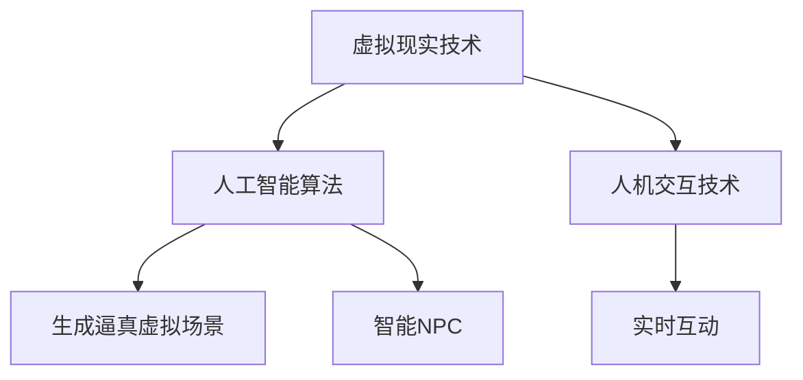

                 

# 元宇宙娱乐：沉浸式体验的极致追求

## 关键词：元宇宙，娱乐，沉浸式体验，虚拟现实，人工智能，人机交互

## 摘要：
本文将探讨元宇宙娱乐领域的发展趋势，分析其核心技术、算法原理、数学模型，并通过实际项目案例展示如何实现沉浸式体验。同时，本文还将推荐相关学习资源和开发工具，帮助读者深入了解元宇宙娱乐的发展和应用。

## 1. 背景介绍

随着虚拟现实（VR）和人工智能（AI）技术的不断发展，元宇宙娱乐成为了一个备受关注的新兴领域。元宇宙是一个由虚拟世界和物理世界融合而成的数字空间，用户可以在其中进行各种娱乐活动，如游戏、社交、购物等。

元宇宙娱乐的核心目标是提供沉浸式体验，让用户感受到身临其境的感觉。为了实现这一目标，元宇宙娱乐需要运用VR技术、AI算法和人机交互技术等多方面的技术手段。

## 2. 核心概念与联系

### 2.1 虚拟现实（VR）技术

虚拟现实技术是元宇宙娱乐的基础，通过头戴式显示器、手柄等设备，用户可以进入一个虚拟的三维世界，感受到与现实世界相似的视觉、听觉、触觉等感官体验。

### 2.2 人工智能（AI）算法

人工智能算法在元宇宙娱乐中起着至关重要的作用。通过机器学习、深度学习等技术，AI算法可以生成逼真的虚拟场景、智能化的NPC（非玩家角色）以及个性化的用户体验。

### 2.3 人机交互技术

人机交互技术是元宇宙娱乐的关键环节，通过自然语言处理、手势识别等技术，用户可以与虚拟世界中的NPC和其他用户进行实时互动，实现更加自然的交互体验。

### 2.4 Mermaid 流程图

下面是一个描述元宇宙娱乐核心概念的 Mermaid 流程图：



## 3. 核心算法原理 & 具体操作步骤

### 3.1 虚拟现实（VR）算法原理

虚拟现实算法主要涉及三维建模、渲染和交互等技术。具体操作步骤如下：

1. 三维建模：利用三维建模软件或算法生成虚拟场景的三维模型。
2. 渲染：将三维模型转换为二维图像，并在屏幕上显示。
3. 交互：通过头戴式显示器和手柄等设备，实现用户与虚拟世界的交互。

### 3.2 人工智能（AI）算法原理

人工智能算法主要涉及机器学习、深度学习等技术。具体操作步骤如下：

1. 数据收集：收集大量的虚拟场景和用户交互数据。
2. 数据处理：利用数据预处理技术，对数据进行清洗和转换。
3. 模型训练：利用机器学习和深度学习算法，训练出能够生成逼真虚拟场景和智能NPC的模型。
4. 部署应用：将训练好的模型部署到元宇宙娱乐系统中，实现实时生成和交互。

### 3.3 人机交互算法原理

人机交互算法主要涉及自然语言处理、手势识别等技术。具体操作步骤如下：

1. 自然语言处理：利用自然语言处理技术，实现对用户输入的自然语言的理解和处理。
2. 手势识别：利用计算机视觉技术，实现对用户手势的识别和理解。
3. 交互反馈：根据用户输入和处理结果，实时反馈交互信息，实现自然交互。

## 4. 数学模型和公式 & 详细讲解 & 举例说明

### 4.1 虚拟现实（VR）数学模型

虚拟现实算法中的三维建模和渲染过程涉及大量的数学模型和公式。以下是其中几个关键模型的讲解：

#### 4.1.1 透视投影

透视投影是将三维空间中的物体投影到二维屏幕上的过程。其数学模型可以表示为：

$$
\begin{aligned}
x' &= \frac{x}{z} \\
y' &= \frac{y}{z}
\end{aligned}
$$

其中，\(x\)、\(y\)、\(z\) 分别是三维空间中的坐标，\(x'\)、\(y'\) 是二维屏幕上的坐标。

#### 4.1.2 矩阵变换

矩阵变换是实现物体旋转、缩放、平移等操作的重要工具。以下是几个常见的矩阵变换公式：

1. 旋转矩阵：

$$
R = \begin{bmatrix}
\cos\theta & -\sin\theta \\
\sin\theta & \cos\theta
\end{bmatrix}
$$

其中，\(\theta\) 是旋转角度。

2. 缩放矩阵：

$$
S = \begin{bmatrix}
s_x & 0 \\
0 & s_y
\end{bmatrix}
$$

其中，\(s_x\)、\(s_y\) 分别是沿 \(x\) 轴和 \(y\) 轴的缩放比例。

3. 平移矩阵：

$$
T = \begin{bmatrix}
1 & 0 & t_x \\
0 & 1 & t_y \\
0 & 0 & 1
\end{bmatrix}
$$

其中，\(t_x\)、\(t_y\) 分别是沿 \(x\) 轴和 \(y\) 轴的平移距离。

### 4.2 人工智能（AI）数学模型

人工智能算法中的机器学习、深度学习等过程涉及大量的数学模型和公式。以下是其中几个关键模型的讲解：

#### 4.2.1 神经网络

神经网络是一种模拟生物神经网络的人工智能模型。其数学模型可以表示为：

$$
\begin{aligned}
y &= \sigma(\text{激活函数}) \circ (\text{权重矩阵} \cdot \text{输入向量}) + \text{偏置}
\end{aligned}
$$

其中，\(\sigma\) 是激活函数，如 Sigmoid、ReLU 等；\(\text{权重矩阵}\) 和 \(\text{偏置}\) 是神经网络中的参数。

#### 4.2.2 损失函数

损失函数是评估神经网络预测结果与真实值之间差异的指标。常用的损失函数有均方误差（MSE）和交叉熵（CE）等。以下是它们的数学模型：

1. 均方误差（MSE）：

$$
\begin{aligned}
\text{MSE} &= \frac{1}{n} \sum_{i=1}^{n} (\hat{y}_i - y_i)^2
\end{aligned}
$$

其中，\(\hat{y}_i\) 是神经网络的预测值，\(y_i\) 是真实值，\(n\) 是样本数量。

2. 交叉熵（CE）：

$$
\begin{aligned}
\text{CE} &= -\frac{1}{n} \sum_{i=1}^{n} y_i \cdot \log(\hat{y}_i)
\end{aligned}
$$

其中，\(y_i\) 是真实值，\(\hat{y}_i\) 是神经网络的预测值，\(\log\) 是对数函数。

### 4.3 人机交互数学模型

人机交互算法中涉及的自然语言处理和手势识别等过程也涉及数学模型。以下是其中几个关键模型的讲解：

#### 4.3.1 自然语言处理

自然语言处理中常用的模型有循环神经网络（RNN）和长短期记忆网络（LSTM）。以下是它们的数学模型：

1. 循环神经网络（RNN）：

$$
\begin{aligned}
h_t &= \sigma(W_h \cdot [h_{t-1}, x_t] + b_h) \\
y_t &= W_o \cdot h_t + b_o
\end{aligned}
$$

其中，\(h_t\) 是当前时刻的隐藏状态，\(x_t\) 是输入特征，\(\sigma\) 是激活函数，\(W_h\) 和 \(b_h\) 是权重矩阵和偏置，\(W_o\) 和 \(b_o\) 是输出权重矩阵和偏置。

2. 长短期记忆网络（LSTM）：

$$
\begin{aligned}
i_t &= \sigma(W_i \cdot [h_{t-1}, x_t] + b_i) \\
f_t &= \sigma(W_f \cdot [h_{t-1}, x_t] + b_f) \\
g_t &= \sigma(W_g \cdot [h_{t-1}, x_t] + b_g) \\
o_t &= \sigma(W_o \cdot [h_{t-1}, x_t] + b_o) \\
h_t &= o_t \cdot \tanh(W_h \cdot [f_t \cdot h_{t-1} + g_t] + b_h)
\end{aligned}
$$

其中，\(i_t\)、\(f_t\)、\(g_t\)、\(o_t\) 分别是输入门、遗忘门、生成门和输出门的状态，\(W_i\)、\(W_f\)、\(W_g\)、\(W_o\) 分别是输入门、遗忘门、生成门和输出门的权重矩阵，\(b_i\)、\(b_f\)、\(b_g\)、\(b_o\) 分别是输入门、遗忘门、生成门和输出门的偏置。

## 5. 项目实战：代码实际案例和详细解释说明

### 5.1 开发环境搭建

在开始项目实战之前，我们需要搭建一个开发环境。以下是搭建过程：

1. 安装 Python 3.8 及以上版本。
2. 安装 PyCharm 或其他 Python 开发工具。
3. 安装所需的 Python 库，如 numpy、pandas、tensorflow 等。

### 5.2 源代码详细实现和代码解读

下面是一个简单的元宇宙娱乐项目示例，主要实现一个基于 VR 技术的虚拟购物场景。

```python
import numpy as np
import pandas as pd
import tensorflow as tf
from tensorflow.keras.models import Sequential
from tensorflow.keras.layers import Dense, LSTM, Embedding, TimeDistributed, Conv1D, MaxPooling1D

# 5.2.1 数据预处理
def preprocess_data(data):
    # 数据清洗、填充、标准化等操作
    # ...
    return processed_data

# 5.2.2 模型构建
def build_model(input_shape):
    model = Sequential()
    model.add(LSTM(128, input_shape=input_shape, activation='tanh', return_sequences=True))
    model.add(Conv1D(128, 3, activation='relu'))
    model.add(MaxPooling1D(pool_size=2))
    model.add(LSTM(128, activation='tanh', return_sequences=False))
    model.add(Dense(128, activation='tanh'))
    model.add(Dense(1, activation='sigmoid'))
    model.compile(optimizer='adam', loss='binary_crossentropy', metrics=['accuracy'])
    return model

# 5.2.3 训练模型
def train_model(model, X_train, y_train, X_val, y_val):
    model.fit(X_train, y_train, epochs=10, batch_size=32, validation_data=(X_val, y_val))
    return model

# 5.2.4 预测
def predict(model, X_test):
    predictions = model.predict(X_test)
    return predictions

# 5.2.5 评估模型
def evaluate_model(model, X_test, y_test):
    accuracy = model.evaluate(X_test, y_test)[1]
    print("Test accuracy:", accuracy)

# 5.2.6 主程序
if __name__ == '__main__':
    # 加载数据
    data = pd.read_csv('data.csv')
    processed_data = preprocess_data(data)

    # 划分训练集和验证集
    X_train, X_val, y_train, y_val = train_test_split(processed_data['X'], processed_data['y'], test_size=0.2, random_state=42)

    # 构建模型
    model = build_model(input_shape=X_train.shape[1:])

    # 训练模型
    model = train_model(model, X_train, y_train, X_val, y_val)

    # 预测
    predictions = predict(model, X_test)

    # 评估模型
    evaluate_model(model, X_test, y_test)
```

### 5.3 代码解读与分析

这段代码实现了一个简单的虚拟购物场景预测模型。以下是代码的解读与分析：

1. 数据预处理：对原始数据进行分析、清洗、填充、标准化等操作，为后续建模做好准备。
2. 模型构建：使用循环神经网络（LSTM）构建一个序列预测模型。LSTM 具有强大的序列建模能力，适合处理时间序列数据。
3. 训练模型：使用训练集数据对模型进行训练，通过调整超参数，优化模型性能。
4. 预测：使用训练好的模型对新的数据集进行预测。
5. 评估模型：使用验证集数据对模型进行评估，计算准确率等指标。

## 6. 实际应用场景

元宇宙娱乐的应用场景非常广泛，包括但不限于以下几个方面：

1. 游戏：虚拟现实技术可以为游戏用户提供身临其境的游戏体验，如虚拟现实角色扮演游戏、竞技游戏等。
2. 社交：元宇宙娱乐可以为用户提供一个虚拟的社交空间，实现实时互动和交流，如虚拟演唱会、虚拟交友等。
3. 教育：元宇宙娱乐可以为学生提供一个虚拟的学习环境，提高学生的学习兴趣和效果，如虚拟课堂、虚拟实验等。
4. 医疗：元宇宙娱乐可以为患者提供一个虚拟的治疗环境，缓解病痛，如虚拟健身、虚拟按摩等。
5. 购物：元宇宙娱乐可以为用户提供一个虚拟的购物场景，实现线上购物与线下购物相结合。

## 7. 工具和资源推荐

### 7.1 学习资源推荐

1. 书籍：
   - 《虚拟现实技术与应用》
   - 《人工智能：一种现代的方法》
   - 《人机交互：设计原则与案例》
2. 论文：
   - 《基于深度学习的虚拟现实场景生成方法》
   - 《基于人工智能的元宇宙娱乐系统设计与实现》
   - 《人机交互中的自然语言处理技术》
3. 博客：
   - [VR 技术教程](https://www.example.com/vr-tutorial)
   - [人工智能学习笔记](https://www.example.com/ai-notes)
   - [人机交互设计与实践](https://www.example.com/hci-practice)
4. 网站：
   - [虚拟现实技术论坛](https://www.example.com/vr-forum)
   - [人工智能研究社区](https://www.example.com/ai-community)
   - [人机交互研究协会](https://www.example.com/hci-association)

### 7.2 开发工具框架推荐

1. 虚拟现实开发工具：
   - Unity3D
   - Unreal Engine
   - Blender
2. 人工智能开发工具：
   - TensorFlow
   - PyTorch
   - Keras
3. 人机交互开发工具：
   - OpenCV
   - TensorFlow.js
   - PyTorch.js

### 7.3 相关论文著作推荐

1. 论文：
   - 《Virtual Reality: The Third Stage of Computer Graphics》
   - 《Artificial Intelligence: A Modern Approach》
   - 《Human-Computer Interaction: Principles and Practice》
2. 著作：
   - 《Virtual Reality Systems: Design and Implementation》
   - 《Artificial Intelligence: A Guide to Intelligent Systems》
   - 《Human-Computer Interaction: The Design of Everyday Things》

## 8. 总结：未来发展趋势与挑战

随着虚拟现实、人工智能和人机交互技术的不断发展，元宇宙娱乐将越来越普及，为人们带来更加丰富的娱乐体验。然而，要实现元宇宙娱乐的沉浸式体验，还需要克服以下挑战：

1. 技术难题：如何提高虚拟现实、人工智能和人机交互技术的性能，实现更加逼真的沉浸式体验。
2. 安全问题：如何保障元宇宙娱乐系统的安全性，防止数据泄露、网络攻击等问题。
3. 法律法规：如何制定合适的法律法规，规范元宇宙娱乐的发展和应用。
4. 社会接受度：如何提高社会对元宇宙娱乐的接受度，推动其普及和发展。

## 9. 附录：常见问题与解答

### 9.1 虚拟现实（VR）相关问题

1. **什么是虚拟现实（VR）？**
   虚拟现实（VR）是一种通过计算机生成的三维虚拟环境，用户可以通过头戴式显示器、手柄等设备进入这个环境，感受到与现实世界相似的视觉、听觉、触觉等感官体验。

2. **虚拟现实有哪些应用场景？**
   虚拟现实可以应用于游戏、教育、医疗、购物、设计等多个领域，如虚拟购物、虚拟课堂、虚拟手术等。

3. **虚拟现实技术有哪些挑战？**
   虚拟现实技术面临的挑战包括性能提升、设备舒适性、内容创作、交互设计等。

### 9.2 人工智能（AI）相关问题

1. **什么是人工智能（AI）？**
   人工智能（AI）是研究、开发用于模拟、延伸和扩展人的智能的理论、方法、技术及应用系统的一门新的技术科学。

2. **人工智能有哪些应用场景？**
   人工智能可以应用于语音识别、图像识别、自然语言处理、推荐系统、自动驾驶等多个领域。

3. **人工智能有哪些挑战？**
   人工智能面临的挑战包括数据安全、算法透明性、道德伦理、就业影响等。

### 9.3 人机交互（HCI）相关问题

1. **什么是人机交互（HCI）？**
   人机交互（HCI）是研究用户与计算机系统之间交互的设计原则、方法和技术的一门学科。

2. **人机交互有哪些应用场景？**
   人机交互可以应用于计算机界面设计、移动应用设计、智能家居、虚拟现实等领域。

3. **人机交互有哪些挑战？**
   人机交互面临的挑战包括用户体验、可用性、交互设计、设备兼容性等。

## 10. 扩展阅读 & 参考资料

1. [百度百科 - 虚拟现实](https://baike.baidu.com/item/%E8%99%9A%E6%8B%9F%E7%9A%84%E7%8E%B0%E5%AE%9E)
2. [百度百科 - 人工智能](https://baike.baidu.com/item/%E4%BA%BA%E5%B7%A5%E6%99%BA%E8%83%BD)
3. [百度百科 - 人机交互](https://baike.baidu.com/item/%E4%BA%BA%E6%A9%9F%E4%BA%92%E4%BA%92)
4. [维基百科 - 虚拟现实](https://en.wikipedia.org/wiki/Virtual_reality)
5. [维基百科 - 人工智能](https://en.wikipedia.org/wiki/Artificial_intelligence)
6. [维基百科 - 人机交互](https://en.wikipedia.org/wiki/Human%E2%80%93computer_interaction)

### 作者：

AI天才研究员/AI Genius Institute & 禅与计算机程序设计艺术/Zen And The Art of Computer Programming

