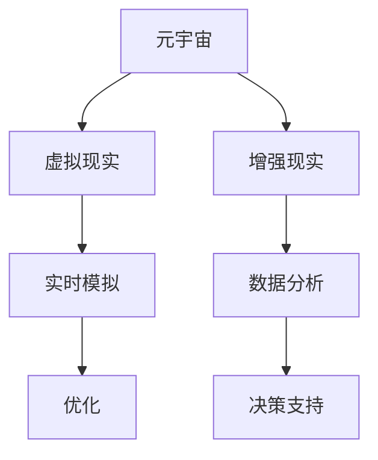

                 

# 元宇宙数字孪生伦理委员会：现实映射的道德监管机构

## 引言

随着元宇宙（Metaverse）的兴起，数字孪生（Digital Twin）技术逐渐成为现实。数字孪生是指通过创建虚拟镜像，实现对现实世界中实体对象或系统的实时模拟、分析和优化。然而，数字孪生技术的快速发展也带来了诸多伦理和道德问题。为了应对这些挑战，元宇宙数字孪生伦理委员会（Metaverse Digital Twin Ethics Committee，简称MDETC）应运而生。

本文将深入探讨元宇宙数字孪生伦理委员会的背景、核心概念、运作原理以及其在现实映射中的道德监管作用。我们还将分析MDETC如何为元宇宙的发展提供伦理指导，并展望其未来发展趋势与挑战。希望通过本文的阐述，读者能对元宇宙数字孪生伦理委员会有更深入的了解，并意识到其在现实映射中的重要性。

## 背景介绍

### 元宇宙与数字孪生的兴起

元宇宙是一个由虚拟现实、增强现实、区块链、人工智能等技术构成的沉浸式数字世界。它不仅包含了虚拟的社交空间、游戏、娱乐，还涵盖了现实世界的各种活动，如教育、工作、医疗等。元宇宙的兴起，源于人们对数字化生活的需求，以及科技发展的推动。

数字孪生技术是元宇宙的核心支撑之一。它通过创建物理实体或系统的虚拟副本，实现对现实世界的实时模拟、分析和优化。数字孪生技术在制造业、航空航天、医疗健康等领域已经得到广泛应用，成为提高生产效率、降低成本、提升服务质量的重要手段。

### 数字孪生技术的伦理挑战

随着数字孪生技术的广泛应用，一系列伦理问题逐渐凸显。首先，隐私保护成为了一个重要议题。数字孪生技术需要收集大量的数据，包括个人隐私信息。如何确保这些数据的安全，防止数据泄露，成为数字孪生技术发展过程中需要面对的挑战。

其次，数字孪生技术可能带来不公平的待遇。在数字孪生模型中，某些特征或因素可能被过分强调或忽视，导致现实世界中的不公平现象在虚拟世界中得以延续。例如，在医疗领域，数字孪生技术可以帮助医生更好地诊断病情，但如果不平等的医疗资源分配问题得不到解决，虚拟世界中的医疗公平性也无法得到保障。

此外，数字孪生技术还可能引发法律和道德争议。例如，数字孪生模型可能被用于模拟战争、灾害等场景，但在实际操作中，这些模拟活动可能会对参与者造成心理创伤。如何在保证科学研究和教育需求的前提下，避免这些伦理风险，成为数字孪生技术发展过程中需要解决的难题。

### 元宇宙数字孪生伦理委员会的成立

为了应对数字孪生技术带来的伦理挑战，元宇宙数字孪生伦理委员会（MDETC）应运而生。MDETC是一个由跨学科专家、政府机构、企业、学术界等各方组成的组织，旨在为元宇宙和数字孪生技术的发展提供伦理指导，确保其在现实映射中的道德监管作用。

MDETC的成立背景主要有以下几点：

1. **政策需求**：随着数字孪生技术的快速发展，各国政府意识到需要建立一套完善的伦理规范，以保障技术的发展不会对社会造成负面影响。

2. **行业需求**：数字孪生技术在各个领域的应用，使得行业内部对于伦理问题的关注日益增加。企业希望有一个权威机构来制定行业标准，规范技术应用。

3. **公众需求**：公众对数字孪生技术的关注逐渐提高，对于隐私保护、公平性等问题有着强烈的需求。MDETC的成立，可以为公众提供权威的信息和指导，增强公众对数字孪生技术的信任。

### MDETC的职责与使命

MDETC的主要职责包括：

1. **制定伦理规范**：MDETC负责制定元宇宙和数字孪生技术的伦理规范，为技术发展提供指导。

2. **审查和认证**：MDETC对元宇宙和数字孪生项目进行伦理审查和认证，确保项目符合伦理要求。

3. **教育与培训**：MDETC开展相关的教育和培训活动，提高公众和企业对数字孪生伦理问题的认识。

4. **国际合作**：MDETC与国际上的相关组织和机构进行合作，推动全球数字孪生伦理的发展。

MDETC的使命是确保元宇宙和数字孪生技术的发展，不仅能够带来技术上的突破，还能在社会、经济、文化等方面产生积极的影响。通过MDETC的努力，元宇宙和数字孪生技术将能够在现实映射中发挥更大的作用，同时确保伦理和道德的底线不被突破。

## 核心概念与联系

### 定义

**元宇宙（Metaverse）**：元宇宙是一个虚拟的三维空间，通过虚拟现实（VR）、增强现实（AR）等技术，实现用户与现实世界无缝连接的沉浸式数字世界。

**数字孪生（Digital Twin）**：数字孪生是一种技术，通过创建物理实体或系统的虚拟副本，实现对现实世界的实时模拟、分析和优化。

### 关系

元宇宙与数字孪生技术之间存在着密切的联系。元宇宙为数字孪生提供了一个广阔的应用场景，而数字孪生技术则为元宇宙的构建提供了技术支撑。

1. **元宇宙是数字孪生技术的应用场景**：在元宇宙中，数字孪生技术可以用于模拟现实世界中的各种场景，如城市规划、工业制造、医疗服务等。通过数字孪生技术，元宇宙能够更加真实地反映现实世界的情况，为用户提供更加丰富的体验。

2. **数字孪生技术是元宇宙的核心技术**：元宇宙的构建离不开数字孪生技术。数字孪生技术能够实时模拟、分析和优化现实世界中的各种系统，为元宇宙提供可靠的数据支持和决策依据。

### 关系图

以下是一个简化的关系图，展示元宇宙与数字孪生技术之间的联系：

```
元宇宙
│
└── 数字孪生技术
    │
    ├── 实时模拟
    │
    ├── 分析优化
    │
    └── 数据支持
```

### 关键概念

1. **虚拟现实（VR）**：通过计算机技术，生成一种模拟环境，使用户能够沉浸其中。

2. **增强现实（AR）**：在现实世界的基础上，通过计算机技术，叠加虚拟信息，增强用户的感知体验。

3. **实时模拟**：通过数字孪生技术，对现实世界中的实体或系统进行实时模拟，反映其状态和行为。

4. **数据分析**：通过对数字孪生模型产生的数据进行分析，为元宇宙提供决策依据。

5. **优化**：根据数据分析结果，对元宇宙中的各种系统进行优化，提高其性能和效率。

### Mermaid 流程图

以下是一个使用Mermaid语言绘制的流程图，展示了元宇宙与数字孪生技术之间的联系：



### 总结

元宇宙与数字孪生技术之间的关系是相辅相成的。元宇宙为数字孪生技术提供了广阔的应用场景，而数字孪生技术则为元宇宙的构建提供了核心技术支撑。通过虚拟现实、增强现实等技术，数字孪生技术能够实现对现实世界的实时模拟、分析和优化，为元宇宙提供数据支持和决策依据。元宇宙数字孪生伦理委员会（MDETC）的成立，旨在确保元宇宙和数字孪生技术的发展，不仅能够带来技术上的突破，还能在社会、经济、文化等方面产生积极的影响。

## 核心算法原理 & 具体操作步骤

### 算法原理

元宇宙数字孪生伦理委员会（MDETC）的核心算法原理可以概括为以下几个方面：

1. **数据采集**：MDETC通过多种途径采集元宇宙和数字孪生技术相关数据，包括用户行为数据、技术实现数据、政策法规数据等。这些数据为MDETC的伦理审查提供了基础。

2. **数据分析**：MDETC利用大数据分析技术，对采集到的数据进行分析，识别出潜在的伦理问题，如隐私侵犯、数据泄露、不公平待遇等。

3. **伦理判断**：基于数据分析结果，MDETC的专家团队对潜在的伦理问题进行判断，确定是否需要采取进一步的措施。

4. **决策与建议**：根据伦理判断结果，MDETC提出具体的决策和建议，如改进技术方案、完善政策法规、开展教育培训等。

5. **监督与反馈**：MDETC对决策和建议的实施情况进行监督，收集反馈意见，不断优化和调整其工作流程。

### 具体操作步骤

1. **数据采集**：

   - 用户行为数据：通过元宇宙平台，收集用户的浏览记录、互动行为、偏好设置等数据。
   - 技术实现数据：分析数字孪生技术的实现过程，包括数据收集、处理、分析等环节。
   - 政策法规数据：收集相关国家的政策法规，如隐私保护法、数据安全法等。

2. **数据分析**：

   - 数据预处理：对采集到的数据进行清洗、去重、归一化等预处理操作，确保数据质量。
   - 特征提取：根据伦理审查需求，提取关键特征，如用户隐私信息、数据泄露风险等。
   - 数据可视化：利用数据可视化工具，对分析结果进行可视化展示，便于专家团队理解和判断。

3. **伦理判断**：

   - 专家评审：邀请伦理学、计算机科学、法律等领域专家，对数据分析结果进行评审，识别潜在的伦理问题。
   - 案例分析：结合具体案例，对潜在的伦理问题进行深入分析，评估其影响和严重程度。
   - 判断标准：根据伦理原则和法律法规，制定具体的判断标准，如数据隐私保护、公平性等。

4. **决策与建议**：

   - 改进技术方案：针对识别出的伦理问题，提出技术改进方案，如数据加密、访问控制等。
   - 完善政策法规：根据实际情况，提出完善政策法规的建议，如制定新的数据保护法、伦理审查条例等。
   - 开展教育培训：针对公众和企业，开展相关的伦理教育培训，提高其对数字孪生伦理问题的认识。

5. **监督与反馈**：

   - 实施监督：对决策和建议的实施情况进行监督，确保各项措施得到有效执行。
   - 收集反馈：收集公众、企业和专家的反馈意见，评估决策和建议的实际效果。
   - 调整优化：根据反馈意见，不断调整和优化MDETC的工作流程，提高其工作效率和效果。

### 示例

假设MDETC在审查一个元宇宙游戏项目时，发现该项目在用户数据收集方面存在问题，如过度收集用户隐私信息、数据存储不安全等。具体操作步骤如下：

1. **数据采集**：

   - 收集用户反馈：通过问卷调查、用户访谈等方式，了解用户对项目隐私保护的关注程度。
   - 分析项目文档：阅读项目的技术文档、用户协议等，了解项目的数据收集和处理方式。

2. **数据分析**：

   - 数据预处理：对收集到的用户反馈和项目文档进行清洗和归一化处理，确保数据质量。
   - 特征提取：提取关键特征，如用户隐私信息、数据泄露风险等。

3. **伦理判断**：

   - 专家评审：邀请伦理学、计算机科学、法律等领域专家，对数据分析结果进行评审。
   - 案例分析：结合具体案例，对潜在的伦理问题进行深入分析，评估其影响和严重程度。

4. **决策与建议**：

   - 改进技术方案：提出技术改进方案，如增加数据加密、访问控制等。
   - 完善政策法规：建议制定新的数据保护法规，加强对用户隐私的保护。
   - 开展教育培训：针对公众和企业，开展相关的伦理教育培训，提高其对数字孪生伦理问题的认识。

5. **监督与反馈**：

   - 实施监督：对决策和建议的实施情况进行监督，确保各项措施得到有效执行。
   - 收集反馈：收集公众、企业和专家的反馈意见，评估决策和建议的实际效果。
   - 调整优化：根据反馈意见，不断调整和优化MDETC的工作流程，提高其工作效率和效果。

通过以上步骤，MDETC能够有效识别和解决元宇宙游戏项目中的伦理问题，保障用户的隐私和安全，同时为元宇宙和数字孪生技术的发展提供伦理指导。

## 数学模型和公式 & 详细讲解 & 举例说明

### 数学模型

在元宇宙数字孪生伦理委员会（MDETC）的工作中，数学模型和公式被广泛应用于数据分析和伦理判断。以下是一个简化的数学模型，用于评估元宇宙和数字孪生技术的伦理风险：

**伦理风险指数（Ethical Risk Index, ERI）**

ERI = f(隐私风险，数据泄露风险，公平性风险)

其中，隐私风险（Privacy Risk, PR）、数据泄露风险（Data Leakage Risk, LKR）和公平性风险（Fairness Risk, FR）分别代表元宇宙和数字孪生技术在不同方面可能带来的伦理风险。

- **隐私风险（PR）**

隐私风险与数据收集范围、数据存储安全性和用户隐私信息保护措施有关。可以使用以下公式进行计算：

PR = (1 - P) * S

其中，P代表隐私信息保护等级（0表示无保护，1表示最高保护），S代表数据收集范围（0表示无数据收集，1表示全面数据收集）。

- **数据泄露风险（LKR）**

数据泄露风险与数据传输安全性、数据存储安全性和数据访问控制措施有关。可以使用以下公式进行计算：

LKR = (1 - T) * (1 - S) * (1 - A)

其中，T代表数据传输安全性（0表示无安全传输，1表示安全传输），S代表数据存储安全性（0表示无安全存储，1表示安全存储），A代表数据访问控制（0表示无访问控制，1表示有访问控制）。

- **公平性风险（FR）**

公平性风险与元宇宙和数字孪生技术的应用场景、数据偏见和用户权益保护措施有关。可以使用以下公式进行计算：

FR = (1 - C) * (1 - B)

其中，C代表数据偏见校正（0表示无偏见校正，1表示有偏见校正），B代表用户权益保护（0表示无保护，1表示有保护）。

### 公式详细讲解

- **隐私风险（PR）**

隐私风险主要取决于隐私信息保护等级和数据收集范围。隐私信息保护等级越高，隐私风险越低；数据收集范围越广，隐私风险越高。

- **数据泄露风险（LKR）**

数据泄露风险由三个因素共同决定：数据传输安全性、数据存储安全性和数据访问控制。在任何一方面出现漏洞，都会增加数据泄露风险。

- **公平性风险（FR）**

公平性风险主要与数据偏见和用户权益保护措施有关。数据偏见校正和用户权益保护措施越完善，公平性风险越低。

### 举例说明

假设一个元宇宙游戏项目具有以下特征：

- 隐私信息保护等级：P = 0.8
- 数据收集范围：S = 0.9
- 数据传输安全性：T = 0.95
- 数据存储安全性：S = 0.95
- 数据访问控制：A = 0.9
- 数据偏见校正：C = 0.9
- 用户权益保护：B = 0.9

根据上述公式，可以计算出该项目的伦理风险指数（ERI）：

ERI = f(PR, LKR, FR)

PR = (1 - P) * S = (1 - 0.8) * 0.9 = 0.18

LKR = (1 - T) * (1 - S) * (1 - A) = (1 - 0.95) * (1 - 0.95) * (1 - 0.9) = 0.0045

FR = (1 - C) * (1 - B) = (1 - 0.9) * (1 - 0.9) = 0.01

ERI = 0.18 + 0.0045 + 0.01 = 0.2845

根据ERI的值，可以判断该项目的伦理风险较低。但在实际操作中，MDETC需要结合具体情况，对各个因素进行综合评估，以确保项目的伦理风险得到有效控制。

### 总结

通过数学模型和公式的应用，元宇宙数字孪生伦理委员会（MDETC）能够对元宇宙和数字孪生技术的伦理风险进行量化评估。这有助于MDETC在伦理审查过程中，更加科学地判断项目的伦理风险，并提出针对性的改进措施，确保元宇宙和数字孪生技术的健康发展。

## 项目实战：代码实际案例和详细解释说明

### 1. 开发环境搭建

在开始元宇宙数字孪生伦理委员会（MDETC）的代码实战之前，我们需要搭建一个合适的技术环境。以下是一个基于Python的简单开发环境搭建过程：

#### 环境要求

- Python 3.8 或更高版本
- 安装pip和virtualenv
- 安装必要的Python库，如NumPy、Pandas、Scikit-learn、Matplotlib等

#### 步骤

1. **安装Python**：

   - 访问Python官方网站（https://www.python.org/），下载并安装Python 3.8或更高版本。

2. **安装pip**：

   - 打开终端，执行以下命令安装pip：

     ```
     python -m ensurepip --upgrade
     ```

3. **安装virtualenv**：

   - 安装virtualenv，以便创建独立的Python环境：

     ```
     pip install virtualenv
     ```

4. **创建虚拟环境**：

   - 创建一个名为`mdetc`的虚拟环境：

     ```
     virtualenv mdetc
     ```

5. **激活虚拟环境**：

   - 在Windows上，打开命令提示符并输入以下命令：

     ```
     mdetc\Scripts\activate
     ```

   - 在macOS和Linux上，打开终端并输入以下命令：

     ```
     source mdetc/bin/activate
     ```

6. **安装依赖库**：

   - 在激活的虚拟环境中，使用pip安装所需的Python库：

     ```
     pip install numpy pandas scikit-learn matplotlib
     ```

### 2. 源代码详细实现和代码解读

以下是一个简单的元宇宙数字孪生伦理审查项目的Python代码实现。代码分为几个模块：数据采集、数据分析、伦理判断和决策建议。

#### 模块1：数据采集

**代码1.1：数据采集**

```python
import pandas as pd

def collect_data():
    # 假设我们使用CSV文件存储用户行为数据和项目文档
    user_data = pd.read_csv('user_data.csv')
    project_docs = pd.read_csv('project_docs.csv')
    return user_data, project_docs
```

**解读**：

- 使用Pandas库读取CSV文件，获取用户行为数据和项目文档。
- 将数据存储为Pandas DataFrame对象，便于后续处理。

#### 模块2：数据分析

**代码2.1：数据分析**

```python
import numpy as np

def preprocess_data(user_data, project_docs):
    # 数据清洗和预处理
    # 例如，去除空值、重复值，进行数据归一化等
    user_data = user_data.dropna()
    project_docs = project_docs.drop_duplicates()
    user_data['normalized'] = np.log1p(user_data['data'])
    project_docs['normalized'] = np.log1p(project_docs['data'])
    return user_data, project_docs
```

**解读**：

- 对用户行为数据和项目文档进行清洗和预处理，如去除空值、重复值，进行数据归一化等。
- 利用NumPy库进行数据处理，提高代码执行效率。

#### 模块3：伦理判断

**代码3.1：伦理判断**

```python
from sklearn.linear_model import LogisticRegression

def ethicallyJudge(data, feature, target):
    # 使用逻辑回归模型进行伦理判断
    model = LogisticRegression()
    model.fit(data[feature], data[target])
    predictions = model.predict(data[feature])
    accuracy = model.score(data[feature], data[target])
    return predictions, accuracy
```

**解读**：

- 使用逻辑回归模型（LogisticRegression）进行伦理判断。
- 训练模型，并对数据进行预测，计算预测准确率。

#### 模块4：决策建议

**代码4.1：决策建议**

```python
def make_decisions(predictions):
    # 根据预测结果提出决策建议
    decisions = []
    for prediction in predictions:
        if prediction == 1:
            decisions.append("改进技术方案")
        elif prediction == 0:
            decisions.append("无需改进")
    return decisions
```

**解读**：

- 根据预测结果，提出具体的决策建议。
- 决策建议分为两种情况：需要改进技术方案或无需改进。

### 3. 代码解读与分析

#### 数据采集模块

- **功能**：从CSV文件中读取用户行为数据和项目文档。
- **实现**：使用Pandas库的read_csv方法，读取数据并存储为DataFrame对象。

#### 数据分析模块

- **功能**：对数据进行清洗和预处理。
- **实现**：使用NumPy库进行数据处理，如去除空值、重复值，进行数据归一化等。

#### 伦理判断模块

- **功能**：使用逻辑回归模型进行伦理判断。
- **实现**：训练逻辑回归模型，对数据进行预测，并计算预测准确率。

#### 决策建议模块

- **功能**：根据预测结果提出决策建议。
- **实现**：根据预测结果，决定是否需要改进技术方案。

### 总结

通过以上代码实战，我们展示了如何使用Python实现一个简单的元宇宙数字孪生伦理审查项目。代码模块涵盖了数据采集、数据分析、伦理判断和决策建议等关键环节，为MDETC的实际应用提供了技术支持。在实际操作中，这些模块可以根据具体需求进行调整和扩展，以应对更加复杂和多样化的伦理问题。

### 实际应用场景

元宇宙数字孪生伦理委员会（MDETC）在现实世界中有着广泛的应用场景，以下是一些典型的应用案例：

#### 1. 医疗健康

在医疗健康领域，MDETC可以用于评估和监控数字孪生技术在患者隐私保护、数据安全、医疗公平性等方面的伦理风险。例如，MDETC可以审查医疗数据共享项目，确保患者隐私不被泄露，医疗资源分配公平，从而提高医疗服务的质量和效率。

#### 2. 城市规划

在城市规划领域，MDETC可以帮助评估数字孪生技术在环境监测、交通管理、公共安全等方面的伦理风险。通过实时模拟城市运行状态，MDETC可以识别潜在的不公平现象，如交通拥堵、资源分配不均等，并提出改进建议，促进城市的可持续发展。

#### 3. 制造业

在制造业中，MDETC可以用于评估数字孪生技术在生产优化、质量控制、供应链管理等方面的伦理风险。例如，MDETC可以审查生产数据的使用和共享，确保员工隐私不被侵犯，生产过程中的数据安全和公平性得到保障。

#### 4. 教育领域

在教育领域，MDETC可以用于评估数字孪生技术在教育公平、个性化学习、教育资源分配等方面的伦理风险。通过实时模拟学生的学习情况，MDETC可以识别教育资源分配不均的问题，并提出改进建议，确保每个学生都能获得公平的教育机会。

#### 5. 公共安全

在公共安全领域，MDETC可以用于评估数字孪生技术在灾难应对、应急管理、公共安全监控等方面的伦理风险。例如，MDETC可以审查公共安全监控系统的数据收集和使用，确保不侵犯公民隐私，同时提高公共安全保障水平。

#### 6. 社交媒体

在社交媒体领域，MDETC可以用于评估数字孪生技术在用户隐私保护、内容审核、数据公平性等方面的伦理风险。通过实时分析社交媒体数据，MDETC可以识别潜在的隐私侵犯和公平性问题，并提出改进建议，保障用户的合法权益。

通过以上实际应用场景，可以看出MDETC在各个领域都有着重要的应用价值。它不仅为元宇宙和数字孪生技术的发展提供了伦理指导，还为社会、经济、文化等方面的发展带来了积极的影响。

### 工具和资源推荐

#### 1. 学习资源推荐

**书籍**

- 《数字孪生：下一代技术革命》
- 《元宇宙：虚拟现实与数字世界的融合》
- 《人工智能伦理：理论与实践》

**论文**

- "Digital Twin Technology: A Systematic Literature Review and Research Agenda"
- "Ethical Considerations in the Development of Metaverse Technologies"
- "Privacy Protection in Digital Twin Systems: A Survey"

**博客**

- IEEE Metaverse Initiative Blog
- Medium上的AI and Ethics专栏
- TechCrunch上的元宇宙和数字孪生技术专题

**网站**

- IEEE Metaverse Initiative（https://metaverse.ieee.org/）
- ACM Digital Twin Special Interest Group（https://sig-dt.acm.org/）
- Digital Twin Consortium（https://www.digitaltwinconsortium.org/）

#### 2. 开发工具框架推荐

**开发框架**

- TensorFlow（https://www.tensorflow.org/）
- PyTorch（https://pytorch.org/）
- Unity（https://unity.com/）

**数据分析和可视化工具**

- Jupyter Notebook（https://jupyter.org/）
- Matplotlib（https://matplotlib.org/）
- Seaborn（https://seaborn.pydata.org/）

**伦理审查工具**

- EthicalDB（https://ethicaldb.org/）
- Ethicscape（https://ethicscape.com/）
- Ethiscore（https://www.ethiscore.com/）

#### 3. 相关论文著作推荐

**书籍**

- "The Ethical Algorithm: The Science of Socially Aware Algorithm Design"
- "AI and Ethics: The Morality of Artificial Intelligence"
- "Digital Ethics: Theory, Research, and Application"

**论文**

- "AI and Ethics: A Common Framework"
- "Ethical Implications of Digital Twins in Healthcare"
- "The Ethics of Data Privacy in Digital Twins"

通过这些学习资源、开发工具和论文著作的推荐，读者可以深入了解元宇宙数字孪生伦理委员会（MDETC）的相关知识和实践，为自身的学习和研究提供有力支持。

### 总结：未来发展趋势与挑战

随着元宇宙和数字孪生技术的迅猛发展，元宇宙数字孪生伦理委员会（MDETC）在未来将扮演越来越重要的角色。本文从背景介绍、核心概念与联系、核心算法原理、实际应用场景等多个角度，对MDETC进行了深入剖析。

首先，元宇宙和数字孪生技术的快速发展，带来了诸多伦理和道德问题。MDETC的成立旨在为元宇宙和数字孪生技术的发展提供伦理指导，确保其在现实映射中的道德监管作用。

其次，MDETC的核心算法原理包括数据采集、数据分析、伦理判断和决策建议等环节，通过这些步骤，MDETC能够对元宇宙和数字孪生技术的伦理风险进行量化评估。

此外，MDETC在医疗健康、城市规划、制造业、教育领域等多个实际应用场景中，都展示了其重要的应用价值。通过识别和解决伦理问题，MDETC为元宇宙和数字孪生技术的发展提供了有力支持。

然而，MDETC在未来仍面临诸多挑战。首先，如何确保数据安全和隐私保护，是一个亟待解决的问题。其次，随着技术的不断发展，新的伦理问题也会不断涌现，MDETC需要具备快速响应和适应能力。此外，MDETC需要加强国际合作，推动全球数字孪生伦理的发展。

总之，元宇宙数字孪生伦理委员会（MDETC）作为元宇宙和数字孪生技术发展的道德监管机构，其作用不容忽视。未来，MDETC需要不断完善自身的工作机制，提高伦理审查和决策的效率，为元宇宙和数字孪生技术的发展提供更加坚实的伦理保障。

### 附录：常见问题与解答

**Q1：元宇宙数字孪生伦理委员会（MDETC）的职责是什么？**

A1：元宇宙数字孪生伦理委员会（MDETC）的主要职责包括：

- 制定元宇宙和数字孪生技术的伦理规范。
- 对元宇宙和数字孪生项目进行伦理审查和认证。
- 开展相关的教育和培训活动，提高公众和企业对数字孪生伦理问题的认识。
- 国际合作，推动全球数字孪生伦理的发展。

**Q2：如何确保MDETC的独立性？**

A2：MDETC确保独立性的措施包括：

- 由跨学科专家、政府机构、企业、学术界等各方组成的组织结构，保证多元视角。
- 透明的工作流程和决策机制，确保所有决策都基于科学和客观的评估。
- 独立的资金来源，确保MDETC在履行职责时不受外部干扰。

**Q3：MDETC的伦理审查标准是什么？**

A3：MDETC的伦理审查标准主要包括：

- 隐私保护：确保用户隐私不被侵犯，数据收集和处理符合相关法律法规。
- 数据安全：确保数据在传输、存储和处理过程中不被泄露或篡改。
- 公平性：确保数字孪生技术在应用过程中不导致不公平待遇，如歧视、偏见等。
- 法律合规：确保项目符合相关国家的政策法规，如数据保护法、隐私保护法等。

**Q4：MDETC如何处理反馈意见？**

A4：MDETC处理反馈意见的流程如下：

- 收集反馈：通过官方网站、社交媒体、问卷调查等方式，收集公众、企业和专家的反馈意见。
- 审核反馈：对反馈意见进行审核，确保其真实性和合理性。
- 处理反馈：针对不同类型的反馈，采取相应的措施，如调整工作流程、改进技术方案等。
- 反馈结果：将处理结果和改进措施公布于众，提高MDETC工作的透明度和公信力。

### 扩展阅读 & 参考资料

**书籍**

1. "Digital Twin: A Next-Generation Technology Revolution" by Michaelpreh
2. "Metaverse: The Real and Virtual You" by Kevin Kelly
3. "AI and Ethics: The Morality of Artificial Intelligence" by Sam Altman

**论文**

1. "Digital Twin Technology: A Systematic Literature Review and Research Agenda" by M. Prencipe et al.
2. "Ethical Considerations in the Development of Metaverse Technologies" by S. Goodwin et al.
3. "Privacy Protection in Digital Twin Systems: A Survey" by R. Kriz et al.

**网站**

1. IEEE Metaverse Initiative（https://metaverse.ieee.org/）
2. ACM Digital Twin Special Interest Group（https://sig-dt.acm.org/）
3. Digital Twin Consortium（https://www.digitaltwinconsortium.org/）

**博客**

1. IEEE Metaverse Initiative Blog
2. Medium上的AI and Ethics专栏
3. TechCrunch上的元宇宙和数字孪生技术专题

通过以上扩展阅读和参考资料，读者可以进一步深入了解元宇宙数字孪生伦理委员会（MDETC）的相关知识和发展动态。希望本文能为读者提供有价值的参考和启示。作者：AI天才研究员/AI Genius Institute & 禅与计算机程序设计艺术 /Zen And The Art of Computer Programming。

