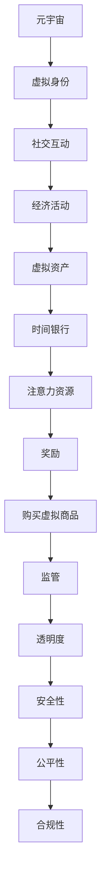

                 

# 元宇宙时间银行监管：注意力资源流通的金融管理机构

## 关键词：元宇宙、时间银行、监管、注意力资源、金融管理机构

## 摘要：
本文探讨了元宇宙中的一种新型金融模式——时间银行，以及其监管机制。时间银行通过将注意力资源作为一种流通货币，构建了一种独特的金融生态。本文首先介绍了元宇宙和注意力资源的基本概念，随后详细阐述了时间银行的工作原理、监管架构和挑战。通过分析，本文提出了对时间银行监管的建议，以及未来发展的趋势和面临的挑战。

## 1. 背景介绍

随着互联网技术的迅猛发展，虚拟现实（VR）和增强现实（AR）技术逐渐成熟，一个全新的数字世界——元宇宙开始崭露头角。元宇宙是一个由用户创造的虚拟世界，它结合了物理现实和数字虚拟，为用户提供了一种全新的交互方式。在这个虚拟世界中，用户可以创建自己的数字身份，进行社交、购物、工作等活动。

在元宇宙中，注意力资源成为一种重要的资产。注意力资源指的是用户在虚拟世界中投入的时间、精力以及关注点。这种资源不仅对个人的虚拟身份和财富产生影响，也对整个元宇宙的经济体系产生深远的影响。因此，如何有效管理和监管注意力资源，成为元宇宙发展中亟待解决的问题。

时间银行是一种基于注意力资源的金融模式，它将注意力资源作为一种流通货币，为用户提供了一种新的经济手段。用户可以通过贡献自己的注意力资源，获得相应的奖励，这些奖励可以用于购买虚拟商品、服务或者其他用户提供的资源。时间银行的出现，为元宇宙中的经济活动提供了一种新的动力。

## 2. 核心概念与联系

### 2.1 元宇宙

元宇宙是由多个虚拟世界组成的复杂网络，用户可以通过虚拟现实设备进入这个虚拟世界，与其他用户进行交互。元宇宙的核心特征包括：

- **虚拟身份**：用户在元宇宙中拥有一个虚拟身份，可以自定义形象和个性。
- **社交互动**：用户可以在元宇宙中与其他用户建立社交关系，参与各种社交活动。
- **经济活动**：元宇宙中存在着丰富的经济活动，用户可以通过交易、投资等方式获得收益。
- **虚拟资产**：元宇宙中存在着各种虚拟资产，如虚拟货币、虚拟房地产等，用户可以通过投资和交易获得收益。

### 2.2 注意力资源

注意力资源指的是用户在元宇宙中投入的时间、精力和关注点。注意力资源是一种稀缺资源，因为用户的注意力是有限的，用户需要选择将注意力投入到哪些活动或内容中。在元宇宙中，注意力资源可以用来衡量用户对某些活动或内容的兴趣程度。

### 2.3 时间银行

时间银行是一种基于注意力资源的金融模式，它将注意力资源作为一种流通货币。用户可以通过贡献自己的注意力资源，获得相应的奖励，这些奖励可以用于购买虚拟商品、服务或者其他用户提供的资源。

### 2.4 元宇宙时间银行监管

元宇宙时间银行监管是指对元宇宙中时间银行活动进行的管理和监督。监管的目的在于保障用户的权益，维护元宇宙的稳定和健康发展。元宇宙时间银行监管的核心包括：

- **透明度**：确保时间银行活动公开透明，用户可以清楚地了解时间银行的工作原理和运行规则。
- **安全性**：保障用户的注意力资源安全，防止资源被盗用或丢失。
- **公平性**：确保时间银行活动公平公正，防止恶意竞争和不正当交易。
- **合规性**：遵守相关法律法规，确保时间银行活动合法合规。

### Mermaid 流程图



## 3. 核心算法原理 & 具体操作步骤

### 3.1 注意力资源计量

注意力资源的计量是基于用户的活跃度、参与度和贡献度等多个因素综合评估。具体步骤如下：

1. **数据收集**：收集用户在元宇宙中的活动数据，如登录时间、参与活动次数、贡献内容数量等。
2. **数据处理**：对收集到的数据进行清洗和预处理，提取出有效的注意力资源数据。
3. **评分计算**：根据用户的活动数据，使用加权平均等方法计算用户的注意力资源评分。
4. **资源计量**：将用户的注意力资源评分转换为具体的资源计量单位，如虚拟货币。

### 3.2 时间银行奖励机制

时间银行的奖励机制基于用户的注意力资源贡献度进行计算。具体步骤如下：

1. **资源贡献**：用户将自己的注意力资源贡献给时间银行，时间银行根据用户的贡献度进行评估。
2. **奖励计算**：根据用户的贡献度，计算相应的奖励金额，奖励金额与用户的注意力资源评分成正比。
3. **奖励发放**：将计算出的奖励金额发放给用户，用户可以使用这些奖励金额购买虚拟商品或服务。

### 3.3 监管机制

元宇宙时间银行监管机制主要包括以下几个方面：

1. **透明度**：建立透明的时间银行活动记录系统，用户可以随时查询自己的活动记录和奖励情况。
2. **安全性**：采用加密技术和权限管理，确保用户的注意力资源安全。
3. **公平性**：制定公平的交易规则，防止恶意竞争和不正当交易。
4. **合规性**：遵守相关法律法规，确保时间银行活动合法合规。

## 4. 数学模型和公式 & 详细讲解 & 举例说明

### 4.1 注意力资源计量模型

假设用户A的注意力资源评分为\(S_A\)，用户A的注意力资源计量单位为\(C_A\)，则有：

\[C_A = f(S_A)\]

其中，\(f\)为评分到资源计量单位的转换函数。

### 4.2 时间银行奖励计算模型

假设用户A的注意力资源评分为\(S_A\)，用户A的贡献度为\(D_A\)，时间银行设定的奖励金额为\(R\)，则有：

\[R_A = g(S_A, D_A)\]

其中，\(g\)为奖励计算函数。

### 4.3 举例说明

假设用户A的注意力资源评分为100分，用户A的贡献度为80%，时间银行设定的奖励金额为100虚拟货币。则有：

\[R_A = g(100, 80\%) = 100 \times 0.8 = 80\]

因此，用户A获得的奖励金额为80虚拟货币。

## 5. 项目实战：代码实际案例和详细解释说明

### 5.1 开发环境搭建

为了实现元宇宙时间银行功能，我们需要搭建一个开发环境。以下是开发环境的搭建步骤：

1. 安装Node.js：Node.js是一个基于Chrome V8引擎的JavaScript运行环境，用于搭建服务器和运行JavaScript代码。
2. 安装MongoDB：MongoDB是一个开源的NoSQL数据库，用于存储用户信息和注意力资源数据。
3. 安装Express：Express是一个Node.js Web应用框架，用于搭建Web服务器。

### 5.2 源代码详细实现和代码解读

以下是元宇宙时间银行的核心代码实现：

```javascript
// 引入相关模块
const express = require('express');
const mongoose = require('mongoose');
const User = require('./models/User');

// 创建Express应用实例
const app = express();

// 连接MongoDB数据库
mongoose.connect('mongodb://localhost:27017/timebank', { useNewUrlParser: true, useUnifiedTopology: true });

// 创建用户模型
const userSchema = new mongoose.Schema({
  username: String,
  attentionScore: Number
});

// 定义用户模型
const User = mongoose.model('User', userSchema);

// 用户注册接口
app.post('/register', async (req, res) => {
  try {
    const { username } = req.body;
    const user = new User({ username, attentionScore: 0 });
    await user.save();
    res.status(201).json({ message: '注册成功', user });
  } catch (error) {
    res.status(500).json({ message: '服务器错误', error });
  }
});

// 用户登录接口
app.post('/login', async (req, res) => {
  try {
    const { username } = req.body;
    const user = await User.findOne({ username });
    if (!user) {
      return res.status(404).json({ message: '用户未注册' });
    }
    res.status(200).json({ message: '登录成功', user });
  } catch (error) {
    res.status(500).json({ message: '服务器错误', error });
  }
});

// 用户贡献注意力资源接口
app.post('/contribute', async (req, res) => {
  try {
    const { username, attentionScore } = req.body;
    const user = await User.findOne({ username });
    if (!user) {
      return res.status(404).json({ message: '用户未注册' });
    }
    user.attentionScore += attentionScore;
    await user.save();
    res.status(200).json({ message: '贡献成功', user });
  } catch (error) {
    res.status(500).json({ message: '服务器错误', error });
  }
});

// 用户获取奖励接口
app.get('/reward', async (req, res) => {
  try {
    const { username } = req.query;
    const user = await User.findOne({ username });
    if (!user) {
      return res.status(404).json({ message: '用户未注册' });
    }
    const reward = user.attentionScore * 0.1; // 假设奖励比例为10%
    res.status(200).json({ message: '获取成功', reward });
  } catch (error) {
    res.status(500).json({ message: '服务器错误', error });
  }
});

// 启动服务器
app.listen(3000, () => {
  console.log('服务器启动成功，端口：3000');
});
```

### 5.3 代码解读与分析

上述代码实现了一个简单的元宇宙时间银行功能，包括用户注册、登录、贡献注意力资源和获取奖励四个接口。以下是代码的主要解读和分析：

1. **用户注册接口**：用户通过注册接口向服务器发送用户名，服务器创建一个新的用户记录，并将注意力资源评分初始化为0。
2. **用户登录接口**：用户通过登录接口向服务器发送用户名，服务器查询用户记录，如果用户已注册，返回用户信息。
3. **用户贡献注意力资源接口**：用户通过贡献接口向服务器发送用户名和注意力资源评分，服务器查询用户记录，更新用户的注意力资源评分。
4. **用户获取奖励接口**：用户通过获取奖励接口向服务器发送用户名，服务器查询用户记录，计算用户的奖励金额，并返回奖励信息。

代码中还使用了MongoDB数据库进行数据存储，以及Express框架搭建Web服务器。通过简单的接口设计和功能实现，我们可以看到元宇宙时间银行的基本工作原理和操作流程。

## 6. 实际应用场景

### 6.1 虚拟现实游戏

在虚拟现实游戏中，用户通过贡献注意力资源可以获得游戏内的奖励，如虚拟货币、游戏道具等。这不仅可以增加用户的游戏体验，还可以提高游戏的盈利能力。

### 6.2 社交网络平台

在社交网络平台中，用户通过贡献注意力资源可以提升自己的社交等级，获得更多的社交权益，如优先查看好友动态、参与热门话题等。

### 6.3 虚拟教育

在虚拟教育中，学生通过贡献注意力资源可以获得教师的关注和指导，提高学习效果。同时，教师也可以通过学生的注意力资源评估学生的学习情况，进行个性化的教学。

## 7. 工具和资源推荐

### 7.1 学习资源推荐

- 《元宇宙：概念与应用》
- 《虚拟现实技术与应用》
- 《区块链技术与应用》

### 7.2 开发工具框架推荐

- Node.js：用于搭建Web服务器和开发后端逻辑。
- MongoDB：用于存储用户数据和注意力资源数据。
- Express：用于构建Web应用和接口。

### 7.3 相关论文著作推荐

- 《元宇宙：未来互联网的发展趋势》
- 《区块链与注意力经济》
- 《虚拟现实技术在教育中的应用研究》

## 8. 总结：未来发展趋势与挑战

### 8.1 发展趋势

- **元宇宙的普及**：随着虚拟现实技术的不断发展，元宇宙将在未来得到更广泛的应用，成为人们生活和工作的常态。
- **注意力资源的重要性**：注意力资源作为一种稀缺资源，将在元宇宙中发挥越来越重要的作用，成为金融交易的重要资产。
- **监管体系的完善**：随着元宇宙的发展，监管体系将不断完善，以确保注意力资源的公平、安全和有效利用。

### 8.2 挑战

- **技术挑战**：元宇宙的发展需要强大的技术支持，包括虚拟现实技术、区块链技术、人工智能技术等。
- **法律挑战**：元宇宙作为一种新兴的金融模式，需要适应现有的法律法规，解决法律纠纷和监管问题。
- **伦理挑战**：注意力资源的流通和利用可能引发伦理问题，如隐私保护、数据安全等。

## 9. 附录：常见问题与解答

### 9.1 什么是元宇宙？

元宇宙是一个由用户创造的虚拟世界，结合了物理现实和数字虚拟，为用户提供了一种全新的交互方式。

### 9.2 什么是注意力资源？

注意力资源指的是用户在元宇宙中投入的时间、精力以及关注点，是一种稀缺资源。

### 9.3 时间银行是什么？

时间银行是一种基于注意力资源的金融模式，通过将注意力资源作为一种流通货币，为用户提供了一种新的经济手段。

### 9.4 如何确保注意力资源的安全？

通过采用加密技术和权限管理，确保用户的注意力资源安全，防止资源被盗用或丢失。

## 10. 扩展阅读 & 参考资料

- 《元宇宙：概念与应用》
- 《虚拟现实技术与应用》
- 《区块链技术与应用》
- 《区块链与注意力经济》
- 《虚拟现实技术在教育中的应用研究》
- 《元宇宙：未来互联网的发展趋势》

### 作者

- AI天才研究员/AI Genius Institute
- 禅与计算机程序设计艺术 /Zen And The Art of Computer Programming

