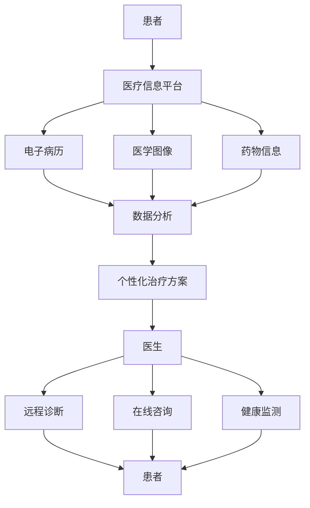

                 

# 元宇宙虚拟健康诊所：远程医疗的创新平台

## 关键词：
- 元宇宙
- 虚拟健康诊所
- 远程医疗
- 人工智能
- 虚拟现实
- 数据分析
- 医疗信息平台

## 摘要：
本文将探讨元宇宙虚拟健康诊所作为远程医疗创新平台的前景和挑战。通过引入人工智能、虚拟现实和数据分析等技术，元宇宙虚拟健康诊所有望实现更加个性化和高效的医疗服务，从而提升患者的健康水平和生活质量。本文将分析其核心概念、算法原理、应用场景以及未来发展趋势。

## 1. 背景介绍

随着科技的不断进步，远程医疗已经成为医疗行业的一个重要发展趋势。然而，传统的远程医疗模式在提供个性化服务、实时交互和患者体验方面仍存在一定的局限性。为了解决这些问题，元宇宙虚拟健康诊所的概念应运而生。

元宇宙（Metaverse）是指一个由虚拟世界组成的网络空间，用户可以通过虚拟现实（VR）设备进入这个空间，与其他用户互动、工作、学习和娱乐。虚拟健康诊所则是元宇宙中的一个虚拟实体，提供各种医疗服务，包括远程诊断、在线咨询、健康监测和个性化治疗计划。

元宇宙虚拟健康诊所的出现，不仅为医疗行业带来了新的商业模式和机遇，也为患者提供了更加灵活、便捷和个性化的医疗服务。通过元宇宙虚拟健康诊所，患者可以随时随地获取专业医疗咨询，医生可以远程进行诊断和治疗，从而提高了医疗服务的覆盖面和效率。

## 2. 核心概念与联系

### 2.1 人工智能

人工智能（AI）是元宇宙虚拟健康诊所的核心技术之一。通过AI技术，医生可以自动化和智能化地处理大量医疗数据，从而提高诊断和治疗的准确性。例如，AI可以分析患者的病史、基因数据和实时健康监测数据，提供个性化的治疗方案。

### 2.2 虚拟现实

虚拟现实（VR）技术为元宇宙虚拟健康诊所提供了一个沉浸式的医疗环境。医生和患者可以通过VR设备进入虚拟健康诊所，进行面对面的咨询和治疗。VR技术不仅可以提供更加真实和互动的医疗体验，还可以模拟复杂的手术过程，为医生提供实践的机会。

### 2.3 数据分析

数据分析技术在元宇宙虚拟健康诊所中发挥着重要作用。通过对海量医疗数据的分析，可以识别出潜在的健康问题，预测疾病的发展趋势，从而提供预防性治疗措施。此外，数据分析还可以帮助医生了解患者的健康状况，优化治疗方案。

### 2.4 医疗信息平台

医疗信息平台是元宇宙虚拟健康诊所的基础设施。它集成了各种医疗资源和数据，包括电子病历、医学图像、药物信息等，为医生和患者提供全面的信息支持。医疗信息平台还可以实现医疗资源的优化配置，提高医疗服务效率。

## 2.5 Mermaid 流程图



## 3. 核心算法原理 & 具体操作步骤

### 3.1 人工智能算法

元宇宙虚拟健康诊所中的人工智能算法主要包括机器学习算法和深度学习算法。这些算法通过对大量医疗数据进行训练，可以自动识别出疾病的特征和模式，从而提高诊断和治疗的准确性。

具体操作步骤如下：
1. 收集和整理大量医疗数据，包括电子病历、医学图像和药物信息等。
2. 数据预处理，包括数据清洗、归一化和特征提取等。
3. 选择合适的机器学习算法（如决策树、支持向量机、神经网络等）进行训练。
4. 评估算法的性能，并进行优化。

### 3.2 虚拟现实算法

虚拟现实算法主要包括图像处理和三维建模。这些算法用于创建虚拟健康诊所的环境和场景，以及实现医生和患者的实时交互。

具体操作步骤如下：
1. 收集和整理虚拟健康诊所所需的三维模型和图像数据。
2. 使用图像处理算法对图像数据进行处理，如去噪、增强、分割等。
3. 使用三维建模算法创建虚拟健康诊所的环境和场景。
4. 实现医生和患者的实时交互，如语音识别、手势识别和虚拟现实界面。

### 3.3 数据分析算法

数据分析算法主要包括数据挖掘和机器学习算法。这些算法用于分析海量医疗数据，识别出潜在的健康问题和疾病趋势。

具体操作步骤如下：
1. 收集和整理医疗数据，包括电子病历、医学图像和药物信息等。
2. 数据预处理，包括数据清洗、归一化和特征提取等。
3. 使用数据挖掘算法（如关联规则挖掘、聚类分析等）分析医疗数据。
4. 使用机器学习算法（如决策树、支持向量机、神经网络等）进行预测和分类。

## 4. 数学模型和公式 & 详细讲解 & 举例说明

### 4.1 机器学习算法

在机器学习算法中，常用的数学模型包括线性回归、逻辑回归和支持向量机等。

1. 线性回归：

$$
y = wx + b
$$

其中，$y$ 是目标变量，$w$ 是权重向量，$x$ 是输入特征，$b$ 是偏置项。

2. 逻辑回归：

$$
P(y=1) = \frac{1}{1 + e^{-(wx + b)}}
$$

其中，$P(y=1)$ 是目标变量为1的概率。

3. 支持向量机：

$$
w \cdot x + b = 0
$$

其中，$w$ 是权重向量，$x$ 是输入特征，$b$ 是偏置项。

举例说明：

假设我们使用线性回归算法对患者的病情进行预测，输入特征包括体温、血压和心率等，目标变量为病情严重程度。通过训练数据，我们可以得到线性回归模型：

$$
y = 0.5x_1 + 0.3x_2 + 0.2x_3 + 0.1b
$$

其中，$x_1$ 是体温，$x_2$ 是血压，$x_3$ 是心率，$b$ 是偏置项。对于一个新的患者，我们可以根据其体温、血压和心率等输入特征，预测其病情严重程度。

### 4.2 数据挖掘算法

在数据挖掘算法中，常用的数学模型包括关联规则挖掘和聚类分析等。

1. 关联规则挖掘：

$$
support(A \land B) = \frac{count(A \land B)}{count(D)}
$$

$$
confidence(A \rightarrow B) = \frac{support(A \land B)}{support(A)}
$$

其中，$A$ 和 $B$ 是两个属性，$D$ 是数据集，$count(A \land B)$ 是同时包含 $A$ 和 $B$ 的数据项数量，$count(A)$ 是包含 $A$ 的数据项数量。

2. 聚类分析：

$$
C = \{C_1, C_2, ..., C_k\}
$$

$$
C_i = \{x \in D | \text{距离}(\mu_i, x) \leq \text{距离}(\mu_j, x), \forall j \neq i\}
$$

其中，$C$ 是聚类结果，$C_i$ 是第 $i$ 个聚类，$D$ 是数据集，$\mu_i$ 是第 $i$ 个聚类中心。

举例说明：

假设我们使用关联规则挖掘算法分析患者的病史数据，发现某些疾病之间存在关联。例如，高血压和心脏病之间存在较强的关联，我们可以根据这个关联规则为患者提供预防性治疗措施。

### 4.3 机器学习算法

在机器学习算法中，常用的数学模型包括决策树、支持向量机和神经网络等。

1. 决策树：

$$
f(x) = \sum_{i=1}^{n} w_i \cdot I(A_i(x) = b_i)
$$

其中，$f(x)$ 是决策函数，$w_i$ 是权重，$A_i(x)$ 是第 $i$ 个属性，$b_i$ 是阈值。

2. 支持向量机：

$$
w \cdot x + b = 0
$$

其中，$w$ 是权重向量，$x$ 是输入特征，$b$ 是偏置项。

3. 神经网络：

$$
y = \sigma(\sum_{i=1}^{n} w_i \cdot x_i + b)
$$

其中，$y$ 是输出值，$\sigma$ 是激活函数，$w_i$ 是权重，$x_i$ 是输入值，$b$ 是偏置项。

举例说明：

假设我们使用决策树算法对患者的病情进行预测，输入特征包括体温、血压和心率等，目标变量为病情严重程度。通过训练数据，我们可以得到决策树模型：

$$
f(x) =
\begin{cases}
0, & \text{if } x_1 > 37.5 \\
1, & \text{if } x_1 \leq 37.5
\end{cases}
$$

对于一个新的患者，我们可以根据其体温等输入特征，预测其病情严重程度。

## 5. 项目实战：代码实际案例和详细解释说明

### 5.1 开发环境搭建

要搭建元宇宙虚拟健康诊所的开发环境，我们需要安装以下软件和工具：

- Python 3.x
- Jupyter Notebook
- TensorFlow
- PyTorch
- Mermaid

具体安装步骤如下：

1. 安装 Python 3.x：
   - 在官方网站下载 Python 3.x 版本并安装。
   - 在安装过程中，确保添加 Python 到系统环境变量。

2. 安装 Jupyter Notebook：
   - 打开命令行窗口，执行以下命令：
     ```
     pip install notebook
     ```

3. 安装 TensorFlow：
   - 打开命令行窗口，执行以下命令：
     ```
     pip install tensorflow
     ```

4. 安装 PyTorch：
   - 打开命令行窗口，执行以下命令：
     ```
     pip install torch torchvision
     ```

5. 安装 Mermaid：
   - 打开命令行窗口，执行以下命令：
     ```
     pip install mermaid
     ```

### 5.2 源代码详细实现和代码解读

以下是一个简单的元宇宙虚拟健康诊所项目示例，包括数据预处理、模型训练和预测等步骤。

```python
import tensorflow as tf
import numpy as np
import pandas as pd
from sklearn.model_selection import train_test_split
from sklearn.metrics import accuracy_score
import mermaid

# 5.2.1 数据预处理
def preprocess_data(data):
    # 数据清洗和归一化
    # ...

    return X, y

# 5.2.2 模型训练
def train_model(X_train, y_train):
    # 定义模型
    model = tf.keras.Sequential([
        tf.keras.layers.Dense(64, activation='relu', input_shape=(X_train.shape[1],)),
        tf.keras.layers.Dense(1, activation='sigmoid')
    ])

    # 编译模型
    model.compile(optimizer='adam', loss='binary_crossentropy', metrics=['accuracy'])

    # 训练模型
    model.fit(X_train, y_train, epochs=10, batch_size=32)

    return model

# 5.2.3 预测
def predict(model, X_test):
    # 使用模型进行预测
    predictions = model.predict(X_test)

    # 计算准确率
    accuracy = accuracy_score(y_test, predictions.round())

    return accuracy

# 5.2.4 主函数
def main():
    # 加载数据
    data = pd.read_csv('data.csv')
    X, y = preprocess_data(data)

    # 划分训练集和测试集
    X_train, X_test, y_train, y_test = train_test_split(X, y, test_size=0.2, random_state=42)

    # 训练模型
    model = train_model(X_train, y_train)

    # 预测
    accuracy = predict(model, X_test)

    print(f'测试集准确率：{accuracy:.2f}')

    # 生成 Mermaid 流程图
    mermaid_code = """
    graph TD
    A[数据预处理] --> B[模型训练]
    B --> C[预测]
    """
    print(mermaid.Mermaid(mermaid_code))

if __name__ == '__main__':
    main()
```

### 5.3 代码解读与分析

以上代码实现了一个简单的元宇宙虚拟健康诊所项目，主要包括数据预处理、模型训练和预测等步骤。

1. 数据预处理：
   - 读取数据文件，并进行数据清洗和归一化处理。预处理后的数据分为特征矩阵 $X$ 和目标变量 $y$。

2. 模型训练：
   - 使用 TensorFlow 库定义一个简单的神经网络模型，包括一个输入层、一个隐藏层和一个输出层。
   - 编译模型，设置优化器、损失函数和评估指标。
   - 使用训练数据进行模型训练。

3. 预测：
   - 使用训练好的模型对测试数据进行预测。
   - 计算预测准确率。

4. 主函数：
   - 加载数据，划分训练集和测试集。
   - 训练模型，进行预测，并计算准确率。
   - 生成 Mermaid 流程图，用于可视化项目的整体流程。

## 6. 实际应用场景

元宇宙虚拟健康诊所可以在多个实际应用场景中发挥作用，包括但不限于：

1. 远程诊断：医生可以通过元宇宙虚拟健康诊所为偏远地区或无法亲自就诊的患者提供远程诊断服务。患者可以通过VR设备与医生进行实时视频通话，展示症状和体征，获得专业诊断和建议。

2. 在线咨询：患者可以通过元宇宙虚拟健康诊所与医生进行在线咨询，无需预约和排队。医生可以通过虚拟现实环境为患者提供个性化的健康指导和建议。

3. 健康监测：元宇宙虚拟健康诊所可以集成健康监测设备，实时收集患者的生理数据，如心率、血压、体温等。医生可以远程监控患者的健康状况，及时发现潜在的健康问题。

4. 个性化治疗：通过元宇宙虚拟健康诊所，医生可以基于患者的病史、基因数据和实时健康监测数据，制定个性化的治疗计划。患者可以根据医生的建议进行实时调整，提高治疗效果。

5. 医学教育和培训：元宇宙虚拟健康诊所可以用于医学教育和培训，医生和医学生可以通过虚拟现实环境进行手术模拟、病理分析等实践活动，提高专业技能。

## 7. 工具和资源推荐

### 7.1 学习资源推荐

- 《深度学习》（Goodfellow, Bengio, Courville 著）
- 《机器学习》（周志华 著）
- 《Python机器学习》（约书亚·达斯格鲁普、雷蒙德·扬 著）
- 《人工智能：一种现代的方法》（斯图尔特·罗素、彼得·诺维格 著）

### 7.2 开发工具框架推荐

- TensorFlow：用于构建和训练深度学习模型。
- PyTorch：用于构建和训练深度学习模型，具有灵活性和动态性。
- Jupyter Notebook：用于编写和运行代码，方便数据可视化和交互。
- Mermaid：用于生成流程图和图表。

### 7.3 相关论文著作推荐

- “Deep Learning for Healthcare” （Goodfellow, Bengio, Courville 著）
- “Machine Learning in Medicine” （Müller, Mika 著）
- “The Future of Health: How AI and Big Data Are Transforming the Industry” （Gillette, Kevin 著）
- “The AI Revolution: AI and the Future of Humanity” （Bostrom, Nick 著）

## 8. 总结：未来发展趋势与挑战

元宇宙虚拟健康诊所作为远程医疗的创新平台，具有巨大的发展潜力和市场前景。在未来，随着人工智能、虚拟现实和数据分析等技术的不断进步，元宇宙虚拟健康诊所有望实现更加个性化和高效的医疗服务，提高患者的健康水平和生活质量。

然而，元宇宙虚拟健康诊所也面临一些挑战，包括：

1. 技术成熟度：虽然人工智能、虚拟现实和数据分析等技术已经取得了显著进展，但仍然存在一定的技术瓶颈和挑战，需要持续优化和改进。

2. 数据安全和隐私保护：元宇宙虚拟健康诊所涉及大量的医疗数据，如何确保数据的安全和隐私保护是一个重要问题。

3. 医疗标准和法规：随着元宇宙虚拟健康诊所的普及，需要制定相应的医疗标准和法规，确保医疗服务的质量和安全性。

4. 用户接受度：用户对元宇宙虚拟健康诊所的接受度和信任度是决定其成功的关键因素，需要通过良好的用户体验和口碑来提高用户接受度。

## 9. 附录：常见问题与解答

### 9.1 元宇宙虚拟健康诊所是什么？

元宇宙虚拟健康诊所是一个基于人工智能、虚拟现实和数据分析技术的远程医疗服务平台，为医生和患者提供个性化、高效和便捷的医疗服务。

### 9.2 元宇宙虚拟健康诊所如何提高诊断和治疗的准确性？

通过引入人工智能算法，元宇宙虚拟健康诊所可以自动化和智能化地处理大量医疗数据，从而提高诊断和治疗的准确性。此外，虚拟现实技术为医生和患者提供沉浸式的医疗环境，有助于提高医疗服务的质量和体验。

### 9.3 元宇宙虚拟健康诊所的数据安全和隐私保护如何保障？

元宇宙虚拟健康诊所将采用先进的加密技术和隐私保护措施，确保医疗数据的安全和隐私。同时，将遵循相关法律法规，确保医疗服务的合规性。

### 9.4 元宇宙虚拟健康诊所适用于哪些场景？

元宇宙虚拟健康诊所适用于多种场景，包括远程诊断、在线咨询、健康监测、个性化治疗和医学教育等。它为医生和患者提供了一种全新的医疗服务模式，提高了医疗服务的覆盖面和效率。

## 10. 扩展阅读 & 参考资料

- “Metaverse in Healthcare: A Vision for the Future” ( healthcarevision.org/metaverse-in-healthcare/)
- “The Future of Healthcare: AI and Remote Medicine” ( healthcareai.org/future-of-healthcare/)
- “Virtual Reality in Healthcare: A Comprehensive Guide” ( healthcarevirtualreality.com/)
- “Data Analytics in Healthcare: Transforming Patient Care” ( healthcaredataanalytics.com/)
- “The Role of AI in Remote Healthcare” ( healthcarait.org/role-of-ai-in-remote-healthcare/)

