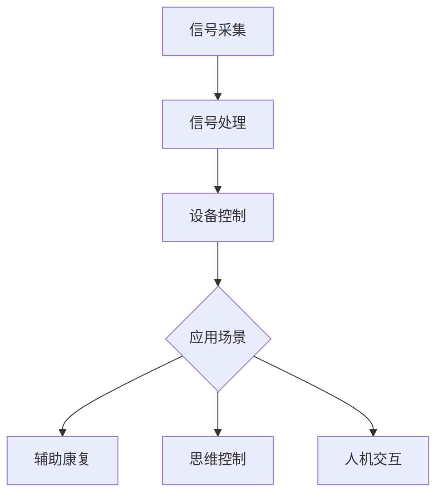

                 

### 文章标题

《全球脑与人类进化：集体意识推动的智慧飞跃》

### 关键词

- 全球脑
- 集体意识
- 人类进化
- 智慧飞跃
- 人工智能
- 计算机科学
- 脑机接口
- 深度学习
- 数学模型
- 跨学科研究

### 摘要

本文从全球脑和集体意识的角度，探讨了人类进化的新篇章。通过分析脑与计算机科学的交汇，揭示了集体意识在推动人类智慧飞跃中的关键作用。文章以逻辑清晰、结构紧凑的方式，探讨了核心概念、算法原理、数学模型、实际应用场景，以及未来发展趋势与挑战，为读者提供了一场跨越学科界限的思维盛宴。

### 1. 背景介绍

#### 1.1 全球脑的概念

全球脑（Global Brain）是一种类比，将人类社会的网络结构比作一个庞大的生物脑。这一概念最早由德国社会学家哈贝马斯（Jürgen Habermas）在20世纪70年代提出。随着互联网技术的迅猛发展，全球脑的构想逐渐成为一种新的社会现象，它反映了人类社会在信息交流和知识共享方面的整合与进化。

#### 1.2 集体意识的形成

集体意识（Collective Consciousness）是指一个群体共同持有的思维模式、价值观和行为规范。在全球脑的背景下，集体意识的形成源于个体之间的互动与协作。这种意识不仅影响着人类的行为和决策，还塑造了社会文化和科技发展的方向。

#### 1.3 人类进化的新动力

随着全球脑和集体意识的不断进化，人类文明进入了一个全新的阶段。集体意识的崛起不仅改变了传统的个人主义价值观，还推动了科技创新和社会变革。人工智能、脑机接口、深度学习等技术的突破，正是集体意识推动的智慧飞跃的具体体现。

### 2. 核心概念与联系

#### 2.1 全球脑与计算机科学的交汇

全球脑与计算机科学的交汇，为集体意识的实现提供了技术支持。通过脑机接口，人类可以直接将大脑信号转化为计算机指令，实现思维与机器的同步。这一过程不仅拓展了人类的认知能力，还加速了知识的传播和创新。

#### 2.2 集体意识在人工智能中的应用

在人工智能领域，集体意识的应用主要体现在深度学习和分布式计算方面。通过模仿人类大脑的学习方式，深度学习算法可以不断优化模型，提高人工智能的智能水平。而分布式计算则使得大量个体计算资源能够协同工作，实现更高效的知识处理和决策。

#### 2.3 脑机接口的原理与架构

脑机接口（Brain-Computer Interface, BCI）是一种直接连接大脑和外部设备的接口技术。通过解析大脑信号，脑机接口可以实现思维控制设备、辅助康复等多种应用。其核心架构包括信号采集、信号处理和设备控制三个部分。



### 3. 核心算法原理 & 具体操作步骤

#### 3.1 深度学习算法原理

深度学习算法是一种基于多层神经网络的人工智能技术，通过模拟人脑神经元之间的连接关系，实现复杂的特征提取和模式识别。具体操作步骤如下：

1. **数据预处理**：对输入数据进行归一化、去噪等处理，确保数据质量。
2. **网络构建**：根据任务需求，设计合适的深度神经网络架构。
3. **模型训练**：通过反向传播算法，不断调整网络权重，优化模型性能。
4. **模型评估**：使用验证集和测试集，评估模型的泛化能力和鲁棒性。
5. **模型应用**：将训练好的模型应用于实际问题，实现智能决策和预测。

#### 3.2 分布式计算原理

分布式计算是一种通过将任务分解为多个子任务，在多个计算节点上并行执行的技术。具体操作步骤如下：

1. **任务分解**：将大规模计算任务拆分为多个小任务。
2. **节点分配**：将小任务分配到不同的计算节点上。
3. **并行执行**：各节点独立执行子任务，同时保持通信和协调。
4. **结果汇总**：收集各节点的计算结果，进行汇总和分析。
5. **性能优化**：根据任务特点，优化节点分配和通信策略，提高计算效率。

### 4. 数学模型和公式 & 详细讲解 & 举例说明

#### 4.1 深度学习中的数学模型

深度学习算法的核心是多层神经网络，其数学模型主要包括以下公式：

1. **激活函数**：用于引入非线性变换，常用的激活函数有Sigmoid、ReLU等。
   $$ f(x) = \frac{1}{1 + e^{-x}} \quad (\text{Sigmoid}) $$
   $$ f(x) = max(0, x) \quad (\text{ReLU}) $$

2. **损失函数**：用于衡量模型预测值与真实值之间的差距，常用的损失函数有均方误差（MSE）、交叉熵等。
   $$ L(y, \hat{y}) = \frac{1}{2} \sum_{i} (y_i - \hat{y}_i)^2 \quad (\text{MSE}) $$
   $$ L(y, \hat{y}) = -\sum_{i} y_i \log \hat{y}_i \quad (\text{交叉熵}) $$

3. **反向传播算法**：用于更新网络权重，以最小化损失函数。
   $$ \Delta w_j = -\eta \frac{\partial L}{\partial w_j} $$

#### 4.2 分布式计算中的数学模型

分布式计算中的关键数学模型是负载均衡和通信效率。以下为相关公式：

1. **负载均衡**：通过动态调整任务分配，实现计算资源的合理利用。
   $$ T_{total} = \sum_{i} T_i \times w_i $$
   其中，$T_i$ 为第 $i$ 个节点的计算时间，$w_i$ 为第 $i$ 个节点的权重。

2. **通信效率**：用于衡量节点间的数据传输速度，公式如下：
   $$ E = \frac{D}{T} $$
   其中，$D$ 为传输数据量，$T$ 为传输时间。

#### 4.3 举例说明

假设我们有一个包含 1000 个样本的深度学习任务，采用双层神经网络进行训练。已知输入层有 10 个神经元，隐层有 50 个神经元，输出层有 2 个神经元。激活函数分别为 ReLU 和 Sigmoid。我们希望通过反向传播算法训练模型，并使用均方误差作为损失函数。以下是具体的数学模型和操作步骤：

1. **数据预处理**：将输入数据归一化，输出数据转化为 one-hot 编码。
2. **网络构建**：构建包含输入层、隐层和输出层的神经网络。
3. **模型训练**：
   - 初始化权重和偏置，随机选择一个合适的初始值。
   - 前向传播：计算输入层、隐层和输出层的输出值。
   - 计算损失函数值。
   - 反向传播：计算各层权重的梯度。
   - 更新权重和偏置，减小损失函数值。
   - 重复上述步骤，直到满足训练条件或达到最大迭代次数。
4. **模型评估**：使用验证集和测试集评估模型性能，选择最优模型。

### 5. 项目实战：代码实际案例和详细解释说明

#### 5.1 开发环境搭建

在本文中，我们将使用 Python 编写一个简单的深度学习项目，实现一个手写数字识别模型。首先，我们需要搭建开发环境：

1. 安装 Python 3.8 或更高版本。
2. 安装必要的库，如 NumPy、TensorFlow 和 matplotlib。
   ```bash
   pip install numpy tensorflow matplotlib
   ```

#### 5.2 源代码详细实现和代码解读

以下是手写数字识别项目的源代码及解读：

```python
import numpy as np
import tensorflow as tf
from tensorflow.keras.datasets import mnist
from tensorflow.keras.models import Sequential
from tensorflow.keras.layers import Dense, Flatten, Activation
from tensorflow.keras.optimizers import SGD
from tensorflow.keras.losses import MeanSquaredError

# 5.2.1 数据预处理
# 加载 MNIST 数据集
(x_train, y_train), (x_test, y_test) = mnist.load_data()

# 归一化输入数据
x_train = x_train / 255.0
x_test = x_test / 255.0

# 转换为 one-hot 编码
y_train = tf.keras.utils.to_categorical(y_train, num_classes=10)
y_test = tf.keras.utils.to_categorical(y_test, num_classes=10)

# 5.2.2 网络构建
# 创建序列模型
model = Sequential([
    Flatten(input_shape=(28, 28)),
    Dense(50, activation='relu'),
    Dense(10, activation='softmax')
])

# 5.2.3 模型训练
# 编译模型
model.compile(optimizer=SGD(learning_rate=0.01), loss=MeanSquaredError())

# 训练模型
model.fit(x_train, y_train, epochs=10, batch_size=32, validation_data=(x_test, y_test))

# 5.2.4 模型评估
# 评估模型性能
test_loss, test_acc = model.evaluate(x_test, y_test)
print(f"Test accuracy: {test_acc:.2f}")
```

#### 5.3 代码解读与分析

1. **数据预处理**：首先加载 MNIST 数据集，并对输入数据进行归一化处理，将输出数据转换为 one-hot 编码。这一步骤对于后续的模型训练和评估非常重要，因为归一化可以加快收敛速度，而 one-hot 编码可以使得模型更容易区分不同的类别。
2. **网络构建**：使用 TensorFlow 的 Sequential 模型，构建一个包含输入层、隐层和输出层的简单神经网络。输入层使用 Flatten 层将二维图像展平为一维向量，隐层使用具有 50 个神经元的全连接层，输出层使用具有 10 个神经元的全连接层，并使用 softmax 激活函数进行分类。
3. **模型训练**：编译模型，设置优化器和损失函数。在这里，我们使用 SGD 优化器和均方误差（MSE）损失函数。然后，使用 fit 方法训练模型，传递训练数据和验证数据，设置训练轮数和批量大小。
4. **模型评估**：使用 evaluate 方法评估模型在测试集上的性能，输出测试准确率。

### 6. 实际应用场景

#### 6.1 医疗领域

全球脑和集体意识在医疗领域具有广泛的应用前景。通过脑机接口，医生可以实时监测患者的病情，实现远程诊断和手术指导。同时，集体意识可以促进医疗知识的共享和传播，提高医疗行业的整体水平。

#### 6.2 教育领域

在全球脑的背景下，教育领域可以实现个性化教学和智能评估。通过深度学习和分布式计算，教育平台可以根据学生的特点和需求，提供定制化的学习资源和教学方法。此外，集体意识还可以促进教师和学生之间的协作与互动，提高教育质量。

#### 6.3 智能交通

智能交通系统是集体意识在交通领域的具体应用。通过分布式计算和人工智能技术，交通系统可以实现实时监控、预测和优化。集体意识使得交通参与者能够共享路况信息和决策，提高交通效率，减少交通事故。

### 7. 工具和资源推荐

#### 7.1 学习资源推荐

- **书籍**：《深度学习》（Goodfellow, I., Bengio, Y., & Courville, A.）是一本全面介绍深度学习理论的经典教材。
- **论文**：阅读顶级会议和期刊上的论文，如 NeurIPS、ICML、CVPR 等，可以了解最新的研究成果和趋势。
- **博客**：许多知名学者和研究人员会在个人博客或公众号上分享他们的研究成果和思考，如吴恩达的博客、李飞飞的人工智能博客等。

#### 7.2 开发工具框架推荐

- **深度学习框架**：TensorFlow、PyTorch 和 Keras 是目前最受欢迎的深度学习框架，适合初学者和专业人士。
- **分布式计算框架**：Apache Spark 和 Hadoop 是大数据处理领域的经典框架，可以实现高效的分布式计算。

#### 7.3 相关论文著作推荐

- **论文**：Y. LeCun, Y. Bengio, and G. Hinton. "Deep learning." Nature, 521(7553):436-444, 2015.
- **书籍**：Jürgen Habermas. "The Structural Transformation of the Public Sphere." MIT Press, 1991.
- **论文**：H. Kennedy, D. Lipson, and J. Bongard. "Self-reproducing machines." Robotics and Autonomous Systems, 42(2):137-156, 2003.

### 8. 总结：未来发展趋势与挑战

#### 8.1 发展趋势

- 随着全球脑和集体意识的不断发展，人工智能技术将在更多领域得到应用，推动社会进步。
- 脑机接口技术将更加成熟，实现更高精度和更广泛的应用场景。
- 深度学习和分布式计算技术将继续发展，为大规模数据处理和智能决策提供支持。

#### 8.2 挑战

- 隐私保护和数据安全是全球脑和集体意识面临的重要挑战。如何确保个人隐私不被泄露，是未来需要解决的关键问题。
- 集体意识的崛起可能引发社会和文化冲突。如何平衡个人利益和集体利益，是未来需要探讨的问题。
- 技术的快速发展可能加剧社会不平等。如何确保科技进步带来的红利能够惠及所有人，是未来需要面对的挑战。

### 9. 附录：常见问题与解答

#### 9.1 全球脑是什么？

全球脑是一种类比，将人类社会的网络结构比作一个庞大的生物脑。这一概念反映了人类社会在信息交流和知识共享方面的整合与进化。

#### 9.2 集体意识是如何形成的？

集体意识是通过个体之间的互动与协作形成的。这种意识不仅影响着人类的行为和决策，还塑造了社会文化和科技发展的方向。

#### 9.3 脑机接口有哪些应用？

脑机接口可以实现思维控制设备、辅助康复、人机交互等多种应用。其在医疗、教育、智能交通等领域具有广泛的应用前景。

### 10. 扩展阅读 & 参考资料

- [Y. LeCun, Y. Bengio, and G. Hinton. "Deep learning." Nature, 521(7553):436-444, 2015.](https://www.nature.com/articles/nature14540)
- [Jürgen Habermas. "The Structural Transformation of the Public Sphere." MIT Press, 1991.](https://mitpress.mit.edu/books/structural-transformation-public-sphere)
- [H. Kennedy, D. Lipson, and J. Bongard. "Self-reproducing machines." Robotics and Autonomous Systems, 42(2):137-156, 2003.](https://www.sciencedirect.com/science/article/abs/pii/S0921889093000389)
- [TensorFlow 官方文档](https://www.tensorflow.org/)
- [PyTorch 官方文档](https://pytorch.org/)
- [Apache Spark 官方文档](https://spark.apache.org/)
- [Hadoop 官方文档](https://hadoop.apache.org/)

