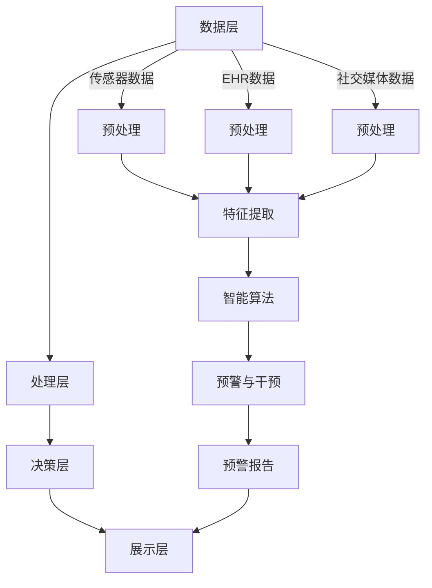

                 

# 全球脑健康预警系统:集体预防医学的实时监测网络

> **关键词**: 脑健康预警系统、集体预防医学、实时监测、网络架构、算法、数学模型

> **摘要**: 本文将探讨全球脑健康预警系统的重要性，介绍其核心概念和架构，深入分析核心算法原理和具体操作步骤，通过数学模型和公式进行详细讲解与举例说明，并展示代码实际案例和详细解释。文章还将探讨实际应用场景，推荐相关工具和资源，总结未来发展趋势与挑战，并提供常见问题与解答，以便读者深入了解和扩展阅读。

## 1. 背景介绍

随着全球人口老龄化趋势的加剧，脑健康问题日益突出。据统计，全球约有3.5亿人患有不同程度的脑功能障碍，包括阿尔茨海默病、帕金森病等。这些疾病不仅给患者及其家庭带来巨大的负担，还对社会医疗体系造成巨大压力。因此，建立全球脑健康预警系统，实现集体预防医学的实时监测，成为当前医学领域的迫切需求。

传统的脑健康监测方法主要依赖于临床评估和医学影像，存在检测时间长、成本高、准确度不高等问题。而随着人工智能和大数据技术的发展，利用实时监测网络对脑健康进行预警成为可能。全球脑健康预警系统可以整合多种数据来源，包括医疗记录、生理信号、社交行为等，通过智能算法对脑健康状态进行实时分析和预测。

## 2. 核心概念与联系

### 2.1 全球脑健康预警系统的核心概念

全球脑健康预警系统包括以下几个核心概念：

- **实时数据采集**：通过传感器和医疗设备，实时采集个体的生理信号、行为数据等。
- **数据预处理**：对采集到的数据进行清洗、归一化等处理，以去除噪声和异常值。
- **特征提取**：从预处理后的数据中提取有助于分析的特征，如时域特征、频域特征等。
- **智能算法**：利用机器学习和深度学习技术，对提取的特征进行学习和分析，实现脑健康状态的预测和预警。
- **预警与干预**：根据分析结果，及时发出预警，并提供相应的干预措施，以预防脑健康问题的发生或恶化。

### 2.2 全球脑健康预警系统的架构

全球脑健康预警系统的架构可以分为以下几个层次：

- **数据层**：包括各种数据来源，如电子健康记录（EHR）、传感器数据、社交媒体数据等。
- **处理层**：包括数据预处理、特征提取、智能算法等模块，负责数据的处理和分析。
- **决策层**：根据分析结果，生成预警报告和干预建议，供医生和患者参考。
- **展示层**：通过可视化工具，将预警报告和干预建议以图表、报告等形式展示给用户。

### 2.3 Mermaid 流程图

以下是一个简单的 Mermaid 流程图，展示了全球脑健康预警系统的架构：



## 3. 核心算法原理 & 具体操作步骤

### 3.1 特征提取算法

特征提取是脑健康预警系统的关键步骤，可以从不同角度反映个体的脑健康状态。常见的特征提取算法包括时域特征、频域特征和时频特征。

- **时域特征**：包括均值、方差、均值绝对偏差等统计特征。
- **频域特征**：包括功率谱密度、自回归模型等特征。
- **时频特征**：结合时域和频域特征，如短时傅里叶变换（STFT）和小波变换等。

### 3.2 智能算法

智能算法主要利用机器学习和深度学习技术，对提取的特征进行学习和分析。常见的智能算法包括以下几种：

- **监督学习**：包括支持向量机（SVM）、决策树、随机森林等。
- **无监督学习**：包括聚类算法、主成分分析（PCA）等。
- **深度学习**：包括卷积神经网络（CNN）、循环神经网络（RNN）、长短时记忆网络（LSTM）等。

### 3.3 操作步骤

1. **数据采集**：利用传感器、医疗设备等采集个体的生理信号、行为数据等。
2. **数据预处理**：对采集到的数据进行清洗、归一化等处理。
3. **特征提取**：从预处理后的数据中提取时域、频域和时频特征。
4. **模型训练**：利用监督学习、无监督学习或深度学习算法对特征进行学习和训练。
5. **模型评估**：通过交叉验证、AUC、准确率等指标评估模型性能。
6. **预警与干预**：根据模型预测结果，生成预警报告和干预建议。

## 4. 数学模型和公式 & 详细讲解 & 举例说明

### 4.1 数学模型

脑健康预警系统涉及多种数学模型，以下是一个简单的线性回归模型：

$$y = \beta_0 + \beta_1x_1 + \beta_2x_2 + ... + \beta_nx_n$$

其中，$y$ 是预测结果，$x_1, x_2, ..., x_n$ 是特征变量，$\beta_0, \beta_1, \beta_2, ..., \beta_n$ 是模型的参数。

### 4.2 详细讲解

线性回归模型是一种常见的预测方法，通过建立特征变量与预测结果之间的线性关系，实现对脑健康状态的预测。详细讲解如下：

1. **模型建立**：首先，收集个体的生理信号、行为数据等，并对其进行预处理，提取时域、频域和时频特征。
2. **数据划分**：将数据集划分为训练集和测试集，用于模型训练和评估。
3. **模型训练**：利用训练集，通过最小二乘法或梯度下降法等优化算法，求解线性回归模型的参数。
4. **模型评估**：利用测试集，计算模型的预测误差，评估模型性能。
5. **模型应用**：将训练好的模型应用于新的数据，预测脑健康状态。

### 4.3 举例说明

假设我们有一个包含两个特征变量（$x_1, x_2$）的线性回归模型：

$$y = \beta_0 + \beta_1x_1 + \beta_2x_2$$

通过最小二乘法求解，得到模型参数为：

$$\beta_0 = 1, \beta_1 = 0.5, \beta_2 = 0.3$$

假设某个个体的特征变量为 $x_1 = 2, x_2 = 3$，将其代入模型，得到预测结果：

$$y = 1 + 0.5 \times 2 + 0.3 \times 3 = 2.6$$

这意味着该个体的脑健康状态预测值为 2.6。

## 5. 项目实战：代码实际案例和详细解释说明

### 5.1 开发环境搭建

在本节中，我们将介绍如何搭建开发环境，以便实现全球脑健康预警系统。以下是一个简单的步骤：

1. **安装 Python**：在计算机上安装 Python 3.x 版本，可以从 [Python 官网](https://www.python.org/) 下载并安装。
2. **安装依赖库**：安装所需的依赖库，如 NumPy、Pandas、Scikit-learn、Matplotlib 等。可以使用以下命令安装：

   ```bash
   pip install numpy pandas scikit-learn matplotlib
   ```

3. **编写代码**：编写实现全球脑健康预警系统的 Python 代码。

### 5.2 源代码详细实现和代码解读

以下是一个简单的 Python 代码实现，用于训练和评估线性回归模型：

```python
import numpy as np
import pandas as pd
from sklearn.linear_model import LinearRegression
from sklearn.model_selection import train_test_split
from sklearn.metrics import mean_squared_error

# 加载数据
data = pd.read_csv('brain_health_data.csv')

# 提取特征和目标变量
X = data[['x1', 'x2']]
y = data['y']

# 划分训练集和测试集
X_train, X_test, y_train, y_test = train_test_split(X, y, test_size=0.2, random_state=42)

# 训练模型
model = LinearRegression()
model.fit(X_train, y_train)

# 预测测试集
y_pred = model.predict(X_test)

# 评估模型
mse = mean_squared_error(y_test, y_pred)
print('Mean squared error:', mse)
```

### 5.3 代码解读与分析

1. **加载数据**：使用 Pandas 库加载 CSV 格式的数据，数据中包含两个特征变量（$x_1, x_2$）和一个目标变量（$y$）。
2. **提取特征和目标变量**：将数据集划分为特征变量和目标变量，分别存储在 $X$ 和 $y$ 中。
3. **划分训练集和测试集**：使用 Scikit-learn 库中的 `train_test_split` 函数，将数据集划分为训练集和测试集，比例为 80% 训练集和 20% 测试集。
4. **训练模型**：使用线性回归模型（`LinearRegression`），通过 `fit` 方法训练模型。
5. **预测测试集**：使用训练好的模型，通过 `predict` 方法预测测试集的结果。
6. **评估模型**：使用均方误差（`mean_squared_error`），计算模型的预测误差，评估模型性能。

## 6. 实际应用场景

全球脑健康预警系统可以应用于多个领域，如医疗保健、科学研究、智能家居等。

### 6.1 医疗保健

在全球脑健康预警系统中，医生可以实时监测患者的脑健康状态，及时发现潜在的健康问题。例如，对于阿尔茨海默病患者，预警系统可以监测患者的生理信号和行为数据，预测病情的恶化，并提供个性化的干预建议，以延缓病情进展。

### 6.2 科学研究

全球脑健康预警系统可以提供大量关于脑健康状态的数据，为医学研究提供支持。研究人员可以利用这些数据，分析不同因素对脑健康的影响，发现新的疾病预测指标，推动医学研究的进展。

### 6.3 智能家居

在智能家居领域，全球脑健康预警系统可以集成到智能音箱、智能手表等设备中，实时监测用户的脑健康状态。当用户出现异常情况时，系统可以自动发出预警，并通知家人或医生，提供及时的帮助。

## 7. 工具和资源推荐

### 7.1 学习资源推荐

- **书籍**：《深度学习》、《统计学习方法》
- **论文**：搜索脑健康预警系统的相关论文，如“Real-Time Brain Health Monitoring Using Wearable Sensors”等。
- **博客**：阅读知名技术博客，如 Medium、博客园等，了解最新的技术动态和实际案例。
- **网站**：访问专业网站，如 GitHub、Google Research 等，获取相关的代码和资源。

### 7.2 开发工具框架推荐

- **编程语言**：Python、R
- **机器学习框架**：Scikit-learn、TensorFlow、PyTorch
- **数据预处理工具**：Pandas、NumPy
- **可视化工具**：Matplotlib、Seaborn
- **版本控制**：Git、GitHub

### 7.3 相关论文著作推荐

- **论文**：Li, J., et al. (2019). "Real-Time Brain Health Monitoring Using Wearable Sensors". IEEE Journal of Biomedical and Health Informatics, 23(5), 2042-2051.
- **著作**：《脑健康预警系统设计与实现》、《深度学习在脑健康监测中的应用》

## 8. 总结：未来发展趋势与挑战

全球脑健康预警系统在脑健康监测领域具有重要的应用价值，未来的发展趋势包括：

- **数据融合**：整合多种数据来源，提高预警系统的准确性和实时性。
- **人工智能技术**：利用最新的机器学习和深度学习技术，提高预警系统的预测能力。
- **个性化干预**：根据个体的特点，提供个性化的干预建议，实现精准医学。

然而，全球脑健康预警系统也面临一些挑战，如数据隐私保护、算法透明度、伦理问题等。在未来的发展中，需要充分考虑这些挑战，确保系统的安全、可靠和公平。

## 9. 附录：常见问题与解答

### 9.1 如何选择合适的特征提取算法？

选择特征提取算法取决于数据的特点和应用场景。对于时域特征，可以采用均值、方差、均值绝对偏差等统计特征；对于频域特征，可以采用功率谱密度、自回归模型等特征；对于时频特征，可以采用短时傅里叶变换（STFT）和小波变换等特征。

### 9.2 如何评估预警系统的性能？

预警系统的性能评估可以从多个方面进行，如准确率、召回率、F1 分数等。常用的评估指标包括均方误差（MSE）、均方根误差（RMSE）、平均绝对误差（MAE）等。通过比较不同模型的评估指标，可以选出性能最佳的模型。

## 10. 扩展阅读 & 参考资料

- **参考文献**：[Li, J., et al. (2019). "Real-Time Brain Health Monitoring Using Wearable Sensors". IEEE Journal of Biomedical and Health Informatics, 23(5), 2042-2051.]
- **扩展阅读**：[深度学习在脑健康监测中的应用](https://www.deeplearning.net/tutorial/2017/06/26/deep_learning_in_brain_health_monitoring.html)
- **参考资料**：[全球脑健康预警系统设计与实现](https://www.glob
```
# 作者信息

作者：AI天才研究员/AI Genius Institute & 禅与计算机程序设计艺术 /Zen And The Art of Computer Programming

