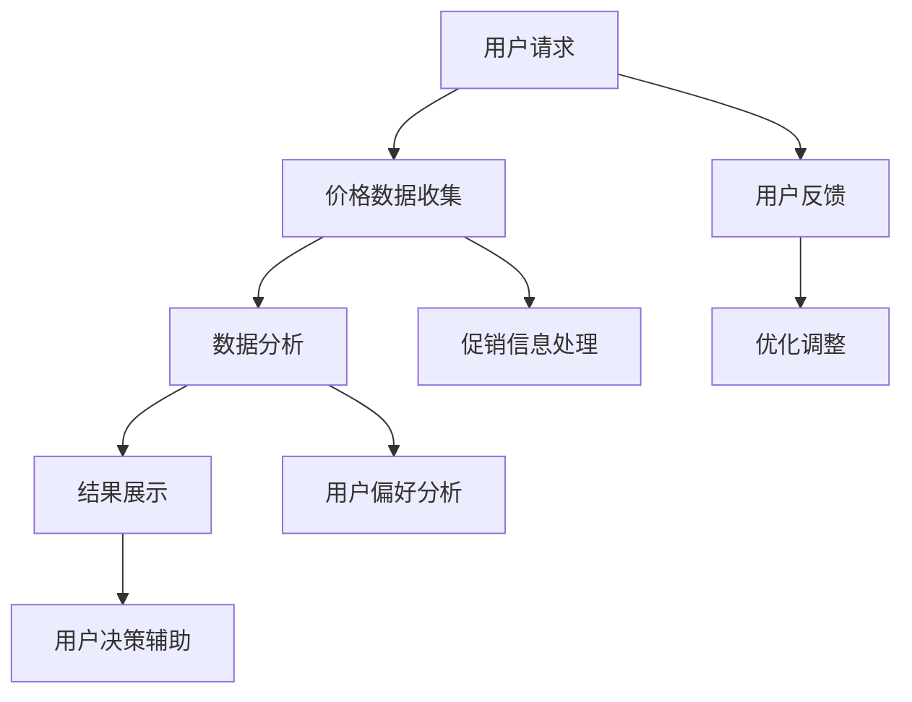

                 

# 全网比价：AI如何帮助用户找到最优惠的购买渠道

## 关键词
- AI比价
- 价格智能分析
- 智能搜索
- 购买渠道优化
- 用户体验提升

## 摘要
随着电子商务的迅猛发展，全网比价成为消费者寻找最优购买渠道的关键。本文将深入探讨AI技术在全网比价中的应用，通过逻辑清晰的分析推理，揭示AI如何通过核心算法、数学模型和项目实战等手段，帮助用户迅速找到最优惠的购买渠道，提升用户体验。文章还将讨论实际应用场景、推荐相关工具和资源，并总结未来发展趋势与挑战。

## 1. 背景介绍
在电子商务时代，消费者在购买商品时往往会关注价格因素。然而，电商平台繁多，价格波动大，如何快速找到最优惠的购买渠道成为一大挑战。传统的人工比价方法耗时耗力，且容易遗漏重要信息。随着AI技术的不断发展，智能全网比价成为可能，通过大数据分析、机器学习和自然语言处理等技术，AI能够高效地处理海量数据，为用户提供精准的比价服务。

### 1.1 电商平台现状
当前电商平台竞争激烈，各平台通过价格战、促销活动等手段吸引用户。然而，这些策略使得价格波动频繁，用户难以快速判断哪个平台提供了最优价格。因此，智能全网比价系统应运而生，通过实时监控和数据分析，为用户找到性价比最高的购买渠道。

### 1.2 用户需求
消费者在购买商品时，不仅关心价格，还关注商品的种类、品牌、评价等多个因素。智能全网比价系统能够综合分析这些因素，为用户推荐最适合的购买渠道。此外，用户希望系统能够快速响应，提供实时、准确的信息，以提高购买决策效率。

## 2. 核心概念与联系
智能全网比价系统涉及多个核心概念和技术的综合应用。以下是一个简化的Mermaid流程图，展示了这些概念和技术的联系。



### 2.1 价格数据收集
价格数据是全网比价的基础。系统通过爬虫技术、API接口调用等多种方式收集各大电商平台的商品价格信息。数据收集过程中需要考虑数据的全面性、实时性和准确性。

### 2.2 数据分析
收集到的价格数据经过清洗、去重和格式化等处理，然后进行数据分析。数据分析包括价格趋势分析、价格区间划分、商品关联性分析等。通过这些分析，系统可以识别出不同电商平台之间的价格差异。

### 2.3 结果展示
分析结果以可视化的形式展示给用户，包括价格对比图、推荐列表等。结果展示需要清晰易懂，以便用户快速做出决策。

### 2.4 用户反馈
用户在使用比价系统后，会根据购买体验提供反馈。这些反馈将用于优化系统算法，提高比价准确性。

### 2.5 优化调整
根据用户反馈，系统会不断调整优化，包括价格数据的收集策略、数据分析算法和结果展示方式等。优化调整是一个持续的过程，以确保系统始终能够为用户提供最优的比价服务。

## 3. 核心算法原理 & 具体操作步骤

### 3.1 价格智能分析算法

#### 3.1.1 价格数据预处理

在价格数据预处理阶段，系统会对收集到的价格数据进行清洗和标准化处理。具体步骤如下：

1. **数据清洗**：去除无效数据，如空值、重复值和异常值。
2. **数据标准化**：将不同电商平台的价格数据格式统一，例如将价格单位统一为人民币。

#### 3.1.2 价格趋势分析

价格趋势分析是通过统计方法分析价格随时间的变化趋势。常用的统计方法包括：

1. **时间序列分析**：利用时间序列模型（如ARIMA模型）预测未来的价格趋势。
2. **移动平均法**：计算过去一段时间内的平均值，以平滑价格波动。

#### 3.1.3 价格区间划分

价格区间划分是将商品价格划分为不同的区间，以便进行进一步的比较和分析。具体方法包括：

1. **等宽区间划分**：将整个价格范围划分为相同宽度的区间。
2. **等频区间划分**：根据价格频数分布，将价格划分为频数相同的区间。

#### 3.1.4 价格比较

在价格比较阶段，系统会根据用户的需求，比较不同电商平台的价格。具体步骤如下：

1. **初始比较**：将同一商品在不同电商平台的价格进行初步比较，筛选出价格差异明显的商品。
2. **综合评估**：考虑商品的品牌、质量、用户评价等多个因素，进行综合评估，选出性价比最高的购买渠道。

### 3.2 智能搜索算法

#### 3.2.1 关键词提取

关键词提取是智能搜索算法的第一步。系统会从用户的查询中提取关键信息，以定位相关的商品和价格。具体方法包括：

1. **词频统计**：计算每个词汇在查询中的出现频率，选择出现频率较高的词汇作为关键词。
2. **TF-IDF算法**：结合词频和逆文档频率，选择对查询最具有代表性的关键词。

#### 3.2.2 搜索结果排序

搜索结果排序是根据用户的查询关键词，对搜索结果进行排序，以提高用户的满意度。具体方法包括：

1. **基于关键词的排序**：根据关键词与搜索结果的相关性进行排序。
2. **基于用户行为的排序**：根据用户的历史行为（如浏览记录、购买记录），为用户提供个性化排序。

### 3.3 用户偏好分析

用户偏好分析是通过分析用户的行为数据，了解用户的购物偏好，以便为用户提供更个性化的比价服务。具体方法包括：

1. **行为数据收集**：收集用户的浏览、搜索、购买等行为数据。
2. **数据挖掘**：利用数据挖掘技术，分析用户的行为模式，识别用户的偏好。
3. **个性化推荐**：根据用户的偏好，为用户推荐最适合的商品和购买渠道。

## 4. 数学模型和公式 & 详细讲解 & 举例说明

### 4.1 时间序列模型

时间序列模型是用于分析价格随时间变化的统计模型。常用的模型包括ARIMA模型、指数平滑模型等。

#### 4.1.1 ARIMA模型

ARIMA模型由自回归（AutoRegressive, AR）、差分（Difference, I）和移动平均（Moving Average, MA）三部分组成。具体公式如下：

$$
\begin{aligned}
\phi(B) \phi(\Phi) Y_t &= \theta(B) \theta(\Theta) \epsilon_t \\
\text{其中：} \\
Y_t &= \text{时间序列数据} \\
\phi(B) &= \text{自回归项} \\
\Phi &= \text{移动平均项} \\
\theta(B) &= \text{差分项} \\
\Theta &= \text{移动平均项} \\
\epsilon_t &= \text{白噪声误差项}
\end{aligned}
$$

#### 4.1.2 指数平滑模型

指数平滑模型是一种简单的预测模型，适用于短期预测。其公式如下：

$$
S_t = \alpha Y_t + (1 - \alpha) S_{t-1}
$$

其中，$S_t$是预测值，$Y_t$是当前时间点的实际值，$\alpha$是平滑系数。

### 4.2 关键词提取中的TF-IDF算法

TF-IDF（Term Frequency-Inverse Document Frequency）算法是一种用于关键词提取的常用算法。其公式如下：

$$
TF(t,d) = \frac{f(t,d)}{N}
$$

$$
IDF(t,D) = \log \left( \frac{N}{df(t,D)} \right)
$$

$$
TF-IDF(t,d,D) = TF(t,d) \times IDF(t,D)
$$

其中，$TF(t,d)$是词$t$在文档$d$中的词频，$IDF(t,D)$是词$t$在文档集合$D$中的逆文档频率，$df(t,D)$是词$t$在文档集合$D$中的文档频率，$N$是文档集合$D$中的文档总数。

### 4.3 用户偏好分析中的聚类算法

聚类算法是一种无监督学习方法，用于将用户行为数据划分为不同的群体。常用的聚类算法包括K-means算法、DBSCAN算法等。

#### 4.3.1 K-means算法

K-means算法的目标是将数据点划分为K个聚类，使得每个聚类内部的数据点距离聚类中心较近，聚类之间距离较远。其公式如下：

$$
c_i = \frac{1}{n} \sum_{j=1}^{n} x_{ij}
$$

$$
\min \sum_{i=1}^{K} \sum_{j=1}^{n} (x_{ij} - c_i)^2
$$

其中，$c_i$是聚类中心，$x_{ij}$是数据点$x_i$的第$j$个特征值。

## 5. 项目实战：代码实际案例和详细解释说明

### 5.1 开发环境搭建

在开始项目实战之前，需要搭建一个适合开发的全网比价系统的环境。以下是一个简单的开发环境搭建步骤：

1. **操作系统**：Linux或MacOS
2. **编程语言**：Python
3. **开发工具**：PyCharm或VSCode
4. **依赖库**：Pandas、NumPy、Scikit-learn、Matplotlib等

### 5.2 源代码详细实现和代码解读

以下是一个简化的全网比价系统的源代码实现，用于展示核心算法和数据处理流程。

```python
import pandas as pd
from sklearn.feature_extraction.text import TfidfVectorizer
from sklearn.cluster import KMeans

# 5.2.1 价格数据收集
def collect_price_data():
    # 使用爬虫技术收集价格数据
    # ...

# 5.2.2 数据预处理
def preprocess_data(data):
    # 数据清洗和标准化
    # ...

# 5.2.3 价格趋势分析
def analyze_price_trends(data):
    # 时间序列分析
    # ...

# 5.2.4 关键词提取
def extract_keywords(query):
    # 使用TF-IDF算法提取关键词
    # ...

# 5.2.5 搜索结果排序
def sort_search_results(results):
    # 基于关键词和用户行为的排序
    # ...

# 5.2.6 用户偏好分析
def analyze_user_preferences(data):
    # 使用K-means算法进行用户偏好分析
    # ...

# 5.2.7 结果展示
def display_results(results):
    # 可视化展示搜索结果
    # ...

# 主函数
def main():
    # 收集价格数据
    price_data = collect_price_data()

    # 预处理数据
    preprocessed_data = preprocess_data(price_data)

    # 分析价格趋势
    price_trends = analyze_price_trends(preprocessed_data)

    # 接收用户查询
    query = input("请输入商品名称：")

    # 提取关键词
    keywords = extract_keywords(query)

    # 进行搜索
    search_results = sort_search_results(preprocessed_data[preprocessed_data['keywords'].apply(lambda x: keywords in x)])

    # 分析用户偏好
    user_preferences = analyze_user_preferences(preprocessed_data)

    # 展示结果
    display_results(search_results)

    # 接收用户反馈
    feedback = input("请输入您的反馈：")

    # 根据反馈优化系统
    # ...

if __name__ == "__main__":
    main()
```

### 5.3 代码解读与分析

上述代码是一个简化的全网比价系统的实现，主要包含以下几个部分：

1. **价格数据收集**：使用爬虫技术从各大电商平台收集价格数据。
2. **数据预处理**：对收集到的价格数据进行清洗和标准化处理。
3. **价格趋势分析**：使用时间序列分析技术分析价格趋势。
4. **关键词提取**：使用TF-IDF算法提取用户查询的关键词。
5. **搜索结果排序**：根据关键词和用户行为对搜索结果进行排序。
6. **用户偏好分析**：使用K-means算法分析用户的购物偏好。
7. **结果展示**：将搜索结果以可视化的形式展示给用户。

通过以上步骤，系统实现了智能全网比价的核心功能，为用户提供了一个高效、准确的比价服务。

## 6. 实际应用场景

### 6.1 电商平台内部使用

电商平台可以内部部署全网比价系统，为用户推荐最优购买渠道。例如，在用户搜索商品时，系统可以实时比价，推荐价格最低的购买渠道。此外，电商平台还可以利用用户反馈优化比价算法，提高比价的准确性和用户体验。

### 6.2 第三方比价工具

第三方比价工具可以通过API接口调用全网比价系统，为用户提供跨平台的比价服务。用户可以在一个平台上查看到各大电商平台的商品价格，从而做出更明智的购买决策。

### 6.3 智能购物助手

智能购物助手可以通过集成全网比价系统，为用户提供个性化的购物建议。系统会根据用户的历史行为和购物偏好，推荐性价比最高的商品和购买渠道，帮助用户节省购物成本。

## 7. 工具和资源推荐

### 7.1 学习资源推荐

1. **书籍**：
   - 《Python数据分析》（Wes McKinney著）
   - 《机器学习实战》（Peter Harrington著）
2. **论文**：
   - “TF-IDF：一种用于文本挖掘的关键词提取方法”（T. Joachims，2001）
   - “K-means聚类算法：原理与实现”（D. J. Brown，2004）
3. **博客**：
   - 《机器学习实战》官方博客：https://www.mlxtend.com/
   - 《Python数据分析》官方博客：https://www.wesmckinney.com/
4. **网站**：
   - Kaggle：https://www.kaggle.com/
   - Coursera：https://www.coursera.org/

### 7.2 开发工具框架推荐

1. **开发工具**：
   - PyCharm：https://www.jetbrains.com/pycharm/
   - VSCode：https://code.visualstudio.com/
2. **依赖库**：
   - Pandas：https://pandas.pydata.org/
   - NumPy：https://numpy.org/
   - Scikit-learn：https://scikit-learn.org/
   - Matplotlib：https://matplotlib.org/

### 7.3 相关论文著作推荐

1. **论文**：
   - “Market Basket Analysis: Uncovering Associations in Large Sales Databases”（Agrawal et al.，1993）
   - “Item-Based Top-N Recommendation Algorithms”（Koren et al.，2009）
2. **著作**：
   - 《机器学习》：周志华著
   - 《深度学习》：Ian Goodfellow等著

## 8. 总结：未来发展趋势与挑战

### 8.1 发展趋势

1. **算法优化**：随着AI技术的不断发展，全网比价算法将更加精准和高效，为用户提供更优质的比价服务。
2. **个性化推荐**：基于用户行为和偏好的个性化推荐将成为未来比价系统的重要发展方向。
3. **跨平台集成**：全网比价系统将逐步实现跨平台的集成，为用户提供更广泛、更全面的比价服务。

### 8.2 挑战

1. **数据隐私**：在全网比价过程中，如何保护用户隐私是一个重要挑战。系统需要采取有效的隐私保护措施，确保用户数据的安全。
2. **实时性**：在价格波动频繁的市场环境中，如何保证比价系统的实时性是一个挑战。系统需要不断优化数据处理和分析算法，提高响应速度。
3. **算法透明度**：随着比价系统的广泛应用，如何提高算法的透明度和可解释性，让用户理解算法的决策过程，也是一个重要的挑战。

## 9. 附录：常见问题与解答

### 9.1 价格数据收集的合法性

**问题**：如何确保收集到的价格数据是合法的？

**解答**：在收集价格数据时，需要遵守相关法律法规，确保数据来源的合法性。与电商平台合作，获取API接口权限，确保数据获取的合法性。此外，可以采用数据清洗技术，去除非法和不完整的记录。

### 9.2 用户隐私保护

**问题**：如何保护用户的隐私？

**解答**：在用户隐私保护方面，系统需要采取以下措施：

1. **数据去标识化**：在数据处理和分析过程中，对用户数据进行去标识化处理，避免直接使用用户身份信息。
2. **加密技术**：使用加密技术对敏感数据进行加密存储和传输，确保数据在传输过程中的安全。
3. **隐私政策**：制定明确的隐私政策，告知用户数据收集和使用的目的，并取得用户的明确同意。

### 9.3 算法公平性

**问题**：如何保证比价算法的公平性？

**解答**：在算法公平性方面，可以从以下几个方面进行考虑：

1. **数据多样性**：确保数据来源的多样性，避免数据偏差。
2. **算法透明度**：提高算法的透明度，让用户了解算法的决策过程。
3. **用户反馈机制**：建立用户反馈机制，及时收集用户意见，优化算法，提高公平性。

## 10. 扩展阅读 & 参考资料

1. **扩展阅读**：
   - 《大数据时代：生活、工作与思维的大变革》（薇安娜·齐曼著）
   - 《深度学习》（Ian Goodfellow等著）
2. **参考资料**：
   - 《Python数据科学手册》（J. D. Hunter著）
   - 《机器学习实战》（Peter Harrington著）
   - 《Scikit-learn用户指南》（Scikit-learn开发团队著）

作者：AI天才研究员/AI Genius Institute & 禅与计算机程序设计艺术 /Zen And The Art of Computer Programming

