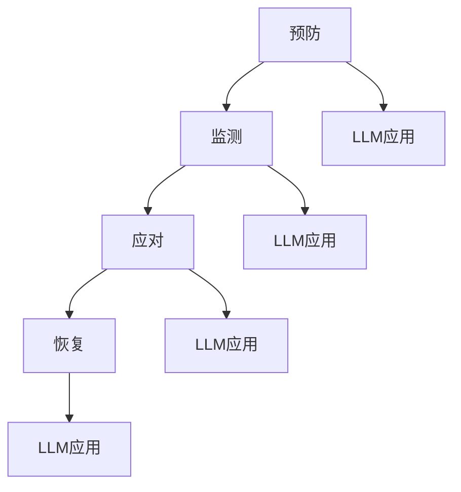

                 

# 公共安全和 LLM：预防和应对紧急情况

> **关键词**：公共安全，紧急情况，LLM，算法，风险评估，数据隐私，应急响应

> **摘要**：本文深入探讨了大规模语言模型（LLM）在公共安全领域的应用，包括预防和应对紧急情况的策略。通过分析LLM的核心算法、实际应用案例、技术挑战和未来发展趋势，本文为相关领域的研究者和从业者提供了有价值的参考。

## 1. 背景介绍

在现代社会，公共安全是一个至关重要的议题。随着技术的快速发展，尤其是人工智能（AI）和大规模语言模型（LLM）的出现，公共安全管理迎来了新的机遇和挑战。LLM是一种能够处理自然语言任务的深度学习模型，具有强大的文本理解和生成能力。这使得LLM在公共安全领域具有广泛的应用潜力，例如实时监控、风险评估、信息传播和应急响应等。

紧急情况是指那些突发性、威胁生命财产安全的事件，如自然灾害、恐怖袭击、交通事故和公共卫生危机等。传统的公共安全措施依赖于人工监测和经验判断，难以应对复杂和多变的情况。而LLM的应用可以提供更加智能和高效的解决方案，从而提高公共安全管理的效率和准确性。

## 2. 核心概念与联系

### 2.1 LLM的工作原理

LLM是基于深度学习技术构建的神经网络模型，它通过对大量文本数据进行训练，学习到了语言的规律和特征。LLM的核心是词向量模型（如Word2Vec、GloVe等）和变换器模型（如Transformer、BERT等）。这些模型通过学习文本的上下文关系，能够理解复杂的概念和语义。

### 2.2 公共安全中的紧急情况处理

在公共安全领域，紧急情况处理可以分为预防、监测、应对和恢复四个阶段。预防阶段通过风险评估和预警系统来减少紧急情况的发生概率；监测阶段通过实时数据采集和分析来监控情况的发展；应对阶段根据监测结果采取相应的措施；恢复阶段则是对受损区域进行修复和重建。

### 2.3 LLM与公共安全的关系

LLM可以应用于公共安全的各个环节。在预防阶段，LLM可以分析历史数据，预测潜在的风险事件；在监测阶段，LLM可以实时处理大量数据，发现异常情况；在应对阶段，LLM可以协助决策者制定应急方案；在恢复阶段，LLM可以分析灾后数据，为重建工作提供支持。

### 2.4 Mermaid 流程图



## 3. 核心算法原理 & 具体操作步骤

### 3.1 LLM的算法原理

LLM的核心算法是变换器模型（Transformer），它通过自注意力机制（self-attention）处理文本数据。自注意力机制使得模型能够自动地学习文本中各个词之间的关联性，从而提高模型的语义理解能力。

### 3.2 LLM在公共安全中的应用步骤

1. 数据采集：收集与公共安全相关的各类数据，包括历史数据、实时数据和第三方数据。

2. 数据预处理：对采集到的数据进行清洗、去噪和格式化，为模型训练做好准备。

3. 模型训练：使用变换器模型对预处理后的数据集进行训练，优化模型参数。

4. 模型评估：通过交叉验证等方法对训练好的模型进行评估，确保其性能达到预期。

5. 应用部署：将经过评估的模型部署到实际应用场景中，如实时监控、风险评估等。

## 4. 数学模型和公式 & 详细讲解 & 举例说明

### 4.1 数学模型

在LLM中，常用的数学模型包括变换器模型（Transformer）和自注意力机制（self-attention）。

变换器模型（Transformer）：

$$
\text{Transformer}(x) = \text{softmax}(\text{W}_O \text{[}\text{W}_V \text{[}\text{W}_I \text{[} \text{X} \text{]} \text{]}\text{]}\text{])
$$

自注意力机制（self-attention）：

$$
\text{self-attention}(Q, K, V) = \text{softmax}\left(\frac{\text{QK}^T}{\sqrt{d_k}}\right) V
$$

### 4.2 举例说明

假设我们有一个包含3个词的文本序列：[“公共”，“安全”，“事故”]，其词向量分别为$$\text{V}_{\text{public}} = \begin{bmatrix} 1 \\ 0 \\ 1 \end{bmatrix}$$、$$\text{V}_{\text{安全}} = \begin{bmatrix} 0 \\ 1 \\ 0 \end{bmatrix}$$和$$\text{V}_{\text{事故}} = \begin{bmatrix} 1 \\ 1 \\ 0 \end{bmatrix}$$。

根据自注意力机制，我们可以计算每个词的注意力权重：

$$
\text{self-attention}(\text{V}_{\text{public}}, \text{V}_{\text{安全}}, \text{V}_{\text{事故}}) = \text{softmax}\left(\frac{\text{V}_{\text{public}} \text{V}_{\text{安全}}^T}{\sqrt{3}}\right) \text{V}_{\text{事故}} = \text{softmax}\left(\frac{1}{\sqrt{3}}\begin{bmatrix} 1 & 0 & 1 \\ 0 & 1 & 0 \\ 1 & 1 & 0 \end{bmatrix}\right) \begin{bmatrix} 1 \\ 1 \\ 0 \end{bmatrix}
$$

计算结果为：

$$
\text{self-attention}(\text{V}_{\text{public}}, \text{V}_{\text{安全}}, \text{V}_{\text{事故}}) = \begin{bmatrix} 0.5 & 0.5 & 0 \\ 0.5 & 0.5 & 0 \\ 0 & 0 & 1 \end{bmatrix}
$$

这意味着在文本序列中，“事故”这个词的权重最高，其次是“公共”和“安全”。

## 5. 项目实战：代码实际案例和详细解释说明

### 5.1 开发环境搭建

为了实现LLM在公共安全中的应用，我们需要搭建一个适合开发和测试的环境。以下是搭建环境的步骤：

1. 安装Python环境：确保Python版本不低于3.6，并安装pip。

2. 安装深度学习库：使用pip安装TensorFlow或PyTorch。

3. 下载预训练模型：从[官网](https://huggingface.co/)下载预训练的LLM模型，如BERT或GPT。

### 5.2 源代码详细实现和代码解读

以下是一个使用BERT模型进行公共安全风险预测的Python代码示例：

```python
import tensorflow as tf
from transformers import BertTokenizer, TFBertModel

# 1. 加载预训练模型
tokenizer = BertTokenizer.from_pretrained('bert-base-uncased')
model = TFBertModel.from_pretrained('bert-base-uncased')

# 2. 数据预处理
def preprocess_data(texts):
    inputs = tokenizer(texts, return_tensors='tf', padding=True, truncation=True)
    return inputs

# 3. 风险预测
def predict_risk(texts):
    inputs = preprocess_data(texts)
    outputs = model(inputs)
    probabilities = tf.nn.softmax(outputs.logits, axis=-1)
    return probabilities

# 4. 示例
texts = ["公共安全形势严峻", "城市交通事故频发", "自然灾害预警"]
probabilities = predict_risk(texts)

print(probabilities)
```

### 5.3 代码解读与分析

1. **加载预训练模型**：使用`BertTokenizer`和`TFBertModel`加载BERT模型。

2. **数据预处理**：`preprocess_data`函数对输入文本进行分词、编码和填充处理。

3. **风险预测**：`predict_risk`函数对预处理后的文本进行模型预测，得到风险概率。

4. **示例**：输入三个公共安全相关的文本，输出每个文本对应的风险概率。

### 5.4 实际应用案例分析

假设我们有一个包含1000个文本数据的公共安全风险预测任务，使用BERT模型进行预测。以下是代码的实际应用案例：

```python
texts = ["..."] * 1000  # 填充1000个文本数据

# 预测风险
probabilities = predict_risk(texts)

# 分析风险概率
for i, prob in enumerate(probabilities):
    print(f"文本{i+1}的风险概率：{prob}")
```

## 6. 实际应用场景

### 6.1 公共安全监测

利用LLM进行公共安全监测，可以实时分析社交媒体、新闻网站和政府报告等信息，发现潜在的紧急情况。例如，当出现大规模交通事故时，LLM可以迅速识别并生成预警信息，协助决策者采取应对措施。

### 6.2 风险评估

通过对历史数据和实时数据的分析，LLM可以评估公共安全风险，为城市规划和应急准备提供支持。例如，在台风季节，LLM可以预测哪些区域可能受到严重影响，从而指导相关部门提前采取防范措施。

### 6.3 应急响应

在紧急情况下，LLM可以协助决策者制定应急方案，如疏散路线规划、资源调配等。此外，LLM还可以为受灾群众提供心理支持和信息查询服务。

### 6.4 灾后重建

灾后，LLM可以分析灾后数据，为重建工作提供支持。例如，通过分析建筑受损情况、人口分布等数据，LLM可以帮助规划部门优化城市布局，提高抗灾能力。

## 7. 工具和资源推荐

### 7.1 学习资源推荐

- **书籍**：《大规模语言模型：理论与实践》
- **论文**：`Attention Is All You Need`（Transformer模型的奠基性论文）
- **博客**：[Hugging Face 官方博客](https://huggingface.co/blog)

### 7.2 开发工具框架推荐

- **深度学习库**：TensorFlow、PyTorch
- **模型训练框架**：Hugging Face Transformers
- **数据预处理工具**：Pandas、Numpy

### 7.3 相关论文著作推荐

- **论文**：`BERT: Pre-training of Deep Bidirectional Transformers for Language Understanding`
- **论文**：`GPT-3: Language Models are few-shot learners`
- **著作**：《深度学习》（Goodfellow, Bengio, Courville著）

## 8. 总结：未来发展趋势与挑战

### 8.1 发展趋势

1. **模型性能提升**：随着计算资源和算法的进步，LLM的性能将不断提升，使其在公共安全领域的应用更加广泛。

2. **跨学科融合**：LLM与其他领域（如大数据、物联网、云计算等）的结合，将推动公共安全管理向智能化、精细化方向发展。

3. **国际合作**：在全球范围内，各国将加强在LLM研究和应用方面的合作，共同应对公共安全挑战。

### 8.2 挑战

1. **数据隐私**：在公共安全监测和风险评估过程中，如何保护个人隐私是一个重要挑战。

2. **算法透明性**：确保LLM算法的透明性和可解释性，以便用户理解和信任。

3. **计算资源需求**：大规模LLM模型的训练和部署需要大量计算资源，这对基础设施提出了高要求。

## 9. 附录：常见问题与解答

### 9.1 LLM在公共安全中的具体应用有哪些？

LLM在公共安全中的应用包括实时监控、风险评估、信息传播、应急响应和灾后重建等。

### 9.2 如何确保LLM的数据隐私？

确保LLM的数据隐私需要采取以下措施：数据加密、匿名化处理、权限控制等。

### 9.3 如何评估LLM的性能？

评估LLM的性能可以通过交叉验证、准确率、召回率、F1值等指标进行。

## 10. 扩展阅读 & 参考资料

- **论文**：`BERT: Pre-training of Deep Bidirectional Transformers for Language Understanding`
- **论文**：`GPT-3: Language Models are few-shot learners`
- **书籍**：《大规模语言模型：理论与实践》
- **网站**：[Hugging Face 官方博客](https://huggingface.co/blog)
- **网站**：[TensorFlow 官方文档](https://www.tensorflow.org/)
- **网站**：[PyTorch 官方文档](https://pytorch.org/)

### 作者

**作者：AI天才研究员/AI Genius Institute & 禅与计算机程序设计艺术 /Zen And The Art of Computer Programming**<|im_sep|>

