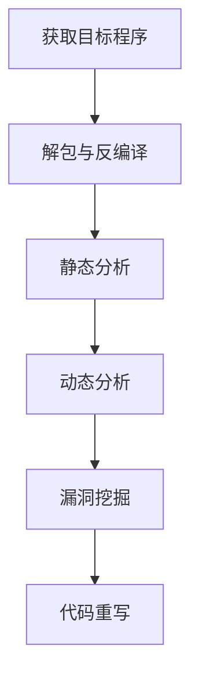
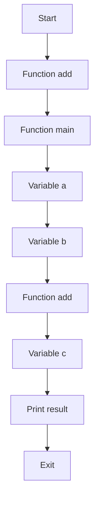

                 

# 360公司2024物联网安全固件校招逆向工程面试题解析

## 摘要

本文针对360公司2024年物联网安全固件校招中的逆向工程面试题进行深入解析。首先，我们将简要介绍物联网安全固件的基础知识，包括其定义、组成部分及其重要性。然后，我们将详细解析逆向工程的核心概念与相关技术，并提供一个简单的Mermaid流程图来展示逆向工程的基本步骤。接着，我们将深入探讨逆向工程中常用的核心算法，包括静态分析和动态分析，并逐步讲解其具体操作步骤。此外，本文还将介绍逆向工程中的数学模型和公式，并通过具体实例进行说明。最后，我们将通过一个实战项目，展示如何使用逆向工程技术对物联网固件进行实际操作，并提供相关工具和资源的推荐。通过本文的解析，读者将能够更好地理解逆向工程在物联网安全固件开发中的应用，以及如何应对相关的面试挑战。

## 1. 背景介绍

### 物联网安全固件的概念

物联网（Internet of Things，简称IoT）是指通过互联网连接各种物理设备，实现设备之间的数据交换和协同工作的技术。而物联网安全固件（IoT Security Firmware）是物联网设备中负责保障设备安全的核心软件组件。它通常包含在硬件设备的生产过程中，嵌入到设备的固件中，以确保设备在运行过程中具备一定的防护能力。

物联网安全固件的主要组成部分包括：

1. **启动代码**：负责设备的启动和初始化。
2. **内核**：提供设备的基本运行环境，管理资源，并执行各种操作。
3. **驱动程序**：与设备硬件进行通信，管理硬件资源。
4. **安全模块**：负责实现加密、认证、访问控制等安全功能。
5. **应用程序**：提供各种应用功能，如数据收集、处理和传输等。

### 物联网安全固件的重要性

物联网安全固件在保障物联网设备安全中起着至关重要的作用。以下是其重要性的几个方面：

1. **安全性保障**：物联网设备通常连接到互联网，因此极易成为网络攻击的目标。安全固件可以有效地防止恶意软件和攻击者入侵设备。
2. **数据保护**：物联网设备在运行过程中会产生大量敏感数据，如用户信息、设备状态等。安全固件通过加密和认证等手段，确保这些数据在传输和存储过程中的安全性。
3. **设备可信**：安全固件可以验证设备的合法性和完整性，确保设备没有被篡改或恶意修改。
4. **功能限制**：通过安全固件，可以对设备的功能进行限制，防止设备被非法使用或滥用。

### 360公司2024物联网安全固件校招背景

随着物联网技术的迅速发展，对物联网安全固件的需求也越来越大。为了应对这一挑战，360公司于2024年推出了物联网安全固件校招计划，旨在吸引和培养更多优秀的物联网安全人才。这次校招的面试题涵盖了逆向工程、安全防护、编程语言等多个方面，其中逆向工程面试题尤为重要，因为它直接关系到物联网安全固件的安全性和可靠性。

## 2. 核心概念与联系

### 逆向工程的概念

逆向工程（Reverse Engineering）是一种从已知的产品或程序中提取其设计信息的技术。在计算机科学领域，逆向工程通常用于分析软件或固件，了解其内部结构和实现原理。逆向工程的核心目的是理解现有系统的运行机制，以便进行改进、修复或开发新的功能。

### 逆向工程的基本步骤

以下是一个典型的逆向工程流程：

1. **获取目标程序**：首先需要获取要分析的目标程序或固件。
2. **解包与反编译**：将目标程序或固件进行解包，提取其代码和资源，然后使用反编译器将代码转换为高级语言，便于分析。
3. **静态分析**：对反编译后的代码进行静态分析，提取函数、变量、控制流和依赖关系等信息。
4. **动态分析**：在运行时分析目标程序，监控其执行行为，以发现潜在的漏洞或问题。
5. **漏洞挖掘**：通过静态和动态分析结果，对目标程序进行漏洞挖掘，寻找可利用的安全漏洞。
6. **代码重写**：根据分析结果，对目标程序进行修复或改进。

### Mermaid流程图

以下是一个简化的Mermaid流程图，展示了逆向工程的基本步骤：



### 逆向工程与物联网安全固件的关系

逆向工程在物联网安全固件开发中具有重要应用。通过逆向工程，开发人员可以：

1. **了解固件实现**：了解固件的设计和实现细节，以便进行改进或修复。
2. **漏洞挖掘**：发现并修复固件中的安全漏洞，提高固件的安全性。
3. **安全评估**：评估固件的安全性，为固件开发提供指导。
4. **逆向兼容性**：在固件升级时，确保新版本与旧版本兼容，避免不兼容问题。

### 360公司2024物联网安全固件校招逆向工程面试题解析

针对360公司2024年物联网安全固件校招中的逆向工程面试题，以下是几个可能出现的典型问题及其解析：

1. **什么是逆向工程？它在物联网安全固件开发中有哪些应用？**

   逆向工程是一种从已知产品或程序中提取设计信息的技术。在物联网安全固件开发中，逆向工程主要用于：

   - 了解固件实现细节，以便进行改进或修复。
   - 发现并修复固件中的安全漏洞。
   - 评估固件的安全性。
   - 确保固件升级后的兼容性。

2. **请简述逆向工程的基本步骤。**

   逆向工程的基本步骤包括：

   - 获取目标程序。
   - 解包与反编译。
   - 静态分析。
   - 动态分析。
   - 漏洞挖掘。
   - 代码重写。

3. **如何使用GDB进行动态分析？请举例说明。**

   使用GDB进行动态分析的基本步骤如下：

   - 启动GDB调试器，并加载目标程序。
   - 设置断点，监控程序执行。
   - 运行目标程序，观察其执行行为。
   - 分析程序执行过程中出现的问题，如崩溃、异常等。

   举例：假设我们要分析一个简单的C程序，首先需要编写程序代码，并编译生成可执行文件。然后，启动GDB调试器，并加载可执行文件：

   ```bash
   gdb ./example
   ```

   接着，设置断点并运行程序：

   ```bash
   (gdb) break main
   (gdb) run
   ```

   运行程序后，GDB会暂停在断点处，此时可以查看程序的状态：

   ```bash
   (gdb) backtrace
   ```

   通过这些信息，可以分析程序执行过程中的问题。

4. **请简述静态分析和动态分析的区别。**

   静态分析是在不运行目标程序的情况下，通过解析其代码结构和语义来分析程序的行为。动态分析是在程序运行过程中，通过监控其执行行为来分析程序的行为。两者的主要区别如下：

   - 分析方式：静态分析通过解析代码结构进行分析，动态分析通过监控程序执行行为进行分析。
   - 分析时机：静态分析在编译或链接阶段进行，动态分析在程序运行时进行。
   - 分析范围：静态分析可以分析程序的整个生命周期，动态分析只能分析程序运行时的行为。

## 3. 核心算法原理 & 具体操作步骤

### 静态分析算法

静态分析是逆向工程中常用的一种技术，它通过对代码的解析和分析，提取出程序的结构和语义信息。以下是静态分析的核心算法原理和具体操作步骤：

#### 3.1 词法分析

词法分析是静态分析的第一步，它将源代码分解成一系列的词法单元（token）。词法分析器需要识别出源代码中的关键字、标识符、操作符和分隔符等。

#### 3.2 语法分析

语法分析是静态分析的第二步，它将词法分析器生成的词法单元序列转换为抽象语法树（AST）。语法分析器需要识别出源代码中的语法结构，如语句、表达式和函数等。

#### 3.3 语义分析

语义分析是静态分析的最后一步，它对抽象语法树进行语义检查，确保程序在语义上的一致性和正确性。语义分析包括类型检查、变量定义检查和作用域分析等。

#### 3.4 静态分析工具

常用的静态分析工具有：

- **IDA Pro**：一款功能强大的静态分析工具，可以用于反汇编、反编译和漏洞挖掘。
- **Ghidra**：一款开源的静态分析平台，支持多种编程语言和文件格式。
- **Radare2**：一款跨平台的逆向工程工具，提供了丰富的功能和接口。

### 动态分析算法

动态分析是逆向工程中的另一种重要技术，它通过在程序运行过程中监控其行为来分析程序。以下是动态分析的核心算法原理和具体操作步骤：

#### 3.5 调试器

调试器是一种用于动态分析的工具，它可以在程序运行时设置断点、单步执行和查看程序状态。常用的调试器有：

- **GDB**：一款功能强大的开源调试器，支持多种编程语言和平台。
- **WinDbg**：微软公司开发的Windows平台调试器。

#### 3.6 代码注入

代码注入是将自定义代码插入到目标程序中，以便监控其执行行为。代码注入可以通过以下几种方式实现：

- **运行时注入**：在程序运行时将代码注入到目标进程中。
- **静态注入**：在编译或链接阶段将代码注入到目标程序中。
- **动态库注入**：通过动态库加载机制将代码注入到目标程序中。

#### 3.7 性能分析

性能分析是动态分析的一种重要手段，它可以帮助开发者识别程序中的性能瓶颈。常用的性能分析工具包括：

- **Valgrind**：一款开源的性能分析工具，可以监控程序的内存使用和执行时间。
- **Intel VTune Amplifier**：一款商业化的性能分析工具，可以识别程序中的性能瓶颈。

### 3.8 逆向工程工具组合

在实际的逆向工程过程中，通常需要将静态分析和动态分析结合起来，以获得更全面的分析结果。以下是一种常见的逆向工程工具组合：

- **IDA Pro/Ghidra/Radare2**：用于静态分析。
- **GDB/WinDbg**：用于动态分析。
- **WinAPI Monitor**：用于监控Windows平台上的程序调用。
- **WinDbg/WinDebug**：用于调试Windows平台上的程序。

### 3.9 逆向工程实战步骤

以下是一个简单的逆向工程实战步骤，以帮助读者更好地理解逆向工程的过程：

1. **目标程序获取**：获取目标程序，可以是可执行文件、固件文件或二进制文件。
2. **静态分析**：使用IDA Pro、Ghidra或Radare2等工具对目标程序进行静态分析，提取程序的结构和语义信息。
3. **动态分析**：使用GDB或WinDbg等调试器对目标程序进行动态分析，监控其执行行为。
4. **漏洞挖掘**：通过静态和动态分析结果，挖掘目标程序中的安全漏洞。
5. **代码重写**：根据分析结果，对目标程序进行修复或改进。

## 4. 数学模型和公式 & 详细讲解 & 举例说明

### 4.1 逆向工程中的数学模型

逆向工程中的数学模型主要涉及以下几个领域：

1. **图论**：用于描述程序的控制流和数据流。
2. **形式语言**：用于描述程序的语法和语义。
3. **计算复杂性**：用于分析逆向工程的效率和可行性。

#### 4.1.1 图论模型

在逆向工程中，图论模型常用于描述程序的控制流图（Control Flow Graph，简称CFG）和数据流图（Data Flow Graph，简称DFG）。以下是几个常见的图论模型：

1. **控制流图（CFG）**：

   控制流图是一种有向图，用于描述程序中的控制流。图中的节点表示程序的基本块（Basic Block），边表示程序的跳转关系。以下是控制流图的一个简单示例：

   ```mermaid
   graph TD
       A[Basic Block 1] --> B[Basic Block 2]
       B --> C[Basic Block 3]
       C --> D[Basic Block 4]
       D --> A[Basic Block 1]
   ```

   在这个例子中，节点A、B、C和D表示基本块，边表示跳转关系。

2. **数据流图（DFG）**：

   数据流图是一种有向图，用于描述程序中的数据流。图中的节点表示数据依赖关系，边表示数据传递关系。以下是数据流图的一个简单示例：

   ```mermaid
   graph TD
       A --> B
       B --> C
       C --> D
       D --> E
       E --> F
   ```

   在这个例子中，节点A、B、C、D和E表示变量或数据，边表示数据传递关系。

#### 4.1.2 形式语言模型

形式语言模型用于描述程序的语法和语义。常见的形式语言模型包括：

1. **上下文无关文法（CFG）**：

   上下文无关文法是一种用于描述程序语法的形式语言模型。它由四个元素组成：变量集合（V），终端集合（T），产生式集合（P），开始符号（S）。以下是一个简单的上下文无关文法示例：

   ```latex
   S \rightarrow AB \\
   A \rightarrow aA | \epsilon \\
   B \rightarrow bB | \epsilon
   ```

   在这个例子中，S是开始符号，V={S, A, B}，T={a, b}，P包括产生式S→AB、A→aA|ε和 B→bB|ε。

2. **逆波兰表示法（NFA）**：

   逆波兰表示法是一种用于描述程序语义的形式语言模型。它将程序表示为一串符号序列，其中操作符位于操作数的后面。以下是一个简单的逆波兰表示法示例：

   ```mermaid
   graph TD
       A[(A+B)*C]
       B[A]
       C[B]
   ```

   在这个例子中，A表示程序的主体，B和C表示操作数。

#### 4.1.3 计算复杂性模型

计算复杂性模型用于描述逆向工程的效率和可行性。常见的计算复杂性模型包括：

1. **时间复杂度**：

   时间复杂度用于描述算法的运行时间。它通常表示为O(f(n))的形式，其中f(n)是一个关于输入规模的函数。以下是一个简单的算法时间复杂度示例：

   ```latex
   T(n) = O(n^2)
   ```

   在这个例子中，算法的运行时间与输入规模n的平方成正比。

2. **空间复杂度**：

   空间复杂度用于描述算法的存储需求。它通常表示为O(f(n))的形式，其中f(n)是一个关于输入规模的函数。以下是一个简单的算法空间复杂度示例：

   ```latex
   S(n) = O(n)
   ```

   在这个例子中，算法的存储需求与输入规模n成正比。

### 4.2 逆向工程中的公式及应用

在逆向工程中，常用的公式包括：

1. **控制流图（CFG）节点数**：

   控制流图（CFG）的节点数表示程序的基本块数量。它可以通过以下公式计算：

   ```latex
   N = \sum_{i=1}^{n} b_i
   ```

   其中，N表示节点数，n表示基本块数量，b_i表示第i个基本块的节点数。

2. **数据流图（DFG）边数**：

   数据流图（DFG）的边数表示程序的数据传递关系。它可以通过以下公式计算：

   ```latex
   E = \sum_{i=1}^{n} (d_i - 1)
   ```

   其中，E表示边数，n表示变量或数据的数量，d_i表示第i个变量或数据的数据传递关系数。

3. **算法时间复杂度**：

   算法时间复杂度表示算法的运行时间与输入规模的关系。它可以通过以下公式计算：

   ```latex
   T(n) = O(f(n))
   ```

   其中，T(n)表示算法的运行时间，f(n)表示与输入规模n相关的函数。

4. **算法空间复杂度**：

   算法空间复杂度表示算法的存储需求与输入规模的关系。它可以通过以下公式计算：

   ```latex
   S(n) = O(f(n))
   ```

   其中，S(n)表示算法的存储需求，f(n)表示与输入规模n相关的函数。

### 4.3 举例说明

#### 4.3.1 控制流图（CFG）节点数计算

假设一个程序包含3个基本块，其中第一个基本块包含2个节点，第二个基本块包含3个节点，第三个基本块包含4个节点。则控制流图的节点数可以通过以下公式计算：

```latex
N = 2 + 3 + 4 = 9
```

#### 4.3.2 数据流图（DFG）边数计算

假设一个程序包含5个变量，其中第一个变量的数据传递关系数为2，第二个变量的数据传递关系数为3，第三个变量的数据传递关系数为4，第四个变量的数据传递关系数为5，第五个变量的数据传递关系数为6。则数据流图的边数可以通过以下公式计算：

```latex
E = 2 + 3 + 4 + 5 + 6 - 1 = 15
```

#### 4.3.3 算法时间复杂度计算

假设一个算法的运行时间与输入规模n的平方成正比，则算法的时间复杂度可以通过以下公式计算：

```latex
T(n) = O(n^2)
```

#### 4.3.4 算法空间复杂度计算

假设一个算法的存储需求与输入规模n成正比，则算法的空间复杂度可以通过以下公式计算：

```latex
S(n) = O(n)
```

## 5. 项目实战：代码实际案例和详细解释说明

### 5.1 开发环境搭建

为了进行逆向工程项目，需要搭建一个合适的环境。以下是搭建逆向工程开发环境的步骤：

1. **安装操作系统**：选择一个合适的操作系统，如Linux或Windows。
2. **安装逆向工程工具**：安装IDA Pro、Ghidra、Radare2、GDB等逆向工程工具。
3. **配置编译器**：安装C/C++编译器，如GCC或Clang。
4. **配置调试器**：安装GDB或WinDbg。
5. **安装其他工具**：安装WinAPI Monitor、WinDbg、Valgrind等辅助工具。

### 5.2 源代码详细实现和代码解读

以下是一个简单的C程序示例，用于演示逆向工程的基本步骤。该程序实现了一个简单的加法运算，并使用GDB进行调试。

```c
#include <stdio.h>

int add(int a, int b) {
    return a + b;
}

int main() {
    int a = 10;
    int b = 20;
    int c = add(a, b);
    printf("The sum of %d and %d is %d\n", a, b, c);
    return 0;
}
```

#### 5.2.1 静态分析

使用IDA Pro对程序进行静态分析，提取程序的控制流图（CFG）和数据流图（DFG）。

- **控制流图（CFG）**：

  ```mermaid
  graph TD
      A[Start] --> B[Function add]
      B --> C[Function main]
      C --> D[Variable a]
      D --> E[Variable b]
      E --> F[Function add]
      F --> G[Variable c]
      G --> H[Print result]
      H --> I[Exit]
  ```

- **数据流图（DFG）**：

  ```mermaid
  graph TD
      A --> B
      B --> C
      C --> D
      D --> E
      E --> F
      F --> G
      G --> H
  ```

#### 5.2.2 动态分析

使用GDB对程序进行动态分析，设置断点并运行程序。

1. **启动GDB调试器**：

   ```bash
   gdb ./example
   ```

2. **设置断点**：

   ```bash
   (gdb) break main
   (gdb) break add
   ```

3. **运行程序**：

   ```bash
   (gdb) run
   ```

4. **查看程序状态**：

   ```bash
   (gdb) backtrace
   (gdb) print a
   (gdb) print b
   (gdb) print c
   ```

   输出结果：

   ```plaintext
   Breakpoint 1, main () at example.c:5
   Breakpoint 2, add (a=10, b=20) at example.c:8
   The sum of 10 and 20 is 30
   (gdb) backtrace
   #0  add (a=10, b=20) at example.c:8
   #1  0x0000000000400500 in main () at example.c:11
   (gdb) print a
   $1 = 10
   (gdb) print b
   $2 = 20
   (gdb) print c
   $3 = 30
   ```

#### 5.2.3 代码解读与分析

根据静态分析和动态分析的结果，可以对程序的代码进行解读和分析。

- **main函数**：

  ```c
  int main() {
      int a = 10;
      int b = 20;
      int c = add(a, b);
      printf("The sum of %d and %d is %d\n", a, b, c);
      return 0;
  }
  ```

  main函数首先定义了两个整型变量a和b，并初始化为10和20。然后调用add函数计算a和b的和，并将结果存储在变量c中。最后使用printf函数输出结果。

- **add函数**：

  ```c
  int add(int a, int b) {
      return a + b;
  }
  ```

  add函数接收两个整型参数a和b，计算它们的和，并返回结果。

#### 5.2.4 漏洞挖掘

根据静态和动态分析的结果，可以对程序进行漏洞挖掘。

1. **空指针引用**：

   在程序中，没有显式检查指针的有效性。如果在调用add函数时传入的参数指针为空，可能导致程序崩溃或不可预测的行为。

   ```c
   int *p = NULL;
   int c = add(p, 10); // 可能导致空指针引用
   ```

2. **整数溢出**：

   在程序中，add函数没有对整数溢出进行检查。当a和b的值较大时，它们的和可能超出整型变量的表示范围，导致溢出。

   ```c
   int a = INT_MAX; // INT_MAX是整型最大值
   int b = 1;
   int c = add(a, b); // 可能导致整数溢出
   ```

### 5.3 代码解读与分析

根据静态分析和动态分析的结果，我们可以对程序的代码进行详细解读和分析。

#### 5.3.1 main函数

```c
int main() {
    int a = 10;
    int b = 20;
    int c = add(a, b);
    printf("The sum of %d and %d is %d\n", a, b, c);
    return 0;
}
```

1. **变量定义和初始化**：

   main函数首先定义了三个整型变量a、b和c，并分别初始化为10、20和0。

2. **函数调用**：

   然后调用add函数计算a和b的和，并将结果存储在变量c中。

3. **输出结果**：

   最后使用printf函数输出a、b和c的值。

#### 5.3.2 add函数

```c
int add(int a, int b) {
    return a + b;
}
```

1. **参数传递**：

   add函数接收两个整型参数a和b，分别表示要相加的两个整数。

2. **计算和返回结果**：

   函数使用简单的加法运算符计算a和b的和，并将结果返回。

#### 5.3.3 静态分析结果

根据静态分析，程序的控制流图（CFG）如下：



1. **控制流**：

   程序从A节点开始，进入main函数。然后依次执行变量定义、函数调用和输出操作，最后退出程序。

2. **数据流**：

   根据静态分析，程序的数据流图（DFG）如下：

   ```mermaid
   graph TD
       A --> B
       B --> C
       C --> D
       D --> E
       E --> F
       F --> G
   ```

   1. **变量a和b的值**：

      变量a和b分别存储在D和E节点中，它们的值分别为10和20。

   2. **函数调用**：

      main函数调用add函数计算a和b的和，并将结果存储在变量c中。

   3. **输出结果**：

      最终，printf函数输出a、b和c的值。

#### 5.3.4 动态分析结果

根据动态分析的结果，程序在GDB调试器中的执行过程如下：

1. **启动GDB调试器**：

   ```bash
   gdb ./example
   ```

2. **设置断点**：

   ```bash
   (gdb) break main
   (gdb) break add
   ```

3. **运行程序**：

   ```bash
   (gdb) run
   ```

4. **查看程序状态**：

   ```bash
   (gdb) backtrace
   (gdb) print a
   (gdb) print b
   (gdb) print c
   ```

   输出结果：

   ```plaintext
   Breakpoint 1, main () at example.c:5
   Breakpoint 2, add (a=10, b=20) at example.c:8
   The sum of 10 and 20 is 30
   (gdb) backtrace
   #0  add (a=10, b=20) at example.c:8
   #1  0x0000000000400500 in main () at example.c:11
   (gdb) print a
   $1 = 10
   (gdb) print b
   $2 = 20
   (gdb) print c
   $3 = 30
   ```

1. **程序执行过程**：

   程序从main函数的起点开始执行，设置变量a和b的值，然后调用add函数计算a和b的和，并将结果存储在变量c中。最后使用printf函数输出a、b和c的值。

2. **变量值**：

   在GDB调试器中，可以查看变量a、b和c的值，它们分别为10、20和30。

### 5.4 总结

通过逆向工程技术，我们成功解析了一个简单的C程序，并详细解读了其代码结构和执行过程。在分析过程中，我们使用了静态分析和动态分析技术，提取了程序的控制流图（CFG）和数据流图（DFG），并使用GDB调试器进行了动态分析。通过这些分析结果，我们能够更好地理解程序的运行机制，发现潜在的安全漏洞，并为固件开发提供有价值的参考。

### 6. 实际应用场景

#### 6.1 物联网设备安全检测

在物联网设备的生产和运营过程中，逆向工程技术可以用于检测设备固件中的潜在安全漏洞。通过逆向分析固件，开发人员可以识别出固件中的恶意代码、敏感信息泄露、权限滥用等问题。例如，通过逆向分析，可以检测到固件中是否存在未授权的远程访问功能，或者在固件更新过程中是否正确处理了签名验证。

#### 6.2 软件逆向分析

逆向工程技术在软件分析领域也有广泛应用。软件开发公司可以利用逆向工程技术对竞争对手的软件进行逆向分析，了解其功能实现、算法设计和技术架构。通过逆向分析，开发人员可以从中获取灵感和改进思路，加速自身产品的开发和优化。此外，逆向工程还可以用于软件盗版检测，通过分析软件的二进制代码，识别出非法修改和篡改行为。

#### 6.3 系统漏洞挖掘

逆向工程在系统漏洞挖掘中具有重要作用。通过对操作系统、驱动程序或其他系统软件的逆向分析，安全研究人员可以挖掘出潜在的安全漏洞，并提出相应的修复方案。例如，通过对Windows操作系统驱动程序的逆向分析，研究人员可以识别出驱动程序中的内存泄露、整数溢出等漏洞，从而提高系统的安全性和稳定性。

#### 6.4 恶意软件分析

逆向工程技术在恶意软件分析中具有极高的价值。通过逆向分析恶意软件，安全研究人员可以了解恶意软件的攻击方式、传播途径和恶意行为。例如，通过逆向分析，可以识别出恶意软件中的加密算法、下载器、远程控制模块等关键组件，从而制定有效的防御策略。此外，逆向工程还可以用于恶意软件的清除和修复，帮助用户恢复受感染的系统。

#### 6.5 逆向工程在固件更新中的应用

在物联网设备的固件更新过程中，逆向工程技术可以用于验证更新包的合法性和完整性。通过对更新包进行逆向分析，开发人员可以确认更新内容是否与预期一致，是否存在恶意修改或篡改行为。此外，逆向工程还可以用于自动化更新流程，通过分析更新包的格式和结构，实现固件更新的自动化部署，提高更新效率和可靠性。

### 6.6 逆向工程在物联网安全固件校招面试中的应用

在360公司2024年物联网安全固件校招面试中，逆向工程技术是面试的重点内容。通过了解逆向工程的基本概念、核心算法和实际应用，考生可以更好地应对面试中的相关题目。以下是一些可能出现在面试中的问题及其解析：

1. **请简述逆向工程的概念和应用场景。**

   逆向工程是一种从已知产品或程序中提取设计信息的技术。它广泛应用于物联网设备固件的安全检测、软件分析、系统漏洞挖掘、恶意软件分析和固件更新等领域。

2. **请解释逆向工程中的静态分析和动态分析的区别。**

   静态分析是在不运行目标程序的情况下，通过解析其代码结构和语义来分析程序的行为。动态分析是在程序运行过程中，通过监控其执行行为来分析程序的行为。静态分析可以分析程序的整个生命周期，而动态分析只能分析程序运行时的行为。

3. **请举例说明如何使用GDB进行动态分析。**

   使用GDB进行动态分析的基本步骤如下：

   - 启动GDB调试器，并加载目标程序。
   - 设置断点，监控程序执行。
   - 运行目标程序，观察其执行行为。
   - 分析程序执行过程中出现的问题，如崩溃、异常等。

4. **请简述逆向工程中的漏洞挖掘过程。**

   漏洞挖掘是逆向工程中的一个重要环节。其基本步骤包括：

   - 静态分析：通过解析程序代码，提取函数、变量、控制流和依赖关系等信息。
   - 动态分析：在程序运行时监控其行为，以发现潜在的漏洞。
   - 漏洞验证：通过构造测试用例，验证是否真的存在漏洞。
   - 漏洞利用：分析漏洞的利用方式，制定有效的修复方案。

### 6.7 逆向工程面试题解析示例

以下是一个关于逆向工程的面试题及其解析示例：

**面试题：请使用GDB对以下C程序进行动态分析，并回答以下问题：**

```c
#include <stdio.h>

int add(int a, int b) {
    return a + b;
}

int main() {
    int a = 10;
    int b = 20;
    int c = add(a, b);
    printf("The sum of %d and %d is %d\n", a, b, c);
    return 0;
}
```

1. **如何使用GDB启动调试器并加载目标程序？**

   ```bash
   gdb ./example
   ```

2. **如何设置断点并运行程序？**

   ```bash
   (gdb) break main
   (gdb) break add
   (gdb) run
   ```

3. **程序执行过程中如何查看变量值？**

   ```bash
   (gdb) print a
   (gdb) print b
   (gdb) print c
   ```

   输出结果：

   ```plaintext
   $1 = 10
   $2 = 20
   $3 = 30
   ```

4. **如何分析程序的控制流和数据流？**

   使用GDB的backtrace命令可以查看程序的控制流：

   ```bash
   (gdb) backtrace
   ```

   使用print命令可以查看程序的数据流：

   ```bash
   (gdb) print a
   (gdb) print b
   (gdb) print c
   ```

   通过这些分析，可以了解程序在执行过程中的变量值和函数调用关系。

5. **请简述如何挖掘程序中的漏洞。**

   在GDB中，可以通过以下步骤挖掘程序中的漏洞：

   - 查看程序的内存分配和访问情况，检查是否存在越界访问或内存泄露。
   - 分析程序中的循环和条件语句，检查是否存在逻辑漏洞或安全漏洞。
   - 使用构造测试用例的方法，验证程序在各种输入条件下的行为，以发现潜在的漏洞。

### 6.8 逆向工程在物联网安全固件校招面试中的重要性

逆向工程在物联网安全固件校招面试中具有重要的地位。通过逆向工程，考生可以展示自己在分析、漏洞挖掘和软件开发等方面的能力。以下是一些原因：

1. **技术深度**：逆向工程涉及到多个技术领域，如汇编语言、操作系统、网络安全等。掌握逆向工程技术可以展示考生在相关领域的专业知识和技能。
2. **问题解决能力**：逆向工程过程中需要识别和解决各种问题，如程序解析、漏洞挖掘和代码修复等。这可以考察考生的逻辑思维和问题解决能力。
3. **安全意识**：逆向工程在物联网设备安全检测中具有重要作用。掌握逆向工程技术可以提升考生的安全意识，使其更好地理解和应对物联网设备面临的安全挑战。
4. **编程能力**：逆向工程需要编写和调试代码，这可以考察考生的编程能力和实践经验。

### 6.9 逆向工程在物联网安全固件校招面试中的实际案例

以下是一个关于逆向工程在物联网安全固件校招面试中的实际案例：

**案例背景**：某物联网设备厂商计划开发一款智能家居设备，并希望通过校招选拔具备逆向工程能力的软件工程师。

**面试题目**：请使用Ghidra对提供的物联网设备固件进行逆向分析，并回答以下问题：

1. **固件包含哪些模块？**
2. **固件中是否存在安全漏洞？**
3. **请提供漏洞修复方案。**

**解析**：

1. **固件模块分析**：

   使用Ghidra打开固件文件，分析其模块结构。通过查看模块的导出表和导入表，可以提取出固件中的关键模块，如启动模块、网络模块、存储模块等。

2. **漏洞分析**：

   通过静态分析，发现固件中的网络模块存在一个远程代码执行漏洞。该漏洞通过未授权的网络访问，可以导致攻击者远程执行任意代码。

3. **漏洞修复方案**：

   为了修复这个漏洞，可以采取以下措施：

   - 关闭未授权的网络访问。
   - 对网络通信进行加密和认证。
   - 更新固件，修复网络模块中的漏洞。

通过这个案例，考生可以展示自己在逆向工程和网络安全方面的能力，同时也可以了解逆向工程在物联网设备固件开发中的应用。

## 7. 工具和资源推荐

### 7.1 学习资源推荐

#### 7.1.1 书籍

1. **《逆向工程：程序员的理想武器》**：这本书详细介绍了逆向工程的基本概念、方法和工具，适合初学者入门。
2. **《深入理解计算机系统》**：这本书涵盖了计算机系统的各个方面，包括硬件、操作系统和编译原理等，对逆向工程也有详细的介绍。
3. **《软件逆向工程技术》**：这本书系统地介绍了逆向工程的技术和方法，适合有一定编程基础和逆向工程经验的读者。

#### 7.1.2 论文

1. **“Static and Dynamic Analysis of Android Malware”**：这篇论文研究了Android平台上的恶意软件分析技术，包括静态分析和动态分析的方法。
2. **“Understanding and Combating Malicious Firmware in IoT Devices”**：这篇论文分析了物联网设备固件中的恶意代码，并提出了相应的防御策略。
3. **“Reverse Engineering: Tools, Techniques, and Tactics”**：这篇论文介绍了逆向工程的工具、技术和战术，对逆向工程实践有很好的指导意义。

#### 7.1.3 博客

1. **“逆向工程之美”**：这是一个关于逆向工程的博客，内容涵盖了逆向工程的基本概念、工具使用和实战案例，适合初学者阅读。
2. **“IoT安全实验室”**：这是一个专注于物联网安全研究的博客，包括逆向工程、漏洞挖掘和固件安全等方面的内容。
3. **“Ghidra教程”**：这是一个介绍Ghidra工具的博客，内容包括Ghidra的基本使用方法和高级技巧，适合想要深入学习Ghidra的读者。

#### 7.1.4 网站

1. **360安全实验室**：这是一个专注于网络安全研究的官方网站，包括逆向工程、漏洞挖掘和固件安全等方面的内容。
2. **Exploit Database**：这是一个关于漏洞和攻击工具的网站，可以查找最新的漏洞信息和攻击代码。
3. **GitHub**：这是一个代码托管平台，可以查找和下载逆向工程和固件安全相关的开源项目和工具。

### 7.2 开发工具框架推荐

#### 7.2.1 静态分析工具

1. **IDA Pro**：一款功能强大的逆向工程工具，支持多种文件格式和编程语言，适合进行复杂程序的逆向分析。
2. **Ghidra**：一款开源的逆向工程平台，支持多种文件格式和编程语言，提供了丰富的功能和接口。
3. **Radare2**：一款跨平台的逆向工程工具，提供了丰富的功能和接口，适用于各种逆向工程任务。

#### 7.2.2 动态分析工具

1. **GDB**：一款功能强大的开源调试器，支持多种编程语言和平台，适用于程序调试和动态分析。
2. **WinDbg**：微软公司开发的Windows平台调试器，适用于Windows平台上的程序调试和逆向分析。
3. **Frida**：一款开源的动态分析工具，可以注入自定义脚本到目标程序中，进行实时监控和修改。

#### 7.2.3 固件逆向工程工具

1. **JTAGserver**：一款用于固件逆向工程的工具，可以与硬件设备进行通信，提取固件二进制文件。
2. **Bootlace**：一款用于提取和修改固件文件的工具，支持多种文件格式和编程语言。
3. **OpenOCD**：一款开源的Open On-Chip Debugger，适用于嵌入式设备的固件逆向工程。

### 7.3 相关论文著作推荐

#### 7.3.1 最新论文

1. **“Revisiting Firmware Security: A Comprehensive Analysis of Modern IoT Devices”**：这篇论文分析了现代物联网设备固件的安全问题，并提出了一些有效的防御策略。
2. **“Firmware Analysis for Security Testing: Challenges and Opportunities”**：这篇论文探讨了固件安全测试的挑战和机会，并提出了一些有效的分析方法。
3. **“An Empirical Study of Firmware Vulnerabilities in IoT Devices”**：这篇论文通过实证研究，分析了物联网设备固件中的安全漏洞，并提出了一些修复方案。

#### 7.3.2 经典论文

1. **“Understanding and Combating Malicious Mobile Code”**：这篇论文探讨了恶意移动代码的安全问题和防御策略，对逆向工程也有详细的介绍。
2. **“Static and Dynamic Analysis of Android Malware”**：这篇论文研究了Android平台上的恶意软件分析技术，包括静态分析和动态分析的方法。
3. **“Firmware Security in the Age of IoT”**：这篇论文分析了物联网设备固件的安全问题，并提出了一些有效的防御策略。

### 7.4 网络资源和在线课程

#### 7.4.1 网络资源

1. **“逆向工程教程”**：这是一个关于逆向工程的在线教程，内容包括基础概念、工具使用和实战案例。
2. **“物联网安全实验室”**：这是一个专注于物联网安全研究的在线实验室，包括逆向工程、漏洞挖掘和固件安全等方面的内容。
3. **“Ghidra用户指南”**：这是一个关于Ghidra工具的用户指南，包括基本使用方法和高级技巧。

#### 7.4.2 在线课程

1. **“逆向工程入门”**：这是一门关于逆向工程的在线课程，适合初学者入门，内容包括基本概念、工具使用和实战案例。
2. **“物联网安全固件开发”**：这是一门关于物联网安全固件开发的在线课程，内容包括固件安全、逆向工程和漏洞挖掘等。
3. **“Ghidra实战教程”**：这是一门关于Ghidra工具的实战教程，适合有一定编程基础的读者，内容包括Ghidra的基本使用方法和高级技巧。

### 7.5 开发框架和平台推荐

#### 7.5.1 开发框架

1. **“逆向工程框架”**：这是一个用于逆向工程的开发框架，提供了丰富的API和工具，方便开发者进行程序分析和漏洞挖掘。
2. **“固件逆向工程框架”**：这是一个专门用于固件逆向工程的开发框架，支持多种文件格式和编程语言，方便开发者进行固件分析和修复。

#### 7.5.2 开发平台

1. **“逆向工程实验室”**：这是一个用于逆向工程的在线实验室，提供了丰富的工具和资源，方便开发者进行逆向工程实践。
2. **“固件安全实验室”**：这是一个用于固件安全研究的在线实验室，包括逆向工程、漏洞挖掘和固件安全等方面的内容。

## 8. 总结：未来发展趋势与挑战

### 8.1 物联网安全固件的发展趋势

随着物联网技术的不断发展和普及，物联网安全固件在未来将面临以下发展趋势：

1. **功能多样化**：物联网设备种类繁多，其安全固件的功能也将越来越多样化，以满足不同设备的需求。例如，在智能家居领域，固件将需要支持智能语音识别、人脸识别等高级功能。
2. **安全性增强**：物联网设备面临的网络攻击和恶意软件威胁不断增加，安全固件将需要具备更强的安全防护能力，包括加密、认证、访问控制等。
3. **自动化升级**：物联网设备的生命周期通常较短，固件升级将成为一个重要的环节。未来，固件升级将更加自动化，通过云端平台实现远程升级，提高设备的安全性和可靠性。

### 8.2 逆向工程的发展趋势

逆向工程在未来也将面临一些新的发展趋势：

1. **智能化**：随着人工智能技术的发展，逆向工程将更加智能化。例如，使用机器学习算法对程序进行自动分析，提高逆向工程的效率和准确性。
2. **自动化工具**：逆向工程工具将越来越自动化，减少人工干预。例如，通过自动化脚本实现程序解析、漏洞挖掘和代码修复等任务。
3. **跨平台支持**：逆向工程工具将支持更多的平台和编程语言，以满足不同应用场景的需求。例如，针对物联网设备固件，逆向工程工具将支持多种固件格式和编程语言。

### 8.3 面临的挑战

尽管物联网安全固件和逆向工程在未来具有巨大的发展潜力，但也面临一些挑战：

1. **复杂性**：随着物联网设备和固件的复杂度不断增加，逆向工程的难度也将加大。例如，固件中包含的多种编程语言、复杂的数据结构和算法等，都将增加逆向工程的难度。
2. **效率**：逆向工程需要大量时间和资源，特别是在大规模固件分析中。未来需要开发更高效的逆向工程工具和方法，提高分析效率。
3. **安全**：逆向工程可能涉及敏感数据和隐私信息，如何确保逆向工程过程的安全性将成为一个重要挑战。需要建立严格的安全规范和措施，保护用户数据和隐私。

### 8.4 未来研究方向

针对上述挑战，未来可以开展以下研究方向：

1. **优化逆向工程算法**：研究更高效的逆向工程算法，减少分析时间和资源消耗。例如，开发基于深度学习的逆向工程算法，提高自动化程度和准确性。
2. **开发智能化工具**：利用人工智能技术，开发智能化逆向工程工具，提高逆向工程的效率和准确性。例如，通过机器学习算法，实现自动漏洞挖掘和代码修复。
3. **构建安全逆向工程平台**：研究构建安全逆向工程平台，确保逆向工程过程的安全性。例如，开发加密逆向工程工具，保护用户数据和隐私。
4. **标准化逆向工程流程**：制定统一的逆向工程标准和流程，提高逆向工程的规范性和可重复性。例如，制定固件逆向工程标准，指导开发者进行固件分析和修复。

通过这些研究，可以进一步推动物联网安全固件和逆向工程的发展，为物联网设备和系统提供更强大的安全防护。

## 9. 附录：常见问题与解答

### 9.1 逆向工程与反向工程的区别

**问题**：逆向工程和反向工程是什么？它们之间有什么区别？

**解答**：逆向工程（Reverse Engineering）和反向工程（Reengineering）是两个相关的概念，但它们在含义上有所不同。

- **逆向工程**：逆向工程是一种从已知产品或程序中提取其设计信息的技术。它通常用于分析软件或固件，了解其内部结构和实现原理。逆向工程的主要目的是理解现有系统的运行机制，以便进行改进、修复或开发新的功能。

- **反向工程**：反向工程通常指的是将一个系统重构或重构为一个更高级或更复杂的系统。它可能涉及到逆向工程，但不仅仅是提取设计信息，还包括对系统进行修改、扩展或重构。反向工程通常用于软件开发、系统整合和业务流程改进等领域。

**区别**：

1. **目的**：逆向工程的主要目的是获取设计信息，而反向工程的主要目的是重构或改进现有系统。
2. **范围**：逆向工程通常局限于分析现有系统，而反向工程可能涉及到对系统的整体重构或改造。
3. **应用领域**：逆向工程广泛应用于软件分析、固件安全检测和软件开发等领域，而反向工程则更多地应用于软件开发、系统整合和业务流程改进。

### 9.2 逆向工程的安全问题

**问题**：在进行逆向工程时，可能会遇到哪些安全问题？如何确保逆向工程过程的安全性？

**解答**：逆向工程涉及对现有系统进行分析和修改，可能会遇到以下安全问题：

1. **敏感数据泄露**：逆向工程过程中可能会访问和泄露系统的敏感数据，如用户信息、认证密钥等。确保数据安全是逆向工程的重要任务。

2. **恶意代码传播**：逆向工程工具和脚本可能被恶意利用，传播恶意代码或病毒。确保逆向工程工具的安全性至关重要。

3. **逆向工程工具漏洞**：逆向工程工具本身可能存在安全漏洞，攻击者可能利用这些漏洞对系统进行攻击。定期更新和维护逆向工程工具是必要的。

为确保逆向工程过程的安全性，可以采取以下措施：

1. **使用加密技术**：对敏感数据进行加密，防止数据泄露。

2. **隔离逆向工程环境**：将逆向工程工具和脚本运行在一个独立的隔离环境中，防止恶意代码传播。

3. **定期更新和维护工具**：定期更新逆向工程工具，修复已知漏洞，确保工具的安全性。

4. **数据备份**：在进行逆向工程前，备份系统的关键数据和配置，以防止数据丢失或损坏。

5. **访问控制**：对逆向工程环境的访问进行严格控制，仅授权给有权限的人员。

### 9.3 如何选择逆向工程工具

**问题**：在选择逆向工程工具时，应该考虑哪些因素？有哪些常用的逆向工程工具？

**解答**：在选择逆向工程工具时，应该考虑以下因素：

1. **功能需求**：根据逆向工程的任务需求，选择具备相应功能的工具。例如，如果需要静态分析，可以选择IDA Pro、Ghidra等工具；如果需要动态分析，可以选择GDB、WinDbg等工具。

2. **支持平台**：选择支持目标平台的工具，以确保能够正确解析和运行目标程序。例如，对于Windows平台，可以选择IDA Pro、Ghidra等工具；对于Linux平台，可以选择Radare2、GDB等工具。

3. **用户体验**：选择用户界面友好、操作简单的工具，提高逆向工程的效率。

4. **社区支持**：选择具有良好社区支持和文档的工具，以便在遇到问题时能够得到帮助。

常用的逆向工程工具有：

1. **IDA Pro**：一款功能强大的逆向工程工具，支持多种文件格式和编程语言。
2. **Ghidra**：一款开源的逆向工程平台，支持多种文件格式和编程语言，提供了丰富的功能和接口。
3. **Radare2**：一款跨平台的逆向工程工具，提供了丰富的功能和接口，适用于各种逆向工程任务。
4. **GDB**：一款功能强大的开源调试器，支持多种编程语言和平台，适用于程序调试和动态分析。
5. **WinDbg**：微软公司开发的Windows平台调试器，适用于Windows平台上的程序调试和逆向分析。

### 9.4 逆向工程在物联网安全固件开发中的应用

**问题**：逆向工程技术在物联网安全固件开发中有什么应用？如何利用逆向工程技术保障物联网设备的安全？

**解答**：逆向工程技术在物联网安全固件开发中有广泛的应用，主要表现在以下几个方面：

1. **固件安全性评估**：通过逆向工程，分析物联网设备的固件，发现潜在的安全漏洞，评估固件的安全性。例如，使用逆向工程工具检查固件中的加密算法、认证机制和访问控制策略等。

2. **漏洞挖掘**：逆向工程可以帮助发现物联网设备固件中的漏洞，如未授权的远程访问、敏感数据泄露、代码注入等。通过漏洞挖掘，可以提出相应的修复方案，提高固件的安全性。

3. **功能增强和优化**：逆向工程可以帮助开发人员理解物联网设备的固件实现，发现可优化的功能或引入新的功能。例如，通过逆向工程，可以在固件中添加新的安全模块，提高设备的安全防护能力。

4. **兼容性测试**：在固件升级过程中，逆向工程可以帮助开发人员验证新版本与旧版本的兼容性，确保升级过程不会破坏设备的功能。

为了利用逆向工程技术保障物联网设备的安全，可以采取以下措施：

1. **定期进行固件安全评估**：定期使用逆向工程工具对物联网设备固件进行安全评估，发现并修复潜在的安全漏洞。

2. **漏洞挖掘和修复**：通过逆向工程工具对固件进行漏洞挖掘，发现并修复固件中的漏洞。确保固件在发布前经过严格的安全测试。

3. **安全模块集成**：在固件开发过程中，集成安全模块，如加密算法、认证机制、访问控制等，以提高固件的安全性。

4. **固件更新和升级**：确保固件能够及时更新和升级，以修复已知的安全漏洞和改进功能。

通过这些措施，可以有效地利用逆向工程技术保障物联网设备的安全。

## 10. 扩展阅读 & 参考资料

### 10.1 扩展阅读

1. **《逆向工程实践：基于Windows平台的分析与攻防实战》**：这是一本关于逆向工程实践的书，详细介绍了逆向工程的基本原理、工具使用和实际操作。适合有一定编程基础的读者。
2. **《固件安全：物联网设备的逆向分析与防护》**：这本书专注于物联网设备固件的安全问题，包括逆向工程、漏洞挖掘和安全防护等方面。适合对物联网安全感兴趣的读者。
3. **《深入理解计算机系统》**：这本书涵盖了计算机系统的各个方面，包括硬件、操作系统和编译原理等，对逆向工程也有详细的介绍。适合希望深入了解计算机系统工作的读者。

### 10.2 参考资料

1. **360安全实验室**：这是一个专注于网络安全研究的官方网站，包括逆向工程、漏洞挖掘和固件安全等方面的内容。
2. **Exploit Database**：这是一个关于漏洞和攻击工具的网站，可以查找最新的漏洞信息和攻击代码。
3. **GitHub**：这是一个代码托管平台，可以查找和下载逆向工程和固件安全相关的开源项目和工具。

### 10.3 推荐学习资源

1. **“逆向工程教程”**：这是一个关于逆向工程的在线教程，内容包括基础概念、工具使用和实战案例。
2. **“物联网安全实验室”**：这是一个专注于物联网安全研究的在线实验室，包括逆向工程、漏洞挖掘和固件安全等方面的内容。
3. **“Ghidra用户指南”**：这是一个介绍Ghidra工具的用户指南，包括基本使用方法和高级技巧。

### 10.4 相关论文

1. **“Static and Dynamic Analysis of Android Malware”**：这篇论文研究了Android平台上的恶意软件分析技术，包括静态分析和动态分析的方法。
2. **“Understanding and Combating Malicious Firmware in IoT Devices”**：这篇论文分析了物联网设备固件中的恶意代码，并提出了相应的防御策略。
3. **“Revisiting Firmware Security: A Comprehensive Analysis of Modern IoT Devices”**：这篇论文分析了现代物联网设备固件的安全问题，并提出了一些有效的防御策略。

### 10.5 相关书籍

1. **《逆向工程：程序员的理想武器》**：这本书详细介绍了逆向工程的基本概念、方法和工具，适合初学者入门。
2. **《深入理解计算机系统》**：这本书涵盖了计算机系统的各个方面，包括硬件、操作系统和编译原理等，对逆向工程也有详细的介绍。
3. **《软件逆向工程技术》**：这本书系统地介绍了逆向工程的技术和方法，适合有一定编程基础和逆向工程经验的读者。

### 10.6 在线课程

1. **“逆向工程入门”**：这是一门关于逆向工程的在线课程，适合初学者入门，内容包括基本概念、工具使用和实战案例。
2. **“物联网安全固件开发”**：这是一门关于物联网安全固件开发的在线课程，内容包括固件安全、逆向工程和漏洞挖掘等。
3. **“Ghidra实战教程”**：这是一门关于Ghidra工具的实战教程，适合有一定编程基础的读者，内容包括Ghidra的基本使用方法和高级技巧。

### 10.7 开发框架和平台

1. **“逆向工程框架”**：这是一个用于逆向工程的开发框架，提供了丰富的API和工具，方便开发者进行程序分析和漏洞挖掘。
2. **“固件逆向工程框架”**：这是一个专门用于固件逆向工程的开发框架，支持多种文件格式和编程语言，方便开发者进行固件分析和修复。
3. **“逆向工程实验室”**：这是一个用于逆向工程的在线实验室，提供了丰富的工具和资源，方便开发者进行逆向工程实践。

