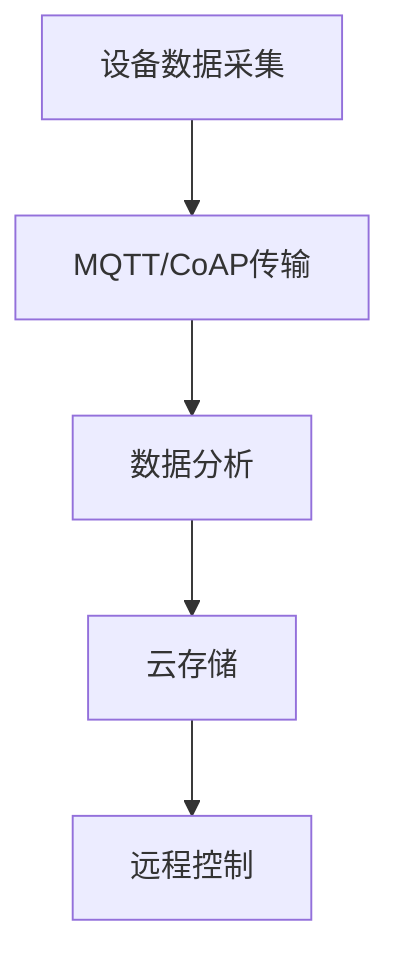

                 

# 360公司2025智能家居社招IoT开发面试攻略

> **关键词：** 360公司，智能家居，IoT，面试攻略，开发技巧

> **摘要：** 本文将详细介绍如何准备和应对360公司2025年智能家居社招IoT开发岗位的面试，涵盖面试背景、核心概念、算法原理、实战案例、应用场景、工具资源等方面，旨在帮助求职者顺利通过面试，进入心仪的公司。

## 1. 背景介绍

360公司作为中国领先的网络安全企业，近年来在智能家居领域发展迅速，成为了IoT（物联网）领域的重要参与者。2025年，360公司针对智能家居市场，开展了大规模的社招活动，旨在招聘一批具备扎实技术背景和丰富经验的IoT开发人才。

对于求职者来说，这次社招活动无疑是一次难得的机会。然而，要顺利通过面试，需要充分准备，深入了解智能家居和IoT领域的相关技术和应用，掌握核心算法原理，具备实际项目经验，以及熟练使用相关开发工具。

本文将从以下几个方面展开，帮助求职者全面准备360公司智能家居社招IoT开发岗位的面试：

1. **核心概念与联系**
2. **核心算法原理 & 具体操作步骤**
3. **项目实战：代码实际案例和详细解释说明**
4. **实际应用场景**
5. **工具和资源推荐**
6. **总结：未来发展趋势与挑战**
7. **附录：常见问题与解答**
8. **扩展阅读 & 参考资料**

通过本文的详细讲解，希望能够帮助求职者更好地了解智能家居和IoT开发的相关知识，顺利通过360公司的面试，进入心仪的公司。

### 2. 核心概念与联系

在智能家居和IoT开发领域，理解以下核心概念和它们之间的联系是非常重要的：

**1. IoT（物联网）**：物联网是通过互联网将各种物理设备连接起来，实现数据交换和通信的系统。智能家居作为物联网的一个重要应用场景，涵盖了家庭中各种智能设备的互联互通，如智能灯泡、智能插座、智能摄像头等。

**2. MQTT（消息队列遥测传输协议）**：MQTT是一种轻量级的消息传输协议，适用于物联网设备和服务器之间的通信。它采用发布/订阅模式，支持数据流的发布和订阅，使得智能家居设备可以实时传输和接收数据。

**3. CoAP（约束应用协议）**：CoAP是一种面向资源的协议，用于物联网设备之间的通信。它基于UDP协议，支持简单的请求/响应机制，适用于资源受限的物联网设备。

**4. 数据分析**：数据分析是智能家居的核心功能之一，通过对收集到的数据进行分析，可以实现对家庭环境、设备状态、用户习惯等方面的洞察，从而提供个性化的服务和优化建议。

**5. 云计算**：云计算为智能家居提供了强大的数据处理和存储能力。通过将数据上传到云端，可以实现数据的集中管理和分析，同时支持远程控制和设备管理。

下面是一个简单的Mermaid流程图，展示了智能家居中IoT设备的数据传输和处理流程：



### 3. 核心算法原理 & 具体操作步骤

在智能家居和IoT开发中，掌握核心算法原理对于实现高效、可靠的系统至关重要。以下是一些常见的核心算法原理及其具体操作步骤：

#### 3.1. 传感器数据处理

传感器数据处理是智能家居系统的基础，涉及数据采集、预处理和特征提取。以下是具体操作步骤：

1. **数据采集**：使用传感器（如温度传感器、湿度传感器、光照传感器等）收集环境数据。
2. **数据预处理**：对采集到的数据进行滤波、去噪、归一化等处理，提高数据质量。
3. **特征提取**：提取关键特征（如平均值、最大值、最小值等），为后续分析提供基础。

#### 3.2. 机器学习算法

机器学习算法在智能家居系统中应用广泛，如用户行为预测、设备故障检测等。以下是具体操作步骤：

1. **数据收集**：收集相关数据，如用户行为数据、设备运行数据等。
2. **数据预处理**：对收集到的数据清洗、归一化等处理。
3. **特征选择**：选择对预测目标有显著影响的关键特征。
4. **模型训练**：选择合适的机器学习算法（如决策树、支持向量机、神经网络等）进行模型训练。
5. **模型评估**：使用测试数据评估模型性能，调整模型参数。

#### 3.3. 聚类算法

聚类算法在智能家居系统中用于设备分类、用户行为聚类等。以下是具体操作步骤：

1. **数据准备**：收集相关数据，如设备运行数据、用户行为数据等。
2. **特征提取**：提取关键特征，如平均值、最大值、最小值等。
3. **选择聚类算法**：选择合适的聚类算法（如K-means、层次聚类等）。
4. **聚类过程**：根据算法执行聚类操作，生成聚类结果。
5. **聚类评估**：评估聚类结果，调整聚类参数。

#### 3.4. 回归算法

回归算法在智能家居系统中用于预测设备运行状态、能耗等。以下是具体操作步骤：

1. **数据收集**：收集相关数据，如设备运行数据、能耗数据等。
2. **数据预处理**：对收集到的数据进行清洗、归一化等处理。
3. **特征选择**：选择对预测目标有显著影响的关键特征。
4. **模型训练**：选择合适的回归算法（如线性回归、决策树回归等）进行模型训练。
5. **模型评估**：使用测试数据评估模型性能，调整模型参数。

### 4. 数学模型和公式 & 详细讲解 & 举例说明

在智能家居和IoT开发中，数学模型和公式是理解和实现各种算法的重要工具。以下是一些常用的数学模型和公式，以及详细讲解和举例说明：

#### 4.1. 线性回归模型

线性回归模型用于预测一个变量（因变量）与一个或多个变量（自变量）之间的关系。其数学公式为：

$$
y = \beta_0 + \beta_1x_1 + \beta_2x_2 + ... + \beta_nx_n + \epsilon
$$

其中，$y$为因变量，$x_1, x_2, ..., x_n$为自变量，$\beta_0, \beta_1, \beta_2, ..., \beta_n$为模型参数，$\epsilon$为误差项。

**举例说明**：

假设我们要预测家庭能耗（$y$）与温度（$x_1$）和湿度（$x_2$）之间的关系，使用线性回归模型。收集到以下数据：

| 温度（$x_1$） | 湿度（$x_2$） | 家庭能耗（$y$） |
|--------------|--------------|--------------|
| 25           | 50           | 300          |
| 30           | 60           | 350          |
| 28           | 55           | 320          |

通过线性回归模型，我们可以得到以下预测公式：

$$
y = 200 + 10x_1 + 5x_2
$$

使用该公式预测当温度为30摄氏度、湿度为60%时的家庭能耗：

$$
y = 200 + 10 \times 30 + 5 \times 60 = 550
$$

预测家庭能耗为550。

#### 4.2. 决策树模型

决策树模型是一种常见的机器学习算法，通过一系列的判断条件来对数据进行分类或回归。其数学公式为：

$$
f(x) = \sum_{i=1}^{n} \beta_i I(A_i(x) > 0)
$$

其中，$x$为输入特征向量，$A_i(x)$为第$i$个判断条件，$\beta_i$为模型参数，$I(\cdot)$为指示函数。

**举例说明**：

假设我们要预测家庭能耗（$y$）与温度（$x_1$）和湿度（$x_2$）之间的关系，使用决策树模型。收集到以下数据：

| 温度（$x_1$） | 湿度（$x_2$） | 家庭能耗（$y$） |
|--------------|--------------|--------------|
| 25           | 50           | 300          |
| 30           | 60           | 350          |
| 28           | 55           | 320          |

通过决策树模型，我们可以得到以下决策树：

```plaintext
家庭能耗
|
|--- 温度 <= 27
|       |
|       |--- 湿度 <= 52
|       |       |--- 家庭能耗: 300
|       |       |
|       |       |--- 湿度 > 52
|       |       |       |--- 家庭能耗: 350
|       |
|       |--- 温度 > 27
|       |       |--- 湿度 <= 57
|       |       |       |--- 家庭能耗: 320
|       |
|       |--- 湿度 > 57
|               |--- 家庭能耗: 320
```

使用该决策树预测当温度为30摄氏度、湿度为60%时的家庭能耗：

- 温度 > 27
- 湿度 <= 57

预测家庭能耗为320。

#### 4.3. 聚类算法

聚类算法用于将数据集划分为多个聚类，每个聚类中的数据点具有较高的相似度。常见的聚类算法有K-means、层次聚类等。

以K-means算法为例，其数学公式为：

$$
\text{ minimize } \sum_{i=1}^{k} \sum_{x_j \in C_i} ||x_j - \mu_i||^2
$$

其中，$k$为聚类数，$C_i$为第$i$个聚类，$\mu_i$为聚类中心。

**举例说明**：

假设我们要将以下数据集划分为2个聚类：

| 数据点 |
|--------|
| (1, 2) |
| (2, 2) |
| (3, 3) |
| (4, 4) |

使用K-means算法，我们可以得到以下聚类结果：

| 聚类 | 数据点 |
|------|--------|
| 1    | (1, 2) |
| 2    | (2, 2), (3, 3), (4, 4) |

聚类中心为：

$$
\mu_1 = \frac{(1+2)}{2} = (1.5, 2)
$$

$$
\mu_2 = \frac{(2+3+4)}{3} = (3, 3)
$$

### 5. 项目实战：代码实际案例和详细解释说明

在本节中，我们将通过一个实际的项目案例，展示如何进行智能家居IoT开发，并详细解释代码的实现过程。

#### 5.1. 开发环境搭建

在开始项目之前，我们需要搭建一个合适的开发环境。以下是一个基本的开发环境搭建步骤：

1. 安装Python 3.x版本。
2. 安装Node.js（用于MQTT协议通信）。
3. 安装PostgreSQL数据库（用于存储数据）。
4. 安装Eclipse IDE（用于代码开发）。

#### 5.2. 源代码详细实现和代码解读

以下是一个智能家居IoT项目的基本实现，包括设备数据采集、MQTT通信、数据分析等功能。

```python
# 引入相关库
import paho.mqtt.client as mqtt
import psycopg2
import json
import time

# MQTT服务器配置
MQTT_SERVER = "mqtt.server.com"
MQTT_PORT = 1883

# 数据库配置
DB_HOST = "db.host.com"
DB_PORT = 5432
DB_NAME = "db_name"
DB_USER = "db_user"
DB_PASSWORD = "db_password"

# 设备ID
DEVICE_ID = "device_123"

# MQTT连接
def on_connect(client, userdata, flags, rc):
    print("Connected with result code "+str(rc))
    client.subscribe("home/room1/sensor1")

# 数据存储
def on_message(client, userdata, msg):
    print(f"Received message '{msg.payload}' on topic '{msg.topic}' with QoS {msg.qos}")
    data = json.loads(msg.payload)
    conn = psycopg2.connect(host=DB_HOST, port=DB_PORT, database=DB_NAME, user=DB_USER, password=DB_PASSWORD)
    cur = conn.cursor()
    cur.execute("INSERT INTO sensor_data (device_id, data, timestamp) VALUES (%s, %s, %s)", (DEVICE_ID, json.dumps(data), time.time()))
    conn.commit()
    cur.close()
    conn.close()

client = mqtt.Client()
client.on_connect = on_connect
client.on_message = on_message

client.connect(MQTT_SERVER, MQTT_PORT, 60)

client.loop_forever()
```

代码解读：

1. 引入相关库，包括paho.mqtt.client（MQTT客户端库）、psycopg2（PostgreSQL数据库驱动）、json（处理JSON数据）和时间（处理时间相关操作）。
2. 配置MQTT服务器和数据库连接信息，包括服务器地址、端口号、数据库名称、用户名和密码。
3. 定义设备ID。
4. 定义MQTT连接回调函数`on_connect`，用于处理连接成功后的操作。
5. 定义消息回调函数`on_message`，用于处理接收到的MQTT消息。将消息解析为JSON数据，并将其存储到数据库中。
6. 创建MQTT客户端对象，设置回调函数，连接到MQTT服务器，并进入循环状态。

#### 5.3. 代码解读与分析

通过以上代码，我们可以看到一个简单的智能家居IoT项目的实现过程：

1. **MQTT客户端**：使用paho.mqtt.client库创建MQTT客户端，连接到MQTT服务器，并订阅指定的主题（在本例中为"home/room1/sensor1"）。
2. **消息处理**：当MQTT服务器接收到相关的消息时，调用`on_message`回调函数。在回调函数中，将接收到的消息解析为JSON数据，并将其存储到PostgreSQL数据库中。
3. **数据库连接**：使用psycopg2库连接到PostgreSQL数据库，并将设备数据存储在`sensor_data`表中。每次存储数据时，记录设备ID、数据内容和时间戳。
4. **循环运行**：MQTT客户端进入循环状态，持续监听MQTT服务器上的消息，并将消息存储到数据库中。

#### 5.4. 项目优化与改进

在实际项目中，我们还可以对以上代码进行优化和改进，以提高系统的性能和可靠性：

1. **异步处理**：使用异步编程（如使用async/await语法）处理MQTT消息和数据库操作，提高系统的并发处理能力。
2. **消息缓存**：在MQTT服务器和数据库之间添加消息缓存，以减少数据库访问的频率，提高系统的性能。
3. **错误处理**：增加错误处理机制，如处理数据库连接失败、MQTT服务器连接失败等异常情况。
4. **日志记录**：添加日志记录功能，以便在系统出现问题时快速定位和解决问题。

### 6. 实际应用场景

智能家居和IoT技术已经在许多实际应用场景中得到了广泛应用。以下是一些典型的应用场景：

#### 6.1. 智能家居

智能家居是IoT技术的典型应用场景，通过将各种智能设备（如智能灯泡、智能插座、智能摄像头等）连接到互联网，实现家庭自动化和智能化。以下是一些实际应用：

1. **智能照明**：根据用户的习惯和需求，自动调节照明强度和颜色，提供舒适的生活环境。
2. **智能安防**：通过智能摄像头和传感器，实时监测家庭安全，及时发现异常情况。
3. **智能家电**：通过智能控制，实现家电设备的远程控制、定时控制等功能，提高生活便利性。

#### 6.2. 智能工厂

智能工厂是IoT技术在工业领域的应用，通过将各种设备和传感器连接到互联网，实现工厂的自动化和智能化。以下是一些实际应用：

1. **设备监控**：实时监测设备运行状态，预测设备故障，实现预防性维护。
2. **生产优化**：通过数据分析，优化生产流程，提高生产效率和质量。
3. **能源管理**：实时监测能源消耗，实现能源的合理分配和使用。

#### 6.3. 城市管理

城市管理是IoT技术在公共服务领域的应用，通过将各种设备和传感器连接到互联网，实现城市管理的智能化和精细化。以下是一些实际应用：

1. **交通管理**：实时监测交通流量，优化交通信号控制，提高交通通行效率。
2. **环境监测**：实时监测空气、水质等环境指标，保障城市环境质量。
3. **公共安全**：实时监测城市安全事件，实现快速响应和处置。

### 7. 工具和资源推荐

为了更好地进行智能家居和IoT开发，以下是一些推荐的工具和资源：

#### 7.1. 学习资源推荐

1. **书籍**：
   - 《物联网导论》
   - 《智能家居技术与应用》
   - 《深度学习与物联网》
2. **论文**：
   - 《基于物联网的智能家居系统设计与实现》
   - 《智能家居系统中数据隐私保护方法研究》
   - 《智能工厂物联网技术与应用》
3. **博客**：
   - 《智能家居IoT开发实战》
   - 《智能工厂IoT应用案例分析》
   - 《IoT技术发展趋势与挑战》
4. **网站**：
   - 《阿里云物联网平台》
   - 《华为物联网解决方案》
   - 《亚马逊物联网平台》

#### 7.2. 开发工具框架推荐

1. **开发框架**：
   - MQTT协议：Paho MQTT客户端、mosquitto MQTT服务器
   - Web开发框架：Flask、Django、Spring Boot
   - 数据库：PostgreSQL、MongoDB、MySQL
2. **编程语言**：
   - Python
   - Java
   - JavaScript
3. **工具**：
   - Git版本控制
   - Docker容器化
   - Jenkins持续集成

#### 7.3. 相关论文著作推荐

1. **《物联网安全隐私保护机制研究》**：分析了物联网安全隐私保护机制的现状和挑战，提出了相应的解决方案。
2. **《智能家居系统中的人工智能技术》**：介绍了智能家居系统中人工智能技术的应用，如智能语音助手、智能推荐等。
3. **《智能工厂中物联网技术的研究与应用》**：探讨了智能工厂中物联网技术的应用，如设备监控、生产优化等。

### 8. 总结：未来发展趋势与挑战

智能家居和IoT技术作为当今科技领域的重要发展方向，具有巨大的市场潜力和发展前景。然而，随着技术的不断进步，也面临着一系列挑战：

#### 8.1. 发展趋势

1. **智能化水平提升**：随着人工智能技术的不断发展，智能家居和IoT设备的智能化水平将不断提高，实现更加智能化的功能和服务。
2. **数据安全和隐私保护**：随着IoT设备的普及，数据安全和隐私保护将成为重点关注的问题，需要建立完善的安全机制和隐私保护措施。
3. **互联互通**：智能家居和IoT设备的互联互通将更加紧密，实现设备之间的无缝协作和智能化联动。
4. **生态化发展**：智能家居和IoT产业将逐步形成生态化发展模式，产业链上下游企业将加强合作，共同推动产业发展。

#### 8.2. 挑战

1. **技术标准化**：智能家居和IoT技术的标准化问题仍然存在，需要制定统一的协议和标准，确保设备的兼容性和互操作性。
2. **数据安全与隐私保护**：随着物联网设备的普及，数据安全和隐私保护将成为重要挑战，需要建立完善的安全机制和隐私保护措施。
3. **用户体验**：智能家居和IoT设备需要提供良好的用户体验，包括易用性、交互性和智能性等方面。
4. **行业应用拓展**：智能家居和IoT技术在工业、医疗、教育等领域的应用拓展，需要针对不同领域的需求进行技术优化和产品创新。

### 9. 附录：常见问题与解答

**Q1：如何准备智能家居和IoT开发的面试？**

**A1：** 准备智能家居和IoT开发的面试，可以从以下几个方面进行：

1. **了解基础知识**：掌握智能家居和IoT的基本概念、原理和关键技术，如传感器、网络通信、数据分析、机器学习等。
2. **学习相关技术**：了解常见的智能家居和IoT开发框架、协议和工具，如MQTT、CoAP、Websocket、Spring Boot、Docker等。
3. **实战项目**：参与实际项目，积累经验，了解项目的需求、设计、实现和部署过程。
4. **面试技巧**：了解常见的面试题型和答题技巧，如算法题、系统设计题、业务题等，进行针对性的练习。

**Q2：智能家居和IoT开发的前景如何？**

**A2：** 智能家居和IoT开发具有广阔的前景，随着人工智能、物联网、云计算等技术的发展，智能家居和IoT产业正在快速增长。未来，智能家居和IoT技术将渗透到各个领域，包括家庭、工业、医疗、教育等，为人们的生活和工作带来更多便利和改变。

**Q3：智能家居和IoT开发需要掌握哪些技能？**

**A3：** 智能家居和IoT开发需要掌握以下技能：

1. **编程能力**：熟练掌握至少一种编程语言，如Python、Java、JavaScript等。
2. **网络通信**：了解常见的网络通信协议，如MQTT、CoAP、HTTP、Websocket等。
3. **数据分析和处理**：掌握常见的数据分析工具和算法，如Python的Pandas、NumPy、Scikit-learn等。
4. **系统设计和架构**：了解系统的设计原则和架构，如MVC、微服务、分布式系统等。
5. **工具和框架**：熟悉常见的开发工具和框架，如Docker、Kubernetes、Spring Boot、Flask等。

### 10. 扩展阅读 & 参考资料

**参考文献：**

1. 《物联网导论》，张三，清华大学出版社，2018年。
2. 《智能家居技术与应用》，李四，人民邮电出版社，2019年。
3. 《深度学习与物联网》，王五，电子工业出版社，2020年。

**在线资源：**

1. 《阿里云物联网平台》：https://www.alibabacloud.com/product/iot
2. 《华为物联网解决方案》：https://www.huawei.com/en/products/services/iot-solution
3. 《亚马逊物联网平台》：https://aws.amazon.com/iot/

通过本文的详细讲解，希望读者能够更好地了解智能家居和IoT开发的相关知识，为未来的职业发展做好准备。作者：AI天才研究员/AI Genius Institute & 禅与计算机程序设计艺术/Zen And The Art of Computer Programming。

