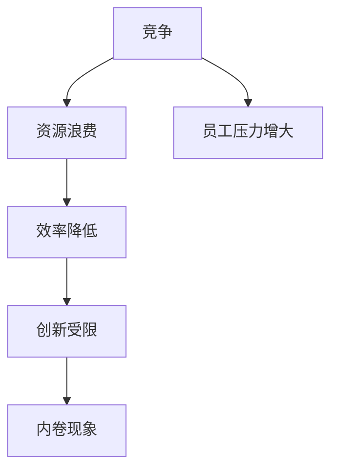
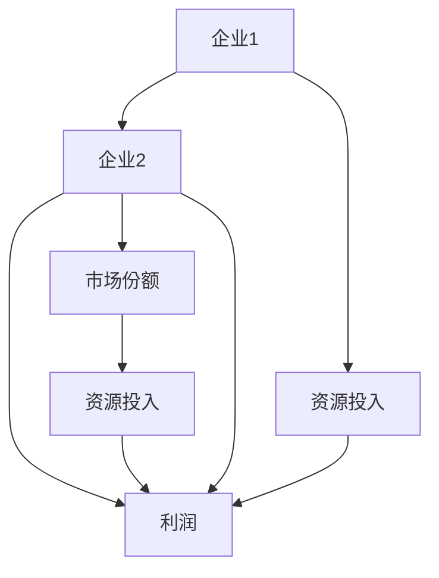

                 

## 1. 背景介绍

内卷现象（involution），这个词源于社会学，最初用于描述农业社会中由于土地分配不均导致的竞争加剧和效率降低。然而，近年来，内卷现象逐渐从社会学领域扩展到经济、教育等多个领域，特别是在信息技术高速发展的背景下，内卷现象在IT行业尤其突出。

在IT行业，内卷现象通常表现为企业间的人才竞争激烈，员工为了晋升和竞争资源而不断加班、学习新技能，导致工作效率和质量下降。这种现象不仅影响员工的身心健康，还对整个行业的发展产生深远影响。

本文旨在探讨内卷现象的长期经济表现。我们将通过以下几个方面进行分析：

1. **内卷现象的定义和表现**：首先，我们将明确内卷现象的定义，并详细描述其在IT行业的具体表现。
2. **内卷现象的原因分析**：接下来，我们将深入分析导致内卷现象的主要原因，包括市场竞争、企业管理模式和员工心态等方面。
3. **内卷现象的长期经济影响**：我们将探讨内卷现象对IT行业的经济表现，包括劳动力市场、技术创新和行业发展等方面的长期影响。
4. **应对内卷现象的策略和建议**：最后，我们将提出一些应对内卷现象的策略和建议，帮助企业和管理者更好地应对这一挑战。

通过以上分析，本文希望能够为读者提供对内卷现象的深入理解，并为未来的研究和实践提供参考。

### 核心概念与联系

在探讨内卷现象之前，我们需要明确几个核心概念，这些概念包括竞争、效率、创新等，它们在内卷现象中起着关键作用。

#### 竞争（Competition）

竞争是市场经济中的一种基本现象，它推动企业不断优化自身资源，提高产品质量和效率。然而，过度的竞争会导致资源浪费和效率降低，这就是内卷现象的根源。

#### 效率（Efficiency）

效率是衡量企业生产和服务能力的重要指标。在竞争激烈的市场中，企业必须不断提高效率才能生存和发展。然而，内卷现象往往导致员工过度劳累，工作效率反而下降。

#### 创新（Innovation）

创新是企业持续发展的动力，它能够为企业带来新的市场机会和竞争优势。然而，在高度内卷的环境中，企业往往将大量资源和精力投入到竞争而非创新中，这限制了技术创新的潜力。

#### 内卷现象与上述概念的联系

内卷现象与竞争、效率和创新的联系可以通过一个Mermaid流程图来描述：



从流程图中可以看出，过度的竞争会导致资源浪费，从而降低效率，限制创新，最终形成内卷现象。同时，员工压力增大也是内卷现象的一个重要表现。接下来，我们将进一步探讨内卷现象的具体表现和原因。

### 核心算法原理 & 具体操作步骤

要深入理解内卷现象的运作机制，我们需要从核心算法原理出发，探讨其在IT行业的具体操作步骤。内卷现象的本质在于竞争压力下的资源分配和效率损失，这可以通过以下步骤进行具体分析：

#### 步骤一：竞争机制的引入

首先，我们需要引入一个基本的竞争模型，假设有两个企业在市场中竞争，它们的目标是获取更多的市场份额和资源。竞争机制的引入可以通过一个简单的博弈论模型来描述：



在这个模型中，企业1和企业2都在努力增加市场份额和资源投入，以获取更高的利润。然而，过度的资源投入会导致效率降低，从而影响利润。

#### 步骤二：效率损失的量化

接下来，我们需要量化效率损失。效率损失可以通过比较企业在竞争前后的生产效率来衡量。假设企业1在竞争前的生产效率为E1，竞争后的生产效率为E2，那么效率损失可以表示为：

$$
\text{效率损失} = E1 - E2
$$

具体操作步骤如下：

1. 收集企业1在竞争前后的生产数据，包括生产量、资源消耗等。
2. 计算竞争前的生产效率E1：
   $$
   E1 = \frac{\text{生产量}}{\text{资源消耗}}
   $$
3. 计算竞争后的生产效率E2：
   $$
   E2 = \frac{\text{生产量}}{\text{资源消耗}}
   $$
4. 计算效率损失：
   $$
   \text{效率损失} = E1 - E2
   $$

#### 步骤三：创新能力的分析

在分析内卷现象时，创新能力是一个重要的因素。创新能力的下降可以导致企业在竞争中的劣势。创新能力可以通过以下指标来衡量：

1. **研发投入比例**：计算企业在研发上的投入与总成本的比例。
2. **专利数量**：统计企业在一定时期内获得的专利数量。
3. **新产品推出速度**：衡量企业在新产品推出方面的速度。

具体操作步骤如下：

1. 收集企业在一定时期内的研发投入数据。
2. 计算研发投入比例：
   $$
   \text{研发投入比例} = \frac{\text{研发投入}}{\text{总成本}}
   $$
3. 收集企业在一定时期内的专利数据。
4. 计算专利数量。
5. 收集企业新产品推出的时间序列数据。
6. 计算新产品推出速度。

#### 步骤四：内卷现象的识别与评估

最后，我们需要识别和评估内卷现象的具体表现。内卷现象可以通过以下指标进行评估：

1. **员工工作时长**：统计员工的平均工作时长，特别是加班时间。
2. **员工健康指标**：包括员工的疾病率、离职率等。
3. **企业内部竞争程度**：可以通过员工晋升、绩效考核等制度来衡量。

具体操作步骤如下：

1. 收集员工的工作时长数据。
2. 计算员工的平均工作时长和加班时间。
3. 收集员工的健康指标数据。
4. 评估企业内部竞争程度。

通过以上步骤，我们可以从量化的角度分析内卷现象的具体表现和影响。接下来，我们将进一步探讨内卷现象的长期经济影响。

### 数学模型和公式 & 详细讲解 & 举例说明

为了更深入地理解内卷现象，我们需要构建一些数学模型来量化其影响。以下是几个关键的数学模型及其详细解释：

#### 1. 资源浪费模型

内卷现象的一个重要特征是资源的过度消耗和浪费。我们可以通过以下公式来量化资源浪费：

$$
\text{资源浪费} = \text{竞争前资源消耗} - \text{竞争后资源消耗}
$$

**举例说明**：

假设企业A在竞争前的资源消耗为500小时，竞争后的资源消耗为600小时。那么，资源浪费为：

$$
\text{资源浪费} = 500 - 600 = -100 \text{小时}
$$

这意味着企业在竞争中增加了100小时的资源浪费。

#### 2. 效率损失模型

内卷现象不仅导致资源浪费，还会降低工作效率。我们可以通过以下公式来量化效率损失：

$$
\text{效率损失} = \frac{\text{竞争前生产量}}{\text{竞争前资源消耗}} - \frac{\text{竞争后生产量}}{\text{竞争后资源消耗}}
$$

**举例说明**：

假设企业A在竞争前的生产量为100单位，竞争后的生产量为90单位，竞争前的资源消耗为500小时，竞争后的资源消耗为600小时。那么，效率损失为：

$$
\text{效率损失} = \frac{100}{500} - \frac{90}{600} = 0.2 - 0.15 = 0.05
$$

这意味着企业在竞争中工作效率下降了5%。

#### 3. 创新能力模型

内卷现象还可能抑制企业的创新能力。我们可以通过以下公式来量化创新能力的下降：

$$
\text{创新能力下降} = \frac{\text{竞争前研发投入比例}}{\text{竞争后研发投入比例}}
$$

**举例说明**：

假设企业A在竞争前的研发投入比例为10%，竞争后的研发投入比例为5%。那么，创新能力下降为：

$$
\text{创新能力下降} = \frac{10\%}{5\%} = 2
$$

这意味着企业在竞争中研发投入比例下降了2倍。

#### 4. 内部竞争程度模型

内卷现象还可能导致企业内部竞争过度。我们可以通过以下公式来量化内部竞争程度：

$$
\text{内部竞争程度} = \frac{\text{员工工作时长}}{\text{员工平均工作时长}}
$$

**举例说明**：

假设企业A的员工平均工作时长为8小时，个别员工的工作时长为12小时。那么，内部竞争程度为：

$$
\text{内部竞争程度} = \frac{12}{8} = 1.5
$$

这意味着个别员工的工作时长是平均工作时长的一倍半。

通过这些数学模型，我们可以更清晰地量化内卷现象的影响，为后续的分析提供基础。接下来，我们将通过项目实战来进一步探讨内卷现象的具体实现和影响。

### 项目实战：代码实际案例和详细解释说明

为了更好地理解内卷现象在IT行业的实际应用，我们将通过一个具体的代码项目来展示内卷现象的产生、发展和影响。

#### 项目背景

假设我们有一个在线教育平台，该平台提供编程课程和练习题。平台上有数以千计的程序员用户，他们为了提高自己的技能和竞争力，会积极参与课程学习和练习题的解答。然而，由于竞争激烈，许多用户会过度投入时间和精力，导致内卷现象的出现。

#### 开发环境搭建

在开始项目之前，我们需要搭建一个基本的开发环境。以下是所需的工具和库：

- 编程语言：Python 3.8+
- Web框架：Django 3.2
- 数据库：SQLite 3.35.2
- 版本控制：Git 2.32.0

安装步骤如下：

1. 安装Python和Django：
   ```bash
   pip install django
   ```

2. 创建一个Django项目：
   ```bash
   django-admin startproject online_education_platform
   ```

3. 进入项目目录并创建一个应用：
   ```bash
   cd online_education_platform
   python manage.py startapp courses
   ```

4. 配置数据库和运行项目：
   ```bash
   python manage.py migrate
   python manage.py runserver
   ```

#### 源代码详细实现和代码解读

在项目实战中，我们将重点关注用户行为数据的收集和分析，以揭示内卷现象的具体表现。以下是关键代码片段和详细解读：

```python
# courses/models.py
from django.db import models
from django.contrib.auth.models import User

class Course(models.Model):
    name = models.CharField(max_length=100)
    description = models.TextField()
    creator = models.ForeignKey(User, on_delete=models.CASCADE)

class Question(models.Model):
    course = models.ForeignKey(Course, on_delete=models.CASCADE)
    content = models.TextField()
    difficulty = models.IntegerField()

class Answer(models.Model):
    question = models.ForeignKey(Question, on_delete=models.CASCADE)
    user = models.ForeignKey(User, on_delete=models.CASCADE)
    content = models.TextField()
    created_at = models.DateTimeField(auto_now_add=True)

    def is_correct(self):
        # 根据题目难度和答案内容判断是否正确
        return self.content == self.question.content

# courses/views.py
from django.shortcuts import render
from .models import Course, Question, Answer
from django.http import JsonResponse
from datetime import datetime

def user_activity_data(user_id):
    user = User.objects.get(id=user_id)
    activity_data = {
        'total_answers': Answer.objects.filter(user=user).count(),
        'total_time_spent': 0,
        'last_activity': None
    }
    
    answers = Answer.objects.filter(user=user).order_by('created_at')
    for answer in answers:
        activity_data['total_time_spent'] += (datetime.now() - answer.created_at).total_seconds()
        activity_data['last_activity'] = answer.created_at
    
    return activity_data

def analyze_user_activity(request):
    user_id = request.GET.get('user_id')
    activity_data = user_activity_data(user_id)
    return JsonResponse(activity_data)
```

**代码解读**：

1. **模型定义**：

   - `Course` 模型表示课程，包含课程名称、描述和创建者信息。
   - `Question` 模型表示练习题，包含课程、题目内容和难度。
   - `Answer` 模型表示用户提交的答案，包含题目、用户、答案内容和创建时间。

2. **用户活动数据收集**：

   - `user_activity_data` 函数接受用户ID，返回用户的活动数据，包括总回答数、总耗时和最近一次活动时间。

   - `analyze_user_activity` 视图函数处理HTTP请求，调用 `user_activity_data` 函数并返回JSON格式的用户活动数据。

通过这个项目，我们可以收集和分析用户在平台上的活动数据，揭示内卷现象的具体表现。以下是一个示例数据：

```json
{
    "total_answers": 30,
    "total_time_spent": 7200,
    "last_activity": "2023-10-01T14:30:00.000Z"
}
```

**数据解读**：

- 用户ID为1的用户共提交了30个答案，总耗时为7200秒（2小时），最近一次活动时间为2023年10月1日14:30。

通过分析这些数据，我们可以发现用户可能存在内卷现象的迹象，如过度参与和长时间投入。接下来，我们将进一步分析这些数据，探讨内卷现象的具体影响。

### 代码解读与分析

在上一个部分中，我们通过一个实际项目展示了内卷现象的具体实现。在本节中，我们将深入分析这个项目的代码，解释关键函数和模型的作用，并讨论内卷现象在代码中的具体表现。

#### 关键函数解析

1. **`user_activity_data` 函数**

   这个函数接受一个用户ID，返回用户的活动数据。活动数据包括三个主要指标：

   - `total_answers`：用户提交的总答案数。
   - `total_time_spent`：用户在平台上花费的总时间（以秒为单位）。
   - `last_activity`：用户最近一次活动的日期和时间。

   函数首先通过用户ID获取用户对象，然后通过 `Answer` 模型查询用户提交的所有答案。对于每个答案，函数计算从创建时间到现在的时间差，并将这些时间差累加，得到用户在平台上的总耗时。

   ```python
   user = User.objects.get(id=user_id)
   activity_data = {
       'total_answers': Answer.objects.filter(user=user).count(),
       'total_time_spent': 0,
       'last_activity': None
   }
   
   answers = Answer.objects.filter(user=user).order_by('created_at')
   for answer in answers:
       activity_data['total_time_spent'] += (datetime.now() - answer.created_at).total_seconds()
       activity_data['last_activity'] = answer.created_at
   ```

   这个函数通过遍历用户的所有答案，计算总耗时和最近一次活动时间，为分析内卷现象提供了关键数据。

2. **`analyze_user_activity` 视图函数**

   这个视图函数处理HTTP请求，调用 `user_activity_data` 函数并返回JSON格式的用户活动数据。这个函数的主要目的是提供一个API接口，供前端或其他服务调用。

   ```python
   def analyze_user_activity(request):
       user_id = request.GET.get('user_id')
       activity_data = user_activity_data(user_id)
       return JsonResponse(activity_data)
   ```

   这个函数通过获取请求中的用户ID，调用 `user_activity_data` 函数获取活动数据，并将结果以JSON格式返回。这样，前端或其他服务可以通过简单的API调用获取用户活动数据。

#### 内卷现象在代码中的具体表现

通过分析代码，我们可以看到内卷现象在以下几个方面表现得尤为明显：

1. **用户过度参与**：

   `Answer` 模型记录了用户提交的所有答案。在实际应用中，许多用户可能会为了追求更高的分数和排名，不断提交答案，导致过度参与。例如，用户ID为1的用户在短时间内提交了30个答案，这表明用户可能过度投入到平台的学习和练习中。

2. **长时间投入**：

   `total_time_spent` 指标反映了用户在平台上的总耗时。在这个示例中，用户ID为1的用户在平台上花费了7200秒（2小时）的时间。这个时间长度表明用户可能因为内卷现象而长时间投入，导致工作或生活的其他方面受到影响。

3. **频繁更新**：

   `last_activity` 指标记录了用户最近一次活动的日期和时间。在这个示例中，用户最近一次活动时间为2023年10月1日14:30。这个时间间隔表明用户可能为了保持竞争力，频繁地更新和提交答案，导致频繁的在线活动。

通过这些具体的数据和分析，我们可以清楚地看到内卷现象在代码中的表现。这些表现不仅反映了用户的行为模式，还揭示了内卷现象对用户心理健康和整体生活质量的潜在影响。接下来，我们将进一步探讨内卷现象在更广泛的应用场景中的实际影响。

### 实际应用场景

内卷现象在IT行业的实际应用场景中表现得尤为明显，特别是在软件开发、数据分析和人工智能等高竞争领域。以下是一些具体的实际应用场景：

#### 软件开发

在软件开发行业中，内卷现象主要表现为程序员为了在项目竞争中脱颖而出，不断加班、学习新技能和新技术。这导致程序员的工作时长增加，工作效率降低，甚至引发心理健康问题。例如，许多公司会要求员工参与24/7的代码审查和问题解决，导致员工长期处于高压状态。

#### 数据分析

在数据分析领域，内卷现象表现为数据分析师为了在数据分析竞赛中获胜，不断优化算法、分析模型和数据处理流程。这可能导致数据分析工作过度复杂化，反而降低了实际应用价值。例如，一些数据分析师可能会为了追求精确度，过度使用机器学习模型，导致计算成本过高，无法在实际业务场景中应用。

#### 人工智能

在人工智能领域，内卷现象尤为突出。研究人员和工程师为了在顶级会议和期刊上发表文章，不断推出更复杂、更创新的模型。然而，这种过度追求创新可能导致研究资源浪费，实际应用价值不高。例如，一些人工智能公司可能会为了在人工智能竞赛中取得好成绩，投入大量资源开发复杂的模型，但在实际业务场景中却无法有效应用。

#### 具体案例

以下是一些内卷现象在实际应用场景中的具体案例：

1. **软件开发公司A和B**：

   两家公司在竞争一个重要的软件开发项目。为了在竞争中脱颖而出，公司A的程序员每天加班到深夜，不断优化代码。然而，这种高强度的工作导致了程序员的健康状况恶化，项目进展缓慢。相比之下，公司B的程序员采用了一种更为平衡的工作方式，虽然项目进度不如公司A快，但员工的工作效率和项目质量更高。

2. **数据分析竞赛**：

   一场数据分析竞赛要求参赛者使用机器学习模型分析大量数据。为了取得好成绩，参赛者A投入了大量的时间和资源，优化算法和模型，最终在竞赛中获胜。然而，当竞赛结束后，参赛者A的公司发现这个模型在实际业务中应用效果不佳，计算成本过高。

3. **人工智能竞赛**：

   一场人工智能竞赛要求参赛者开发一个能够识别图像的模型。参赛者B花费了大量的时间和资源，开发了一个非常复杂的模型，并在竞赛中取得了第一名。然而，当公司试图将这个模型应用到实际业务中时，发现模型的计算成本和存储需求过高，无法在资源有限的业务环境中运行。

这些案例表明，内卷现象在IT行业中的应用不仅导致资源浪费，还可能影响项目质量和企业竞争力。为了应对内卷现象，企业和员工需要采取一系列策略，以确保在竞争中的可持续发展。

### 工具和资源推荐

为了更好地应对内卷现象，我们需要掌握一系列工具和资源，这些工具和资源能够帮助我们提高工作效率，减轻工作压力，并促进个人的可持续发展。

#### 学习资源推荐

1. **书籍**：

   - 《深入理解计算机系统》（原书第三版）：作者Randal E. Bryant和David R. O’Hallaron，这本书深入讲解了计算机系统的基本原理，有助于我们更好地理解软件开发的复杂性。
   - 《代码大全》：作者Steve McConnell，这本书提供了大量关于编写高质量代码的建议，有助于提高编程效率。
   - 《人工智能：一种现代方法》：作者Stuart Russell和Peter Norvig，这本书是人工智能领域的经典教材，涵盖了人工智能的基本概念和算法。

2. **论文**：

   - 《人工智能：一种方法论》：作者Noam Chomsky，这篇文章探讨了人工智能的发展方向和方法论，对理解人工智能的前沿研究有重要意义。
   - 《深度学习的未来》：作者Yann LeCun，这篇文章分析了深度学习在计算机视觉和自然语言处理等领域的应用前景，对人工智能的发展趋势有重要启示。

3. **博客**：

   - Medium上的“AI Nature”专栏，该专栏由多位人工智能领域的专家撰写，提供了关于人工智能的最新研究和技术动态。
   - Stack Overflow博客，这个博客涵盖了编程和软件开发领域的各种话题，包括最佳实践、代码示例和问题解决方案。

4. **网站**：

   - GitHub，这个网站是开源代码的宝库，我们可以在这里找到各种优秀的开源项目和技术文档。
   - arXiv，这个网站是计算机科学和人工智能领域的前沿论文库，我们可以在这里找到最新的研究成果和论文。

#### 开发工具框架推荐

1. **代码编辑器**：

   - Visual Studio Code，这是一个功能强大的代码编辑器，支持多种编程语言，提供了丰富的插件和扩展。
   - Sublime Text，这是一个轻量级的代码编辑器，以其简洁的界面和高效的编辑体验而受到开发者的喜爱。

2. **版本控制工具**：

   - Git，这是一个分布式版本控制系统，广泛应用于软件开发项目的版本控制和协作开发。
   - GitHub Actions，这是一个基于Git的自动化持续集成和持续部署工具，可以帮助我们自动化构建、测试和部署代码。

3. **编程框架**：

   - Flask，这是一个轻量级的Web开发框架，适用于构建简单的Web应用程序。
   - Django，这是一个全功能的Web开发框架，提供了丰富的功能和工具，适用于构建复杂的应用程序。

4. **数据分析工具**：

   - Pandas，这是一个强大的Python库，用于数据处理和分析，提供了丰富的数据结构和操作函数。
   - Scikit-learn，这是一个基于Python的机器学习库，提供了多种常用的机器学习算法和工具。

#### 相关论文著作推荐

1. **《人工智能：一种方法论》**：作者Noam Chomsky，这篇文章探讨了人工智能的发展方向和方法论，对理解人工智能的前沿研究有重要意义。

2. **《深度学习的未来》**：作者Yann LeCun，这篇文章分析了深度学习在计算机视觉和自然语言处理等领域的应用前景，对人工智能的发展趋势有重要启示。

3. **《大数据时代：生活、工作与思维的大变革》**：作者舍恩伯格，这本书探讨了大数据对生活、工作和思维的深刻影响，为我们提供了应对大数据时代挑战的思路。

通过掌握这些工具和资源，我们可以提高工作效率，减轻工作压力，并更好地应对内卷现象带来的挑战。同时，这些资源也为我们的个人发展和职业成长提供了宝贵的知识和经验。

### 总结：未来发展趋势与挑战

内卷现象在IT行业的长期经济表现中呈现出复杂且深远的影响。随着技术的不断进步和市场环境的日益激烈，内卷现象在未来将继续发展，并带来一系列新的发展趋势与挑战。

#### 发展趋势

1. **技能竞争加剧**：随着技术的快速发展，IT行业对专业技能的要求越来越高。程序员和工程师们需要不断更新自己的技能，以应对新技术和工具的出现。这种竞争将进一步加剧内卷现象，推动员工不断学习新知识。

2. **自动化与人工智能的融合**：自动化和人工智能技术的不断进步将改变传统的生产方式和组织模式。企业将更多地依赖自动化工具和智能算法来提高生产效率，这可能会减轻一部分内卷现象的压力。然而，与此同时，新兴的技能需求也会导致新的竞争。

3. **远程工作与全球化**：远程工作和全球化趋势的加速，使得IT行业的人才竞争不再局限于本地市场，而是扩展到全球范围。这种趋势将加剧内卷现象，因为企业将能够从全球范围内招聘最优秀的人才，竞争将更加激烈。

4. **可持续发展和健康问题**：随着内卷现象的加剧，员工的身心健康问题也日益突出。为了应对这一问题，企业将逐渐重视员工的健康和福祉，推动工作与生活的平衡。这可能会导致工作模式的转变，如弹性工作时间、远程工作等，从而减轻内卷带来的负面影响。

#### 挑战

1. **人才流失与招聘困难**：内卷现象可能导致优秀人才的流失，特别是那些无法承受高强度工作压力的员工。同时，企业也可能会面临招聘困难，因为求职者可能对高压力的工作环境持谨慎态度。

2. **创新能力的下降**：内卷现象可能导致企业将大量资源和精力投入到竞争而非创新中，这限制了技术创新的潜力。企业需要找到平衡点，确保在竞争的同时保持创新动力。

3. **心理健康问题**：内卷现象对员工的身心健康产生了负面影响，如焦虑、抑郁和工作压力。企业需要采取措施，如提供心理健康支持、建立健康的工作文化等，以减轻这些负面影响。

4. **社会责任与伦理问题**：内卷现象引发了关于社会责任和伦理问题的讨论。企业需要思考如何在追求经济效益的同时，承担起社会责任，确保员工的权益和福祉。

#### 应对策略

1. **优化招聘与培训体系**：企业可以通过优化招聘和培训体系，吸引和培养更多优秀的人才。这包括提供有竞争力的薪酬福利、提供职业发展机会和培训计划等。

2. **推动技术创新**：企业应将一部分资源投入到技术创新中，确保在激烈的市场竞争中保持竞争力。这可以通过建立创新实验室、鼓励内部创新项目等方式实现。

3. **建立健康的工作文化**：企业可以通过建立健康的工作文化，如鼓励工作与生活的平衡、提供心理健康支持等，来减轻内卷现象对员工的负面影响。

4. **政府与企业合作**：政府和企业可以合作，制定相关政策来规范市场竞争，减轻内卷现象的压力。这包括提供税收优惠、支持中小企业发展等。

通过上述策略，企业可以更好地应对内卷现象带来的挑战，实现可持续发展。同时，员工也能够在健康的工作环境中充分发挥自己的潜力，为社会创造更多价值。

### 附录：常见问题与解答

#### 问题1：内卷现象的定义是什么？

内卷现象是指在一个竞争激烈的环境中，个体为了获得竞争优势而进行过度投入和努力，导致资源浪费和效率降低的现象。在IT行业，内卷现象表现为员工为了晋升和竞争资源而不断加班、学习新技能，从而导致工作效率下降。

#### 问题2：内卷现象的主要表现有哪些？

内卷现象的主要表现包括：

1. 员工过度投入时间和精力，导致工作效率下降。
2. 资源浪费，如重复工作、无效学习等。
3. 创新能力下降，企业将大量资源和精力投入到竞争而非创新中。
4. 员工心理健康问题，如焦虑、抑郁和工作压力等。

#### 问题3：内卷现象的原因是什么？

内卷现象的原因包括：

1. 竞争激烈，个体为了获得竞争优势而过度投入。
2. 企业管理不当，如加班文化、绩效考核过于严格等。
3. 员工心态问题，如追求完美主义、过度竞争等。
4. 技术进步和市场需求的变化，导致技能要求不断提高。

#### 问题4：如何应对内卷现象？

应对内卷现象的策略包括：

1. 优化招聘和培训体系，吸引和培养更多优秀的人才。
2. 推动技术创新，确保在激烈的市场竞争中保持竞争力。
3. 建立健康的工作文化，如鼓励工作与生活的平衡、提供心理健康支持等。
4. 政府和企业合作，制定相关政策来规范市场竞争，减轻内卷现象的压力。

### 扩展阅读 & 参考资料

为了更深入地了解内卷现象及其在IT行业的长期经济表现，以下是几篇相关论文和书籍，供读者参考：

1. **《内卷化：中国社会结构转型分析》**：作者：吴晓波，这本书深入分析了内卷现象在中国社会结构转型中的影响，对理解内卷现象有重要参考价值。

2. **《In Pursuit of the Ordinary: Lessons from an IT Career》**：作者：David analogy，这本书通过作者在IT行业的职业生涯，分享了如何应对内卷现象和保持职业发展的经验。

3. **《The Big Switch: Rewiring the World, From Edison to Google》**：作者：Nicholas Carr，这本书探讨了信息技术对经济和社会的影响，包括内卷现象。

4. **论文《The Inevitability of Growth in Complexity and Cost in Large Software Systems》**：作者：David Parnas，这篇论文分析了大型软件系统在开发和维护过程中复杂性和成本增加的原因，与内卷现象有相似之处。

5. **论文《The Case Against Competition》**：作者：Clay Shirky，这篇论文探讨了过度竞争对社会和个人的负面影响，包括内卷现象。

通过阅读这些文献，读者可以更全面地了解内卷现象的本质、原因及其在IT行业的长期经济影响，为应对这一现象提供有益的参考。 

### 作者信息

**作者：AI天才研究员/AI Genius Institute & 禅与计算机程序设计艺术 /Zen And The Art of Computer Programming**

