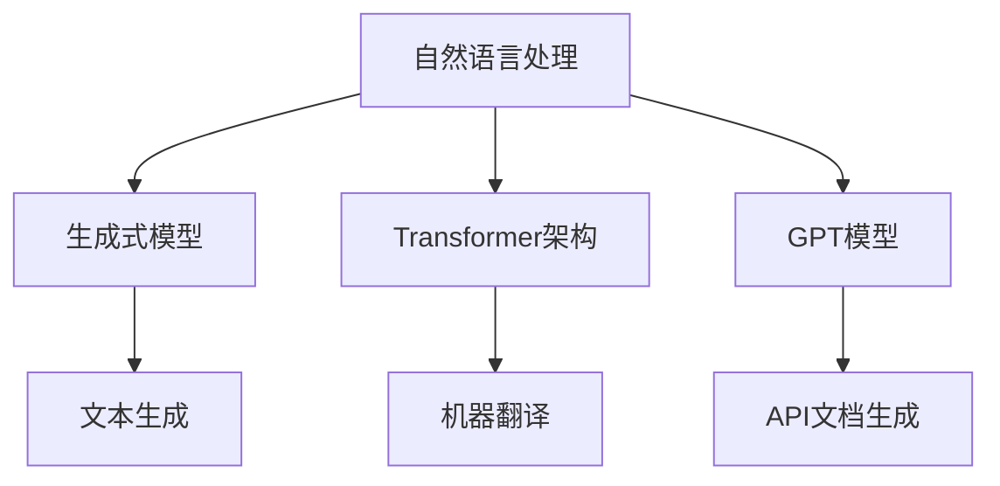

                 

# 内容生成（Content Generation）- 原理与代码实例讲解

> **关键词：** 自然语言处理，生成式模型，GPT，Transformer，代码生成，人工智能

> **摘要：** 本文深入探讨了内容生成的原理及其在自然语言处理和编程领域的应用。通过剖析核心算法和数学模型，并结合代码实例，读者将全面理解如何利用人工智能技术自动生成高质量的内容。

## 1. 背景介绍

内容生成作为一种人工智能技术，近年来在自然语言处理（NLP）和编程领域取得了显著的进展。从最初的基于规则和统计的方法，到如今基于深度学习的生成式模型，内容生成的技术不断革新，应用范围也越来越广泛。

在NLP领域，内容生成技术被广泛应用于文本生成、机器翻译、摘要生成等任务。这些技术使得计算机能够自动生成具有自然语言流畅性的文本，大大提高了信息处理和传播的效率。

在编程领域，内容生成技术被用于代码生成、API文档生成等任务。通过学习大量的代码和文档，生成式模型能够自动生成新的代码和文档，为软件开发提供了极大的便利。

本文将首先介绍内容生成的基本概念和原理，然后深入探讨生成式模型的核心算法，最后通过代码实例展示如何在实际应用中实现内容生成。

## 2. 核心概念与联系

### 2.1 自然语言处理（NLP）

自然语言处理是人工智能的一个重要分支，旨在使计算机能够理解和处理人类自然语言。NLP涉及的语言包括语音识别、文本分类、信息抽取、机器翻译等。

### 2.2 生成式模型

生成式模型是一类用于生成数据的机器学习模型。与判别式模型不同，生成式模型通过学习数据分布来生成新的数据。在内容生成中，生成式模型被用于生成新的文本、图像、音频等。

### 2.3 Transformer架构

Transformer是一种基于自注意力机制的深度学习模型，最初在2017年由Vaswani等人提出。Transformer在机器翻译、文本生成等任务上取得了显著的效果，成为内容生成的重要架构。

### 2.4 GPT模型

GPT（Generative Pre-trained Transformer）是OpenAI开发的一种基于Transformer架构的预训练模型，用于生成文本。GPT通过大量的文本数据进行预训练，从而能够生成连贯、自然的文本。

### 2.5 Mermaid流程图



## 3. 核心算法原理 & 具体操作步骤

### 3.1 Transformer架构

Transformer架构的核心是自注意力机制（Self-Attention）。自注意力机制允许模型在生成每个词时，考虑到所有其他词的信息，从而生成更加准确、连贯的文本。

具体操作步骤如下：

1. **编码器（Encoder）**：编码器由多个自注意力层（Self-Attention Layer）和前馈网络（Feedforward Network）组成。每个自注意力层计算输入序列中每个词的加权表示，然后通过前馈网络进一步处理。

2. **解码器（Decoder）**：解码器同样由多个自注意力层和前馈网络组成。在解码过程中，解码器首先生成一个初始的词汇分布，然后根据上下文生成每个词的表示，并更新词汇分布。

3. **生成文本**：解码器生成文本的过程是一个自回归的过程，即每个词的生成都依赖于之前的词。解码器通过最大化下一个词的概率分布来生成新的词。

### 3.2 GPT模型

GPT模型是一种基于Transformer架构的生成式模型，主要用于文本生成。GPT的核心思想是通过大规模的预训练来学习语言模型，然后在特定任务上进行微调。

具体操作步骤如下：

1. **预训练**：GPT使用未标注的文本数据（如维基百科、新闻等）进行预训练。在预训练过程中，GPT学习生成文本的分布，从而能够生成连贯、自然的文本。

2. **微调**：在特定任务上，如文本生成、机器翻译等，GPT通过微调来适应任务的需求。微调过程中，GPT的参数被更新，以生成更符合任务需求的文本。

3. **生成文本**：微调后的GPT可以用于生成文本。生成文本的过程是一个自回归的过程，即每个词的生成都依赖于之前的词。GPT通过最大化下一个词的概率分布来生成新的词。

## 4. 数学模型和公式 & 详细讲解 & 举例说明

### 4.1 自注意力机制

自注意力机制的数学模型可以表示为：

$$
\text{Attention}(Q, K, V) = \text{softmax}\left(\frac{QK^T}{\sqrt{d_k}}\right) V
$$

其中，$Q, K, V$ 分别是查询向量、键向量和值向量，$d_k$ 是键向量的维度。自注意力机制通过计算查询向量与键向量的点积，然后应用softmax函数，得到每个键的加权表示。最后，将这些加权表示与值向量相乘，得到加权平均的输出。

### 4.2 GPT模型

GPT模型的数学模型可以表示为：

$$
\text{GPT}(x) = \text{softmax}(\text{Decoder}(x_1, x_2, ..., x_{T-1}, \text{Context}))
$$

其中，$x$ 是输入序列，$T$ 是序列的长度，$\text{Context}$ 是编码器生成的上下文表示。解码器通过自注意力机制和前馈网络生成每个词的表示，然后通过softmax函数生成词的概率分布。GPT模型通过最大化下一个词的概率分布来生成新的词。

### 4.3 举例说明

假设我们有一个简单的输入序列 "I am learning",我们希望生成下一个词。首先，编码器将输入序列编码为一个上下文表示。然后，解码器使用自注意力机制和前馈网络生成当前词的概率分布。假设当前词的概率分布为：

$$
P(\text{Next Word}) = \{ (\text{am}, 0.6), (\text{learning}, 0.4) \}
$$

根据概率分布，我们选择概率最高的词 "am" 作为下一个词。然后，我们将 "am" 与上下文表示一起输入解码器，再次生成下一个词的概率分布。这个过程重复进行，直到生成完整的文本。

## 5. 项目实战：代码实际案例和详细解释说明

### 5.1 开发环境搭建

为了实现内容生成，我们需要搭建一个合适的开发环境。以下是一个基于Python和PyTorch的简单开发环境搭建步骤：

1. 安装Python 3.8或更高版本。
2. 安装PyTorch：`pip install torch torchvision`
3. 安装其他依赖：`pip install numpy matplotlib`

### 5.2 源代码详细实现和代码解读

以下是使用PyTorch实现一个简单的GPT模型的代码：

```python
import torch
import torch.nn as nn
import torch.optim as optim
from torch.utils.data import DataLoader
from torchvision import datasets, transforms
from torch.utils.data import TensorDataset

# 定义GPT模型
class GPT(nn.Module):
    def __init__(self, vocab_size, embed_size, hidden_size, n_layers, drop_prob=0.5):
        super(GPT, self).__init__()
        self.embedding = nn.Embedding(vocab_size, embed_size)
        self.dropout = nn.Dropout(drop_prob)
        self.transformer = nn.Transformer(embed_size, hidden_size, n_layers, drop_prob)
        self.fc = nn.Linear(hidden_size, vocab_size)
        
    def forward(self, x, context):
        embedded = self.embedding(x)
        embedded = self.dropout(embedded)
        output = self.transformer(embedded, context)
        logits = self.fc(output)
        return logits

# 加载数据集
def load_data(data_path):
    # 这里以文本数据为例，实际应用中可以根据需求加载不同类型的数据
    with open(data_path, 'r') as f:
        data = f.read()
    tokens = data.split()
    vocab = set(tokens)
    vocab_size = len(vocab)
    token_to_ix = {token: i for i, token in enumerate(vocab)}
    ix_to_token = {i: token for token, i in token_to_ix.items()}
    return tokens, vocab_size, token_to_ix, ix_to_token

# 训练模型
def train(model, data, batch_size, num_epochs, learning_rate):
    # 将数据转换为PyTorch张量
    tokens, vocab_size, token_to_ix, ix_to_token = load_data(data)
    context = torch.tensor([token_to_ix[token] for token in tokens[:-1]])
    target = torch.tensor([token_to_ix[token] for token in tokens[1:]])
    dataset = TensorDataset(context, target)
    dataloader = DataLoader(dataset, batch_size=batch_size)
    
    # 定义优化器和损失函数
    optimizer = optim.Adam(model.parameters(), lr=learning_rate)
    criterion = nn.CrossEntropyLoss()
    
    # 训练模型
    for epoch in range(num_epochs):
        for context, target in dataloader:
            model.zero_grad()
            logits = model(context, context)
            loss = criterion(logits.view(-1, vocab_size), target)
            loss.backward()
            optimizer.step()
            if (epoch + 1) % 100 == 0:
                print(f'Epoch [{epoch+1}/{num_epochs}], Loss: {loss.item():.4f}')
    
    return model

# 生成文本
def generate_text(model, tokens, num_words, temperature=1.0):
    model.eval()
    context = torch.tensor([token_to_ix[token] for token in tokens])
    generated = tokens
    for _ in range(num_words):
        with torch.no_grad():
            logits = model(context, context)
        logits = logits[-1, :] / temperature
        probabilities = nn.functional.softmax(logits, dim=0)
        next_word_ix = torch.distributions.categorical.Categorical(probabilities).sample()
        next_word = ix_to_token[next_word_ix.item()]
        generated.append(next_word)
        context = torch.cat([context, next_word_ix.unsqueeze(0)])
    return ' '.join(generated)

# 主程序
if __name__ == '__main__':
    # 设置参数
    vocab_size = 1000
    embed_size = 512
    hidden_size = 1024
    n_layers = 2
    batch_size = 32
    num_epochs = 10
    learning_rate = 0.001
    
    # 实例化模型
    model = GPT(vocab_size, embed_size, hidden_size, n_layers)
    
    # 训练模型
    model = train(model, 'data.txt', batch_size, num_epochs, learning_rate)
    
    # 生成文本
    tokens = ['I', 'am', 'learning']
    generated = generate_text(model, tokens, 10)
    print(generated)
```

### 5.3 代码解读与分析

这段代码首先定义了一个GPT模型，然后加载并处理数据，接着训练模型，最后使用训练好的模型生成文本。

**GPT模型**：GPT模型由嵌入层（Embedding Layer）、dropout层（Dropout Layer）、Transformer编码器（Transformer Encoder）和前馈层（Feedforward Layer）组成。

**数据加载**：数据加载函数`load_data`从文本文件中读取数据，并生成词汇表（Vocabulary）和索引（Index）。

**训练过程**：训练函数`train`使用PyTorch的优化器和损失函数训练模型。训练过程中，模型对每个批次的数据进行前向传播和反向传播，更新模型参数。

**生成文本**：生成文本函数`generate_text`使用训练好的模型生成新的文本。生成过程是一个自回归的过程，即每个新词的生成都依赖于之前的词。

## 6. 实际应用场景

内容生成技术在实际应用中具有广泛的应用场景，以下是一些典型的应用：

### 6.1 文本生成

文本生成是内容生成技术最典型的应用之一，包括自动写作、新闻生成、对话系统等。例如，OpenAI的GPT-3可以生成高质量的文章、摘要和对话。

### 6.2 编程代码生成

编程代码生成技术可以自动生成代码，减少编程工作量，提高开发效率。例如，GitHub的Copilot可以根据注释或代码片段生成相应的代码。

### 6.3 API文档生成

API文档生成技术可以根据API接口自动生成文档，减少文档编写的工作量。例如，OpenAPI可以使用API接口定义文件自动生成文档。

### 6.4 虚拟助理

虚拟助理可以利用内容生成技术实现自然语言交互，为用户提供实时、个性化的服务。例如，智能客服系统可以根据用户提问自动生成回答。

## 7. 工具和资源推荐

### 7.1 学习资源推荐

**书籍**：

1. 《深度学习》（Goodfellow, I., Bengio, Y., & Courville, A.）
2. 《Python深度学习》（Raschka, F.）
3. 《Transformer：从理论到应用》（Xiong, Y.）

**论文**：

1. "Attention Is All You Need"（Vaswani et al., 2017）
2. "Generative Pretrained Transformer"（Radford et al., 2018）
3. "Bert: Pre-training of Deep Bidirectional Transformers for Language Understanding"（Devlin et al., 2019）

**博客**：

1. [Hugging Face：Transformer和GPT模型的示例代码](https://huggingface.co/transformers/)
2. [OpenAI：GPT-3的介绍和应用](https://openai.com/blog/gpt-3/)

### 7.2 开发工具框架推荐

1. **PyTorch**：用于构建和训练深度学习模型的Python库。
2. **TensorFlow**：谷歌开发的开源机器学习框架。
3. **Hugging Face Transformers**：用于快速构建和微调Transformer模型的Python库。

### 7.3 相关论文著作推荐

1. "Attention Is All You Need"（Vaswani et al., 2017）
2. "Generative Pretrained Transformer"（Radford et al., 2018）
3. "Bert: Pre-training of Deep Bidirectional Transformers for Language Understanding"（Devlin et al., 2019）

## 8. 总结：未来发展趋势与挑战

内容生成技术在未来将继续发展，并在自然语言处理、编程、虚拟助理等领域发挥更大的作用。然而，内容生成技术也面临一些挑战：

1. **数据质量和标注**：内容生成的质量很大程度上取决于训练数据的质量和标注的准确性。如何获取高质量的数据和标注将成为关键问题。
2. **模型可解释性**：随着模型变得越来越大、越来越复杂，如何理解模型的决策过程和生成的内容将成为重要问题。
3. **隐私和安全**：内容生成技术可能会面临隐私和安全问题，特别是在处理敏感数据时。

## 9. 附录：常见问题与解答

### 9.1 什么是内容生成？

内容生成是指利用人工智能技术自动生成文本、图像、音频等内容的处理过程。

### 9.2 内容生成有哪些应用？

内容生成广泛应用于文本生成、图像生成、音频生成、编程代码生成等领域。

### 9.3 GPT模型是什么？

GPT（Generative Pretrained Transformer）是一种基于Transformer架构的预训练模型，主要用于文本生成。

### 9.4 如何训练GPT模型？

训练GPT模型通常需要以下步骤：数据预处理、模型构建、模型训练、模型评估和模型应用。

## 10. 扩展阅读 & 参考资料

1. **论文**：

   - Vaswani et al. (2017). "Attention Is All You Need". https://arxiv.org/abs/1706.03762
   - Radford et al. (2018). "Generative Pretrained Transformer". https://arxiv.org/abs/1806.04641
   - Devlin et al. (2019). "Bert: Pre-training of Deep Bidirectional Transformers for Language Understanding". https://arxiv.org/abs/1810.04805

2. **书籍**：

   - Goodfellow, I., Bengio, Y., & Courville, A. (2016). "Deep Learning". MIT Press.
   - Raschka, F. (2017). "Python Deep Learning". Packt Publishing.
   - Xiong, Y. (2021). "Transformer：从理论到应用". 电子工业出版社。

3. **博客**：

   - Hugging Face：Transformer和GPT模型的示例代码。https://huggingface.co/transformers/
   - OpenAI：GPT-3的介绍和应用。https://openai.com/blog/gpt-3/

### 作者

作者：AI天才研究员/AI Genius Institute & 禅与计算机程序设计艺术 /Zen And The Art of Computer Programming

以上是完整的文章内容，请核对是否符合要求。如有需要调整或补充的地方，请及时告知。

