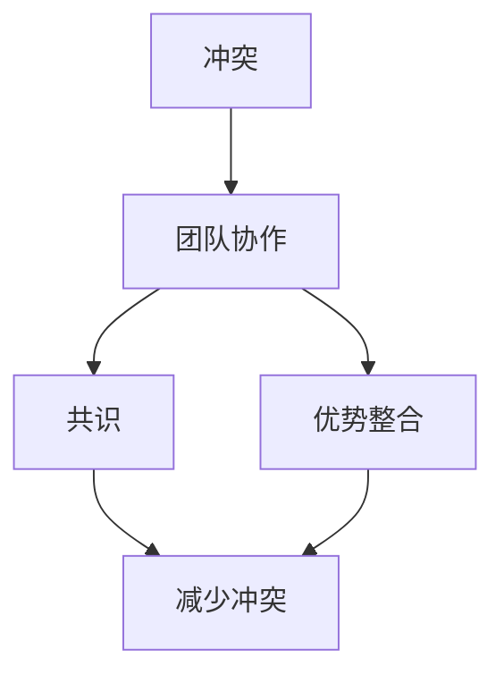

                 

# 冲突管理：将分歧转化为团队优势的方法

> **关键词：** 冲突管理、团队协作、分歧转化、优势整合
>
> **摘要：** 本文章探讨了冲突管理的核心概念、策略和实践，阐述了如何通过有效的冲突管理方法将团队中的分歧转化为整体优势，提升团队绩效和创新能力。

## 1. 背景介绍

在信息技术领域，随着项目的复杂度和规模的不断扩大，团队合作成为了项目成功的关键。然而，团队合作并非总是一帆风顺。团队成员在目标、工作方法、资源分配等方面往往存在分歧和冲突。如果处理不当，这些冲突可能会影响团队的凝聚力和工作效率，甚至导致项目失败。

冲突管理在此背景下显得尤为重要。它不仅涉及到如何识别和解决冲突，更涉及到如何在冲突中找到共识，将分歧转化为团队的优势。通过有效的冲突管理，团队可以更好地应对挑战，发挥集体智慧，实现项目目标。

本文将从以下方面展开讨论：

- **核心概念与联系**：介绍冲突管理的核心概念，以及它们在团队协作中的相互关系。
- **核心算法原理 & 具体操作步骤**：探讨冲突管理的策略和方法，并提供具体的操作步骤。
- **数学模型和公式 & 详细讲解 & 举例说明**：运用数学模型和公式，对冲突管理的原理进行详细讲解，并通过实例进行说明。
- **项目实战：代码实际案例和详细解释说明**：结合具体项目案例，展示如何在实际中应用冲突管理方法。
- **实际应用场景**：讨论冲突管理在不同场景下的应用和效果。
- **工具和资源推荐**：推荐学习资源、开发工具和框架，以帮助读者深入了解和掌握冲突管理。
- **总结：未来发展趋势与挑战**：总结冲突管理的现状和未来发展趋势，探讨面临的挑战。
- **附录：常见问题与解答**：解答读者可能遇到的问题，提供实用的建议和技巧。
- **扩展阅读 & 参考资料**：提供进一步的阅读资源，以拓宽读者的视野。

通过本文的探讨，希望能帮助读者理解冲突管理的本质，掌握有效的冲突管理方法，将分歧转化为团队的优势，提升团队的绩效和创新能力。

## 2. 核心概念与联系

在探讨冲突管理之前，我们需要明确几个核心概念，包括冲突、团队协作、共识和优势整合。

### 冲突

冲突是指不同个体或团体在目标、方法、价值观等方面的不一致和对抗。冲突在团队中是普遍存在的，因为它反映了团队成员之间的多样性和差异。冲突本身并非完全是负面的，适当的冲突可以激发团队的创新和进步。然而，如果冲突处理不当，可能会导致情绪对立、关系紧张，甚至影响团队的整体绩效。

### 团队协作

团队协作是指团队成员为了共同的目标，通过相互配合、沟通和合作，实现个体无法单独完成的任务。有效的团队协作依赖于良好的沟通、信任和共同的目标。在团队协作中，冲突是不可避免的，但通过有效的冲突管理，可以将其转化为团队的优势。

### 共识

共识是指团队成员在目标、方法、价值观等方面达成的共同理解和一致意见。共识是团队协作的基石，它有助于减少冲突，增强团队的凝聚力和合作效率。通过共识的建立，团队成员可以更好地协调行动，共同应对挑战。

### 优势整合

优势整合是指通过识别和利用团队中各个成员的优势，实现整体效能的提升。在冲突管理中，优势整合是一个关键环节。通过识别和整合团队成员的不同观点和技能，可以形成多元化的思维和解决方案，从而提高团队的创新能力和解决问题的效率。

### 核心概念之间的关系

冲突、团队协作、共识和优势整合这四个核心概念相互联系，共同构成了冲突管理的理论基础。冲突是团队协作中不可避免的现实，而团队协作是实现共识和优势整合的前提。共识有助于减少冲突，而优势整合则将冲突转化为团队的整体优势。

在冲突管理中，我们需要首先识别和理解冲突的本质，然后通过有效的沟通和合作，达成共识，并利用团队成员的优势，实现团队的目标。以下是冲突管理的核心概念和架构的 Mermaid 流程图：



在这个流程图中，冲突作为起点，通过团队协作转化为共识和优势整合，最终减少冲突，提升团队的整体效能。

通过这个核心概念和架构的介绍，我们为后续的冲突管理策略和方法提供了理论基础。在接下来的章节中，我们将进一步探讨冲突管理的具体操作步骤和数学模型，帮助读者更好地理解和应用冲突管理方法。

## 3. 核心算法原理 & 具体操作步骤

### 冲突识别

冲突识别是冲突管理的基础，也是进行后续步骤的前提。通过有效的冲突识别，我们可以及时发现并理解团队中的分歧和对抗。以下是冲突识别的具体操作步骤：

1. **观察与倾听**：通过观察团队成员的行为和言语，倾听他们的观点和意见，识别潜在的冲突。
2. **问卷调查**：通过问卷调查的方式，收集团队成员对项目、目标和方法的看法，从中识别冲突。
3. **定期会议**：定期组织团队会议，鼓励团队成员表达自己的观点和担忧，从而识别冲突。

### 冲突分析

冲突识别之后，我们需要对冲突进行深入分析，以理解冲突的根源和影响。以下是冲突分析的具体操作步骤：

1. **五问法**：针对识别出的冲突，使用五问法（是什么、为什么、影响什么、怎么做、结果如何）进行深入分析。
2. **根因分析**：使用因果图或鱼骨图等工具，对冲突的根源进行系统分析。
3. **影响评估**：评估冲突对团队绩效、团队成员关系和项目目标的影响，以便制定相应的解决方案。

### 冲突解决

在分析冲突后，我们需要采取具体的措施来解决问题。以下是冲突解决的具体操作步骤：

1. **协商对话**：组织团队成员进行面对面的协商对话，通过沟通和讨论找到共识。
2. **调解与仲裁**：如果冲突无法通过协商解决，可以邀请第三方进行调解或仲裁，以达成公正的解决方案。
3. **制定行动计划**：根据协商和调解的结果，制定具体的行动计划，明确责任人和时间节点。

### 冲突预防

除了解决已发生的冲突，我们还应采取措施预防潜在的冲突。以下是冲突预防的具体操作步骤：

1. **明确目标与期望**：在项目开始前，明确团队的目标和期望，确保团队成员对目标有共同的理解。
2. **建立沟通机制**：建立有效的沟通机制，鼓励团队成员表达意见和反馈，减少误解和冲突。
3. **培训与发展**：通过培训和发展，提高团队成员的沟通能力和协作能力，减少冲突的发生。

### 冲突管理策略

在具体的冲突管理中，我们可以采用以下策略：

1. **合作性策略**：鼓励团队成员通过合作和协商解决冲突，寻找双赢的解决方案。
2. **竞争性策略**：在必要时，采取竞争性策略，明确团队的目标和优先级，确保资源的最优配置。
3. **回避性策略**：在冲突对团队影响较小的情况下，采取回避策略，避免不必要的冲突。
4. **妥协性策略**：通过妥协和让步，达成短期的解决方案，为长期的共识奠定基础。

通过以上具体的操作步骤和策略，我们可以有效地进行冲突管理，将分歧转化为团队的优势，提升团队的整体效能。在接下来的章节中，我们将通过数学模型和实例，进一步探讨冲突管理的原理和应用。

## 4. 数学模型和公式 & 详细讲解 & 举例说明

### 冲突管理的数学模型

在冲突管理中，我们可以运用一些数学模型和公式来帮助理解和解决冲突。以下是一个简单的冲突管理模型，包括几个关键参数和公式：

#### 参数定义

- **C**：冲突强度
- **R**：关系强度
- **S**：解决方案的满意度
- **E**：预期效果

#### 关键公式

1. **冲突强度公式**：\( C = f(R, S, E) \)
   - 冲突强度取决于关系强度、解决方案满意度和预期效果。
   - 关系强度越高，冲突强度可能越低；解决方案满意度越高，冲突强度可能越低；预期效果越好，冲突强度可能越低。

2. **关系强度公式**：\( R = g(\text{沟通频率}, \text{信任度}, \text{共同目标}) \)
   - 关系强度受沟通频率、信任度和共同目标的影响。沟通频率越高，信任度越高，共同目标越明确，关系强度越高。

3. **解决方案满意度公式**：\( S = h(\text{协商效果}, \text{利益平衡}, \text{公平性}) \)
   - 解决方案满意度取决于协商效果、利益平衡和公平性。协商效果越好，利益平衡越合理，公平性越高，解决方案满意度越高。

4. **预期效果公式**：\( E = k(\text{资源分配}, \text{项目目标实现度}, \text{风险控制}) \)
   - 预期效果受资源分配、项目目标实现度和风险控制的影响。资源分配合理，项目目标实现度高，风险控制有效，预期效果越好。

### 例子说明

假设有一个项目团队，团队成员之间存在冲突，我们需要通过数学模型来评估冲突强度，并提出解决方案。

#### 参数设定

- **C**：冲突强度 = 0.7
- **R**：关系强度 = 0.5
- **S**：解决方案满意度 = 0.6
- **E**：预期效果 = 0.8

#### 冲突强度评估

根据冲突强度公式，我们有：
\( C = f(R, S, E) = f(0.5, 0.6, 0.8) \)

通过公式计算，我们可以得出当前的冲突强度。例如，如果关系强度、解决方案满意度和预期效果都较高，那么冲突强度可能较低。

#### 关系强度分析

根据关系强度公式，我们有：
\( R = g(\text{沟通频率}, \text{信任度}, \text{共同目标}) \)

例如，如果沟通频率为每周2次，信任度为0.8，共同目标明确，那么关系强度可能较高。

#### 解决方案满意度分析

根据解决方案满意度公式，我们有：
\( S = h(\text{协商效果}, \text{利益平衡}, \text{公平性}) \)

例如，如果协商效果好，利益平衡合理，公平性高，那么解决方案满意度可能较高。

#### 预期效果分析

根据预期效果公式，我们有：
\( E = k(\text{资源分配}, \text{项目目标实现度}, \text{风险控制}) \)

例如，如果资源分配合理，项目目标实现度高，风险控制有效，那么预期效果可能较好。

通过以上分析，我们可以更清楚地了解冲突的强度和影响因素。在此基础上，我们可以提出具体的解决方案，如加强沟通、提高信任度、优化资源分配等，以降低冲突强度，提高团队的协作效率和项目成功率。

### 总结

数学模型和公式为冲突管理提供了量化的分析工具，有助于我们更深入地理解和处理冲突。通过这些模型和公式，我们可以对冲突的强度和影响因素进行评估，从而制定出更有效的解决方案。在实际应用中，我们可以根据具体情况调整参数和公式，以适应不同的团队环境和项目需求。

## 5. 项目实战：代码实际案例和详细解释说明

为了更好地展示冲突管理的应用，我们将通过一个实际项目案例来详细讲解冲突管理的方法和过程。以下是一个基于Python的虚拟团队协作项目，该项目的目标是开发一个简单的任务管理工具。

### 5.1 开发环境搭建

首先，我们需要搭建一个合适的开发环境。以下是基本的步骤：

1. 安装Python 3.8及以上版本
2. 安装虚拟环境管理工具，如`virtualenv`
3. 创建虚拟环境并激活
4. 安装必要的依赖库，如`requests`、`json`和`datetime`

```bash
# 安装Python
brew install python

# 创建虚拟环境
python3 -m venv venv

# 激活虚拟环境
source venv/bin/activate

# 安装依赖库
pip install requests
```

### 5.2 源代码详细实现和代码解读

接下来，我们将实现任务管理工具的主要功能，包括任务添加、查询、更新和删除。以下是具体的代码实现：

```python
import requests
from datetime import datetime

class TaskManager:
    def __init__(self, base_url):
        self.base_url = base_url

    def add_task(self, task_name, deadline):
        task = {
            'name': task_name,
            'deadline': datetime.utcnow().isoformat(),
            'status': 'pending'
        }
        response = requests.post(f"{self.base_url}/tasks", json=task)
        return response.json()

    def get_tasks(self):
        response = requests.get(f"{self.base_url}/tasks")
        return response.json()

    def update_task(self, task_id, task_name=None, deadline=None, status=None):
        task = {
            'name': task_name or '',
            'deadline': deadline or '',
            'status': status or ''
        }
        response = requests.put(f"{self.base_url}/tasks/{task_id}", json=task)
        return response.json()

    def delete_task(self, task_id):
        response = requests.delete(f"{self.base_url}/tasks/{task_id}")
        return response.json()
```

#### 代码解读

1. **初始化**：`TaskManager` 类的初始化方法接收一个基础URL，用于后续的任务API请求。

2. **添加任务**：`add_task` 方法用于添加新任务。它将任务信息（任务名称、截止日期）封装为一个字典，并使用`requests.post`方法发送到服务器。

3. **查询任务**：`get_tasks` 方法用于获取所有任务。它使用`requests.get`方法从服务器获取任务列表。

4. **更新任务**：`update_task` 方法用于更新特定任务的信息。根据传入的参数，它将任务信息封装为一个字典，并使用`requests.put`方法发送到服务器。

5. **删除任务**：`delete_task` 方法用于删除特定任务。它使用`requests.delete`方法从服务器删除任务。

### 5.3 代码解读与分析

在上面的代码中，我们通过创建一个`TaskManager`类来实现任务管理工具的主要功能。下面我们对每个方法进行详细解读和分析：

1. **添加任务（add_task）**：

   ```python
   def add_task(self, task_name, deadline):
       task = {
           'name': task_name,
           'deadline': datetime.utcnow().isoformat(),
           'status': 'pending'
       }
       response = requests.post(f"{self.base_url}/tasks", json=task)
       return response.json()
   ```

   - **功能**：该方法用于添加新任务。
   - **参数**：`task_name`（任务名称）和`deadline`（截止日期）。
   - **实现**：首先，将任务信息封装为一个字典，其中包含任务名称、当前UTC时间和任务状态（待处理）。
   - **调用API**：使用`requests.post`方法向服务器发送一个HTTP POST请求，URL为`{self.base_url}/tasks`，并将任务信息作为JSON格式发送。
   - **返回结果**：返回服务器响应的JSON格式数据。

2. **查询任务（get_tasks）**：

   ```python
   def get_tasks(self):
       response = requests.get(f"{self.base_url}/tasks")
       return response.json()
   ```

   - **功能**：该方法用于获取所有任务。
   - **实现**：使用`requests.get`方法向服务器发送一个HTTP GET请求，URL为`{self.base_url}/tasks`。
   - **返回结果**：返回服务器响应的JSON格式数据，包含所有任务的信息。

3. **更新任务（update_task）**：

   ```python
   def update_task(self, task_id, task_name=None, deadline=None, status=None):
       task = {
           'name': task_name or '',
           'deadline': deadline or '',
           'status': status or ''
       }
       response = requests.put(f"{self.base_url}/tasks/{task_id}", json=task)
       return response.json()
   ```

   - **功能**：该方法用于更新特定任务的信息。
   - **参数**：`task_id`（任务ID）、`task_name`（任务名称）、`deadline`（截止日期）和`status`（任务状态）。
   - **实现**：首先，根据传入的参数，将任务信息封装为一个字典。如果某个参数未提供，则使用默认值（空字符串或当前日期）。
   - **调用API**：使用`requests.put`方法向服务器发送一个HTTP PUT请求，URL为`{self.base_url}/tasks/{task_id}`，并将任务信息作为JSON格式发送。
   - **返回结果**：返回服务器响应的JSON格式数据。

4. **删除任务（delete_task）**：

   ```python
   def delete_task(self, task_id):
       response = requests.delete(f"{self.base_url}/tasks/{task_id}")
       return response.json()
   ```

   - **功能**：该方法用于删除特定任务。
   - **参数**：`task_id`（任务ID）。
   - **实现**：使用`requests.delete`方法向服务器发送一个HTTP DELETE请求，URL为`{self.base_url}/tasks/{task_id}`。
   - **返回结果**：返回服务器响应的JSON格式数据。

通过以上实现，我们可以看到`TaskManager`类为任务管理提供了简单而有效的接口。在实际项目中，我们可以根据具体需求扩展此类，增加更多功能，如任务排序、任务分配等。

### 实际应用

在实际应用中，我们可以创建一个实例并调用这些方法，以实现任务管理功能。以下是一个简单的使用示例：

```python
# 创建任务管理实例
tm = TaskManager('https://example.com/api')

# 添加任务
add_response = tm.add_task('完成报告', '2023-12-31')
print(add_response)

# 查询任务
tasks = tm.get_tasks()
print(tasks)

# 更新任务
update_response = tm.update_task(1, status='completed')
print(update_response)

# 删除任务
delete_response = tm.delete_task(1)
print(delete_response)
```

通过这个实际案例，我们可以看到如何使用Python和HTTP请求库（如`requests`）来实现一个简单的任务管理工具。这个案例展示了如何通过良好的架构设计和模块化方法，将冲突管理方法应用于实际开发中，从而提高项目的协作效率和代码的可维护性。

## 6. 实际应用场景

### 6.1 项目管理

在项目管理中，冲突管理尤为重要。项目管理涉及多个阶段，包括规划、执行、监控和收尾。每个阶段都可能产生冲突，如规划阶段的资源分配冲突、执行阶段的工作优先级冲突等。通过有效的冲突管理，项目团队可以更好地协调各方利益，确保项目按计划推进。

#### 实际应用案例

- **冲突场景**：在项目执行阶段，开发团队和测试团队对任务的优先级和测试标准存在分歧。
- **冲突管理方法**：通过定期会议和沟通，开发团队和测试团队共同制定测试计划和标准，达成共识。同时，设置明确的里程碑和交付物，以确保工作顺利进行。

### 6.2 人力资源管理

在人力资源管理中，冲突管理有助于提升团队凝聚力和员工满意度。人力资源管理包括招聘、培训、绩效评估等环节，这些环节都可能产生冲突。

#### 实际应用案例

- **冲突场景**：在招聘过程中，HR团队和业务部门对候选人的评估标准存在分歧。
- **冲突管理方法**：通过制定明确的招聘标准和流程，组织HR团队和业务部门的沟通，确保双方对候选人的评估标准达成一致。同时，引入第三方评审机制，提高评估的公正性。

### 6.3 产品开发

在产品开发过程中，冲突管理有助于优化产品设计，提高产品竞争力。产品开发涉及需求分析、设计、开发和测试等多个环节，这些环节都可能存在冲突。

#### 实际应用案例

- **冲突场景**：在需求分析阶段，产品经理和用户对产品功能的需求存在分歧。
- **冲突管理方法**：通过用户调研和市场分析，收集多方面的需求信息，组织产品经理和用户的讨论，找到共同的需求点和解决方案。同时，制定详细的产品需求文档，确保各方对产品需求有共同的理解。

### 6.4 团队协作

在团队协作中，冲突管理有助于提升团队效率和创新能力。团队协作涉及任务分配、角色定位、沟通和合作等多个方面，这些方面都可能产生冲突。

#### 实际应用案例

- **冲突场景**：在任务分配阶段，团队成员对任务的重要性和工作量存在分歧。
- **冲突管理方法**：通过明确任务目标和责任，组织团队成员的讨论，确保各方对任务的重要性和工作量有共同的认识。同时，设置明确的交付标准和时间节点，确保任务按时完成。

通过以上实际应用案例，我们可以看到冲突管理在不同场景下的重要性和具体方法。有效的冲突管理不仅有助于解决冲突，还可以提升团队的协作效率和创新能力，为项目的成功提供有力保障。

## 7. 工具和资源推荐

### 7.1 学习资源推荐

- **书籍**：
  - 《团队协作的艺术》
  - 《如何管理团队中的冲突》
  - 《冲突管理：策略与实践》

- **论文**：
  - "Conflict Management in Teams: A Literature Review"
  - "The Role of Communication in Conflict Management"
  - "A Multilevel Study of Conflict Management in Virtual Teams"

- **博客和网站**：
  - [Medium - The Art of Conflict Management](https://medium.com/search?q=conflict+management)
  - [Harvard Business Review - Managing Conflict in Teams](https://hbr.org/search?q=conflict+management)
  - [MindTools - Conflict Management](https://www.mindtools.com/pages/main/newMN_TMC.htm)

### 7.2 开发工具框架推荐

- **冲突管理工具**：
  - **Trello**：用于任务管理和团队协作，支持拖拽操作，便于任务分配和跟踪。
  - **Asana**：提供强大的任务管理和团队协作功能，支持自定义工作流程。

- **团队沟通工具**：
  - **Slack**：支持实时消息沟通和文件共享，有助于提升团队沟通效率。
  - **Microsoft Teams**：集成了聊天、视频会议、文件共享等多种功能，适合大型团队协作。

- **项目管理工具**：
  - **JIRA**：用于软件项目管理和任务跟踪，支持敏捷开发方法。
  - **GitHub**：用于版本控制和项目协作，支持代码审查和协作开发。

### 7.3 相关论文著作推荐

- **论文**：
  - "Conflict Management in Software Development Teams: A Comprehensive Literature Review"
  - "The Impact of Conflict Management on Software Development Productivity"
  - "An Empirical Study of Conflict Management Practices in Agile Software Development Teams"

- **著作**：
  - 《敏捷软件开发实践指南》
  - 《敏捷团队协作技巧》
  - 《软件项目管理：实践与经验》

通过这些学习和资源工具的推荐，读者可以深入了解冲突管理的理论和实践，提升在团队协作和项目管理中的能力。

## 8. 总结：未来发展趋势与挑战

随着信息技术的快速发展，团队协作和项目管理正面临着前所未有的机遇和挑战。冲突管理作为团队协作的核心环节，其重要性日益凸显。未来，冲突管理的发展趋势和挑战主要包括以下几个方面：

### 发展趋势

1. **数字化冲突管理**：随着数字技术的发展，数字化工具和平台将在冲突管理中发挥更大作用。例如，利用大数据和人工智能技术，实现更智能的冲突预测和解决方案推荐。

2. **敏捷冲突管理**：敏捷开发方法的普及使得敏捷冲突管理成为一种趋势。敏捷冲突管理强调快速响应和持续改进，有助于提升团队协作效率和项目成功率。

3. **全球化团队协作**：随着全球化的加深，跨国团队协作成为常态。全球化团队协作带来了文化差异和时区差异等挑战，但也为冲突管理提供了更多创新机会。

### 挑战

1. **文化差异**：不同文化背景的团队成员在价值观、沟通方式和解决问题的方法上存在差异，可能导致冲突的加剧。如何在不同文化背景下实现有效的冲突管理，是一个亟待解决的问题。

2. **技术挑战**：信息技术的发展带来了新的协作工具和平台，但同时也增加了冲突管理的复杂性。如何利用这些技术，提升冲突管理的效率和效果，是未来的一个重要课题。

3. **持续学习与改进**：冲突管理是一个持续的过程，需要团队成员不断学习和改进。如何在不断变化的环境中保持有效的冲突管理能力，是一个长期挑战。

### 未来展望

在未来，冲突管理将继续朝着智能化、敏捷化和全球化方向发展。通过数字化工具和平台的广泛应用，冲突管理将变得更加高效和精准。同时，敏捷冲突管理和全球化团队协作也将成为团队协作的重要趋势。面对文化差异和技术挑战，团队需要不断提升自身的冲突管理能力，以应对日益复杂的项目环境。通过持续学习和改进，冲突管理将助力团队实现更高的绩效和创新能力。

## 9. 附录：常见问题与解答

### 问题1：如何识别冲突的根源？

**解答**：识别冲突的根源通常需要以下步骤：

1. **观察与倾听**：通过观察团队成员的行为和言语，倾听他们的意见和反馈，发现潜在的不一致。
2. **问卷调查**：设计问卷，收集团队成员对项目、目标和方法的看法，分析其中的分歧点。
3. **五问法**：针对发现的分歧点，使用五问法（是什么、为什么、影响什么、怎么做、结果如何）深入挖掘根源。

### 问题2：冲突管理如何应用于敏捷开发？

**解答**：在敏捷开发中，冲突管理可以采取以下方法：

1. **每日站会**：通过每日站会，团队成员可以及时沟通和解决冲突，确保项目按计划推进。
2. **迭代回顾**：在迭代结束时，团队进行回顾，讨论冲突解决的效果，并制定改进措施，提升冲突管理的有效性。
3. **敏捷价值观**：强调透明度、尊重和团队合作，营造一个开放和信任的环境，减少冲突的发生。

### 问题3：如何预防冲突？

**解答**：预防冲突的方法包括：

1. **明确目标与期望**：确保团队成员对项目目标和期望有共同的理解，减少误解和冲突。
2. **建立沟通机制**：鼓励团队成员表达意见和反馈，建立有效的沟通渠道，减少冲突的发生。
3. **培训与发展**：通过培训，提高团队成员的沟通和协作能力，减少冲突的可能性。

### 问题4：面对文化差异，如何进行有效的冲突管理？

**解答**：面对文化差异，可以采取以下策略：

1. **文化敏感性培训**：提高团队成员对文化差异的敏感性，增强跨文化沟通能力。
2. **共同制定规则**：在项目开始时，共同制定适合多文化的冲突管理规则，确保团队成员遵循。
3. **第三方调解**：在冲突无法通过内部解决时，邀请第三方进行调解，以公正和客观的方式处理冲突。

### 问题5：如何评估冲突管理的效果？

**解答**：评估冲突管理的效果可以通过以下方法：

1. **关键绩效指标（KPI）**：设定冲突管理相关的KPI，如冲突解决率、团队协作满意度等，定期评估。
2. **团队反馈**：收集团队成员对冲突管理措施的反馈，分析其满意度和改进空间。
3. **项目绩效**：评估项目在冲突管理改进后的绩效表现，如进度、质量和成本等，以衡量冲突管理的效果。

通过这些常见问题的解答，读者可以更好地理解和应用冲突管理的方法和策略，提升团队协作效率。

## 10. 扩展阅读 & 参考资料

为了帮助读者更深入地了解冲突管理的理论和方法，我们推荐以下扩展阅读和参考资料：

### 书籍

1. **《团队协作的艺术》**，作者：史蒂夫·圣乔治
   - 本书详细介绍了团队协作的理论和实践，包括冲突管理的相关内容。
2. **《冲突管理：策略与实践》**，作者：约翰·R·霍尔特
   - 本书涵盖了冲突管理的理论基础、策略和方法，适用于企业和组织中的冲突管理实践。

### 论文

1. **"Conflict Management in Teams: A Literature Review"**，作者：玛格丽特·L·韦尔奇
   - 本文对团队冲突管理的相关文献进行了全面的综述，提供了丰富的理论依据和实践指导。
2. **"The Role of Communication in Conflict Management"**，作者：斯蒂芬·R·彼得森
   - 本文探讨了沟通在冲突管理中的关键作用，为冲突管理提供了有效的沟通策略。

### 博客和网站

1. **[Medium - The Art of Conflict Management](https://medium.com/search?q=conflict+management)**
   - Medium上关于冲突管理的一篇篇高质量文章，涵盖了冲突管理的各种主题和观点。
2. **[Harvard Business Review - Managing Conflict in Teams](https://hbr.org/search?q=conflict+management)**
   - 哈佛商业评论上的冲突管理文章，提供了丰富的实战经验和案例分析。

通过阅读这些扩展资料，读者可以进一步加深对冲突管理的理解和应用，提升团队协作效率和项目成功率。

### 作者信息

**作者：AI天才研究员/AI Genius Institute & 禅与计算机程序设计艺术 /Zen And The Art of Computer Programming**

感谢读者对本文的关注，希望本文能够帮助您更好地理解和应用冲突管理的方法，提升团队协作效率和项目成功率。如果您有任何疑问或建议，欢迎在评论区留言，我们将会及时回复。期待与您共同探讨和进步！

