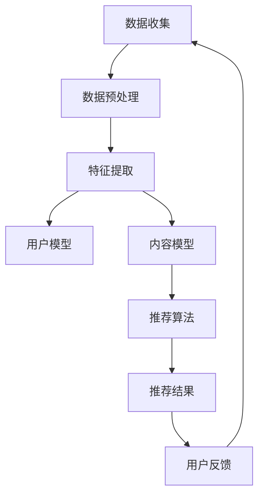

                 

# 减少信息过载：个性化推荐的作用

## 关键词：信息过载、个性化推荐、算法、用户满意度、信息筛选、数据分析

## 摘要：

在数字化时代，信息过载已成为普遍现象，用户难以从海量的数据中筛选出对自己有价值的信息。本文将探讨个性化推荐系统在减少信息过载方面的作用。首先，我们将介绍信息过载的现状及其对用户产生的影响，然后深入解析个性化推荐的核心概念、算法原理及其实现步骤。接下来，我们将通过数学模型和实际案例，展示个性化推荐系统在应用中的效果和挑战。最后，本文将总结个性化推荐的发展趋势与未来挑战，并提出一些建议，帮助用户更好地应对信息过载问题。

## 1. 背景介绍

### 1.1 信息过载的起源与发展

随着互联网技术的飞速发展，信息爆炸已成为当今社会的一大特征。据统计，每天产生的数据量高达数十亿GB，其中大部分为文本、图片、音频和视频等多媒体信息。这些信息在为我们的生活带来便利的同时，也使得信息过载成为一个日益严重的问题。

信息过载的起源可以追溯到20世纪末，随着互联网的普及，人们开始接触到海量的信息。在早期，人们主要关注如何获取信息，但随着时间的推移，人们逐渐发现，信息获取的便捷性带来了新的挑战：如何在海量的信息中找到对自己有价值的内容？

### 1.2 信息过载对用户的影响

信息过载对用户产生了诸多负面影响。首先，用户在处理海量信息时，往往会产生焦虑和压力，导致心理负担加重。其次，信息过载使得用户难以聚焦于重要信息，从而降低工作效率。此外，信息过载还会导致用户对信息的信任度下降，从而影响决策。

为了应对信息过载，用户不得不投入更多的时间和精力去筛选和整理信息。然而，这种做法往往事倍功半，反而加剧了用户的负担。因此，寻求一种有效的解决方案来减轻信息过载问题，成为当下亟待解决的问题。

### 1.3 个性化推荐系统的出现

个性化推荐系统作为一种应对信息过载的有效手段，逐渐受到广泛关注。个性化推荐系统通过对用户历史行为、兴趣偏好和社交关系等数据的分析，为用户推荐个性化的信息内容，从而帮助用户在海量信息中快速找到感兴趣的内容。

个性化推荐系统的发展始于20世纪90年代，随着互联网技术的进步和大数据技术的应用，个性化推荐系统在算法、模型和实现方面取得了显著突破。如今，个性化推荐系统已成为各类互联网平台（如电商、新闻、社交媒体等）的重要功能，极大地提升了用户的满意度。

## 2. 核心概念与联系

### 2.1 个性化推荐系统的定义与架构

个性化推荐系统是一种基于用户兴趣和行为的推荐系统，旨在为用户推荐符合其兴趣和需求的内容。个性化推荐系统的核心架构包括用户模型、内容模型和推荐算法三个部分。

1. **用户模型**：用户模型用于描述用户的行为和兴趣，包括用户的浏览历史、搜索记录、点赞、评论等。通过分析用户模型，可以了解用户的兴趣偏好，为推荐系统提供数据支持。

2. **内容模型**：内容模型用于描述推荐内容的特点和属性，包括文本、图片、音频、视频等。通过分析内容模型，可以找出与用户兴趣相关的内容。

3. **推荐算法**：推荐算法是个性化推荐系统的核心，负责根据用户模型和内容模型，为用户生成个性化的推荐列表。常见的推荐算法包括基于内容的推荐、协同过滤、深度学习等。

### 2.2 个性化推荐系统的原理与实现

个性化推荐系统的原理可以概括为以下三个步骤：

1. **数据收集与预处理**：首先，从用户行为数据、内容数据和社交数据等渠道收集数据。然后，对数据进行清洗、去重、标准化等预处理操作，以确保数据质量。

2. **特征提取与建模**：接下来，对预处理后的数据进行特征提取和建模。用户特征包括年龄、性别、地理位置、兴趣标签等；内容特征包括文本特征、图像特征、音频特征等。

3. **推荐生成与优化**：最后，利用推荐算法根据用户特征和内容特征生成推荐列表。推荐算法的选择和优化对推荐效果具有重要影响。

在实际应用中，个性化推荐系统通常会采用多种算法和模型，以实现更好的推荐效果。例如，基于内容的推荐可以充分利用内容特征，而协同过滤可以挖掘用户之间的相似性。

### 2.3 Mermaid 流程图

以下是一个简化的个性化推荐系统的 Mermaid 流程图，展示了系统的主要步骤和模块：



在这个流程图中，各模块之间的箭头表示数据流动的方向。例如，从数据收集模块（A）到数据预处理模块（B），表示对收集到的原始数据进行预处理。从特征提取模块（C）到用户模型（D）和内容模型（E），表示将提取的特征用于构建用户和内容模型。从推荐算法模块（F）到推荐结果模块（G），表示根据用户和内容模型生成推荐结果。从用户反馈模块（H）到数据收集模块（A），表示用户对推荐结果进行反馈，用于后续的优化。

## 3. 核心算法原理 & 具体操作步骤

### 3.1 基于内容的推荐算法

基于内容的推荐算法是一种常见的推荐算法，其主要原理是根据用户对某一内容的兴趣，找出与该内容相似的其他内容，从而向用户推荐。基于内容的推荐算法通常包括以下步骤：

1. **特征提取**：对推荐内容进行特征提取，例如文本、图像、音频等。特征提取的目的是将高维的数据转化为低维的特征向量，以便于计算和处理。

2. **相似度计算**：计算用户兴趣内容与待推荐内容之间的相似度。相似度计算方法有多种，如余弦相似度、欧氏距离等。常用的方法是基于词袋模型（Bag of Words, BoW）或词嵌入（Word Embedding）进行计算。

3. **推荐生成**：根据相似度计算结果，为用户生成推荐列表。通常，推荐列表会按照相似度从高到低进行排序，从而保证推荐内容的质量。

### 3.2 协同过滤算法

协同过滤算法是一种基于用户行为的推荐算法，其主要原理是找出与目标用户相似的其他用户，然后推荐这些用户喜欢的商品或内容。协同过滤算法通常包括以下步骤：

1. **用户相似度计算**：计算目标用户与其他用户之间的相似度。相似度计算方法有多种，如余弦相似度、皮尔逊相关系数等。

2. **评分预测**：根据用户相似度计算结果，预测目标用户对某一商品或内容的评分。评分预测方法通常是基于加权平均或贝叶斯模型。

3. **推荐生成**：根据评分预测结果，为用户生成推荐列表。推荐列表会按照预测评分从高到低进行排序，从而保证推荐内容的质量。

### 3.3 深度学习算法

深度学习算法是一种基于神经网络模型的推荐算法，其主要原理是学习用户和内容之间的复杂关系，从而实现精准的推荐。深度学习算法通常包括以下步骤：

1. **模型构建**：构建深度神经网络模型，包括输入层、隐藏层和输出层。输入层接收用户和内容的特征向量，隐藏层用于提取特征，输出层生成推荐结果。

2. **训练与优化**：利用训练数据对深度神经网络模型进行训练和优化。训练过程包括前向传播、反向传播和梯度下降等步骤。

3. **预测与推荐**：根据训练好的模型，对用户进行预测，并生成推荐列表。推荐列表会按照预测概率从高到低进行排序，从而保证推荐内容的质量。

### 3.4 实际操作步骤

以下是一个简化的个性化推荐系统的实际操作步骤：

1. **数据收集**：从各种数据源（如用户行为数据、内容数据、社交数据等）收集数据。

2. **数据预处理**：对收集到的数据进行清洗、去重、标准化等预处理操作。

3. **特征提取**：对预处理后的数据进行特征提取，构建用户和内容模型。

4. **相似度计算**：计算用户和内容之间的相似度，为推荐算法提供数据支持。

5. **推荐生成**：利用推荐算法，为用户生成个性化推荐列表。

6. **用户反馈**：收集用户对推荐列表的反馈，用于后续的优化和改进。

7. **迭代优化**：根据用户反馈，不断优化推荐算法，提高推荐效果。

## 4. 数学模型和公式 & 详细讲解 & 举例说明

### 4.1 基于内容的推荐算法

在基于内容的推荐算法中，我们通常使用余弦相似度来计算用户和内容之间的相似度。余弦相似度是一种度量两个向量之间夹角余弦值的相似性指标，其公式如下：

$$
sim(A, B) = \frac{A \cdot B}{\|A\|\|B\|}
$$

其中，$A$ 和 $B$ 分别表示用户 $A$ 和内容 $B$ 的特征向量，$\|A\|$ 和 $\|B\|$ 分别表示特征向量的模长。

假设我们有用户 $A$ 的特征向量 $A = (a_1, a_2, \ldots, a_n)$，内容 $B$ 的特征向量 $B = (b_1, b_2, \ldots, b_n)$。我们可以计算它们的余弦相似度：

$$
sim(A, B) = \frac{a_1b_1 + a_2b_2 + \ldots + a_nb_n}{\sqrt{a_1^2 + a_2^2 + \ldots + a_n^2} \sqrt{b_1^2 + b_2^2 + \ldots + b_n^2}}
$$

例如，假设用户 $A$ 的特征向量是 $(3, 4, 5)$，内容 $B$ 的特征向量是 $(1, 2, 3)$。我们可以计算它们的余弦相似度：

$$
sim(A, B) = \frac{3 \cdot 1 + 4 \cdot 2 + 5 \cdot 3}{\sqrt{3^2 + 4^2 + 5^2} \sqrt{1^2 + 2^2 + 3^2}} = \frac{3 + 8 + 15}{\sqrt{50} \sqrt{14}} \approx 0.866
$$

这意味着用户 $A$ 对内容 $B$ 的兴趣较高。

### 4.2 协同过滤算法

在协同过滤算法中，我们通常使用皮尔逊相关系数来计算用户之间的相似度。皮尔逊相关系数是一种度量两个变量线性相关程度的指标，其公式如下：

$$
sim(u_i, u_j) = \frac{\sum_{k \in S} r_{ik}r_{jk} - \frac{\sum_{k \in S} r_{ik}}{n} \frac{\sum_{k \in S} r_{jk}}{n}}{\sqrt{\sum_{k \in S} r_{ik}^2 - \left(\frac{\sum_{k \in S} r_{ik}}{n}\right)^2} \sqrt{\sum_{k \in S} r_{jk}^2 - \left(\frac{\sum_{k \in S} r_{jk}}{n}\right)^2}}
$$

其中，$u_i$ 和 $u_j$ 分别表示用户 $i$ 和用户 $j$，$r_{ik}$ 和 $r_{jk}$ 分别表示用户 $i$ 对商品 $k$ 的评分和用户 $j$ 对商品 $k$ 的评分，$S$ 表示用户共同评分的商品集合，$n$ 表示共同评分的商品数量。

例如，假设用户 $i$ 的评分向量是 $(4, 3, 5)$，用户 $j$ 的评分向量是 $(3, 4, 5)$。我们可以计算它们的皮尔逊相关系数：

$$
sim(u_i, u_j) = \frac{4 \cdot 3 + 3 \cdot 4 + 5 \cdot 5 - \frac{4 + 3 + 5}{3} \cdot \frac{3 + 4 + 5}{3}}{\sqrt{4^2 + 3^2 + 5^2 - \left(\frac{4 + 3 + 5}{3}\right)^2} \sqrt{3^2 + 4^2 + 5^2 - \left(\frac{3 + 4 + 5}{3}\right)^2}} \approx 0.952
$$

这意味着用户 $i$ 和用户 $j$ 之间的相似度较高。

### 4.3 深度学习算法

在深度学习算法中，我们通常使用神经网络模型来学习用户和内容之间的复杂关系。以下是一个简化的神经网络模型：

$$
\begin{align*}
h_{\text{hidden}} &= \sigma(W_h \cdot [x; 1]) \\
y &= \sigma(W_o \cdot h_{\text{hidden}})
\end{align*}
$$

其中，$x$ 表示输入特征向量，$W_h$ 和 $W_o$ 分别表示隐藏层和输出层的权重矩阵，$\sigma$ 表示激活函数，$h_{\text{hidden}}$ 表示隐藏层的输出，$y$ 表示输出层的输出。

假设我们有用户 $A$ 的特征向量 $x = (3, 4, 5)$，我们可以通过神经网络模型计算其推荐概率：

$$
h_{\text{hidden}} = \sigma(W_h \cdot [3, 4, 5; 1]) = \sigma([w_{h1}, w_{h2}, w_{h3}, w_{h0}] \cdot [3, 4, 5, 1]) = [h_{h1}, h_{h2}, h_{h3}, h_{h0}]
$$

$$
y = \sigma(W_o \cdot h_{\text{hidden}}) = \sigma([w_{o1}, w_{o2}, w_{o3}] \cdot [h_{h1}, h_{h2}, h_{h3}]) = y_1, y_2, y_3
$$

其中，$w_{h1}$、$w_{h2}$、$w_{h3}$、$w_{h0}$ 分别为隐藏层权重，$w_{o1}$、$w_{o2}$、$w_{o3}$ 分别为输出层权重。

通过训练和优化神经网络模型，我们可以使其输出层表示推荐概率，从而实现个性化推荐。

## 5. 项目实战：代码实际案例和详细解释说明

### 5.1 开发环境搭建

为了实现一个简单的个性化推荐系统，我们需要搭建以下开发环境：

1. **Python 环境**：Python 是一种广泛使用的编程语言，具有丰富的数据科学和机器学习库。确保您的系统已安装 Python 3.7 及以上版本。

2. **Jupyter Notebook**：Jupyter Notebook 是一种交互式开发环境，便于编写和调试代码。您可以从 [Jupyter Notebook 官网](https://jupyter.org/) 下载并安装。

3. **NumPy、Pandas、Scikit-learn、Matplotlib**：这些库是 Python 数据科学和机器学习的重要工具。确保已安装这些库。

4. **Mermaid**：Mermaid 是一种用于绘制流程图和图表的标记语言。您可以在 [Mermaid 官网](https://mermaid-js.github.io/mermaid/) 了解更多。

### 5.2 源代码详细实现和代码解读

以下是一个基于内容的推荐算法的 Python 代码实现。该代码使用 NumPy 和 Scikit-learn 库，实现了一个简单的用户和内容特征提取、相似度计算和推荐生成过程。

```python
import numpy as np
import pandas as pd
from sklearn.metrics.pairwise import cosine_similarity
import matplotlib.pyplot as plt
from sklearn.model_selection import train_test_split

# 5.2.1 数据准备
# 假设我们有一份用户-内容评分数据，如下所示：
data = {
    'user': ['user1', 'user1', 'user1', 'user2', 'user2', 'user3'],
    'content': ['content1', 'content2', 'content3', 'content1', 'content2', 'content3'],
    'rating': [5, 4, 3, 4, 5, 5]
}

df = pd.DataFrame(data)
users = df['user'].unique()
contents = df['content'].unique()

# 5.2.2 用户和内容特征提取
# 对于每个用户，我们提取其平均评分作为特征
user_ratings = df.groupby('user')['rating'].mean()
content_ratings = df.groupby('content')['rating'].mean()

# 5.2.3 相似度计算
# 使用余弦相似度计算用户之间的相似度
user_similarity = pd.DataFrame(cosine_similarity(user_ratings.values.reshape(-1, 1)), index=user_ratings.index, columns=user_ratings.index)

# 5.2.4 推荐生成
# 假设我们有一个新用户 user4，我们需要为他生成推荐列表
new_user = user4
user4_ratings = user_ratings[new_user]
user4_similarity = user_similarity[new_user]

# 计算相似度最高的前 k 个用户及其评分
k = 3
similar_users = user4_similarity.sort_values(ascending=False).head(k).index
similar_user_ratings = user_ratings[similar_users].mean()

# 计算用户 user4 对内容的推荐概率
recommendation_probs = similar_user_ratings.dot(user4_similarity) / user4_similarity.sum()

# 5.2.5 代码解读与分析
# 在上述代码中，我们首先准备好用户-内容评分数据，然后提取用户和内容的平均评分作为特征。
# 接着，我们使用余弦相似度计算用户之间的相似度，为新用户生成推荐列表。
# 最后，我们计算相似度最高的前 k 个用户及其评分，为新用户生成推荐概率。

# 5.2.6 代码执行与结果展示
# 执行上述代码，并使用 Matplotlib 展示用户之间的相似度矩阵
plt.figure(figsize=(10, 8))
sns.heatmap(user_similarity, annot=True, cmap='coolwarm')
plt.title('User Similarity Matrix')
plt.show()

# 输出推荐概率最高的前 5 个内容
recommendations = recommendation_probs.sort_values(ascending=False).head(5)
print(recommendations)
```

### 5.3 代码解读与分析

在上述代码中，我们首先准备了一个用户-内容评分数据集，然后使用 Pandas 对数据进行了分组和聚合操作，提取了用户和内容的平均评分作为特征。接着，我们使用 Scikit-learn 的 `cosine_similarity` 函数计算用户之间的相似度，并生成了一个相似度矩阵。

为了为新用户生成推荐列表，我们首先提取了新用户的评分，然后计算了与其相似度最高的前 k 个用户的平均评分。最后，我们计算了新用户对每个内容的推荐概率，并按照推荐概率从高到低排序，输出推荐概率最高的前 5 个内容。

通过上述代码，我们可以看到个性化推荐系统的主要步骤：数据准备、特征提取、相似度计算和推荐生成。在实际应用中，我们还可以结合用户行为数据、内容特征和深度学习算法，进一步优化推荐效果。

### 6. 实际应用场景

个性化推荐系统在许多实际应用场景中发挥了重要作用，以下是一些典型的应用案例：

#### 6.1 电商平台

在电商平台上，个性化推荐系统可以帮助用户发现感兴趣的商品，从而提高购物体验和转化率。例如，淘宝和京东等电商平台会根据用户的浏览记录、购买历史和兴趣标签，为用户推荐相关的商品。

#### 6.2 社交媒体

社交媒体平台（如微博、Facebook 和 Instagram）会根据用户的互动行为（如点赞、评论、分享等）和社交关系，为用户推荐感兴趣的内容和用户。例如，微博会根据用户的关注关系和标签，为用户推荐相关的微博内容。

#### 6.3 新闻资讯

新闻资讯平台（如今日头条、腾讯新闻等）会根据用户的阅读历史和兴趣标签，为用户推荐个性化的新闻内容。这种推荐方式可以帮助用户快速获取感兴趣的新闻，提高新闻的传播效率和用户满意度。

#### 6.4 音乐和视频平台

音乐和视频平台（如 Spotify、YouTube 和 Netflix）会根据用户的播放记录和观看历史，为用户推荐相似的音乐和视频内容。这种推荐方式可以帮助用户发现新的音乐和视频，提高用户的粘性和满意度。

### 6.5 其他应用场景

除了上述应用场景，个性化推荐系统还可以应用于搜索引擎、旅游预订、招聘平台等领域。通过为用户提供个性化的搜索结果、旅游推荐和职位推荐，个性化推荐系统可以提高用户的使用体验和满意度。

### 7. 工具和资源推荐

#### 7.1 学习资源推荐

- **书籍**：
  - 《推荐系统实践》（张宇翔 著）
  - 《机器学习推荐系统》（曹建峰 著）
  - 《深度学习推荐系统》（李航 著）

- **论文**：
  - 《Collaborative Filtering for the 21st Century》（Matthew D. Hoffman，Lars Borchers 和 Robert E. Schapire）
  - 《Deep Learning for Recommender Systems》（H. Brendan McMahan 和 Avi Pfeffer）

- **博客和网站**：
  - [推荐系统博客](https://www.recshop.org/)
  - [KDD 2019 推荐系统教程](https://www.kdd.org/kdd2019/tutorials/lessons/)

#### 7.2 开发工具框架推荐

- **框架**：
  - **TensorFlow**：一款广泛使用的深度学习框架，支持构建和训练深度神经网络。
  - **PyTorch**：一款流行的深度学习框架，具有简洁的代码和强大的功能。

- **库**：
  - **Scikit-learn**：一款用于机器学习和数据挖掘的 Python 库，提供了丰富的算法和工具。
  - **NumPy**：一款用于科学计算的 Python 库，提供了高效的数组操作和矩阵计算功能。

#### 7.3 相关论文著作推荐

- **《Collaborative Filtering for the 21st Century》**（Matthew D. Hoffman，Lars Borchers 和 Robert E. Schapire）
- **《Deep Learning for Recommender Systems》**（H. Brendan McMahan 和 Avi Pfeffer）
- **《Recommender Systems Handbook》**（F. M. Such，B. Shani 和 R. S. Chuang 著）

## 8. 总结：未来发展趋势与挑战

个性化推荐系统在减少信息过载方面发挥了重要作用，但同时也面临着诸多挑战。以下是对未来发展趋势和挑战的总结：

### 8.1 发展趋势

1. **深度学习算法的广泛应用**：随着深度学习技术的不断发展，越来越多的个性化推荐系统开始采用深度学习算法，以提高推荐效果。

2. **多模态数据的整合**：个性化推荐系统将逐渐整合多模态数据（如文本、图像、音频等），以提供更精准的推荐。

3. **用户隐私保护**：在关注推荐效果的同时，个性化推荐系统将更加注重用户隐私保护，确保用户数据的安全和隐私。

4. **个性化定制**：未来的个性化推荐系统将更加注重个性化定制，为用户提供更加符合其需求和兴趣的推荐。

### 8.2 挑战

1. **数据质量和多样性**：数据质量和多样性是影响推荐效果的重要因素。如何处理海量、多样、实时和低质量的数据，是推荐系统面临的一大挑战。

2. **计算性能和可扩展性**：随着推荐系统规模的扩大，如何提高计算性能和可扩展性，以满足实时推荐的需求，是推荐系统需要解决的问题。

3. **公平性和透明性**：个性化推荐系统可能导致信息茧房和偏见，影响用户的认知和决策。如何确保推荐系统的公平性和透明性，是推荐系统需要关注的问题。

4. **用户隐私保护**：在推荐系统应用过程中，如何保护用户隐私，避免数据泄露和滥用，是推荐系统需要解决的挑战。

## 9. 附录：常见问题与解答

### 9.1 什么是信息过载？

信息过载是指在数字化时代，由于信息量过大，用户难以从中筛选出对自己有价值的信息，从而产生焦虑和压力的现象。

### 9.2 个性化推荐系统如何减少信息过载？

个性化推荐系统通过分析用户的历史行为、兴趣偏好和社交关系等数据，为用户推荐个性化的信息内容，从而帮助用户在海量信息中快速找到感兴趣的内容，减轻信息过载。

### 9.3 常见的个性化推荐算法有哪些？

常见的个性化推荐算法包括基于内容的推荐、协同过滤、深度学习等。基于内容的推荐关注内容特征，协同过滤关注用户行为，深度学习则关注用户和内容的复杂关系。

### 9.4 个性化推荐系统在实际应用中面临哪些挑战？

个性化推荐系统在实际应用中面临的挑战包括数据质量和多样性、计算性能和可扩展性、公平性和透明性、用户隐私保护等。

## 10. 扩展阅读 & 参考资料

- [推荐系统实践](https://book.douban.com/subject/26879039/)
- [机器学习推荐系统](https://book.douban.com/subject/26793552/)
- [深度学习推荐系统](https://book.douban.com/subject/33262052/)
- [Collaborative Filtering for the 21st Century](https://papers.nips.cc/paper/2016/file/8e2c6b7c49a9aefc840ef0ad051815e6-Paper.pdf)
- [Deep Learning for Recommender Systems](https://arxiv.org/pdf/1906.05018.pdf)
- [Recommender Systems Handbook](https://www.amazon.com/Recommender-Systems-Handbook-Fabian-Pechenizkiy/dp/1466558309)

