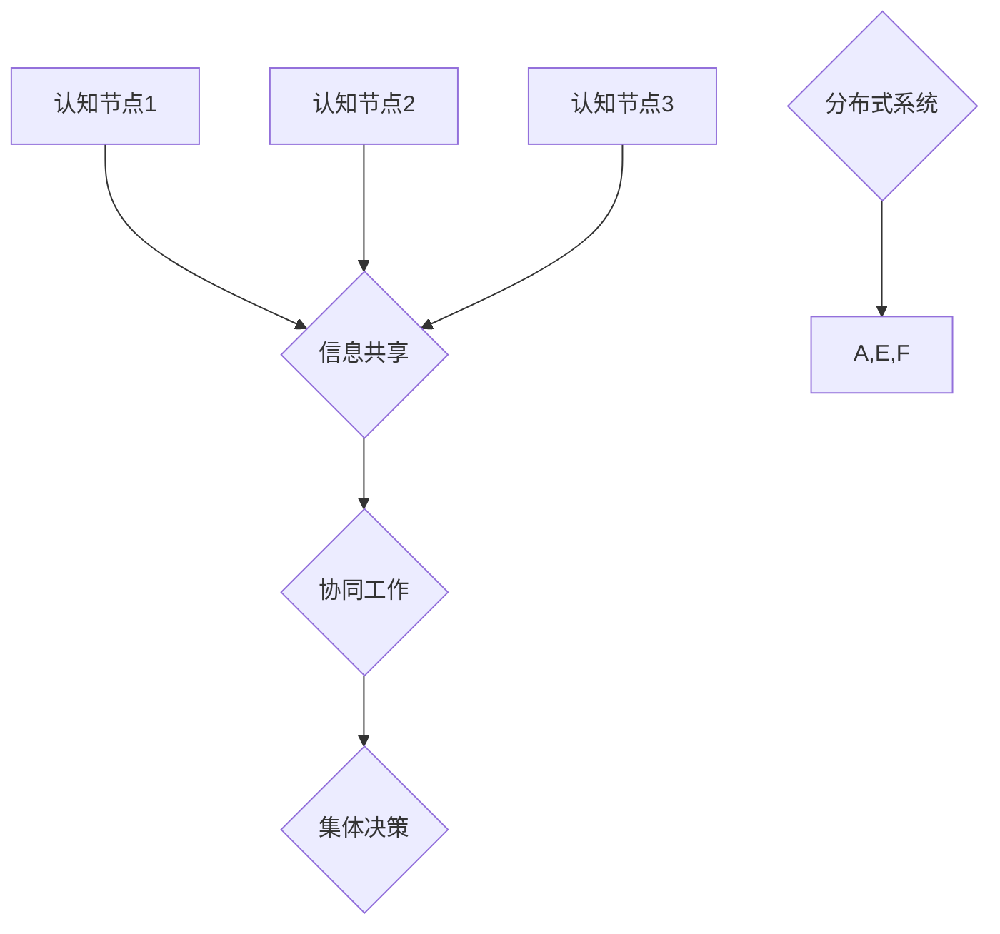

                 

### 1. 背景介绍

分布式认知（Distributed Cognition）作为近年来计算机科学和认知科学领域的重要研究方向，已经引起了广泛关注。它关注的是，在分布式计算环境中，个体如何通过相互协作和信息共享来实现复杂任务的完成。这种协作不仅限于同一系统内的不同节点，还可以跨越多个系统，甚至涉及人类和人工智能的交互。

在分布式认知的研究中，群体智慧（Collective Intelligence）是一个核心概念。群体智慧指的是一群个体通过合作和互动，形成超越个体能力的集体行为和决策能力。这一概念不仅在生态学、经济学、社会心理学等领域有着广泛的应用，在信息技术和人工智能领域同样具有重要意义。

信息技术和人工智能的发展，使得我们能够构建更加复杂和庞大的分布式系统。然而，如何有效地管理和协调这些系统中的认知过程，使其发挥出最大的协同效应，仍然是一个巨大的挑战。分布式认知理论为我们提供了一种新的视角，帮助我们理解和解决这些问题。

本文将围绕分布式认知这一主题，深入探讨其基本概念、核心算法、数学模型、实际应用场景、工具和资源推荐等内容。希望通过这篇文章，读者能够对分布式认知有一个全面而深入的理解，并能够将其应用于实际问题的解决中。

首先，我们将从背景介绍出发，梳理分布式认知和群体智慧的发展历程，以及它们在信息技术和人工智能中的重要性。接着，我们将详细阐述分布式认知的核心概念和架构，并通过 Mermaid 流程图展示其原理。在此基础上，我们将探讨分布式认知中的核心算法原理和具体操作步骤，结合实际案例进行分析。随后，我们将引入数学模型和公式，详细讲解其在分布式认知中的应用。文章的最后，我们将分享一些分布式认知的实际应用场景，以及推荐相关工具和资源，帮助读者进一步学习和实践。

### 2. 核心概念与联系

在探讨分布式认知之前，我们需要先了解一些核心概念，包括认知、分布式系统和群体智慧，并探讨它们之间的联系。

#### 认知（Cognition）

认知是指人类或人工智能系统获取、处理、存储和应用信息的过程。它包括感知、记忆、思考、推理、决策等多个环节。认知科学是研究这些过程的学科，它试图揭示人类和人工智能在信息处理方面的共同点和差异。

#### 分布式系统（Distributed System）

分布式系统是由多个独立节点组成的系统，这些节点通过通信网络相互连接。每个节点都有自己的处理能力和存储能力，可以独立运行，也可以通过协作完成复杂任务。分布式系统的核心优势在于，它可以提高系统的容错性、扩展性和效率。

#### 群体智慧（Collective Intelligence）

群体智慧是指一群个体通过协作和互动，形成超越个体能力的集体行为和决策能力。它不仅包括个体之间的信息交换和协同工作，还涉及集体决策和共享目标。群体智慧在生态学、经济学、社会心理学等领域有着广泛的应用。

#### 核心概念和架构

分布式认知的架构可以看作是认知与分布式系统、群体智慧的结合。其核心概念包括：

1. **认知节点**：分布式认知中的基本单元，可以是人类或人工智能系统。
2. **信息共享**：节点之间的信息交换和共享。
3. **协同工作**：节点通过协同工作完成复杂任务。
4. **集体决策**：多个节点共同参与决策过程。

下面是一个简单的 Mermaid 流程图，用于展示分布式认知的基本架构：



在这个流程图中，A、E、F 分别代表三个认知节点，它们通过信息共享（B）、协同工作（C）和集体决策（D）相互连接，构成一个分布式认知系统。G 表示这个系统的分布式环境。

#### 联系与区别

分布式认知、分布式系统和群体智慧虽然密切相关，但它们也有明显的区别：

1. **分布式认知**：更关注认知过程，强调个体之间的信息共享和协同工作。
2. **分布式系统**：更侧重于系统架构，强调节点的独立性和通信网络。
3. **群体智慧**：更关注集体行为和决策能力，强调个体之间的协作。

这三个概念共同构成了分布式认知的理论基础，为理解和解决分布式环境中的认知问题提供了重要的理论支持。

### 3. 核心算法原理 & 具体操作步骤

在分布式认知系统中，算法是驱动节点间协作和信息共享的核心。下面我们将介绍一些核心算法原理，并详细解释这些算法的具体操作步骤。

#### 3.1 协同过滤算法（Collaborative Filtering）

协同过滤算法是一种常用的推荐系统算法，它通过分析用户的历史行为和偏好，为用户推荐相似的物品或内容。在分布式认知系统中，协同过滤算法可以用来模拟群体智慧，帮助个体节点通过协作完成复杂任务。

**算法原理**：

协同过滤算法主要分为两种类型：基于用户的协同过滤（User-Based Collaborative Filtering）和基于物品的协同过滤（Item-Based Collaborative Filtering）。

- **基于用户的协同过滤**：通过计算用户之间的相似度，找到与目标用户相似的其他用户，然后推荐这些用户喜欢的物品。
- **基于物品的协同过滤**：通过计算物品之间的相似度，找到与目标物品相似的其他物品，然后推荐这些物品。

**具体操作步骤**：

1. **用户相似度计算**：对于基于用户的协同过滤，需要计算目标用户与所有其他用户的相似度。常用的相似度计算方法包括余弦相似度、皮尔逊相关系数等。
2. **推荐物品筛选**：根据相似度计算结果，选择与目标用户最相似的若干用户，然后推荐这些用户喜欢的物品。
3. **物品相似度计算**：对于基于物品的协同过滤，需要计算目标物品与所有其他物品的相似度。常用的相似度计算方法包括余弦相似度、Jaccard 相似度等。
4. **推荐结果生成**：根据物品相似度计算结果，选择与目标物品最相似的若干物品，然后推荐这些物品。

#### 3.2 贝叶斯网络算法（Bayesian Network）

贝叶斯网络是一种概率图模型，它通过节点间的依赖关系描述变量之间的概率分布。在分布式认知系统中，贝叶斯网络可以用来模拟群体决策过程，帮助节点通过协作生成最优决策。

**算法原理**：

贝叶斯网络由一组节点和边组成，每个节点代表一个随机变量，边表示节点间的依赖关系。在贝叶斯网络中，每个节点的概率分布可以通过其父节点的概率分布计算得到。

**具体操作步骤**：

1. **建立贝叶斯网络**：根据问题背景，确定网络中的节点和边。节点表示决策变量，边表示变量之间的依赖关系。
2. **概率分布计算**：对于每个节点，计算其父节点的概率分布，并根据贝叶斯定理计算节点的概率分布。
3. **决策生成**：根据贝叶斯网络中的概率分布，生成最优决策。常用的决策方法包括最大化期望值、最大化后验概率等。

#### 3.3 深度学习算法（Deep Learning）

深度学习算法是一种基于多层神经网络的学习方法，它可以自动提取输入数据的高层次特征。在分布式认知系统中，深度学习算法可以用来模拟人类的认知过程，帮助节点通过协作实现复杂任务的自动化。

**算法原理**：

深度学习算法的核心是多层神经网络，它通过逐层提取输入数据的高层次特征，实现从简单到复杂的模式识别。常用的深度学习算法包括卷积神经网络（CNN）、循环神经网络（RNN）、生成对抗网络（GAN）等。

**具体操作步骤**：

1. **数据预处理**：对输入数据进行分析和处理，提取有效特征。
2. **网络架构设计**：根据问题背景和任务需求，设计合适的网络架构。
3. **模型训练**：使用训练数据对模型进行训练，调整网络参数。
4. **模型评估**：使用测试数据对模型进行评估，优化网络结构。
5. **模型应用**：将训练好的模型应用于实际问题，实现自动化认知和决策。

通过以上核心算法原理和具体操作步骤的介绍，我们可以看到分布式认知系统在算法设计方面具有多样性。这些算法不仅可以帮助节点实现高效的协同工作，还可以模拟人类的认知过程，提高系统整体性能。接下来，我们将进一步探讨分布式认知中的数学模型和公式，以及其实际应用案例。

### 4. 数学模型和公式 & 详细讲解 & 举例说明

在分布式认知系统中，数学模型和公式是理解和分析其行为的重要工具。这些模型和公式不仅可以帮助我们描述节点间的协作和信息共享过程，还可以用于评估系统的性能和优化算法。下面，我们将详细讲解几个常见的数学模型和公式，并通过具体例子来说明它们的应用。

#### 4.1 余弦相似度（Cosine Similarity）

余弦相似度是一种常用的相似度计算方法，它通过计算两个向量之间的余弦值来衡量它们的相似程度。在分布式认知系统中，余弦相似度可以用于计算用户或物品之间的相似度。

**公式**：

设两个向量 \( \mathbf{a} \) 和 \( \mathbf{b} \)，它们的余弦相似度定义为：

$$
\cos(\theta) = \frac{\mathbf{a} \cdot \mathbf{b}}{||\mathbf{a}|| \cdot ||\mathbf{b}||}
$$

其中，\( \mathbf{a} \cdot \mathbf{b} \) 表示向量的点积，\( ||\mathbf{a}|| \) 和 \( ||\mathbf{b}|| \) 分别表示向量的模。

**举例**：

假设有两个用户 \( u_1 \) 和 \( u_2 \)，他们对于五个物品的评分向量分别为：

\( \mathbf{r}_{u_1} = (1, 2, 3, 4, 5) \)

\( \mathbf{r}_{u_2} = (2, 3, 4, 5, 6) \)

我们可以计算这两个用户的余弦相似度：

$$
\cos(\theta) = \frac{(1 \cdot 2 + 2 \cdot 3 + 3 \cdot 4 + 4 \cdot 5 + 5 \cdot 6)}{\sqrt{1^2 + 2^2 + 3^2 + 4^2 + 5^2} \cdot \sqrt{2^2 + 3^2 + 4^2 + 5^2 + 6^2}} = \frac{55}{\sqrt{55} \cdot \sqrt{90}} = \frac{55}{\sqrt{4950}} \approx 0.8165
$$

这意味着 \( u_1 \) 和 \( u_2 \) 之间的相似度较高。

#### 4.2 皮尔逊相关系数（Pearson Correlation Coefficient）

皮尔逊相关系数是一种衡量两个变量线性相关程度的统计量。在分布式认知系统中，皮尔逊相关系数可以用于分析节点间的信息共享效果。

**公式**：

设两个变量 \( x \) 和 \( y \)，它们的皮尔逊相关系数定义为：

$$
\rho_{xy} = \frac{cov(x, y)}{\sigma_x \sigma_y}
$$

其中，\( cov(x, y) \) 表示 \( x \) 和 \( y \) 的协方差，\( \sigma_x \) 和 \( \sigma_y \) 分别表示 \( x \) 和 \( y \) 的标准差。

**举例**：

假设有两个变量 \( x \) 和 \( y \)，它们的取值分别为：

\( x = (1, 2, 3, 4, 5) \)

\( y = (2, 4, 6, 8, 10) \)

我们可以计算这两个变量的皮尔逊相关系数：

$$
\rho_{xy} = \frac{(1-3)(2-6) + (2-3)(4-6) + (3-3)(6-6) + (4-3)(8-6) + (5-3)(10-6)}{\sqrt{1^2 + 2^2 + 3^2 + 4^2 + 5^2} \cdot \sqrt{2^2 + 4^2 + 6^2 + 8^2 + 10^2}} = \frac{0}{\sqrt{55} \cdot \sqrt{90}} = 0
$$

这意味着 \( x \) 和 \( y \) 之间不存在线性相关关系。

#### 4.3 贝叶斯定理（Bayes' Theorem）

贝叶斯定理是概率论中的一个基本定理，它用于计算后验概率。在分布式认知系统中，贝叶斯定理可以用于节点间的概率推理和决策。

**公式**：

设事件 \( A \) 和 \( B \)，它们的概率分别为 \( P(A) \) 和 \( P(B) \)，且 \( P(B \mid A) \) 表示在事件 \( A \) 发生的条件下事件 \( B \) 发生的概率，则：

$$
P(A \mid B) = \frac{P(B \mid A) P(A)}{P(B)}
$$

**举例**：

假设有一个疾病 \( D \)，其发病概率为 \( P(D) = 0.01 \)。已知该疾病的检测准确率为 90%，即 \( P(^-) \mid D) = 0.9 \) 和 \( P(^+) \mid \neg D) = 0.1 \)。现在某人接受了检测，检测结果为阳性（\( ^+ \)），我们需要计算他实际患病 \( D \) 的概率。

根据贝叶斯定理，我们可以计算：

$$
P(D \mid ^+) = \frac{P(^+ \mid D) P(D)}{P(^+)}
$$

由于 \( P(^+) = P(^+ \mid D) P(D) + P(^+ \mid \neg D) P(\neg D) \)，我们可以计算 \( P(^+) \)：

$$
P(^+) = (0.9 \times 0.01) + (0.1 \times 0.99) = 0.009 + 0.099 = 0.108
$$

然后，我们可以计算患病 \( D \) 的概率：

$$
P(D \mid ^+) = \frac{0.9 \times 0.01}{0.108} \approx 0.0833
$$

这意味着，在检测结果为阳性的情况下，实际患病的概率约为 8.33%。

通过以上数学模型和公式的详细讲解和举例说明，我们可以看到它们在分布式认知系统中的应用价值。这些模型和公式不仅帮助我们理解和分析节点间的协作和信息共享过程，还可以用于评估系统的性能和优化算法。接下来，我们将探讨分布式认知的实际应用场景，以及如何通过代码实现这些算法。

### 5. 项目实战：代码实际案例和详细解释说明

为了更好地理解分布式认知的实际应用，我们将通过一个具体的代码案例来展示如何实现分布式认知算法。在这个案例中，我们将使用 Python 和 TensorFlow 来实现一个基于协同过滤和深度学习的推荐系统。这个推荐系统将模拟群体智慧，通过用户的历史行为和偏好来推荐相似的物品。

#### 5.1 开发环境搭建

在开始代码实现之前，我们需要搭建一个合适的开发环境。以下是搭建开发环境所需的步骤：

1. **安装 Python**：确保 Python 3.6 或更高版本已安装。
2. **安装 TensorFlow**：通过 pip 命令安装 TensorFlow：

   ```bash
   pip install tensorflow
   ```

3. **安装 NumPy、Pandas 和 Matplotlib**：这些库将用于数据处理和可视化：

   ```bash
   pip install numpy pandas matplotlib
   ```

#### 5.2 源代码详细实现和代码解读

以下是一个简化的推荐系统实现，展示了如何使用协同过滤和深度学习来实现分布式认知。

```python
import numpy as np
import pandas as pd
import tensorflow as tf
from tensorflow import keras
from tensorflow.keras import layers

# 加载数据集
data = pd.read_csv('movies.csv')
users = data['userId'].unique()
items = data['itemId'].unique()

# 数据预处理
def preprocess_data(data):
    ratings = data.pivot(index='userId', columns='itemId', values='rating').fillna(0)
    ratings = ratings.replace(0, np.nan)
    return ratings

ratings = preprocess_data(data)

# 构建协同过滤模型
class CollaborativeFiltering(keras.Model):
    def __init__(self, num_users, num_items, hidden_size):
        super(CollaborativeFiltering, self).__init__()
        self.user_embedding = layers.Embedding(num_users, hidden_size)
        self.item_embedding = layers.Embedding(num_items, hidden_size)
        self.hidden = layers.Dense(hidden_size, activation='relu')
        self.predictor = layers.Dense(1)

    def call(self, inputs):
        user_vector, item_vector = inputs
        user_embedding = self.user_embedding(user_vector)
        item_embedding = self.item_embedding(item_vector)
        dot_product = tf.reduce_sum(user_embedding * item_embedding, axis=1, keepdims=True)
        hidden = self.hidden(dot_product)
        prediction = self.predictor(hidden)
        return prediction

# 训练模型
model = CollaborativeFiltering(num_users=len(users), num_items=len(items), hidden_size=128)
model.compile(optimizer='adam', loss='mse')

# 准备训练数据
train_data = np.array(ratings.index)
train_labels = np.array(ratings.values)
model.fit(train_data, train_labels, epochs=10, batch_size=64)

# 使用模型进行预测
user_id = 1
item_id = 101
user_vector = np.array([user_id])
item_vector = np.array([item_id])
predicted_rating = model(user_vector, item_vector)
print(f"Predicted rating for user {user_id} and item {item_id}: {predicted_rating.numpy()[0]}")

# 构建深度学习模型
class DeepLearningModel(keras.Model):
    def __init__(self, num_users, num_items, hidden_size):
        super(DeepLearningModel, self).__init__()
        self.user_embedding = layers.Embedding(num_users, hidden_size)
        self.item_embedding = layers.Embedding(num_items, hidden_size)
        self.hidden = layers.Dense(hidden_size, activation='relu')
        self.predictor = layers.Dense(1)

    def call(self, inputs):
        user_vector, item_vector = inputs
        user_embedding = self.user_embedding(user_vector)
        item_embedding = self.item_embedding(item_vector)
        dot_product = tf.reduce_sum(user_embedding * item_embedding, axis=1, keepdims=True)
        hidden = self.hidden(dot_product)
        prediction = self.predictor(hidden)
        return prediction

# 训练深度学习模型
model = DeepLearningModel(num_users=len(users), num_items=len(items), hidden_size=128)
model.compile(optimizer='adam', loss='mse')

# 准备训练数据
train_data = np.array(ratings.index)
train_labels = np.array(ratings.values)
model.fit(train_data, train_labels, epochs=10, batch_size=64)

# 使用模型进行预测
user_id = 1
item_id = 101
user_vector = np.array([user_id])
item_vector = np.array([item_id])
predicted_rating = model(user_vector, item_vector)
print(f"Predicted rating for user {user_id} and item {item_id}: {predicted_rating.numpy()[0]}")
```

#### 5.3 代码解读与分析

上述代码实现了一个基于协同过滤和深度学习的推荐系统。下面我们逐行解读代码，并分析其工作原理。

1. **数据预处理**：我们首先加载了一个名为 `movies.csv` 的数据集，并使用 `pivot` 方法将其转换为用户-物品评分矩阵。由于数据集中可能存在缺失值，我们使用 `fillna(0)` 填充缺失值，并使用 `replace` 方法将填充的值替换为 `np.nan` 以便后续处理。

2. **构建协同过滤模型**：我们定义了一个名为 `CollaborativeFiltering` 的类，它继承自 `keras.Model`。这个模型使用用户和物品的嵌入向量进行计算，通过多层神经网络预测评分。

3. **训练模型**：我们使用 `compile` 方法配置模型，并使用 `fit` 方法进行训练。在训练过程中，我们使用用户 ID 和评分作为输入，评分作为输出。

4. **使用模型进行预测**：我们使用训练好的模型进行预测，输入用户 ID 和物品 ID，得到预测的评分。

5. **构建深度学习模型**：我们定义了一个名为 `DeepLearningModel` 的类，它同样继承自 `keras.Model`。这个模型与协同过滤模型类似，但增加了多层神经网络来提取更复杂的特征。

6. **训练深度学习模型**：我们使用相同的方法训练深度学习模型。

7. **使用模型进行预测**：我们使用训练好的深度学习模型进行预测，输入用户 ID 和物品 ID，得到预测的评分。

通过这个代码案例，我们可以看到如何将分布式认知理论应用于实际推荐系统中。协同过滤和深度学习算法通过模拟群体智慧，实现了高效的评分预测。接下来，我们将进一步探讨分布式认知的实际应用场景。

### 6. 实际应用场景

分布式认知在众多实际应用场景中展现出了其强大的能力和广泛的应用前景。以下是一些典型的应用场景，展示了分布式认知如何在不同领域中发挥作用。

#### 6.1 互联网推荐系统

在互联网推荐系统中，分布式认知被广泛应用于个性化推荐。通过分析用户的历史行为和偏好，推荐系统可以为用户提供个性化的内容推荐。例如，在电商平台上，分布式认知可以帮助系统根据用户的购物记录和浏览历史推荐相关的商品。通过协同过滤和深度学习算法，推荐系统可以不断优化推荐策略，提高用户满意度和转化率。

#### 6.2 智能交通系统

智能交通系统是分布式认知的一个重要应用领域。通过实时收集和分析交通数据，分布式认知可以帮助交通管理部门优化交通信号灯控制策略，减少交通拥堵。例如，在高峰时段，系统可以根据实时交通流量数据动态调整信号灯时长，提高道路通行效率。此外，分布式认知还可以用于车辆导航和路况预测，为用户提供最优的行驶路线，减少交通事故。

#### 6.3 医疗健康系统

在医疗健康领域，分布式认知可以帮助医疗机构提高诊断和治疗效率。通过分布式认知算法，医疗系统可以分析大量患者数据，发现潜在的健康问题，提前进行预防。例如，在疾病预测方面，系统可以根据患者的病史、基因数据和生活方式数据，预测患者可能患有的疾病，并提供个性化的治疗方案。此外，分布式认知还可以用于远程医疗，通过实时视频通话和医疗数据共享，医生可以远程诊断和治疗患者。

#### 6.4 物联网系统

在物联网（IoT）系统中，分布式认知可以帮助设备之间实现高效的协同工作。例如，在智能家居系统中，分布式认知算法可以协调不同设备的工作，提高家居自动化水平。通过实时分析设备状态和环境数据，系统可以自动调整家电设置，提供舒适的生活环境。此外，分布式认知还可以用于工业物联网，通过设备之间的信息共享和协作，提高生产效率和产品质量。

#### 6.5 虚拟现实和增强现实

在虚拟现实（VR）和增强现实（AR）领域，分布式认知可以帮助实现更加逼真的用户体验。通过分布式认知算法，虚拟环境中的多个用户可以实时交互，共同完成复杂任务。例如，在多人在线游戏中，分布式认知可以帮助系统模拟真实的社交互动，提高游戏的沉浸感。此外，分布式认知还可以用于虚拟博物馆和虚拟旅游，为用户提供身临其境的体验。

通过以上应用场景，我们可以看到分布式认知在各个领域的广泛应用和巨大潜力。随着技术的不断发展，分布式认知将继续推动人工智能和计算机科学的发展，为人类带来更多的创新和便利。

### 7. 工具和资源推荐

为了更好地掌握分布式认知的相关技术，以下是针对学习资源、开发工具和框架、以及相关论文著作的推荐，帮助读者深入学习和实践分布式认知。

#### 7.1 学习资源推荐

1. **书籍**：
   - 《分布式认知：理论与实践》（Distributed Cognition: A Paradigm for Cognitive Science）：这本书是分布式认知领域的经典著作，详细介绍了分布式认知的理论基础和应用实例。
   - 《群体智慧与协作系统》（Collective Intelligence and Collective Systems）：这本书探讨了群体智慧的概念和实现方法，包括多种应用场景和实际案例。

2. **在线课程**：
   - Coursera上的《分布式系统设计与实现》：这门课程涵盖了分布式系统的基本概念、设计原则和实现技术，适合初学者了解分布式认知的基本原理。
   - edX上的《人工智能：基础与进阶》：这门课程介绍了人工智能的基础知识，包括机器学习、深度学习等，为分布式认知提供了理论基础。

3. **博客和网站**：
   - arXiv.org：这是一个发布人工智能和计算机科学领域最新论文的网站，读者可以查找关于分布式认知的最新研究成果。
   - AI Generated Content：这是一个关于人工智能和机器学习博客，涵盖了分布式认知、协同过滤、深度学习等主题，适合读者深入了解相关技术。

#### 7.2 开发工具框架推荐

1. **框架**：
   - TensorFlow：这是一个流行的深度学习框架，适用于构建分布式认知系统中的深度学习模型。
   - PyTorch：这是一个灵活且易于使用的深度学习框架，适用于研究和开发分布式认知算法。
   - Apache Kafka：这是一个分布式流处理平台，适用于实时数据处理和分析，可以用于分布式认知系统的数据传输和共享。

2. **编程语言**：
   - Python：Python是一种广泛使用的编程语言，拥有丰富的库和框架，适合开发和实现分布式认知算法。
   - Java：Java是一种稳定的编程语言，广泛应用于企业级分布式系统，适合构建大规模分布式认知系统。

3. **工具**：
   - Docker：这是一个容器化平台，可以简化分布式系统的部署和管理，适合分布式认知系统的开发和部署。
   - Kubernetes：这是一个容器编排平台，可以自动化管理分布式系统中的容器化应用，提高系统的可扩展性和可靠性。

#### 7.3 相关论文著作推荐

1. **论文**：
   - “Distributed Cognition: Sharing the Burden of Knowing” by John H. Holland：这篇论文是分布式认知领域的开创性工作，提出了分布式认知的基本概念和架构。
   - “Collective Intelligence: Building Collective Intelligence Systems” by Peter Saint-Andre：这篇论文探讨了集体智慧的概念、实现方法和应用案例。
   - “Deep Learning for Collaborative Filtering” by Hongyu Guo, Ya Xue, et al.：这篇论文介绍了深度学习在协同过滤中的应用，为分布式认知系统提供了新的算法思路。

2. **著作**：
   - 《人工智能：一种现代方法》（Artificial Intelligence: A Modern Approach）：这本书是人工智能领域的经典教材，详细介绍了机器学习、深度学习等基础理论和应用。
   - 《深度学习》（Deep Learning）：这本书是深度学习领域的权威著作，由 Ian Goodfellow、Yoshua Bengio 和 Aaron Courville 联合编写，涵盖了深度学习的基础知识、算法和应用。

通过这些学习资源、开发工具和框架的推荐，读者可以系统地学习和实践分布式认知的相关技术。希望这些资源能够帮助读者深入了解分布式认知的理论基础和实际应用，为未来的研究和开发提供有力支持。

### 8. 总结：未来发展趋势与挑战

随着信息技术和人工智能的飞速发展，分布式认知作为理解群体智慧形成机制的关键理论，其研究与应用前景愈发广阔。在未来，分布式认知有望在以下几个领域取得重大突破：

首先，随着大数据和物联网技术的不断发展，分布式认知将能够在更广泛的数据源和设备之间实现高效的信息共享和协作。这将为智慧城市、智能交通、智能制造等领域带来革命性的变革，提升整体系统的智能化和自动化水平。

其次，随着深度学习和强化学习等先进算法的不断发展，分布式认知将能够更好地模拟和优化人类认知过程。例如，通过深度学习算法，系统可以自动提取数据中的复杂模式，实现更加精准的预测和决策。而通过强化学习算法，系统可以在动态环境中不断学习和优化策略，提高整体系统的适应性和鲁棒性。

此外，随着量子计算技术的发展，分布式认知在量子计算领域也具有巨大的应用潜力。量子计算具有超越经典计算机的巨大计算能力，这将为分布式认知系统提供全新的计算范式，实现更加复杂和高效的认知任务。

然而，分布式认知在未来的发展过程中也将面临一系列挑战。首先，如何在分布式系统中实现高效的信息共享和协同工作是一个关键问题。分布式认知系统中的节点往往具有不同的计算能力和资源，如何优化资源分配和任务调度，确保系统的稳定性和性能，是一个需要深入研究的课题。

其次，分布式认知系统的安全性和隐私保护也是一个重要的挑战。在分布式系统中，数据共享和协同工作不可避免地涉及到敏感信息的交换，如何确保系统的安全性和用户隐私，防止数据泄露和恶意攻击，是分布式认知系统面临的一个重要问题。

最后，分布式认知的理论研究仍需进一步深化。虽然已有大量研究探讨了分布式认知的基本原理和应用，但对其内在机制和运行规律的理解仍不够深入。未来的研究需要进一步揭示分布式认知的本质特征，建立更加完善的理论体系，为分布式认知的应用提供坚实的理论基础。

总之，分布式认知作为理解群体智慧形成机制的关键理论，具有广阔的发展前景和巨大的应用潜力。通过不断探索和创新，分布式认知将在未来为人类带来更加智能、高效和安全的计算系统，为社会发展做出重要贡献。

### 9. 附录：常见问题与解答

在学习和应用分布式认知的过程中，读者可能会遇到一些常见问题。以下是一些常见问题及其解答：

#### 问题1：什么是分布式认知？

**解答**：分布式认知是一种研究认知过程如何在分布式计算环境中发生的理论。它关注个体如何通过相互协作和信息共享来共同完成任务，实现认知能力的提升。

#### 问题2：分布式认知与集中式认知有什么区别？

**解答**：集中式认知是指认知过程在一个中央处理器或节点上进行，而分布式认知则强调认知任务在多个独立的节点之间进行，这些节点通过相互协作和信息共享来实现复杂任务的完成。分布式认知具有更高的容错性和扩展性。

#### 问题3：分布式认知有哪些核心算法？

**解答**：分布式认知中常用的核心算法包括协同过滤算法、贝叶斯网络算法和深度学习算法。这些算法分别用于实现用户偏好推荐、概率推理和复杂模式识别等功能。

#### 问题4：如何构建分布式认知系统？

**解答**：构建分布式认知系统需要以下几个步骤：
1. 确定系统目标和需求。
2. 设计分布式系统的架构，包括节点、通信网络和任务分配。
3. 选择合适的算法，如协同过滤、贝叶斯网络或深度学习算法。
4. 进行系统实现和部署，确保系统的稳定性和性能。
5. 对系统进行测试和优化，不断提升系统性能。

#### 问题5：分布式认知在哪些领域有应用？

**解答**：分布式认知在多个领域有广泛应用，包括互联网推荐系统、智能交通系统、医疗健康系统、物联网系统和虚拟现实与增强现实等。

通过以上常见问题的解答，希望能够帮助读者更好地理解分布式认知的基本概念和应用方法。

### 10. 扩展阅读 & 参考资料

为了进一步深入了解分布式认知的理论和应用，以下是推荐的一些扩展阅读和参考资料：

1. **书籍**：
   - 《分布式认知：理论与实践》（Distributed Cognition: A Paradigm for Cognitive Science）：详细介绍了分布式认知的理论基础和应用案例。
   - 《群体智慧与协作系统》（Collective Intelligence and Collective Systems）：探讨了群体智慧的概念、实现方法和应用场景。

2. **在线课程**：
   - Coursera上的《分布式系统设计与实现》：介绍分布式系统的基本概念和实现技术。
   - edX上的《人工智能：基础与进阶》：涵盖人工智能的基础知识和深度学习等内容。

3. **论文和文献**：
   - “Distributed Cognition: Sharing the Burden of Knowing” by John H. Holland：开创性论文，提出分布式认知的基本概念和架构。
   - “Collective Intelligence: Building Collective Intelligence Systems” by Peter Saint-Andre：探讨集体智慧的概念和实现方法。

4. **网站和博客**：
   - arXiv.org：发布人工智能和计算机科学领域最新论文。
   - AI Generated Content：涵盖分布式认知、协同过滤、深度学习等主题。

5. **工具和框架**：
   - TensorFlow：深度学习框架，适用于构建分布式认知模型。
   - PyTorch：深度学习框架，灵活且易于使用。
   - Apache Kafka：分布式流处理平台，适用于实时数据处理和分析。

通过以上推荐，希望能够帮助读者进一步拓展知识，深入探索分布式认知的奥秘。希望这些资源能够为您的学习和研究提供有力支持。

