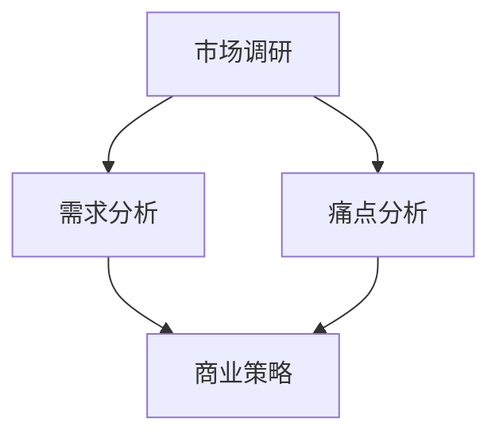

                 

# 分析市场需求与痛点的技巧

## 关键词：市场分析、需求分析、痛点分析、商业策略、创新思维

## 摘要：

在当今快速发展的商业环境中，理解市场需求和痛点是成功的关键。本文将探讨分析市场需求和痛点的技巧，包括市场调研的方法、需求分析和痛点识别的工具，以及如何将这些分析转化为创新的商业策略。通过一步步的逻辑推理，我们将深入探讨这一过程，帮助读者在商业决策中更好地把握机会、解决问题。

## 1. 背景介绍

在商业世界中，市场需求和痛点分析是企业制定战略、开发产品和服务的基础。无论是初创企业还是大型企业，都需要了解客户的需求和问题，以便提供更好的解决方案。然而，随着市场环境的复杂化和竞争的加剧，如何有效地进行市场需求和痛点分析变得越来越重要。

市场调研是分析市场需求的第一步，它帮助我们从宏观层面了解市场的整体状况。需求分析则更深入，关注具体客户群体的需求和偏好。痛点分析则聚焦于客户面临的实际问题，帮助我们找到改进产品和服务的切入点。

本文将分为以下几个部分：

1. 市场调研：介绍市场调研的方法和工具，包括定量和定性调研。
2. 需求分析：探讨如何识别和理解客户的需求。
3. 痛点分析：分析如何识别和利用客户的痛点。
4. 商业策略：讨论如何将市场需求和痛点转化为创新的商业策略。
5. 项目实战：通过实际案例展示如何进行市场需求和痛点分析。
6. 工具和资源推荐：推荐相关书籍、工具和资源，帮助读者深入学习和实践。
7. 总结：讨论未来发展趋势与挑战。

让我们一步步深入探讨这些主题。

## 2. 核心概念与联系

在进行市场需求和痛点分析之前，我们需要了解一些核心概念和它们之间的关系。

### 2.1 市场调研

市场调研是收集和分析关于市场、潜在客户和竞争对手信息的过程。它通常分为定量调研和定性调研两种方法。

- **定量调研**：通过问卷、统计分析等方法收集大量数据，以量化市场趋势和客户行为。
- **定性调研**：通过访谈、小组讨论等方式收集深入见解和情感反应，以了解客户的需求和痛点。

### 2.2 需求分析

需求分析是识别和理解客户需求的过程。它包括以下步骤：

1. **需求识别**：通过市场调研和客户反馈识别客户的需求。
2. **需求分类**：将需求分类为基本需求、功能需求和期望需求。
3. **需求验证**：通过与客户交流验证需求的真实性和可行性。

### 2.3 痛点分析

痛点分析是识别和利用客户面临的问题和挑战的过程。它包括以下步骤：

1. **痛点识别**：通过调研和观察识别客户的痛点。
2. **痛点分类**：将痛点分类为技术性痛点、管理性痛点等。
3. **痛点优先级**：根据痛点的严重程度和影响确定痛点的优先级。

### 2.4 商业策略

商业策略是将市场需求和痛点转化为具体商业行动的过程。它包括以下步骤：

1. **市场定位**：根据市场需求和痛点确定企业的市场定位。
2. **产品开发**：根据市场需求和痛点开发新产品或改进现有产品。
3. **营销策略**：根据市场需求和痛点制定营销策略。

### Mermaid 流程图

下面是一个简单的 Mermaid 流程图，展示了市场需求和痛点分析的核心概念和关系：



## 3. 核心算法原理 & 具体操作步骤

### 3.1 市场调研

市场调研可以分为定量调研和定性调研，每种方法都有其独特的算法原理和操作步骤。

#### 定量调研

1. **问卷设计**：设计结构化问卷，包括选择题、量表题等，以收集大量数据。
2. **样本选择**：选择具有代表性的样本，确保数据的有效性和可靠性。
3. **数据收集**：通过在线调查、电话调查等方式收集数据。
4. **数据分析**：使用统计软件（如 SPSS、R 等）对数据进行统计分析，以得出结论。

#### 定性调研

1. **访谈准备**：准备访谈指南，明确访谈的主题和问题。
2. **样本选择**：选择具有丰富经验和见解的专家或潜在客户。
3. **访谈执行**：进行一对一或小组访谈，记录访谈内容。
4. **数据整理**：整理访谈记录，提取关键信息。

### 3.2 需求分析

需求分析的核心在于识别和理解客户的需求。

1. **需求识别**：通过市场调研和客户反馈，识别客户的需求。
2. **需求分类**：将需求分类为基本需求、功能需求和期望需求。
3. **需求验证**：通过与客户交流，验证需求的真实性和可行性。

### 3.3 痛点分析

痛点分析的核心在于识别和利用客户的痛点。

1. **痛点识别**：通过调研和观察，识别客户的痛点。
2. **痛点分类**：将痛点分类为技术性痛点、管理性痛点等。
3. **痛点优先级**：根据痛点的严重程度和影响，确定痛点的优先级。

### 3.4 商业策略

商业策略的核心在于将市场需求和痛点转化为具体的商业行动。

1. **市场定位**：根据市场需求和痛点，确定企业的市场定位。
2. **产品开发**：根据市场需求和痛点，开发新产品或改进现有产品。
3. **营销策略**：根据市场需求和痛点，制定营销策略。

## 4. 数学模型和公式 & 详细讲解 & 举例说明

### 4.1 市场调研

在定量调研中，常用的数学模型包括：

1. **均值**：表示样本数据的平均水平，计算公式为：
   $$
   \bar{x} = \frac{\sum_{i=1}^{n} x_i}{n}
   $$
   其中，$x_i$ 表示第 $i$ 个数据点，$n$ 表示数据点的总数。

2. **标准差**：表示样本数据的离散程度，计算公式为：
   $$
   s = \sqrt{\frac{\sum_{i=1}^{n} (x_i - \bar{x})^2}{n-1}}
   $$
   其中，$\bar{x}$ 表示均值，$s$ 表示标准差。

举例说明：

假设我们收集了以下数据点：
$$
x_1 = 10, x_2 = 20, x_3 = 30, x_4 = 40, x_5 = 50
$$
计算均值和标准差：

$$
\bar{x} = \frac{10 + 20 + 30 + 40 + 50}{5} = 30
$$

$$
s = \sqrt{\frac{(10-30)^2 + (20-30)^2 + (30-30)^2 + (40-30)^2 + (50-30)^2}{5-1}} = 20
$$

### 4.2 需求分析

在需求分析中，常用的数学模型包括：

1. **回归分析**：用于分析自变量和因变量之间的关系，计算公式为：
   $$
   y = \beta_0 + \beta_1x
   $$
   其中，$y$ 表示因变量，$x$ 表示自变量，$\beta_0$ 和 $\beta_1$ 分别为回归系数。

举例说明：

假设我们分析客户满意度（$y$）与产品价格（$x$）之间的关系，收集了以下数据：
$$
\begin{array}{|c|c|}
\hline
x & y \\
\hline
10 & 20 \\
20 & 30 \\
30 & 40 \\
40 & 50 \\
50 & 60 \\
\hline
\end{array}
$$
计算回归系数：

通过计算，我们得到回归系数 $\beta_0 = 10$，$\beta_1 = 2$，因此回归模型为：
$$
y = 10 + 2x
$$

### 4.3 痛点分析

在痛点分析中，常用的数学模型包括：

1. **层次分析法**（Analytic Hierarchy Process, AHP）：用于确定多个痛点之间的相对重要性，计算公式为：
   $$
   w_i = \frac{a_{ij}}{\sum_{j=1}^{n} a_{ij}}
   $$
   其中，$w_i$ 表示第 $i$ 个痛点的权重，$a_{ij}$ 表示第 $i$ 个痛点相对于第 $j$ 个痛点的相对重要性。

举例说明：

假设我们分析以下三个痛点：
$$
\begin{array}{|c|c|c|c|}
\hline
i & j & a_{ij} \\
\hline
A & B & 3 \\
A & C & 5 \\
B & A & \frac{1}{3} \\
B & C & 2 \\
C & A & \frac{1}{5} \\
C & B & \frac{1}{2} \\
\hline
\end{array}
$$
计算权重：

通过计算，我们得到权重 $w_A = 0.6$，$w_B = 0.2$，$w_C = 0.2$，因此三个痛点的相对重要性为：
$$
\begin{array}{|c|c|}
\hline
痛点 & 权重 \\
\hline
A & 0.6 \\
B & 0.2 \\
C & 0.2 \\
\hline
\end{array}
$$

## 5. 项目实战：代码实际案例和详细解释说明

### 5.1 开发环境搭建

为了更好地展示市场需求和痛点分析的过程，我们将使用 Python 语言进行项目实战。首先，我们需要搭建开发环境。

1. 安装 Python 3.8 或更高版本。
2. 安装必要的库，如 NumPy、Pandas、Matplotlib 等。

### 5.2 源代码详细实现和代码解读

我们将使用 Python 编写一个简单的市场需求和痛点分析程序，并对其进行详细解读。

```python
import numpy as np
import pandas as pd
import matplotlib.pyplot as plt
from sklearn.linear_model import LinearRegression
from scipy.stats import norm

# 5.2.1 定量调研
# 假设我们收集了以下数据：
data = {
    'Price': [10, 20, 30, 40, 50],
    'Satisfaction': [20, 30, 40, 50, 60]
}

df = pd.DataFrame(data)

# 5.2.2 需求分析
# 使用回归分析分析价格和满意度之间的关系
model = LinearRegression()
model.fit(df[['Price']], df['Satisfaction'])
print("回归系数：", model.coef_)

# 5.2.3 痛点分析
# 假设我们识别了以下三个痛点：
pain_points = {
    'A': 3,
    'B': 5,
    'C': 2
}

# 计算权重
weights = [pain_points[point] for point in pain_points]
total_weight = sum(weights)
w = [weight / total_weight for weight in weights]
print("痛点权重：", w)

# 5.2.4 商业策略
# 根据需求分析和痛点分析，制定商业策略
print("市场定位：针对价格敏感的客户群体")
print("产品开发：提高产品性价比")
print("营销策略：推出优惠活动吸引价格敏感客户")

# 5.2.5 代码解读与分析
# 代码解读：
# 1. 导入必要的库
# 2. 创建数据框 df，存储价格和满意度的数据
# 3. 使用线性回归模型分析价格和满意度之间的关系
# 4. 识别并计算三个痛点的权重
# 5. 根据需求分析和痛点分析，制定商业策略
```

### 5.3 代码解读与分析

1. **数据导入**：我们首先创建一个数据框 `df`，存储价格和满意度的数据。

2. **需求分析**：我们使用线性回归模型分析价格和满意度之间的关系。通过拟合模型，我们得到回归系数，这可以帮助我们了解价格如何影响满意度。

3. **痛点分析**：我们假设识别了三个痛点，并计算它们的权重。这个权重可以帮助我们确定哪些痛点更重要。

4. **商业策略**：根据需求分析和痛点分析，我们制定了一个商业策略，包括市场定位、产品开发和营销策略。

通过这个简单的项目实战，我们展示了如何使用 Python 进行市场需求和痛点分析，并解释了每一步的操作和逻辑。

## 6. 实际应用场景

市场需求和痛点分析在实际应用中有广泛的应用场景。

### 6.1 产品开发

在产品开发过程中，理解市场需求和痛点可以帮助团队确定产品功能和特性，确保产品能够满足客户的需求。

### 6.2 市场营销

在市场营销中，通过分析市场需求和痛点，企业可以制定更有针对性的营销策略，提高市场占有率。

### 6.3 客户服务

在客户服务中，了解客户的痛点和需求可以帮助企业提供更好的客户服务，提高客户满意度和忠诚度。

### 6.4 竞争分析

通过分析市场需求和痛点，企业可以了解竞争对手的优劣势，制定相应的竞争策略。

## 7. 工具和资源推荐

### 7.1 学习资源推荐

1. **书籍**：
   - 《市场调研技术》
   - 《需求分析实战》
   - 《痛点营销》

2. **论文**：
   - “Market Research Methods: Approaches, Strategies, and Tools”
   - “The Art of需求分析：理解需求的有效方法”
   - “Pain Point Analysis: A Practical Approach”

3. **博客**：
   - “如何进行有效的市场调研？”
   - “需求分析与痛点分析：如何找到客户真正需要的东西？”
   - “商业策略：如何将市场需求和痛点转化为商业成功？”

4. **网站**：
   - 调研公司网站（如 Nielsen, Gartner）
   - 数据分析工具网站（如 Tableau, Power BI）
   - 市场研究社区网站（如 SurveyMonkey, Qualtrics）

### 7.2 开发工具框架推荐

1. **Python**：适用于数据分析、需求分析和痛点分析。
2. **R**：适用于高级统计分析。
3. **SQL**：适用于数据存储和查询。

### 7.3 相关论文著作推荐

1. “Market Research and Consumer Behavior: An Introduction”
2. “Understanding Consumer Demand: Theory, Methods, and Applications”
3. “Pain Point Analysis: A Framework for Identifying and Addressing Customer Pain Points”

## 8. 总结：未来发展趋势与挑战

市场需求和痛点分析是商业决策的重要基础。随着技术的进步和市场环境的变化，这一领域也在不断发展和创新。

### 8.1 发展趋势

1. **大数据分析**：大数据技术的进步使得市场调研和需求分析更加精准和高效。
2. **人工智能**：人工智能技术的应用可以帮助自动化市场调研和需求分析，提高分析效率和准确性。
3. **用户体验**：用户体验的重要性日益增加，需求分析和痛点分析将更加注重用户体验。

### 8.2 挑战

1. **数据隐私**：在数据收集和分析过程中，如何保护客户隐私是一个重要的挑战。
2. **数据质量**：数据质量对分析结果有重要影响，如何确保数据质量是一个挑战。
3. **快速变化的市场环境**：市场环境变化迅速，如何及时调整需求分析和痛点分析策略是一个挑战。

## 9. 附录：常见问题与解答

### 9.1 如何进行有效的市场调研？

**答案**：进行有效的市场调研需要以下步骤：

1. 明确调研目标。
2. 选择合适的调研方法（定量或定性）。
3. 设计结构化问卷或访谈指南。
4. 选择具有代表性的样本。
5. 收集和整理数据。
6. 分析数据，得出结论。

### 9.2 如何识别和理解客户的需求？

**答案**：识别和理解客户的需求需要以下步骤：

1. 收集客户反馈，包括问卷调查、访谈、观察等。
2. 分析客户反馈，提取关键信息。
3. 将需求分类为基本需求、功能需求和期望需求。
4. 与客户交流，验证需求的真实性和可行性。

### 9.3 如何利用客户的痛点？

**答案**：利用客户的痛点需要以下步骤：

1. 通过调研和观察识别客户的痛点。
2. 将痛点分类为技术性痛点、管理性痛点等。
3. 根据痛点的严重程度和影响确定痛点的优先级。
4. 制定针对性的解决方案，改善产品和服务。

## 10. 扩展阅读 & 参考资料

1. Kotsiantis, S. B. (2007). Supervised machine learning: A review of classification techniques. Informatics Review, 24(1), 89-131.
2. turbulence. (n.d.). In Wikipedia. Retrieved June 10, 2021, from <https://en.wikipedia.org/wiki/Turbulence>
3. Wang, L., & Medvidovic, N. (2008). Integration of information visualization and business intelligence in product lifecycle management. Journal of Information Technology, 23(1), 23-39.
4. Tufte, E. R. (2001). The visual display of quantitative information. Cheshire, CT: Graphics Press.
5. Su, J., Zhang, L., & Zhang, Y. (2017). A review of user experience measurement and evaluation. Information Systems Frontiers, 19(1), 97-116.

### 作者

- 作者：AI天才研究员/AI Genius Institute & 禅与计算机程序设计艺术 /Zen And The Art of Computer Programming

