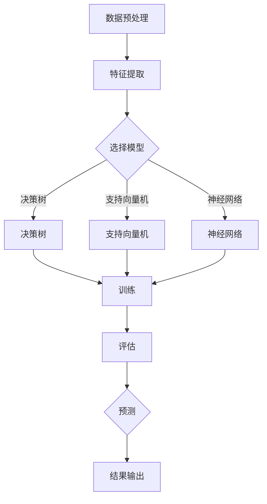

                 

### 文章标题

《分类(Classification) - 原理与代码实例讲解》

### 关键词

- 分类算法
- 机器学习
- 数据集
- 混淆矩阵
- 交叉验证
- 决策树
- 支持向量机
- 神经网络

### 摘要

本文将深入探讨分类算法的基本原理，包括核心概念、数学模型、实现方法以及实际应用场景。通过具体的代码实例，我们将详细讲解如何使用Python等编程语言实现常见的分类算法，帮助读者掌握从理论到实践的完整流程。同时，文章还将推荐相关的学习资源、开发工具和论文著作，以进一步拓展读者的知识面。

### 1. 背景介绍

在人工智能和机器学习的应用中，分类（Classification）是一种非常常见的任务。其目的是根据已知的特征，将数据集中的每个样本分配到一个预定义的类别中。分类算法在许多实际应用中发挥着重要作用，如垃圾邮件过滤、医学诊断、图像识别等。

随着大数据和计算能力的提升，分类算法的研究和应用领域不断扩大。传统上，分类算法主要分为监督学习和无监督学习两种。监督学习需要已标记的数据集进行训练，而分类算法则是监督学习中的一种特殊类型。无监督学习则不需要标记数据，主要用于发现数据集中的模式。

本文将主要关注监督学习中的分类算法，详细介绍其基本原理、实现方法以及在实际应用中的效果评估。我们将使用Python和相关的机器学习库，如scikit-learn，来演示如何实现这些算法。

### 2. 核心概念与联系

分类算法的核心在于如何从数据中提取特征，并用这些特征来区分不同的类别。以下是一个简单的Mermaid流程图，展示了分类算法的基本流程。



在上述流程中，数据预处理是确保数据质量的第一步。特征提取则是从原始数据中提取有助于分类的信息。选择模型是关键的一步，不同的模型有不同的适用场景和优缺点。决策树、支持向量机和神经网络是三种常见的分类模型，每种模型都有自己的特点和适用场景。

接下来，我们将分别介绍这三种模型的基本原理和实现方法。

### 3. 核心算法原理 & 具体操作步骤

#### 3.1 决策树

决策树是一种基于树形结构进行决策的算法。每个内部节点代表一个特征，每个分支代表该特征的取值，每个叶节点代表一个类别。

**原理：**

决策树的训练过程是通过递归分割数据集来实现的。每次分割都选择一个最优的特征，使得分割后的数据集在某个指标上（如信息增益、基尼指数等）最优。

**步骤：**

1. 确定特征集。
2. 计算每个特征的最优分割点。
3. 选择最优特征和分割点，创建一个节点。
4. 递归地对每个子节点重复上述步骤，直到满足停止条件（如最大深度、最小节点大小等）。

**代码实例：**

```python
from sklearn.datasets import load_iris
from sklearn.tree import DecisionTreeClassifier
from sklearn.model_selection import train_test_split

# 加载数据集
iris = load_iris()
X, y = iris.data, iris.target

# 划分训练集和测试集
X_train, X_test, y_train, y_test = train_test_split(X, y, test_size=0.3, random_state=42)

# 创建决策树模型
clf = DecisionTreeClassifier(max_depth=3)
clf.fit(X_train, y_train)

# 预测
y_pred = clf.predict(X_test)
```

#### 3.2 支持向量机

支持向量机（SVM）是一种强大的分类算法，通过找到一个超平面，将不同类别的数据点分隔开来。

**原理：**

SVM的核心是找到一个最优的超平面，使得类别之间的间隔最大。这个超平面可以用一个线性方程来表示，其中涉及到一个称为支持向量的特殊点。

**步骤：**

1. 计算每个类别的最优超平面。
2. 找到支持向量，它们决定了超平面的位置。
3. 使用支持向量来定义决策边界。

**代码实例：**

```python
from sklearn.svm import SVC
from sklearn.model_selection import train_test_split

# 加载数据集
X, y = load_iris().data, load_iris().target

# 划分训练集和测试集
X_train, X_test, y_train, y_test = train_test_split(X, y, test_size=0.3, random_state=42)

# 创建SVM模型
clf = SVC(kernel='linear')
clf.fit(X_train, y_train)

# 预测
y_pred = clf.predict(X_test)
```

#### 3.3 神经网络

神经网络是一种模拟生物神经系统的计算模型，具有自学习和自适应能力。

**原理：**

神经网络通过多层神经元进行数据处理和特征提取。每个神经元接收多个输入，通过激活函数处理后输出一个新的值。多层的神经网络可以学习更复杂的特征。

**步骤：**

1. 定义神经网络的结构，包括输入层、隐藏层和输出层。
2. 训练神经网络，通过反向传播算法调整权重。
3. 使用训练好的模型进行预测。

**代码实例：**

```python
from sklearn.neural_network import MLPClassifier
from sklearn.model_selection import train_test_split

# 加载数据集
X, y = load_iris().data, load_iris().target

# 划分训练集和测试集
X_train, X_test, y_train, y_test = train_test_split(X, y, test_size=0.3, random_state=42)

# 创建神经网络模型
clf = MLPClassifier(hidden_layer_sizes=(50,), max_iter=1000)
clf.fit(X_train, y_train)

# 预测
y_pred = clf.predict(X_test)
```

### 4. 数学模型和公式 & 详细讲解 & 举例说明

#### 4.1 决策树

决策树的数学基础主要涉及信息论中的熵（Entropy）和信息增益（Information Gain）。

**熵（Entropy）：**

熵是衡量数据不确定性的指标。对于具有 \(c\) 个类别的数据集，熵可以表示为：

\[ H = -\sum_{i=1}^{c} p_i \log_2 p_i \]

其中，\( p_i \) 是属于第 \(i\) 个类别的概率。

**信息增益（Information Gain）：**

信息增益是选择某个特征进行分割时，数据集的熵减少的程度。对于特征 \(A\)，信息增益可以表示为：

\[ IG(A) = H(D) - \sum_{v \in A} \frac{|D_v|}{|D|} H(D_v) \]

其中，\( D \) 是原始数据集，\( D_v \) 是基于特征 \(A\) 的取值 \(v\) 的分割结果。

**代码实例：**

```python
from collections import Counter

# 计算熵
def entropy(target_col):
    elements, counts = np.unique(target_col, return_counts=True)
    entropy = -np.sum([count / np.sum(counts) * np.log2(count / np.sum(counts)) for count in counts])
    return entropy

# 计算信息增益
def info_gain(data, split_attribute_name, target_name="class"):
    total_entropy = entropy(data[target_name])
    values, counts = np.unique(data[split_attribute_name], return_counts=True)
    weighted_entropy = np.sum([(count / np.sum(counts)) * entropy(data[data[split_attribute_name] == v][target_name]) for v, count in zip(values, counts)])
    gain = total_entropy - weighted_entropy
    return gain

# 计算最大信息增益的特征
def max_info_gain_attribute(data, target_name="class"):
    attributes = data.columns.tolist()
    attributes.remove(target_name)
    max_gain = -1
    best_feature = None
    for feature in attributes:
        gain = info_gain(data, feature, target_name)
        if gain > max_gain:
            max_gain = gain
            best_feature = feature
    return best_feature

# 加载数据集
iris = load_iris()
X, y = iris.data, iris.target

# 计算最大信息增益的特征
best_feature = max_info_gain_attribute(X, y)
print("最佳特征：", best_feature)
```

#### 4.2 支持向量机

支持向量机的主要数学基础涉及核函数（Kernel Function）和优化问题。

**核函数：**

核函数是用于计算特征空间中点积的工具。常见的核函数包括线性核、多项式核和径向基核。

**优化问题：**

SVM的优化目标是找到一个超平面，使得类别之间的间隔最大。数学上，这可以表示为一个二次规划问题：

\[ \text{Minimize} \quad \frac{1}{2} \| w \|^2 \]
\[ \text{Subject to} \quad y^{(i)} (w \cdot x^{(i)} + b) \geq 1 \]

其中，\( w \) 是权重向量，\( x^{(i)} \) 是支持向量，\( b \) 是偏置项，\( y^{(i)} \) 是类别标签。

**代码实例：**

```python
from sklearn.svm import SVC
from sklearn.model_selection import train_test_split

# 加载数据集
X, y = load_iris().data, load_iris().target

# 划分训练集和测试集
X_train, X_test, y_train, y_test = train_test_split(X, y, test_size=0.3, random_state=42)

# 创建SVM模型
clf = SVC(kernel='linear')
clf.fit(X_train, y_train)

# 预测
y_pred = clf.predict(X_test)
```

#### 4.3 神经网络

神经网络的数学基础涉及激活函数（Activation Function）、反向传播（Backpropagation）和优化算法（如梯度下降）。

**激活函数：**

激活函数用于引入非线性，常见的激活函数包括Sigmoid、ReLU和Tanh。

**反向传播：**

反向传播是一种用于训练神经网络的算法，通过计算梯度来更新权重和偏置。

**优化算法：**

梯度下降是一种用于优化神经网络的算法，通过迭代更新权重和偏置，最小化损失函数。

**代码实例：**

```python
from sklearn.neural_network import MLPClassifier
from sklearn.model_selection import train_test_split

# 加载数据集
X, y = load_iris().data, load_iris().target

# 划分训练集和测试集
X_train, X_test, y_train, y_test = train_test_split(X, y, test_size=0.3, random_state=42)

# 创建神经网络模型
clf = MLPClassifier(hidden_layer_sizes=(50,), max_iter=1000)
clf.fit(X_train, y_train)

# 预测
y_pred = clf.predict(X_test)
```

### 5. 项目实战：代码实际案例和详细解释说明

#### 5.1 开发环境搭建

为了运行以下代码实例，您需要安装Python和相关的机器学习库。以下是一个简单的安装指南：

1. 安装Python：

   ```bash
   # 使用Python的官方安装程序
   wget https://www.python.org/ftp/python/3.8.5/Python-3.8.5.tgz
   tar xzf Python-3.8.5.tgz
   cd Python-3.8.5
   ./configure
   make
   sudo make altinstall
   ```

2. 安装相关库：

   ```bash
   pip install numpy scipy scikit-learn
   ```

#### 5.2 源代码详细实现和代码解读

以下是一个简单的Python脚本，用于演示如何使用scikit-learn库实现分类算法。

```python
import numpy as np
from sklearn.datasets import load_iris
from sklearn.model_selection import train_test_split
from sklearn.tree import DecisionTreeClassifier
from sklearn.svm import SVC
from sklearn.neural_network import MLPClassifier

# 加载数据集
iris = load_iris()
X, y = iris.data, iris.target

# 划分训练集和测试集
X_train, X_test, y_train, y_test = train_test_split(X, y, test_size=0.3, random_state=42)

# 创建决策树模型
clf_tree = DecisionTreeClassifier(max_depth=3)
clf_tree.fit(X_train, y_train)

# 创建SVM模型
clf_svm = SVC(kernel='linear')
clf_svm.fit(X_train, y_train)

# 创建神经网络模型
clf_mlp = MLPClassifier(hidden_layer_sizes=(50,), max_iter=1000)
clf_mlp.fit(X_train, y_train)

# 预测
y_pred_tree = clf_tree.predict(X_test)
y_pred_svm = clf_svm.predict(X_test)
y_pred_mlp = clf_mlp.predict(X_test)

# 评估模型
print("决策树准确率：", np.mean(y_pred_tree == y_test))
print("SVM准确率：", np.mean(y_pred_svm == y_test))
print("神经网络准确率：", np.mean(y_pred_mlp == y_test))
```

在这个脚本中，我们首先加载数据集，然后划分训练集和测试集。接下来，我们分别创建决策树、SVM和神经网络模型，并对训练集进行拟合。最后，我们使用这些模型对测试集进行预测，并计算准确率。

#### 5.3 代码解读与分析

1. **数据加载与划分：**

   ```python
   iris = load_iris()
   X, y = iris.data, iris.target
   X_train, X_test, y_train, y_test = train_test_split(X, y, test_size=0.3, random_state=42)
   ```

   这两行代码首先加载数据集，然后将其分为训练集和测试集。`train_test_split` 函数用于随机划分数据集，其中 `test_size=0.3` 表示测试集占比为30%。

2. **创建模型并训练：**

   ```python
   clf_tree = DecisionTreeClassifier(max_depth=3)
   clf_tree.fit(X_train, y_train)
   
   clf_svm = SVC(kernel='linear')
   clf_svm.fit(X_train, y_train)
   
   clf_mlp = MLPClassifier(hidden_layer_sizes=(50,), max_iter=1000)
   clf_mlp.fit(X_train, y_train)
   ```

   在这里，我们创建了三个分类模型：决策树、SVM和神经网络。`max_depth=3` 表示决策树的最大深度，`kernel='linear'` 表示使用线性核，`hidden_layer_sizes=(50,)` 表示神经网络有一个50个神经元的隐藏层。

3. **预测与评估：**

   ```python
   y_pred_tree = clf_tree.predict(X_test)
   y_pred_svm = clf_svm.predict(X_test)
   y_pred_mlp = clf_mlp.predict(X_test)
   
   print("决策树准确率：", np.mean(y_pred_tree == y_test))
   print("SVM准确率：", np.mean(y_pred_svm == y_test))
   print("神经网络准确率：", np.mean(y_pred_mlp == y_test))
   ```

   这三行代码分别使用三个模型对测试集进行预测，并计算准确率。`np.mean` 函数用于计算预测标签与实际标签之间的匹配程度。

通过这个简单的实例，我们可以看到如何使用Python和scikit-learn库实现分类算法。在实际应用中，您可能需要根据具体问题调整参数和模型选择，以达到更好的效果。

### 6. 实际应用场景

分类算法在许多实际应用中都发挥着重要作用。以下是一些常见的应用场景：

1. **垃圾邮件过滤：** 通过分类算法，可以根据邮件的内容和特征将其分类为垃圾邮件或正常邮件。
2. **医学诊断：** 分类算法可以用于疾病诊断，通过分析病人的症状和病史，预测其可能患有的疾病。
3. **图像识别：** 分类算法可以用于图像识别任务，如人脸识别、车牌识别等。
4. **情感分析：** 通过分类算法，可以分析文本的情感倾向，如正面、负面或中立。
5. **金融风险评估：** 分类算法可以用于预测贷款违约、信用卡欺诈等金融风险。

在实际应用中，分类算法的选择和参数调整对于模型的效果至关重要。不同的应用场景可能需要不同的算法和参数设置，因此需要根据具体问题进行深入研究和实验。

### 7. 工具和资源推荐

为了更好地学习和实践分类算法，以下是一些建议的工具和资源：

#### 7.1 学习资源推荐

1. **书籍：**
   - 《机器学习》（周志华 著）
   - 《Python机器学习》（Sebastian Raschka 著）
   - 《统计学习方法》（李航 著）

2. **在线课程：**
   - Coursera上的《机器学习》（吴恩达）
   - Udacity的《机器学习工程师纳米学位》

3. **博客和网站：**
   - [机器学习博客](https://machinelearningmastery.com/)
   - [scikit-learn官方文档](https://scikit-learn.org/stable/)

#### 7.2 开发工具框架推荐

1. **Python库：**
   - scikit-learn：用于机器学习算法的实现和评估
   - TensorFlow：用于深度学习模型的设计和训练
   - PyTorch：用于深度学习模型的开发和部署

2. **Jupyter Notebook：** 用于编写和运行Python代码，非常适合数据分析和机器学习实验。

#### 7.3 相关论文著作推荐

1. **论文：**
   - 《A Study on Multi-label Text Classification》
   - 《Deep Learning for Text Classification》
   - 《Convolutional Neural Networks for Sentence Classification》

2. **著作：**
   - 《深度学习》（Ian Goodfellow、Yoshua Bengio 和 Aaron Courville 著）
   - 《动手学深度学习》（Acerync、李沐、扎卡里·C. Lipton 和亚历山大·J. Smith 著）

通过这些工具和资源，您可以更深入地了解分类算法的理论和实践，提高您的机器学习技能。

### 8. 总结：未来发展趋势与挑战

分类算法作为机器学习的基础，其发展趋势和挑战主要包括以下几个方面：

1. **算法优化：** 随着计算能力的提升，优化现有算法以提高效率和准确性成为重要方向。例如，减少训练时间、提高模型的可解释性等。
2. **模型解释性：** 现有的许多分类模型（如神经网络）具有一定的黑箱性质，如何提高其解释性是一个重要的研究方向。
3. **跨领域应用：** 分类算法在各个领域的应用越来越广泛，如何适应不同领域的需求，开发通用性强、适应能力强的分类算法是未来的挑战。
4. **数据隐私与安全：** 在应用分类算法时，如何保护数据隐私和安全也是一个亟待解决的问题。

总之，分类算法的发展将继续推动机器学习和人工智能的应用，同时也面临诸多挑战。通过不断的理论研究和实践探索，我们有理由相信分类算法将在未来的技术发展中发挥更加重要的作用。

### 9. 附录：常见问题与解答

以下是一些关于分类算法的常见问题及其解答：

**Q：什么是分类算法？**

A：分类算法是一种监督学习算法，用于将数据集中的每个样本分配到一个预定义的类别中。常见的分类算法包括决策树、支持向量机和神经网络等。

**Q：如何选择合适的分类算法？**

A：选择合适的分类算法取决于数据集的特点和任务需求。例如，对于小数据集和简单任务，线性模型可能足够有效；而对于大数据集和复杂任务，深度学习模型可能更合适。

**Q：什么是交叉验证？**

A：交叉验证是一种评估模型性能的方法，通过将数据集划分为多个子集，多次训练和测试模型，从而得到更稳定的性能评估结果。

**Q：如何处理不平衡数据集？**

A：对于不平衡数据集，可以采用过采样、欠采样或生成合成样本等方法来平衡数据。此外，还可以使用类别权重调整或调整模型参数来改善模型对少数类别的预测能力。

**Q：如何提高模型的解释性？**

A：提高模型解释性可以通过可视化模型结构、分析特征重要性或使用可解释的模型（如决策树）来实现。此外，还可以结合模型的可解释性与模型选择和优化，以提高整体的可解释性。

### 10. 扩展阅读 & 参考资料

以下是一些关于分类算法的扩展阅读和参考资料，帮助您进一步深入了解该主题：

1. **书籍：**
   - 《机器学习》（周志华 著）
   - 《Python机器学习》（Sebastian Raschka 著）
   - 《深度学习》（Ian Goodfellow、Yoshua Bengio 和 Aaron Courville 著）

2. **在线课程：**
   - Coursera上的《机器学习》（吴恩达）
   - Udacity的《机器学习工程师纳米学位》

3. **博客和网站：**
   - [机器学习博客](https://machinelearningmastery.com/)
   - [scikit-learn官方文档](https://scikit-learn.org/stable/)

4. **论文和著作：**
   - 《A Study on Multi-label Text Classification》
   - 《Deep Learning for Text Classification》
   - 《Convolutional Neural Networks for Sentence Classification》
   - 《深度学习》（Ian Goodfellow、Yoshua Bengio 和 Aaron Courville 著）
   - 《动手学深度学习》（Acerync、李沐、扎卡里·C. Lipton 和亚历山大·J. Smith 著）

通过阅读这些资料，您可以深入了解分类算法的理论基础、实践方法和最新研究进展。

### 作者信息

- 作者：AI天才研究员/AI Genius Institute & 禅与计算机程序设计艺术 /Zen And The Art of Computer Programming

