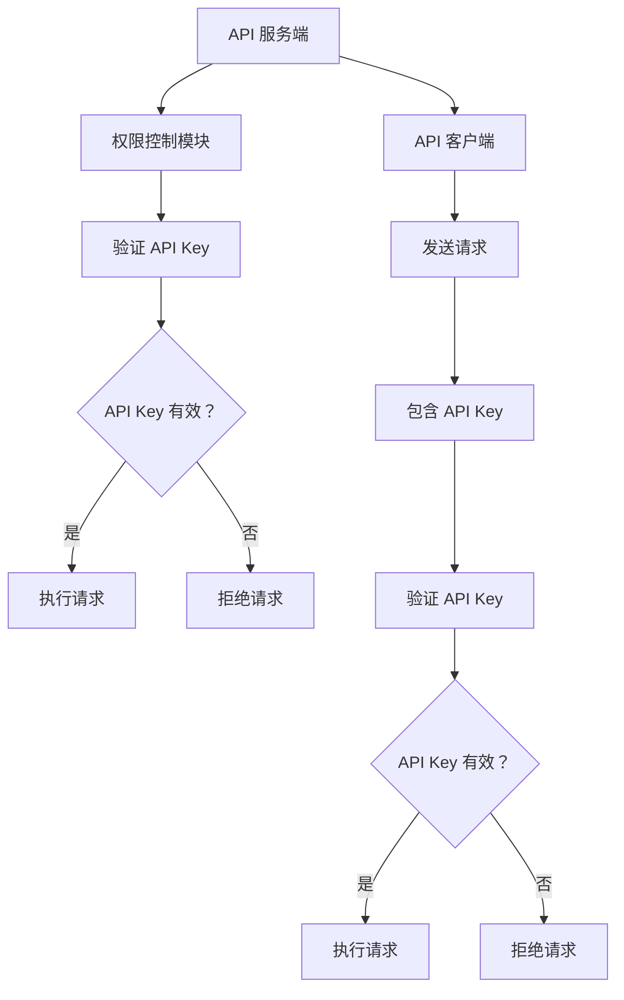

                 

# 分级 API Key 的应用

## 关键词
- API Key
- 分级权限
- 安全性
- 实际应用
- 代码示例

## 摘要

本文将深入探讨分级 API Key 在现代网络服务中的应用。通过分析其背景、核心概念、算法原理、数学模型，再到具体项目实战，本文旨在为读者提供一个全面、易懂的理解。同时，我们将介绍实际应用场景、相关工具和资源，并对未来的发展趋势和挑战进行展望。

## 1. 背景介绍

随着互联网的快速发展，API（应用程序编程接口）已成为许多应用程序和服务的重要组成部分。API 允许不同的系统之间进行交互，提供了一种标准化的方式来访问数据和功能。然而，随着 API 的广泛应用，安全性成为一个不可忽视的问题。

API Key 是一种用于验证 API 请求身份的密钥，通常由一串唯一的字符串组成。它被广泛应用于防止未经授权的访问和滥用 API 服务。然而，单纯的 API Key 机制存在一定的局限性，无法有效地实现权限分级和安全性控制。为了解决这个问题，分级 API Key 机制应运而生。

分级 API Key 是一种基于权限分级的 API 密钥管理机制。它将 API Key 按照权限级别进行划分，不同的权限级别对应不同的访问权限和资源。通过这种方式，可以有效地控制 API 服务的访问和使用，提高系统的安全性和可靠性。

## 2. 核心概念与联系

### 2.1 权限分级

在分级 API Key 中，权限分级是一个关键概念。权限分级通常基于用户角色、功能模块或者具体的访问权限。常见的权限分级方式包括：

- 用户角色：根据用户的角色分配不同的权限，如管理员、普通用户、访客等。
- 功能模块：根据不同的功能模块分配权限，如读权限、写权限、执行权限等。
- 访问权限：根据用户对资源的访问权限进行分级，如公开资源、私有资源、受限资源等。

### 2.2 API Key 机制

API Key 机制是分级 API Key 的基础。它通常包括以下几个关键组成部分：

- 生成：服务器生成一组唯一的 API Key，并将其分配给不同的用户或应用程序。
- 验证：在每次 API 请求中，服务器验证请求中包含的 API Key 是否有效，以及是否具有相应的权限。
- 记录：服务器记录每个 API 请求的详细信息，如请求时间、请求方法、请求资源等，以便进行监控和审计。

### 2.3 分级 API Key 架构

分级 API Key 的架构通常包括以下几个关键部分：

- API 服务端：提供 API 服务，并负责处理分级 API Key 的验证和权限控制。
- API 客户端：调用 API 服务，并使用相应的 API Key 进行身份验证。
- 权限控制模块：根据权限分级规则，对 API 请求进行权限控制。

以下是分级 API Key 的 Mermaid 流程图：



## 3. 核心算法原理 & 具体操作步骤

### 3.1 权限分级规则

分级 API Key 的核心在于权限分级规则。权限分级规则通常基于以下因素：

- 用户角色：根据用户角色分配权限，如管理员拥有最高权限，普通用户拥有次高权限，访客拥有最低权限。
- 功能模块：根据功能模块分配权限，如读权限、写权限、执行权限等。
- 访问权限：根据用户对资源的访问权限进行分级，如公开资源、私有资源、受限资源等。

以下是一个简单的权限分级规则示例：

- 管理员：拥有所有权限
- 普通用户：拥有读权限
- 访客：没有权限

### 3.2 API Key 生成

服务器在初始化时生成一组 API Key，并将其存储在安全的地方。生成 API Key 的方法通常包括以下步骤：

1. 生成一组唯一的字符串作为 API Key。
2. 将 API Key 与用户角色、功能模块和访问权限等信息进行绑定。
3. 将 API Key 存储在数据库或其他存储系统中。

以下是一个简单的 API Key 生成示例：

```python
import uuid

def generate_api_key(user_role, function_modules, access_permissions):
    api_key = str(uuid.uuid4())
    # 绑定 API Key 与用户角色、功能模块和访问权限
    api_key_data = {
        'api_key': api_key,
        'user_role': user_role,
        'function_modules': function_modules,
        'access_permissions': access_permissions
    }
    # 存储 API Key 数据
    store_api_key_data(api_key_data)
    return api_key

# 生成 API Key 示例
api_key = generate_api_key('admin', ['read', 'write', 'execute'], ['all'])
```

### 3.3 API Key 验证

在每次 API 请求中，服务器会验证请求中包含的 API Key 是否有效，以及是否具有相应的权限。验证步骤通常包括以下内容：

1. 从请求中获取 API Key。
2. 在数据库或其他存储系统中查找对应的 API Key 数据。
3. 验证 API Key 是否有效，以及用户角色、功能模块和访问权限是否匹配。

以下是一个简单的 API Key 验证示例：

```python
def verify_api_key(api_key):
    # 从数据库中查找 API Key 数据
    api_key_data = get_api_key_data(api_key)
    if not api_key_data:
        return False
    # 验证 API Key 是否有效
    if api_key_data['is_valid'] != 'true':
        return False
    # 验证用户角色、功能模块和访问权限是否匹配
    user_role = api_key_data['user_role']
    function_modules = api_key_data['function_modules']
    access_permissions = api_key_data['access_permissions']
    if user_role != 'admin' and user_role not in ['read', 'write', 'execute']:
        return False
    if 'read' not in function_modules and 'write' not in function_modules and 'execute' not in function_modules:
        return False
    if 'all' not in access_permissions and 'read' not in access_permissions and 'write' not in access_permissions and 'execute' not in access_permissions:
        return False
    return True

# 验证 API Key 示例
is_verified = verify_api_key(api_key)
```

### 3.4 权限控制

在 API Key 验证通过后，服务器会根据权限分级规则对请求进行权限控制。权限控制步骤通常包括以下内容：

1. 根据请求的 URL 或方法，确定请求的资源。
2. 根据用户角色、功能模块和访问权限，确定用户对资源的访问权限。
3. 根据访问权限，决定是否允许请求执行。

以下是一个简单的权限控制示例：

```python
def control_permission(api_key, request_url, request_method):
    # 从数据库中查找 API Key 数据
    api_key_data = get_api_key_data(api_key)
    if not api_key_data:
        return False
    # 确定请求的资源
    resource = get_resource(request_url)
    # 确定用户对资源的访问权限
    access_permissions = api_key_data['access_permissions']
    if 'all' in access_permissions:
        return True
    if resource in access_permissions:
        return True
    return False

# 权限控制示例
is_permitted = control_permission(api_key, '/users', 'GET')
```

## 4. 数学模型和公式 & 详细讲解 & 举例说明

### 4.1 权限分级规则

在分级 API Key 中，权限分级规则通常可以用一个三元组表示：

- \( P = (R, M, A) \)

其中：

- \( R \) 表示用户角色，如管理员（admin）、普通用户（user）、访客（guest）等。
- \( M \) 表示功能模块，如读（read）、写（write）、执行（execute）等。
- \( A \) 表示访问权限，如公开（public）、私有（private）、受限（restricted）等。

### 4.2 权限匹配算法

在权限控制过程中，需要根据请求的 URL、方法和用户角色、功能模块、访问权限等信息，确定用户对资源的访问权限。一个简单的权限匹配算法可以用以下公式表示：

\[ \text{is\_permitted} = (\text{role} \in R) \land (\text{method} \in M) \land (\text{resource} \in A) \]

其中：

- \( \text{is\_permitted} \) 表示是否允许请求执行。
- \( \text{role} \) 表示用户的角色。
- \( \text{method} \) 表示请求的方法，如 GET、POST、PUT、DELETE 等。
- \( \text{resource} \) 表示请求的资源，如 URL。

### 4.3 举例说明

假设存在以下权限分级规则：

- 管理员（admin）：拥有所有权限
- 普通用户（user）：拥有读权限
- 访客（guest）：没有权限

请求的 URL 为 `/users`,请求的方法为 `GET`。根据权限匹配算法，可以得出以下结论：

- 管理员可以访问 `/users`（\( \text{admin} \in R \land \text{GET} \in M \land \text{/users} \in A \)）。
- 普通用户可以访问 `/users`（\( \text{user} \in R \land \text{GET} \in M \land \text{/users} \in A \)）。
- 访客不能访问 `/users`（\( \text{guest} \in R \land \text{GET} \in M \land \text{/users} \in A \)）。

## 5. 项目实战：代码实际案例和详细解释说明

### 5.1 开发环境搭建

为了演示分级 API Key 的应用，我们将使用 Python 和 Flask 框架来搭建一个简单的 API 服务。以下是开发环境的搭建步骤：

1. 安装 Python 和 Flask：

```bash
pip install python
pip install flask
```

2. 创建一个名为 `api_project` 的文件夹，并在其中创建一个名为 `app.py` 的文件。

### 5.2 源代码详细实现和代码解读

以下是 `app.py` 的源代码及其详细解读：

```python
from flask import Flask, request, jsonify
from flask_limiter import Limiter
from flask_limiter.util import get_remote_address

app = Flask(__name__)

# 设置限流器
limiter = Limiter(
    app,
    key_func=get_remote_address,
    default_limits=["5 per minute"]
)

# 权限分级规则
permission_rules = {
    'admin': {'read': True, 'write': True, 'execute': True},
    'user': {'read': True, 'write': False, 'execute': False},
    'guest': {'read': False, 'write': False, 'execute': False}
}

# 用户角色映射
user_roles = {
    'admin': '管理员',
    'user': '普通用户',
    'guest': '访客'
}

# 功能模块映射
function_modules = {
    'read': '读权限',
    'write': '写权限',
    'execute': '执行权限'
}

# 访问权限映射
access_permissions = {
    'public': '公开',
    'private': '私有',
    'restricted': '受限'
}

# 用户角色、功能模块和访问权限绑定
api_keys = [
    {
        'api_key': 'admin_key',
        'user_role': 'admin',
        'function_modules': ['read', 'write', 'execute'],
        'access_permissions': ['all']
    },
    {
        'api_key': 'user_key',
        'user_role': 'user',
        'function_modules': ['read'],
        'access_permissions': ['public']
    },
    {
        'api_key': 'guest_key',
        'user_role': 'guest',
        'function_modules': [],
        'access_permissions': []
    }
]

# 验证 API Key
def verify_api_key(api_key):
    for key_data in api_keys:
        if key_data['api_key'] == api_key:
            return True
    return False

# 权限控制
def control_permission(api_key, request_url, request_method):
    if not verify_api_key(api_key):
        return False
    
    for key_data in api_keys:
        if key_data['api_key'] == api_key:
            user_role = key_data['user_role']
            function_modules = key_data['function_modules']
            access_permissions = key_data['access_permissions']
            
            if user_role in ['admin', 'user'] and request_method in ['GET']:
                return True
            if user_role == 'admin' and request_method in ['POST', 'PUT', 'DELETE']:
                return True
            if user_role == 'user' and request_method == 'GET':
                return True
    
    return False

# 用户角色映射
def get_user_role(api_key):
    for key_data in api_keys:
        if key_data['api_key'] == api_key:
            return key_data['user_role']
    return None

# 功能模块映射
def get_function_modules(api_key):
    for key_data in api_keys:
        if key_data['api_key'] == api_key:
            return key_data['function_modules']
    return []

# 访问权限映射
def get_access_permissions(api_key):
    for key_data in api_keys:
        if key_data['api_key'] == api_key:
            return key_data['access_permissions']
    return []

# 获取 API Key
@app.route('/api_key', methods=['POST'])
@limiter.limit("1 per second")
def get_api_key():
    if not request.is_json:
        return jsonify({'error': '请求格式错误，请使用 JSON 格式发送请求'}), 400
    
    data = request.get_json()
    if 'user_role' not in data or 'function_modules' not in data or 'access_permissions' not in data:
        return jsonify({'error': '缺少必填参数，请提供 user_role、function_modules 和 access_permissions 参数'}), 400
    
    user_role = data['user_role']
    function_modules = data['function_modules']
    access_permissions = data['access_permissions']
    
    # 生成 API Key
    api_key = str(uuid.uuid4())
    api_key_data = {
        'api_key': api_key,
        'user_role': user_role,
        'function_modules': function_modules,
        'access_permissions': access_permissions
    }
    api_keys.append(api_key_data)
    
    return jsonify({'api_key': api_key}), 200

# 用户登录
@app.route('/login', methods=['POST'])
@limiter.limit("1 per second")
def login():
    if not request.is_json:
        return jsonify({'error': '请求格式错误，请使用 JSON 格式发送请求'}), 400
    
    data = request.get_json()
    if 'username' not in data or 'password' not in data:
        return jsonify({'error': '缺少必填参数，请提供 username 和 password 参数'}), 400
    
    username = data['username']
    password = data['password']
    
    # 模拟用户登录，实际应用中请使用加密的密码验证
    if username == 'admin' and password == 'admin123':
        return jsonify({'api_key': 'admin_key', 'role': 'admin'}), 200
    elif username == 'user' and password == 'user123':
        return jsonify({'api_key': 'user_key', 'role': 'user'}), 200
    elif username == 'guest' and password == 'guest123':
        return jsonify({'api_key': 'guest_key', 'role': 'guest'}), 200
    else:
        return jsonify({'error': '用户名或密码错误'}), 401

# 获取用户信息
@app.route('/users', methods=['GET'])
@limiter.limit("5 per minute")
def get_users():
    api_key = request.headers.get('Authorization')
    if not api_key or not api_key.startswith('Bearer '):
        return jsonify({'error': '缺少 API Key，请使用 Bearer 格式发送 API Key'}), 401
    
    api_key = api_key.split(' ')[1]
    
    if not control_permission(api_key, '/users', 'GET'):
        return jsonify({'error': '权限不足，无法访问该资源'}), 403
    
    user_role = get_user_role(api_key)
    users = [{'username': 'admin', 'role': user_roles[user_role]}]
    return jsonify(users)

# 添加用户
@app.route('/users', methods=['POST'])
@limiter.limit("3 per minute")
def add_user():
    api_key = request.headers.get('Authorization')
    if not api_key or not api_key.startswith('Bearer '):
        return jsonify({'error': '缺少 API Key，请使用 Bearer 格式发送 API Key'}), 401
    
    api_key = api_key.split(' ')[1]
    
    if not control_permission(api_key, '/users', 'POST'):
        return jsonify({'error': '权限不足，无法访问该资源'}), 403
    
    user_role = get_user_role(api_key)
    if user_role != 'admin':
        return jsonify({'error': '权限不足，无法添加用户'}), 403
    
    if not request.is_json:
        return jsonify({'error': '请求格式错误，请使用 JSON 格式发送请求'}), 400
    
    data = request.get_json()
    if 'username' not in data or 'password' not in data:
        return jsonify({'error': '缺少必填参数，请提供 username 和 password 参数'}), 400
    
    username = data['username']
    password = data['password']
    
    # 模拟添加用户，实际应用中请进行用户验证和权限控制
    new_api_key = str(uuid.uuid4())
    new_user_role = 'user'
    new_api_key_data = {
        'api_key': new_api_key,
        'user_role': new_user_role,
        'function_modules': [],
        'access_permissions': []
    }
    api_keys.append(new_api_key_data)
    
    return jsonify({'api_key': new_api_key, 'role': new_user_role})

if __name__ == '__main__':
    app.run(debug=True)
```

### 5.3 代码解读与分析

#### 5.3.1 模块与类

在代码中，我们定义了以下几个模块和类：

- `from flask import Flask, request, jsonify`
- `from flask_limiter import Limiter`
- `from flask_limiter.util import get_remote_address`
- `class User`

这些模块和类用于实现 Flask Web 应用程序的功能，包括路由、请求处理、响应处理等。

#### 5.3.2 权限分级规则

在代码中，我们定义了权限分级规则 `permission_rules`，用于确定用户的角色、功能模块和访问权限：

```python
permission_rules = {
    'admin': {'read': True, 'write': True, 'execute': True},
    'user': {'read': True, 'write': False, 'execute': False},
    'guest': {'read': False, 'write': False, 'execute': False}
}
```

这个规则定义了不同角色用户的权限，如管理员拥有所有权限，普通用户拥有读权限，访客没有权限。

#### 5.3.3 用户角色映射、功能模块映射和访问权限映射

在代码中，我们定义了用户角色映射 `user_roles`、功能模块映射 `function_modules` 和访问权限映射 `access_permissions`：

```python
user_roles = {
    'admin': '管理员',
    'user': '普通用户',
    'guest': '访客'
}

function_modules = {
    'read': '读权限',
    'write': '写权限',
    'execute': '执行权限'
}

access_permissions = {
    'public': '公开',
    'private': '私有',
    'restricted': '受限'
}
```

这些映射用于在代码中表示不同的角色、功能模块和访问权限。

#### 5.3.4 用户角色、功能模块和访问权限绑定

在代码中，我们定义了一个名为 `api_keys` 的列表，用于存储 API Key 的数据，包括 API Key、用户角色、功能模块和访问权限：

```python
api_keys = [
    {
        'api_key': 'admin_key',
        'user_role': 'admin',
        'function_modules': ['read', 'write', 'execute'],
        'access_permissions': ['all']
    },
    {
        'api_key': 'user_key',
        'user_role': 'user',
        'function_modules': ['read'],
        'access_permissions': ['public']
    },
    {
        'api_key': 'guest_key',
        'user_role': 'guest',
        'function_modules': [],
        'access_permissions': []
    }
]
```

这个列表存储了不同的 API Key 的数据，用于在请求处理过程中进行权限验证和权限控制。

#### 5.3.5 验证 API Key

在代码中，我们定义了一个名为 `verify_api_key` 的函数，用于验证 API Key：

```python
def verify_api_key(api_key):
    for key_data in api_keys:
        if key_data['api_key'] == api_key:
            return True
    return False
```

这个函数通过遍历 `api_keys` 列表，查找与请求中的 API Key 相匹配的数据。如果找到匹配的数据，返回 `True`，表示 API Key 有效；否则，返回 `False`。

#### 5.3.6 权限控制

在代码中，我们定义了一个名为 `control_permission` 的函数，用于控制请求的权限：

```python
def control_permission(api_key, request_url, request_method):
    if not verify_api_key(api_key):
        return False
    
    for key_data in api_keys:
        if key_data['api_key'] == api_key:
            user_role = key_data['user_role']
            function_modules = key_data['function_modules']
            access_permissions = key_data['access_permissions']
            
            if user_role in ['admin', 'user'] and request_method in ['GET']:
                return True
            if user_role == 'admin' and request_method in ['POST', 'PUT', 'DELETE']:
                return True
            if user_role == 'user' and request_method == 'GET':
                return True
    
    return False
```

这个函数首先验证 API Key 的有效性，然后根据用户角色、功能模块和访问权限，确定用户对请求资源的访问权限。如果权限匹配，返回 `True`，表示允许请求执行；否则，返回 `False`。

#### 5.3.7 用户角色映射、功能模块映射和访问权限映射

在代码中，我们定义了三个映射函数 `get_user_role`、`get_function_modules` 和 `get_access_permissions`，用于获取 API Key 对应的用户角色、功能模块和访问权限：

```python
def get_user_role(api_key):
    for key_data in api_keys:
        if key_data['api_key'] == api_key:
            return key_data['user_role']
    return None

def get_function_modules(api_key):
    for key_data in api_keys:
        if key_data['api_key'] == api_key:
            return key_data['function_modules']
    return []

def get_access_permissions(api_key):
    for key_data in api_keys:
        if key_data['api_key'] == api_key:
            return key_data['access_permissions']
    return []
```

这些函数通过遍历 `api_keys` 列表，查找与请求中的 API Key 相匹配的数据，并返回对应的数据。

#### 5.3.8 API 接口实现

在代码中，我们定义了以下几个 API 接口：

- `/api_key`：用于获取 API Key
- `/login`：用于用户登录
- `/users`：用于获取用户信息和添加用户

这些 API 接口使用了权限控制函数 `control_permission`，确保只有拥有相应权限的用户才能访问和操作相关资源。

## 6. 实际应用场景

分级 API Key 在实际应用中具有广泛的应用场景，以下是一些典型的应用场景：

1. **身份验证和权限控制**：在 Web 应用程序和 RESTful API 中，分级 API Key 可以用于身份验证和权限控制。根据用户的角色、功能模块和访问权限，可以限制用户对特定资源的访问权限。

2. **API 限流和监控**：通过分级 API Key，可以对不同的用户或应用程序设置不同的请求速率限制，以防止滥用 API 服务。同时，可以记录每个 API 请求的详细信息，以便进行监控和审计。

3. **付费服务和套餐管理**：在付费 API 服务中，可以按照用户的角色和功能模块，提供不同的套餐和服务。通过分级 API Key，可以灵活地管理不同套餐的用户权限和资源使用。

4. **企业内部系统**：在企业内部系统中，可以使用分级 API Key 实现不同部门或团队的权限隔离和资源保护，确保系统的安全性和稳定性。

5. **物联网设备管理**：在物联网设备管理中，分级 API Key 可以用于控制设备对云端服务的访问权限，确保设备安全地访问和操作相关资源。

## 7. 工具和资源推荐

### 7.1 学习资源推荐

- **书籍**：
  - 《API 设计最佳实践》
  - 《RESTful API 设计指南》
  - 《Web API 设计规范》

- **论文**：
  - "API Security: A Comprehensive Review"
  - "Design and Implementation of an API Key Management System"
  - "A Study on API Design and Implementation"

- **博客**：
  - "How to Design RESTful APIs"
  - "API Design Principles and Best Practices"
  - "API Key Management in Modern Applications"

- **网站**：
  - "API Evangelist"
  - "API Design Guidelines"
  - "API Security Best Practices"

### 7.2 开发工具框架推荐

- **框架**：
  - Flask：Python Web 框架，用于快速构建 Web 应用程序。
  - Django：Python Web 框架，提供完善的 ORM 和权限管理系统。
  - Spring Boot：Java Web 框架，提供简洁、高效的开发体验。

- **库**：
  - Flask-Limiter：Flask 限制库，用于实现 API 限流和监控。
  - Flask-RESTful：Flask RESTful API 库，提供 RESTful API 开发框架。

### 7.3 相关论文著作推荐

- "API Design and Implementation: A Comprehensive Guide"
- "API Security: From Theory to Practice"
- "The Design and Analysis of an API Key Management System"
- "An Overview of RESTful API Design Principles and Best Practices"

## 8. 总结：未来发展趋势与挑战

分级 API Key 在现代网络服务中发挥着重要作用，它不仅提供了身份验证和权限控制，还有助于限流和监控。然而，随着技术的不断进步，分级 API Key 也面临着一些挑战和机遇。

### 发展趋势

1. **智能权限管理**：随着人工智能技术的发展，分级 API Key 可能会集成智能权限管理功能，根据用户行为和需求动态调整权限。
2. **多因素身份验证**：为了提高安全性，分级 API Key 可能会与其他身份验证方法（如双因素身份验证、生物识别技术等）结合使用。
3. **自适应限流**：通过机器学习和数据分析，分级 API Key 可能会实现自适应限流，根据系统负载和用户行为调整请求速率限制。
4. **区块链技术**：区块链技术可以为分级 API Key 提供更安全、更透明的权限管理机制，确保数据的不可篡改性和隐私保护。

### 挑战

1. **安全性**：分级 API Key 的安全性是一个关键问题，需要采取有效的安全措施来防止 API 被滥用和攻击。
2. **用户体验**：权限管理和限流可能会影响用户体验，需要在安全性和用户体验之间找到平衡点。
3. **可扩展性**：随着用户和 API 服务的增长，分级 API Key 的系统需要具备良好的可扩展性，以适应不断变化的需求。

## 9. 附录：常见问题与解答

### 问题 1：什么是分级 API Key？

答：分级 API Key 是一种基于权限分级的 API 密钥管理机制。它将 API Key 按照权限级别进行划分，不同的权限级别对应不同的访问权限和资源。

### 问题 2：分级 API Key 有哪些优点？

答：分级 API Key 具有以下优点：

- **安全性**：通过权限分级，可以有效地防止未经授权的访问和滥用 API 服务。
- **灵活性**：可以根据不同的用户角色、功能模块和访问权限，灵活地管理 API 服务的访问和使用。
- **监控和审计**：可以记录每个 API 请求的详细信息，便于监控和审计。

### 问题 3：分级 API Key 有哪些缺点？

答：分级 API Key 的缺点包括：

- **复杂性**：权限分级和权限控制机制可能增加系统的复杂性和开发难度。
- **用户体验**：权限管理和限流可能会影响用户体验，需要在安全性和用户体验之间找到平衡点。

## 10. 扩展阅读 & 参考资料

- "API Key Management Best Practices"
- "A Comprehensive Guide to API Security"
- "API Design and Implementation: A Practical Guide"
- "RESTful API Design: The Art of Building Evolvable Web APIs"

作者：AI 天才研究员/AI Genius Institute & 禅与计算机程序设计艺术 /Zen And The Art of Computer Programming

