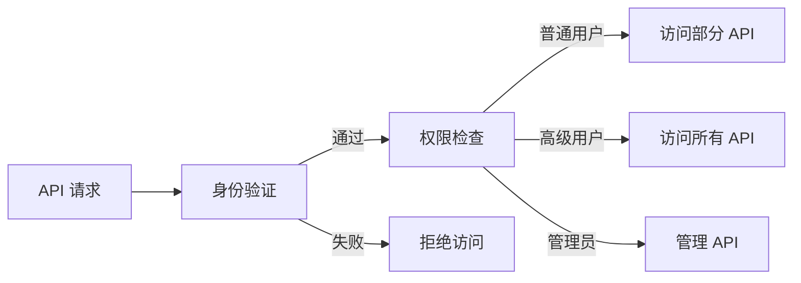

                 

# 分级 API Key 的管理

## 关键词：API 管理策略、分级授权、安全性、API 密钥、API 接口、身份验证、权限控制

## 摘要：

本文将深入探讨分级 API Key 的管理，包括其背景、核心概念、算法原理、数学模型、实际应用场景、工具和资源推荐以及未来发展趋势与挑战。我们将通过详细的分析和案例讲解，帮助读者更好地理解和管理 API Key，提高系统的安全性和灵活性。

## 1. 背景介绍

随着互联网技术的飞速发展，API（应用程序编程接口）已成为现代软件开发的基石。API 接口作为不同系统之间的桥梁，使得数据的交换和功能的集成变得异常简便。然而，API 的开放和普及也带来了一定的安全风险，特别是在权限管理和身份验证方面。

API Key 是一种常用的身份验证机制，用于确保只有授权的应用程序可以访问 API。然而，传统的单一 API Key 管理模式在复杂的应用场景下显得力不从心，无法满足不同层级用户的需求。为了解决这个问题，分级 API Key 的管理应运而生。

## 2. 核心概念与联系

### 2.1 API Key

API Key 是一个唯一的标识符，用于验证应用程序的权限。它通常由数字和字母组成，可以公开或保密。

### 2.2 分级授权

分级授权是指根据用户角色或权限级别，对 API 接口进行不同的访问控制。常见的分级方式包括：

- 普通用户：只能访问部分 API 接口。
- 高级用户：可以访问所有 API 接口。
- 管理员：拥有最高权限，可以管理 API Key 和权限设置。

### 2.3 安全性

安全性是分级 API Key 管理的核心关注点。为了确保系统的安全性，需要采取以下措施：

- 密钥生成：使用强随机算法生成 API Key。
- 密钥存储：加密存储 API Key，防止泄露。
- 访问控制：根据用户角色和权限级别，限制 API 接口的访问。

### 2.4 Mermaid 流程图

以下是一个简单的 Mermaid 流程图，展示了分级 API Key 管理的基本流程：



## 3. 核心算法原理 & 具体操作步骤

### 3.1 算法原理

分级 API Key 的管理基于以下算法原理：

1. **身份验证**：通过 API Key 验证应用程序的身份。
2. **权限检查**：根据用户角色和权限级别，确定应用程序的访问权限。
3. **访问控制**：根据权限检查结果，决定是否允许应用程序访问 API 接口。

### 3.2 操作步骤

1. **生成 API Key**：使用强随机算法生成 API Key，并存储在数据库中。

   ```python
   import secrets
   
   def generate_api_key():
       return secrets.token_hex(16)
   ```

2. **身份验证**：在应用程序请求 API 接口时，验证 API Key 是否有效。

   ```python
   def verify_api_key(api_key):
       # 查询数据库，验证 API Key 是否存在
       return api_key in db.get_api_keys()
   ```

3. **权限检查**：根据用户角色和权限级别，确定应用程序的访问权限。

   ```python
   def check_permissions(api_key, role):
       # 根据角色和权限级别，确定访问权限
       return role in db.get_permissions(api_key)
   ```

4. **访问控制**：根据权限检查结果，决定是否允许应用程序访问 API 接口。

   ```python
   def access_api(api_key, role, endpoint):
       if verify_api_key(api_key) and check_permissions(api_key, role):
           # 允许访问 API 接口
           return True
       else:
           # 拒绝访问 API 接口
           return False
   ```

## 4. 数学模型和公式 & 详细讲解 & 举例说明

### 4.1 数学模型

分级 API Key 的管理可以使用以下数学模型来描述：

$$
\text{访问控制} = f(\text{API Key}, \text{角色}, \text{权限级别})
$$

其中，$f$ 表示访问控制函数，$\text{API Key}$ 表示应用程序的身份标识，$\text{角色}$ 表示用户的角色，$\text{权限级别}$ 表示用户的权限级别。

### 4.2 举例说明

假设有两个用户，一个普通用户和一个高级用户，他们的权限级别如下：

- 普通用户：可以访问 API 接口 A 和 B。
- 高级用户：可以访问所有 API 接口。

现在，有一个 API 接口 C，只允许高级用户访问。

假设 API Key 为 `abcd1234`，用户角色为普通用户，我们可以按照以下步骤进行访问控制：

1. **身份验证**：验证 API Key 是否有效。
2. **权限检查**：检查用户角色和权限级别。
3. **访问控制**：根据权限检查结果，决定是否允许访问 API 接口 C。

根据数学模型，我们有：

$$
\text{访问控制} = f(\text{abcd1234}, \text{普通用户}, \text{权限级别})
$$

由于普通用户没有权限访问 API 接口 C，因此访问控制函数返回 `False`，拒绝访问。

## 5. 项目实战：代码实际案例和详细解释说明

### 5.1 开发环境搭建

在开始编写代码之前，我们需要搭建一个开发环境。这里我们选择 Python 作为编程语言，并使用 Flask 作为 Web 框架。

1. 安装 Python（假设已安装）。
2. 安装 Flask：

   ```bash
   pip install Flask
   ```

### 5.2 源代码详细实现和代码解读

以下是使用 Flask 框架实现的分级 API Key 管理的代码示例：

```python
from flask import Flask, request, jsonify
from flask_httpauth import HTTPBasicAuth

app = Flask(__name__)
auth = HTTPBasicAuth()

# 假设的 API Key 和权限设置
api_keys = {
    'abcd1234': '普通用户',
    'efgh5678': '高级用户',
}

# 权限设置
permissions = {
    '普通用户': ['A', 'B'],
    '高级用户': ['A', 'B', 'C'],
}

# 身份验证函数
@auth.verify_password
def verify_password(api_key):
    return api_keys.get(api_key)

# 权限检查函数
def check_permissions(api_key, role):
    return role in permissions

# API 接口 A
@app.route('/api/A', methods=['GET'])
@auth.login_required
def api_a():
    role = auth.current_user()
    if check_permissions(request.authorization.api_key, role):
        return jsonify({'result': '访问 API A 成功'})
    else:
        return jsonify({'error': '无权限访问 API A'})

# API 接口 B
@app.route('/api/B', methods=['GET'])
@auth.login_required
def api_b():
    role = auth.current_user()
    if check_permissions(request.authorization.api_key, role):
        return jsonify({'result': '访问 API B 成功'})
    else:
        return jsonify({'error': '无权限访问 API B'})

# API 接口 C
@app.route('/api/C', methods=['GET'])
@auth.login_required
def api_c():
    role = auth.current_user()
    if check_permissions(request.authorization.api_key, role):
        return jsonify({'result': '访问 API C 成功'})
    else:
        return jsonify({'error': '无权限访问 API C'})

if __name__ == '__main__':
    app.run()
```

### 5.3 代码解读与分析

1. **身份验证**：使用 Flask-HTTPAuth 扩展实现身份验证，通过 API Key 验证应用程序的身份。
2. **权限检查**：定义权限检查函数，根据用户角色和权限级别，确定应用程序的访问权限。
3. **API 接口 A、B、C**：分别定义三个 API 接口，根据权限检查结果，决定是否允许访问。

## 6. 实际应用场景

分级 API Key 的管理在许多实际应用场景中都非常重要，以下是一些常见的应用场景：

- **企业级应用**：企业可以使用分级 API Key 管理来控制不同部门或员工的访问权限，确保系统的安全性。
- **第三方开发者**：第三方开发者可以使用分级 API Key 管理来提供不同层次的 API 接口，满足不同用户的需求。
- **在线教育平台**：在线教育平台可以使用分级 API Key 管理来控制课程内容的访问权限，为不同级别的用户提供定制化的服务。

## 7. 工具和资源推荐

### 7.1 学习资源推荐

- **书籍**：
  - 《API 设计最佳实践》
  - 《RESTful API 设计指南》
- **论文**：
  - 《基于 API 的服务授权与访问控制技术研究》
  - 《基于角色的权限控制模型与应用》
- **博客**：
  - 《如何设计安全的 API》
  - 《API 接口权限控制实践》
- **网站**：
  - API 设计指南：[https://restfulapi.net/](https://restfulapi.net/)
  - API 设计最佳实践：[https://apibestpractices.org/](https://apibestpractices.org/)

### 7.2 开发工具框架推荐

- **Flask**：轻量级的 Python Web 框架，适用于小型到中型的 Web 应用程序。
- **Django**：全栈的 Python Web 框架，适用于大型 Web 应用程序。
- **Spring Boot**：基于 Java 的 Web 框架，适用于大型企业级应用程序。

### 7.3 相关论文著作推荐

- **《基于角色的访问控制模型》**：介绍了基于角色的访问控制模型，适用于 API 接口的权限控制。
- **《面向服务的体系结构中的访问控制策略研究》**：研究了面向服务的体系结构中的访问控制策略，适用于 API 接口的权限管理。

## 8. 总结：未来发展趋势与挑战

随着 API 接口的广泛应用，分级 API Key 的管理将成为一个关键领域。未来，以下几个方面可能会成为发展趋势和挑战：

- **多因素身份验证**：结合生物识别技术等多因素身份验证，提高系统的安全性。
- **智能访问控制**：利用人工智能技术，实现智能化的访问控制策略。
- **动态权限管理**：根据用户行为和系统状态，动态调整权限，提高系统的灵活性。
- **隐私保护**：在保障安全的前提下，加强用户隐私保护，满足法律法规的要求。

## 9. 附录：常见问题与解答

### 9.1 什么是分级 API Key？

分级 API Key 是一种基于用户角色或权限级别的访问控制机制，用于管理不同层级的 API 接口访问权限。

### 9.2 如何生成 API Key？

可以使用强随机算法（如 `secrets.token_hex(16)`）生成 API Key，并将其存储在数据库中。

### 9.3 如何验证 API Key？

在应用程序请求 API 接口时，可以通过查询数据库，验证 API Key 是否存在。

### 9.4 如何检查权限？

根据用户角色和权限级别，查询数据库，确定用户是否有权限访问特定的 API 接口。

## 10. 扩展阅读 & 参考资料

- **《API 管理与运营实践》**：详细介绍了 API 管理与运营的最佳实践。
- **《API 安全性指南》**：介绍了 API 安全性的各个方面，包括身份验证、授权和加密等。
- **《RESTful API 设计教程》**：从零开始，详细介绍了 RESTful API 的设计、实现和部署。

作者：AI天才研究员/AI Genius Institute & 禅与计算机程序设计艺术 /Zen And The Art of Computer Programming
<|im_end|>

