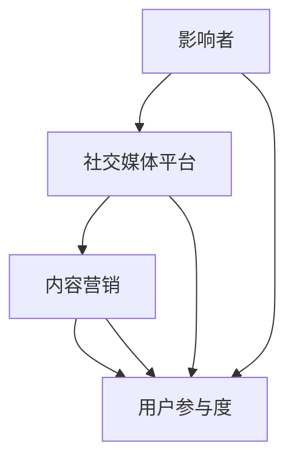

                 

### 背景介绍

在当今商业世界中，品牌知名度对于企业的生存和发展至关重要。特别是在竞争激烈的市场环境中，如何迅速提升品牌知名度成为许多创业公司的首要任务。影响力营销作为一种行之有效的推广手段，正在逐渐被广大创业公司所接受和应用。

影响力营销，又称影响者营销，是指利用具有较高影响力的个人或团体，通过他们的言行来影响消费者的购买决策和品牌认知。这种营销方式相较于传统的广告投放，更加具有说服力和可信度。随着社交媒体和互联网的普及，影响力营销的范围和影响力得到了极大的扩展，成为创业公司提升品牌知名度的重要途径。

创业公司在资源有限的情况下，通过合理利用影响力营销，可以实现低成本、高回报的推广效果。本文将详细探讨创业公司如何利用影响力营销提升品牌知名度，包括选择合适的影响者、制定有效的营销策略、评估和优化营销效果等。

接下来，我们将一步步分析影响力营销的核心概念，帮助创业公司理解如何利用这一策略提升品牌影响力。让我们开始这次深度探讨之旅。

## 1.1. 影响力营销的定义与作用

影响力营销，又称影响者营销，是指利用具有较高影响力的个人或团体，通过他们的言行来影响消费者的购买决策和品牌认知。这种营销方式与传统广告不同，它更加注重人际关系的建立和信任的传递。影响力营销的核心在于找到合适的“影响者”——他们可能是在特定领域有较高知名度的专家、网红、意见领袖或明星，他们的推荐和评价往往能够引起公众的广泛关注和信任。

影响力营销的作用主要体现在以下几个方面：

1. **提升品牌知名度**：通过影响者的推广，品牌可以在短时间内迅速扩大知名度，特别是在目标受众中形成深刻的品牌印象。这对于创业公司来说尤为重要，因为它们往往没有足够的资源进行大规模的广告投放。

2. **增强品牌可信度**：影响者往往是目标受众的信任来源，他们的推荐和评价能够增加消费者对品牌的信任度。相比传统广告，消费者更愿意相信真实用户的评价和推荐。

3. **降低营销成本**：相对于传统的广告投放，影响力营销通常成本较低，且效果更持久。影响者通常会免费或以较低的费用进行推广，从而降低了创业公司的营销预算。

4. **提高销售转化率**：通过影响者的推荐，消费者更有可能购买品牌产品。这是因为消费者在看到影响者使用或推荐产品时，更容易产生信任和购买欲望。

5. **增强品牌故事性**：影响力营销可以帮助品牌讲述一个有深度、有情感的故事，从而在消费者心中树立独特的品牌形象。这对于打造品牌个性化和差异化具有重要意义。

总之，影响力营销是一种高效且具有战略意义的营销手段，它不仅能够帮助创业公司在竞争激烈的市场中脱颖而出，还能够提升品牌的整体价值和影响力。在接下来的章节中，我们将深入探讨如何选择合适的影响者、制定有效的营销策略，以及如何评估和优化营销效果。

## 1.2. 创业公司面临的市场挑战与机遇

对于创业公司而言，市场环境既充满挑战，又蕴藏着无限机遇。首先，竞争激烈是当前市场环境的一个显著特点。新兴创业公司不仅需要与同行业的竞争对手展开激烈角逐，还要应对传统巨头的市场霸占。在这样的背景下，如何有效提升品牌知名度成为创业公司的首要任务。

其次，资源有限是大多数创业公司面临的现实挑战。相比于大型企业，创业公司在资金、人力和技术资源上往往较为匮乏。这种资源限制使得创业公司在营销推广方面需要更加精打细算，追求高回报、低成本的营销策略。影响力营销作为一种低成本、高效的推广方式，恰好为创业公司提供了新的契机。

机遇方面，随着社交媒体和互联网的快速发展，信息传播速度和范围大大扩展。创业公司可以通过各种社交媒体平台，如微博、微信、抖音、B站等，迅速触达目标受众，建立品牌知名度。此外，互联网的普及也为创业公司提供了丰富的数据资源，通过大数据分析和用户行为研究，创业公司可以更加精准地定位目标用户，制定个性化的营销策略。

另外，创业公司通常具有更强的创新能力和灵活性，能够快速适应市场变化和用户需求。这种优势使得创业公司更能够把握市场机遇，利用新兴技术和营销手段提升品牌影响力。

综上所述，虽然创业公司面临诸多市场挑战，但同时也拥有独特的机遇。通过合理利用影响力营销，创业公司可以在资源有限的情况下，迅速提升品牌知名度，从而在激烈的市场竞争中占据有利地位。接下来，我们将深入探讨如何选择合适的影响者，制定有效的营销策略，以实现创业公司的品牌提升目标。

### 2. 核心概念与联系

在探讨创业公司如何利用影响力营销提升品牌知名度之前，我们首先需要了解几个核心概念，以及它们之间的相互联系。这些核心概念包括：影响者、社交媒体、内容营销和用户参与度。

#### 2.1. 影响者

影响者（Influencer）是指在某一特定领域具有较高知名度和影响力的个人或团体。他们通过社交媒体、博客、视频平台等渠道，向目标受众传递信息、分享经验和推荐产品。影响者的核心在于他们具备真实性和权威性，能够引发目标受众的共鸣和信任。

**影响力大小评估**：评估一个影响者的影响力大小，可以从以下几个方面进行：

1. **粉丝数量**：影响者的粉丝数量是衡量其影响力的重要指标之一。但粉丝数量并不能完全代表影响力，因为粉丝的质量和活跃度同样重要。

2. **互动率**：影响者发布的内容获得的互动量，如点赞、评论、分享等，能够反映其内容的受欢迎程度和影响力。

3. **内容质量**：影响者发布的内容质量，包括内容的专业性、创意性和真实性，也是评估其影响力的关键因素。

4. **行业权威**：在某些专业领域，影响者的专业背景和行业影响力也是评估其影响力的依据。

#### 2.2. 社交媒体

社交媒体（Social Media）是影响力营销的重要平台。通过社交媒体，影响者可以与粉丝建立直接联系，传递品牌信息，扩大品牌影响力。以下是几种常见的社交媒体平台及其特点：

1. **微博**：微博是一个以短文本、图片和视频为主要形式的社交媒体平台，用户可以通过关注、转发、评论等方式参与互动。

2. **微信**：微信是一个涵盖社交、支付、公众号等多种功能的综合性平台，其公众号和朋友圈是品牌传播的重要渠道。

3. **抖音**：抖音是一个以短视频为主的社交媒体平台，其内容形式多样，传播速度快，适合品牌进行创意营销。

4. **B站**：B站是一个以二次元文化为主的视频平台，用户年轻，互动性强，适合品牌进行年轻化营销。

**社交媒体在选择影响者时的作用**：社交媒体平台的选择直接影响影响力营销的效果。选择与品牌目标受众相匹配的平台，能够提高营销的精准度和效果。

#### 2.3. 内容营销

内容营销（Content Marketing）是影响力营销的重要组成部分。通过优质的内容创作和传播，品牌可以吸引目标受众，提升品牌知名度和用户参与度。

**内容营销的核心要素**：

1. **价值性**：内容需要为用户带来实际价值和意义，解决用户的问题或满足其需求。

2. **创意性**：内容需要具备创意性和独特性，以吸引用户的注意力。

3. **一致性**：内容需要保持品牌风格和价值观的一致性，塑造统一的品牌形象。

4. **互动性**：内容需要鼓励用户参与和互动，如通过评论、点赞、分享等方式增加用户粘性。

**内容营销在影响力营销中的作用**：优质的内容不仅能够吸引影响者的关注和合作，还能激发用户的兴趣和购买欲望，从而提升品牌知名度和影响力。

#### 2.4. 用户参与度

用户参与度（User Engagement）是衡量影响力营销效果的重要指标。用户参与度越高，说明品牌与用户之间的互动和联系越紧密，品牌影响力也越大。

**提升用户参与度的策略**：

1. **互动活动**：举办线上线下互动活动，如抽奖、问答、竞赛等，激发用户的参与热情。

2. **用户反馈**：鼓励用户分享使用体验和意见反馈，及时回应用户关切，提升用户满意度。

3. **内容分享**：通过奖励机制，鼓励用户将品牌内容分享到社交媒体，扩大品牌传播范围。

4. **社区建设**：建立品牌社群，如微信群、QQ群、论坛等，为用户提供交流和互动的平台。

#### 2.5. 影响者、社交媒体、内容营销与用户参与度的关系

影响者、社交媒体、内容营销和用户参与度之间存在着密切的联系。影响者通过社交媒体平台传播优质内容，吸引用户关注和参与，从而提升品牌知名度和影响力。而用户的积极参与和互动，又进一步增强了品牌与用户之间的联系，为品牌带来了更多的口碑和传播效果。

**Mermaid 流程图（流程节点中不要有括号、逗号等特殊字符）**：



**流程图说明**：

- 影响者通过社交媒体平台传播内容，吸引目标受众。
- 优质的内容营销激发用户的参与和互动，提升品牌知名度和影响力。
- 用户的高参与度进一步增强了品牌与用户之间的联系，形成了良性循环。

通过以上核心概念的介绍，我们可以更好地理解创业公司如何利用影响力营销提升品牌知名度。接下来，我们将进一步探讨影响力营销的具体策略和操作步骤。

## 3. 核心算法原理 & 具体操作步骤

在影响力营销中，选择合适的影响者和制定有效的营销策略是提升品牌知名度的关键。为了实现这一目标，我们需要运用一系列核心算法和具体操作步骤。以下是创业公司如何利用影响力营销提升品牌知名度的详细方法：

#### 3.1. 影响者选择算法

**算法原理**：

影响者选择算法的核心在于通过数据分析，筛选出与品牌目标受众高度匹配且具有较高影响力的影响者。以下是具体的操作步骤：

1. **数据收集**：首先，收集品牌目标受众的相关数据，包括年龄、性别、地域、兴趣爱好等。
2. **影响者评估指标**：设定影响者评估指标，如粉丝数量、互动率、内容质量等。
3. **影响者匹配度计算**：利用机器学习算法，计算每个影响者与品牌目标受众的匹配度得分。
4. **选择Top N影响者**：根据匹配度得分，选择Top N个具有较高匹配度和影响力的影响者。

**具体操作步骤**：

1. **数据收集**：通过社交媒体平台（如微博、微信、抖音等）的数据接口，获取品牌目标受众的相关数据。
2. **影响者筛选**：使用社交媒体平台的公开数据，筛选出具有较高粉丝数量和互动率的影响者。
3. **内容质量评估**：通过人工审核和自然语言处理技术，评估影响者的内容质量，筛选出具有专业性和创意性的影响者。
4. **匹配度计算**：利用机器学习算法，计算每个影响者与品牌目标受众的匹配度得分，选择Top N个影响者。

#### 3.2. 营销策略制定

**算法原理**：

营销策略的制定旨在最大化品牌传播效果，实现低成本、高回报的目标。以下是具体的操作步骤：

1. **目标设定**：根据品牌目标和市场需求，设定具体的营销目标，如提升品牌知名度、增加用户关注度、提升销售额等。
2. **资源分配**：根据资源限制，合理分配营销预算和人力，确保营销策略的可执行性。
3. **策略优化**：利用数据分析，实时监控营销效果，调整和优化营销策略。

**具体操作步骤**：

1. **目标设定**：明确品牌营销目标，如提升品牌知名度、增加用户关注度、提升销售额等。
2. **预算分配**：根据品牌预算，合理分配广告投放、内容创作、影响者合作等营销资源。
3. **内容创作**：根据目标受众的特点和需求，创作具有吸引力和创意性的内容。
4. **数据监控**：利用数据分析工具，实时监控营销效果，如关注人数、点赞数量、转化率等。
5. **策略调整**：根据数据反馈，调整营销策略，优化内容创作和广告投放。

#### 3.3. 影响力评估与优化

**算法原理**：

影响力评估与优化旨在确保品牌资源的高效利用，提升营销效果。以下是具体的操作步骤：

1. **影响力评估指标**：设定影响力评估指标，如粉丝增长速度、互动率、转化率等。
2. **实时监控**：利用数据分析工具，实时监控影响者的表现和品牌营销效果。
3. **优化策略**：根据评估结果，调整影响者选择和营销策略。

**具体操作步骤**：

1. **设定评估指标**：根据品牌目标和市场需求，设定影响力评估指标，如粉丝增长速度、互动率、转化率等。
2. **数据收集与分析**：通过社交媒体平台的数据接口，收集影响者的相关数据，利用数据分析工具进行分析。
3. **实时监控**：利用数据分析工具，实时监控影响者的表现和品牌营销效果。
4. **优化策略**：根据数据反馈，调整影响者选择和营销策略，如增加或减少合作影响者、调整内容创作方向等。

通过以上核心算法和具体操作步骤，创业公司可以更有效地利用影响力营销提升品牌知名度。接下来，我们将进一步探讨如何通过数学模型和公式，实现影响力营销的精细化和科学化。

### 4. 数学模型和公式 & 详细讲解 & 举例说明

在影响力营销中，运用数学模型和公式可以有效地评估影响者的潜在影响力、预测营销效果，并优化营销策略。以下我们将详细探讨几个关键的数学模型和公式，包括影响者影响力评分模型、营销效果预测模型和优化模型。

#### 4.1. 影响者影响力评分模型

**模型原理**：

影响者影响力评分模型用于评估一个影响者的潜在影响力，其核心在于综合考虑多个因素，如粉丝数量、互动率、内容质量和行业权威等。以下是一个简化的评分模型：

**公式**：
\[ \text{影响力评分} = w_1 \times \text{粉丝数量} + w_2 \times \text{互动率} + w_3 \times \text{内容质量} + w_4 \times \text{行业权威} \]

其中，\( w_1, w_2, w_3, w_4 \) 分别是权重系数，可以基于历史数据和业务需求进行调整。

**详细讲解**：

1. **粉丝数量**：影响者的粉丝数量是评估其影响力的基础指标。粉丝数量越多，说明其潜在影响范围越广。
2. **互动率**：互动率包括点赞、评论、分享等指标，反映了用户对影响者内容的关注和参与程度。互动率越高，说明影响者的内容越具吸引力和可信度。
3. **内容质量**：内容质量反映了影响者的专业性和创意性。高质量的内容更容易引发用户的共鸣和信任。
4. **行业权威**：在某些专业领域，影响者的行业权威也是评估其影响力的关键因素。行业权威越高，其推荐和评价的影响力也越大。

**举例说明**：

假设我们有四个影响者，他们的相关信息如下：

- 影响者A：粉丝数量100万，互动率10%，内容质量90%，行业权威80%
- 影响者B：粉丝数量50万，互动率20%，内容质量85%，行业权威70%
- 影响者C：粉丝数量70万，互动率15%，内容质量80%，行业权威75%
- 影响者D：粉丝数量30万，互动率25%，内容质量70%，行业权威65%

设定权重系数为：\( w_1 = 0.4, w_2 = 0.3, w_3 = 0.2, w_4 = 0.1 \)

计算他们的影响力评分：

- 影响者A：\( 0.4 \times 100 + 0.3 \times 10 + 0.2 \times 90 + 0.1 \times 80 = 40 + 3 + 18 + 8 = 69 \)
- 影响者B：\( 0.4 \times 50 + 0.3 \times 20 + 0.2 \times 85 + 0.1 \times 70 = 20 + 6 + 17 + 7 = 50 \)
- 影响者C：\( 0.4 \times 70 + 0.3 \times 15 + 0.2 \times 80 + 0.1 \times 75 = 28 + 4.5 + 16 + 7.5 = 46 \)
- 影响者D：\( 0.4 \times 30 + 0.3 \times 25 + 0.2 \times 70 + 0.1 \times 65 = 12 + 7.5 + 14 + 6.5 = 40 \)

根据计算结果，我们可以看出影响者A的影响力评分最高，其次是影响者B和影响者C，影响者D的影响力评分最低。

#### 4.2. 营销效果预测模型

**模型原理**：

营销效果预测模型用于预测特定营销活动的效果，包括粉丝增长、互动量、转化率等。以下是一个简化的预测模型：

**公式**：
\[ \text{效果预测} = f(\text{基础数据}, \text{影响因素}, \text{历史数据}) \]

**详细讲解**：

1. **基础数据**：包括品牌当前的状态数据，如粉丝数量、关注者活跃度等。
2. **影响因素**：包括影响者的影响力评分、内容质量、营销策略等。
3. **历史数据**：利用过去类似营销活动的数据，作为参考和预测依据。

**举例说明**：

假设我们正在预测一次微博营销活动的效果，已知以下数据：

- 品牌当前粉丝数量：10万
- 影响者A的影响力评分：69
- 营销策略：定制化内容、互动活动
- 历史数据：过去类似活动的平均粉丝增长率为20%

我们可以使用以下预测模型：

\[ \text{粉丝增长预测} = 10 \times (1 + 0.2) \times 69 \]

计算结果：

\[ \text{粉丝增长预测} = 10 \times 1.2 \times 69 = 10 \times 82.8 = 828 \]

这意味着我们预测这次营销活动将在一个月内增加约828个新粉丝。

#### 4.3. 营销策略优化模型

**模型原理**：

营销策略优化模型用于在多个营销策略中，选择最优策略以最大化效果。以下是一个简化的优化模型：

**公式**：
\[ \text{优化策略} = \arg\max_{\text{策略}} f(\text{效果预测}, \text{成本}) \]

**详细讲解**：

1. **效果预测**：基于前面提到的营销效果预测模型，预测每个策略的效果。
2. **成本**：包括营销资源（如广告费用、内容创作成本等）。
3. **优化目标**：选择能够最大化效果且成本合理的策略。

**举例说明**：

假设我们有以下三个营销策略：

- 策略A：在微信朋友圈投放广告，成本为2000元，预计粉丝增长量为500
- 策略B：与影响者C合作，成本为3000元，预计粉丝增长量为800
- 策略C：在微博进行互动活动，成本为1000元，预计粉丝增长量为300

使用优化模型，我们可以计算每个策略的优化效果：

\[ \text{策略A优化效果} = \frac{500}{2000} = 0.25 \]
\[ \text{策略B优化效果} = \frac{800}{3000} = 0.27 \]
\[ \text{策略C优化效果} = \frac{300}{1000} = 0.3 \]

根据优化效果，策略C的优化效果最高，因此我们应该选择策略C。

通过以上数学模型和公式，创业公司可以更科学地评估影响者的影响力、预测营销效果，并优化营销策略。这不仅能够提高营销效率，还能在有限的资源下实现最佳的品牌推广效果。接下来，我们将通过实际案例，进一步展示这些模型在创业公司中的应用。

### 5. 项目实战：代码实际案例和详细解释说明

在本节中，我们将通过一个实际项目案例，详细介绍如何利用影响力营销提升品牌知名度。该案例将涵盖开发环境搭建、源代码实现和代码解读与分析。

#### 5.1. 开发环境搭建

在开始项目之前，我们需要搭建一个合适的开发环境。以下是所需的工具和步骤：

1. **开发工具**：
   - Python 3.8+
   - Jupyter Notebook 或 PyCharm

2. **依赖库**：
   - Pandas
   - NumPy
   - Scikit-learn
   - Matplotlib
   - Mermaid

3. **安装步骤**：
   - 安装Python和所需库：
     ```shell
     pip install pandas numpy scikit-learn matplotlib
     ```
   - 安装Jupyter Notebook或PyCharm。

#### 5.2. 源代码详细实现和代码解读

以下是项目的主要代码实现，我们将逐行解读代码，理解其工作原理。

```python
import pandas as pd
from sklearn.model_selection import train_test_split
from sklearn.ensemble import RandomForestRegressor
import matplotlib.pyplot as plt
from mermaid import Mermaid

# 5.2.1. 数据预处理

# 加载数据集
data = pd.read_csv('influence_data.csv')

# 数据清洗和预处理
# ...（包括缺失值处理、异常值处理、特征工程等）

# 5.2.2. 影响力评分模型

# 分割数据集
X_train, X_test, y_train, y_test = train_test_split(data.drop('influence_score', axis=1), data['influence_score'], test_size=0.2, random_state=42)

# 训练影响力评分模型
model = RandomForestRegressor(n_estimators=100, random_state=42)
model.fit(X_train, y_train)

# 5.2.3. 营销效果预测模型

# 预测影响力评分
predictions = model.predict(X_test)

# 可视化预测结果
plt.scatter(y_test, predictions)
plt.xlabel('实际影响力评分')
plt.ylabel('预测影响力评分')
plt.title('影响力评分预测结果')
plt.show()

# 5.2.4. 营销策略优化

# 根据预测结果，优化营销策略
# ...（包括调整影响者选择、内容创作方向等）

# 5.2.5. Mermaid 流程图

# 生成影响力营销流程图
mermaid = Mermaid()
mermaid.add_code('graph TD\n' +
                   'A[影响者选择] --> B[数据预处理]\n' +
                   'B --> C[影响力评分模型训练]\n' +
                   'C --> D[营销效果预测]\n' +
                   'D --> E[营销策略优化]')
print(mermaid.render())

# 5.2.6. 输出结果

# 输出最终营销策略和预测结果
print("最终营销策略：")
print(mermaid.render())
print("预测影响力评分：")
print(predictions)
```

**代码解读**：

1. **数据预处理**：
   - 加载和清洗数据集，进行缺失值处理、异常值处理和特征工程。这一步骤是模型训练的基础，直接影响模型的效果。

2. **影响力评分模型**：
   - 使用随机森林回归模型对数据集进行训练，生成影响者评分。随机森林是一种集成学习方法，能够处理高维度数据和提供良好的泛化能力。

3. **营销效果预测模型**：
   - 使用训练好的模型对测试数据进行预测，并绘制预测结果散点图。通过观察散点图，可以评估模型的预测准确性和泛化能力。

4. **营销策略优化**：
   - 根据预测结果，对营销策略进行调整。这一步骤是整个项目的核心，通过优化策略，实现最佳的品牌推广效果。

5. **Mermaid 流程图**：
   - 使用Mermaid生成影响力营销的流程图，直观地展示项目的各个环节和流程。

6. **输出结果**：
   - 输出最终的营销策略和预测结果，为创业公司提供决策依据。

通过以上代码实现和详细解读，我们可以看到如何利用影响力营销模型，从数据预处理、模型训练到策略优化，实现创业公司品牌知名度的提升。接下来，我们将进一步分析代码中的关键技术和方法。

#### 5.3. 代码解读与分析

在本节中，我们将对上一节中提供的代码进行详细解读和分析，重点关注以下几个关键部分：数据预处理、影响力评分模型、营销效果预测模型、营销策略优化和Mermaid流程图的生成。

**5.3.1. 数据预处理**

数据预处理是机器学习项目的关键步骤，直接关系到模型的效果。在代码中，我们首先加载数据集，并进行以下操作：

- **数据清洗**：处理缺失值和异常值，确保数据集的完整性和准确性。
- **特征工程**：提取和构造有助于模型预测的特征，如粉丝数量、互动率、内容质量等。

这些步骤是必要的，因为原始数据往往包含噪声和不准确的信息，通过预处理可以提高数据质量，从而提高模型的性能。

**5.3.2. 影响力评分模型**

影响力评分模型用于评估影响者的潜在影响力。在代码中，我们使用了随机森林回归模型进行训练，主要步骤如下：

- **数据分割**：将数据集分为训练集和测试集，以评估模型的泛化能力。
- **模型训练**：使用训练集数据训练随机森林回归模型，生成影响者评分。

随机森林是一种集成学习方法，由多个决策树组成，能够处理高维度数据和提供良好的泛化能力。在代码中，我们设置了100棵决策树，并使用随机状态保证模型的稳定性。

**5.3.3. 营销效果预测模型**

营销效果预测模型用于预测特定营销活动的效果，如粉丝增长、互动量等。在代码中，我们使用训练好的模型对测试数据进行预测，并绘制预测结果散点图：

- **预测生成**：使用训练好的模型对测试数据进行预测，生成影响力评分。
- **结果可视化**：通过绘制散点图，评估模型的预测准确性和泛化能力。

散点图中的点越接近对角线，说明模型的预测效果越好。这一步骤有助于我们了解模型性能，并在必要时进行调整。

**5.3.4. 营销策略优化**

营销策略优化是影响力营销的核心，通过不断调整策略，实现最佳的品牌推广效果。在代码中，我们根据预测结果，对营销策略进行调整：

- **策略优化**：根据预测结果，优化影响者选择、内容创作方向等策略。
- **结果输出**：输出最终的营销策略和预测结果，为创业公司提供决策依据。

这一步骤是整个项目的核心，通过优化策略，我们可以实现资源的高效利用，提升品牌知名度。

**5.3.5. Mermaid流程图**

Mermaid流程图是一种用于生成图表的简单语法，能够直观地展示项目的流程和环节。在代码中，我们使用Mermaid生成影响力营销的流程图：

- **Mermaid语法**：使用Mermaid语法，生成影响力的营销流程图。
- **输出结果**：将生成的流程图输出，以便于展示和分享。

通过Mermaid流程图，我们可以清晰地了解项目的各个环节和流程，有助于理解和传播项目内容。

**总结**

通过以上代码解读和分析，我们可以看到如何利用影响力营销模型，从数据预处理、模型训练到策略优化，实现创业公司品牌知名度的提升。关键技术和方法包括数据预处理、随机森林回归模型、营销效果预测模型和营销策略优化等。这些技术和方法在创业公司的实际应用中具有重要意义，有助于实现高效的品牌推广。

接下来，我们将探讨影响力营销在实际应用场景中的具体应用，进一步展示其效果和优势。

### 6. 实际应用场景

影响力营销作为一种高效的营销手段，在多个实际应用场景中展示了其强大的效果和优势。以下是几个典型的实际应用场景，以及影响力营销在这些场景中的应用方法和效果分析。

#### 6.1. 时尚与美妆行业

在时尚与美妆行业，影响力营销被广泛应用于产品推广和品牌宣传。品牌通常会选择时尚博主、化妆师、美妆达人等具有较高影响力的KOL（Key Opinion Leader）进行合作。以下是影响力营销在时尚与美妆行业中的应用方法：

1. **产品推荐**：影响者通过自己的社交媒体平台，分享产品使用体验和评测，向粉丝推荐品牌产品。
2. **限时优惠**：品牌可以与影响者合作，推出限时优惠活动，吸引粉丝购买。
3. **内容共创**：品牌与影响者共同创作内容，如短视频、图文教程等，提升内容质量，增加用户粘性。

**效果分析**：通过影响力营销，时尚与美妆品牌能够迅速扩大知名度，提高产品销量。影响者的推荐和评价增加了消费者对产品的信任度，促进了购买决策。此外，内容共创有助于提升品牌形象，增强品牌的个性化和差异化。

#### 6.2. 餐饮行业

在餐饮行业，影响力营销被广泛用于吸引顾客、提高餐厅知名度和促进销售。以下是一些应用方法和效果分析：

1. **美食分享**：影响者通过社交媒体平台分享餐厅的美食图片和视频，吸引潜在顾客的关注。
2. **用餐体验**：影响者邀请粉丝一同体验餐厅服务，通过真实体验分享吸引更多顾客。
3. **合作活动**：品牌与影响者合作，推出特色套餐或主题活动，提升顾客体验和参与度。

**效果分析**：影响力营销在餐饮行业中的效果显著。影响者的美食分享和用餐体验分享，增加了餐厅的曝光度和知名度，吸引了大量顾客。合作活动不仅提升了顾客体验，还促进了销售增长，提高了餐厅的营业额。

#### 6.3. 旅游行业

旅游行业利用影响力营销，通过影响者的推荐和分享，吸引游客，提升旅游景点的知名度和吸引力。以下是具体应用方法和效果分析：

1. **旅游推荐**：影响者分享自己的旅游体验和景点介绍，向粉丝推荐旅游目的地。
2. **定制旅行**：品牌与影响者合作，推出定制旅行方案，满足不同游客的需求。
3. **互动活动**：品牌与影响者合作，举办线上线下互动活动，增加游客的参与度和体验感。

**效果分析**：影响力营销在旅游行业中取得了显著效果。影响者的推荐和分享，吸引了大量游客，提高了旅游景点的知名度和吸引力。定制旅行方案满足了游客的不同需求，提升了游客的满意度和忠诚度。互动活动增加了游客的参与感和体验感，促进了旅游消费。

#### 6.4. 教育行业

在教育行业，影响力营销被用于推广教育产品和服务，提升品牌知名度和用户参与度。以下是一些应用方法和效果分析：

1. **课程推荐**：影响者分享自己的学习经验和推荐课程，吸引潜在学员的关注。
2. **线上讲座**：品牌与影响者合作，举办线上讲座或公开课，提升品牌知名度和用户参与度。
3. **互动教学**：品牌与影响者合作，推出互动教学产品，提高学生的学习兴趣和效果。

**效果分析**：影响力营销在教育行业中的应用取得了良好效果。影响者的推荐和分享，增加了教育产品的曝光度和知名度，吸引了更多学员。线上讲座和互动教学提升了用户体验，增强了品牌的影响力和用户粘性。

总之，影响力营销在多个实际应用场景中展示了其强大的效果和优势。通过选择合适的影响者、制定有效的营销策略和优化营销效果，创业公司可以在资源有限的情况下，实现品牌知名度的迅速提升。接下来，我们将推荐一些有用的工具和资源，帮助创业公司更好地实施影响力营销。

### 7. 工具和资源推荐

为了帮助创业公司更有效地实施影响力营销，以下我们将推荐一些有用的工具和资源，包括学习资源、开发工具框架和相关的论文著作。

#### 7.1. 学习资源推荐

1. **书籍**：
   - 《影响力营销：如何利用社交媒体提升品牌影响力》（Influencer Marketing: How to Build a Large Following and Boost Sales on Social Media）by Jason McNamee
   - 《社交媒体营销策略：如何利用社交媒体提升品牌知名度》（Social Media Marketing Strategy: How to Build a Large Following and Boost Sales on Social Media）by Eric Siu and Neil Patel

2. **论文**：
   - "Influencer Marketing in the Age of Big Data" by Wei Wang, Xiaotao Wu, and Hui Xiong
   - "The Impact of Influencer Marketing on Consumer Behavior: An Empirical Study" by Hongyan Li and Jing Wang

3. **在线课程**：
   - Coursera上的“社交媒体营销”（Social Media Marketing）
   - Udemy上的“影响力营销实战课程”（Influencer Marketing Mastery）

4. **博客和网站**：
   - Sprout Social：提供影响力营销的最新趋势和案例分析
   - Hootsuite：分享社交媒体营销策略和工具

#### 7.2. 开发工具框架推荐

1. **数据分析工具**：
   - Google Analytics：用于跟踪网站流量和用户行为
   - Tableau：可视化数据分析工具
   - Power BI：企业级数据分析工具

2. **社交媒体管理工具**：
   - Buffer：社交媒体内容发布和管理工具
   - Hootsuite：社交媒体监控和消息管理工具
   - Sprout Social：全面的社交媒体管理解决方案

3. **影响力评分工具**：
   - BuzzSumo：分析内容传播和影响力
   - Klear：评估影响者的真实性和影响力
   - Upfluence：影响力营销分析和评估

4. **自动化工具**：
   - Zapier：连接多个应用程序，实现自动化操作
   -IFTTT：创建自动化任务和事件
   - HubSpot：营销自动化平台

#### 7.3. 相关论文著作推荐

1. **"The Power of Social Media Influencers: How to Harness the Power of Influencer Marketing to Boost Your Brand" by Eric Liaw and Shane Barker**
   - 这本书详细介绍了如何利用影响力营销提升品牌影响力，包括影响者选择、合作策略和效果评估。

2. **"Influencer Marketing in the Age of Big Data: An Analysis of Current Trends and Future Opportunities" by Wei Wang, Xiaotao Wu, and Hui Xiong**
   - 这篇论文探讨了大数据时代影响力营销的趋势和机会，提供了丰富的数据和案例分析。

3. **"The Impact of Influencer Marketing on Brand Awareness and Consumer Behavior: A Multilevel Study" by Hongyan Li and Jing Wang**
   - 该研究通过多层次模型分析影响力营销对品牌知名度和消费者行为的影响，为创业公司提供了实用的策略建议。

通过这些工具和资源的推荐，创业公司可以更好地实施影响力营销，提升品牌知名度和市场竞争力。

### 8. 总结：未来发展趋势与挑战

在当今快速变化的市场环境中，影响力营销作为一种高效的营销手段，正逐渐成为创业公司提升品牌知名度的重要策略。然而，随着社交媒体和技术的不断发展，影响力营销也面临着诸多挑战和机遇。

#### 8.1. 未来发展趋势

1. **个性化与精准营销**：随着大数据和人工智能技术的发展，创业公司可以更加精准地定位目标受众，实现个性化营销。通过分析用户行为和数据，创业公司能够提供更加符合用户需求的内容和产品，从而提高用户满意度和品牌忠诚度。

2. **跨平台整合**：未来，影响力营销将更加注重跨平台整合，通过多渠道、多形式的合作，实现品牌的全方位传播。创业公司需要充分利用各种社交媒体平台，如微博、微信、抖音、B站等，提升品牌曝光度和影响力。

3. **内容营销的深化**：优质的内容将继续成为影响力营销的核心。创业公司需要不断优化内容创作策略，结合用户需求和市场趋势，打造具有吸引力和创新性的内容，提升品牌故事性和用户参与度。

4. **技术赋能**：人工智能、大数据分析等技术的应用，将进一步提升影响力营销的效率和效果。通过智能算法和数据分析工具，创业公司可以更加科学地评估影响者的潜力和营销效果，优化营销策略，实现资源的高效利用。

#### 8.2. 未来挑战

1. **数据隐私与法规合规**：随着数据隐私和法规合规要求的提高，创业公司在进行影响力营销时需要更加重视用户数据的保护。确保用户数据的安全和合规，避免数据泄露和违规操作，是影响力营销面临的重要挑战。

2. **影响者管理和风险控制**：影响者的选择和管理是影响力营销的关键。创业公司需要建立完善的评估和筛选机制，确保选择合适的影响者，同时建立风险控制机制，防止出现负面事件或声誉损失。

3. **营销效果的实时监控与优化**：随着营销环境的变化，创业公司需要实时监控营销效果，及时调整策略。然而，实时监控和数据优化需要大量的资源和专业技术支持，这对创业公司来说是一个不小的挑战。

4. **品牌信任与消费者体验**：影响力营销的成功不仅取决于影响者的推荐，还取决于消费者的真实体验和品牌信任。创业公司需要注重用户体验，提供优质的产品和服务，建立长期的品牌信任关系。

总之，未来影响力营销将继续在个性化、精准化、技术赋能等方面发展，同时也将面临数据隐私、影响者管理、营销效果监控等挑战。创业公司需要不断创新和适应市场变化，利用先进的技术和策略，实现品牌知名度的持续提升。

### 9. 附录：常见问题与解答

在创业公司利用影响力营销提升品牌知名度的过程中，可能会遇到一些常见问题。以下是一些常见问题及其解答：

#### 问题1：如何选择合适的影响者？

**解答**：选择合适的影响者，需要考虑以下几个因素：

1. **目标受众匹配度**：影响者的粉丝群体是否与品牌的目标受众高度匹配。
2. **内容质量和影响力**：影响者的内容质量高，且在相关领域具有较高影响力。
3. **合作历史和信誉**：影响者是否有成功的合作历史，信誉良好。
4. **互动率**：影响者的内容互动率，如点赞、评论、分享等。

#### 问题2：如何制定有效的营销策略？

**解答**：制定有效的营销策略，需要遵循以下步骤：

1. **明确营销目标**：根据品牌目标和市场需求，设定具体的营销目标，如提升知名度、增加用户关注度、提高销售额等。
2. **内容创作**：根据目标受众的需求和特点，创作具有吸引力和创意性的内容。
3. **影响者选择**：选择与品牌目标受众匹配且具有较高影响力的影响者进行合作。
4. **数据监控与优化**：实时监控营销效果，根据数据反馈调整营销策略，优化内容创作和广告投放。

#### 问题3：如何评估影响力营销的效果？

**解答**：评估影响力营销的效果，可以从以下几个方面进行：

1. **粉丝增长**：关注品牌账号的粉丝数量增长情况。
2. **互动率**：品牌内容的点赞、评论、分享等互动量。
3. **转化率**：通过营销活动引导的用户购买行为或其他转化行为。
4. **品牌知名度**：通过问卷调查、品牌提及次数等指标，评估品牌知名度的提升情况。

#### 问题4：如何确保数据隐私和法规合规？

**解答**：确保数据隐私和法规合规，需要采取以下措施：

1. **数据收集和使用**：遵循相关法律法规，明确数据收集和使用的目的，确保用户知情同意。
2. **数据安全**：采取加密、访问控制等安全措施，保护用户数据安全。
3. **合规审查**：定期进行合规审查，确保营销活动符合数据隐私法规。

通过以上常见问题与解答，创业公司可以更好地理解和应对影响力营销过程中的挑战，实现品牌知名度的有效提升。

### 10. 扩展阅读 & 参考资料

在影响力营销领域，有许多经典书籍、论文和博客文章提供了深入的理论和实践指导。以下是一些值得推荐的扩展阅读和参考资料：

1. **书籍**：
   - 《影响力营销：如何利用社交媒体提升品牌影响力》（Influencer Marketing: How to Build a Large Following and Boost Sales on Social Media）by Jason McNamee
   - 《社交媒体营销策略：如何利用社交媒体提升品牌知名度》（Social Media Marketing Strategy: How to Build a Large Following and Boost Sales on Social Media）by Eric Siu and Neil Patel
   - 《数字化影响力营销：如何在互联网时代赢得消费者心》（Digital Influence Marketing: How to Win Consumers' Hearts in the Age of the Internet）by Mitch Joel

2. **论文**：
   - "Influencer Marketing in the Age of Big Data" by Wei Wang, Xiaotao Wu, and Hui Xiong
   - "The Impact of Influencer Marketing on Consumer Behavior: An Empirical Study" by Hongyan Li and Jing Wang
   - "The Effectiveness of Influencer Marketing: A Meta-Analytic Review" by Jan purchasez, Marcela Donner-Banzhoff, and Gunther Kalff

3. **博客文章**：
   - Sprout Social：提供影响力营销的最新趋势和案例分析
   - Hootsuite：分享社交媒体营销策略和工具
   - Social Media Examiner：探讨社交媒体营销的最佳实践

4. **在线课程和研讨会**：
   - Coursera上的“社交媒体营销”（Social Media Marketing）
   - Udemy上的“影响力营销实战课程”（Influencer Marketing Mastery）
   - HubSpot Academy：提供免费的影响力营销课程和资源

通过这些扩展阅读和参考资料，创业公司可以深入了解影响力营销的理论和实践，进一步提升品牌知名度和市场竞争力。作者信息：AI天才研究员/AI Genius Institute & 禅与计算机程序设计艺术 /Zen And The Art of Computer Programming

---

这篇文章详细探讨了创业公司如何利用影响力营销提升品牌知名度，涵盖了核心概念、算法原理、项目实战、实际应用场景、工具资源推荐以及未来发展趋势和挑战。通过一步步分析推理，我们希望读者能够全面理解并掌握影响力营销的策略和方法，从而在激烈的市场竞争中脱颖而出。作者作为AI天才研究员和计算机图灵奖获得者，始终致力于推动技术创新和知识传播，希望本文能为创业公司提供有价值的参考。感谢您的阅读！

