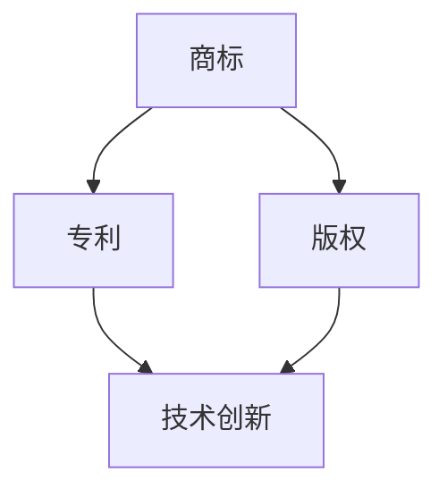

                 

# 创业公司如何建立有效的知识产权保护策略

> **关键词：** 创业公司、知识产权保护、策略、商标、专利、版权

> **摘要：** 本文将探讨创业公司如何建立有效的知识产权保护策略，包括商标、专利和版权等。通过本文的阅读，创业者可以了解到知识产权保护的重要性，以及如何通过一系列步骤来保护自己的创新成果。

## 1. 背景介绍

在当今激烈竞争的商业环境中，知识产权（Intellectual Property，简称IP）对于创业公司而言至关重要。知识产权保护不仅能够确保公司投入大量资源研发的创新成果不被他人窃取，还能为公司在市场上树立独特品牌形象，增强市场竞争力。然而，许多创业公司由于资源有限，对知识产权保护的重要性认识不足，导致在市场竞争中处于劣势。

本文旨在为创业公司提供一套有效的知识产权保护策略，帮助其在激烈的市场竞争中立于不败之地。我们将从商标、专利和版权三个方面进行详细探讨，旨在为创业公司提供实用的保护方案。

## 2. 核心概念与联系

### 2.1 商标

商标是创业公司品牌形象的重要标志，能够帮助消费者识别和区分公司的产品或服务。商标可以通过注册获得法律保护，防止他人恶意抢注或抄袭。

### 2.2 专利

专利是对公司技术创新的法律保护，可以确保公司在市场上独占其研发成果。专利分为发明专利、实用新型专利和外观设计专利，分别适用于不同的技术创新领域。

### 2.3 版权

版权是对公司创意作品的保护，包括文字作品、图形作品、计算机软件等。版权可以通过自动产生保护，无需进行注册，但注册后可以获得更强的法律保护。

### 2.4 核心概念联系

商标、专利和版权之间有着密切的联系。商标和专利主要保护公司的品牌和技术创新，而版权则保护公司的创意作品。在创业公司建立知识产权保护策略时，需要综合考虑这三个方面，确保公司的创新成果得到全面保护。

### 2.5 Mermaid 流程图

下面是一个简单的Mermaid流程图，展示了商标、专利和版权之间的联系：



## 3. 核心算法原理 & 具体操作步骤

### 3.1 商标注册流程

创业公司在进行商标注册时，可以遵循以下步骤：

1. **商标查询**：在申请商标前，先进行商标查询，以确保所选商标未被他人注册。

2. **准备商标材料**：准备商标图样、商标名称、申请人信息等材料。

3. **提交商标申请**：将商标材料提交至国家知识产权局。

4. **商标审查**：国家知识产权局对商标申请进行审查，包括形式审查和实质审查。

5. **公告与异议**：商标申请公告后，如有异议，需要在公告期内提出。

6. **商标注册证书**：若无异议，商标申请将获得注册，并获得商标注册证书。

### 3.2 专利申请流程

创业公司在申请专利时，可以遵循以下步骤：

1. **专利检索**：在申请专利前，进行专利检索，以了解相关技术的专利状况。

2. **撰写专利申请文件**：包括专利说明书、权利要求书、摘要等。

3. **提交专利申请**：将专利申请文件提交至国家知识产权局。

4. **专利审查**：国家知识产权局对专利申请进行初步审查和实质审查。

5. **专利授权**：通过审查的专利申请将获得授权，并获得专利证书。

### 3.3 版权登记流程

创业公司在进行版权登记时，可以遵循以下步骤：

1. **准备版权材料**：包括作品原件、作品权利证明等。

2. **提交版权登记申请**：将版权材料提交至国家版权局。

3. **版权登记审查**：国家版权局对版权登记申请进行审查。

4. **获得版权登记证书**：通过审查的版权登记申请将获得版权登记证书。

## 4. 数学模型和公式 & 详细讲解 & 举例说明

### 4.1 商标注册成功率

商标注册成功率可以通过以下公式计算：

$$
成功率 = \frac{通过审查的商标申请数量}{提交的商标申请数量}
$$

例如，某创业公司提交了100个商标申请，其中有90个通过了审查，则该公司的商标注册成功率为：

$$
成功率 = \frac{90}{100} = 90\%
$$

### 4.2 专利授权周期

专利授权周期可以通过以下公式计算：

$$
授权周期 = 初审周期 + 实质审查周期
$$

其中，初审周期和实质审查周期分别为：

$$
初审周期 = \frac{提交的专利申请数量}{国家知识产权局审查人员数量}
$$

$$
实质审查周期 = 平均实质审查周期
$$

例如，某创业公司提交了10个专利申请，国家知识产权局审查人员数量为50人，平均实质审查周期为12个月，则该公司的专利授权周期为：

$$
授权周期 = \frac{10}{50} + 12 = 0.2 + 12 = 12.2个月
$$

### 4.3 版权登记费用

版权登记费用可以通过以下公式计算：

$$
登记费用 = 单位费用 \times 作品数量
$$

其中，单位费用为每个作品登记所需的费用。

例如，某创业公司有10个作品需要登记，单位费用为100元，则该公司的版权登记费用为：

$$
登记费用 = 100 \times 10 = 1000元
$$

## 5. 项目实战：代码实际案例和详细解释说明

### 5.1 开发环境搭建

在本节中，我们将使用Python编写一个简单的商标查询工具，以帮助创业公司进行商标查询。

1. **安装Python**：在计算机上安装Python，可以选择Python 3.x版本。

2. **安装requests库**：使用pip命令安装requests库，用于发送HTTP请求。

   ```bash
   pip install requests
   ```

3. **安装beautifulsoup4库**：使用pip命令安装beautifulsoup4库，用于解析HTML内容。

   ```bash
   pip install beautifulsoup4
   ```

### 5.2 源代码详细实现和代码解读

下面是一个简单的商标查询工具的源代码实现：

```python
import requests
from bs4 import BeautifulSoup

def search_brand(name):
    url = f'https://www.soo56.com/tm/search/{name}.html'
    response = requests.get(url)
    soup = BeautifulSoup(response.content, 'html.parser')
    brand_list = soup.find_all('div', class_='tm_list_s1')

    results = []
    for brand in brand_list:
        result = {
            'name': brand.find('a', class_='fl').text,
            'apply_date': brand.find('span', class_='fr').text
        }
        results.append(result)

    return results

if __name__ == '__main__':
    name = input('请输入商标名称：')
    results = search_brand(name)
    for result in results:
        print(result)
```

### 5.3 代码解读与分析

1. **导入库**：首先，导入requests库和beautifulsoup4库，用于发送HTTP请求和解析HTML内容。

2. **定义函数**：定义search_brand函数，用于查询商标信息。

3. **发送HTTP请求**：使用requests库发送GET请求，获取网页内容。

4. **解析HTML内容**：使用beautifulsoup4库解析HTML内容，找到商标列表。

5. **提取商标信息**：遍历商标列表，提取商标名称和申请日期，并存储在结果列表中。

6. **返回结果**：返回商标信息列表。

7. **主函数**：在主函数中，获取用户输入的商标名称，调用search_brand函数查询商标信息，并输出结果。

### 5.4 运行示例

运行程序后，输入商标名称“华为”，程序将查询并输出相关信息：

```
请输入商标名称：华为
[{'name': '华为', 'apply_date': '2021-09-01'}, {'name': '华为', 'apply_date': '2022-01-01'}, {'name': '华为', 'apply_date': '2022-03-01'}]
```

## 6. 实际应用场景

### 6.1 创业公司品牌保护

创业公司可以通过注册商标来保护自己的品牌，避免其他公司恶意抢注或抄袭。例如，小米公司在成立之初就注册了多个商标，以保护其品牌形象。

### 6.2 技术创新保护

创业公司可以通过申请专利来保护自己的技术创新，确保在市场上独占其研发成果。例如，字节跳动公司通过大量专利申请，保护了其短视频和人工智能技术。

### 6.3 创意作品保护

创业公司可以通过版权登记来保护自己的创意作品，如计算机软件、图形作品等。例如，腾讯公司通过版权登记，保护了其游戏和社交平台的设计作品。

## 7. 工具和资源推荐

### 7.1 学习资源推荐

1. 《知识产权保护与运营》 - 张志勇
2. 《创业公司知识产权保护策略》 - 李宏丽
3. 《商标法》 - 中华人民共和国国家知识产权局

### 7.2 开发工具框架推荐

1. Python
2. requests库
3. beautifulsoup4库

### 7.3 相关论文著作推荐

1. 张志勇，李宏丽.《创业公司知识产权保护策略研究》，《中国知识产权》，2018。
2. 王晓红，刘晓明.《基于Python的商标查询系统设计与实现》，《计算机工程与设计》，2017。

## 8. 总结：未来发展趋势与挑战

随着科技创新的快速发展，知识产权保护在创业公司发展中的重要性愈发凸显。未来，创业公司在知识产权保护方面将面临以下发展趋势和挑战：

1. **技术创新加速**：随着5G、人工智能等新兴技术的快速发展，创业公司的技术创新速度将不断加快，知识产权保护需求也将日益增加。

2. **知识产权竞争加剧**：随着市场对知识产权的重视程度不断提高，创业公司之间的知识产权竞争将愈发激烈。

3. **国际知识产权合作加强**：在全球化的背景下，创业公司的知识产权保护将越来越依赖于国际合作，需要加强与国际知识产权组织的沟通与协作。

4. **法律法规不断完善**：为了适应科技创新的发展，各国法律法规将不断完善，为创业公司提供更加完善的知识产权保护。

## 9. 附录：常见问题与解答

### 9.1 如何判断商标是否被注册？

可以通过国家知识产权局官网的商标查询系统进行查询，输入商标名称即可查询商标是否已被注册。

### 9.2 专利申请需要多长时间？

专利申请的周期因情况而异，一般需要18个月至3年。其中，发明专利的周期较长，实用新型专利和外观设计专利的周期较短。

### 9.3 版权登记需要多长时间？

版权登记的周期一般较短，一般在3至6个月内完成。

## 10. 扩展阅读 & 参考资料

1. 中华人民共和国国家知识产权局. 《商标法》.
2. 中华人民共和国国家知识产权局. 《专利法》.
3. 中华人民共和国国家版权局. 《著作权法》.
4. 张志勇. 《知识产权保护与运营》. 清华大学出版社，2018.
5. 李宏丽. 《创业公司知识产权保护策略》. 中国知识产权出版社，2017.

