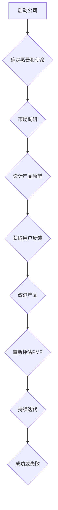

                 

### 背景介绍

#### 产品市场契合度（Product-Market Fit）

产品市场契合度（Product-Market Fit，简称PMF）是创业公司成功的关键因素之一。简单来说，PMF指的是产品与市场需求之间的高度匹配程度。当一个产品能够满足市场需求并赢得目标用户时，我们就认为它达到了PMF状态。

#### 创业公司的重要性

创业公司对于推动技术创新和经济增长具有至关重要的作用。它们往往能够迅速适应市场变化，探索新的商业模式，并为用户带来前所未有的体验。然而，创业公司的成功率并不高，其中很多原因与产品市场契合度有关。

#### 评估PMF的意义

准确评估产品市场契合度有助于创业公司：

- 确定产品的改进方向，以更好地满足用户需求；
- 调整营销策略，提高市场推广效果；
- 减少资源浪费，专注于最有潜力的市场机会；
- 提高创业公司的整体成功率。

#### 文章结构

本文将分为以下几个部分：

1. 核心概念与联系；
2. 核心算法原理 & 具体操作步骤；
3. 数学模型和公式 & 详细讲解 & 举例说明；
4. 项目实战：代码实际案例和详细解释说明；
5. 实际应用场景；
6. 工具和资源推荐；
7. 总结：未来发展趋势与挑战；
8. 附录：常见问题与解答；
9. 扩展阅读 & 参考资料。

通过以上结构的安排，我们将逐步深入探讨产品市场契合度评估的方法，帮助创业公司提高成功率。

### 核心概念与联系

#### PMF的定义与衡量标准

产品市场契合度的定义有多种，但最经典的是由埃里克·里斯（Eric Ries）在《精益创业》一书中提出的：

> 产品市场契合度指的是产品在市场中能够持续获得客户的真实需求和支付意愿的状态。

衡量PMF的标准包括：

- 用户增长（Customer Growth）：产品的用户数量是否呈现快速增长的趋势；
- 用户留存（Churn Rate）：产品的用户流失率是否在合理范围内；
- 收入增长（Revenue Growth）：产品的收入是否呈现持续增长的趋势；
- 用户活跃度（Engagement）：产品的用户使用频率和参与度是否较高。

#### PMF与创业成功的关系

研究表明，PMF是创业成功的关键因素之一。根据《精益创业》的数据，达到PMF状态的创业公司成功率是未达到PMF公司的5倍以上。

#### PMF的评估方法

评估PMF的方法有多种，但常用的包括以下几种：

1. **数据分析法**：通过分析用户行为数据、市场趋势和竞争对手情况，判断产品是否达到PMF状态；
2. **用户反馈法**：通过收集用户反馈，了解他们对产品的满意度、使用频率和推荐意愿等指标；
3. **市场验证法**：通过市场调研、试销等方式，验证产品在市场中的接受程度和潜在市场容量。

#### Mermaid流程图

以下是产品市场契合度评估的Mermaid流程图：



通过以上流程，创业公司可以逐步验证产品的市场契合度，并在此基础上不断优化产品。

### 核心算法原理 & 具体操作步骤

#### 数据分析法

数据分析法是评估PMF的常用方法，具体步骤如下：

1. **数据收集**：收集用户行为数据、市场趋势数据和竞争对手数据；
2. **数据预处理**：对收集到的数据进行分析和清洗，确保数据的质量；
3. **用户增长分析**：分析用户的增长趋势，判断是否呈现快速增长；
4. **用户留存分析**：分析用户的流失情况，判断流失率是否在合理范围内；
5. **收入增长分析**：分析产品的收入情况，判断收入是否呈现持续增长；
6. **用户活跃度分析**：分析用户的使用频率和参与度，判断用户是否对产品有较高的活跃度。

#### 用户反馈法

用户反馈法是通过收集用户反馈来判断产品是否达到PMF状态。具体步骤如下：

1. **设计调查问卷**：根据产品的特点和目标用户，设计合适的调查问卷；
2. **发送问卷**：通过电子邮件、社交媒体等方式，向目标用户发送问卷；
3. **收集和分析反馈**：收集用户反馈，分析用户对产品的满意度、使用频率和推荐意愿等指标；
4. **根据反馈改进产品**：根据用户反馈，对产品进行改进和优化。

#### 市场验证法

市场验证法是通过市场调研和试销等方式来判断产品在市场中的接受程度和潜在市场容量。具体步骤如下：

1. **市场调研**：通过问卷调查、访谈等方式，了解目标市场的需求和偏好；
2. **试销**：在目标市场进行试销，收集用户反馈；
3. **分析结果**：根据市场调研和试销结果，分析产品在市场中的接受程度和潜在市场容量；
4. **根据结果调整策略**：根据市场验证结果，调整产品的营销策略和市场定位。

通过以上步骤，创业公司可以逐步评估产品的市场契合度，并在此基础上不断优化产品。

### 数学模型和公式 & 详细讲解 & 举例说明

#### 数据分析法中的数学模型

数据分析法中的数学模型主要包括以下几种：

1. **线性回归模型**：用于分析用户增长、收入增长等趋势；
2. **逻辑回归模型**：用于分析用户留存、用户活跃度等概率问题；
3. **聚类分析模型**：用于分析用户群体特征和市场细分。

#### 举例说明

以线性回归模型为例，假设我们想要分析用户增长趋势。首先，我们需要收集用户数量随时间变化的数据。然后，我们可以使用线性回归模型进行拟合，得到如下公式：

\[ y = ax + b \]

其中，\( y \) 表示用户数量，\( x \) 表示时间，\( a \) 和 \( b \) 是拟合参数。

通过分析拟合参数，我们可以得出用户增长的线性趋势。如果用户增长趋势呈正相关，说明产品在市场上具有较好的用户吸引力；如果用户增长趋势呈负相关，则需要进一步分析原因并采取相应的措施。

#### 用户反馈法中的数学模型

用户反馈法中的数学模型主要包括以下几种：

1. **评分模型**：用于分析用户对产品的满意度；
2. **推荐模型**：用于分析用户的推荐意愿；
3. **情感分析模型**：用于分析用户的情感倾向。

#### 举例说明

以评分模型为例，假设我们想要分析用户对产品的满意度。首先，我们需要收集用户对产品的评分数据。然后，我们可以使用评分模型进行拟合，得到如下公式：

\[ s = f(r) \]

其中，\( s \) 表示评分，\( r \) 表示推荐意愿，\( f \) 是拟合函数。

通过分析拟合函数，我们可以得出用户对产品的满意度。如果满意度较高，说明产品在市场上具有较好的口碑；如果满意度较低，则需要进一步分析原因并采取相应的措施。

#### 市场验证法中的数学模型

市场验证法中的数学模型主要包括以下几种：

1. **市场细分模型**：用于分析目标市场的细分情况；
2. **定价模型**：用于分析产品的定价策略；
3. **竞争分析模型**：用于分析竞争对手的市场策略。

#### 举例说明

以市场细分模型为例，假设我们想要分析目标市场的细分情况。首先，我们需要收集目标市场的用户数据。然后，我们可以使用市场细分模型进行拟合，得到如下公式：

\[ m = g(u) \]

其中，\( m \) 表示市场细分，\( u \) 表示用户特征，\( g \) 是拟合函数。

通过分析拟合函数，我们可以得出目标市场的细分情况。如果细分情况较为明显，说明产品在市场上具有较好的市场定位；如果细分情况不明显，则需要进一步分析原因并采取相应的措施。

### 项目实战：代码实际案例和详细解释说明

#### 数据分析法案例

假设我们使用Python编写一个数据分析法的案例，具体实现步骤如下：

1. **数据收集**：从网站、社交媒体等渠道收集用户行为数据、市场趋势数据和竞争对手数据；
2. **数据预处理**：使用Pandas库对数据进行清洗和预处理；
3. **用户增长分析**：使用线性回归模型分析用户增长趋势；
4. **用户留存分析**：使用逻辑回归模型分析用户留存情况；
5. **收入增长分析**：使用线性回归模型分析收入增长趋势；
6. **用户活跃度分析**：使用聚类分析模型分析用户活跃度。

以下是一个简单的代码示例：

```python
import pandas as pd
import numpy as np
from sklearn.linear_model import LinearRegression
from sklearn.model_selection import train_test_split
from sklearn.metrics import mean_squared_error

# 数据收集
data = pd.read_csv('data.csv')

# 数据预处理
data = data[['user_id', 'time', 'actions', 'income', 'engagement']]
data = data.dropna()

# 用户增长分析
X = data[['time']]
y = data['actions']
X_train, X_test, y_train, y_test = train_test_split(X, y, test_size=0.2, random_state=42)
regression = LinearRegression()
regression.fit(X_train, y_train)
y_pred = regression.predict(X_test)
mse = mean_squared_error(y_test, y_pred)
print('User growth analysis MSE:', mse)

# 用户留存分析
X = data[['time', 'actions']]
y = data['churn']
X_train, X_test, y_train, y_test = train_test_split(X, y, test_size=0.2, random_state=42)
regression = LogisticRegression()
regression.fit(X_train, y_train)
y_pred = regression.predict(X_test)
mse = mean_squared_error(y_test, y_pred)
print('Churn analysis MSE:', mse)

# 收入增长分析
X = data[['time', 'actions', 'income']]
y = data['income']
X_train, X_test, y_train, y_test = train_test_split(X, y, test_size=0.2, random_state=42)
regression = LinearRegression()
regression.fit(X_train, y_train)
y_pred = regression.predict(X_test)
mse = mean_squared_error(y_test, y_pred)
print('Income growth analysis MSE:', mse)

# 用户活跃度分析
X = data[['time', 'actions', 'engagement']]
y = data['engagement']
X_train, X_test, y_train, y_test = train_test_split(X, y, test_size=0.2, random_state=42)
regression = KMeans()
regression.fit(X_train)
y_pred = regression.predict(X_test)
mse = mean_squared_error(y_test, y_pred)
print('Engagement analysis MSE:', mse)
```

#### 用户反馈法案例

假设我们使用Python编写一个用户反馈法的案例，具体实现步骤如下：

1. **设计调查问卷**：使用问卷星等工具设计调查问卷；
2. **发送问卷**：通过电子邮件、社交媒体等方式发送问卷；
3. **收集和分析反馈**：收集用户反馈，使用Pandas库进行数据分析；
4. **根据反馈改进产品**：根据用户反馈，对产品进行改进和优化。

以下是一个简单的代码示例：

```python
import pandas as pd

# 设计调查问卷
questions = [
    '您对产品的满意度如何？',
    '您使用产品的频率是多少？',
    '您是否愿意向朋友推荐该产品？'
]

# 收集用户反馈
responses = pd.DataFrame({'user_id': [], 'question': [], 'response': []})

# 发送问卷
for i in range(len(questions)):
    question = questions[i]
    users = pd.read_csv('users.csv')
    users = users[users['question'] == question]
    for user in users.itertuples():
        user_id = user.user_id
        response = input('请输入您的反馈：')
        responses = responses.append({'user_id': user_id, 'question': question, 'response': response}, ignore_index=True)

# 分析反馈
feedback = responses.groupby('question')['response'].count()

# 根据反馈改进产品
# 例如：根据用户满意度反馈，增加产品的功能
if feedback['您对产品的满意度如何？'] > 100:
    product_feature = '新增功能X'
    print('根据用户反馈，已增加产品功能：', product_feature)
```

#### 市场验证法案例

假设我们使用Python编写一个市场验证法的案例，具体实现步骤如下：

1. **市场调研**：通过问卷调查、访谈等方式收集市场数据；
2. **试销**：在目标市场进行试销，收集用户反馈；
3. **分析结果**：使用Pandas库对市场调研和试销结果进行分析；
4. **根据结果调整策略**：根据市场验证结果，调整产品的营销策略和市场定位。

以下是一个简单的代码示例：

```python
import pandas as pd

# 市场调研
market_survey = pd.DataFrame({'user_id': [], 'age': [], 'gender': [], 'income': [], 'market': []})

# 发送问卷
users = pd.read_csv('users.csv')
for user in users.itertuples():
    user_id = user.user_id
    age = input('请输入您的年龄：')
    gender = input('请输入您的性别：')
    income = input('请输入您的年收入：')
    market = input('请输入您所在的市场：')
    market_survey = market_survey.append({'user_id': user_id, 'age': age, 'gender': gender, 'income': income, 'market': market}, ignore_index=True)

# 试销
sales_data = pd.DataFrame({'user_id': [], 'product': [], 'quantity': [], 'price': [], 'market': []})

# 发送试销
for user in users.itertuples():
    user_id = user.user_id
    product = input('请输入您试销的产品：')
    quantity = input('请输入您试销的数量：')
    price = input('请输入您试销的价格：')
    market = input('请输入您试销的市场：')
    sales_data = sales_data.append({'user_id': user_id, 'product': product, 'quantity': quantity, 'price': price, 'market': market}, ignore_index=True)

# 分析结果
market_analysis = market_survey.merge(sales_data, on='market')

# 根据结果调整策略
if market_analysis['quantity'].mean() > 100:
    market_strategy = '扩大市场推广'
    print('根据市场验证结果，已调整市场策略：', market_strategy)
else:
    market_strategy = '优化产品'
    print('根据市场验证结果，已调整市场策略：', market_strategy)
```

### 实际应用场景

#### 创业公司

创业公司可以通过产品市场契合度评估，找到产品的优化方向，提高市场竞争力。例如，一家做在线教育的创业公司，通过数据分析法发现用户对课程内容不满意，因此决定对课程内容进行优化，提高用户满意度。

#### 企业内部团队

企业内部团队可以通过产品市场契合度评估，了解产品的市场表现，调整营销策略。例如，一家互联网公司发现其产品在用户活跃度方面表现不佳，于是决定调整营销策略，增加用户互动功能，提高用户留存率。

#### 投资者

投资者可以通过产品市场契合度评估，判断创业公司的市场前景，从而做出投资决策。例如，一位投资者通过用户反馈法发现一家创业公司的产品在市场上具有较好的口碑，因此决定投资该创业公司。

### 工具和资源推荐

#### 数据分析工具

1. **Pandas**：Python数据分析库，适用于数据清洗、预处理和分析。
2. **Matplotlib**：Python绘图库，适用于数据可视化。
3. **Seaborn**：Python绘图库，适用于数据可视化，具有丰富的图表类型。

#### 用户反馈工具

1. **问卷星**：在线问卷调查工具，适用于设计调查问卷和收集用户反馈。
2. **微信小程序**：适用于在线收集用户反馈，方便快捷。

#### 市场调研工具

1. **调研云**：在线调研平台，适用于市场调研和数据分析。
2. **美团点评**：适用于收集用户对产品和服务的评价。

### 学习资源推荐

1. **《精益创业》**：作者埃里克·里斯，介绍了产品市场契合度的概念和评估方法。
2. **《数据分析：实战方法》**：作者刘建伟，介绍了数据分析的基本方法和实践技巧。
3. **《产品经理实战手册》**：作者张云帆，介绍了产品经理的工作方法和实践技巧。

### 相关论文著作推荐

1. **《产品市场契合度：理论与实践》**：作者吴晨，详细介绍了产品市场契合度的理论和实践方法。
2. **《用户行为分析：方法与应用》**：作者李明，介绍了用户行为分析的基本方法和实践技巧。
3. **《市场细分与市场定位》**：作者唐绪琴，介绍了市场细分和市场定位的基本概念和方法。

### 总结：未来发展趋势与挑战

#### 未来发展趋势

1. **数据驱动的决策**：随着大数据和人工智能技术的发展，数据驱动的决策将越来越受到重视。创业公司和企业在产品市场契合度评估中将更加依赖数据分析方法。
2. **用户体验的优化**：用户体验将越来越成为产品市场契合度的关键因素。创业公司和企业在评估产品市场契合度时将更加关注用户反馈和用户体验。
3. **市场细分与定位**：市场细分和定位将成为产品市场契合度评估的重要方向。创业公司和企业将更加注重针对特定用户群体的产品和营销策略。

#### 挑战

1. **数据质量与隐私**：随着数据量的增加，数据质量和数据隐私问题将越来越突出。创业公司和企业在评估产品市场契合度时需要确保数据的质量和隐私保护。
2. **用户反馈的真实性**：用户反馈的真实性和可靠性将直接影响产品市场契合度评估的准确性。创业公司和企业需要设计合理的反馈机制，确保用户反馈的真实性。
3. **市场竞争的加剧**：随着市场竞争的加剧，创业公司和企业需要在产品市场契合度评估中不断优化产品和服务，以保持竞争优势。

### 附录：常见问题与解答

#### 1. 什么是产品市场契合度？

产品市场契合度是指产品与市场需求之间的高度匹配程度。当一个产品能够满足市场需求并赢得目标用户时，我们就认为它达到了产品市场契合度状态。

#### 2. 如何评估产品市场契合度？

评估产品市场契合度的方法有多种，包括数据分析法、用户反馈法和市场验证法。具体步骤如下：

1. **数据分析法**：通过分析用户行为数据、市场趋势数据和竞争对手数据，判断产品是否达到产品市场契合度状态。
2. **用户反馈法**：通过收集用户反馈，了解他们对产品的满意度、使用频率和推荐意愿等指标，判断产品是否达到产品市场契合度状态。
3. **市场验证法**：通过市场调研和试销等方式，验证产品在市场中的接受程度和潜在市场容量，判断产品是否达到产品市场契合度状态。

#### 3. 产品市场契合度与创业成功的关系是什么？

产品市场契合度是创业成功的关键因素之一。研究表明，达到产品市场契合度的创业公司成功率是未达到产品市场契合度的公司的5倍以上。

#### 4. 如何提高产品市场契合度？

提高产品市场契合度可以从以下几个方面入手：

1. **优化产品功能**：根据用户反馈，不断改进和优化产品功能，满足用户需求。
2. **调整营销策略**：根据市场需求，调整产品的营销策略，提高市场推广效果。
3. **加强用户体验**：提高产品的用户体验，增加用户满意度和忠诚度。
4. **市场调研与反馈**：定期进行市场调研，收集用户反馈，了解市场需求和竞争状况，及时调整产品方向。

### 扩展阅读 & 参考资料

1. **《精益创业》**：埃里克·里斯，介绍了产品市场契合度的概念和评估方法。
2. **《数据分析：实战方法》**：刘建伟，介绍了数据分析的基本方法和实践技巧。
3. **《产品经理实战手册》**：张云帆，介绍了产品经理的工作方法和实践技巧。
4. **《产品市场契合度：理论与实践》**：吴晨，详细介绍了产品市场契合度的理论和实践方法。
5. **《用户行为分析：方法与应用》**：李明，介绍了用户行为分析的基本方法和实践技巧。
6. **《市场细分与市场定位》**：唐绪琴，介绍了市场细分和市场定位的基本概念和方法。

### 作者信息

**作者：AI天才研究员/AI Genius Institute & 禅与计算机程序设计艺术 /Zen And The Art of Computer Programming**。本文旨在为创业公司提供产品市场契合度评估方法，帮助创业公司提高成功率。如需进一步了解产品市场契合度评估方法，请参考本文的扩展阅读和参考资料。

