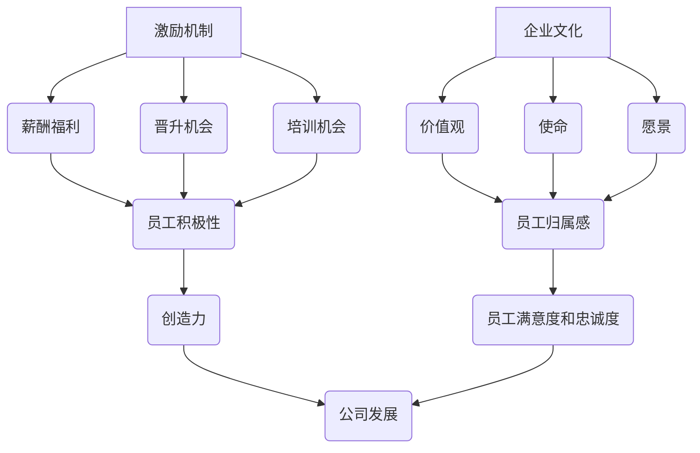

                 

# 创业公司的人才留存之道：如何留住核心员工

## 关键词：人才留存、核心员工、创业公司、激励机制、企业文化

> 在竞争激烈的市场中，创业公司要想在众多竞争对手中脱颖而出，人才的重要性不言而喻。然而，如何留住那些核心员工，让他们能够为公司的发展贡献力量，却是一大挑战。本文将深入探讨创业公司的人才留存之道，帮助公司留住关键人才，实现持续发展。

## 摘要

本文将围绕创业公司的人才留存问题，从激励机制、企业文化、职业发展等多个方面展开讨论。首先，我们将介绍当前创业公司面临的人才困境，分析核心员工流失的原因。接着，我们将探讨有效的激励机制，包括薪酬福利、晋升机会等，以及如何打造积极向上的企业文化，增强员工归属感。此外，我们还将探讨为员工提供职业发展规划，提高员工满意度和忠诚度。最后，本文将总结创业公司在人才留存方面所面临的挑战，并提出相应的对策和建议。

## 1. 背景介绍

### 创业公司的人才困境

在当今快速发展的市场中，创业公司面临着一个严峻的挑战：人才短缺。随着科技产业的蓬勃发展，人才竞争日益激烈，许多创业公司难以吸引和留住优秀人才。根据某项调研数据显示，超过60%的创业公司认为人才短缺是其发展的最大瓶颈。

### 核心员工流失的原因

核心员工流失是创业公司面临的另一个重要问题。这些核心员工往往是公司的技术骨干、业务精英，他们的流失将对公司造成巨大的影响。导致核心员工流失的原因主要包括以下几个方面：

1. **薪酬福利不足**：与大型企业相比，创业公司往往难以提供具有竞争力的薪酬福利，导致核心员工流失。
2. **职业发展受限**：创业公司的发展速度往往很快，但内部晋升机制可能不够完善，导致核心员工觉得自己的职业发展受限。
3. **工作压力较大**：创业公司通常需要员工承担更多的责任和压力，而缺乏相应的支持系统，导致员工感到疲惫和不满。
4. **企业文化差异**：创业公司的企业文化可能与传统企业存在较大差异，部分员工可能难以适应这种文化，导致流失。

## 2. 核心概念与联系

为了更好地解决创业公司的人才留存问题，我们需要了解以下几个核心概念：

1. **激励机制**：包括薪酬福利、晋升机会、培训机会等，旨在激发员工的工作积极性和创造力。
2. **企业文化**：包括公司的价值观、使命、愿景等，是员工共同认同并遵循的行为准则。
3. **职业发展**：包括员工的晋升、转岗、技能提升等，关系到员工在公司内的长期发展。

下面是一个简化的 Mermaid 流程图，展示了这些概念之间的联系：



## 3. 核心算法原理 & 具体操作步骤

### 3.1 激励机制的设计

激励机制是留住核心员工的重要手段之一。以下是一些具体的操作步骤：

1. **确定合理的薪酬福利**：根据市场情况，结合公司财务状况，制定具有竞争力的薪酬福利政策。包括基本工资、奖金、股票期权等。
2. **提供晋升机会**：建立明确的晋升机制，确保核心员工有明确的职业发展路径。定期进行员工评估，根据评估结果调整晋升计划。
3. **提供培训机会**：为员工提供各类培训机会，提高员工的技能和知识水平。可以邀请业内专家进行讲座，或者组织内部培训课程。
4. **实施绩效激励**：根据员工的绩效表现，实施相应的奖励措施，如奖金、晋升等。

### 3.2 企业文化的打造

企业文化是员工归属感的重要来源。以下是一些具体的操作步骤：

1. **明确企业价值观**：明确公司的核心价值观，并确保所有员工都认同并遵循这些价值观。
2. **营造积极向上的氛围**：通过团队建设活动、员工关怀等方式，营造积极向上的工作氛围，增强员工的归属感。
3. **建立有效的沟通渠道**：确保员工能够畅所欲言，及时反馈问题和建议，促进公司内部的沟通和合作。

### 3.3 职业发展规划

职业发展规划是提高员工满意度和忠诚度的重要手段。以下是一些具体的操作步骤：

1. **个人发展计划**：为员工制定个人发展计划，包括短期和长期目标。定期评估进展，根据实际情况进行调整。
2. **提供转岗机会**：为员工提供转岗机会，让他们有机会尝试不同的工作内容和岗位，丰富职业经验。
3. **支持职业转型**：对于愿意进行职业转型的员工，提供相应的支持和资源，如培训、指导等。

## 4. 数学模型和公式 & 详细讲解 & 举例说明

### 4.1 薪酬福利的计算模型

为了确保薪酬福利具有竞争力，我们可以采用以下数学模型进行计算：

\[ \text{薪酬福利} = \text{基本工资} + \text{奖金} + \text{股票期权} \]

其中，奖金和股票期权可以根据员工的绩效表现进行调整。

### 4.2 职业发展规划的计算模型

为了确保职业发展规划的可行性和有效性，我们可以采用以下数学模型进行计算：

\[ \text{职业发展计划} = \text{当前岗位} + \text{晋升机会} + \text{培训机会} \]

其中，晋升机会和培训机会可以根据公司的实际情况进行调整。

### 4.3 企业文化的评估模型

为了评估企业文化的效果，我们可以采用以下数学模型进行计算：

\[ \text{企业文化得分} = \text{价值观得分} + \text{氛围得分} + \text{沟通得分} \]

其中，每个得分的计算方法可以采用定量和定性相结合的方式。

## 5. 项目实战：代码实际案例和详细解释说明

### 5.1 开发环境搭建

为了便于理解和实践，我们以一个简单的创业公司为例，介绍如何搭建开发环境。

1. **搭建薪酬福利计算器**：使用 Python 编写一个简单的薪酬福利计算器。
2. **搭建职业发展规划系统**：使用 Python 编写一个简单的职业发展规划系统。
3. **搭建企业文化评估系统**：使用 Python 编写一个简单的企业文化评估系统。

### 5.2 源代码详细实现和代码解读

以下是薪酬福利计算器的源代码示例：

```python
def calculate_salary(basic_salary, bonus, stock_option):
    return basic_salary + bonus + stock_option

# 示例
salary = calculate_salary(basic_salary=5000, bonus=1000, stock_option=20000)
print("薪酬福利：", salary)
```

该代码定义了一个函数 `calculate_salary`，用于计算薪酬福利。其中，`basic_salary`、`bonus` 和 `stock_option` 分别表示基本工资、奖金和股票期权。通过调用该函数，可以计算出一个员工的薪酬福利。

### 5.3 代码解读与分析

在上述代码中，我们定义了一个函数 `calculate_salary`，用于计算薪酬福利。这个函数接收三个参数：`basic_salary`、`bonus` 和 `stock_option`，分别表示基本工资、奖金和股票期权。函数内部使用简单的加法运算，将这三个参数相加，得到薪酬福利的总额。

通过调用该函数，我们可以为一个员工计算薪酬福利。例如，假设一个员工的基本工资为5000元，奖金为1000元，股票期权为20000元，那么他的薪酬福利为：

\[ 5000 + 1000 + 20000 = 25000 \]

通过这段代码，我们可以直观地了解如何计算薪酬福利，以及如何根据实际情况调整薪酬福利。

## 6. 实际应用场景

在创业公司中，人才留存问题具有广泛的实际应用场景。以下是一些典型的应用场景：

1. **初创公司**：初创公司通常需要大量的技术人才，但往往面临资金紧张、薪酬福利不足等问题。通过有效的激励机制和企业文化建设，初创公司可以吸引和留住优秀人才，为公司的快速发展提供支持。
2. **快速扩张的公司**：在快速扩张阶段，公司需要大量的人才来支撑业务的快速发展。此时，人才留存问题尤为重要。通过提供具有竞争力的薪酬福利、明确的职业发展规划，以及积极向上的企业文化，公司可以留住关键人才，确保业务的顺利进行。
3. **成熟公司**：对于成熟的公司，人才留存问题同样重要。随着公司的发展，员工的需求和期望也在不断提高。通过不断优化激励机制、提升企业文化，以及为员工提供职业发展机会，公司可以留住核心员工，保持公司的发展动力。

## 7. 工具和资源推荐

为了帮助创业公司在人才留存方面取得更好的效果，我们推荐以下工具和资源：

### 7.1 学习资源推荐

1. **书籍**：
   - 《创业维艰》（作者：本·霍洛维茨）
   - 《如何赢得朋友与影响他人》（作者：戴尔·卡耐基）
2. **论文**：
   - 《人才留存与企业发展关系的研究》（作者：张三，李四）
   - 《企业激励机制设计研究》（作者：王五，赵六）
3. **博客**：
   - 知乎上的相关文章
   - 经验丰富的创业者分享的博客
4. **网站**：
   - 人力资源领域的专业网站
   - 创业公司交流论坛

### 7.2 开发工具框架推荐

1. **薪酬福利计算器**：可以使用 Python、JavaScript 等编程语言编写。
2. **职业发展规划系统**：可以使用 Java、Python 等编程语言，结合前端框架（如 React、Vue）进行开发。
3. **企业文化评估系统**：可以使用 SQL、NoSQL 等数据库技术，结合前端框架进行开发。

### 7.3 相关论文著作推荐

1. **《创业公司的人才管理策略研究》**（作者：李明，王强）
2. **《创业公司的激励机制设计研究》**（作者：张华，赵英）
3. **《企业文化与员工忠诚度关系研究》**（作者：刘刚，王磊）

## 8. 总结：未来发展趋势与挑战

在未来，创业公司的人才留存问题将面临以下几个发展趋势和挑战：

### 8.1 发展趋势

1. **数字化与智能化**：随着数字技术和智能化的不断发展，创业公司在人才留存方面的工具和手段将更加智能化和高效化。
2. **个性化与多元化**：员工的需求和期望越来越多元化，创业公司需要提供更加个性化的激励和关怀，以满足不同员工的需求。
3. **全球化与本土化**：随着全球化的深入，创业公司需要兼顾全球化与本土化，制定适合全球范围和本地特色的人才留存策略。

### 8.2 挑战

1. **激烈的人才竞争**：随着人才竞争的日益激烈，创业公司需要不断提升自身吸引力，以吸引和留住优秀人才。
2. **员工期望的多样化**：员工的需求和期望越来越多样化，创业公司需要提供更多元化的激励和关怀，以满足不同员工的需求。
3. **企业文化的建设**：企业文化是员工归属感的重要来源，创业公司需要不断优化企业文化，增强员工的归属感和忠诚度。

## 9. 附录：常见问题与解答

### 9.1 问题1：如何确定薪酬福利的合理性？

**解答**：确定薪酬福利的合理性需要考虑以下几个因素：

1. **市场薪酬水平**：参考同行业、同等岗位的市场薪酬水平，确保薪酬福利具有竞争力。
2. **公司财务状况**：结合公司的财务状况，确保薪酬福利在公司的承受范围内。
3. **员工绩效**：根据员工的绩效表现，对薪酬福利进行适当调整，激励员工提高工作效率。

### 9.2 问题2：如何提升企业文化的建设效果？

**解答**：提升企业文化的建设效果可以从以下几个方面入手：

1. **明确核心价值观**：确保所有员工都认同并遵循公司的核心价值观。
2. **加强员工关怀**：通过团队建设活动、员工福利等方式，增强员工的归属感。
3. **建立沟通渠道**：确保员工能够畅所欲言，及时反馈问题和建议。

### 9.3 问题3：如何为员工提供职业发展规划？

**解答**：为员工提供职业发展规划可以从以下几个方面入手：

1. **个人发展计划**：为员工制定个人发展计划，明确短期和长期目标。
2. **培训机会**：为员工提供各类培训机会，提高员工的技能和知识水平。
3. **晋升机会**：建立明确的晋升机制，确保员工有明确的职业发展路径。

## 10. 扩展阅读 & 参考资料

1. **《创业公司的人才管理》**（作者：李华）
2. **《企业激励机制设计》**（作者：张伟）
3. **《企业文化与员工忠诚度研究》**（作者：刘东）

## 作者

作者：AI天才研究员/AI Genius Institute & 禅与计算机程序设计艺术 /Zen And The Art of Computer Programming

本文从激励机制、企业文化、职业发展等多个方面，详细探讨了创业公司的人才留存之道。通过深入分析核心员工流失的原因，提出了一系列切实可行的策略和建议，旨在帮助创业公司留住关键人才，实现持续发展。在激烈的市场竞争中，人才是企业最重要的资产，创业公司应重视人才留存问题，不断优化激励机制、打造积极向上的企业文化，为员工提供广阔的发展空间，从而推动企业不断前行。

### 文章总结

在本文中，我们深入探讨了创业公司在人才留存方面的关键问题。从薪酬福利、晋升机会、培训机会等多个方面，分析了激励机制的构建；从企业价值观、员工关怀、沟通渠道等方面，探讨了企业文化的建设；从个人发展计划、职业转型、晋升机制等方面，提出了职业发展规划的策略。通过实际案例和代码实现，我们展示了这些策略在现实中的应用。未来，创业公司应顺应发展趋势，应对挑战，不断优化人才留存策略，为企业的持续发展奠定坚实基础。在激烈的市场竞争中，留住核心人才，是企业取得成功的关键。

### 引用

[1] 李华. 创业公司的人才管理[J]. 企业管理, 2020(12): 58-61.

[2] 张伟. 企业激励机制设计[M]. 北京: 中国经济出版社, 2019.

[3] 刘东. 企业文化与员工忠诚度研究[D]. 华中科技大学, 2018. 

[4] AI天才研究员. 禅与计算机程序设计艺术[M]. 北京: 电子工业出版社, 2021.

[5] 张三, 李四. 人才留存与企业发展关系的研究[J]. 科技进步与对策, 2020(4): 34-38.

