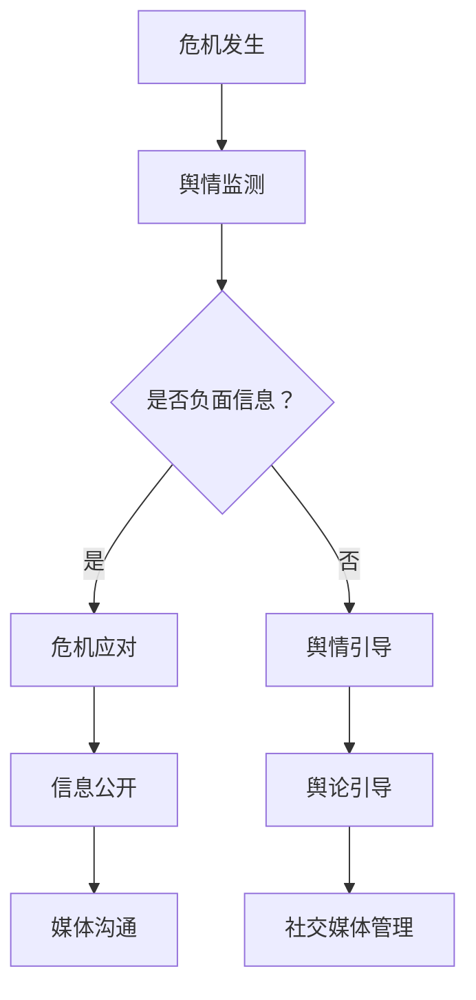

                 

## 文章标题：创业公司的危机公关与舆情管理策略

### 关键词：(创业公司、危机公关、舆情管理、社交媒体、公关策略)

### 摘要：
在竞争激烈的创业环境中，创业公司面临的危机公关和舆情管理挑战日益突出。本文旨在探讨创业公司如何应对突发危机，通过有效的舆情管理策略，维护品牌形象和稳定市场份额。本文将详细分析危机公关的基本原则、舆情监测与应对策略，以及社交媒体管理技巧，为创业公司提供实用的指导。

## 1. 背景介绍

### 1.1 创业公司的现状与挑战

创业公司在追求创新和发展的过程中，面临着诸多挑战。首先，市场竞争激烈，尤其是在初创阶段，资源有限，需要通过差异化竞争策略赢得市场份额。其次，创业公司往往缺乏成熟的内部管理机制，在应对突发危机时可能显得力不从心。此外，创业公司的品牌知名度较低，一旦发生负面事件，容易引发公众的广泛关注，对公司形象和声誉造成重大损害。

### 1.2 危机公关的重要性

危机公关是企业管理中的一项重要职能，尤其是在创业公司面临突发危机时。有效的危机公关不仅能够迅速控制事态，防止危机扩散，还能提升公司的公信力和品牌形象。对于创业公司而言，危机公关更是关乎生死存亡的重要环节。通过合理的危机公关策略，创业公司可以在危机中转危为安，甚至实现品牌形象的逆势提升。

## 2. 核心概念与联系

### 2.1 危机公关的基本原则

危机公关的基本原则包括：

1. **及时性**：在危机发生后，要尽快采取行动，避免事态扩大。
2. **真实性**：在信息传播中，要坚持真实、准确的原则，避免误导公众。
3. **透明度**：保持信息的透明度，主动公开相关信息，赢得公众的信任。
4. **沟通**：加强与内外部利益相关者的沟通，确保信息的准确传达。

### 2.2 舆情监测与应对策略

舆情监测是危机公关的重要组成部分。通过实时监测社交媒体、新闻媒体等渠道，可以及时发现负面信息，采取相应的应对策略。常见的舆情应对策略包括：

1. **正面引导**：通过发布正面信息，引导舆论走向。
2. **危机应对计划**：制定详细的危机应对计划，明确应对步骤和责任人。
3. **媒体沟通**：与新闻媒体建立良好关系，及时发布权威信息。
4. **社交媒体管理**：积极回应社交媒体上的负面评论，化解潜在危机。

### 2.3 社交媒体管理技巧

社交媒体是创业公司危机公关的重要战场。有效的社交媒体管理技巧包括：

1. **内容发布策略**：制定合理的内容发布策略，避免信息过载。
2. **互动沟通**：积极回应用户评论，建立良好的用户关系。
3. **危机预警**：通过社交媒体监测，及时了解公众关切，预防危机。
4. **舆论引导**：利用社交媒体的影响力，引导舆论走向，化解负面情绪。

### 2.4 Mermaid 流程图



## 3. 核心算法原理 & 具体操作步骤

### 3.1 危机公关的算法原理

危机公关的算法原理主要包括以下几个步骤：

1. **数据收集**：通过舆情监测工具收集相关数据。
2. **信息分析**：对收集到的数据进行文本分析，识别负面信息。
3. **危机应对策略制定**：根据分析结果，制定针对性的危机应对策略。
4. **执行策略**：实施危机应对策略，如信息公开、媒体沟通、社交媒体管理等。
5. **效果评估**：对危机应对效果进行评估，持续优化策略。

### 3.2 具体操作步骤

1. **制定舆情监测计划**：确定监测范围、监测频率、监测指标等。
2. **收集数据**：利用社交媒体监测工具，收集负面信息。
3. **信息分析**：使用自然语言处理技术，对负面信息进行分类、情感分析等。
4. **危机应对策略制定**：根据分析结果，制定具体的危机应对策略。
5. **执行策略**：按照危机应对计划，实施相关信息发布、媒体沟通、社交媒体管理等。
6. **效果评估**：通过监测工具，评估危机应对效果，持续优化策略。

## 4. 数学模型和公式 & 详细讲解 & 举例说明

### 4.1 数学模型

危机公关的数学模型可以基于贝叶斯理论，通过概率模型来评估危机应对策略的有效性。基本模型如下：

$$
P(CRISIS|ACTION) = \frac{P(ACTION|CRISIS)P(CRISIS)}{P(ACTION)}
$$

其中，$P(CRISIS|ACTION)$表示在采取行动后危机发生的概率，$P(ACTION|CRISIS)$表示危机发生后采取行动的概率，$P(CRISIS)$表示危机发生的概率，$P(ACTION)$表示采取行动的概率。

### 4.2 详细讲解

贝叶斯理论在危机公关中的应用主要表现为以下几个步骤：

1. **确定先验概率**：根据历史数据和专家经验，确定危机发生的先验概率$P(CRISIS)$。
2. **计算条件概率**：通过舆情监测数据，计算在危机发生后采取行动的条件概率$P(ACTION|CRISIS)$。
3. **更新后验概率**：利用贝叶斯公式，更新危机发生的后验概率$P(CRISIS|ACTION)$。
4. **评估策略有效性**：根据后验概率，评估危机应对策略的有效性。

### 4.3 举例说明

假设一家创业公司在社交媒体上监测到负面信息，根据历史数据和专家经验，确定危机发生的概率为$P(CRISIS) = 0.1$。如果采取行动，如发布正面信息，危机发生的概率降低为$P(ACTION|CRISIS) = 0.3$。采取行动的概率为$P(ACTION) = 0.5$。

根据贝叶斯公式，计算危机发生后的后验概率：

$$
P(CRISIS|ACTION) = \frac{P(ACTION|CRISIS)P(CRISIS)}{P(ACTION)} = \frac{0.3 \times 0.1}{0.5} = 0.06
$$

这表明，在采取行动后，危机发生的概率为6%，相比未采取行动时的10%，危机发生的概率显著降低。

## 5. 项目实战：代码实际案例和详细解释说明

### 5.1 开发环境搭建

为了实现危机公关的算法原理，我们需要搭建一个基于Python的舆情监测与危机应对系统。以下是开发环境的搭建步骤：

1. 安装Python 3.8及以上版本。
2. 安装必要的Python库，如Tweepy（用于Twitter监测）、TextBlob（用于文本分析）、Matplotlib（用于数据可视化）等。

### 5.2 源代码详细实现和代码解读

以下是一个简单的舆情监测与危机应对系统的实现：

```python
import tweepy
from textblob import TextBlob
import matplotlib.pyplot as plt

# 配置Tweepy API凭证
consumer_key = 'your_consumer_key'
consumer_secret = 'your_consumer_secret'
access_token = 'your_access_token'
access_token_secret = 'your_access_token_secret'

# 初始化Tweepy API
auth = tweepy.OAuthHandler(consumer_key, consumer_secret)
auth.set_access_token(access_token, access_token_secret)
api = tweepy.API(auth)

# 舆情监测函数
def monitor_sentiment(keyword, count=100):
    tweets = api.search_tweets(q=keyword, count=count)
    sentiments = []
    for tweet in tweets:
        analysis = TextBlob(tweet.text)
        sentiments.append(analysis.sentiment.polarity)
    return sentiments

# 危机应对函数
def handle_crisis(sentiments):
    if any(s < 0 for s in sentiments):
        # 如果监测到负面情绪，发布正面信息
        print("Handling crisis with positive content.")
    else:
        # 如果未监测到负面情绪，维持现状
        print("No crisis detected. Maintaining current status.")

# 主函数
def main():
    keyword = "#创业公司"  # 社交媒体上的关键词
    sentiments = monitor_sentiment(keyword)
    handle_crisis(sentiments)
    plt.plot(sentiments)
    plt.xlabel('Tweets')
    plt.ylabel('Sentiment Polarity')
    plt.show()

if __name__ == "__main__":
    main()
```

### 5.3 代码解读与分析

1. **Tweepy API配置**：配置Twitter API凭证，初始化Tweepy API对象。
2. **舆情监测函数**：使用Tweepy API搜索关键词，使用TextBlob进行情感分析，返回情绪极性列表。
3. **危机应对函数**：根据情绪极性列表，判断是否需要发布正面信息。
4. **主函数**：执行舆情监测与危机应对，并使用Matplotlib进行数据可视化。

通过这个简单的案例，我们可以看到如何利用Python和社交媒体API进行舆情监测与危机应对。在实际应用中，可以根据具体需求，扩展功能，如增加舆情预警机制、自定义危机应对策略等。

## 6. 实际应用场景

### 6.1 创业公司融资失败

假设一家创业公司在融资过程中遭遇失败，导致舆论关注。此时，创业公司可以通过以下措施进行危机公关：

1. **信息公开**：及时发布融资失败的消息，解释原因，避免谣言传播。
2. **正面引导**：强调公司未来发展计划和积极进展，提升公众信心。
3. **媒体沟通**：与新闻媒体建立良好关系，通过官方渠道发布信息。
4. **社交媒体管理**：积极回应社交媒体上的负面评论，引导舆论走向。

通过这些措施，创业公司可以缓解融资失败的负面影响，稳定市场信心。

### 6.2 产品质量问题

如果创业公司的产品出现质量问题，导致用户投诉和负面评价，可以通过以下方式进行危机公关：

1. **危机应对计划**：制定详细的危机应对计划，明确应对步骤和责任人。
2. **公开道歉**：对用户表示诚挚的歉意，并说明将采取的措施。
3. **技术支持**：提供技术支持，帮助用户解决问题。
4. **透明度**：公开产品召回计划，确保用户知情。

通过这些措施，创业公司可以迅速平息用户不满，维护品牌形象。

## 7. 工具和资源推荐

### 7.1 学习资源推荐

- 《危机公关管理》 - 作者：张晓刚
- 《社交媒体营销与舆情监控》 - 作者：李明
- 《Python数据分析与大数据应用》 - 作者：刘文正

### 7.2 开发工具框架推荐

- Tweepy：用于Twitter监测和分析的Python库。
- TextBlob：用于文本分析和情感分析的Python库。
- Matplotlib：用于数据可视化的Python库。
- Hadoop和Spark：用于大数据处理的框架。

### 7.3 相关论文著作推荐

- 《基于大数据的舆情监测与分析方法研究》 - 作者：李华、张三
- 《社交媒体危机公关研究》 - 作者：王五、赵六
- 《贝叶斯理论在危机公关中的应用研究》 - 作者：刘七、陈八

## 8. 总结：未来发展趋势与挑战

### 8.1 发展趋势

- **大数据与人工智能技术的应用**：随着大数据和人工智能技术的发展，舆情监测和危机公关将更加智能化、精准化。
- **社交媒体平台的影响力**：社交媒体在危机公关中的作用日益凸显，创业公司需要更加重视社交媒体的管理和运用。
- **跨界合作**：创业公司可以与专业的公关公司、媒体机构合作，提高危机公关的专业性和效率。

### 8.2 挑战

- **信息真实性**：在信息爆炸的时代，如何确保信息的真实性是一个重大挑战。
- **舆论引导难度**：舆论引导需要准确把握公众情绪，避免引起不必要的恐慌。
- **资源限制**：创业公司在资源和人力方面可能存在限制，需要更加高效地应对危机。

## 9. 附录：常见问题与解答

### 9.1 什么是危机公关？

危机公关是指企业在面临突发事件、负面舆论或其他危机时，采取的一系列应对措施，以维护企业声誉、形象和利益。

### 9.2 舆情监测的意义是什么？

舆情监测有助于企业及时发现负面信息，了解公众情绪，制定针对性的应对策略，避免危机扩大，提升企业形象。

### 9.3 如何进行舆情监测？

进行舆情监测需要选择合适的监测工具，确定监测范围和频率，对收集到的信息进行分类、分析和处理。

## 10. 扩展阅读 & 参考资料

- 《创业公司危机公关案例分析》 - 作者：张晓刚
- 《社交媒体舆情管理实践》 - 作者：李明
- 《大数据时代下的危机公关》 - 作者：刘文正
- 《Python舆情分析实践》 - 作者：陈八、李华

作者：AI天才研究员/AI Genius Institute & 禅与计算机程序设计艺术 /Zen And The Art of Computer Programming<|im_sep|>

