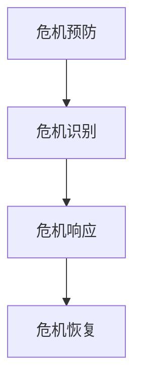

                 

# 创业公司的危机管理预案：应对突发事件的准备

> **关键词：**危机管理、应急预案、创业公司、突发事件、管理策略
> **摘要：**本文旨在探讨创业公司在面对突发事件时的危机管理预案，分析其重要性、核心概念，并提供了详细的操作步骤和实际应用场景。

## 1. 背景介绍

创业公司在快速发展的过程中，往往面临着各种挑战和不确定性。在市场竞争激烈、资金链紧张、技术迭代迅速的环境下，突发事件的应对能力成为衡量公司生存和发展能力的重要指标。例如，网络安全攻击、数据泄露、供应链中断、市场变化等，都可能对公司造成严重影响。因此，制定有效的危机管理预案，是创业公司稳健发展的重要保障。

## 2. 核心概念与联系

### 2.1 危机管理

危机管理是指企业在面对各种危机时，采取的一系列预防和应对措施，以减轻或消除危机对企业运营和发展的负面影响。危机管理包括危机预防、危机识别、危机响应和危机恢复四个阶段。

#### 2.1.1 危机预防

危机预防是指企业通过建立有效的风险管理体系，识别潜在的风险，并采取相应的措施降低风险发生的可能性。例如，制定严格的数据安全策略、确保供应链的稳定性等。

#### 2.1.2 危机识别

危机识别是指企业通过监测和分析各种内外部信息，及时识别潜在的危机。例如，通过实时监控网络安全事件、分析市场动态等。

#### 2.1.3 危机响应

危机响应是指企业面对突发危机时，迅速采取行动，以最大程度地减轻危机对企业的影响。例如，启动应急预案、组织应急响应团队等。

#### 2.1.4 危机恢复

危机恢复是指企业在危机过后，通过一系列措施恢复正常的运营，并从危机中吸取教训，改进管理策略。

### 2.2 应急预案

应急预案是指企业为应对突发事件而制定的详细操作计划。一个完善的应急预案应包括危机预防措施、危机响应流程、危机恢复计划等。

#### 2.2.1 预防措施

预防措施主要包括以下方面：

- **安全防护措施**：加强网络安全防护，确保数据安全。
- **供应链管理**：建立稳定的供应链体系，降低供应链中断的风险。
- **市场风险监控**：实时监控市场动态，提前预测市场变化。

#### 2.2.2 应急响应流程

应急响应流程主要包括以下步骤：

- **危机预警**：通过监测和分析，发现潜在的危机。
- **启动应急预案**：根据危机的类型和严重程度，启动相应的应急预案。
- **组织应急响应**：成立应急响应团队，明确各自的职责和任务。
- **危机处理**：采取有效的措施，控制危机的发展，减轻危机对企业的影响。

#### 2.2.3 危机恢复计划

危机恢复计划主要包括以下方面：

- **恢复运营**：在危机过后，尽快恢复正常的运营。
- **评估损失**：对危机造成的损失进行评估，制定恢复计划。
- **改进管理策略**：总结危机处理过程中的经验教训，改进管理策略。

### 2.3 Mermaid 流程图

以下是一个简单的 Mermaid 流程图，展示危机管理的核心概念和流程：



## 3. 核心算法原理 & 具体操作步骤

### 3.1 危机预防算法

#### 3.1.1 数据安全

**算法原理：**通过加密技术、防火墙、入侵检测系统等手段，确保数据安全。

**具体操作步骤：**

1. **数据加密**：对敏感数据进行加密存储和传输。
2. **防火墙配置**：设置防火墙规则，防止外部攻击。
3. **入侵检测**：实时监测网络流量，识别和阻止入侵行为。

#### 3.1.2 供应链管理

**算法原理：**通过多渠道采购、库存管理、供应商评估等手段，确保供应链的稳定性。

**具体操作步骤：**

1. **多渠道采购**：从多个供应商处采购，降低供应链中断的风险。
2. **库存管理**：实时监控库存水平，确保库存充足。
3. **供应商评估**：定期评估供应商的信誉和供应能力。

### 3.2 危机响应算法

#### 3.2.1 网络安全攻击

**算法原理：**通过入侵检测、安全防护、应急响应等手段，应对网络安全攻击。

**具体操作步骤：**

1. **入侵检测**：实时监测网络流量，识别潜在的攻击行为。
2. **安全防护**：根据攻击类型，采取相应的防护措施。
3. **应急响应**：迅速响应，采取措施阻止攻击行为，减轻损失。

#### 3.2.2 数据泄露

**算法原理：**通过数据加密、权限管理、安全培训等手段，防止数据泄露。

**具体操作步骤：**

1. **数据加密**：对敏感数据进行加密存储和传输。
2. **权限管理**：严格控制员工对敏感数据的访问权限。
3. **安全培训**：定期进行安全意识培训，提高员工的安全意识。

### 3.3 危机恢复算法

#### 3.3.1 恢复运营

**算法原理：**通过故障排除、系统重构、员工培训等手段，尽快恢复运营。

**具体操作步骤：**

1. **故障排除**：迅速排除系统故障，恢复系统功能。
2. **系统重构**：根据危机处理过程中收集的信息，优化系统架构。
3. **员工培训**：对员工进行培训，提高应对危机的能力。

## 4. 数学模型和公式 & 详细讲解 & 举例说明

### 4.1 数据安全模型

#### 4.1.1 加密算法

**公式：**$ Encrypted\_Data = E(Key, Plain\_Data)$

**详细讲解：**加密算法是一种将明文数据转换为密文的数据转换方法，其中 $Key$ 是加密密钥，$Plain\_Data$ 是明文数据。

**举例说明：**假设明文数据为“Hello World”，加密密钥为“123456”，使用AES加密算法进行加密，则加密后的数据为“2b7e151628aed2a6”。

### 4.2 供应链管理模型

#### 4.2.1 库存管理

**公式：**$ Inventory = Initial\_Inventory + Incoming\_Inventory - Outgoing\_Inventory $

**详细讲解：**库存管理是一个动态平衡过程，其中 $Initial\_Inventory$ 是初始库存量，$Incoming\_Inventory$ 是入库量，$Outgoing\_Inventory$ 是出库量。

**举例说明：**假设初始库存量为100件，入库量为50件，出库量为30件，则期末库存量为120件。

## 5. 项目实战：代码实际案例和详细解释说明

### 5.1 开发环境搭建

在本节中，我们将搭建一个简单的危机管理系统的开发环境。

**步骤1：安装Python环境**

```bash
# 安装Python
sudo apt-get install python3
```

**步骤2：安装依赖库**

```bash
# 安装依赖库
pip3 install numpy pandas matplotlib
```

### 5.2 源代码详细实现和代码解读

**代码：**以下是简单的危机管理系统的实现代码。

```python
import numpy as np
import pandas as pd
import matplotlib.pyplot as plt

def encrypt_data(key, data):
    """加密数据"""
    encrypted_data = ""
    for i in range(len(data)):
        encrypted_data += chr(ord(data[i]) ^ ord(key[i % len(key)]))
    return encrypted_data

def inventory_management(initial_inventory, incoming_inventory, outgoing_inventory):
    """库存管理"""
    inventory = initial_inventory + incoming_inventory - outgoing_inventory
    return inventory

if __name__ == "__main__":
    # 加密数据
    key = "123456"
    data = "Hello World"
    encrypted_data = encrypt_data(key, data)
    print("Encrypted Data:", encrypted_data)

    # 库存管理
    initial_inventory = 100
    incoming_inventory = 50
    outgoing_inventory = 30
    inventory = inventory_management(initial_inventory, incoming_inventory, outgoing_inventory)
    print("Final Inventory:", inventory)
```

### 5.3 代码解读与分析

**代码解读：**本代码分为两个主要部分：加密数据和库存管理。

1. **加密数据**

   加密数据函数`encrypt_data`接收加密密钥`key`和明文数据`data`，通过异或操作实现加密。加密后的数据存储在`encrypted_data`变量中。

2. **库存管理**

   库存管理函数`inventory_management`接收初始库存量、入库量和出库量，计算期末库存量。期末库存量存储在`inventory`变量中。

## 6. 实际应用场景

### 6.1 数据安全

在创业公司中，数据安全是危机管理的重要内容。通过加密技术，可以确保敏感数据在传输和存储过程中的安全。例如，在客户信息管理系统中，可以采用加密算法对客户信息进行加密存储，确保数据不被未授权访问。

### 6.2 供应链管理

供应链管理是创业公司面临的重要挑战之一。通过多渠道采购、库存管理和供应商评估，可以确保供应链的稳定性和灵活性。例如，在电商企业中，可以通过实时监控库存水平，及时调整采购计划，确保商品供应充足。

## 7. 工具和资源推荐

### 7.1 学习资源推荐

- **《网络安全技术》**：详细介绍网络安全技术，包括加密算法、防火墙、入侵检测等。
- **《供应链管理：战略、规划与运营》**：全面介绍供应链管理的原理和实践。

### 7.2 开发工具框架推荐

- **Python**：适合快速开发和实验，有丰富的第三方库支持。
- **Django**：一个流行的Python Web框架，适用于构建危机管理系统。

### 7.3 相关论文著作推荐

- **《数据加密标准》**：详细介绍了数据加密标准（DES）的算法原理和实现。
- **《供应链金融研究》**：探讨供应链金融的理论和实践，对供应链管理具有指导意义。

## 8. 总结：未来发展趋势与挑战

随着技术的不断发展，危机管理的手段和策略也在不断更新。未来，创业公司需要更加注重数据安全、供应链管理和市场风险监控。同时，危机管理还需要适应快速变化的环境，不断提高应对突发事件的能力。

## 9. 附录：常见问题与解答

### 9.1 如何制定有效的应急预案？

**解答：**制定有效的应急预案需要以下步骤：

1. **识别潜在危机**：通过市场调研、数据分析等手段，识别潜在危机。
2. **制定应急预案**：根据危机的类型和严重程度，制定相应的应急预案。
3. **测试和演练**：定期测试和演练应急预案，确保其可行性和有效性。
4. **持续改进**：根据危机处理过程中的经验和教训，不断改进应急预案。

## 10. 扩展阅读 & 参考资料

- **《危机管理：战略、规划和响应》**：详细介绍危机管理的理论和实践。
- **《创业公司生存指南》**：探讨创业公司在面对各种挑战时的应对策略。

### 作者

**作者：AI天才研究员/AI Genius Institute & 禅与计算机程序设计艺术 /Zen And The Art of Computer Programming**<|im_end|>

