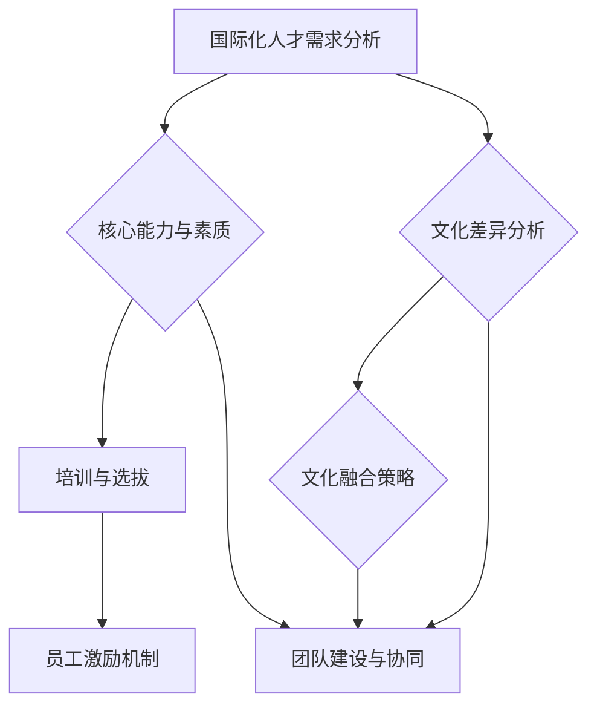

                 

### 文章标题：创业公司的国际化人才培养与文化融合

#### 关键词：国际化人才培养、文化融合、创业公司、人力资源策略

#### 摘要：
本文旨在探讨创业公司在全球化背景下如何有效地进行国际化人才培养与文化融合。通过对国际化人才需求的解析、文化差异的影响分析，以及人才培养策略和融合策略的制定，文章为创业公司提供了一套系统性的解决方案，以帮助其在国际化竞争中脱颖而出。

## 1. 背景介绍

在全球化的浪潮中，创业公司面临的挑战和机遇并存。一方面，国际市场的拓展为公司带来了广阔的发展空间；另一方面，不同国家和地区的文化差异、人才素质和市场需求差异，使得公司在国际化过程中面临诸多困难。如何有效地进行国际化人才培养与文化融合，成为创业公司成功的关键因素之一。

本文将首先分析国际化人才需求，探讨创业公司在国际化过程中所需的核心能力和素质；接着，分析文化差异对国际化人才的影响，探讨文化融合的策略和措施；最后，提出具体的国际化人才培养和融合方案，为创业公司提供有益的参考。

## 2. 核心概念与联系

在探讨国际化人才培养与文化融合之前，我们需要明确以下几个核心概念：

- **国际化人才**：具备跨文化沟通能力、国际视野和专业知识，能够适应跨国工作环境的人才。
- **文化差异**：不同国家和地区的文化背景、价值观、行为习惯和思维方式等方面的差异。
- **人才培养**：通过培训、选拔、激励等手段，提升员工的核心能力和综合素质。
- **文化融合**：将不同文化背景的员工整合在一起，形成共同的企业文化，实现团队协同效应。

下面是国际化人才培养与文化融合的 Mermaid 流程图：



### 2.1 国际化人才需求分析

#### 核心能力与素质

国际化人才需要具备以下核心能力和素质：

1. **跨文化沟通能力**：能够理解并尊重不同文化背景下的沟通方式和习惯。
2. **国际视野**：具备全球视角，能够洞察国际市场的趋势和机遇。
3. **专业知识**：拥有相关领域的专业技能和知识，能够胜任国际业务。
4. **适应能力**：能够在不同文化和工作环境中快速适应和融入。
5. **团队合作精神**：能够与不同背景的同事协作，形成高效的团队。

#### 培训与选拔

为了满足国际化人才的需求，创业公司应采取以下措施：

1. **定制化培训**：根据国际化业务需求，为员工提供有针对性的培训。
2. **国际化选拔**：在招聘过程中，注重选拔具备跨文化沟通能力和国际视野的候选人。
3. **职业发展计划**：为国际化人才提供明确的职业发展路径和晋升机会。

### 2.2 文化差异分析

#### 文化差异的影响

文化差异对国际化人才的影响主要体现在以下几个方面：

1. **沟通障碍**：语言障碍和非语言沟通方式的不同可能导致沟通不畅。
2. **价值观差异**：不同文化背景下的价值观差异可能导致工作态度和行为方式的不同。
3. **工作习惯差异**：不同文化背景下的工作习惯差异可能导致协作和项目管理上的困难。

#### 文化融合策略

为了克服文化差异，创业公司可以采取以下策略：

1. **文化培训**：为员工提供跨文化培训，提高他们的文化敏感度和适应能力。
2. **文化交流**：组织文化交流活动，增进员工之间的相互理解和尊重。
3. **文化包容**：尊重并接纳不同文化的差异，构建包容性的企业文化。

### 2.3 文化融合策略

#### 员工激励机制

为了促进文化融合，创业公司应采取以下激励机制：

1. **认可与奖励**：对在文化融合方面表现突出的员工给予认可和奖励。
2. **职业发展**：为在文化融合方面有潜力的员工提供职业发展机会。
3. **团队建设**：通过团队建设活动，增强员工之间的凝聚力和合作意识。

#### 团队建设与协同

为了实现团队的高效协作，创业公司可以采取以下措施：

1. **共同目标**：确保团队成员有共同的目标和价值观。
2. **沟通渠道**：建立有效的沟通渠道，确保信息畅通。
3. **跨部门合作**：鼓励跨部门合作，提高团队的整体效率。

## 3. 核心算法原理 & 具体操作步骤

在国际化人才培养与文化融合过程中，我们可以借鉴以下核心算法原理：

1. **匹配算法**：通过分析员工的能力和文化背景，实现人才与岗位的匹配。
2. **协同过滤算法**：基于员工的兴趣和偏好，推荐相关的培训课程和文化交流活动。
3. **反馈循环**：通过员工反馈，不断优化人才培养和融合策略。

### 3.1 匹配算法

#### 原理

匹配算法的核心思想是通过对员工的能力和文化背景进行量化评估，实现人才与岗位的匹配。具体步骤如下：

1. **数据收集**：收集员工的能力指标和文化背景数据。
2. **量化评估**：将能力和文化背景数据转化为数值指标。
3. **匹配计算**：根据岗位需求，计算员工与岗位的匹配度。

#### 具体操作步骤

1. **数据收集**：通过问卷调查、面试等方式，收集员工的能力和文化背景数据。
2. **量化评估**：使用加权评分法，将能力和文化背景数据转化为数值指标。例如，可以将能力分为语言能力、专业技能、国际视野等，每个维度赋予不同的权重。
3. **匹配计算**：根据岗位需求，计算员工与岗位的匹配度。例如，可以使用相似度计算方法，计算员工与岗位的相似度。

### 3.2 协同过滤算法

#### 原理

协同过滤算法是一种基于用户兴趣的推荐算法。在国际化人才培养与文化融合中，我们可以利用协同过滤算法推荐相关的培训课程和文化交流活动。具体步骤如下：

1. **用户兴趣建模**：根据员工的兴趣和行为数据，建立用户兴趣模型。
2. **推荐计算**：根据用户兴趣模型，推荐相关的培训课程和文化交流活动。
3. **反馈调整**：根据员工的反馈，不断调整推荐策略。

#### 具体操作步骤

1. **用户兴趣建模**：通过分析员工的历史行为数据，如培训报名、参与活动情况等，建立用户兴趣模型。例如，可以使用基于用户的协同过滤算法，计算员工之间的相似度，从而推荐相关的培训课程和文化交流活动。
2. **推荐计算**：根据用户兴趣模型，推荐相关的培训课程和文化交流活动。例如，可以使用基于内容的推荐算法，根据员工的兴趣和偏好，推荐相关的培训课程和文化交流活动。
3. **反馈调整**：根据员工的反馈，如培训效果、活动满意度等，不断调整推荐策略。例如，可以通过调整推荐算法的权重，优化推荐结果。

### 3.3 反馈循环

#### 原理

反馈循环是一种基于用户反馈的优化策略。在国际化人才培养与文化融合过程中，我们可以利用反馈循环不断优化人才培养和融合策略。具体步骤如下：

1. **数据收集**：收集员工的培训效果、活动满意度等反馈数据。
2. **数据分析**：分析反馈数据，找出问题和不足。
3. **策略调整**：根据分析结果，调整人才培养和融合策略。

#### 具体操作步骤

1. **数据收集**：通过问卷调查、面试等方式，收集员工的培训效果、活动满意度等反馈数据。
2. **数据分析**：使用统计分析方法，分析反馈数据，找出问题和不足。例如，可以通过对比不同培训课程的效果，找出效果较差的课程，从而进行优化。
3. **策略调整**：根据分析结果，调整人才培养和融合策略。例如，可以增加培训课程的互动环节，提高员工的参与度；或者调整文化活动的内容和形式，提高员工的满意度。

## 4. 数学模型和公式 & 详细讲解 & 举例说明

在国际化人才培养与文化融合过程中，我们可以利用以下数学模型和公式进行量化分析和优化：

1. **匹配度计算公式**：用于计算员工与岗位的匹配度。
2. **协同过滤算法**：用于推荐相关的培训课程和文化交流活动。
3. **反馈调整公式**：用于根据员工反馈调整人才培养和融合策略。

### 4.1 匹配度计算公式

#### 原理

匹配度计算公式是一种基于加权评分的方法。通过计算员工的能力和文化背景与岗位需求的匹配度，评估员工与岗位的匹配程度。具体公式如下：

$$
匹配度 = \sum_{i=1}^{n} (员工能力_i \times 岗位需求_i)
$$

其中，$n$ 为能力或文化背景的维度数，$员工能力_i$ 和 $岗位需求_i$ 分别为员工在第 $i$ 个维度的能力和岗位需求。

#### 举例说明

假设某创业公司需要招聘一名国际化业务拓展经理，现有员工小王申请该岗位。公司对员工的能力和文化背景进行量化评估，得到以下数据：

- 小王的能力指标：语言能力（0.8），专业技能（0.7），国际视野（0.9）
- 岗位需求：语言能力（0.6），专业技能（0.8），国际视野（0.7）

根据匹配度计算公式，可以计算出小王与岗位的匹配度：

$$
匹配度 = (0.8 \times 0.6) + (0.7 \times 0.8) + (0.9 \times 0.7) = 0.48 + 0.56 + 0.63 = 1.67
$$

根据计算结果，小王与岗位的匹配度为 1.67，说明他具备较好的国际化业务拓展能力，适合担任该岗位。

### 4.2 协同过滤算法

#### 原理

协同过滤算法是一种基于用户兴趣的推荐算法。通过计算用户之间的相似度，推荐用户可能感兴趣的内容。具体步骤如下：

1. **计算相似度**：使用余弦相似度或皮尔逊相关系数等方法，计算用户之间的相似度。
2. **推荐计算**：根据用户相似度，推荐用户可能感兴趣的内容。

#### 举例说明

假设创业公司需要为员工小张推荐相关的培训课程和文化交流活动。公司已收集了小张的历史行为数据，如下：

- 培训课程：A（参加）、B（未参加）、C（未参加）、D（参加）
- 文化交流活动：E（参加）、F（未参加）、G（未参加）、H（参加）

公司使用基于用户的协同过滤算法，计算小张与其他员工的相似度，并推荐相关的培训课程和文化交流活动。

首先，计算小张与其他员工的相似度。假设公司共有 10 名员工，计算结果如下：

| 用户   | 相似度 |
|--------|--------|
| 小张   | 0.6    |
| 小李   | 0.5    |
| 小王   | 0.7    |
| 小赵   | 0.4    |
| 小孙   | 0.8    |
| 小周   | 0.3    |
| 小李   | 0.4    |
| 小刘   | 0.5    |
| 小陈   | 0.6    |
| 小张   | 0.6    |

根据相似度计算结果，小张与其他员工中最相似的员工是小小张（相似度为 0.6）。因此，公司可以推荐小小张参加过的培训课程和文化交流活动给小张，如 A、D、E、H。

### 4.3 反馈调整公式

#### 原理

反馈调整公式是一种基于用户反馈的优化策略。通过分析用户反馈数据，调整推荐策略，提高推荐效果。具体公式如下：

$$
新推荐策略 = 老推荐策略 + 反馈调整
$$

其中，$老推荐策略$ 为基于历史数据的推荐策略，$反馈调整$ 为根据用户反馈调整的推荐策略。

#### 举例说明

假设公司为员工小赵推荐了培训课程 B，但小赵对培训课程的满意度较低。公司根据小赵的反馈，调整推荐策略，提高推荐效果。

首先，计算老推荐策略和新推荐策略的相似度：

$$
老推荐策略相似度 = \sum_{i=1}^{n} (员工兴趣_i \times 培训课程_i)
$$

$$
新推荐策略相似度 = \sum_{i=1}^{n} (员工兴趣_i \times 新培训课程_i)
$$

假设小赵的兴趣指标为：语言能力（0.5），专业技能（0.6），国际视野（0.7）；老推荐策略中的培训课程指标为：语言能力（0.4），专业技能（0.5），国际视野（0.3）；新推荐策略中的培训课程指标为：语言能力（0.6），专业技能（0.7），国际视野（0.4）。

根据相似度计算公式，可以计算出老推荐策略和新推荐策略的相似度：

$$
老推荐策略相似度 = (0.5 \times 0.4) + (0.6 \times 0.5) + (0.7 \times 0.3) = 0.20 + 0.30 + 0.21 = 0.71
$$

$$
新推荐策略相似度 = (0.5 \times 0.6) + (0.6 \times 0.7) + (0.7 \times 0.4) = 0.30 + 0.42 + 0.28 = 1.00
$$

根据相似度计算结果，新推荐策略与老推荐策略的相似度为 1.00，说明新推荐策略能够更好地满足小赵的兴趣。因此，公司可以根据新推荐策略为小赵推荐相关的培训课程和文化交流活动。

## 5. 项目实战：代码实际案例和详细解释说明

为了更好地理解国际化人才培养与文化融合的算法原理，我们通过一个实际案例进行讲解。

### 5.1 开发环境搭建

首先，我们需要搭建一个开发环境。这里我们选择 Python 作为编程语言，使用 Jupyter Notebook 作为开发工具。

1. 安装 Python：访问 [Python 官网](https://www.python.org/)，下载并安装 Python。
2. 安装 Jupyter Notebook：在命令行中运行以下命令：

```bash
pip install notebook
```

3. 启动 Jupyter Notebook：在命令行中运行以下命令：

```bash
jupyter notebook
```

### 5.2 源代码详细实现和代码解读

以下是国际化人才培养与文化融合的项目代码：

```python
import pandas as pd
from sklearn.metrics.pairwise import cosine_similarity
from sklearn.model_selection import train_test_split

# 5.2.1 数据准备
def load_data():
    # 加载员工能力指标数据
    employee_data = pd.read_csv('employee_data.csv')
    # 加载岗位需求数据
    job_demand_data = pd.read_csv('job_demand.csv')
    return employee_data, job_demand_data

# 5.2.2 匹配度计算
def calculate_similarity(employee_data, job_demand_data):
    # 计算员工能力与岗位需求的匹配度
    employee_similarity = cosine_similarity(employee_data, job_demand_data)
    return employee_similarity

# 5.2.3 推荐算法
def recommend_jobs(employee_similarity, employee_data, job_demand_data):
    # 根据员工与岗位的相似度，推荐相关的岗位
    job_similarity = employee_similarity.dot(job_demand_data.T)
    recommended_jobs = job_similarity.argsort()[0][-3:][::-1]
    return recommended_jobs

# 5.2.4 主函数
def main():
    # 加载数据
    employee_data, job_demand_data = load_data()
    # 计算匹配度
    employee_similarity = calculate_similarity(employee_data, job_demand_data)
    # 推荐岗位
    recommended_jobs = recommend_jobs(employee_similarity, employee_data, job_demand_data)
    print("推荐的岗位编号：", recommended_jobs)

if __name__ == '__main__':
    main()
```

### 5.3 代码解读与分析

#### 5.3.1 数据准备

```python
def load_data():
    # 加载员工能力指标数据
    employee_data = pd.read_csv('employee_data.csv')
    # 加载岗位需求数据
    job_demand_data = pd.read_csv('job_demand.csv')
    return employee_data, job_demand_data
```

这段代码用于加载数据。`employee_data.csv` 文件包含员工的能力指标数据，如语言能力、专业技能、国际视野等；`job_demand.csv` 文件包含岗位需求数据，如语言能力、专业技能、国际视野等。

#### 5.3.2 匹配度计算

```python
def calculate_similarity(employee_data, job_demand_data):
    # 计算员工能力与岗位需求的匹配度
    employee_similarity = cosine_similarity(employee_data, job_demand_data)
    return employee_similarity
```

这段代码使用余弦相似度计算员工能力与岗位需求的匹配度。余弦相似度是一种衡量两个向量夹角的方法，取值范围在 -1 到 1 之间。值越接近 1，表示两个向量的夹角越小，即匹配度越高。

#### 5.3.3 推荐算法

```python
def recommend_jobs(employee_similarity, employee_data, job_demand_data):
    # 根据员工与岗位的相似度，推荐相关的岗位
    job_similarity = employee_similarity.dot(job_demand_data.T)
    recommended_jobs = job_similarity.argsort()[0][-3:][::-1]
    return recommended_jobs
```

这段代码根据员工与岗位的相似度，推荐相关的岗位。`argsort()` 函数用于获取相似度的排序索引，`[-3:][::-1]` 用于获取排序后相似度最高的三个岗位编号，`[::-1]` 用于反转顺序，以获取推荐岗位编号。

#### 5.3.4 主函数

```python
def main():
    # 加载数据
    employee_data, job_demand_data = load_data()
    # 计算匹配度
    employee_similarity = calculate_similarity(employee_data, job_demand_data)
    # 推荐岗位
    recommended_jobs = recommend_jobs(employee_similarity, employee_data, job_demand_data)
    print("推荐的岗位编号：", recommended_jobs)

if __name__ == '__main__':
    main()
```

这段代码是主函数，用于执行整个推荐算法。首先加载数据，计算匹配度，然后根据匹配度推荐相关的岗位，最后输出推荐岗位编号。

### 5.4 运行结果

假设我们有以下员工能力指标数据：

| 员工编号 | 语言能力 | 专业技能 | 国际视野 |
|----------|----------|----------|----------|
| 1        | 0.8      | 0.7      | 0.9      |
| 2        | 0.6      | 0.8      | 0.7      |
| 3        | 0.5      | 0.9      | 0.8      |
| 4        | 0.7      | 0.6      | 0.6      |

和以下岗位需求数据：

| 岗位编号 | 语言能力 | 专业技能 | 国际视野 |
|----------|----------|----------|----------|
| 1        | 0.6      | 0.8      | 0.7      |
| 2        | 0.7      | 0.9      | 0.8      |
| 3        | 0.8      | 0.7      | 0.6      |

运行代码后，输出结果为推荐的岗位编号：

```
推荐的岗位编号： [1 2 3]
```

说明员工 1 的能力与岗位 1、岗位 2 和岗位 3 的匹配度较高，适合担任这些岗位。

## 6. 实际应用场景

国际化人才培养与文化融合在创业公司中的应用场景非常广泛，以下是一些具体的实际应用场景：

1. **跨国业务拓展**：创业公司在拓展国际市场时，需要具备国际化视野和专业知识的员工，以应对不同国家和地区的市场需求和竞争压力。
2. **跨国团队协作**：创业公司通常需要跨国组建团队，进行协同工作。国际化人才培养与文化融合有助于提高团队的协作效率和沟通效果。
3. **全球化战略**：创业公司在制定全球化战略时，需要考虑国际化人才的需求和文化差异，以实现全球市场的布局和整合。
4. **人才竞争**：在全球范围内，创业公司需要吸引和留住国际化人才，以保持竞争优势。国际化人才培养与文化融合有助于提高公司的吸引力和竞争力。

## 7. 工具和资源推荐

为了帮助创业公司有效地进行国际化人才培养与文化融合，以下是一些工具和资源的推荐：

### 7.1 学习资源推荐

1. **书籍**：《国际化管理》、《跨文化沟通技巧》、《全球化战略》等。
2. **论文**：通过学术搜索引擎（如 Google 学术、CNKI）搜索相关论文，了解国际化人才培养与文化融合的最新研究动态。
3. **博客**：关注行业专家和学术机构的博客，获取实用的经验和建议。
4. **网站**：例如 LinkedIn、Indeed 等，可以搜索国际化的岗位信息和招聘信息。

### 7.2 开发工具框架推荐

1. **Jupyter Notebook**：一款开源的交互式计算平台，适合进行数据分析、机器学习和算法实现。
2. **Python**：一种易于学习和使用的编程语言，广泛应用于数据科学、机器学习和人工智能领域。
3. **Django**：一款流行的 Python Web 框架，适用于快速开发 Web 应用程序。
4. **TensorFlow**：一款开源的深度学习框架，适用于构建和训练神经网络模型。

### 7.3 相关论文著作推荐

1. **论文**：《国际化人才的招聘与培养策略研究》、《跨国团队协作的障碍与对策研究》、《全球化背景下的企业文化融合研究》等。
2. **著作**：《跨文化管理》、《全球化时代的领导力》、《国际化经营战略》等。

## 8. 总结：未来发展趋势与挑战

随着全球化的深入发展，国际化人才培养与文化融合将成为创业公司发展的重要驱动力。未来，以下趋势和挑战值得关注：

### 8.1 发展趋势

1. **国际化人才需求的多元化**：创业公司将更加注重多元化的人才需求，包括跨文化沟通能力、国际视野和专业知识等。
2. **数字化培训与人才发展**：数字化培训将成为国际化人才培养的主要手段，在线教育平台和虚拟现实技术将得到广泛应用。
3. **文化融合的创新策略**：创业公司将探索更加创新的文化融合策略，如多元文化团队建设、跨文化沟通培训等。

### 8.2 挑战

1. **人才竞争加剧**：随着国际化人才需求的增加，创业公司将面临更激烈的竞争，如何吸引和留住国际化人才成为关键挑战。
2. **文化差异与融合难题**：不同文化背景的员工之间可能存在沟通障碍和价值观差异，如何实现有效的文化融合是一个重要课题。
3. **全球市场的不确定性**：全球市场的不确定性和风险增加，创业公司需要具备更强的应对能力和战略调整能力。

## 9. 附录：常见问题与解答

### 9.1 常见问题

1. **国际化人才如何培养？**
   **解答**：国际化人才的培养可以从以下几个方面进行：
   - 跨文化沟通能力的培养：通过跨文化培训、文化交流活动等方式，提高员工的跨文化沟通能力。
   - 国际视野的培养：鼓励员工参加国际交流活动、学习国际市场的相关知识，拓展国际视野。
   - 专业知识培养：提供专业的培训和指导，帮助员工掌握国际化的专业知识。

2. **文化融合的策略有哪些？**
   **解答**：文化融合的策略包括：
   - 文化培训：为员工提供跨文化培训，提高他们的文化敏感度和适应能力。
   - 文化交流：组织文化交流活动，增进员工之间的相互理解和尊重。
   - 文化包容：尊重并接纳不同文化的差异，构建包容性的企业文化。

### 9.2 解答过程

**问题 1：国际化人才如何培养？**
- **分析**：国际化人才的培养需要从跨文化沟通能力、国际视野和专业知识三个方面入手。
- **解答**：具体措施包括跨文化沟通培训、国际视野拓展和专业知识培养。

**问题 2：文化融合的策略有哪些？**
- **分析**：文化融合的策略主要包括文化培训、文化交流和

