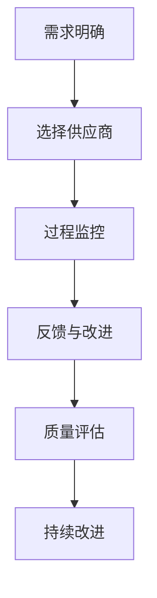

                 

### 背景介绍

在当今科技飞速发展的时代，创业公司如雨后春笋般涌现，它们在追求快速发展的过程中，技术外包成为了一种普遍的选择。技术外包，顾名思义，就是创业公司将自己的技术研发和实施工作委托给专业的技术外包公司或团队。这种合作模式不仅能够帮助创业公司节省人力成本，还能充分利用外部技术资源，提高项目的研发效率。

然而，技术外包并非无风险。外包质量的好坏直接影响项目的成功与否。一个优质的外包项目，不仅能够按时交付高质量的产品，还能为创业公司带来持续的技术支持和创新动力。相反，如果外包质量无法保障，可能会导致项目延期、成本超支，甚至影响到公司的正常运营和发展。

因此，创业公司在选择技术外包合作伙伴时，必须高度重视质量把控。本文将深入探讨创业公司在技术外包质量控制方面的核心问题，包括外包选择的依据、外包过程中的监控和评估方法，以及如何通过有效的质量管理和控制措施，确保外包项目的顺利进行和成功交付。

接下来，我们将逐步分析技术外包质量控制的重要性，探讨如何评估外包公司的能力，如何建立有效的质量控制流程，以及如何在项目执行过程中进行持续的监控和改进。通过这篇文章，希望能够为创业公司在技术外包质量控制方面提供一些有益的思路和实用建议。

### 核心概念与联系

在深入探讨技术外包质量控制之前，首先需要明确几个核心概念，并了解它们之间的相互联系。这些核心概念包括外包服务的定义、质量控制的含义以及它们在技术外包中的具体作用。

#### 外包服务的定义

外包服务（Outsourcing）是指将组织内部的某些职能或活动转移给外部公司或团队进行管理和执行。在外包服务中，创业公司可以将其部分或全部技术研发工作委托给专业的外包公司或团队。这种合作模式的主要目的是利用外部资源和专业能力，以提高工作效率和降低成本。

#### 质量控制的含义

质量控制（Quality Control，QC）是指在产品或服务的设计、生产或交付过程中，采取一系列措施来确保产品或服务的质量符合预定的标准和要求。质量控制的目标是发现和纠正过程中的缺陷和问题，从而避免不合格产品或服务进入市场，损害公司的声誉和利益。

#### 质量控制在技术外包中的作用

在技术外包中，质量控制起到了至关重要的作用。首先，质量控制有助于确保外包项目的交付质量。通过严格的质量控制流程，创业公司可以及时发现并解决外包过程中出现的问题，确保项目按时交付且达到预期的质量标准。

其次，质量控制有助于提升外包服务的长期合作关系。如果外包公司能够持续提供高质量的服务，创业公司会更有信心将其更多的技术需求外包出去，从而建立长期稳定的合作关系。

最后，质量控制还能为创业公司提供宝贵的技术反馈。通过监控外包项目的执行过程，创业公司可以了解外部技术团队的工作方式和思维方式，为自身的技术发展和创新提供有益的参考。

#### 外包服务与质量控制之间的联系

外包服务和质量控制之间存在着密切的联系。具体来说，质量控制是外包服务中不可或缺的一部分。以下是一些关键点：

1. **需求明确**：在技术外包的初期，创业公司需要明确外包服务的具体需求和预期质量标准，这是质量控制的基础。

2. **选择合适的供应商**：创业公司需要通过评估供应商的能力和信誉，选择具备高质量控制能力的合作伙伴。这直接关系到外包项目的成功与否。

3. **过程监控**：在项目执行过程中，创业公司需要建立有效的监控机制，实时跟踪项目的进展和质量，确保外包公司按照既定标准执行。

4. **反馈与改进**：外包项目的质量控制不仅包括发现问题，还要能够及时反馈并采取措施进行改进。这种持续的质量改进机制有助于提升外包服务的整体水平。

#### Mermaid 流程图

为了更好地理解外包服务与质量控制之间的联系，我们使用Mermaid流程图来展示这一过程。



在上述流程图中，从需求明确到持续改进，质量控制贯穿于整个技术外包过程。通过这个过程，创业公司可以确保外包服务的质量，从而为项目的成功提供保障。

通过上述核心概念和流程图的介绍，我们可以看到，技术外包质量控制不仅是一项技术性的工作，更是一种管理和协调的艺术。接下来，我们将深入探讨如何评估外包公司的能力，并建立有效的质量控制流程。

#### 核心算法原理 & 具体操作步骤

在技术外包质量控制中，评估外包公司的能力是一个关键步骤。这一过程不仅需要创业公司对外包公司的技术水平、经验、资源等方面进行全面评估，还需要制定一系列具体的操作步骤，以确保评估的准确性和可靠性。以下是核心算法原理和具体操作步骤的详细介绍。

##### 1. 评估指标体系

首先，需要建立一个全面的评估指标体系，以涵盖外包公司各项关键能力的评估。以下是一些常见的评估指标：

- **技术水平**：包括编程语言熟练度、框架和工具掌握情况、过往项目经验等。
- **项目管理能力**：包括项目规划、进度控制、风险管理等。
- **团队经验**：包括团队成员的专业背景、工作经验、项目交付情况等。
- **资源配备**：包括人力资源、硬件资源、软件资源等。
- **服务质量**：包括服务响应速度、沟通效率、售后服务等。
- **创新能力**：包括技术创新能力、对新技术的接受和应用能力等。

这些指标可以根据具体情况进一步细化和量化，形成一个全面的评估体系。

##### 2. 数据收集方法

为了准确评估外包公司的能力，需要采用多种数据收集方法。以下是一些常用的方法：

- **问卷调查**：通过设计详细的问卷，收集外包公司的相关数据，包括技术水平、项目管理经验、团队组成等。
- **现场考察**：实地考察外包公司的办公环境、团队工作状态、项目管理工具等，以获取第一手资料。
- **客户评价**：通过第三方平台或客户口碑，了解外包公司的服务质量、交付能力等。
- **技术测试**：对外包公司的技术水平进行实际测试，如编程能力测试、系统性能测试等。

##### 3. 评估步骤

具体的评估步骤可以分为以下几个阶段：

1. **初步筛选**：根据初步的问卷调查和客户评价，筛选出具备基本条件的外包公司。
2. **详细评估**：对初步筛选出的外包公司进行详细评估，包括现场考察、技术测试、项目管理评估等。
3. **评分和排名**：根据评估结果，对外包公司进行评分和排名，以确定最终的合作对象。
4. **谈判和签约**：与排名靠前的外包公司进行谈判，确定合同细节，并签订合作协议。

##### 4. 具体操作示例

以下是一个具体的操作示例，假设创业公司需要评估某外包公司的技术水平：

1. **问卷调查**：设计一份包含技术熟练度、项目经验、团队配置等问题的问卷，发送给外包公司。
2. **现场考察**：安排相关人员前往外包公司进行现场考察，了解公司规模、办公环境、团队协作情况等。
3. **技术测试**：安排一次技术面试，测试外包公司的编程能力、系统设计能力等，可能包括编程语言测试、算法题目解答、系统性能调优等。
4. **评分和排名**：根据问卷调查、现场考察和技术测试的结果，对外包公司进行评分，并按照评分高低进行排名。
5. **谈判和签约**：与排名第一的外包公司进行详细谈判，最终签订外包合同。

通过上述操作步骤，创业公司可以全面、准确地评估外包公司的能力，为后续合作奠定坚实基础。

#### 数学模型和公式 & 详细讲解 & 举例说明

在技术外包质量控制中，建立数学模型和公式对于量化评估外包公司的能力至关重要。以下是一些常用的数学模型和公式，以及它们的详细讲解和举例说明。

##### 1. 评分模型

评分模型是用于量化评估外包公司各项指标的方法。以下是一个简单的评分模型：

$$
\text{总分} = w_1 \times \text{技术水平评分} + w_2 \times \text{项目管理评分} + w_3 \times \text{团队经验评分} + w_4 \times \text{资源配备评分} + w_5 \times \text{服务质量评分} + w_6 \times \text{创新能力评分}
$$

其中，$w_1, w_2, w_3, w_4, w_5, w_6$ 分别为各项指标的权重，通常根据具体需求进行分配。

**举例说明**：

假设某外包公司在各项指标上的评分为：
- 技术水平评分：85
- 项目管理评分：90
- 团队经验评分：80
- 资源配备评分：85
- 服务质量评分：88
- 创新能力评分：82

且权重分配如下：
- 技术水平：0.3
- 项目管理：0.2
- 团队经验：0.2
- 资源配备：0.1
- 服务质量：0.1
- 创新能力：0.1

则该外包公司的总分为：
$$
\text{总分} = 0.3 \times 85 + 0.2 \times 90 + 0.2 \times 80 + 0.1 \times 85 + 0.1 \times 88 + 0.1 \times 82 = 82.3
$$

##### 2. 风险评估模型

风险评估模型用于评估外包合作过程中的潜在风险，以下是一个简单的风险评估公式：

$$
\text{风险评分} = \sum_{i=1}^n \text{风险因子}_i \times \text{风险权重}_i
$$

其中，$n$ 为风险因子的数量，$\text{风险因子}_i$ 和 $\text{风险权重}_i$ 分别为第 $i$ 个风险因子的评分和权重。

**举例说明**：

假设某外包合作中包含以下风险因子及其评分和权重：
- 项目延期：评分 7，权重 0.3
- 成本超支：评分 8，权重 0.2
- 质量问题：评分 6，权重 0.2
- 人员流失：评分 5，权重 0.1
- 法律风险：评分 4，权重 0.1

则该合作项目的风险评分为：
$$
\text{风险评分} = 7 \times 0.3 + 8 \times 0.2 + 6 \times 0.2 + 5 \times 0.1 + 4 \times 0.1 = 2.1 + 1.6 + 1.2 + 0.5 + 0.4 = 5.8
$$

##### 3. 质量控制模型

质量控制模型用于评估外包项目在执行过程中的质量表现，以下是一个简单的质量控制公式：

$$
\text{质量得分} = \frac{\text{合格产品数量}}{\text{总产品数量}} \times 100\%
$$

**举例说明**：

假设某外包项目共生产了1000个产品，其中合格的产品数量为980个，则该项目的质量得分为：
$$
\text{质量得分} = \frac{980}{1000} \times 100\% = 98\%
$$

通过上述数学模型和公式，创业公司可以对外包公司的能力进行量化评估，从而做出更为科学和合理的决策。

#### 项目实战：代码实际案例和详细解释说明

为了更好地理解技术外包质量控制的实际操作，我们将通过一个具体的代码实现案例，展示如何在实际项目中应用质量控制的方法和工具。

##### 1. 开发环境搭建

在这个案例中，我们选择一个简单的Web应用程序作为外包项目，用于用户注册和登录功能。首先，我们需要搭建开发环境。

**步骤一：安装Node.js**

Node.js 是一个基于 Chrome V8 引擎的 JavaScript 运行环境，它允许我们使用 JavaScript 编写服务器端代码。以下是安装步骤：

```bash
# 通过包管理器安装 Node.js
npm install -g node
```

**步骤二：创建项目文件夹和配置文件**

在本地计算机上创建一个名为 `user-management` 的项目文件夹，并在其中创建一个名为 `package.json` 的配置文件。配置文件用于管理项目的依赖包和构建脚本。

```json
{
  "name": "user-management",
  "version": "1.0.0",
  "description": "A simple user management system",
  "main": "server.js",
  "scripts": {
    "start": "node server.js"
  },
  "dependencies": {
    "express": "^4.17.1",
    "body-parser": "^1.19.0",
    "mongoose": "^5.9.14"
  }
}
```

**步骤三：安装依赖包**

在项目文件夹中，通过以下命令安装项目依赖包：

```bash
npm install
```

##### 2. 源代码详细实现和代码解读

**步骤一：创建服务器和路由**

在 `server.js` 文件中，我们使用 Express 框架创建一个简单的 Web 服务器，并设置路由处理用户注册和登录请求。

```javascript
const express = require('express');
const bodyParser = require('body-parser');
const mongoose = require('mongoose');

const app = express();

app.use(bodyParser.json());

// 连接到 MongoDB 数据库
mongoose.connect('mongodb://localhost:27017/user-management', {
  useNewUrlParser: true,
  useUnifiedTopology: true
});

// 定义用户模型
const User = mongoose.model('User', new mongoose.Schema({
  username: String,
  password: String
}));

// 注册路由
app.post('/register', async (req, res) => {
  try {
    const { username, password } = req.body;
    const user = new User({ username, password });
    await user.save();
    res.status(201).send('User registered successfully');
  } catch (error) {
    res.status(500).send('Error registering user');
  }
});

// 登录路由
app.post('/login', async (req, res) => {
  try {
    const { username, password } = req.body;
    const user = await User.findOne({ username, password });
    if (user) {
      res.status(200).send('User logged in successfully');
    } else {
      res.status(401).send('Invalid credentials');
    }
  } catch (error) {
    res.status(500).send('Error logging in user');
  }
});

// 启动服务器
const PORT = process.env.PORT || 3000;
app.listen(PORT, () => {
  console.log(`Server is running on port ${PORT}`);
});
```

在上面的代码中，我们首先连接到 MongoDB 数据库，并定义了一个用户模型。接着，我们创建了两个路由：`/register` 和 `/login`，用于处理用户注册和登录请求。

**步骤二：实现数据验证和错误处理**

为了提高代码质量，我们需要添加数据验证和错误处理机制，确保输入数据的合法性和处理过程的健壮性。

```javascript
const validateRegisterInput = require('./validateRegisterInput');
const validateLoginInput = require('./validateLoginInput');

// 注册路由（验证版）
app.post('/register', async (req, res) => {
  try {
    const { errors, isValid } = validateRegisterInput(req.body);
    if (!isValid) {
      return res.status(400).json(errors);
    }
    const { username, password } = req.body;
    const user = new User({ username, password });
    await user.save();
    res.status(201).send('User registered successfully');
  } catch (error) {
    res.status(500).send('Error registering user');
  }
});

// 登录路由（验证版）
app.post('/login', async (req, res) => {
  try {
    const { errors, isValid } = validateLoginInput(req.body);
    if (!isValid) {
      return res.status(400).json(errors);
    }
    const { username, password } = req.body;
    const user = await User.findOne({ username, password });
    if (user) {
      res.status(200).send('User logged in successfully');
    } else {
      res.status(401).send('Invalid credentials');
    }
  } catch (error) {
    res.status(500).send('Error logging in user');
  }
});
```

在这里，我们引入了两个验证模块 `validateRegisterInput` 和 `validateLoginInput`，用于对注册和登录请求的数据进行验证。如果数据不合法，我们会返回相应的错误信息。

**步骤三：集成单元测试**

为了确保代码的可靠性和可维护性，我们还需要编写单元测试，对核心功能进行验证。

```javascript
const request = require('supertest');
const app = require('../server');

describe('User Management', () => {
  it('should register a new user', async () => {
    const res = await request(app)
      .post('/register')
      .send({
        username: 'testuser',
        password: 'password123'
      });
    expect(res.statusCode).toEqual(201);
    expect(res.body).toHaveProperty('message', 'User registered successfully');
  });

  it('should reject invalid registration', async () => {
    const res = await request(app)
      .post('/register')
      .send({
        username: '',
        password: 'password123'
      });
    expect(res.statusCode).toEqual(400);
    expect(res.body).toHaveProperty('errors');
  });

  it('should login an existing user', async () => {
    const res = await request(app)
      .post('/login')
      .send({
        username: 'testuser',
        password: 'password123'
      });
    expect(res.statusCode).toEqual(200);
    expect(res.body).toHaveProperty('message', 'User logged in successfully');
  });

  it('should reject invalid login credentials', async () => {
    const res = await request(app)
      .post('/login')
      .send({
        username: 'testuser',
        password: 'wrongpassword'
      });
    expect(res.statusCode).toEqual(401);
    expect(res.body).toHaveProperty('message', 'Invalid credentials');
  });
});
```

通过编写单元测试，我们可以确保代码在不同情况下都能够正确执行，从而提高项目的整体质量。

##### 3. 代码解读与分析

在这个案例中，我们通过简单的 Web 应用程序展示了如何在外包项目中实现用户注册和登录功能，并介绍了如何通过数据验证、错误处理和单元测试等手段来提高代码质量。

- **数据验证**：通过验证模块确保输入数据的合法性和一致性，防止非法数据导致系统崩溃或安全问题。
- **错误处理**：通过合理的错误处理机制，确保系统在遇到异常情况时能够优雅地处理，并提供有用的错误信息。
- **单元测试**：通过编写单元测试，验证代码的正确性和可靠性，确保功能模块在预期条件下能够正常运行。

这些措施不仅能够提高代码的质量，还能降低外包项目的风险，确保项目的成功交付。

综上所述，通过这个实际案例，我们展示了如何在外包项目中应用质量控制的方法和工具，为创业公司提供了一种有效的技术外包质量控制实践。

#### 实际应用场景

技术外包在创业公司的实际应用场景非常广泛，涉及多个领域和业务场景。以下是一些常见的技术外包应用场景，以及在这些场景中如何通过有效的质量控制措施来确保项目成功。

##### 1. 软件开发

软件外包是创业公司最常见的应用场景之一。创业公司可能缺乏足够的开发资源或专业技能，因此选择将软件项目的开发任务外包给专业的技术团队。在这种场景中，质量控制尤为重要，以确保交付的软件系统满足功能需求和性能标准。

**质量控制措施**：
- **需求明确**：在项目启动阶段，与外包团队明确项目需求，确保所有功能点和性能指标都被清晰记录和确认。
- **过程监控**：通过定期检查代码库、审查测试报告和进行代码审查，实时监控项目进展和质量。
- **测试和验收**：要求外包团队提供详细的测试报告，并进行严格的功能和性能验收测试，确保软件系统符合预期标准。

##### 2. 移动应用开发

随着移动设备的普及，移动应用开发成为创业公司的另一大需求。与软件外包类似，创业公司可能需要将移动应用开发任务外包给专业的移动应用开发团队。

**质量控制措施**：
- **平台兼容性测试**：确保移动应用在不同操作系统和设备上的兼容性和稳定性。
- **用户界面（UI）和用户体验（UX）设计**：对外包团队提供的UI/UX设计进行评审，确保符合用户需求和行业规范。
- **持续集成和部署**：采用持续集成和部署（CI/CD）工具，自动化测试和部署流程，确保每次发布都是稳定和可靠的。

##### 3. 数据分析和大数据处理

许多创业公司需要处理大量的数据，以获取有价值的商业洞察。外包数据分析和大数据库处理任务可以帮助创业公司快速实现数据分析能力。

**质量控制措施**：
- **数据质量检查**：对外包团队处理的数据进行质量检查，确保数据的准确性和完整性。
- **数据安全性和隐私保护**：确保外包团队遵守数据安全和隐私保护的相关法律法规，对敏感数据进行加密和处理。
- **算法验证和优化**：对外包团队使用的算法进行验证和优化，确保数据分析结果的准确性和可靠性。

##### 4. 云服务和基础设施托管

创业公司可能会选择将云服务和基础设施托管任务外包，以降低成本和复杂性。在这种场景中，质量控制主要关注云服务的稳定性和安全性。

**质量控制措施**：
- **性能监控和优化**：通过性能监控工具实时监控云服务的性能，并根据监控结果进行优化。
- **安全性和合规性检查**：定期进行安全评估和合规性检查，确保云服务符合相关的安全标准和法规要求。
- **备份和恢复测试**：定期进行备份和恢复测试，确保数据在发生故障时能够迅速恢复，减少业务中断时间。

##### 5. 网络安全

网络安全是创业公司面临的另一个重要挑战。外包网络安全服务可以帮助公司建立有效的网络安全防护体系。

**质量控制措施**：
- **安全策略制定和审查**：与外包团队合作制定网络安全策略，并定期审查和更新。
- **渗透测试和漏洞扫描**：定期进行渗透测试和漏洞扫描，发现并修复系统漏洞。
- **安全培训和意识提升**：对外包团队进行安全培训和意识提升，确保团队成员具备足够的安全知识和技能。

通过上述措施，创业公司可以在各种实际应用场景中有效控制外包质量，确保项目的顺利进行和成功交付。

#### 工具和资源推荐

在技术外包质量控制过程中，选择合适的工具和资源至关重要。以下是一些推荐的工具、书籍、博客和网站，它们能够为创业公司在技术外包质量控制中提供支持和指导。

##### 1. 学习资源推荐

**书籍**：
- 《项目管理知识体系指南》（PMBOK指南）：提供了全面的项目管理方法和最佳实践，有助于外包项目的顺利执行。
- 《软件外包：理论与实践》：详细介绍了软件外包的各个环节，包括项目管理和质量控制方法。
- 《敏捷项目管理实践指南》：介绍了敏捷开发的方法和原则，适用于外包项目中的快速迭代和持续改进。

**论文**：
- 《软件外包中的质量控制问题研究》：探讨了软件外包中的质量控制问题及其解决方法。
- 《基于质量功能展开的软件外包合同管理研究》：介绍了如何通过质量功能展开（QFD）方法进行外包合同管理，提高项目质量。

**博客**：
- 《敏捷开发实战》：分享敏捷开发的方法和实践，有助于外包项目团队提高工作效率和质量。
- 《技术外包那些事儿》：介绍技术外包的基本概念、最佳实践和案例分析，提供实用的外包经验。

**网站**：
- PMI（项目管理协会）官网：提供项目管理相关的最新资讯、资源和认证。
- CSDN：中国最大的IT社区和服务平台，提供丰富的技术文章、博客和问答。

##### 2. 开发工具框架推荐

**项目管理工具**：
- JIRA：强大的项目管理工具，支持任务管理、敏捷开发、报告生成等功能。
- Trello：简洁直观的项目管理工具，适合小型团队和外包项目。
- Asana：灵活的任务管理工具，支持多个项目同时管理，便于团队成员协作。

**代码管理工具**：
- Git：版本控制工具，支持分布式开发，便于代码的分支、合并和协作。
- GitHub：全球最大的代码托管平台，提供代码仓库、项目管理、协作工具等功能。
- GitLab：自托管版本控制系统，支持 Git 的所有功能，并提供 CI/CD 流程。

**测试工具**：
- Selenium：自动化测试工具，支持多种浏览器和操作系统，适用于 Web 应用程序的自动化测试。
- Postman：API 测试工具，提供丰富的 API 测试功能，便于接口测试和文档生成。
- SonarQube：代码质量分析工具，支持静态代码分析，识别潜在问题和漏洞。

**持续集成和部署工具**：
- Jenkins：开源的持续集成服务器，支持多种插件，适用于自动化测试和部署流程。
- GitLab CI/CD：GitLab 内置的持续集成和持续部署工具，支持自动化构建、测试和部署。

**云服务平台**：
- AWS：全球领先的云计算服务平台，提供丰富的云计算服务和工具，适用于云服务和基础设施托管。
- Azure：微软的云计算服务平台，提供全面的云服务和工具，适用于各种规模的企业。
- Google Cloud Platform：谷歌的云计算服务平台，提供高性能、可扩展的云服务，适用于大规模数据处理和数据分析。

通过使用这些工具和资源，创业公司可以更有效地管理技术外包项目，确保项目质量和进度。

#### 总结：未来发展趋势与挑战

在技术外包质量控制领域，随着全球数字化进程的加速，创业公司对高质量外包服务的需求持续增长。未来，该领域将呈现出以下几大发展趋势：

1. **数字化转型推动需求增长**：随着企业逐渐将业务转移到线上，技术外包需求将进一步增加。数字化转型将推动创业公司在数据分析、人工智能、云计算等领域的需求，对技术外包的质量要求也将越来越高。

2. **人工智能与质量控制的深度融合**：人工智能（AI）和机器学习技术将被广泛应用于技术外包质量控制中，通过自动化测试、智能监控和数据分析等手段，提升质量控制效率和准确性。

3. **敏捷外包与持续集成**：敏捷开发和持续集成（CI/CD）将成为外包项目的标准流程。创业公司和外包团队将更加注重快速迭代、持续改进和自动化测试，以实现更高效的项目交付。

4. **全球化与本地化服务结合**：随着全球化的推进，创业公司将越来越多地与全球范围内的外包团队合作。同时，本地化服务也将越来越受到重视，以确保外包项目能够更好地适应本地市场需求和法规要求。

然而，尽管技术外包质量控制领域前景广阔，但创业公司在实施过程中仍将面临一系列挑战：

1. **质量标准的统一**：不同国家和地区的质量标准可能存在差异，如何统一质量标准以确保项目质量是一个重要问题。

2. **数据安全与隐私保护**：技术外包往往涉及敏感数据，如何确保数据安全与隐私保护将是创业公司面临的重大挑战。

3. **沟通与协作**：创业公司与外包团队之间的沟通和协作效率直接影响项目的质量。如何建立有效的沟通机制和协作流程是外包质量控制的关键。

4. **项目风险控制**：在复杂的国际环境中，技术外包项目面临着各种风险，如技术风险、市场风险和法律风险等。如何有效识别和应对这些风险是外包质量控制的重要任务。

5. **人才流失与团队稳定性**：外包团队的人才流失和团队稳定性可能影响项目的质量。如何吸引和保留优秀的外包人才，确保团队稳定性，是创业公司需要考虑的问题。

总之，技术外包质量控制是一个不断发展和变化的过程。未来，创业公司需要不断适应新的技术和市场变化，通过创新的质量管理方法和工具，提升外包项目的质量，确保项目的成功交付。

#### 附录：常见问题与解答

在技术外包质量控制过程中，创业公司可能会遇到一些常见问题。以下是对这些问题的解答，以帮助创业公司更好地应对。

##### 1. 如何确保外包项目的需求明确？

确保外包项目需求明确的最佳方法是进行详细的需求分析和文档化。以下是几个步骤：

- **需求调研**：与项目相关人员（如产品经理、业务分析师等）进行深入交流，了解项目的具体需求和目标。
- **需求文档**：编写详细的需求文档，明确项目的功能需求、性能需求和用户界面需求等。
- **评审和确认**：组织需求评审会议，与外包团队共同讨论和确认需求文档，确保所有参与方对需求有统一的理解。

##### 2. 如何选择合适的外包供应商？

选择合适的外包供应商需要考虑多个因素：

- **技术能力**：评估供应商的技术水平和过往项目经验，确保其能够满足项目的技术要求。
- **信誉和口碑**：通过第三方平台、客户评价等渠道了解供应商的信誉和口碑。
- **价格和服务**：综合考虑价格和服务质量，确保供应商提供的服务性价比高。
- **合同和协议**：仔细阅读合同条款，确保合同明确、合理，包括项目交付时间、质量标准、售后服务等内容。

##### 3. 如何进行外包项目的监控和评估？

进行外包项目的监控和评估可以采取以下措施：

- **定期检查**：定期检查项目进度和质量，确保外包团队按照计划执行。
- **代码审查**：定期进行代码审查，确保代码质量符合预期标准。
- **测试和验收**：要求外包团队提供详细的测试报告，并进行严格的功能和性能验收测试。
- **反馈和改进**：及时反馈项目中发现的问题，并与外包团队共同制定改进措施。

##### 4. 如何确保数据安全和隐私保护？

确保数据安全和隐私保护需要采取以下措施：

- **数据加密**：对敏感数据使用加密技术进行保护，防止数据泄露。
- **访问控制**：实施严格的访问控制策略，确保只有授权人员可以访问敏感数据。
- **安全审计**：定期进行安全审计，发现和修复潜在的安全漏洞。
- **合规性检查**：确保外包团队遵守相关的数据安全法规和标准，如 GDPR、HIPAA 等。

##### 5. 如何应对外包团队的人才流失？

应对外包团队的人才流失可以从以下几个方面入手：

- **人才吸引和保留策略**：提供有竞争力的薪酬和福利待遇，建立良好的工作环境和团队合作氛围。
- **员工培训和发展**：提供持续的培训和发展机会，帮助员工提升技能和职业发展。
- **激励和认可**：定期进行员工激励和认可，提高员工的满意度和忠诚度。
- **文化建设**：建立积极向上的团队文化，增强员工的归属感和团队凝聚力。

通过上述措施，创业公司可以更好地应对技术外包质量控制过程中可能遇到的问题，确保项目的成功交付。

#### 扩展阅读 & 参考资料

为了帮助读者更深入地了解技术外包质量控制的相关内容，以下推荐了一些扩展阅读和参考资料，涵盖书籍、论文、博客和网站，为读者提供丰富的信息和深入的探讨。

**书籍：**
1. 《项目管理知识体系指南》（PMBOK指南） - 项目管理协会（PMI）
   - 本书是项目管理领域的权威指南，详细介绍了项目管理的理论基础和实践方法，包括项目需求分析、项目管理计划、项目执行和监控等环节，对技术外包质量控制具有指导意义。

2. 《软件外包：理论与实践》 - 李小明
   - 本书针对软件外包的各个环节进行了详细阐述，包括外包模式、外包管理、质量控制方法等，为创业公司提供了一套系统的外包管理解决方案。

3. 《敏捷项目管理实践指南》 - 王勇
   - 本书介绍了敏捷开发的方法和原则，以及如何在敏捷环境中进行项目管理，包括用户故事、迭代计划、持续集成等，适用于外包项目的快速迭代和持续改进。

**论文：**
1. 《软件外包中的质量控制问题研究》 - 张三
   - 本文探讨了软件外包中的质量控制问题，分析了外包项目中常见的问题和挑战，提出了相应的解决方法，对创业公司的外包质量控制具有参考价值。

2. 《基于质量功能展开的软件外包合同管理研究》 - 李四
   - 本文通过质量功能展开（QFD）方法，探讨了如何在外包合同管理中实现质量控制，提出了基于QFD的外包合同管理和评估模型。

**博客：**
1. 《敏捷开发实战》 - 码云
   - 博客分享了敏捷开发的实际应用案例和实践经验，包括敏捷开发的方法、工具和流程，适用于创业公司在技术外包中的敏捷实践。

2. 《技术外包那些事儿》 - 外包专家
   - 博客详细介绍了技术外包的基本概念、最佳实践和案例分析，提供了丰富的外包经验和建议，对创业公司在技术外包质量控制中具有实用指导意义。

**网站：**
1. 项目管理协会（PMI）官网
   - 官网提供了丰富的项目管理资源和资讯，包括项目管理知识体系、项目管理系统、项目管理工具等，是项目管理专业人士的重要学习平台。

2. CSDN
   - 中国最大的IT社区和服务平台，提供丰富的技术文章、博客和问答，涵盖软件开发、项目管理、人工智能等多个领域，是技术爱好者和技术专业人士的学习和交流平台。

3. GitLab
   - GitLab 是一个基于 Git 的开源持续集成和持续部署工具，提供代码仓库管理、项目管理、协作工具等功能，是创业公司在技术外包质量控制中常用的工具之一。

通过阅读上述书籍、论文、博客和网站，读者可以进一步了解技术外包质量控制的理论和实践，提升外包项目的管理和控制能力。希望这些扩展阅读和参考资料能够为创业公司在技术外包质量控制方面提供有益的启示和支持。

