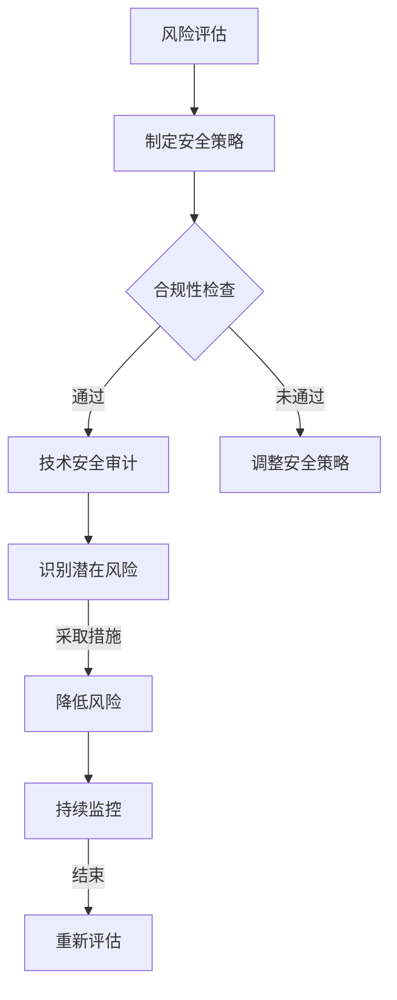

                 

### 文章标题

《创业公司的技术安全审计实践》

### 关键词

创业公司、技术安全、审计实践、安全策略、风险评估、合规性检查

### 摘要

本文将深入探讨创业公司在技术安全审计方面的实践。我们将分析技术安全审计的重要性，以及如何构建有效的安全审计框架。文章将涵盖核心概念、算法原理、具体操作步骤、数学模型以及实际应用场景。此外，还将推荐相关工具和资源，总结未来发展趋势与挑战，并提供常见问题解答与扩展阅读。

## 1. 背景介绍

在当今数字化时代，创业公司的技术安全审计变得尤为重要。随着互联网的普及和大数据技术的发展，创业公司的数据资产越来越庞大，同时面临的网络安全威胁也日益增加。技术安全审计作为一种系统化的评估方法，可以帮助创业公司识别潜在的安全风险，确保其技术基础设施的安全性和合规性。

技术安全审计的目的是评估创业公司的信息系统是否符合安全标准和法规要求，确保系统的安全性、完整性和可用性。通过技术安全审计，创业公司可以：

1. 识别和评估安全风险，采取相应的安全措施。
2. 提高内部安全意识，加强安全管理。
3. 确保符合相关法律法规和行业规范。
4. 优化技术架构，提高系统性能和稳定性。

## 2. 核心概念与联系

在探讨技术安全审计之前，我们首先需要了解一些核心概念。以下是几个关键概念及其相互关系：

### 2.1 安全策略

安全策略是创业公司制定的一系列安全目标和措施，旨在保护公司信息资产的安全。安全策略包括：

- **安全目标**：明确创业公司需要达到的安全级别和标准。
- **安全措施**：为实现安全目标所采取的具体措施，如访问控制、加密、入侵检测等。

### 2.2 风险评估

风险评估是技术安全审计的基础。通过评估创业公司的信息资产和潜在威胁，可以确定风险等级，为制定安全策略提供依据。

- **信息资产**：创业公司的重要数据和信息。
- **潜在威胁**：可能对信息资产造成损害的因素，如恶意软件、网络攻击、内部威胁等。
- **风险等级**：根据威胁的可能性及其影响程度，对风险进行分类。

### 2.3 合规性检查

合规性检查是确保创业公司的信息系统符合相关法律法规和行业规范的过程。常见的合规性要求包括：

- **数据保护法规**：如《通用数据保护条例》（GDPR）和《网络安全法》。
- **行业规范**：如金融行业的《信息安全技术规范》和医疗行业的《健康数据保护规范》。

### 2.4 Mermaid 流程图

以下是一个简化的技术安全审计流程的 Mermaid 流程图：



## 3. 核心算法原理 & 具体操作步骤

### 3.1 风险评估算法原理

风险评估算法通常基于以下原则：

- **信息资产价值**：根据信息资产的重要性进行评分。
- **威胁可能性**：评估潜在威胁发生的可能性。
- **影响程度**：分析威胁发生后的影响。

常用的风险评估算法包括：

- **定量风险评估**：使用数学模型对风险进行量化分析。
- **定性风险评估**：通过专家意见和主观判断评估风险。

### 3.2 安全策略制定步骤

制定安全策略的具体步骤如下：

1. **确定安全目标**：根据风险评估结果，制定明确的安全目标。
2. **制定安全措施**：为实现安全目标，制定相应的安全措施。
3. **分配资源**：为安全措施分配必要的资源，如人力、资金和技术支持。
4. **定期评审**：定期评审安全策略的有效性，根据实际情况进行调整。

### 3.3 合规性检查步骤

合规性检查的具体步骤如下：

1. **了解法规要求**：研究相关法律法规和行业规范，了解合规性要求。
2. **自评估**：根据法规要求和行业规范，对公司的信息系统进行自评估。
3. **审计**：邀请外部专业审计机构对公司的信息系统进行审计。
4. **整改**：根据审计结果，对不符合法规要求的部分进行整改。

## 4. 数学模型和公式 & 详细讲解 & 举例说明

### 4.1 定量风险评估公式

定量风险评估公式如下：

$$
R = V \times P \times I
$$

- \( R \)：风险值
- \( V \)：信息资产价值
- \( P \)：威胁可能性
- \( I \)：影响程度

举例说明：

假设一个创业公司的客户数据信息资产价值为100万元，威胁可能性为0.5，影响程度为0.8，则该信息资产的风险值为：

$$
R = 100 \times 0.5 \times 0.8 = 40
$$

风险值为40，表示该信息资产存在中等风险。

### 4.2 定性风险评估模型

定性风险评估模型可以使用以下方法：

1. **矩阵评估法**：将信息资产、威胁可能性和影响程度分别评估为1到5的等级，然后计算风险得分。

   | 信息资产 | 威胁可能性 | 影响程度 | 风险得分 |
   | :------: | :--------: | :------: | :-----: |
   |    1     |     1      |    1     |   1     |
   |    2     |     2      |    2     |   4     |
   |    3     |     3      |    3     |   9     |
   |    4     |     4      |    4     |  16     |
   |    5     |     5      |    5     |  25     |

2. **专家评估法**：邀请专家根据经验评估信息资产、威胁可能性和影响程度的等级，然后计算风险得分。

   - **低风险**：1-2分
   - **中风险**：3-5分
   - **高风险**：6-10分

## 5. 项目实战：代码实际案例和详细解释说明

### 5.1 开发环境搭建

为了演示技术安全审计的实战，我们将使用 Python 语言编写一个简单的风险评估工具。以下是开发环境搭建的步骤：

1. 安装 Python 3.7 或更高版本。
2. 安装必要的库，如 numpy 和 pandas。

```shell
pip install numpy pandas
```

### 5.2 源代码详细实现和代码解读

以下是风险评估工具的源代码：

```python
import numpy as np
import pandas as pd

# 信息资产、威胁可能性和影响程度的评分
INFO_ASSET_SCORES = {'低': 1, '中': 2, '高': 3}
THREAT_POSSIBILITY_SCORES = {'极低': 1, '低': 2, '中': 3, '高': 4, '极高': 5}
IMPACT_SCORES = {'可接受': 1, '中等': 2, '高': 3, '极高': 4, '灾难性': 5}

# 风险评估函数
def risk_assessment(asset_value, threat_possibility, impact):
    v = INFO_ASSET_SCORES[asset_value]
    p = THREAT_POSSIBILITY_SCORES[threat_possibility]
    i = IMPACT_SCORES[impact]
    r = v * p * i
    return r

# 主函数
def main():
    assets = [
        {'name': '客户数据', 'value': '高'},
        {'name': '财务数据', 'value': '中'},
        {'name': '员工数据', 'value': '低'}
    ]
    
    threats = [
        {'name': '恶意软件攻击', 'possibility': '高'},
        {'name': '数据泄露', 'possibility': '中'},
        {'name': '内部威胁', 'possibility': '低'}
    ]
    
    impacts = [
        {'name': '客户数据泄露', 'impact': '灾难性'},
        {'name': '财务数据泄露', 'impact': '高'},
        {'name': '员工数据泄露', 'impact': '中'}
    ]
    
    results = []
    for asset, threat, impact in zip(assets, threats, impacts):
        r = risk_assessment(asset['value'], threat['possibility'], impact['impact'])
        results.append({'name': asset['name'], 'risk': r})
    
    df = pd.DataFrame(results)
    print(df)

if __name__ == '__main__':
    main()
```

该代码首先定义了信息资产、威胁可能性和影响程度的评分字典，然后实现了一个风险评估函数。主函数中，我们创建了一个包含资产、威胁和影响的列表，并调用风险评估函数计算每个资产的风险值。最后，将结果保存为 DataFrame 对象并打印输出。

### 5.3 代码解读与分析

1. **导入库**：我们首先导入了 numpy 和 pandas 库，用于数据处理和分析。
2. **定义评分字典**：定义了信息资产、威胁可能性和影响程度的评分字典，用于将主观评估转换为数值。
3. **风险评估函数**：实现了风险评估函数，根据评分字典计算风险值。
4. **主函数**：在主函数中，创建了一个包含资产、威胁和影响的列表，并调用风险评估函数计算每个资产的风险值。最后，将结果保存为 DataFrame 对象并打印输出。

该代码实现了对创业公司信息资产的风险评估，可以帮助公司识别和评估潜在风险，为制定安全策略提供依据。

## 6. 实际应用场景

### 6.1 小型创业公司的技术安全审计

对于小型创业公司，技术安全审计通常面临以下挑战：

- **资源有限**：小型公司可能无法投入大量资金和人力资源进行安全审计。
- **人员不足**：安全团队可能只有一名或两名成员，难以进行全面的安全审计。
- **时间紧迫**：创业公司通常需要快速迭代产品，安全审计可能会占用大量时间。

### 6.2 大型创业公司的技术安全审计

对于大型创业公司，技术安全审计通常面临以下挑战：

- **复杂性高**：大型公司拥有庞大的技术架构和数据资产，审计过程更加复杂。
- **合规要求多**：大型公司需要遵守更多的法律法规和行业规范，审计工作量大。
- **安全隐患多**：大型公司的安全漏洞可能更多，需要更深入的安全审计。

### 6.3 案例分析

**案例一**：某小型创业公司由于缺乏安全审计，在一次网络攻击中损失了大量客户数据，导致公司声誉受损，客户流失。

**案例二**：某大型创业公司在进行技术安全审计时，发现其财务系统存在漏洞，及时采取了修复措施，避免了潜在的财务损失。

## 7. 工具和资源推荐

### 7.1 学习资源推荐

- **书籍**：
  - 《网络安全审计：实践与原理》
  - 《技术风险管理与控制》
  - 《网络安全：设计原则与应用》

- **论文**：
  - “Risk Assessment and Management in Information Security”
  - “A Comprehensive Risk Assessment Model for IT Security”

- **博客**：
  - 安全客（www.anquanke.com）
  - FreeBuf（www.freebuf.com）

- **网站**：
  - OWASP（https://owasp.org/）
  - 国家网络安全漏洞库（http://www.cnvd.org.cn/）

### 7.2 开发工具框架推荐

- **开源安全工具**：
  - OWASP ZAP（https://github.com/zaproxy/zaproxy）
  - Security Shepherd（https://github.com/owasp/security-shepherd）

- **安全审计工具**：
  - OpenVAS（https://www.openvas.org/）
  - Qualys FreeScan（https://www.qualys.com/qualys-free-trial）

- **合规性检查工具**：
  - Chef Compliance（https://chef.io/chef-compliance/）
  - Qualys Policy Compliance（https://www.qualys.com/pc/）

### 7.3 相关论文著作推荐

- **论文**：
  - “A Risk Management Model for Information Security”
  - “Risk Assessment and Management in IT Security: A Comprehensive Literature Review”

- **著作**：
  - 《信息安全风险管理》
  - 《技术安全审计：理论与实践》

## 8. 总结：未来发展趋势与挑战

随着数字化转型的不断推进，创业公司的技术安全审计面临以下发展趋势与挑战：

- **云计算和大数据的普及**：创业公司越来越依赖于云计算和大数据技术，需要确保其数据的安全性和合规性。
- **人工智能的应用**：人工智能技术在安全审计中的应用日益广泛，但同时也带来了新的安全风险。
- **法规和标准的变化**：随着全球范围内法规和标准的变化，创业公司需要不断更新安全策略，以应对新的合规要求。
- **安全意识的提升**：创业公司需要提高内部员工的安全意识，加强安全管理，降低人为错误导致的安全风险。

## 9. 附录：常见问题与解答

### 9.1 问题一：什么是技术安全审计？

技术安全审计是一种系统化的评估方法，用于评估创业公司的信息系统是否符合安全标准和法规要求，确保系统的安全性、完整性和可用性。

### 9.2 问题二：技术安全审计的重要性是什么？

技术安全审计可以帮助创业公司：

1. 识别和评估安全风险，采取相应的安全措施。
2. 提高内部安全意识，加强安全管理。
3. 确保符合相关法律法规和行业规范。
4. 优化技术架构，提高系统性能和稳定性。

### 9.3 问题三：如何进行技术安全审计？

进行技术安全审计的步骤包括：

1. **风险评估**：评估公司的信息资产和潜在威胁，确定风险等级。
2. **制定安全策略**：根据风险评估结果，制定明确的安全目标和安全措施。
3. **合规性检查**：确保公司的信息系统符合相关法律法规和行业规范。
4. **技术审计**：对公司的信息系统进行全面的安全审计，识别潜在的安全漏洞。
5. **整改和持续监控**：根据审计结果，对不符合要求的部分进行整改，并持续监控系统的安全性。

## 10. 扩展阅读 & 参考资料

- 《网络安全审计：实践与原理》
- 《技术风险管理与控制》
- 《网络安全：设计原则与应用》
- “Risk Assessment and Management in Information Security”
- “A Comprehensive Risk Assessment Model for IT Security”
- OWASP（https://owasp.org/）
- 国家网络安全漏洞库（http://www.cnvd.org.cn/）
- 《信息安全风险管理》
- 《技术安全审计：理论与实践》

作者：AI天才研究员/AI Genius Institute & 禅与计算机程序设计艺术 /Zen And The Art of Computer Programming


