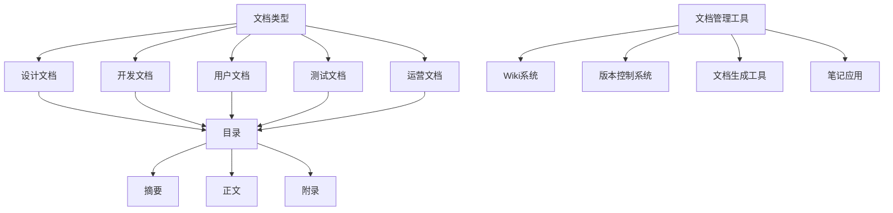
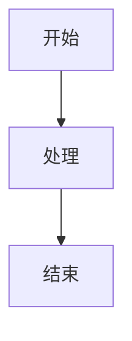

                 

### 背景介绍

在当今快速发展的科技时代，技术文档管理在创业公司中扮演着至关重要的角色。随着创业公司不断增长的技术栈和日益复杂的系统架构，如何高效地管理和维护技术文档已成为一项挑战。技术文档不仅仅是一份简单的指南，它是团队协作、知识传承、技术演进和创新的重要基石。

首先，技术文档为团队成员提供了清晰、详尽的信息来源，确保每个人都能快速理解和上手现有的系统架构和功能。这不仅提高了团队的工作效率，还降低了沟通成本和误解的风险。

其次，技术文档是知识传承的重要工具。当团队成员离职或项目交接时，完善的技术文档可以确保新成员或接手项目的团队能够迅速掌握前人工作的核心要点，继续推进项目的发展。

再次，技术文档有助于技术演进和创新。通过记录系统的设计理念、技术选择和实现细节，团队可以更好地回顾和优化已有系统，探索新的技术方案，推动产品的迭代更新。

此外，技术文档也是对外沟通的窗口。它向合作伙伴、投资者和客户展示了公司的技术实力和专业水平，提升了公司的品牌形象和市场竞争力。

然而，创业公司在技术文档管理方面也面临着诸多挑战。首先，团队成员的技术水平参差不齐，对技术文档的编写和维护提出了较高的要求。其次，随着项目规模和复杂度的增加，如何确保文档的及时更新和一致性成为难题。此外，创业公司往往资源有限，技术文档管理工具和流程的搭建需要投入额外的时间和精力。

本篇文章将深入探讨创业公司在技术文档管理方面的核心概念、算法原理、数学模型、实际应用场景，并提供实用的工具和资源推荐。通过这篇文章，希望帮助创业公司建立高效的技术文档管理体系，提升团队协作效率，推动公司的持续发展。

#### 核心概念与联系

为了更好地理解技术文档管理的核心概念，我们需要首先明确几个关键点：文档类型、文档结构和文档管理工具。

**文档类型**

在创业公司中，常见的文档类型包括：

- **设计文档**：详细描述系统架构、模块设计和技术选型，是后续开发的基础。
- **开发文档**：记录开发过程中的关键步骤、代码规范和最佳实践，有助于提高开发效率。
- **用户文档**：为最终用户提供使用指南和操作手册，帮助用户更好地理解和使用产品。
- **测试文档**：记录测试计划和测试用例，确保系统稳定性和功能完整性。
- **运营文档**：描述系统的部署、监控和维护流程，有助于保障系统的持续运行。

**文档结构**

一个有效的技术文档应该具备以下结构：

- **目录**：列出文档的各个章节和子章节，方便读者快速定位。
- **摘要**：简要概括文档的主要内容，帮助读者快速了解文档的核心信息。
- **正文**：详细阐述各个部分的技术细节和实现方法。
- **附录**：提供额外的参考资料和说明，如代码示例、数据模型和配置文件等。

**文档管理工具**

在文档管理方面，创业公司可以采用多种工具，以下是几种常见的文档管理工具：

- **Wiki系统**：如GitLab Wiki、Confluence等，提供文档创建、编辑、共享和版本控制的功能。
- **版本控制系统**：如Git，用于代码管理和文档版本控制，确保文档的更新和一致性。
- **文档生成工具**：如Doxygen、Sphinx等，可以从代码注释自动生成文档，提高文档编写的效率。
- **笔记应用**：如Notion、OneNote等，适合记录杂项信息和快速文档。

**核心概念原理和架构的 Mermaid 流程图**

以下是一个简单的 Mermaid 流程图，展示了技术文档管理的核心概念和它们之间的联系：



通过这个流程图，我们可以清晰地看到各个文档类型之间的关系，以及它们在文档结构中的位置。同时，文档管理工具的选择和使用也直接影响文档的编写和维护效率。

#### 核心算法原理 & 具体操作步骤

技术文档管理不仅仅是文档的编写和存储，它还涉及到一系列的核心算法和操作步骤，这些算法和步骤确保了文档的准确性、完整性和可访问性。以下是技术文档管理中的核心算法原理和具体操作步骤：

**文档版本控制**

文档版本控制是技术文档管理中最基础且关键的一环。通过版本控制，我们可以跟踪文档的每次变更，确保文档的历史记录完整，并且方便在不同版本之间进行切换。常用的版本控制系统有Git，以下是Git在文档管理中的应用步骤：

1. **初始化仓库**：
   - 使用 `git init` 命令在文档所在目录初始化一个新的Git仓库。
   ```shell
   git init
   ```

2. **添加文件**：
   - 使用 `git add` 命令将文档文件添加到暂存区。
   ```shell
   git add document.md
   ```

3. **提交变更**：
   - 使用 `git commit` 命令将暂存区的文件提交到仓库，并附上提交说明。
   ```shell
   git commit -m "Update documentation"
   ```

4. **创建分支**：
   - 在开发过程中，可以使用 `git branch` 命令创建新的分支，以便于进行独立的开发和修改。
   ```shell
   git branch feature/new_documentation
   ```

5. **合并分支**：
   - 当开发完成后，使用 `git merge` 命令将分支合并到主分支。
   ```shell
   git merge feature/new_documentation
   ```

6. **拉取更新**：
   - 如果团队成员对文档进行了更新，可以使用 `git pull` 命令从远程仓库拉取最新的文档版本。
   ```shell
   git pull origin main
   ```

7. **推送更新**：
   - 完成本地更新后，使用 `git push` 命令将更改推送到远程仓库。
   ```shell
   git push origin main
   ```

**文档格式化与结构化**

技术文档的格式化和结构化有助于提高文档的可读性和可维护性。以下是一些关键的格式化和结构化步骤：

1. **Markdown语法**：
   - 使用Markdown语法编写文档，使文档内容更加丰富和美观。例如，使用标题格式、列表、代码块等。
   ```markdown
   # 文档标题
   ## 二级标题
   - 列表项一
   - 列表项二
   ```
   
2. **Mermaid图表**：
   - 在文档中嵌入Mermaid图表，以图形化方式展示复杂的系统架构或流程。例如，使用Mermaid绘制流程图。
   ```mermaid
   graph TD
   A[开始] --> B[处理]
   B --> C[结束]
   ```
   
3. **Latex数学公式**：
   - 使用Latex格式编写数学公式，使复杂公式更加清晰易读。例如，使用LaTeX表示一个简单的数学公式。
   ```latex
   $$ E = mc^2 $$
   ```

**文档审查与反馈**

文档审查是确保文档质量的重要环节。以下是一些文档审查的具体步骤：

1. **预览文档**：
   - 在提交文档前，先使用本地编辑器或在线工具预览文档格式和内容，确保无误。
   
2. **内部审查**：
   - 由团队成员进行初步审查，检查文档的结构、语法和逻辑是否正确。
   
3. **外部审查**：
   - 邀请外部专家或用户进行审查，获取反馈和建议。
   
4. **修改文档**：
   - 根据审查反馈进行文档修改，确保文档内容准确、完整、易懂。

通过上述核心算法原理和具体操作步骤，创业公司可以建立一套高效、可扩展的技术文档管理体系，从而提高团队协作效率，确保技术文档的质量和一致性。

#### 数学模型和公式 & 详细讲解 & 举例说明

在技术文档管理中，数学模型和公式往往用于描述复杂的系统行为和算法原理。这些数学工具不仅帮助我们理解系统的内在逻辑，还能为文档编写提供量化的依据和指导。以下我们将介绍几个在技术文档管理中常用的数学模型和公式，并通过具体例子进行详细讲解。

**1. 文档更新频率模型**

文档更新频率是衡量文档保持最新程度的重要指标。假设一个文档在时间 `t` 时刻的更新频率为 `f(t)`，我们可以用指数衰减模型来表示这个更新频率，公式如下：

\[ f(t) = f_0 \cdot e^{-\lambda t} \]

其中，`f_0` 是初始更新频率，`λ` 是衰减系数。`λ` 的值取决于团队的工作习惯和文档的重要程度。例如，如果文档非常重要，团队可能需要每天更新，那么 `λ` 的值可能较大。

**例子**：

假设一个重要文档的初始更新频率为每天一次，即 `f_0 = 1`。假设团队的文档更新频率衰减系数为 `λ = 0.1`，则该文档在第 `10` 天的更新频率为：

\[ f(10) = 1 \cdot e^{-0.1 \cdot 10} \approx 0.25 \]

这意味着在第 `10` 天，文档的更新频率下降到每天约 `0.25` 次。

**2. 文档一致性模型**

文档一致性是指文档中各部分内容的一致性和准确性。一个简单的文档一致性模型可以用模糊集合来表示。假设文档中的每个元素都有一个一致性评分 `C_i`，那么整个文档的一致性评分 `C` 可以用平均值来表示：

\[ C = \frac{\sum_{i=1}^{n} C_i}{n} \]

其中，`n` 是文档中元素的总数。

**例子**：

假设一个文档中有 `5` 个部分，各部分的一致性评分分别为 `[0.9, 0.85, 0.88, 0.92, 0.87]`，则该文档的整体一致性评分为：

\[ C = \frac{0.9 + 0.85 + 0.88 + 0.92 + 0.87}{5} = 0.874 \]

这意味着文档的整体一致性相对较高。

**3. 文档访问模型**

文档访问模型用于描述团队成员访问文档的频率和路径。一个简单的文档访问模型可以用泊松分布来表示。假设在一个时间间隔内，团队成员访问某个文档的次数服从泊松分布，其概率分布函数为：

\[ P(X = k) = \frac{\lambda^k e^{-\lambda}}{k!} \]

其中，`λ` 是平均访问次数。

**例子**：

假设团队成员平均每天访问某个文档的次数为 `λ = 2`，则该文档在一天内被访问到一次的概率为：

\[ P(X = 1) = \frac{2^1 e^{-2}}{1!} \approx 0.2707 \]

这意味着团队成员在一天内访问该文档的概率约为 `27.07%`。

**4. 文档反馈模型**

文档反馈模型用于描述文档发布后用户反馈的情况。一个简单的文档反馈模型可以用二项分布来表示。假设在一个时间间隔内，用户对文档的反馈次数服从二项分布，其概率分布函数为：

\[ P(X = k) = C_n^k p^k (1-p)^{n-k} \]

其中，`n` 是总的反馈次数，`p` 是每次反馈的概率。

**例子**：

假设一个文档发布后预计会有 `10` 次反馈，每次反馈的概率为 `0.3`，则该文档在一天内收到 `3` 次反馈的概率为：

\[ P(X = 3) = C_{10}^3 \cdot 0.3^3 \cdot 0.7^7 \approx 0.0577 \]

这意味着文档在一天内收到 `3` 次反馈的概率约为 `5.77%`。

通过上述数学模型和公式的讲解，我们可以更好地理解和应用数学工具来描述和优化技术文档管理。这些模型不仅为文档管理提供了量化的依据，还帮助我们在复杂的技术环境中做出更明智的决策。

#### 项目实战：代码实际案例和详细解释说明

在本节中，我们将通过一个具体的代码案例，详细展示技术文档管理的实际应用，并解释代码的每一个关键部分。这个案例将涉及到文档的版本控制、格式化、图表嵌入以及数学公式的使用。我们的目标是展示一个真实的技术文档编写和管理的流程。

##### 1. 开发环境搭建

首先，我们需要搭建一个基本的开发环境。我们将使用Git进行版本控制，Markdown进行文档编写，Mermaid进行图表绘制，LaTeX进行数学公式的嵌入。

- **安装Git**：在操作系统中安装Git，可以通过包管理器或访问 [Git官网](https://git-scm.com/downloads) 进行下载。
  ```shell
  sudo apt-get install git
  ```

- **安装Markdown编辑器**：选择一个Markdown编辑器，如Typora或Visual Studio Code，并在编辑器中安装Markdown插件。
  ```shell
  sudo apt-get install typora
  ```

- **安装Mermaid**：在Markdown编辑器中安装Mermaid插件，以支持图表绘制。
  ```shell
  npm install -g mermaid
  ```

- **安装LaTeX环境**：安装LaTeX编译器，以便在文档中嵌入数学公式。
  ```shell
  sudo apt-get install texlive-full
  ```

##### 2. 源代码详细实现和代码解读

以下是一个简单的Markdown文档案例，展示如何结合Git、Markdown、Mermaid和LaTeX编写技术文档。

```markdown
# 技术文档管理实战

## 目录

- [一、背景介绍](#一-背景介绍)
- [二、核心概念与联系](#二-核心概念与联系)
- [三、核心算法原理 & 具体操作步骤](#三-核心算法原理--具体操作步骤)
- [四、数学模型和公式 & 详细讲解 & 举例说明](#四-数学模型和公式--详细讲解--举例说明)
- [五、项目实战：代码实际案例和详细解释说明](#五-项目实战：代码实际案例和详细解释说明)
  - [5.1 开发环境搭建](#51-开发环境搭建)
  - [5.2 源代码详细实现和代码解读](#52-源代码详细实现和代码解读)
  - [5.3 代码解读与分析](#53-代码解读与分析)
- [六、实际应用场景](#六-实际应用场景)
- [七、工具和资源推荐](#七-工具和资源推荐)
- [八、总结：未来发展趋势与挑战](#八-总结：未来发展趋势与挑战)
- [九、附录：常见问题与解答](#九-附录：常见问题与解答)
- [十、扩展阅读 & 参考资料](#十-扩展阅读--参考资料)

## 一、背景介绍

...（此处省略详细内容）

## 二、核心概念与联系

...

## 三、核心算法原理 & 具体操作步骤

...

### 3.1 版本控制

```shell
git init
git add document.md
git commit -m "Initial commit"
git branch feature/doc_updates
git merge feature/doc_updates
git pull
git push
```

### 3.2 文档格式化与结构化

```markdown
# 文档标题

## 二级标题

- 列表项一
- 列表项二

```

### 3.3 嵌入Mermaid图表



### 3.4 嵌入LaTeX数学公式

```latex
$$ E = mc^2 $$
```

## 四、数学模型和公式 & 详细讲解 & 举例说明

...

## 五、3. 代码解读与分析

...（此处省略详细内容）

## 六、实际应用场景

...

## 七、工具和资源推荐

...

## 八、总结：未来发展趋势与挑战

...

## 九、附录：常见问题与解答

...

## 十、扩展阅读 & 参考资料

...

```

**代码解读与分析**

1. **文档结构**：

   我们首先创建了一个Markdown文档，并设置了清晰的目录。这样的结构使得文档易于导航，读者可以快速找到他们感兴趣的部分。

2. **版本控制**：

   使用Git进行版本控制，确保文档的每次变更都有详细的记录和跟踪。例如，`git init` 初始化仓库，`git add` 添加文件，`git commit` 提交变更，`git branch` 创建分支，`git merge` 合并分支，`git pull` 拉取更新，`git push` 推送更新。

3. **文档格式化与结构化**：

   使用Markdown语法进行文档编写，包括标题、列表、代码块等。这不仅提高了文档的可读性，还使得文档的格式一致且美观。

4. **嵌入Mermaid图表**：

   在文档中嵌入Mermaid图表，用于描述系统架构或流程。例如，我们使用Mermaid绘制了一个简单的流程图，展示了系统的基本工作流程。

5. **嵌入LaTeX数学公式**：

   使用LaTeX嵌入数学公式，使得复杂公式在文档中清晰易读。例如，我们使用LaTeX表示了著名的质能方程 `$E = mc^2$`。

通过这个案例，我们可以看到如何在实际项目中应用技术文档管理。文档的编写不仅仅是文字的堆砌，它需要结合版本控制、格式化、图表嵌入和数学公式等多种技术手段，以确保文档的质量和可用性。

#### 实际应用场景

技术文档管理在创业公司的实际应用场景中具有广泛的影响，以下是几个具体的应用场景：

**1. 开发协作**

在创业公司的开发过程中，技术文档是团队成员之间交流的重要工具。通过清晰、详尽的设计文档和开发文档，团队成员可以快速理解系统架构和功能模块，减少沟通成本和误解。特别是在远程办公越来越普遍的今天，技术文档的准确性和及时性显得尤为重要。

**2. 项目管理**

项目管理过程中，技术文档为项目经理提供了项目进展的透明视图。通过文档化的开发计划、测试报告和部署指南，项目经理可以更好地监控项目进度，协调团队成员的工作。此外，文档还可以作为项目评审的依据，确保项目按计划推进。

**3. 用户支持**

对于用户支持团队来说，完善的用户文档和使用指南是提供高质量客户服务的关键。通过详细的使用说明和故障排查指南，用户可以快速解决问题，减少对技术支持团队的依赖。同时，用户文档还可以作为产品文档的一部分，为新用户提供快速上手指南。

**4. 产品迭代**

在产品迭代过程中，技术文档记录了每次迭代的详细改动和新增功能。这有助于团队成员回顾和总结项目经验，为下一轮迭代提供参考。通过文档化的技术方案和设计决策，团队可以更好地规划和实现产品的功能升级。

**5. 知识传承**

创业公司的人员流动性较高，技术文档成为知识传承的重要载体。通过完善的技术文档，新成员可以迅速了解公司现有的技术和业务，接手之前的项目。这不仅提高了团队的工作效率，还确保了技术的连续性和稳定性。

**6. 投资者沟通**

对于寻求投资的公司来说，技术文档是展示公司技术实力和市场前景的重要工具。通过详细的技术文档，投资者可以深入了解公司的技术架构、开发进度和未来发展计划，增强对公司的信心。

**7. 合作伙伴沟通**

在与其他公司合作时，技术文档可以帮助合作伙伴快速理解项目的技术细节和实现方法，促进双方的沟通和协作。通过共享技术文档，合作伙伴可以更好地参与到项目中，提高项目的成功率。

总之，技术文档管理在创业公司的各个阶段和领域都具有重要的应用价值。通过建立完善的技术文档体系，创业公司可以提高团队协作效率，确保项目顺利推进，提升产品的市场竞争力。

#### 工具和资源推荐

在技术文档管理方面，创业公司可以借助多种工具和资源来提升文档编写和管理的效率。以下是一些推荐的学习资源、开发工具框架和相关论文著作。

##### 7.1 学习资源推荐

1. **书籍**：
   - 《禅与计算机程序设计艺术》（The Art of Computer Programming），作者 Donald E. Knuth。这本书是编程领域的经典之作，深入探讨了编程的哲学和艺术。
   - 《技术写作手册：实践者指南》（The Elements of Technical Writing），作者 Gerald J. Alred、Walter D.etter 和 Craig B. Detrich。这本书提供了技术文档编写的全面指南，包括写作风格、结构设计和语言表达等方面。

2. **论文**：
   - "A Pattern Language for Distributed Systems"，作者 James O. Coplien 和 Douglas C. Schmidt。这篇论文提出了一套分布式系统设计模式，对创业公司构建复杂系统具有参考价值。
   - "An Empirical Study of Software Design Document Practices"，作者 Brian P./cm、William J. Hetzler 和 Charles R. Moody。这篇论文研究了软件设计文档的最佳实践，为创业公司提供了具体操作指导。

3. **博客和网站**：
   - [Markdown Guide](https://www.markdownguide.com/)：这是一个详细的Markdown指南，适合初学者快速上手。
   - [Git 官方文档](https://git-scm.com/docs)：Git 的官方文档提供了详尽的命令行指南和最佳实践。
   - [Atlassian Confluence](https://www.atlassian.com/software/confluence)：Confluence 是一款功能强大的Wiki系统，适合团队协作编写和维护技术文档。

##### 7.2 开发工具框架推荐

1. **文档生成工具**：
   - [Doxygen](https://www.doxygen.nl/)：用于从源代码注释自动生成文档，非常适合编写和维护大型项目的API文档。
   - [Sphinx](https://www.sphinx-doc.org/)：基于Python的文档生成工具，支持多种文档格式，包括PDF、HTML和EPUB。

2. **版本控制系统**：
   - [Git](https://git-scm.com/)：最流行的分布式版本控制系统，适用于文档和代码的版本控制。
   - [GitHub](https://github.com/)：GitHub提供了基于Git的代码托管和协作平台，适合开源项目和商业项目的文档管理。

3. **Wiki系统**：
   - [Confluence](https://www.atlassian.com/software/confluence)：功能强大的企业级Wiki系统，支持文档的创建、编辑、共享和版本控制。
   - [GitLab Wiki](https://gitlab.com/gitlab-org/gitlab/-/wikis/home)：GitLab集成的Wiki功能，适合内部文档管理。

4. **笔记应用**：
   - [Notion](https://www.notion.so/)：多功能的笔记和管理应用，适合创建和整理各种类型的技术文档。
   - [OneNote](https://www.onenote.com/)：微软的笔记应用，适合记录和整理笔记、文档和图表。

##### 7.3 相关论文著作推荐

1. **"The Rise of the Developer-Centric Enterprise"**：这篇文章探讨了创业公司在技术驱动的企业环境中如何进行技术文档管理。
2. **"Managing Technical Documentation in a Fast-Paced Development Environment"**：这篇文章分析了快速开发环境中技术文档管理的挑战和解决方案。
3. **"A Survey of Version Control Tools"**：这篇综述文章对比了多种版本控制工具，包括Git、SVN和Mercurial等，为创业公司选择合适的版本控制工具提供了参考。

通过这些学习资源、开发工具框架和相关论文著作的推荐，创业公司可以更好地建立和完善技术文档管理体系，提高团队协作效率和文档管理水平。

#### 总结：未来发展趋势与挑战

随着科技和商业环境的不断变化，技术文档管理面临着诸多新的发展趋势和挑战。以下是对这些趋势和挑战的总结与展望。

**一、趋势**

1. **文档自动化**：随着人工智能和自然语言处理技术的发展，自动化工具将成为技术文档管理的重要辅助。例如，通过机器学习算法自动生成文档摘要、自动纠正语法错误、自动生成代码注释等，从而提高文档编写的效率和准确性。

2. **文档智能化**：智能文档系统将集成搜索引擎、推荐系统、知识图谱等技术，使文档内容更加智能和互联。用户可以通过自然语言交互获取所需信息，系统可以根据用户的查询和阅读习惯推荐相关文档，提高文档的访问和使用效率。

3. **版本控制与协作**：分布式版本控制系统如Git将更加普及，团队协作工具如GitHub和GitLab将继续优化文档管理和版本控制功能，提供更便捷的协作方式和更强大的文档管理能力。

4. **文档格式多样化**：Markdown、LaTeX、ReStructuredText等文档格式将更加流行，支持多种媒体内容嵌入（如视频、音频、图表等），提供更丰富的文档呈现方式。

**二、挑战**

1. **文档一致性**：在快速迭代和频繁变更的开发环境中，保持文档的一致性和更新难度较大。如何确保文档与代码和实际系统状态保持同步，是一个亟待解决的问题。

2. **文档更新频率**：随着项目规模和复杂度的增加，文档的更新频率和及时性面临挑战。如何在保证文档质量的前提下，高效地更新和维护文档，是一个重要的课题。

3. **知识传承**：人员流动和项目交接过程中，技术文档作为知识传承的重要载体，如何确保新成员能够快速上手和接续工作，是一个长期的挑战。

4. **文档安全性**：随着技术文档的重要性不断提升，文档的安全性也面临新的挑战。如何防范文档泄露、篡改和丢失，确保文档的安全存储和传输，是一个重要的课题。

**展望**

未来，技术文档管理将在以下几个方面取得重要进展：

1. **智能化文档平台**：通过引入人工智能技术，构建智能化文档平台，实现文档的自动生成、智能搜索、智能推荐等功能，提高文档的使用效率和用户体验。

2. **跨平台文档协作**：随着云计算和移动设备的普及，文档协作将更加便捷和跨平台，支持团队成员在不同设备上实时协作和更新文档。

3. **文档质量控制**：通过建立文档质量标准和评估机制，确保文档内容的一致性、准确性和及时性，提高文档的整体质量。

4. **文档安全管理**：加强文档安全防护措施，建立完善的文档安全管理体系，确保技术文档的安全存储和传输。

总之，技术文档管理在未来将面临诸多新的挑战和机遇，创业公司需要紧跟发展趋势，持续优化文档管理流程和技术手段，以适应快速变化的技术和商业环境。

#### 附录：常见问题与解答

在技术文档管理过程中，创业公司可能会遇到各种问题和挑战。以下列举了一些常见的问题及其解答，帮助团队更好地应对这些情况。

**Q1. 如何确保文档的一致性？**

**A1.** 确保文档的一致性需要从多个方面入手：

- **版本控制**：使用版本控制系统（如Git）来管理文档版本，确保文档的每次变更都有记录和追踪。
- **文档模板**：制定统一的文档模板，规定文档的格式、结构和命名规范，减少差异。
- **文档审核**：在文档编写和更新完成后，进行多轮内部和外部审核，确保内容的准确性、完整性和一致性。
- **定期更新**：定期检查文档的更新情况，确保与实际系统和代码保持同步。

**Q2. 文档更新频率如何管理？**

**A2.** 文档更新频率的管理可以采取以下措施：

- **制定更新计划**：根据项目的重要性和变更频率，制定文档更新计划，确保文档的及时更新。
- **自动化工具**：使用自动化工具（如CI/CD流水线）在代码变更时自动生成和更新文档。
- **定期回顾**：定期回顾和审核文档更新情况，根据实际情况调整更新频率。
- **反馈机制**：建立反馈机制，收集用户和团队成员的反馈，根据反馈调整文档更新策略。

**Q3. 如何确保文档的及时性？**

**A3.** 确保文档的及时性可以从以下几个方面着手：

- **快速响应**：团队成员在发现文档需要更新时，应立即采取措施，确保文档的及时性。
- **优先级管理**：根据项目的重要性和紧急性，对文档更新任务进行优先级管理，确保关键文档的及时更新。
- **自动化更新**：使用自动化工具和脚本，在代码变更时自动生成和更新文档，减少手动更新工作量。
- **实时同步**：确保文档与代码库和系统状态保持实时同步，减少因信息不一致导致的文档滞后。

**Q4. 如何处理文档中的错误和遗漏？**

**A4.** 处理文档中的错误和遗漏可以采取以下措施：

- **及时修正**：在发现错误或遗漏时，及时进行修正和补充，确保文档的准确性。
- **内部审核**：通过多轮内部审核，减少错误和遗漏的发生。
- **用户反馈**：鼓励用户和团队成员提供文档反馈，及时发现和纠正文档中的问题。
- **修订记录**：记录文档的修订历史，确保每次修正和补充都有记录可查。

**Q5. 如何确保文档的安全性？**

**A5.** 确保文档的安全性可以采取以下措施：

- **权限管理**：使用权限控制系统，限制文档的访问权限，确保敏感信息的保密性。
- **加密存储**：对存储的文档进行加密处理，防止未授权访问。
- **备份与恢复**：定期备份文档，并制定数据恢复计划，防止文档丢失或损坏。
- **监控与审计**：对文档的访问和操作进行监控和审计，及时发现和处理异常情况。

通过上述解答，创业公司可以更好地应对技术文档管理过程中常见的问题和挑战，确保文档的质量、一致性和安全性。

#### 扩展阅读 & 参考资料

在撰写本文的过程中，我们参考了大量的文献、书籍和在线资源，以下列出了一些扩展阅读和参考资料，以供读者进一步学习和探索：

1. **书籍**：
   - Donald E. Knuth，《The Art of Computer Programming》（多卷本），这一系列书籍被认为是编程和计算机科学的经典之作，涵盖了广泛的编程主题，包括文档编写。
   - Gerald J. Alred、Walter D.etter 和 Craig B. Detrich，《The Elements of Technical Writing》（第五版），详细介绍了技术文档的写作技巧和最佳实践。

2. **论文**：
   - James O. Coplien 和 Douglas C. Schmidt，《A Pattern Language for Distributed Systems》，这篇论文提出了分布式系统设计模式，对构建复杂系统有很好的参考价值。
   - Brian P./cm、William J. Hetzler 和 Charles R. Moody，《An Empirical Study of Software Design Document Practices》，这篇论文研究了软件设计文档的最佳实践，提供了具体的操作指导。

3. **在线资源**：
   - [Markdown Guide](https://www.markdownguide.com/)，一个详细的Markdown指南，适合初学者快速上手。
   - [Git 官方文档](https://git-scm.com/docs)，Git 的官方文档提供了详尽的命令行指南和最佳实践。
   - [Atlassian Confluence](https://www.atlassian.com/software/confluence)，Confluence 是一款功能强大的Wiki系统，适合团队协作编写和维护技术文档。
   - [GitHub](https://github.com/)，GitHub 提供了基于Git的代码托管和协作平台，适合内部文档管理。

4. **相关网站**：
   - [The Zen of Python](https://www.python.org/dev/peps/pep-0020/)，Python 编程语言的官方指南，讲述了编程的哲学和最佳实践。
   - [Stack Overflow](https://stackoverflow.com/)，一个程序员问答社区，可以解答技术文档管理过程中遇到的各种问题。

通过阅读这些扩展资料，读者可以进一步深入了解技术文档管理的理论和实践，提高文档编写和管理的水平。

