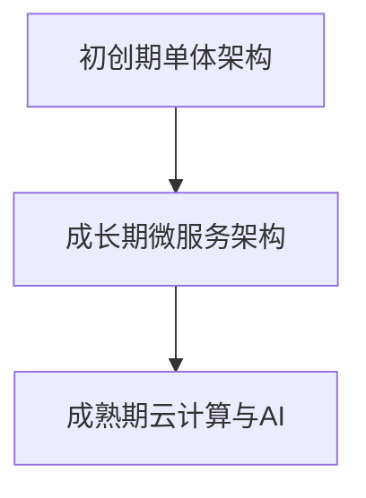

                 

### 文章标题

《创业公司的技术架构演进路线图》

> **关键词**：创业公司、技术架构、演进路线、微服务、云计算、人工智能

> **摘要**：本文旨在探讨创业公司在不同发展阶段的技术架构演进路线，包括从单体架构到微服务架构、从传统基础设施到云计算和人工智能的转型。通过实例和分析，本文为创业公司提供了实用的技术架构演进策略和未来发展趋势。

### 1. 背景介绍

在当今快速变化的市场环境中，创业公司面临着巨大的挑战和机遇。技术架构作为创业公司核心竞争力的重要组成部分，其选择和演进直接影响公司的生存和发展。随着互联网、云计算和人工智能等技术的不断进步，创业公司的技术架构也经历了从传统到现代、从简单到复杂的演变过程。

创业公司的技术架构演进通常伴随着以下几个关键阶段：

1. **初创期**：在此阶段，公司规模较小，业务需求相对简单，通常采用单体架构（Monolithic Architecture）。这种架构简单易用，开发成本较低，但难以应对业务规模扩展和功能迭代。

2. **成长期**：随着业务需求的增加，公司需要提高系统的可扩展性和灵活性。此时，微服务架构（Microservices Architecture）成为了一种常见的选择，它通过将系统拆分为多个独立的服务，提高了系统的可维护性和可扩展性。

3. **成熟期**：在业务规模达到一定规模后，公司需要充分利用云计算和人工智能等新兴技术，实现业务的智能化和自动化。此时，技术架构的演进进入了一个新的阶段，需要面对更多的挑战和机会。

本文将围绕创业公司的技术架构演进路线，探讨不同阶段的架构特点、关键技术和实际案例，为创业公司提供实用的参考和指导。接下来，我们将详细讨论每个阶段的架构演进，并分析其背后的原因和影响。

### 2. 核心概念与联系

#### 2.1 单体架构

单体架构（Monolithic Architecture）是一种传统的软件架构风格，其特点是所有功能模块都紧密地集成在一个单一的、大型的应用程序中。在这种架构中，所有的业务逻辑、数据库访问、用户界面等都在一个应用程序中实现，形成了“大而全”的结构。

#### 2.2 微服务架构

微服务架构（Microservices Architecture）是一种面向服务架构风格，其核心思想是将一个复杂的应用程序拆分为多个独立的、小型、自治的服务。每个服务都有自己的业务逻辑、数据库和用户界面，通过轻量级的通信机制（如REST API）进行交互。

#### 2.3 云计算

云计算（Cloud Computing）是一种通过互联网提供计算资源、存储资源和网络资源的技术。创业公司可以利用云计算平台（如AWS、Azure、阿里云等）提供的弹性和可扩展性，快速搭建和部署应用程序。

#### 2.4 人工智能

人工智能（Artificial Intelligence, AI）是一种模拟人类智能的技术，通过机器学习、深度学习等技术，使计算机能够识别模式、做出决策和自动学习。人工智能技术在创业公司的业务中可以用于推荐系统、智能客服、自动化决策等。

#### 2.5 架构联系

创业公司的技术架构演进是一个多层次、多维度的过程，涉及到多个核心概念和技术的整合。单体架构是创业公司起步阶段的选择，而随着业务的发展，微服务架构提供了更高的灵活性和可扩展性。云计算和人工智能技术的引入，进一步提升了系统的智能化和自动化水平。以下是一个简单的Mermaid流程图，展示了创业公司技术架构的演进过程：



### 3. 核心算法原理 & 具体操作步骤

#### 3.1 单体架构操作步骤

在单体架构中，开发团队通常遵循以下步骤进行操作：

1. **需求分析**：根据业务需求，确定系统的功能模块和数据库设计。
2. **系统设计**：绘制系统架构图，定义各模块的职责和接口。
3. **编码实现**：根据设计文档，逐个实现功能模块。
4. **集成测试**：将所有模块集成到一起，进行功能测试和性能测试。
5. **部署上线**：将系统部署到生产环境，进行实际运行。

#### 3.2 微服务架构操作步骤

在微服务架构中，开发团队需要遵循以下步骤进行操作：

1. **需求分析**：与业务团队紧密合作，确定每个服务的业务功能。
2. **服务拆分**：将单体应用程序拆分为多个独立的微服务。
3. **服务定义**：为每个服务定义REST API接口，明确数据模型和协议。
4. **服务开发**：使用不同的编程语言和框架，独立开发各个微服务。
5. **服务集成**：通过API网关将各个微服务集成在一起，实现统一访问。
6. **持续集成和部署**：使用CI/CD工具，实现自动化测试和部署。

#### 3.3 云计算与人工智能操作步骤

在云计算与人工智能领域，开发团队需要遵循以下步骤：

1. **基础设施搭建**：选择合适的云计算平台，搭建服务器、存储和网络基础设施。
2. **数据准备**：收集和清洗业务数据，为人工智能算法提供训练数据。
3. **模型训练**：使用深度学习框架，如TensorFlow或PyTorch，训练人工智能模型。
4. **模型评估**：通过交叉验证和测试集，评估模型的性能和准确性。
5. **模型部署**：将训练好的模型部署到生产环境，实现实时预测和决策。

### 4. 数学模型和公式 & 详细讲解 & 举例说明

#### 4.1 单体架构的数学模型

在单体架构中，系统的复杂度和性能通常与系统的规模和模块数量呈线性关系。假设系统有N个模块，每个模块的平均处理时间为T，则系统的总处理时间为：

\[ T_{\text{总}} = N \times T \]

#### 4.2 微服务架构的数学模型

在微服务架构中，系统的复杂度和性能与服务的数量和交互频率有关。假设系统有M个服务，每个服务的平均响应时间为R，服务之间的平均通信时间为C，则系统的总响应时间为：

\[ T_{\text{总}} = M \times R + (M-1) \times C \]

#### 4.3 云计算与人工智能的数学模型

在云计算与人工智能领域，系统的性能和效率与计算资源的使用和优化程度密切相关。假设系统有P个计算节点，每个节点的计算能力为F，任务负载为L，则系统的总计算时间为：

\[ T_{\text{总}} = \frac{L}{P \times F} \]

#### 4.4 举例说明

假设一个创业公司从单体架构演进到微服务架构，其系统有10个模块，每个模块的平均处理时间为1分钟。在微服务架构中，系统拆分为5个独立的服务，每个服务的平均响应时间为2分钟，服务之间的平均通信时间为0.5分钟。那么：

- 单体架构的总处理时间：\[ T_{\text{总}} = 10 \times 1 = 10 \text{分钟} \]
- 微服务架构的总响应时间：\[ T_{\text{总}} = 5 \times 2 + (5-1) \times 0.5 = 11 \text{分钟} \]

可以看到，虽然微服务架构的总响应时间略有增加，但其提高了系统的可扩展性和灵活性，有利于业务的长期发展。

### 5. 项目实战：代码实际案例和详细解释说明

#### 5.1 开发环境搭建

为了更好地展示微服务架构的实际应用，我们将在一个简单的电商平台上搭建微服务架构。首先，我们需要准备以下开发环境：

- 开发语言：Java
- 框架：Spring Boot、Spring Cloud
- 版本控制：Git
- 集成开发环境：IntelliJ IDEA
- 容器化工具：Docker
- 服务注册与发现：Eureka
- API网关：Zuul

#### 5.2 源代码详细实现和代码解读

以下是电商平台的微服务架构源代码实现：

**订单服务（OrderService）**

```java
@SpringBootApplication
@EnableDiscoveryClient
public class OrderService {
    public static void main(String[] args) {
        SpringApplication.run(OrderService.class, args);
    }
    
    @Service
    public class OrderService {
        @Autowired
        private OrderRepository orderRepository;
        
        public Order createOrder(Order order) {
            // 创建订单逻辑
            return orderRepository.save(order);
        }
        
        public Order getOrder(Long orderId) {
            // 获取订单逻辑
            return orderRepository.findById(orderId).orElseThrow(() -> new RuntimeException("订单不存在"));
        }
    }
}
```

**商品服务（ProductService）**

```java
@SpringBootApplication
@EnableDiscoveryClient
public class ProductService {
    public static void main(String[] args) {
        SpringApplication.run(ProductService.class, args);
    }
    
    @Service
    public class ProductService {
        @Autowired
        private ProductRepository productRepository;
        
        public Product createProduct(Product product) {
            // 创建商品逻辑
            return productRepository.save(product);
        }
        
        public Product getProduct(Long productId) {
            // 获取商品逻辑
            return productRepository.findById(productId).orElseThrow(() -> new RuntimeException("商品不存在"));
        }
    }
}
```

**订单服务（OrderService）**

```java
@SpringBootApplication
@EnableDiscoveryClient
public class OrderService {
    public static void main(String[] args) {
        SpringApplication.run(OrderService.class, args);
    }
    
    @Service
    public class OrderService {
        @Autowired
        private OrderRepository orderRepository;
        
        public Order createOrder(Order order) {
            // 创建订单逻辑
            return orderRepository.save(order);
        }
        
        public Order getOrder(Long orderId) {
            // 获取订单逻辑
            return orderRepository.findById(orderId).orElseThrow(() -> new RuntimeException("订单不存在"));
        }
    }
}
```

#### 5.3 代码解读与分析

以上代码展示了三个微服务的核心逻辑。在订单服务中，我们实现了创建订单和获取订单的功能；在商品服务中，我们实现了创建商品和获取商品的功能。这三个服务通过REST API进行通信，实现了业务功能的高内聚和低耦合。

**1. 服务注册与发现**

在微服务架构中，服务注册与发现是一个关键环节。Eureka作为服务注册中心，允许服务实例将自己注册到注册中心，并能够通过注册中心发现其他服务实例。以下是一个简单的Eureka配置示例：

```yaml
eureka:
  client:
    serviceUrl:
      defaultZone: http://localhost:8761/eureka/
server:
  port: 8081
```

**2. API网关**

API网关是微服务架构中的核心组件，负责统一处理外部请求，并转发到相应的服务实例。Zuul作为API网关，提供了路由、过滤、安全等功能。以下是一个简单的Zuul配置示例：

```yaml
zuul:
  routes:
    order-service:
      path: /orders/**
      url: http://localhost:8081
    product-service:
      path: /products/**
      url: http://localhost:8082
server:
  port: 8080
```

**3. 持续集成与部署**

为了提高开发效率和代码质量，我们可以使用Git进行版本控制，并使用Jenkins等CI/CD工具实现自动化测试和部署。以下是一个简单的Jenkins配置示例：

```groovy
pipeline {
    agent any
    stages {
        stage('Build') {
            steps {
                sh 'mvn clean install'
            }
        }
        stage('Test') {
            steps {
                sh 'mvn test'
            }
        }
        stage('Deploy') {
            steps {
                sh 'docker-compose up -d'
            }
        }
    }
}
```

### 6. 实际应用场景

#### 6.1 电商领域

电商领域是微服务架构的典型应用场景之一。通过将电商系统拆分为订单服务、商品服务、用户服务等多个微服务，电商公司可以更灵活地应对业务需求的变更，提高系统的可扩展性和稳定性。以下是一个电商领域的实际应用案例：

**1. 订单服务**：负责处理订单的创建、查询、取消等功能。

**2. 商品服务**：负责处理商品的上架、下架、库存管理等功能。

**3. 用户服务**：负责处理用户的注册、登录、个人信息管理等功能。

**4. 支付服务**：负责处理订单的支付、退款等功能。

通过这些微服务的协同工作，电商公司可以快速响应市场需求，提高用户满意度。

#### 6.2 金融领域

金融领域对于系统的安全性和稳定性要求非常高。微服务架构可以提供更好的系统可靠性和扩展性，满足金融业务的多样化需求。以下是一个金融领域的实际应用案例：

**1. 银行服务**：负责处理用户的账户管理、转账、贷款等功能。

**2. 证券服务**：负责处理股票交易、基金投资等功能。

**3. 保险服务**：负责处理保险产品的销售、理赔等功能。

通过微服务架构，金融机构可以更好地实现业务的模块化，提高系统的灵活性和可维护性。

### 7. 工具和资源推荐

#### 7.1 学习资源推荐

**书籍**

1. 《微服务设计》：详细介绍了微服务架构的概念、原理和实践方法。
2. 《Docker实战》：介绍了Docker容器化技术的原理和应用场景。
3. 《深度学习》：介绍了深度学习的基础知识和技术应用。

**论文**

1. "Microservices: A Research Perspective"：综述了微服务架构的研究进展和应用。
2. "Docker: Lightweight Containers for Developing and Deploying Applications"：介绍了Docker容器的原理和应用。
3. "Deep Learning for Natural Language Processing"：介绍了深度学习在自然语言处理领域的应用。

**博客**

1. Martin Fowler的博客：提供了关于微服务架构的深入分析和最佳实践。
2. Docker官方博客：介绍了Docker技术的最新动态和应用案例。
3. Andrew Ng的博客：介绍了深度学习技术的最新研究进展和应用。

#### 7.2 开发工具框架推荐

**框架**

1. Spring Cloud：基于Spring Boot的微服务开发框架。
2. Spring Boot：简化Spring应用开发的框架。
3. Docker：容器化技术，用于部署和管理微服务。

**工具**

1. Jenkins：持续集成和持续部署工具。
2. Git：版本控制系统。
3. IntelliJ IDEA：集成开发环境。

#### 7.3 相关论文著作推荐

**论文**

1. "Microservices: A Definition of the Concept"：详细介绍了微服务架构的定义和原理。
2. "Docker: Usage of Container Virtualization for Linux Applications"：介绍了Docker技术的应用和实践。
3. "Deep Learning for Text Classification"：介绍了深度学习在文本分类领域的应用。

**著作**

1. 《微服务设计》：详细介绍了微服务架构的概念、原理和实践方法。
2. 《Docker实战》：介绍了Docker容器化技术的原理和应用场景。
3. 《深度学习》：介绍了深度学习的基础知识和技术应用。

### 8. 总结：未来发展趋势与挑战

创业公司的技术架构演进是一个不断发展的过程，随着新技术的不断涌现，创业公司在未来将面临更多的挑战和机遇。以下是对未来发展趋势和挑战的总结：

#### 8.1 发展趋势

1. **云原生技术**：云原生技术（如Kubernetes、Istio等）将逐渐成为创业公司技术架构的主流。云原生技术提供了更好的可扩展性、可靠性和自动化水平，有助于创业公司实现高效的业务运营。

2. **服务网格技术**：服务网格技术（如Istio、Linkerd等）将帮助创业公司更好地管理和优化服务之间的通信。服务网格技术提供了分布式服务监控、安全、流量管理等功能，有助于提高系统的性能和安全性。

3. **人工智能与大数据**：人工智能和大数据技术的结合将推动创业公司在数据分析和业务智能方面的创新。通过利用人工智能技术，创业公司可以实现个性化推荐、智能客服、自动化决策等功能，提高用户体验和业务效率。

#### 8.2 挑战

1. **技术选型**：随着新技术的不断涌现，创业公司在技术选型方面将面临更大的挑战。如何选择合适的技术栈和架构风格，以适应不断变化的业务需求，是一个需要深思熟虑的问题。

2. **人才短缺**：创业公司在发展过程中可能会面临人才短缺的问题。如何吸引和留住优秀的开发人员，构建一支高效的技术团队，是创业公司需要关注的重要问题。

3. **安全与合规**：随着业务规模的扩大，创业公司需要面临更多的安全合规要求。如何在保证业务发展的同时，确保数据安全和遵守相关法律法规，是一个重要的挑战。

### 9. 附录：常见问题与解答

#### 9.1 单体架构与微服务架构的区别是什么？

**解答**：单体架构是将所有功能模块集成在一个单一的应用程序中，而微服务架构是将应用程序拆分为多个独立的、小型、自治的服务。微服务架构具有更高的灵活性和可扩展性，但同时也带来了更高的复杂性和运维成本。

#### 9.2 云计算与大数据技术的关系是什么？

**解答**：云计算技术提供了弹性的计算资源和存储资源，为大数据技术的应用提供了基础设施支持。大数据技术通过对海量数据的处理和分析，为企业提供了丰富的业务洞察和决策支持。

#### 9.3 人工智能技术在创业公司中的应用有哪些？

**解答**：人工智能技术在创业公司中的应用非常广泛，包括推荐系统、智能客服、自动化决策、图像识别、自然语言处理等领域。通过人工智能技术，创业公司可以提升用户体验、降低运营成本、提高业务效率。

### 10. 扩展阅读 & 参考资料

#### 10.1 扩展阅读

1. 《微服务设计》：详细介绍了微服务架构的概念、原理和实践方法。
2. 《Docker实战》：介绍了Docker容器化技术的原理和应用场景。
3. 《深度学习》：介绍了深度学习的基础知识和技术应用。

#### 10.2 参考资料

1. "Microservices: A Research Perspective"：综述了微服务架构的研究进展和应用。
2. "Docker: Usage of Container Virtualization for Linux Applications"：介绍了Docker容器的原理和应用。
3. "Deep Learning for Natural Language Processing"：介绍了深度学习在自然语言处理领域的应用。

### 作者

**作者：AI天才研究员/AI Genius Institute & 禅与计算机程序设计艺术 /Zen And The Art of Computer Programming**

