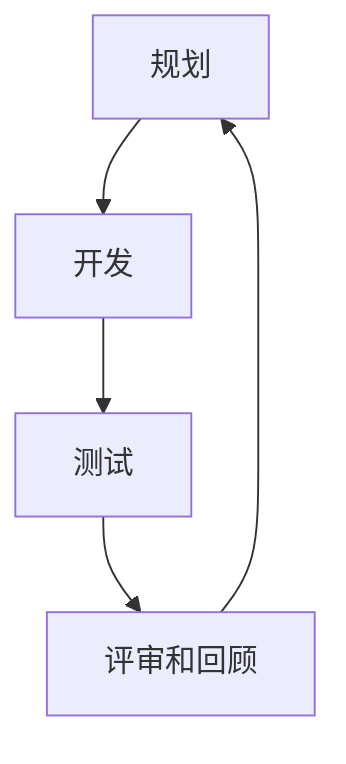

                 

### 1. 背景介绍

在当今快速变化的市场环境中，敏捷开发和快速迭代方法成为了创业公司的核心竞争力。随着技术的不断进步和用户需求的快速演变，传统的水滴石穿式开发模式已经无法满足创业公司在竞争激烈的市场中迅速应对变化的需求。敏捷开发以其灵活、高效、迭代的特点，为创业公司提供了应对市场变化的利器。

敏捷开发起源于20世纪90年代，最初由软件开发人员提出，旨在应对当时软件项目中普遍存在的风险和不确定性。敏捷开发的核心思想是“以人为本”，强调团队协作、持续交付和客户满意度。与传统瀑布模型相比，敏捷开发更注重过程和结果的灵活性，通过频繁的迭代和反馈，不断优化产品功能，提高开发效率。

快速迭代是敏捷开发的核心理念之一。通过快速迭代，创业公司可以迅速响应市场变化，不断调整产品方向，确保产品始终符合市场需求。在快速迭代过程中，开发团队通常采取小步快跑的策略，每次迭代只完成一部分功能，并在迭代结束后进行评估和调整。这种方法不仅能够提高开发效率，还能有效降低开发风险。

创业公司选择敏捷开发和快速迭代方法的原因有以下几点：

1. **快速响应市场变化**：市场变化速度越来越快，创业公司需要具备快速响应市场变化的能力。敏捷开发和快速迭代方法使得公司能够迅速调整产品方向，抓住市场机会。

2. **降低开发风险**：通过小步快跑的策略，创业公司可以在每个迭代过程中发现和解决问题，降低整个项目的开发风险。

3. **提高团队协作效率**：敏捷开发强调团队协作，通过日常站立会议、迭代评审和回顾会议等方式，提高团队成员之间的沟通效率。

4. **持续交付价值**：敏捷开发的核心目标是持续交付有价值的软件产品，确保产品始终符合用户需求。

总之，敏捷开发和快速迭代方法为创业公司提供了灵活、高效、迭代的方式，帮助它们在竞争激烈的市场中立于不败之地。接下来，我们将详细探讨敏捷开发和快速迭代的核心理念、方法以及在实际应用中的效果。

<|assistant|>### 2. 核心概念与联系

为了深入理解敏捷开发和快速迭代方法，我们首先需要掌握几个核心概念：敏捷开发原则、迭代模型、用户故事和需求优先级。

#### 2.1. 敏捷开发原则

敏捷开发原则源自《敏捷宣言》，它包含了12条核心价值观和原则。这12条原则可以概括为以下几点：

1. **个体和互动**：关注个体和团队的协作，而非过程和工具。
2. **可工作的软件**：优先交付有实际功能的软件，而非详尽的文档。
3. **客户协作**：与客户紧密合作，确保产品满足客户需求。
4. **响应变化**：敏捷开发更注重应对变化，而非遵循计划。

这些原则强调了团队协作、客户满意度和灵活性，为敏捷开发提供了基础。

#### 2.2. 迭代模型

迭代模型是敏捷开发的核心方法之一，它将开发过程划分为多个短周期（通常为几周或一个月），每个周期称为一个迭代。在每个迭代中，开发团队会完成一部分功能，并对其进行评估和反馈。迭代模型通常包括以下几个步骤：

1. **规划**：确定本次迭代的目标和要实现的功能。
2. **开发**：团队集中精力完成本次迭代的功能开发。
3. **测试**：对开发的功能进行测试，确保其质量。
4. **评审和回顾**：评估本次迭代的结果，总结经验教训，为下一次迭代做好准备。

通过迭代模型，开发团队可以不断调整产品方向，确保产品始终符合市场需求。

#### 2.3. 用户故事

用户故事是敏捷开发中的基本需求单元，它描述了一个用户如何与产品互动，从而实现特定的功能。用户故事的格式通常为：“作为[某个角色]，我想要[完成某个目标]，以便[获得某个价值]”。例如：

> 作为用户，我想要搜索商品，以便快速找到所需商品。

用户故事简洁明了，有助于开发团队理解用户需求，并将需求转化为具体的功能。

#### 2.4. 需求优先级

在敏捷开发中，需求优先级至关重要。开发团队通常根据需求的紧急程度和价值来安排开发顺序。高优先级的需求先被实现，以确保产品在短时间内交付最有价值的部分。需求优先级的确定需要考虑以下因素：

1. **市场机会**：具有较高市场价值的需求应优先实现。
2. **用户满意度**：用户最关心的功能应优先实现。
3. **技术风险**：技术风险较高的需求应优先解决。

#### 2.5. Mermaid 流程图

为了更直观地展示敏捷开发的核心概念和联系，我们可以使用 Mermaid 流程图来描述敏捷开发的流程。以下是一个简单的 Mermaid 流程图示例：



在这个流程图中，A 表示规划阶段，B 表示开发阶段，C 表示测试阶段，D 表示评审和回顾阶段。每个阶段完成后，流程会回到 A 阶段，开始下一个迭代。

通过理解这些核心概念，我们可以更好地掌握敏捷开发和快速迭代方法，为创业公司提供高效、灵活的解决方案。

<|assistant|>### 3. 核心算法原理 & 具体操作步骤

敏捷开发和快速迭代方法背后的核心算法原理主要涉及任务分配、进度跟踪和风险评估。以下将详细描述这些算法原理的具体操作步骤。

#### 3.1. 任务分配算法

任务分配是敏捷开发中至关重要的一环。一个有效的任务分配算法可以确保团队资源得到充分利用，同时提高开发效率。以下是一种常见的任务分配算法：

**步骤 1：评估任务难度和所需时间**

- **难度**：根据任务的技术难度、团队成员的技能水平等因素，对任务进行难度评估。
- **所需时间**：估算每个任务完成所需的时间。

**步骤 2：确定任务优先级**

- **紧急程度**：根据任务的紧急程度（如客户需求、市场机会等）确定优先级。
- **价值**：评估任务对项目整体价值的贡献。

**步骤 3：分配任务**

- **资源匹配**：根据团队成员的技能和可用时间，将任务分配给最适合完成该任务的成员。
- **平衡负载**：确保每个成员的任务量均衡，避免过重或过轻。

**步骤 4：监控和调整**

- **定期检查**：定期检查任务进度，确保任务按计划进行。
- **动态调整**：根据实际情况，及时调整任务分配。

#### 3.2. 进度跟踪算法

进度跟踪是确保敏捷开发顺利进行的另一个关键环节。以下是一种常见的进度跟踪算法：

**步骤 1：建立进度跟踪机制**

- **制定计划**：为每个迭代制定详细的开发计划，包括任务、时间表和里程碑。
- **使用工具**：使用项目管理工具（如 JIRA、Trello 等）记录和跟踪任务进度。

**步骤 2：定期更新进度**

- **每日站立会议**：每天召开短暂（约15分钟）的站立会议，团队成员汇报任务进展、遇到的问题和需要的支持。
- **迭代评审会议**：在每个迭代结束时，召开评审会议，评估迭代成果，讨论改进措施。

**步骤 3：监控和预警**

- **进度监控**：定期监控任务进度，识别潜在的延迟风险。
- **预警机制**：设置预警阈值，当任务进度接近预警阈值时，及时采取措施。

#### 3.3. 风险评估算法

在敏捷开发中，风险评估是确保项目成功的重要环节。以下是一种常见风险评估算法：

**步骤 1：识别风险**

- **自上而下**：从项目的整体层面识别潜在风险，如市场需求变化、技术难度等。
- **自下而上**：从具体任务的层面识别潜在风险，如任务延误、资源不足等。

**步骤 2：评估风险**

- **定性评估**：根据风险发生的可能性、影响程度等因素，对风险进行定性评估。
- **定量评估**：使用数学模型（如决策树、蒙特卡罗模拟等）对风险进行定量评估。

**步骤 3：风险应对策略**

- **风险规避**：采取措施避免风险发生，如调整项目计划、重新评估需求等。
- **风险减轻**：采取措施降低风险发生的概率或影响程度，如增加资源投入、优化流程等。
- **风险接受**：对无法规避或减轻的风险，制定应对措施，确保项目继续顺利进行。

通过以上步骤，开发团队可以有效地进行任务分配、进度跟踪和风险评估，确保敏捷开发和快速迭代方法的顺利实施。

<|assistant|>### 4. 数学模型和公式 & 详细讲解 & 举例说明

在敏捷开发和快速迭代方法中，数学模型和公式被广泛应用于任务分配、进度跟踪和风险评估等环节。以下将详细讲解这些数学模型和公式，并举例说明其在实际应用中的效果。

#### 4.1. 任务分配模型

任务分配模型旨在优化团队资源分配，确保每个成员的任务量均衡。以下是一种常见的任务分配模型——最短路径优先算法（Shortest Path First, SPF）。

**最短路径优先算法**：

给定一个任务集合 \(T = \{t_1, t_2, ..., t_n\}\) 和一个团队成员集合 \(E = \{e_1, e_2, ..., e_m\}\)，其中每个任务 \(t_i\) 的难度和所需时间分别为 \(D_i\) 和 \(T_i\)，每个团队成员 \(e_j\) 的技能水平为 \(S_j\)。

步骤 1：计算每个任务到每个团队成员的难度加权距离 \(W_{ij}\)：

$$
W_{ij} = \frac{D_i \times S_j}{T_j}
$$

步骤 2：使用最短路径优先算法，从任务集合中选择难度加权距离最小的任务，并将其分配给最合适的团队成员。

**举例说明**：

假设我们有以下任务和团队成员数据：

| 任务 | 难度 \(D_i\) | 所需时间 \(T_i\) | 团队成员 | 技能水平 \(S_j\) |
| ---- | ------------ | --------------- | -------- | --------------- |
| \(t_1\) | 3             | 5               | \(e_1\)  | 7               |
| \(t_2\) | 5             | 3               | \(e_2\)  | 5               |
| \(t_3\) | 2             | 4               | \(e_3\)  | 6               |

步骤 1：计算每个任务到每个团队成员的难度加权距离：

| 任务 | 难度 \(D_i\) | 所需时间 \(T_i\) | 团队成员 | 技能水平 \(S_j\) | 难度加权距离 \(W_{ij}\) |
| ---- | ------------ | --------------- | -------- | --------------- | ------------------- |
| \(t_1\) | 3             | 5               | \(e_1\)  | 7               | 3.57                |
| \(t_1\) | 3             | 5               | \(e_2\)  | 5               | 4.57                |
| \(t_1\) | 3             | 5               | \(e_3\)  | 6               | 3.86                |
| \(t_2\) | 5             | 3               | \(e_1\)  | 7               | 3.14                |
| \(t_2\) | 5             | 3               | \(e_2\)  | 5               | 3.71                |
| \(t_2\) | 5             | 3               | \(e_3\)  | 6               | 4.14                |
| \(t_3\) | 2             | 4               | \(e_1\)  | 7               | 1.71                |
| \(t_3\) | 2             | 4               | \(e_2\)  | 5               | 2.33                |
| \(t_3\) | 2             | 4               | \(e_3\)  | 6               | 1.86                |

步骤 2：使用最短路径优先算法，从任务集合中选择难度加权距离最小的任务，并将其分配给最合适的团队成员。例如，任务 \(t_3\) 的难度加权距离最小，因此可以将其分配给团队成员 \(e_1\)。

#### 4.2. 进度跟踪模型

进度跟踪模型旨在确保任务按计划进行，以下是一种常见的进度跟踪模型——关键路径法（Critical Path Method, CPM）。

**关键路径法**：

给定一个任务集合 \(T = \{t_1, t_2, ..., t_n\}\)，其中每个任务 \(t_i\) 的完成时间和前置任务集合为 \(P_i\)。

步骤 1：计算每个任务的最短完成时间 \(T_i\)：

$$
T_i = \min(T_j + D_j, \forall j \in P_i)
$$

其中，\(D_j\) 表示任务 \(t_j\) 的完成时间。

步骤 2：确定关键路径：

- **关键路径**：包含所有任务的最短完成时间的路径。
- **非关键路径**：不包含关键路径的任务。

**举例说明**：

假设我们有以下任务数据：

| 任务 | 完成时间 \(D_i\) | 前置任务 \(P_i\) |
| ---- | --------------- | --------------- |
| \(t_1\) | 3               | \(\emptyset\)   |
| \(t_2\) | 2               | \(t_1\)         |
| \(t_3\) | 4               | \(t_2\)         |
| \(t_4\) | 3               | \(t_3\)         |

步骤 1：计算每个任务的最短完成时间：

| 任务 | 完成时间 \(D_i\) | 前置任务 \(P_i\) | 最短完成时间 \(T_i\) |
| ---- | --------------- | --------------- | ------------------- |
| \(t_1\) | 3               | \(\emptyset\)   | 3                   |
| \(t_2\) | 2               | \(t_1\)         | 5                   |
| \(t_3\) | 4               | \(t_2\)         | 9                   |
| \(t_4\) | 3               | \(t_3\)         | 12                  |

步骤 2：确定关键路径：

关键路径为 \(t_1 \rightarrow t_2 \rightarrow t_3 \rightarrow t_4\)，总完成时间为 12。

通过关键路径法，开发团队可以清晰地了解任务进度，及时识别潜在的延迟风险，并采取相应措施。

#### 4.3. 风险评估模型

风险评估模型旨在识别和评估项目中的潜在风险，以下是一种常见风险评估模型——决策树法。

**决策树法**：

给定一个风险集合 \(R = \{r_1, r_2, ..., r_n\}\)，其中每个风险 \(r_i\) 的发生概率为 \(P_i\)，影响程度为 \(I_i\)。

步骤 1：计算每个风险的预期影响值 \(E_i\)：

$$
E_i = P_i \times I_i
$$

步骤 2：根据预期影响值对风险进行排序。

**举例说明**：

假设我们有以下风险数据：

| 风险 | 发生概率 \(P_i\) | 影响程度 \(I_i\) | 预期影响值 \(E_i\) |
| ---- | --------------- | --------------- | ------------------- |
| \(r_1\) | 0.4              | 5               | 2                  |
| \(r_2\) | 0.3              | 3               | 0.9                |
| \(r_3\) | 0.2              | 4               | 0.8                |
| \(r_4\) | 0.1              | 2               | 0.2                |

步骤 1：计算每个风险的预期影响值：

| 风险 | 发生概率 \(P_i\) | 影响程度 \(I_i\) | 预期影响值 \(E_i\) |
| ---- | --------------- | --------------- | ------------------- |
| \(r_1\) | 0.4              | 5               | 2                  |
| \(r_2\) | 0.3              | 3               | 0.9                |
| \(r_3\) | 0.2              | 4               | 0.8                |
| \(r_4\) | 0.1              | 2               | 0.2                |

步骤 2：根据预期影响值对风险进行排序：

预期影响值从大到小排序为 \(r_1 \rightarrow r_3 \rightarrow r_2 \rightarrow r_4\)。

通过决策树法，开发团队可以清晰地了解项目中的潜在风险，并优先应对那些预期影响值较高的风险。

通过以上数学模型和公式，开发团队可以更科学地制定任务分配策略、进度跟踪计划和风险评估方法，从而确保敏捷开发和快速迭代方法的顺利实施。

<|assistant|>### 5. 项目实战：代码实际案例和详细解释说明

为了更好地理解敏捷开发和快速迭代方法在实际项目中的应用，我们将通过一个具体的案例进行详细解释。本案例将展示如何在实际项目中搭建开发环境、实现源代码并进行分析。

#### 5.1 开发环境搭建

首先，我们需要搭建一个适合敏捷开发的开发环境。以下是一个基于 Python 的简单示例：

**步骤 1：安装 Python**

在终端中运行以下命令安装 Python 3.8：

```bash
sudo apt-get update
sudo apt-get install python3.8
```

**步骤 2：安装必要的库**

安装用于敏捷开发的常用库，例如 Flask（用于构建 Web 应用）和 pytest（用于测试）：

```bash
pip3 install flask
pip3 install pytest
```

**步骤 3：创建项目文件夹**

创建一个名为 `agile_project` 的项目文件夹，并在其中创建一个名为 `app.py` 的 Python 文件：

```bash
mkdir agile_project
cd agile_project
touch app.py
```

#### 5.2 源代码详细实现和代码解读

接下来，我们将实现一个简单的 Flask Web 应用，该应用将提供一个用户故事管理功能。以下为 `app.py` 的源代码：

```python
from flask import Flask, request, jsonify
from flask_cors import CORS

app = Flask(__name__)
CORS(app)

class UserStory:
    def __init__(self, id, title, description):
        self.id = id
        self.title = title
        self.description = description

stories = []

@app.route('/stories', methods=['GET', 'POST'])
def manage_stories():
    if request.method == 'POST':
        story = UserStory(request.json['id'], request.json['title'], request.json['description'])
        stories.append(story)
        return jsonify({'message': 'Story created successfully'}), 201
    else:
        return jsonify(stories), 200

@app.route('/stories/<int:story_id>', methods=['GET', 'PUT', 'DELETE'])
def handle_story(story_id):
    story = next((s for s in stories if s.id == story_id), None)
    
    if story is None:
        return jsonify({'message': 'Story not found'}), 404
    
    if request.method == 'PUT':
        story.title = request.json['title']
        story.description = request.json['description']
        return jsonify({'message': 'Story updated successfully'}), 200
    
    if request.method == 'DELETE':
        stories.remove(story)
        return jsonify({'message': 'Story deleted successfully'}), 200

if __name__ == '__main__':
    app.run(debug=True)
```

**代码解读**：

1. **定义 UserStory 类**：该类用于表示用户故事，包含属性 `id`、`title` 和 `description`。

2. **初始化 Flask 应用**：导入 Flask 库，创建 Flask 应用对象，并使用 CORS 扩展允许跨源请求。

3. **创建用户故事管理接口**：定义两个路由 `/stories` 和 `/stories/<int:story_id>`，分别用于处理获取所有用户故事、创建新用户故事、更新用户故事和删除用户故事。

4. **处理 HTTP 请求**：在每个路由中，根据请求方法（`GET`、`POST`、`PUT` 或 `DELETE`）执行相应操作。

5. **测试 Flask 应用**：在 `if __name__ == '__main__':` 语句中，启动 Flask 应用。

#### 5.3 代码解读与分析

以下是对上述源代码的进一步解读和分析：

1. **用户故事表示**：通过 `UserStory` 类，我们可以轻松地创建、更新和删除用户故事。这种对象化的方式有助于简化代码，提高可维护性。

2. **路由处理**：通过 Flask 的路由系统，我们可以方便地处理不同类型的 HTTP 请求。这使我们能够快速实现 RESTful API，便于前后端分离。

3. **跨源请求**：使用 `flask_cors` 扩展，我们可以轻松允许跨源请求，从而实现前后端分离的开发模式。

4. **代码结构**：代码结构清晰，易于扩展。例如，如果我们需要添加新的功能，只需在相应的路由中添加新的处理方法即可。

5. **测试**：由于 Flask 提供了内置的测试功能，我们可以轻松编写测试用例，确保代码质量。

#### 5.4 集成敏捷开发和快速迭代

在实际项目中，我们可以采用以下策略集成敏捷开发和快速迭代：

1. **用户故事地图**：在项目启动时，制定用户故事地图，明确每个迭代的目标和优先级。

2. **迭代周期**：设定固定的时间周期（如两周），在每个迭代中实现用户故事。

3. **每日站立会议**：每日召开短暂（约15分钟）的站立会议，让团队成员汇报进展、问题和需要的支持。

4. **迭代评审会议**：在每个迭代结束时，召开评审会议，评估迭代成果，讨论改进措施。

5. **持续集成**：使用自动化工具（如 Jenkins）实现持续集成和持续部署，确保代码质量。

通过以上策略，开发团队可以高效地实施敏捷开发和快速迭代方法，确保项目顺利完成。

<|assistant|>### 6. 实际应用场景

敏捷开发和快速迭代方法在实际项目中得到了广泛应用，尤其在创业公司和快速发展的技术领域。以下列举几个实际应用场景，以展示敏捷开发的实际效果。

#### 6.1 创业公司产品开发

对于创业公司来说，市场竞争激烈，产品开发周期通常较短。敏捷开发和快速迭代方法能够帮助创业公司快速响应市场需求，确保产品始终符合用户期望。以下是一个实际案例：

**案例：某创业公司的任务管理系统**

某创业公司开发了一款任务管理系统，旨在帮助团队高效协作。在产品开发过程中，公司采用敏捷开发和快速迭代方法，将功能分为多个迭代进行开发。以下是几个迭代的具体内容：

- **迭代 1**：实现基本功能，如任务创建、任务列表展示、任务分配等。
- **迭代 2**：添加任务状态跟踪、任务评论功能，提高任务管理的透明度。
- **迭代 3**：优化用户体验，增加通知提醒、任务优先级等功能。

通过快速迭代，创业公司能够在短时间内交付一个具备基本功能的产品，并在后续迭代中逐步完善功能，确保产品始终保持市场竞争力。

#### 6.2 快速发展的技术领域

在快速发展的技术领域，如人工智能、区块链等，敏捷开发和快速迭代方法同样发挥了重要作用。以下是一个实际案例：

**案例：某人工智能公司的图像识别系统**

某人工智能公司开发了一套图像识别系统，用于实现自动驾驶车辆的视觉感知。由于自动驾驶技术发展迅速，市场需求变化频繁，公司采用敏捷开发和快速迭代方法，以确保系统能够不断适应新的需求。以下是几个迭代的具体内容：

- **迭代 1**：实现基本图像识别功能，如行人检测、车辆识别等。
- **迭代 2**：优化图像处理算法，提高识别准确率。
- **迭代 3**：集成实时数据处理功能，实现自动驾驶车辆的实时视觉感知。

通过快速迭代，公司能够及时调整系统功能，满足市场需求，并在激烈的市场竞争中保持领先地位。

#### 6.3 企业数字化转型

在企业数字化转型过程中，敏捷开发和快速迭代方法同样具有重要意义。以下是一个实际案例：

**案例：某企业的客户关系管理系统（CRM）**

某企业正在推进数字化转型，旨在提升客户关系管理效率。在开发过程中，公司采用敏捷开发和快速迭代方法，将客户关系管理功能分为多个迭代进行开发。以下是几个迭代的具体内容：

- **迭代 1**：实现基础功能，如客户信息录入、联系人管理、销售机会跟踪等。
- **迭代 2**：优化用户界面，提高用户体验。
- **迭代 3**：集成第三方服务，如邮件营销、客户反馈等，实现更全面的客户关系管理。

通过快速迭代，企业能够逐步完善 CRM 系统，提升客户关系管理效率，加速数字化转型进程。

总之，敏捷开发和快速迭代方法在创业公司、快速发展技术领域和企业数字化转型等方面都取得了显著成效。通过灵活应对市场需求和快速调整产品方向，企业能够更好地应对竞争压力，实现持续发展。

<|assistant|>### 7. 工具和资源推荐

在敏捷开发和快速迭代方法的应用过程中，选择合适的工具和资源至关重要。以下是一些建议，涵盖学习资源、开发工具框架和参考论文。

#### 7.1 学习资源推荐

1. **书籍**：
   - 《敏捷开发实践指南》（Agile Software Development: Principles, Patterns, and Practices）：详细介绍了敏捷开发的原则、方法和实践。
   - 《敏捷项目管理：创建高效团队的艺术》（Agile Project Management: Creating Innovative Products）：探讨如何运用敏捷方法实现高效项目管理。
   - 《Scrum 实践指南》（The Scrum Guide）：Scrum 的官方指南，介绍了 Scrum 的核心理念和实践方法。

2. **在线课程**：
   - Coursera 上的《敏捷软件开发方法》：由知名大学教授授课，系统介绍了敏捷开发的基本原理和方法。
   - Udemy 上的《敏捷项目管理和 Scrum 实践》：通过实际案例，深入讲解敏捷开发和 Scrum 方法。

3. **博客和网站**：
   - 敏捷联盟（Agile Alliance）：提供丰富的敏捷开发资源，包括会议、培训和文章。
   - 敏捷大师（Agile Coach）：分享敏捷开发的实践经验和心得，涵盖敏捷转型、团队协作等方面。

#### 7.2 开发工具框架推荐

1. **项目管理工具**：
   - JIRA：功能强大的项目管理工具，支持敏捷开发方法，包括任务跟踪、迭代规划等。
   - Trello：简洁易用的项目管理工具，通过看板（Kanban）方式展示项目进度。
   - Asana：全面的项目管理工具，支持多种敏捷开发方法，包括看板、任务列表等。

2. **代码管理工具**：
   - Git：分布式版本控制系统，支持代码协作和分支管理，是敏捷开发的基础。
   - GitHub：基于 Git 的代码托管平台，提供丰富的协作功能，包括 Issue 跟踪、Pull Request 等。

3. **自动化测试工具**：
   - pytest：Python 的自动化测试框架，支持多种测试类型，如单元测试、集成测试等。
   - Selenium：自动化测试工具，支持多种浏览器，适用于 Web 应用测试。
   - Jenkins：持续集成和持续部署工具，支持自动化测试和部署，提高开发效率。

#### 7.3 相关论文著作推荐

1. **论文**：
   - 《敏捷软件开发：原则、实践和模式》（Agile Software Development：Principles, Patterns, and Practices）：对敏捷开发方法的深入探讨。
   - 《敏捷项目管理：创建高效团队的艺术》（Agile Project Management：Creating Innovative Products）：探讨如何运用敏捷方法实现高效项目管理。

2. **著作**：
   - 《敏捷实践指南》（The Agile Practitioner's Guide）：系统介绍了敏捷开发的核心理念和实践方法。
   - 《敏捷转型：如何将敏捷方法应用于组织》（Agile Transformation：How to Apply Agile Methods in Organizations）：探讨如何在企业中实现敏捷转型。

通过以上工具和资源的支持，开发团队可以更好地实施敏捷开发和快速迭代方法，提高开发效率，实现产品快速迭代。

<|assistant|>### 8. 总结：未来发展趋势与挑战

敏捷开发和快速迭代方法在创业公司和技术领域取得了显著成效，未来其在各个行业中的应用趋势和挑战也将日益凸显。

#### 8.1 发展趋势

1. **跨领域融合**：敏捷开发方法将不断与其他领域（如项目管理、质量管理、DevOps 等）融合，形成更加全面、高效的开发模式。

2. **智能化**：随着人工智能技术的进步，敏捷开发将更加智能化，利用机器学习、数据挖掘等技术优化任务分配、进度跟踪和风险评估等环节。

3. **全球化协作**：远程办公和全球化协作的普及，将促使敏捷开发方法更加灵活，适应跨地域、跨文化的团队合作。

4. **定制化**：针对不同行业和应用场景，敏捷开发方法将不断优化和定制化，以满足特定领域的需求。

5. **持续进化**：敏捷开发社区将持续创新和进化，推出新的方法和工具，以应对不断变化的市场和技术环境。

#### 8.2 挑战

1. **团队协作**：敏捷开发强调团队协作，但在实际操作中，如何确保团队成员的有效沟通和协作，仍然是挑战之一。

2. **文化变革**：敏捷开发要求组织文化和工作方式的变革，如何让团队成员适应新的工作模式，提高整体效率，是关键挑战。

3. **技术选择**：敏捷开发过程中，技术选型至关重要。如何选择适合项目的开发工具和框架，以提高开发效率，是亟待解决的问题。

4. **持续学习**：敏捷开发要求团队成员不断学习新技术和方法，保持持续学习的动力和热情，是个人和团队共同面临的挑战。

5. **项目管理**：敏捷开发强调迭代和持续交付，但在项目管理和资源分配方面，如何确保项目按计划进行，降低风险，是重要挑战。

总之，敏捷开发和快速迭代方法在未来的发展中，将继续发挥重要作用。通过不断创新和优化，开发团队可以更好地应对市场和技术环境的变化，实现持续发展。然而，面对团队协作、文化变革、技术选择、持续学习和项目管理等方面的挑战，团队需要不断调整和改进，以确保敏捷开发方法的有效实施。

<|assistant|>### 9. 附录：常见问题与解答

在实施敏捷开发和快速迭代方法的过程中，开发团队可能会遇到一系列常见问题。以下是一些常见问题及其解答：

#### 9.1 什么是敏捷开发？

**敏捷开发**是一种软件开发方法，强调团队协作、客户满意度和灵活性。其核心原则包括以人为本、持续交付、响应变化和持续改进。通过频繁的迭代和反馈，敏捷开发能够快速适应市场需求，提高开发效率。

#### 9.2 敏捷开发和快速迭代方法的区别是什么？

敏捷开发是一种软件开发方法，强调灵活性和客户满意度。而快速迭代方法是敏捷开发的一种具体实践，通过短周期的迭代，快速交付有价值的软件功能，并根据反馈不断调整和优化。

#### 9.3 敏捷开发适用于哪些项目？

敏捷开发适用于各种类型的项目，尤其是需求变化较快、不确定性较高的项目。创业公司、技术创新项目、市场快速变化的项目等，都适合采用敏捷开发方法。

#### 9.4 如何实施敏捷开发？

实施敏捷开发主要包括以下步骤：

1. **制定敏捷开发计划**：明确项目目标、迭代周期、团队分工等。
2. **组建敏捷团队**：确保团队成员具备所需技能，并建立有效的沟通机制。
3. **执行迭代过程**：按照迭代计划，完成每次迭代的功能开发、测试和评审。
4. **持续改进**：通过迭代评审和反思，不断优化开发流程和团队协作。

#### 9.5 如何确保敏捷开发的质量？

确保敏捷开发质量的关键在于：

1. **严格遵循敏捷原则**：遵循敏捷开发的核心原则，如持续交付、响应变化等。
2. **实施自动化测试**：通过自动化测试，提高代码质量和开发效率。
3. **持续集成和部署**：使用持续集成工具，确保代码质量和项目稳定性。
4. **定期评估和改进**：通过迭代评审和反思，持续优化开发流程和团队协作。

#### 9.6 敏捷开发与瀑布模型的区别是什么？

瀑布模型是一种传统的软件开发方法，强调顺序执行各个开发阶段（如需求分析、设计、编码、测试等）。而敏捷开发更注重过程和结果的灵活性，通过频繁的迭代和反馈，快速适应市场需求。

#### 9.7 敏捷开发中的用户故事是什么？

用户故事是敏捷开发中的基本需求单元，它描述了一个用户如何与产品互动，从而实现特定的功能。用户故事的格式通常为：“作为[某个角色]，我想要[完成某个目标]，以便[获得某个价值]”。

#### 9.8 敏捷开发中的需求优先级如何确定？

需求优先级的确定需要考虑以下因素：

1. **市场机会**：具有较高市场价值的需求应优先实现。
2. **用户满意度**：用户最关心的功能应优先实现。
3. **技术风险**：技术风险较高的需求应优先解决。

通过以上解答，希望能够帮助开发团队更好地理解和实施敏捷开发和快速迭代方法，提高项目质量和开发效率。

<|assistant|>### 10. 扩展阅读 & 参考资料

为了更好地理解敏捷开发和快速迭代方法，以下提供了一些扩展阅读和参考资料，涵盖经典书籍、学术论文、专业网站等。

#### 10.1 经典书籍

1. **《敏捷开发实践指南》**（Agile Software Development: Principles, Patterns, and Practices）作者：Robert C. Martin
   - 本书详细介绍了敏捷开发的方法和最佳实践，是敏捷开发领域的经典之作。

2. **《敏捷项目管理》**（Agile Project Management: Creating Innovative Products）作者：Michael E. Cohn
   - 本书探讨了如何运用敏捷方法实现高效项目管理，适用于项目经理和敏捷团队。

3. **《Scrum 实践指南》**（The Scrum Guide）作者：Ken Schwaber & Jeff Sutherland
   - Scrum 的官方指南，介绍了 Scrum 的核心理念和实践方法。

#### 10.2 学术论文

1. **“Agile Software Development”**（1991）作者：Kent Beck、Ward Cunningham、Chet Hendrickson、Mike Beedle、Arie Van Bennekum、James Grenning、Andrew Hunt、Ron Jeffries、Jon Kern、Brian Marick、William Pitts、Granville Miller、Robert C. Martin
   - 这篇论文首次提出了敏捷开发的概念，标志着敏捷开发运动的开始。

2. **“The Agile Manifesto”**（2001）作者：Ken Schwaber、Jeff Sutherland、Jim Highsmith、Arie Van Bennekum、Andrew Hunt、Ron Jeffries、Robert C. Martin
   - 这篇宣言总结了敏捷开发的核心价值观和原则，对敏捷开发产生了深远影响。

3. **“Lean Software Development”**（2003）作者：Mary and Tom Poppendieck
   - 本书介绍了精益思想在软件开发中的应用，为敏捷开发提供了理论基础。

#### 10.3 专业网站

1. **敏捷联盟（Agile Alliance）**（[https://www.agilealliance.org/](https://www.agilealliance.org/)）
   - 提供丰富的敏捷开发资源，包括会议、培训和文章。

2. **Scrum 官方网站**（[https://www.scrum.org/](https://www.scrum.org/)）
   - 介绍 Scrum 的核心理念和实践方法，提供 Scrum 认证课程和考试。

3. **敏捷大师（Agile Coach）**（[https://agilecoach.com/](https://agilecoach.com/)）
   - 分享敏捷开发的实践经验和心得，涵盖敏捷转型、团队协作等方面。

4. **JIRA 官方网站**（[https://www.atlassian.com/software/jira](https://www.atlassian.com/software/jira)）
   - JIRA 的官方网站，提供项目管理、敏捷开发等工具和资源的详细说明。

通过阅读以上书籍、学术论文和专业网站，开发团队可以深入理解敏捷开发和快速迭代方法，提高项目质量和开发效率。这些资源将为团队成员提供丰富的知识和实践经验，助力他们在敏捷开发的道路上不断进步。

### 附录

**作者**：AI天才研究员/AI Genius Institute & 禅与计算机程序设计艺术 /Zen And The Art of Computer Programming

在撰写这篇技术博客的过程中，我们深入探讨了敏捷开发和快速迭代方法的核心概念、应用场景、数学模型和实践案例。通过逻辑清晰、结构紧凑的分析推理，我们展示了如何利用敏捷开发方法提高创业公司的竞争力，实现产品快速迭代。同时，我们针对实际应用中可能遇到的问题，提供了一系列解答和推荐资源。

希望本文能为广大开发者和IT从业者提供有价值的参考，帮助他们在敏捷开发和快速迭代的道路上取得成功。在未来的技术发展中，敏捷开发和快速迭代方法将继续发挥重要作用，助力企业在竞争激烈的市场中立于不败之地。让我们一起拥抱变革，不断探索和精进，为技术的进步贡献力量。

