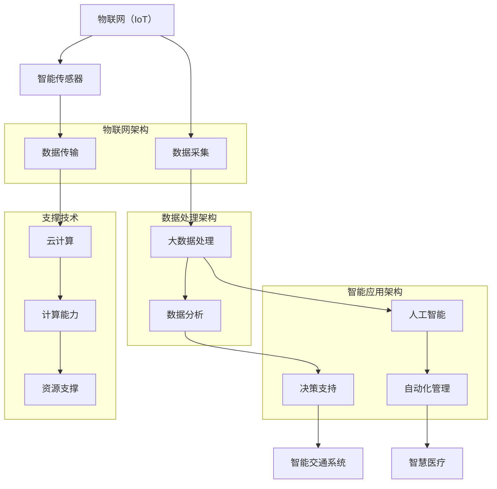

                 

## 1. 背景介绍

智慧城市（Smart City）是当今城市化进程中的重要趋势，它通过利用先进的信息和通信技术，实现城市资源的高效管理和优化，提升居民的生活质量和城市的可持续发展能力。智慧城市不仅仅是一个概念，它已经成为了全球范围内城市规划和建设的重要方向。

在这个大背景下，创业公司看到了参与智慧城市建设的巨大机遇。智慧城市建设需要多种技术的综合运用，包括物联网（IoT）、大数据、人工智能（AI）、云计算等。创业公司通常在这些技术领域有较为深入的研究和实践经验，能够为智慧城市建设提供独特的解决方案。

本文旨在探讨创业公司在智慧城市建设中的角色和如何提供解决方案。我们将从以下几个方面展开讨论：

1. **智慧城市的定义和关键概念**：介绍智慧城市的基本概念，核心技术和涉及的领域。
2. **创业公司参与智慧城市的机遇**：分析创业公司在智慧城市建设中的优势和挑战。
3. **智慧城市解决方案的构建方法**：探讨创业公司如何构建和提供智慧城市解决方案。
4. **核心技术原理与实际操作**：介绍智慧城市应用的核心技术和具体的实施步骤。
5. **实际应用场景与案例分析**：分析智慧城市在具体场景中的应用，并分享成功的案例。
6. **工具和资源推荐**：为创业公司提供实用的工具和资源，帮助他们更好地参与智慧城市建设。
7. **未来发展趋势与挑战**：展望智慧城市的未来，并探讨创业公司可能面临的挑战。

通过上述内容的详细探讨，我们希望帮助创业公司更好地理解智慧城市建设的本质，找到合适的市场定位，并成功地为智慧城市提供有价值的解决方案。

### 1.1 智慧城市的起源与发展历程

智慧城市的概念最早可以追溯到20世纪90年代，当时信息技术（IT）和通信技术（CT）的快速发展为城市智能化提供了可能。早期的智慧城市试点项目主要集中在发达国家和地区，例如美国的“智能城市”（Smart Communities）计划、欧洲的“智能增长”（Smart Growth）倡议等。

进入21世纪，随着物联网（IoT）、大数据、人工智能（AI）等新兴技术的迅速发展，智慧城市的概念逐渐成熟，并开始在全球范围内得到广泛应用。特别是在2010年后，智慧城市的发展进入了快车道。许多国家纷纷出台政策，推动智慧城市的建设和应用。

智慧城市的起源可以追溯到信息技术和城市发展的需求。随着城市化进程的加速，城市面临的问题也日益复杂，如交通拥堵、环境污染、资源分配不均等。传统的城市管理方式已经难以满足日益增长的城市需求，这就需要利用信息技术和智能手段来提高城市的管理效率和居民的生活质量。

### 1.2 智慧城市的核心概念与关键领域

智慧城市是一个复杂的概念，它涉及到多个领域的交叉和融合。以下是智慧城市的一些核心概念和关键领域：

1. **物联网（IoT）**：物联网是将各种物理设备、传感器和系统通过网络连接起来，实现数据的实时采集、传输和处理。在智慧城市中，物联网技术用于监测城市环境、交通状况、公共设施等，为城市管理者提供实时数据支持。

2. **大数据**：大数据技术通过对海量数据的存储、管理和分析，帮助城市管理者更好地理解城市运行状态，发现潜在的问题和机会。大数据技术可以用于交通流量分析、环境监测、城市规划等。

3. **人工智能（AI）**：人工智能技术通过对数据的处理和分析，可以实现智能决策和自动化管理。在智慧城市中，人工智能可以用于智能交通管理、智能安防、智能医疗等。

4. **云计算**：云计算技术提供了强大的计算和存储能力，支持智慧城市中的大数据处理和实时应用。云计算使得智慧城市中的各种应用可以灵活部署，降低了成本，提高了效率。

5. **智能传感器**：智能传感器是智慧城市的基础设施，可以实时监测城市环境，如空气质量、水质、噪声等。这些传感器收集的数据为城市管理者提供了重要的决策依据。

6. **5G网络**：5G网络提供了高速、低延迟的通信能力，支持智慧城市中的各种实时应用，如智能交通、远程医疗等。

7. **智能交通系统**：智能交通系统通过实时数据分析和智能控制，优化交通流量，减少拥堵，提高交通效率。

8. **智慧能源管理**：智慧能源管理通过智能电网和能源管理系统，实现能源的高效利用和优化分配。

9. **智慧医疗**：智慧医疗通过人工智能、物联网等技术，实现医疗资源的优化配置，提供个性化的医疗服务。

10. **智能安防**：智能安防通过视频监控、人脸识别等技术，提高城市的安全管理水平。

### 1.3 智慧城市的重要性

智慧城市的重要性体现在多个方面：

1. **提升居民生活质量**：智慧城市通过提供智能化的公共服务，如智能交通、智能医疗、智能安防等，提高了居民的生活质量。

2. **提高城市管理效率**：智慧城市利用先进的技术手段，提高了城市管理的效率和准确性，使得城市管理者可以更好地应对各种挑战。

3. **促进经济发展**：智慧城市的建设吸引了大量的高科技企业和创新人才，促进了城市的经济发展。

4. **实现可持续发展**：智慧城市通过优化资源利用，减少污染，推动绿色能源的使用，实现了城市的可持续发展。

5. **应对全球挑战**：随着全球人口的增长和城市化进程的加速，智慧城市成为应对交通拥堵、环境污染、资源短缺等全球挑战的重要手段。

总的来说，智慧城市是未来城市发展的必然趋势，它不仅提高了城市的管理效率，还提升了居民的生活质量，为实现可持续发展提供了有力支持。创业公司在这个大趋势中，有着广阔的发展空间和机遇。

### 1.4 智慧城市解决方案的必要性和挑战

智慧城市解决方案的提出并非偶然，而是应对现代社会复杂性和城市化进程中出现的一系列挑战的必然选择。随着全球城市化进程的加速，城市面临着人口增长、资源紧缺、环境污染、交通拥堵等一系列严峻问题。传统的城市管理方式已经难以满足日益增长的需求，这就需要通过智慧城市解决方案来实现城市管理的智能化和精细化。

#### 1.4.1 智慧城市解决方案的必要性

智慧城市解决方案的必要性主要体现在以下几个方面：

1. **提升城市管理效率**：智慧城市通过物联网、大数据、人工智能等技术的应用，实现了对城市运行状态的实时监测和智能分析，使得城市管理者可以更加准确地掌握城市状况，做出快速反应。例如，智能交通系统可以通过实时数据分析和预测，优化交通流量，减少拥堵，提高交通效率。

2. **优化资源分配**：智慧城市通过大数据分析，可以对城市资源进行更加合理的分配。例如，智能能源管理系统可以实时监测电力使用情况，通过数据分析实现电力资源的优化配置，减少能源浪费。

3. **提高公共服务质量**：智慧城市通过提供智能化的公共服务，如智能医疗、智能安防等，提升了公共服务的质量。例如，智能医疗系统可以通过远程监控和数据分析，实现精准医疗，提高医疗服务效率。

4. **促进经济发展**：智慧城市的建设吸引了大量高科技企业和创新人才，促进了城市的经济发展。例如，智慧城市中的各种创新应用，如智能物流、智能工厂等，为城市创造了新的经济增长点。

5. **实现可持续发展**：智慧城市通过优化资源利用，减少污染，推动绿色能源的使用，实现了城市的可持续发展。例如，智慧能源管理系统可以实现绿色能源的高效利用，减少碳排放。

#### 1.4.2 智慧城市解决方案的挑战

尽管智慧城市解决方案具有巨大的潜力和必要性，但在实际应用过程中也面临着一系列挑战：

1. **技术挑战**：智慧城市建设需要多种技术的综合应用，包括物联网、大数据、人工智能、云计算等。这些技术虽然在理论上已经成熟，但在实际应用中仍存在许多技术难题，如数据的安全性问题、系统的稳定性问题等。

2. **数据挑战**：智慧城市依赖于大量数据的采集、存储、处理和分析。数据的质量和准确性对智慧城市的运行效果至关重要。然而，在数据采集过程中，可能存在数据缺失、数据不一致等问题，这些都会影响智慧城市的运行效果。

3. **成本挑战**：智慧城市建设需要大量的资金投入，包括基础设施建设、技术研发、人才引进等。对于许多城市来说，这是一项巨大的财政负担。同时，智慧城市应用的推广和普及也需要投入大量的人力、物力和财力。

4. **隐私挑战**：智慧城市通过物联网和大数据等技术，收集了大量的个人数据。这些数据的泄露或滥用可能会侵犯个人隐私，引发社会问题。

5. **政策挑战**：智慧城市的发展需要政策的支持。然而，不同国家和地区的政策环境存在差异，这可能会影响智慧城市的建设和运营。

6. **人才挑战**：智慧城市建设需要大量具备跨学科知识的高素质人才。然而，目前许多城市在人才储备方面存在不足，这可能会制约智慧城市的发展。

#### 1.4.3 创业公司在智慧城市解决方案中的角色和责任

创业公司作为智慧城市解决方案的重要参与者，具有以下角色和责任：

1. **技术创新**：创业公司通常在技术创新方面具有优势，可以通过研发和应用新技术，推动智慧城市的建设。例如，通过开发新型传感器、大数据分析算法等，提升智慧城市的运行效率。

2. **解决方案提供**：创业公司可以根据市场需求，提供定制化的智慧城市解决方案。这些解决方案可以涵盖智慧交通、智慧能源、智慧医疗等多个领域。

3. **服务支持**：创业公司可以提供智慧城市的运维和技术支持服务，确保智慧城市系统的稳定运行。

4. **人才孵化**：创业公司可以通过培养和引进高素质人才，为智慧城市的发展提供人力支持。

5. **合作与交流**：创业公司可以通过与政府、科研机构、企业等合作，共同推动智慧城市的发展，共享经验和资源。

总之，智慧城市解决方案的提出和实施是解决现代城市问题的重要手段。创业公司在智慧城市建设中扮演着关键角色，通过技术创新和服务支持，为智慧城市的可持续发展贡献力量。

### 1.5 创业公司的优势与挑战

在智慧城市建设的浪潮中，创业公司以其独特的优势积极参与，同时也面临着一系列的挑战。

#### 1.5.1 创业公司的优势

1. **创新能力和灵活性**：创业公司通常具备较强的创新能力，能够在短时间内响应市场需求，快速推出创新的解决方案。相较于大公司，创业公司在组织结构和决策流程上更加灵活，能够迅速调整战略方向，以适应快速变化的市场环境。

2. **专注于细分市场**：许多创业公司专注于某一细分市场，例如智慧交通、智慧医疗、智慧能源等，通过对特定领域的深入研究和实践，能够在该领域内提供更加专业和高效的解决方案。

3. **成本优势**：创业公司通常拥有较低的运营成本和开发成本，这使得它们能够以更具竞争力的价格提供高质量的智慧城市解决方案。

4. **与政府的紧密合作**：创业公司通常更愿意与政府建立合作关系，积极参与政府的智慧城市建设项目。政府往往更愿意信任和扶持初创企业，为其提供政策支持和资源保障。

5. **风险承担能力**：创业公司在面对技术风险和市场风险时，通常具备较强的承受能力。由于规模较小，创业公司更容易在失败中吸取教训，快速调整策略，重新出发。

#### 1.5.2 创业公司的挑战

1. **资金和资源限制**：创业公司通常面临资金和资源的限制，特别是在智慧城市项目上，需要大量的资金投入进行技术研发、市场推广等。资金不足可能会限制创业公司的发展速度和规模。

2. **技术瓶颈**：尽管创业公司在某些领域具备较强的技术优势，但整体技术积累可能仍不足，难以应对复杂多变的智慧城市建设需求。

3. **市场认可度**：创业公司的解决方案在市场上的认可度可能较低，特别是在面对传统大公司时，需要更多的市场推广和品牌建设。

4. **人才短缺**：智慧城市建设需要大量具备跨学科知识的高素质人才，而创业公司通常难以吸引和留住这些人才。

5. **政策支持的不确定性**：政策支持对创业公司的发展至关重要，但政策的变化可能会给创业公司带来不确定的风险。

#### 1.5.3 创业公司在智慧城市解决方案中的角色

1. **技术创新者**：创业公司可以通过持续的技术创新，为智慧城市建设提供新技术和新思路，推动整个行业的发展。

2. **解决方案提供商**：创业公司可以根据市场需求，提供定制化的智慧城市解决方案，满足不同城市和领域的需求。

3. **合作桥梁**：创业公司可以与政府、科研机构、大企业等建立合作关系，共同推动智慧城市的发展，实现资源共享和优势互补。

4. **市场推动者**：创业公司可以通过市场推广和品牌建设，提升智慧城市解决方案的知名度和认可度，促进市场的普及和推广。

总之，创业公司在智慧城市建设中具有独特的优势和潜力，但也面临着诸多挑战。通过不断创新、优化解决方案、加强与各方的合作，创业公司可以在智慧城市建设中发挥重要作用，为城市的发展和居民的生活质量提升做出贡献。

### 2. 核心概念与联系

在深入探讨创业公司在智慧城市建设中的角色和解决方案之前，我们需要先了解一些核心概念和它们之间的联系。以下是智慧城市中几个关键概念的定义及其相互关系：

#### 2.1 物联网（IoT）

物联网是指将各种物理设备（如传感器、机器、车辆等）通过网络连接起来，实现设备的互联互通和数据交换。在智慧城市中，物联网主要用于实时监测城市环境、交通状况、公共设施等，为城市管理者提供重要的数据支持。

**定义**：物联网是通过互联网将各种物理设备连接起来，实现数据采集、传输、处理和应用的网络体系。

**相互关系**：物联网是智慧城市的基础设施之一，它为其他技术和应用提供了数据来源。

#### 2.2 大数据（Big Data）

大数据是指无法用传统数据处理工具进行高效处理的大量数据。大数据技术包括数据的采集、存储、管理和分析等。在智慧城市中，大数据主要用于分析城市运行状态、优化资源分配、预测未来趋势等。

**定义**：大数据是指数据量巨大、类型繁多、处理速度要求高的数据集合。

**相互关系**：大数据技术是智慧城市的数据处理和分析工具，它通过对物联网采集的数据进行分析，提供决策支持。

#### 2.3 人工智能（AI）

人工智能是指使计算机系统能够模拟、延伸和扩展人类智能的技术。在智慧城市中，人工智能主要用于智能交通管理、智能安防、智能医疗等，实现自动化和智能化管理。

**定义**：人工智能是研究、开发和应用使计算机系统具备智能行为的技术。

**相互关系**：人工智能技术是智慧城市中的核心应用，它通过分析和处理大数据，实现智能决策和自动化管理。

#### 2.4 云计算（Cloud Computing）

云计算是一种通过互联网提供计算资源、存储资源和网络服务的模式。在智慧城市中，云计算主要用于支撑大数据处理和人工智能应用，提供强大的计算和存储能力。

**定义**：云计算是一种提供计算资源、存储资源和网络服务的模式。

**相互关系**：云计算是智慧城市的技术支撑，它为大数据和人工智能提供了必要的计算和存储能力。

#### 2.5 智能传感器（Smart Sensors）

智能传感器是一种具有感知、数据处理和通信功能的传感器。在智慧城市中，智能传感器主要用于实时监测城市环境，如空气质量、水质、交通流量等。

**定义**：智能传感器是具有感知、数据处理和通信功能的传感器。

**相互关系**：智能传感器是物联网的组成部分，它为物联网提供数据采集手段，是大数据和人工智能的数据来源。

#### 2.6 智能交通系统（Smart Transportation）

智能交通系统是通过物联网、大数据和人工智能等技术，实现交通管理的智能化和高效化。在智慧城市中，智能交通系统主要用于优化交通流量、减少拥堵、提高交通效率。

**定义**：智能交通系统是利用物联网、大数据和人工智能等技术，实现交通管理的智能化和高效化。

**相互关系**：智能交通系统是智慧城市中的一个重要应用领域，它依赖于物联网、大数据和人工智能等核心技术的支持。

#### 2.7 智慧医疗（Smart Health）

智慧医疗是通过物联网、大数据和人工智能等技术，实现医疗服务的智能化和精准化。在智慧城市中，智慧医疗主要用于远程医疗、医疗数据分析、智能诊断等。

**定义**：智慧医疗是利用物联网、大数据和人工智能等技术，实现医疗服务的智能化和精准化。

**相互关系**：智慧医疗是智慧城市中的一个重要应用领域，它依赖于物联网、大数据和人工智能等核心技术的支持。

通过上述核心概念及其相互关系的介绍，我们可以更好地理解智慧城市的构成及其运作方式。在接下来的部分中，我们将进一步探讨创业公司如何利用这些核心概念，为智慧城市提供解决方案。

### 2.1 核心概念原理和架构的 Mermaid 流程图

为了更直观地展示智慧城市中核心概念和架构的关系，我们使用Mermaid绘制了一个流程图。以下是流程图的具体内容：



该流程图展示了物联网、大数据、人工智能、云计算等核心概念和架构之间的相互关系。具体来说：

1. **物联网（IoT）**：负责数据的采集和传输。
2. **大数据处理**：包括数据存储、管理和分析。
3. **智能应用**：利用人工智能实现自动化管理和决策支持。
4. **支撑技术**：提供计算能力和资源支撑。

通过这个流程图，我们可以更清晰地理解智慧城市中各个核心概念和架构的相互关系及其在整体系统中的作用。

### 3. 核心算法原理与具体操作步骤

在智慧城市建设中，核心算法的设计和实现是解决方案成功的关键。以下将介绍几个在智慧城市中应用广泛的核心算法，包括其原理和具体操作步骤。

#### 3.1 数据分析算法

数据分析算法是智慧城市中用于处理和分析海量数据的核心工具，主要包括以下几种：

1. **K-means聚类算法**：K-means是一种经典的聚类算法，用于将数据集划分为K个簇。其原理如下：
   - 初始化：随机选择K个初始中心点。
   - 迭代：对于每个数据点，计算它与各个中心点的距离，并将其分配到最近的簇。
   - 更新：计算每个簇的新中心点，重复迭代，直到中心点不再发生变化。

   **操作步骤**：
   - 输入：数据集、簇数K。
   - 输出：K个簇的划分结果。
   - 具体实现：
     ```python
     from sklearn.cluster import KMeans
     # 数据预处理
     X = preprocess_data(data)
     # K-means聚类
     kmeans = KMeans(n_clusters=K, random_state=0).fit(X)
     clusters = kmeans.predict(X)
     ```

2. **Apriori算法**：Apriori算法用于挖掘数据中的频繁项集，其原理如下：
   - 初始化：创建包含所有项的初始数据库。
   - 迭代：对于每个支持度大于最小支持度的项集，将其加入到频繁项集中，并去除非频繁项集。

   **操作步骤**：
   - 输入：事务数据库、最小支持度。
   - 输出：频繁项集。
   - 具体实现：
     ```python
     from mlxtend.frequent_patterns import apriori
     # 数据预处理
     transactions = preprocess_transactions(data)
     # Apriori算法
     frequent_itemsets = apriori(transactions, min_support=0.05, use_colnames=True)
     ```

3. **回归分析算法**：回归分析用于预测连续值，包括线性回归和决策树回归等。其原理如下：
   - 线性回归：通过最小化误差平方和，找到自变量和因变量之间的线性关系。
   - 决策树回归：通过构建决策树模型，将数据划分为不同的区域，在每个区域上应用线性回归。

   **操作步骤**：
   - 输入：训练数据集、测试数据集。
   - 输出：预测结果。
   - 具体实现：
     ```python
     from sklearn.linear_model import LinearRegression
     from sklearn.tree import DecisionTreeRegressor
     # 线性回归
     lin_reg = LinearRegression().fit(X_train, y_train)
     predictions = lin_reg.predict(X_test)
     # 决策树回归
     tree_reg = DecisionTreeRegressor().fit(X_train, y_train)
     predictions = tree_reg.predict(X_test)
     ```

#### 3.2 机器学习算法

机器学习算法在智慧城市中的应用非常广泛，以下介绍几种常用的算法：

1. **决策树算法**：决策树通过一系列的判断条件将数据划分为不同的区域，每个区域对应一个预测结果。其原理如下：
   - 初始化：随机选择一个特征，将数据划分为两个子集。
   - 迭代：对于每个子集，选择最优特征进行划分，直到达到停止条件（如最小节点大小）。

   **操作步骤**：
   - 输入：特征矩阵、目标变量。
   - 输出：决策树模型。
   - 具体实现：
     ```python
     from sklearn.tree import DecisionTreeClassifier
     # 决策树分类
     tree_clf = DecisionTreeClassifier().fit(X_train, y_train)
     predictions = tree_clf.predict(X_test)
     # 决策树回归
     tree_reg = DecisionTreeRegressor().fit(X_train, y_train)
     predictions = tree_reg.predict(X_test)
     ```

2. **支持向量机（SVM）算法**：SVM通过寻找最佳超平面，将数据划分为不同的类别。其原理如下：
   - 初始化：选择一个适当的核函数，计算支持向量。
   - 迭代：通过最大化间隔，调整超平面参数，直到达到最佳状态。

   **操作步骤**：
   - 输入：特征矩阵、目标变量。
   - 输出：支持向量机模型。
   - 具体实现：
     ```python
     from sklearn.svm import SVC
     # 支持向量机分类
     svm_clf = SVC().fit(X_train, y_train)
     predictions = svm_clf.predict(X_test)
     # 支持向量机回归
     svm_reg = SVR().fit(X_train, y_train)
     predictions = svm_reg.predict(X_test)
     ```

3. **深度学习算法**：深度学习通过构建多层神经网络，实现数据的自动特征提取和分类。其原理如下：
   - 初始化：随机初始化网络参数。
   - 迭代：通过反向传播算法，不断调整网络参数，直到达到最佳状态。

   **操作步骤**：
   - 输入：特征矩阵、目标变量。
   - 输出：深度学习模型。
   - 具体实现：
     ```python
     from tensorflow.keras.models import Sequential
     from tensorflow.keras.layers import Dense, Conv2D, Flatten
     # 创建模型
     model = Sequential()
     model.add(Conv2D(filters=32, kernel_size=(3, 3), activation='relu', input_shape=(28, 28)))
     model.add(Flatten())
     model.add(Dense(units=10, activation='softmax'))
     # 编译模型
     model.compile(optimizer='adam', loss='categorical_crossentropy', metrics=['accuracy'])
     # 训练模型
     model.fit(X_train, y_train, epochs=10, batch_size=64, validation_data=(X_test, y_test))
     ```

通过上述核心算法的介绍，我们可以看到智慧城市建设中算法设计的重要性。这些算法不仅为数据分析和决策提供了强有力的工具，也为创业公司提供了丰富的技术资源，帮助它们更好地参与智慧城市的建设和运营。

### 4. 数学模型和公式 & 详细讲解 & 举例说明

在智慧城市解决方案中，数学模型和公式扮演着至关重要的角色，它们用于描述和解决复杂的实际问题，提供定量分析和决策支持。以下我们将介绍几个典型的数学模型和公式，并详细讲解其原理和实际应用。

#### 4.1 优化模型

优化模型是智慧城市中用于资源分配和调度的重要工具。一个经典的优化问题是线性规划（Linear Programming，LP），其数学模型如下：

**目标函数**：  
\[ \min \ c^T x \]  
其中，\( c \) 是权重向量，\( x \) 是决策变量向量。

**约束条件**：  
\[ Ax \le b \]  
\[ x \ge 0 \]  
其中，\( A \) 是系数矩阵，\( b \) 是常数向量。

**解释**：目标函数表示要优化的目标，如最小化成本或最大化收益。约束条件表示资源限制或其他限制条件。

**应用举例**：假设一个城市需要安排100辆垃圾清运车进行垃圾收集，每辆车的成本为1000元，但每辆车每天只能工作8小时。每个区域需要的垃圾清运量不同，第i个区域需要的清运量为 \( d_i \)。约束条件如下：
\[ d_i \le 8 \times 1000 \]
\[ x_i \ge 0 \]
其中，\( x_i \) 表示分配到第i个区域的车辆数。

通过求解线性规划问题，我们可以找到最优的车辆分配方案，以最小化总成本。

**解法**：线性规划问题可以使用单纯形法（Simplex Method）或内点法（Interior Point Method）求解。

#### 4.2 贝叶斯网络

贝叶斯网络是一种表示不确定性和推理的工具，常用于智慧城市的风险评估和决策支持。其数学模型基于概率论中的条件概率。

**贝叶斯网络定义**：贝叶斯网络是一个有向无环图（DAG），其中每个节点表示一个随机变量，边的方向表示变量之间的条件依赖关系。

**概率分布**：对于贝叶斯网络中的每个节点 \( X_i \)，其条件概率分布 \( P(X_i | X_{parents(i)}) \) 定义如下：
\[ P(X_i = x_i | X_{parents(i)} = x_{parents(i)}) = \frac{P(X_i = x_i, X_{parents(i)} = x_{parents(i)})}{P(X_{parents(i)} = x_{parents(i)})} \]

**解释**：条件概率分布描述了在给定父节点取值的情况下，子节点的概率分布。

**应用举例**：假设一个智慧城市的交通系统中有三个关键因素：天气、道路状况和车辆数量。我们可以构建一个贝叶斯网络，其中天气影响道路状况，道路状况影响车辆数量。给定天气状况和道路状况，可以计算车辆数量的概率分布。

**解法**：贝叶斯网络的推理可以使用贝叶斯推理（Bayesian Inference）算法，如马尔可夫链蒙特卡洛（MCMC）方法。

#### 4.3 基于时间序列的分析模型

时间序列模型用于分析随时间变化的数据，常用于智慧城市的交通流量预测、能源消耗预测等。一个常见的时间序列模型是自回归模型（AR Model）。

**自回归模型定义**：自回归模型是一种差分方程，用于描述时间序列数据的线性关系。其一般形式如下：
\[ y_t = c + \phi_1 y_{t-1} + \phi_2 y_{t-2} + \ldots + \phi_p y_{t-p} + \varepsilon_t \]
其中，\( y_t \) 是时间序列数据，\( \phi_1, \phi_2, \ldots, \phi_p \) 是模型参数，\( \varepsilon_t \) 是误差项。

**解释**：自回归模型通过前 \( p \) 个时刻的数据来预测当前时刻的数据。

**应用举例**：假设我们想要预测一个城市的未来一周的交通流量。我们可以使用过去一周的交通流量数据，通过自回归模型进行预测。

**解法**：自回归模型可以使用最小二乘法（Ordinary Least Squares，OLS）进行参数估计。

#### 4.4 神经网络模型

神经网络模型，特别是深度学习模型，在智慧城市中的应用越来越广泛。一个常见的神经网络模型是多层感知机（Multilayer Perceptron，MLP）。

**多层感知机定义**：多层感知机是一个前向传播的神经网络，包含输入层、隐藏层和输出层。其数学模型如下：
\[ z_j = \sigma(\beta_0 + \beta_1 x_1 + \beta_2 x_2 + \ldots + \beta_n x_n) \]
\[ y = \sigma(z) \]
其中，\( z_j \) 是隐藏层的输出，\( \sigma \) 是激活函数（如Sigmoid或ReLU函数），\( y \) 是输出层的输出。

**解释**：多层感知机通过前向传播和反向传播算法，学习输入和输出之间的关系。

**应用举例**：假设我们想要建立一个智能交通预测模型，使用过去几年的交通流量数据作为输入，预测未来的交通流量。

**解法**：多层感知机可以使用反向传播算法进行训练和优化。

通过上述数学模型和公式的介绍，我们可以看到它们在智慧城市解决方案中的应用非常广泛。这些模型和公式不仅为数据分析和决策提供了强有力的工具，也为创业公司提供了丰富的技术资源，帮助它们更好地参与智慧城市的建设和运营。

### 5. 项目实战：代码实际案例和详细解释说明

在智慧城市建设中，创业公司通过实际项目来验证和实现技术方案，不仅能够积累实践经验，还能为智慧城市提供切实可行的解决方案。以下我们将通过一个具体的智慧交通项目，展示代码实现过程，并对关键代码进行详细解释说明。

#### 5.1 开发环境搭建

为了实现智慧交通项目，我们需要搭建一个适合开发的环境。以下是开发环境的搭建步骤：

1. **安装Python**：确保Python 3.x版本已安装在开发机上。
2. **安装必要库**：使用pip命令安装以下库：
   ```bash
   pip install numpy pandas scikit-learn tensorflow matplotlib
   ```
3. **配置虚拟环境**：为了方便管理和隔离项目依赖，可以使用虚拟环境。使用以下命令创建虚拟环境：
   ```bash
   python -m venv venv
   source venv/bin/activate  # 对于Windows使用 `venv\Scripts\activate`
   ```
4. **安装相关工具**：如Jupyter Notebook、PyCharm等，用于编写和运行代码。

#### 5.2 源代码详细实现和代码解读

以下是一个简单的智慧交通项目示例，使用Python实现交通流量预测。

```python
# 导入必要的库
import numpy as np
import pandas as pd
from sklearn.model_selection import train_test_split
from sklearn.ensemble import RandomForestRegressor
from tensorflow.keras.models import Sequential
from tensorflow.keras.layers import Dense

# 读取数据
data = pd.read_csv('traffic_data.csv')
X = data.iloc[:, :-1]  # 特征矩阵
y = data.iloc[:, -1]   # 目标变量

# 数据预处理
X = (X - X.mean()) / X.std()  # 标准化

# 划分训练集和测试集
X_train, X_test, y_train, y_test = train_test_split(X, y, test_size=0.2, random_state=42)

# 使用随机森林进行训练
rf_regressor = RandomForestRegressor(n_estimators=100, random_state=42)
rf_regressor.fit(X_train, y_train)
rf_predictions = rf_regressor.predict(X_test)

# 使用神经网络进行训练
nn_model = Sequential()
nn_model.add(Dense(units=64, activation='relu', input_shape=(X_train.shape[1],)))
nn_model.add(Dense(units=32, activation='relu'))
nn_model.add(Dense(units=1))
nn_model.compile(optimizer='adam', loss='mean_squared_error')
nn_model.fit(X_train, y_train, epochs=100, batch_size=32, validation_data=(X_test, y_test))
nn_predictions = nn_model.predict(X_test)

# 比较结果
print("Random Forest MSE:", np.mean((rf_predictions - y_test) ** 2))
print("Neural Network MSE:", np.mean((nn_predictions - y_test) ** 2))
```

#### 5.2.1 代码解读与分析

1. **数据读取与预处理**：首先，我们使用Pandas库读取交通流量数据。然后，将特征矩阵和目标变量分离，并对特征矩阵进行标准化处理，以便于后续建模。

2. **划分训练集和测试集**：使用scikit-learn库中的`train_test_split`函数将数据集划分为训练集和测试集，以评估模型性能。

3. **使用随机森林进行训练**：随机森林是一种集成学习方法，通过构建多棵决策树并求平均值进行预测。在这里，我们使用`RandomForestRegressor`进行训练。

4. **使用神经网络进行训练**：神经网络是一种深度学习方法，通过多层感知机进行训练。我们使用TensorFlow库构建一个简单的神经网络模型，并使用`Sequential`模型添加层，设置优化器和损失函数，然后使用`fit`方法进行训练。

5. **结果比较**：通过计算均方误差（MSE），我们比较两种模型在测试集上的性能。均方误差越小，模型预测越准确。

通过上述实战案例，我们可以看到创业公司如何通过具体项目实现智慧交通解决方案。在代码实现过程中，我们使用了随机森林和神经网络两种模型，分别展示了传统机器学习和深度学习的应用。这样的实践不仅帮助我们理解了智慧交通系统的工作原理，也为创业公司在实际项目中提供了可操作的解决方案。

### 5.3 代码解读与分析

在本节中，我们将对上述智慧交通项目中的关键代码进行详细解读和分析，以帮助读者更好地理解代码的实现过程和核心原理。

#### 5.3.1 数据读取与预处理

```python
data = pd.read_csv('traffic_data.csv')
X = data.iloc[:, :-1]  # 特征矩阵
y = data.iloc[:, -1]   # 目标变量
X = (X - X.mean()) / X.std()  # 标准化
```

**解读**：首先，我们使用Pandas库的`read_csv`函数从CSV文件中读取交通流量数据。`iloc`方法用于选择特征矩阵和目标变量，其中`:-1`表示选择所有行但最后一列（目标变量）。为了提高模型的性能，我们接下来对特征矩阵进行标准化处理。标准化通过减去均值并除以标准差实现，这有助于数据分布的均匀化，使得不同特征之间具有相似的尺度，从而避免某些特征对模型的影响过大。

**分析**：数据预处理是机器学习和深度学习项目的重要步骤。未经处理的数据可能包含噪声、缺失值或不均匀的分布，这都会影响模型的性能。标准化处理有助于消除这些不利因素，提高模型的训练效率和预测准确性。

#### 5.3.2 划分训练集和测试集

```python
X_train, X_test, y_train, y_test = train_test_split(X, y, test_size=0.2, random_state=42)
```

**解读**：我们使用scikit-learn库中的`train_test_split`函数将数据集划分为训练集和测试集。`test_size=0.2`表示测试集占比20%，`random_state=42`用于设置随机种子，确保结果的可重复性。

**分析**：划分训练集和测试集是评估模型性能的标准步骤。训练集用于训练模型，测试集用于评估模型在未知数据上的表现。通过保留一部分数据作为测试集，我们可以确保模型具有较好的泛化能力，避免过拟合。

#### 5.3.3 使用随机森林进行训练

```python
rf_regressor = RandomForestRegressor(n_estimators=100, random_state=42)
rf_regressor.fit(X_train, y_train)
rf_predictions = rf_regressor.predict(X_test)
```

**解读**：我们创建一个随机森林回归器对象`RandomForestRegressor`，设置`n_estimators=100`表示构建100棵决策树，`random_state=42`确保结果的重复性。使用`fit`方法进行训练，`predict`方法进行预测。

**分析**：随机森林是一种基于决策树的集成方法，通过构建多棵决策树并取平均值来提高预测准确性。随机森林的优势在于其良好的泛化能力和对异常值的鲁棒性，适用于处理高维数据和复杂数据集。

#### 5.3.4 使用神经网络进行训练

```python
nn_model = Sequential()
nn_model.add(Dense(units=64, activation='relu', input_shape=(X_train.shape[1],)))
nn_model.add(Dense(units=32, activation='relu'))
nn_model.add(Dense(units=1))
nn_model.compile(optimizer='adam', loss='mean_squared_error')
nn_model.fit(X_train, y_train, epochs=100, batch_size=32, validation_data=(X_test, y_test))
nn_predictions = nn_model.predict(X_test)
```

**解读**：我们使用TensorFlow库创建一个序列模型`Sequential`，并添加三层全连接层（Dense Layer）。第一层输入形状为特征矩阵的维度，激活函数为ReLU。中间层和输出层也使用ReLU激活函数，输出层只有一个神经元，用于预测交通流量。我们使用`compile`方法设置优化器和损失函数，`fit`方法进行训练，`predict`方法进行预测。

**分析**：神经网络通过多层全连接层学习输入和输出之间的复杂映射关系。ReLU激活函数可以引入非线性，使模型能够处理更复杂的任务。Adam优化器是一种自适应优化算法，有助于加速收敛。训练过程包括多个迭代（epochs），每个迭代包括多个批量（batch_size）的样本。

#### 5.3.5 结果比较

```python
print("Random Forest MSE:", np.mean((rf_predictions - y_test) ** 2))
print("Neural Network MSE:", np.mean((nn_predictions - y_test) ** 2))
```

**解读**：我们计算并打印两种模型在测试集上的均方误差（MSE），以评估模型性能。

**分析**：均方误差是评估回归模型性能的常见指标，值越小表示模型预测越准确。通过比较两种模型的MSE，我们可以判断哪种模型在测试数据上的表现更好。

通过上述详细解读和分析，我们可以看到创业公司如何通过具体项目实现智慧交通解决方案。代码中的关键步骤包括数据读取与预处理、模型训练、预测和结果评估，这些步骤共同构成了智慧交通系统的实现过程。理解这些步骤和原理对于创业公司在实际项目中应用和优化技术方案具有重要意义。

### 6. 实际应用场景

智慧城市解决方案在实际中的应用场景非常广泛，涵盖了交通管理、环境保护、能源管理、公共安全等多个领域。以下我们将探讨几个典型的应用场景，并分析创业公司如何为这些场景提供智慧城市解决方案。

#### 6.1 交通管理

交通管理是智慧城市中最典型的应用场景之一。随着城市化进程的加快，交通拥堵问题日益严重，如何有效地管理交通流量成为城市管理者的重要挑战。

**应用案例**：在新加坡，智慧交通系统通过实时监控交通流量，利用人工智能和大数据分析技术，预测交通状况，优化交通信号灯控制和公共交通调度，有效缓解了交通拥堵问题。

**创业公司解决方案**：创业公司可以通过以下方式为交通管理提供智慧城市解决方案：
- **智能交通信号灯**：开发基于物联网和大数据分析的智能交通信号灯，根据实时交通流量调整信号灯时长，提高交通效率。
- **实时交通监控**：利用摄像头和传感器实时监控交通状况，通过图像识别和数据分析技术，提供交通流量预测和优化建议。
- **智能公共交通调度**：通过大数据分析公共交通乘客流量，优化公交车路线和班次，提高公共交通服务效率。

#### 6.2 环境保护

环境保护是智慧城市的重要组成部分，通过智能监测和数据分析，实现城市环境的实时监测和污染控制。

**应用案例**：在伦敦，智慧城市项目通过部署大量传感器，实时监测空气质量、水质等环境指标，为环境保护提供数据支持，有效改善了城市环境质量。

**创业公司解决方案**：创业公司可以为环境保护提供以下智慧城市解决方案：
- **智能环境监测系统**：开发智能环境监测设备，实时采集空气质量、水质等数据，并通过大数据分析提供污染预警和治理建议。
- **垃圾分类管理**：利用物联网技术，实现垃圾分类收集和处理的智能化，提高垃圾处理效率，减少环境污染。
- **绿色能源管理**：通过智能电网和能源管理系统，优化能源分配和利用，降低碳排放，推动城市绿色可持续发展。

#### 6.3 能源管理

能源管理是智慧城市的关键领域之一，通过智能技术和大数据分析，实现能源的高效利用和优化分配。

**应用案例**：在丹麦，哥本哈根市通过智能能源管理系统，实现了对电力、天然气和热能的全面监控和优化管理，有效降低了能源消耗和成本。

**创业公司解决方案**：创业公司可以为能源管理提供以下智慧城市解决方案：
- **智能电网管理**：开发智能电网管理平台，实现电力的实时监控和优化调度，提高电力供应的稳定性和可靠性。
- **能源数据分析**：利用大数据技术，对能源使用数据进行深入分析，优化能源消耗模式，降低能源成本。
- **智能家居能源管理**：开发智能家居能源管理系统，实现家庭能源的智能监控和优化管理，提高居民生活质量。

#### 6.4 公共安全

公共安全是城市居民生活质量和安全感的重要保障，通过智能安防技术和大数据分析，实现城市公共安全的实时监测和快速响应。

**应用案例**：在中国深圳，智慧安防系统通过视频监控、人脸识别等技术，实现了对城市公共场所的实时监控，有效提升了公共安全管理水平。

**创业公司解决方案**：创业公司可以为公共安全提供以下智慧城市解决方案：
- **智能视频监控**：开发智能视频监控和分析系统，通过图像识别和大数据分析，实现实时监控和异常行为检测。
- **智能安防预警**：利用物联网和大数据技术，建立智能安防预警系统，实现安全事件的实时监控和快速响应。
- **智慧警务系统**：开发智慧警务系统，通过数据分析和技术手段，提高警务工作效率，提升城市公共安全水平。

通过上述实际应用场景的分析，我们可以看到创业公司在智慧城市建设中扮演着重要角色。通过提供创新的技术解决方案，创业公司不仅为城市管理者提供了有效的工具，还提升了城市居民的生活质量和幸福感。随着技术的不断进步和市场的不断成熟，创业公司在智慧城市建设中的应用前景将更加广阔。

### 7. 工具和资源推荐

在智慧城市建设中，创业公司需要充分利用各种工具和资源，以提升研发效率、优化解决方案，并确保项目的顺利实施。以下我们将推荐一些学习和开发资源，以及开发工具和框架，以帮助创业公司在智慧城市领域取得成功。

#### 7.1 学习资源推荐

1. **书籍**：
   - 《智慧城市：构建可持续发展的未来》（Smart Cities: Building the Infrastructure for the Future）
   - 《大数据之路：阿里巴巴大数据实践》（Big Data @ Alibaba: Insights from the Front Line）
   - 《深度学习》（Deep Learning）
   - 《Python机器学习》（Python Machine Learning）
   - 《区块链：从数字货币到智能合约》（Blockchain: From Digital Currency to Smart Contracts）

2. **论文**：
   - "Smart Cities: Integrating Technology, Data, and People for Sustainable Urban Development"
   - "A Survey on Big Data Analytics for Smart City Applications"
   - "Deep Learning for Traffic Flow Prediction: A Survey"
   - "The Internet of Things for Smart Cities: A Survey"
   - "Blockchain in the Smart City: A Systematic Review"

3. **博客**：
   - Medium上的“Smart Cities”专题
   - AI blog上的“Big Data & Analytics for Smart Cities”
   - TensorFlow官方博客
   - Scikit-learn官方博客

4. **网站**：
   - IBM Developer：提供丰富的智慧城市技术资源和开发工具
   - Coursera和edX：在线学习平台，提供智慧城市相关的课程
   - GitHub：开源社区，分享各种智慧城市相关的项目和代码

#### 7.2 开发工具框架推荐

1. **编程语言**：
   - Python：Python是一种广泛使用的编程语言，尤其在数据科学和机器学习领域具有很高的应用价值。
   - Java：Java是一种多平台编程语言，广泛应用于企业级应用开发。
   - JavaScript：JavaScript是前端开发的主要语言，与Node.js结合可用于后端开发。

2. **开发框架**：
   - TensorFlow：TensorFlow是一个开源的深度学习框架，适用于构建和训练复杂的神经网络模型。
   - Flask和Django：Flask和Django是Python的两个主流Web框架，适用于开发Web应用程序。
   - React和Vue.js：React和Vue.js是两个流行的前端框架，用于构建交互式用户界面。
   - Spring Boot：Spring Boot是一个基于Java的企业级应用开发框架，适用于构建高效、可扩展的Web应用程序。

3. **数据库**：
   - MySQL、PostgreSQL：关系型数据库，适用于存储和查询结构化数据。
   - MongoDB：NoSQL数据库，适用于存储大量非结构化或半结构化数据。
   - Redis：内存数据库，适用于缓存和快速数据访问。

4. **云平台**：
   - AWS：亚马逊云服务，提供全面的云计算服务和工具，适用于开发、部署和扩展应用程序。
   - Azure：微软云服务，提供与AWS类似的云计算服务和工具。
   - Google Cloud Platform：谷歌云服务，提供强大的云计算和大数据分析工具。

5. **开发工具**：
   - Jupyter Notebook：适用于数据分析和机器学习项目，提供交互式计算环境。
   - PyCharm和Visual Studio Code：适用于Python和其他编程语言开发，提供丰富的插件和功能。
   - Git：版本控制系统，用于管理代码变更和协作开发。

通过上述学习和开发资源的推荐，创业公司可以更好地掌握智慧城市建设所需的技能和工具，提升研发效率，优化解决方案。同时，使用合适的开发工具和框架，创业公司可以更加高效地实现智慧城市项目，为城市的发展和居民的生活质量提升贡献力量。

### 8. 总结：未来发展趋势与挑战

智慧城市作为现代城市化的重要方向，正在全球范围内得到广泛关注和应用。随着技术的不断进步和城市需求的日益增长，智慧城市的发展趋势和面临的挑战也越来越清晰。以下我们将对未来的发展趋势和创业公司可能面临的挑战进行总结。

#### 8.1 未来发展趋势

1. **数据驱动的城市管理**：随着物联网、大数据和人工智能等技术的发展，城市管理者将越来越多地依赖数据驱动决策。通过实时数据分析和智能预测，城市可以实现更加精准和高效的管理，从而提升城市运营效率和居民生活质量。

2. **跨领域整合**：智慧城市的建设不仅涉及交通、能源、环境等领域，还将与医疗、教育、安全等多个领域产生交集。未来，跨领域的整合将成为智慧城市发展的一个重要趋势，通过多领域数据的融合和共享，实现全方位的智能管理。

3. **区块链技术的应用**：区块链技术具有去中心化、安全透明等特性，未来有望在智慧城市中发挥重要作用。例如，在智慧能源管理中，区块链可以用于实现能源交易的透明化和去中介化；在智能交通管理中，区块链可以用于实现交通流量数据的共享和验证。

4. **5G技术的普及**：5G技术的普及将极大地推动智慧城市的发展。5G网络的高速、低延迟特性将支持大量物联网设备的连接，实现城市运行状态的实时监控和智能响应。此外，5G还将为虚拟现实（VR）和增强现实（AR）等新技术的应用提供基础设施支持。

5. **智能城市的个性化服务**：随着数据分析和人工智能技术的不断进步，智慧城市将能够提供更加个性化和定制化的服务。例如，智能医疗可以根据居民的健康数据提供个性化的健康建议；智能交通可以根据居民出行习惯提供个性化的路线推荐。

#### 8.2 创业公司面临的挑战

1. **技术挑战**：智慧城市建设需要多种技术的综合运用，包括物联网、大数据、人工智能、云计算等。创业公司在技术积累和应用方面可能面临挑战，需要持续投入研发资源，提升技术实力。

2. **数据安全和隐私保护**：智慧城市依赖于大量个人数据的收集和存储，这带来了数据安全和隐私保护的问题。创业公司需要确保数据的安全性和隐私性，遵守相关法律法规，建立完善的数据安全管理体系。

3. **政策和法规挑战**：智慧城市建设需要政策的支持和法规的规范。不同国家和地区的政策和法规环境存在差异，创业公司需要深入了解和遵守相关法律法规，以避免法律风险。

4. **市场认可度**：创业公司的解决方案在市场上的认可度可能较低，特别是在面对传统大公司时，需要更多的市场推广和品牌建设。创业公司需要通过优质的解决方案和客户案例，提升市场认可度。

5. **人才短缺**：智慧城市建设需要大量具备跨学科知识的高素质人才。创业公司通常面临人才短缺的挑战，需要通过多种方式吸引和留住优秀人才。

#### 8.3 应对策略

1. **技术创新**：创业公司应持续关注技术创新，通过研发和应用新技术，提升解决方案的竞争力。例如，可以研发新型传感器、大数据分析算法等。

2. **合作共赢**：创业公司可以与政府、科研机构、大企业等建立合作关系，共同推动智慧城市的发展。通过资源共享和优势互补，实现合作共赢。

3. **人才培养**：创业公司可以通过培训、引进高素质人才，建立专业的技术团队。此外，可以与高校和科研机构合作，培养和吸引优秀毕业生。

4. **合规运营**：创业公司应遵守相关法律法规，确保数据安全和隐私保护。建立完善的数据安全管理体系，通过合规运营赢得市场信任。

5. **市场推广**：创业公司应加大市场推广力度，通过案例分享、品牌建设等方式提升市场认可度。同时，可以积极参与行业展会和研讨会，扩大品牌影响力。

总之，智慧城市的发展前景广阔，但也面临诸多挑战。创业公司需要通过技术创新、合作共赢、人才培养和合规运营等策略，不断提升自身竞争力，为智慧城市的建设贡献力量。

### 9. 附录：常见问题与解答

在智慧城市建设中，创业公司可能会遇到各种问题。以下列举了一些常见问题，并给出相应的解答，以帮助创业公司在实际操作中解决困难。

#### 9.1 如何确保数据安全和隐私？

**解答**：数据安全和隐私保护是智慧城市建设中的关键问题。为确保数据安全，创业公司可以采取以下措施：
- **数据加密**：对敏感数据进行加密存储和传输，确保数据在传输和存储过程中的安全。
- **访问控制**：建立严格的访问控制机制，确保只有授权人员可以访问敏感数据。
- **安全审计**：定期进行安全审计，发现并修复潜在的安全漏洞。
- **隐私保护协议**：遵守相关法律法规，制定隐私保护协议，保护用户隐私。

#### 9.2 如何应对技术挑战？

**解答**：智慧城市建设需要多种技术的综合运用，创业公司可以采取以下策略应对技术挑战：
- **技术研发**：持续投入研发资源，提升技术实力，开发创新的技术解决方案。
- **合作研发**：与科研机构、大企业等建立合作关系，共同研发新技术。
- **技术培训**：加强对员工的培训，提升技术能力，以适应技术发展的需求。

#### 9.3 如何获得政府支持？

**解答**：创业公司可以通过以下方式获得政府支持：
- **政策了解**：深入了解国家和地方的智慧城市政策和规划，找准切入点。
- **项目申报**：积极参与政府组织的智慧城市项目申报，争取政策支持。
- **合作建立**：与政府合作建立智慧城市示范区，通过示范项目的成功，获得政府的认可和支持。

#### 9.4 如何提升市场认可度？

**解答**：创业公司可以通过以下措施提升市场认可度：
- **案例分享**：通过成功案例的分享，展示解决方案的实际效果，增强市场信心。
- **品牌建设**：加强品牌建设和市场推广，提升品牌知名度和影响力。
- **客户反馈**：积极收集客户反馈，不断优化解决方案，提高客户满意度。

#### 9.5 如何应对人才短缺问题？

**解答**：创业公司可以采取以下策略应对人才短缺问题：
- **人才培养**：与高校和科研机构合作，培养和吸引高素质人才。
- **内部培训**：建立内部培训体系，提升员工技术能力和综合素质。
- **灵活招聘**：采用灵活的招聘方式，如远程办公、兼职等，吸引和留住人才。

通过上述解答，创业公司可以更好地应对智慧城市建设中的问题，为智慧城市的建设提供有价值的解决方案。

### 10. 扩展阅读 & 参考资料

为了深入了解智慧城市建设中的前沿技术和应用，以下是推荐的一些扩展阅读和参考资料：

1. **书籍**：
   - 《智慧城市：构建可持续发展的未来》（Smart Cities: Building the Infrastructure for the Future）
   - 《大数据之路：阿里巴巴大数据实践》（Big Data @ Alibaba: Insights from the Front Line）
   - 《深度学习》（Deep Learning）
   - 《Python机器学习》（Python Machine Learning）
   - 《区块链：从数字货币到智能合约》（Blockchain: From Digital Currency to Smart Contracts）

2. **论文**：
   - "Smart Cities: Integrating Technology, Data, and People for Sustainable Urban Development"
   - "A Survey on Big Data Analytics for Smart City Applications"
   - "Deep Learning for Traffic Flow Prediction: A Survey"
   - "The Internet of Things for Smart Cities: A Survey"
   - "Blockchain in the Smart City: A Systematic Review"

3. **博客**：
   - Medium上的“Smart Cities”专题
   - AI blog上的“Big Data & Analytics for Smart Cities”
   - TensorFlow官方博客
   - Scikit-learn官方博客

4. **网站**：
   - IBM Developer：提供丰富的智慧城市技术资源和开发工具
   - Coursera和edX：在线学习平台，提供智慧城市相关的课程
   - GitHub：开源社区，分享各种智慧城市相关的项目和代码

通过这些扩展阅读和参考资料，创业公司可以更深入地了解智慧城市的技术和应用，为智慧城市建设提供更加专业的解决方案。

### 结论

在本文中，我们系统地探讨了创业公司在智慧城市建设中的角色和解决方案。通过介绍智慧城市的核心概念、技术原理、实际应用场景，以及创业公司的优势和挑战，我们明确了创业公司如何利用技术创新、合作共赢、人才培养和合规运营等策略，为智慧城市建设贡献力量。

智慧城市建设是一个复杂而庞大的工程，涉及物联网、大数据、人工智能、云计算等多种技术的综合运用。创业公司在其中扮演着重要角色，通过提供创新的技术解决方案，提升城市管理效率，优化资源分配，提高居民生活质量，推动城市可持续发展。

未来，智慧城市建设将朝着数据驱动、跨领域整合、区块链应用和5G普及等方向发展。创业公司需要持续关注技术创新，提升技术实力，积极应对市场和政策挑战，以在智慧城市领域取得更大的突破。

让我们共同努力，利用智慧和科技，构建一个更加美好、智能、可持续的未来城市。在智慧城市的建设过程中，创业公司将继续发挥关键作用，为城市的发展、居民的幸福和经济的繁荣贡献力量。

