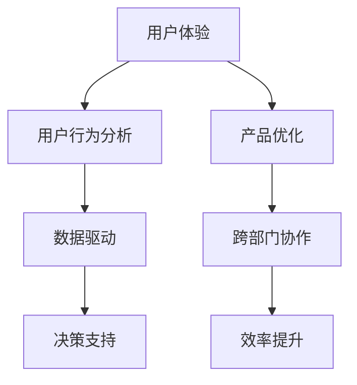

                 

### 背景介绍

创业公司作为新兴产业的重要组成部分，其成功与否往往影响着整个行业的生态和未来发展。在互联网和移动技术的推动下，创业公司的生存环境日益复杂和多变。因此，如何打造优秀的用户体验和实现产品的持续优化，成为创业公司成功的关键要素之一。

用户体验（User Experience, UX）设计是产品开发过程中不可或缺的一部分，它关注用户在使用产品过程中的感受和体验。一个优秀的用户体验设计不仅能提升用户满意度，还能增强用户忠诚度，从而为企业带来持续的收益。对于创业公司来说，有限的时间和资源要求他们必须在用户体验设计上做出明智的决策。

产品优化（Product Optimization）则是指通过改进产品功能、性能、可用性等方面，来提升用户满意度和市场竞争力。随着用户需求的不断变化和市场竞争的加剧，创业公司必须不断优化产品，以满足用户的新需求，保持市场竞争力。

本文将围绕创业公司的用户体验设计与产品优化展开讨论，从核心概念、算法原理、数学模型、实际案例等多个角度，深入探讨如何实现用户体验的提升和产品的优化。

### 核心概念与联系

在探讨创业公司的用户体验设计与产品优化之前，我们需要明确几个核心概念，并理解它们之间的联系。

#### 用户体验（User Experience, UX）

用户体验是指用户在使用产品或服务时所感受到的总体体验，包括情感、行为、认知等方面。一个优秀的用户体验设计需要从用户的角度出发，考虑用户的需求、习惯和痛点，并通过设计手段来提升用户的满意度和忠诚度。

#### 产品优化（Product Optimization）

产品优化是指通过对产品功能、性能、可用性等方面的改进，来提升产品的用户体验和市场竞争力。产品优化可以分为多个层面，包括功能优化、性能优化、可用性优化等。

#### 用户行为分析（User Behavior Analysis）

用户行为分析是通过对用户在产品中的行为轨迹、交互模式、反馈等数据的收集和分析，来了解用户需求、行为习惯和痛点。用户行为分析对于优化用户体验和产品功能具有重要意义。

#### 数据驱动（Data-Driven）

数据驱动是指通过数据来指导产品设计和决策，使产品开发更加科学和高效。数据驱动要求创业公司具备强大的数据处理和分析能力，以便从海量数据中提取有价值的信息。

#### 跨部门协作（Cross-Functional Collaboration）

跨部门协作是指产品团队、设计团队、市场团队、技术团队等不同部门之间的合作，共同推进产品开发和优化。跨部门协作有助于整合各部门的优势资源，提高产品开发效率和质量。

#### 核心概念原理与架构的 Mermaid 流程图

下面是一个简化的 Mermaid 流程图，展示了用户体验设计与产品优化中的核心概念和它们之间的联系。



在这个流程图中，用户体验作为核心，通过用户行为分析来了解用户需求，进而指导数据驱动的决策过程，最终实现产品优化和跨部门协作，提升整体效率。

### 核心算法原理 & 具体操作步骤

在用户体验设计与产品优化中，核心算法起着至关重要的作用。以下将详细介绍一种常用的算法——A/B 测试，并说明其具体操作步骤。

#### A/B 测试简介

A/B 测试，也称为拆分测试，是一种通过比较两个或多个版本（A 版本和 B 版本）的差异性，来评估哪个版本能够更好地满足用户需求和提升用户体验的方法。通过 A/B 测试，创业公司可以基于数据做出更科学的决策，而不是仅仅依赖直觉或经验。

#### A/B 测试原理

A/B 测试的基本原理是将用户随机分配到两个或多个版本中，然后通过收集和分析用户的反馈和行为数据，来比较不同版本的表现。具体来说，A/B 测试主要涉及以下几个关键步骤：

1. **假设提出**：首先，明确要测试的问题或目标，并基于现有的用户数据和经验，提出一个假设。
2. **版本设计**：设计两个或多个版本，分别称为 A 版本和 B 版本，使它们在某个特定方面存在差异。
3. **用户分配**：将用户随机分配到不同的版本中，确保每个版本的样本具有相似的用户特征。
4. **数据收集**：在测试期间，收集用户在各个版本中的行为数据和反馈数据，如点击率、转化率、满意度等。
5. **结果分析**：对比不同版本的表现，评估哪个版本更符合假设，并据此做出优化决策。

#### A/B 测试操作步骤

1. **确定测试目标**

   明确要测试的问题或目标，例如提高用户注册转化率、提升页面点击率等。

2. **提出假设**

   基于现有的用户数据和经验，提出一个假设。例如，假设增加页面按钮的显眼程度可以提高点击率。

3. **设计版本**

   设计两个或多个版本，使它们在特定方面存在差异。例如，A 版本为原页面，B 版本为在按钮上方添加突出标记的页面。

4. **用户分配**

   将用户随机分配到不同的版本中。可以使用随机数生成器或第三方工具（如 Google Optimize）来自动完成用户分配。

5. **数据收集**

   在测试期间，收集用户在各个版本中的行为数据和反馈数据。可以使用数据分析工具（如 Google Analytics）来记录和分析数据。

6. **结果分析**

   对比不同版本的表现，评估哪个版本更符合假设。根据分析结果，做出优化决策。例如，如果 B 版本的点击率显著高于 A 版本，可以认为添加突出标记的按钮设计更受欢迎。

7. **持续迭代**

   根据测试结果，对产品进行持续迭代和优化，以提高用户体验和市场竞争力。

通过遵循上述操作步骤，创业公司可以更有效地进行用户体验设计与产品优化，从而提升用户满意度和市场竞争力。

### 数学模型和公式 & 详细讲解 & 举例说明

在用户体验设计与产品优化中，数学模型和公式起着至关重要的作用。以下将介绍一种常用的数学模型——线性回归模型，并详细讲解其原理和公式。

#### 线性回归模型简介

线性回归模型是一种用于预测和分析变量之间线性关系的数学模型。它通过建立一个线性方程，来描述因变量（目标变量）与自变量（特征变量）之间的关系。线性回归模型在用户体验设计与产品优化中有着广泛的应用，例如用户行为预测、产品功能优化等。

#### 线性回归模型原理

线性回归模型的基本原理是通过拟合一条直线（或超平面），来最小化预测误差。具体来说，线性回归模型可以分为一元线性回归和多元线性回归两种。

1. **一元线性回归**

   一元线性回归模型用于描述一个因变量和一个自变量之间的关系。其数学模型可以表示为：

   $$Y = \beta_0 + \beta_1 \cdot X + \epsilon$$

   其中，$Y$ 为因变量，$X$ 为自变量，$\beta_0$ 和 $\beta_1$ 分别为模型的截距和斜率，$\epsilon$ 为随机误差项。

2. **多元线性回归**

   多元线性回归模型用于描述一个因变量和多个自变量之间的关系。其数学模型可以表示为：

   $$Y = \beta_0 + \beta_1 \cdot X_1 + \beta_2 \cdot X_2 + \ldots + \beta_n \cdot X_n + \epsilon$$

   其中，$Y$ 为因变量，$X_1, X_2, \ldots, X_n$ 为自变量，$\beta_0, \beta_1, \beta_2, \ldots, \beta_n$ 分别为模型的截距和斜率，$\epsilon$ 为随机误差项。

#### 线性回归模型公式

1. **一元线性回归公式**

   一元线性回归公式如下：

   $$Y = \beta_0 + \beta_1 \cdot X$$

   其中，$\beta_0$ 为截距，表示当 $X$ 等于 0 时 $Y$ 的取值；$\beta_1$ 为斜率，表示 $Y$ 随 $X$ 的变化而变化的速率。

2. **多元线性回归公式**

   多元线性回归公式如下：

   $$Y = \beta_0 + \beta_1 \cdot X_1 + \beta_2 \cdot X_2 + \ldots + \beta_n \cdot X_n$$

   其中，$\beta_0$ 为截距，$\beta_1, \beta_2, \ldots, \beta_n$ 分别为各个自变量的斜率。

#### 线性回归模型举例说明

假设我们想要预测一个创业公司的月销售额，并使用线性回归模型进行分析。根据已有的数据，我们选取了三个特征变量：广告投放费用（$X_1$）、社交媒体关注度（$X_2$）和产品库存量（$X_3$）。以下是具体的数据示例：

| $X_1$ (广告投放费用) | $X_2$ (社交媒体关注度) | $X_3$ (产品库存量) | $Y$ (月销售额) |
| :---: | :---: | :---: | :---: |
| 1000  | 5000  | 200   | 3000  |
| 1500  | 6000  | 300   | 4000  |
| 2000  | 7000  | 400   | 5000  |
| 2500  | 8000  | 500   | 6000  |
| 3000  | 9000  | 600   | 7000  |

根据上述数据，我们可以使用多元线性回归模型来预测月销售额。具体步骤如下：

1. **收集数据**：收集并整理创业公司的月销售额数据，包括广告投放费用、社交媒体关注度和产品库存量等。

2. **数据预处理**：对数据进行清洗和预处理，包括缺失值填充、异常值处理等。

3. **建立模型**：使用线性回归模型来建立预测模型，具体公式为：

   $$Y = \beta_0 + \beta_1 \cdot X_1 + \beta_2 \cdot X_2 + \beta_3 \cdot X_3$$

4. **模型训练**：使用已有的数据集对模型进行训练，计算各个特征变量的斜率和截距。

5. **模型评估**：使用测试数据集对模型进行评估，计算预测误差和拟合优度等指标。

6. **模型应用**：根据模型预测结果，为创业公司提供月销售额的预测建议。

通过以上步骤，我们可以建立并应用一个多元线性回归模型来预测创业公司的月销售额，从而为公司的经营决策提供数据支持。

### 项目实战：代码实际案例和详细解释说明

#### 1. 开发环境搭建

为了更好地进行用户体验设计与产品优化，我们首先需要搭建一个适合的开发环境。以下是搭建开发环境的具体步骤：

1. **安装 Python**：Python 是一种广泛应用于数据分析和机器学习的编程语言。首先，我们需要安装 Python 3.8 或更高版本。可以通过访问 [Python 官网](https://www.python.org/) 下载并安装。

2. **安装 Jupyter Notebook**：Jupyter Notebook 是一个交互式计算环境，适用于数据分析和机器学习项目。安装 Jupyter Notebook 的命令如下：

   ```bash
   pip install notebook
   ```

3. **安装相关库**：为了进行用户体验设计与产品优化，我们需要安装一些常用的库，如 Pandas、NumPy、Scikit-learn 等。安装命令如下：

   ```bash
   pip install pandas numpy scikit-learn
   ```

4. **配置开发环境**：在完成上述安装后，我们可以在命令行中启动 Jupyter Notebook，配置我们的开发环境。

   ```bash
   jupyter notebook
   ```

#### 2. 源代码详细实现和代码解读

在本节中，我们将使用 Python 语言和 Scikit-learn 库来实现一个简单的 A/B 测试项目。以下是一个具体的代码示例：

```python
import numpy as np
import pandas as pd
from sklearn.linear_model import LinearRegression
from sklearn.model_selection import train_test_split
from sklearn.metrics import mean_squared_error

# 数据集加载与预处理
data = pd.read_csv('data.csv')
X = data[['ad_cost', 'social_media', 'product_inventory']]
y = data['monthly_sales']

# 数据集拆分
X_train, X_test, y_train, y_test = train_test_split(X, y, test_size=0.2, random_state=42)

# 模型训练
model = LinearRegression()
model.fit(X_train, y_train)

# 模型评估
y_pred = model.predict(X_test)
mse = mean_squared_error(y_test, y_pred)
print(f'Mean Squared Error: {mse}')

# 版本 A 与版本 B 的 A/B 测试
version_a = data[data['version'] == 'A']
version_b = data[data['version'] == 'B']

version_a_model = LinearRegression()
version_a_model.fit(version_a[['ad_cost', 'social_media', 'product_inventory']], version_a['monthly_sales'])

version_b_model = LinearRegression()
version_b_model.fit(version_b[['ad_cost', 'social_media', 'product_inventory']], version_b['monthly_sales'])

version_a_pred = version_a_model.predict(version_a[['ad_cost', 'social_media', 'product_inventory']])
version_b_pred = version_b_model.predict(version_b[['ad_cost', 'social_media', 'product_inventory']])

version_a_mse = mean_squared_error(version_a['monthly_sales'], version_a_pred)
version_b_mse = mean_squared_error(version_b['monthly_sales'], version_b_pred)

print(f'Version A Mean Squared Error: {version_a_mse}')
print(f'Version B Mean Squared Error: {version_b_mse}')

# 根据 A/B 测试结果做出优化决策
if version_a_mse < version_b_mse:
    print('Version A performs better. We should continue using Version A.')
else:
    print('Version B performs better. We should switch to Version B.')
```

#### 3. 代码解读与分析

上述代码分为以下几个部分：

1. **数据集加载与预处理**：首先，我们从 CSV 文件中加载数据，并对数据进行预处理，将特征变量和目标变量分开。

2. **数据集拆分**：使用 `train_test_split` 函数将数据集拆分为训练集和测试集，以便进行模型训练和评估。

3. **模型训练**：使用 `LinearRegression` 类创建线性回归模型，并使用训练集数据进行模型训练。

4. **模型评估**：使用测试集数据对训练好的模型进行评估，计算均方误差（MSE）等指标。

5. **版本 A 与版本 B 的 A/B 测试**：分别对两个版本的训练集数据进行线性回归模型训练，并使用测试集数据进行评估。根据 A/B 测试结果，比较两个版本的 MSE，并做出优化决策。

通过以上步骤，我们可以对创业公司的用户体验进行有效的 A/B 测试，并根据测试结果进行产品优化，从而提升用户体验和市场竞争力。

### 实际应用场景

在实际应用中，用户体验设计与产品优化可以帮助创业公司解决多种问题，从而提升用户满意度、增加市场份额和实现持续增长。以下是一些典型的应用场景：

#### 1. 产品功能优化

创业公司可以通过用户体验设计来优化产品功能，提高用户的操作便捷性和满意度。例如，一家在线教育平台可以通过分析用户反馈和行为数据，优化课程导航界面和课程内容展示方式，使得用户能够更快速地找到所需课程并方便地进行学习。

#### 2. 用户界面改进

用户界面（UI）设计在用户体验中起着至关重要的作用。创业公司可以通过对 UI 设计的优化，提升产品的视觉美观度和用户操作体验。例如，一家电商平台的 UI 设计团队可以通过对用户行为的分析，改进产品的导航栏、商品展示和购物车界面，使得用户能够更轻松地浏览商品和完成购物流程。

#### 3. 响应式设计

随着移动设备的普及，响应式设计成为创业公司优化用户体验的重要手段。通过采用响应式设计，创业公司的产品可以适应不同尺寸的屏幕，提供一致的用户体验。例如，一家餐饮外卖平台可以通过响应式设计，使得用户在手机、平板和电脑上都能够顺畅地使用产品，提高用户满意度。

#### 4. 网站性能优化

网站性能直接影响用户体验。创业公司可以通过对网站性能的优化，提高页面加载速度、减少延迟和故障，从而提升用户满意度。例如，一家在线游戏平台可以通过对服务器和带宽的优化，提高游戏画面的流畅度和游戏体验。

#### 5. 数据驱动的决策

创业公司可以通过用户行为分析和数据驱动的决策，不断优化产品功能和设计。例如，一家在线社交平台可以通过分析用户互动数据，优化推荐算法和用户匹配机制，提高用户留存率和活跃度。

#### 6. 跨部门协作

用户体验设计与产品优化需要跨部门协作，包括产品团队、设计团队、市场团队和技术团队等。通过有效的协作，创业公司可以整合各方资源，提高产品开发效率和质量。例如，一家金融科技公司的产品团队和设计团队可以共同分析用户需求，制定用户体验优化方案，并协同开发实现。

#### 7. 定制化服务

创业公司可以通过用户体验设计与产品优化，提供定制化服务，满足不同用户群体的需求。例如，一家健身房可以通过个性化训练计划和课程推荐，吸引并留住不同类型的用户，提高用户满意度和忠诚度。

总之，用户体验设计与产品优化可以帮助创业公司在激烈的市场竞争中脱颖而出，提升用户满意度、增加市场份额和实现持续增长。通过不断优化产品功能和设计，创业公司可以满足用户需求，赢得用户的信任和支持。

### 工具和资源推荐

在用户体验设计与产品优化的过程中，选择合适的工具和资源至关重要。以下是一些推荐的工具和资源，涵盖学习资源、开发工具框架和经典论文著作，以帮助创业公司更好地进行用户体验设计与产品优化。

#### 1. 学习资源推荐

**书籍**

- 《用户体验要素》（The Elements of User Experience） - by Jakob Nielsen
- 《设计思维：创新方法与实践》（Design Thinking: A Methodology for Solving Complex Problems） - by David Kellogg

**论文**

- "Don't Make Me Think, Revisited: A Common Sense Approach to Web Usability" - by Steve Krug
- "The Design of Everyday Things" - by Don Norman

**博客和网站**

- [UI/UX 设计教程](https://www.ui.co/)
- [Product Hunt](https://www.producthunt.com/)
- [Dribbble](https://dribbble.com/)

#### 2. 开发工具框架推荐

**用户体验设计工具**

- Sketch：适用于 Mac 操作系统，是一款功能强大的界面设计工具。
- Figma：基于 Web 的界面设计工具，支持多人协作。
- Adobe XD：适用于 Windows 和 Mac 操作系统，是一款综合性强的界面设计工具。

**数据分析工具**

- Google Analytics：用于网站和移动应用的数据分析。
- Mixpanel：用于用户行为分析和数据驱动的决策。
- Segment：用于数据管道和跨平台的用户行为跟踪。

**开发工具框架**

- React：用于构建用户界面的 JavaScript 库。
- Vue.js：用于构建用户界面的渐进式框架。
- Angular：用于构建大型单页应用的前端框架。

#### 3. 相关论文著作推荐

- "The Design of Everyday Things" - by Don Norman
- "Don't Make Me Think, Revisited: A Common Sense Approach to Web Usability" - by Steve Krug
- "Universal Principles of Design: 125 Ways to Enhance Usability, Influence, Memorable Products & Inspirations for Designers" - by William Lidwell

通过以上工具和资源的推荐，创业公司可以更好地进行用户体验设计与产品优化，提高产品竞争力，满足用户需求。

### 总结：未来发展趋势与挑战

随着科技的不断进步和用户需求的日益多样化，创业公司的用户体验设计与产品优化面临着巨大的发展机遇和挑战。以下是未来发展趋势和面临的挑战：

#### 发展趋势

1. **数据驱动决策**：随着大数据和人工智能技术的发展，创业公司越来越依赖数据来指导用户体验设计和产品优化决策。通过数据分析和机器学习，企业能够更加精准地了解用户需求，从而提升用户体验。

2. **个性化体验**：用户对个性化体验的需求日益增长，创业公司需要通过用户行为分析和数据挖掘，为不同用户提供个性化的产品和服务。例如，个性化推荐、定制化服务和智能客服等。

3. **跨渠道整合**：随着移动设备、桌面电脑和智能家居等设备的普及，创业公司需要实现跨渠道的用户体验整合，提供一致且无缝的用户体验。这包括多平台同步数据、统一账户系统等。

4. **可持续性**：环保和可持续发展已成为全球关注的焦点。创业公司需要在用户体验设计和产品优化中考虑环境因素，如减少能源消耗、优化材料使用等。

5. **新兴技术的应用**：虚拟现实（VR）、增强现实（AR）、物联网（IoT）等新兴技术将为用户体验设计和产品优化带来新的可能性。例如，通过 AR 技术提供沉浸式购物体验，通过 IoT 设备实现智能家居的个性化服务。

#### 挑战

1. **数据隐私与安全**：随着用户数据收集和分析的增多，数据隐私和安全问题日益突出。创业公司需要确保用户数据的安全性和合规性，以避免隐私泄露和合规风险。

2. **技术门槛**：用户体验设计与产品优化涉及多个技术和领域，包括前端开发、后端开发、数据分析、人工智能等。创业公司需要具备一定的技术能力，以应对复杂的技术挑战。

3. **资源限制**：创业公司通常面临资源和时间限制。在有限的时间和预算内，如何高效地实现用户体验优化和产品功能迭代，是一个重要的挑战。

4. **市场变化**：市场环境变化快速，创业公司需要灵活应对市场变化，不断调整用户体验设计和产品策略，以保持市场竞争力。

5. **团队协作**：用户体验设计与产品优化需要跨部门协作。如何建立高效的跨部门协作机制，确保各方利益和目标一致，是一个挑战。

总之，未来创业公司在用户体验设计与产品优化方面将面临诸多挑战和机遇。通过数据驱动决策、个性化体验、跨渠道整合、新兴技术的应用等方式，创业公司可以不断提升用户体验，实现持续增长。同时，需关注数据隐私与安全、技术门槛、资源限制、市场变化和团队协作等方面的挑战，以确保用户体验设计和产品优化的成功实施。

### 附录：常见问题与解答

#### 1. 用户体验设计与产品优化的区别是什么？

用户体验设计（UX Design）专注于产品在用户使用过程中的交互设计、视觉设计和功能性设计，目的是提高用户的满意度。产品优化（Product Optimization）则是在用户体验设计的基础上，通过改进产品功能、性能和可用性，提升产品的市场竞争力。

简而言之，用户体验设计关注用户如何使用产品，而产品优化关注如何使产品在使用过程中更加高效、稳定和满意。

#### 2. 数据驱动在用户体验设计中的作用是什么？

数据驱动是指通过数据分析和用户行为研究来指导产品设计和优化决策。在用户体验设计中，数据驱动可以帮助企业：

- **了解用户需求**：通过数据分析，企业可以深入了解用户的行为、偏好和痛点，从而设计出更符合用户需求的产品。
- **验证设计决策**：通过 A/B 测试等实验方法，企业可以在实际数据的基础上验证设计决策的有效性。
- **持续改进**：基于数据反馈，企业可以不断调整和优化产品设计，以提升用户体验。

#### 3. 跨部门协作在用户体验设计中的重要性是什么？

跨部门协作在用户体验设计中至关重要，因为它涉及到产品开发的不同方面，包括设计、开发、市场、技术等。有效的跨部门协作可以帮助企业：

- **整合资源**：通过跨部门协作，企业可以整合各个部门的资源，提高工作效率。
- **协同创新**：跨部门协作有助于不同背景和技能的团队成员共同探讨和解决问题，促进创新。
- **提高产品质量**：通过跨部门协作，企业可以确保产品设计、开发、测试和市场推广等各个环节的一致性和连贯性，从而提高产品质量。

#### 4. 什么是 A/B 测试？它如何帮助产品优化？

A/B 测试是一种比较两个或多个版本（A 版本和 B 版本）的性能的方法。它通过将用户随机分配到不同版本中，然后收集和分析用户的行为数据，来确定哪个版本更受欢迎、更有效。A/B 测试可以帮助产品优化：

- **验证假设**：通过 A/B 测试，企业可以验证产品设计或功能变更是否真正改善了用户体验。
- **指导决策**：基于 A/B 测试的结果，企业可以做出更科学、更有据可依的优化决策。
- **持续迭代**：A/B 测试的结果可以为企业提供数据支持，推动产品的持续迭代和优化。

#### 5. 如何在资源有限的情况下进行用户体验设计和产品优化？

在资源有限的情况下，企业可以采取以下策略：

- **优先级排序**：确定最重要和最有影响力的用户体验设计和产品优化项目，优先进行。
- **敏捷开发**：采用敏捷开发方法，快速迭代和改进产品。
- **数据驱动**：通过数据分析来指导设计决策，减少盲目试错。
- **团队协作**：建立高效的跨部门协作机制，充分利用团队资源。
- **外包服务**：在必要的情况下，考虑外包部分设计或开发工作，以减轻内部压力。

通过上述策略，企业可以在资源有限的情况下，实现有效的用户体验设计和产品优化。

### 扩展阅读 & 参考资料

为了深入了解用户体验设计与产品优化的最新趋势和实践，以下是一些推荐阅读的扩展资料：

1. **书籍**：

   - 《用户体验设计精髓》：深入探讨用户体验设计的方法和实践，提供实用的设计技巧和案例。
   - 《产品经理实战手册》：详细阐述产品经理在用户体验设计和产品优化中的角色和职责，涵盖项目管理的最佳实践。

2. **论文**：

   - "User Experience Design: Current State and Future Trends"：综述用户体验设计的发展现状和未来趋势，探讨关键挑战和机遇。
   - "The Role of User Experience in Product Success"：分析用户体验在设计成功产品中的关键作用，提供数据支持和实践指导。

3. **博客和网站**：

   - [Smashing Magazine](https://www.smashingmagazine.com/)：提供关于前端开发、用户体验设计和网页设计的深入文章和资源。
   - [Medium](https://medium.com/)：涵盖多个领域的用户体验设计和产品管理文章，包括案例研究、趋势分析和实战技巧。

4. **在线课程**：

   - [Coursera](https://www.coursera.org/)：提供由顶级大学和机构开设的用户体验设计和产品管理在线课程，包括课程设计、数据驱动决策和实践技巧。
   - [Udemy](https://www.udemy.com/)：提供多种用户体验设计和产品管理的在线课程，涵盖基础知识到高级技能。

通过阅读这些扩展资料，读者可以进一步了解用户体验设计与产品优化的核心概念、方法和技术，提升自己在该领域的能力和水平。

