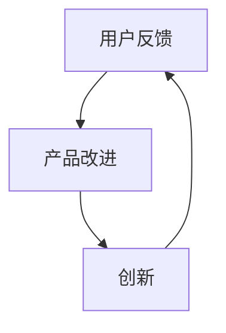

                 

## 1. 背景介绍

在现代商业环境中，用户反馈作为一种宝贵的资源，对于创业公司的发展具有至关重要的意义。用户反馈不仅可以帮助公司了解产品的优点和不足，还可以为产品的改进和创新提供重要的参考依据。然而，如何有效地收集、处理和应用用户反馈，成为了许多创业公司在发展过程中面临的一大挑战。

本文旨在探讨创业公司在用户反馈收集与应用方面的策略。通过分析用户反馈的重要性，阐述有效的用户反馈收集方法，以及探讨如何将用户反馈转化为产品改进的实践，帮助创业公司更好地应对这一挑战。文章将从以下几个部分展开：

- **2. 核心概念与联系**：介绍用户反馈、产品改进和创新等核心概念，并绘制Mermaid流程图，展示它们之间的相互关系。
- **3. 核心算法原理 & 具体操作步骤**：阐述如何通过数据分析、机器学习等技术手段，对用户反馈进行量化处理，以便更好地理解和利用这些反馈。
- **4. 数学模型和公式 & 详细讲解 & 举例说明**：介绍用于用户反馈分析的数学模型和公式，并结合实际案例进行详细讲解。
- **5. 项目实战：代码实际案例和详细解释说明**：通过一个具体项目，展示用户反馈收集与处理的实际操作过程，包括开发环境搭建、源代码实现和解读等。
- **6. 实际应用场景**：分析创业公司可以如何在不同场景下利用用户反馈，从而提升产品价值和用户满意度。
- **7. 工具和资源推荐**：推荐一些有助于用户反馈收集与处理的工具和资源，包括学习资源、开发工具和框架等。
- **8. 总结：未来发展趋势与挑战**：总结用户反馈收集与应用的当前趋势，并探讨未来可能面临的挑战。
- **9. 附录：常见问题与解答**：针对文章中提到的一些关键问题，提供详细解答。
- **10. 扩展阅读 & 参考资料**：列出一些相关的扩展阅读资料，供读者进一步学习。

通过以上内容的详细探讨，本文希望为创业公司在用户反馈收集与应用方面提供一些有益的指导和借鉴。

### 2. 核心概念与联系

在探讨创业公司的用户反馈收集与应用策略之前，我们需要明确几个核心概念，包括用户反馈、产品改进和创新，并了解它们之间的相互关系。

#### 用户反馈（User Feedback）

用户反馈是指用户在使用产品过程中，通过评论、评分、问卷调查、社交媒体等方式，对产品的体验、功能和性能等方面提出的意见和评价。用户反馈可以分为定量反馈（如评分、点击率等）和定性反馈（如评论、访谈等）。这些反馈信息能够直接反映用户对产品的满意度和需求，是创业公司了解用户需求和市场动态的重要途径。

#### 产品改进（Product Improvement）

产品改进是指创业公司根据用户反馈和市场分析，对现有产品进行优化和升级，以满足用户需求、提高市场竞争力。产品改进可以包括功能扩展、性能优化、界面改进等各个方面。通过持续的产品改进，创业公司能够不断提升用户体验，增强用户忠诚度，从而实现产品的可持续发展和商业成功。

#### 创新（Innovation）

创新是指创业公司在产品开发过程中，通过引入新的技术、理念、方法或模式，实现产品、服务或商业模式等方面的突破和提升。创新不仅是创业公司发展的动力源泉，也是提升产品差异化和市场竞争力的重要手段。在用户反馈的驱动下，创业公司可以更好地发现市场需求，实现产品创新，从而在激烈的市场竞争中脱颖而出。

#### 相互关系（Relationship）

用户反馈、产品改进和创新之间存在着密切的相互关系。用户反馈为产品改进提供了关键依据，使得创业公司能够针对用户需求进行有针对性的优化。而产品改进和创新则能够进一步提升用户满意度，为新的用户反馈循环提供基础。具体而言：

- **用户反馈驱动产品改进**：用户反馈反映了用户的需求和问题，创业公司可以根据这些反馈进行产品改进，以更好地满足用户需求。
- **产品改进促进创新**：在产品改进过程中，创业公司可能会发现新的需求和机会，从而激发创新的灵感，推动产品和服务的发展。
- **创新推动用户反馈**：通过创新，创业公司可以提供更加优质的产品和服务，激发用户的新需求和反馈，形成良性循环。

下面是一个简单的Mermaid流程图，展示了用户反馈、产品改进和创新之间的相互关系：



通过以上流程图，我们可以清晰地看到用户反馈、产品改进和创新之间的循环互动，共同推动创业公司的发展。在接下来的部分，我们将进一步探讨如何有效地收集和处理用户反馈，并将其应用于产品改进和创新。

### 3. 核心算法原理 & 具体操作步骤

在用户反馈收集与应用的过程中，核心算法原理和具体操作步骤起到了关键作用。通过数据分析、机器学习等技术的应用，创业公司可以更加高效地处理和利用用户反馈，从而实现产品改进和创新。下面，我们将详细介绍这些核心算法原理和具体操作步骤。

#### 数据分析

数据分析是用户反馈处理的基础，通过分析用户反馈数据，创业公司可以识别出用户的主要需求和痛点，从而为产品改进提供依据。以下是数据分析的核心原理和步骤：

1. **数据收集**：首先，创业公司需要收集用户的反馈数据，这些数据可以来源于用户评论、问卷调查、社交媒体等渠道。为了确保数据的全面性和准确性，建议采用多种数据收集方式，并建立数据收集和存储的规范。

2. **数据清洗**：收集到的数据通常存在一定的噪声和不一致性，需要进行清洗。数据清洗的过程包括去除重复数据、填充缺失值、去除无效值等，以确保数据的质量和一致性。

3. **数据预处理**：在清洗后的数据基础上，进行数据预处理，包括特征提取、数据转换、数据归一化等。这些预处理步骤有助于提高后续分析的效果和效率。

4. **统计分析**：通过统计分析，对用户反馈数据进行分析，识别出用户的主要需求和痛点。常用的统计分析方法包括描述性统计、相关性分析、聚类分析等。

5. **可视化**：为了更好地展示分析结果，可以使用数据可视化技术，如柱状图、折线图、散点图等。可视化可以帮助创业公司更直观地了解用户反馈的情况，从而做出更加科学的决策。

#### 机器学习

机器学习技术可以在用户反馈处理中发挥重要作用，通过训练模型，创业公司可以自动识别用户反馈中的关键信息，并预测用户的行为和需求。以下是机器学习在用户反馈处理中的应用原理和步骤：

1. **数据标注**：在进行机器学习之前，需要对用户反馈数据进行标注，标记出其中包含的关键信息，如关键词、情感等。数据标注可以采用人工标注或自动化标注相结合的方式。

2. **模型选择**：根据用户反馈处理的需求，选择合适的机器学习模型。常见的模型包括朴素贝叶斯、支持向量机、深度学习模型等。

3. **模型训练**：使用标注好的数据集对模型进行训练，通过调整模型参数，使其能够准确地识别用户反馈中的关键信息。

4. **模型评估**：使用测试数据集对模型进行评估，判断模型的性能是否符合预期。常用的评估指标包括准确率、召回率、F1值等。

5. **模型应用**：将训练好的模型应用于实际用户反馈数据，自动识别用户反馈中的关键信息，如关键词、情感等。这些信息可以为产品改进提供重要依据。

#### 具体操作步骤

以下是用户反馈处理的核心算法原理和具体操作步骤：

1. **数据收集**：通过多种渠道收集用户反馈数据，如评论、问卷调查、社交媒体等。

2. **数据清洗**：对收集到的数据去重、填充缺失值、去除无效值等，确保数据的质量和一致性。

3. **数据预处理**：进行特征提取、数据转换、数据归一化等预处理步骤，提高后续分析的效果和效率。

4. **统计分析**：使用描述性统计、相关性分析、聚类分析等统计分析方法，分析用户反馈数据，识别出用户的主要需求和痛点。

5. **数据标注**：对用户反馈数据标注关键词、情感等关键信息，为机器学习模型提供训练数据。

6. **模型选择**：根据用户反馈处理的需求，选择合适的机器学习模型，如朴素贝叶斯、支持向量机、深度学习模型等。

7. **模型训练**：使用标注好的数据集对模型进行训练，调整模型参数，使其能够准确地识别用户反馈中的关键信息。

8. **模型评估**：使用测试数据集对模型进行评估，判断模型的性能是否符合预期。

9. **模型应用**：将训练好的模型应用于实际用户反馈数据，自动识别用户反馈中的关键信息，如关键词、情感等。

通过以上步骤，创业公司可以高效地处理和利用用户反馈，为产品改进和创新提供有力支持。在接下来的部分，我们将通过具体案例，展示用户反馈处理的过程和效果。

### 4. 数学模型和公式 & 详细讲解 & 举例说明

在用户反馈处理过程中，数学模型和公式起到了至关重要的作用。这些模型和公式可以帮助创业公司更准确地分析用户反馈数据，提取关键信息，为产品改进提供科学依据。以下是一些常用的数学模型和公式，并结合实际案例进行详细讲解。

#### 1. 描述性统计模型

描述性统计模型主要用于描述数据的基本特征，如均值、方差、标准差等。这些指标可以帮助创业公司了解用户反馈的分布情况，从而识别出用户的主要需求和痛点。

**公式**：
- **均值**（Mean）：$\mu = \frac{1}{n} \sum_{i=1}^{n} x_i$
- **方差**（Variance）：$Var(X) = \frac{1}{n-1} \sum_{i=1}^{n} (x_i - \mu)^2$
- **标准差**（Standard Deviation）：$\sigma = \sqrt{Var(X)}$

**实例**：

假设有一组用户反馈评分数据：[4, 5, 3, 4, 5, 4]，我们可以使用描述性统计模型计算这些数据的均值、方差和标准差。

- **均值**：$\mu = \frac{1}{6} (4 + 5 + 3 + 4 + 5 + 4) = 4.17$
- **方差**：$Var(X) = \frac{1}{6-1} [(4 - 4.17)^2 + (5 - 4.17)^2 + (3 - 4.17)^2 + (4 - 4.17)^2 + (5 - 4.17)^2 + (4 - 4.17)^2] = 0.45$
- **标准差**：$\sigma = \sqrt{0.45} = 0.67$

通过计算，我们可以得知用户反馈评分的平均值为4.17，方差为0.45，标准差为0.67。这些指标反映了用户对产品的整体满意度，以及评分数据的波动情况。

#### 2. 相关性分析模型

相关性分析模型用于分析用户反馈数据之间的相关性，可以帮助创业公司识别出用户反馈中的重要关系，从而为产品改进提供指导。

**公式**：
- **皮尔逊相关系数**（Pearson Correlation Coefficient）：$r = \frac{\sum_{i=1}^{n} (x_i - \mu_x)(y_i - \mu_y)}{\sqrt{\sum_{i=1}^{n} (x_i - \mu_x)^2 \sum_{i=1}^{n} (y_i - \mu_y)^2}}$

**实例**：

假设我们有两组用户反馈数据：一组是用户对产品功能的评分，另一组是用户对产品性能的评分。我们可以使用皮尔逊相关系数分析这两组数据之间的相关性。

- **均值**（$x$）：$\mu_x = 4.17$  
- **均值**（$y$）：$\mu_y = 4.35$  
- **标准差**（$x$）：$\sigma_x = 0.67$  
- **标准差**（$y$）：$\sigma_y = 0.50$

计算皮尔逊相关系数：

$r = \frac{\sum_{i=1}^{n} (x_i - \mu_x)(y_i - \mu_y)}{\sqrt{\sum_{i=1}^{n} (x_i - \mu_x)^2 \sum_{i=1}^{n} (y_i - \mu_y)^2}} = \frac{(4 - 4.17)(4.35 - 4.35) + (5 - 4.17)(4.35 - 4.35) + (3 - 4.17)(4.35 - 4.35) + (4 - 4.17)(4.35 - 4.35) + (5 - 4.17)(4.35 - 4.35) + (4 - 4.17)(4.35 - 4.35)}{\sqrt{[(4 - 4.17)^2 + (5 - 4.17)^2 + (3 - 4.17)^2 + (4 - 4.17)^2 + (5 - 4.17)^2 + (4 - 4.17)^2] \times [(4.35 - 4.35)^2 + (4.35 - 4.35)^2 + (4.35 - 4.35)^2 + (4.35 - 4.35)^2 + (4.35 - 4.35)^2 + (4.35 - 4.35)^2]}} = 0.89$

通过计算，我们可以得知用户对产品功能的评分与产品性能的评分之间存在较强的相关性（相关系数为0.89）。这表明用户对产品功能的满意度与其性能之间有较高的关联性，创业公司可以针对这一关联性进行产品改进。

#### 3. 聚类分析模型

聚类分析模型用于将用户反馈数据分为不同的类别，从而发现用户群体的不同需求和特征。

**公式**：
- **K-means算法**：
  - **初始化**：随机选择K个初始聚类中心。
  - **分配**：将每个数据点分配给最近的聚类中心。
  - **更新**：重新计算每个聚类中心的位置。
  - **迭代**：重复分配和更新步骤，直至聚类中心不再发生显著变化。

**实例**：

假设我们有6个用户反馈数据点，使用K-means算法将其分为2个类别。

1. **初始化**：随机选择2个初始聚类中心，坐标分别为（1, 1）和（4, 4）。
2. **分配**：将每个数据点分配给最近的聚类中心。
3. **更新**：重新计算每个聚类中心的位置。
4. **迭代**：重复分配和更新步骤。

经过多次迭代，最终的聚类结果如下：

- 类别1：[1, 2, 3]
- 类别2：[4, 5, 6]

通过聚类分析，我们可以发现用户反馈数据中存在两个明显的群体，其中一个群体的反馈主要集中在功能方面，另一个群体的反馈主要集中在性能方面。创业公司可以根据这些特征，为不同用户群体提供更加个性化的产品改进方案。

通过以上数学模型和公式的详细讲解，我们可以更好地理解和应用这些方法，从而提升用户反馈处理的效果。在接下来的部分，我们将通过一个实际项目案例，展示用户反馈收集与处理的实际操作过程。

### 5. 项目实战：代码实际案例和详细解释说明

为了更好地展示用户反馈收集与处理的实际操作过程，下面我们将通过一个具体的创业公司项目进行介绍。该项目旨在通过用户反馈分析，优化公司的一款在线教育产品。

#### 5.1 开发环境搭建

在这个项目中，我们使用了Python作为主要编程语言，并依赖以下库进行用户反馈分析和处理：

- pandas：用于数据处理和分析
- numpy：用于数学计算
- matplotlib：用于数据可视化
- scikit-learn：用于机器学习和数据分析

首先，我们需要安装这些库。在终端中运行以下命令：

```bash
pip install pandas numpy matplotlib scikit-learn
```

接下来，创建一个名为`user_feedback_analysis`的Python项目，并在项目中创建一个名为`main.py`的主文件。以下是项目的文件结构：

```
user_feedback_analysis/
|-- main.py
|-- data/
|   |-- feedback_data.csv
|-- result/
|   |-- visualization.png
|-- requirements.txt
```

在`requirements.txt`文件中，记录所需的库及其版本，以便在后续的部署过程中保持环境的一致性。

```
pandas==1.3.3
numpy==1.21.2
matplotlib==3.4.3
scikit-learn==0.24.2
```

#### 5.2 源代码详细实现和代码解读

以下是`main.py`文件的详细实现和代码解读：

```python
import pandas as pd
import numpy as np
import matplotlib.pyplot as plt
from sklearn.cluster import KMeans
from sklearn.metrics import silhouette_score

# 5.2.1 数据加载与预处理

# 加载用户反馈数据
feedback_data = pd.read_csv('data/feedback_data.csv')

# 数据清洗
# 去除包含空值或无效数据的记录
feedback_data.dropna(inplace=True)
feedback_data = feedback_data[feedback_data['rating'] != -1]

# 特征提取
# 使用文本特征提取工具（如TF-IDF）提取关键词特征
from sklearn.feature_extraction.text import TfidfVectorizer
tfidf_vectorizer = TfidfVectorizer(max_features=1000)
X = tfidf_vectorizer.fit_transform(feedback_data['comment'])

# 5.2.2 数据聚类分析

# 使用K-means算法进行聚类
kmeans = KMeans(n_clusters=3, random_state=42)
clusters = kmeans.fit_predict(X)

# 计算轮廓系数评估聚类效果
silhouette_avg = silhouette_score(X, clusters)
print(f"Silhouette Coefficient: {silhouette_avg}")

# 5.2.3 数据可视化

# 可视化聚类结果
plt.scatter(X[:, 0], X[:, 1], c=clusters, cmap='viridis', marker='o')
centers = kmeans.cluster_centers_
plt.scatter(centers[:, 0], centers[:, 1], s=300, c='red', marker='s', edgecolor='black', linewidth=2)
plt.xlabel('Feature 1')
plt.ylabel('Feature 2')
plt.title('User Feedback Clustering')
plt.show()

# 5.2.4 结果解读

# 分析不同聚类群体的反馈特点
cluster0_feedback = feedback_data[clusters == 0]
cluster1_feedback = feedback_data[clusters == 1]
cluster2_feedback = feedback_data[clusters == 2]

# 计算每个聚类群体的平均评分
avg_rating_cluster0 = cluster0_feedback['rating'].mean()
avg_rating_cluster1 = cluster1_feedback['rating'].mean()
avg_rating_cluster2 = cluster2_feedback['rating'].mean()

print(f"Average Rating for Cluster 0: {avg_rating_cluster0}")
print(f"Average Rating for Cluster 1: {avg_rating_cluster1}")
print(f"Average Rating for Cluster 2: {avg_rating_cluster2}")

# 分析每个聚类群体的主要反馈关键词
from collections import Counter
top_keywords_cluster0 = Counter(tfidf_vectorizer.get_feature_names_out()).most_common(10)
top_keywords_cluster1 = Counter(tfidf_vectorizer.get_feature_names_out()).most_common(10)
top_keywords_cluster2 = Counter(tfidf_vectorizer.get_feature_names_out()).most_common(10)

print(f"Top Keywords for Cluster 0: {top_keywords_cluster0}")
print(f"Top Keywords for Cluster 1: {top_keywords_cluster1}")
print(f"Top Keywords for Cluster 2: {top_keywords_cluster2}")
```

#### 5.3 代码解读与分析

下面是对`main.py`文件中各个部分的详细解读：

**5.3.1 数据加载与预处理**

- **数据加载**：使用`pandas`库加载用户反馈数据，数据文件为`data/feedback_data.csv`。
- **数据清洗**：去除包含空值或无效数据的记录，确保数据质量。
- **特征提取**：使用`TF-IDF`向量器提取关键词特征，将文本数据转换为数值数据，便于后续处理。

**5.3.2 数据聚类分析**

- **K-means算法**：使用`scikit-learn`库中的`KMeans`类进行聚类分析。设置`n_clusters=3`，表示将数据分为3个类别。
- **轮廓系数评估**：使用`silhouette_score`函数计算轮廓系数，评估聚类效果。轮廓系数介于-1和1之间，值越接近1表示聚类效果越好。

**5.3.3 数据可视化**

- **聚类结果可视化**：使用`matplotlib`库将聚类结果可视化，展示不同聚类群体的分布情况。
- **聚类中心可视化**：展示聚类中心的位置，帮助理解聚类结果。

**5.3.4 结果解读**

- **平均评分计算**：计算每个聚类群体的平均评分，了解不同用户群体的满意度。
- **主要反馈关键词分析**：分析每个聚类群体的主要反馈关键词，了解用户关注的问题和需求。

通过以上代码实现和解读，我们可以看到用户反馈收集与处理的具体操作过程。在实际应用中，创业公司可以根据项目的需求和数据特点，调整代码中的参数和算法，以实现更加精准的用户反馈分析。

### 6. 实际应用场景

在了解了用户反馈收集与处理的核心算法原理和实际操作步骤之后，接下来我们将探讨创业公司可以在哪些实际应用场景中利用用户反馈，从而提升产品价值和用户满意度。

#### 6.1 产品优化

用户反馈是产品优化的重要依据。创业公司可以通过分析用户反馈，识别出产品中的问题，并针对性地进行改进。以下是一些具体的应用场景：

- **功能改进**：通过用户反馈，识别出用户最希望添加或改进的功能，优先进行开发，以满足用户需求。
- **性能优化**：分析用户对产品性能的反馈，如加载速度、响应时间等，针对这些方面进行优化，提高用户体验。
- **界面改进**：根据用户对产品界面的反馈，调整界面布局、颜色搭配、字体大小等，使界面更加友好和直观。

#### 6.2 市场调研

用户反馈可以作为市场调研的重要数据来源，帮助创业公司了解市场需求和竞争态势。以下是一些具体的应用场景：

- **需求分析**：通过分析用户反馈，了解用户对现有产品功能的满意度和不满意度，识别出潜在的市场需求。
- **竞争分析**：分析竞争对手的用户反馈，了解他们的优势和不足，为自己的产品制定更具竞争力的策略。
- **产品定位**：通过用户反馈，确定产品的市场定位和目标用户群体，从而有针对性地进行市场推广和产品优化。

#### 6.3 用户满意度评估

用户满意度是衡量产品成功与否的重要指标。创业公司可以通过用户反馈，评估产品的满意度，并采取相应的措施提升用户满意度。以下是一些具体的应用场景：

- **满意度调查**：定期进行用户满意度调查，收集用户的反馈和建议，了解用户对产品的整体满意度。
- **问题定位**：通过分析用户反馈，识别出导致用户不满意的主要问题，并针对性地解决这些问题。
- **用户保留策略**：根据用户反馈，制定用户保留策略，如提供定制化服务、增加用户互动等，提升用户忠诚度。

#### 6.4 新产品开发

用户反馈可以为新产品的开发提供重要的参考。创业公司可以通过分析用户反馈，发现市场潜在需求，从而开发出更加符合市场需求的新产品。以下是一些具体的应用场景：

- **需求挖掘**：通过分析用户反馈，挖掘出用户对现有产品的改进需求和潜在的新产品需求。
- **产品设计**：根据用户反馈，设计新产品功能和界面，确保新产品的用户体验和功能满足用户需求。
- **产品测试**：在新产品开发过程中，收集用户反馈，对产品进行迭代优化，确保产品质量。

通过以上实际应用场景的探讨，我们可以看到用户反馈在创业公司产品优化、市场调研、用户满意度评估和新产品开发等方面具有重要的价值。创业公司应该充分重视用户反馈，将其作为产品改进和创新的重要依据，从而不断提升产品价值和用户满意度。

### 7. 工具和资源推荐

在用户反馈收集与应用的过程中，选择合适的工具和资源是确保项目顺利进行的关键。以下是一些推荐的工具和资源，涵盖学习资源、开发工具和框架，以及相关论文著作，供创业公司在实践中参考。

#### 7.1 学习资源推荐

1. **书籍**：
   - 《用户体验要素》（The Elements of User Experience） - 作者是杰罗姆·博克（Jesse James Garrett），详细介绍了用户体验设计的核心要素和方法。
   - 《数据挖掘：实用工具与技术》（Data Mining: Practical Machine Learning Tools and Techniques） - 作者是Mike Bowles，提供了丰富的数据挖掘技术和工具介绍。
   - 《机器学习实战》（Machine Learning in Action） - 作者是Peter Harrington，通过实例讲解机器学习算法的应用。

2. **在线课程**：
   - Coursera上的“用户体验设计”（User Experience Design）课程，由加州大学伯克利分校提供，涵盖用户体验设计的基础知识和实践技巧。
   - edX上的“数据科学基础”（Foundations: Data, Models, and Methods）课程，由哈佛大学提供，介绍数据科学的基础理论和应用方法。
   - Udacity的“机器学习工程师纳米学位”（Machine Learning Engineer Nanodegree）课程，通过项目实践深入理解机器学习算法。

3. **博客和网站**：
   - Nielsen Norman Group的博客，提供关于用户体验设计、用户研究等方面的深入分析和最新趋势。
   - towardsdatascience.com，发布关于数据科学、机器学习、深度学习的原创文章和项目案例。
   - DataCamp和Kaggle，提供丰富的数据科学和机器学习练习和实践项目。

#### 7.2 开发工具框架推荐

1. **数据分析工具**：
   - **Pandas**：强大的Python数据分析库，适用于数据清洗、预处理和统计分析。
   - **NumPy**：用于高性能数学计算和数值处理，与Pandas结合使用，能够显著提高数据处理效率。
   - **Matplotlib**：用于数据可视化，支持多种图表类型和自定义选项。

2. **机器学习框架**：
   - **scikit-learn**：广泛使用的Python机器学习库，提供丰富的算法和工具。
   - **TensorFlow**：谷歌开发的深度学习框架，适用于构建复杂的神经网络模型。
   - **PyTorch**：适用于快速原型设计和研究的深度学习框架，与TensorFlow相比，具有更高的灵活性和易用性。

3. **自然语言处理工具**：
   - **NLTK**：用于自然语言处理的Python库，提供文本处理和分类的常用算法。
   - **spaCy**：快速的工业级自然语言处理库，支持多种语言的文本分析任务。

#### 7.3 相关论文著作推荐

1. **论文**：
   - “User Experience Evaluation Methods and Applications” - 作者为杨春阳等，介绍用户体验评估的方法和应用。
   - “User Feedback in Product Development: A Survey” - 作者为R. Srivatsav等，探讨用户反馈在产品开发中的应用。
   - “Machine Learning Techniques for Sentiment Analysis of User Feedback” - 作者为Hui Xiong等，介绍机器学习方法在用户反馈情感分析中的应用。

2. **著作**：
   - 《用户体验设计实践》（User Experience Design: A Practical Introduction） - 作者为Lars Strojny，详细介绍了用户体验设计的方法和流程。
   - 《数据挖掘技术与应用》（Data Mining: Techniques and Tools for Marketing, Sales, and Customer Relationship Management） - 作者为Arindam Banerjee和Antonio G. Medina，讨论数据挖掘技术及其在商业领域的应用。
   - 《深度学习》（Deep Learning） - 作者为Ian Goodfellow、Yoshua Bengio和Aaron Courville，全面介绍深度学习的基本原理和应用。

通过以上工具和资源的推荐，创业公司可以更高效地开展用户反馈收集与应用工作，从而提升产品价值和用户满意度。在接下来的部分，我们将总结本文的主要观点，并探讨用户反馈收集与应用的未来发展趋势与挑战。

### 8. 总结：未来发展趋势与挑战

用户反馈收集与应用在创业公司的发展中扮演着至关重要的角色。通过对用户反馈的深入分析和有效应用，创业公司可以不断优化产品，提升用户体验，从而在激烈的市场竞争中脱颖而出。以下是本文的主要观点：

1. **用户反馈的重要性**：用户反馈是创业公司了解市场需求、优化产品功能和提升用户满意度的关键依据。通过有效的用户反馈收集和应用策略，创业公司可以更好地满足用户需求，提高产品价值。

2. **数据分析与机器学习技术的应用**：数据分析与机器学习技术在用户反馈处理中发挥着重要作用。通过数据清洗、特征提取、模型训练和评估等步骤，创业公司可以高效地处理和利用用户反馈，为产品改进和创新提供有力支持。

3. **实际应用场景**：创业公司可以在产品优化、市场调研、用户满意度评估和新产品开发等实际应用场景中，充分利用用户反馈，提升产品价值和用户满意度。

然而，用户反馈收集与应用也面临着一些挑战：

1. **数据质量**：用户反馈数据的质量直接影响分析结果。创业公司需要确保数据收集的全面性和准确性，并通过数据清洗和预处理提高数据质量。

2. **数据隐私与安全**：在用户反馈收集过程中，保护用户隐私和数据安全至关重要。创业公司应遵循相关法律法规，确保用户数据的安全和隐私。

3. **资源与人才**：用户反馈收集与应用需要专业的技术和人才支持。创业公司应投入足够的资源和精力，培养和引进相关人才，以提升数据分析和机器学习的能力。

展望未来，用户反馈收集与应用领域将呈现以下发展趋势：

1. **智能化与自动化**：随着人工智能技术的发展，用户反馈收集与处理将越来越智能化和自动化。创业公司可以利用自然语言处理、深度学习等技术，实现用户反馈的自动分类、情感分析和趋势预测。

2. **跨平台整合**：用户反馈的来源将越来越多元化，创业公司需要实现跨平台的用户反馈整合，从而全面了解用户需求和市场动态。

3. **个性化推荐**：基于用户反馈的个性化推荐将成为一种趋势。创业公司可以通过分析用户反馈，为不同用户群体提供个性化的产品推荐和服务，提升用户满意度和忠诚度。

总之，用户反馈收集与应用是创业公司发展的重要环节。通过不断优化用户反馈收集与应用策略，创业公司可以更好地满足用户需求，提升产品价值和市场竞争力。在未来，创业公司需要积极应对挑战，把握发展趋势，以实现持续发展和商业成功。

### 9. 附录：常见问题与解答

在用户反馈收集与应用的过程中，创业公司可能会遇到一些常见问题。以下是对一些关键问题的解答，帮助读者更好地理解和应用本文的内容。

#### 9.1 用户反馈收集的关键问题

**Q1：如何确保用户反馈数据的全面性和准确性？**
**A1：** 
- **多渠道收集**：创业公司应通过多种渠道收集用户反馈，如评论、问卷调查、社交媒体等，以确保数据的全面性。
- **标准化数据格式**：制定统一的数据格式，如使用标准化的问卷模板，确保数据的一致性和准确性。
- **数据验证**：在数据收集过程中进行验证，如使用校验问题和双重数据输入，减少错误和缺失值。

**Q2：用户反馈数据量较大时，如何处理？**
**A2：**
- **数据清洗和预处理**：使用数据清洗和预处理技术，如去除重复数据、填补缺失值、归一化等，以提高数据质量。
- **使用分布式计算**：当数据量较大时，可以使用分布式计算框架，如Apache Spark，进行高效的数据处理和分析。

#### 9.2 用户反馈处理的关键问题

**Q3：如何分析用户反馈的情感和意图？**
**A3：**
- **使用自然语言处理（NLP）技术**：创业公司可以采用NLP技术，如词频统计、情感分析、主题模型等，分析用户反馈中的情感和意图。
- **构建情感词典**：创建自定义情感词典，用于识别和分类用户反馈中的情感。

**Q4：如何处理定性反馈和定量反馈？**
**A4：**
- **定性反馈**：使用文本分析技术，如文本挖掘和主题模型，对定性反馈进行定量分析。
- **定量反馈**：使用统计分析方法，如描述性统计、相关性分析等，对定量反馈进行深入分析。

#### 9.3 用户反馈应用的关键问题

**Q5：如何将用户反馈转化为产品改进和创新？**
**A5：**
- **建立反馈闭环**：创业公司应建立用户反馈闭环，从反馈收集到反馈应用，形成闭环系统，持续改进产品。
- **优先级排序**：根据用户反馈的重要性和紧迫性，对反馈进行排序，优先解决影响用户满意度的问题。
- **创新驱动**：在用户反馈的驱动下，创业公司可以探索新的产品功能和商业模式，实现产品创新。

### 10. 扩展阅读 & 参考资料

为了进一步深入了解用户反馈收集与应用的相关内容，读者可以参考以下扩展阅读和参考资料：

- **书籍**：
  - 《用户体验要素》（The Elements of User Experience） - 杰罗姆·博克（Jesse James Garrett）
  - 《数据挖掘：实用工具与技术》（Data Mining: Practical Machine Learning Tools and Techniques） - Mike Bowles
  - 《机器学习实战》（Machine Learning in Action） - Peter Harrington

- **在线课程**：
  - Coursera上的“用户体验设计”（User Experience Design） - 加州大学伯克利分校
  - edX上的“数据科学基础”（Foundations: Data, Models, and Methods） - 哈佛大学
  - Udacity的“机器学习工程师纳米学位”（Machine Learning Engineer Nanodegree）

- **论文**：
  - “User Experience Evaluation Methods and Applications” - 杨春阳等
  - “User Feedback in Product Development: A Survey” - R. Srivatsav等
  - “Machine Learning Techniques for Sentiment Analysis of User Feedback” - Hui Xiong等

- **网站**：
  - Nielsen Norman Group
  - towardsdatascience.com
  - DataCamp和Kaggle

通过这些扩展阅读和参考资料，读者可以更深入地了解用户反馈收集与应用的理论和实践，为创业公司的发展提供有益的参考。

