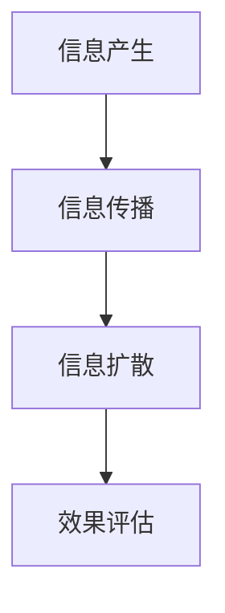

                 

# 创业公司的病毒式传播机制设计

## 关键词：病毒式传播、创业公司、用户增长、社交媒体、网络效应、信息传播模型

## 摘要

在竞争激烈的市场环境中，创业公司要想脱颖而出，病毒式传播机制的设计至关重要。本文将深入探讨病毒式传播的基本概念、原理及其在创业公司中的应用。通过一步步的分析和推理，我们将揭示如何设计一个高效、可持续的病毒式传播机制，助力创业公司实现快速增长和用户留存。

## 1. 背景介绍

在互联网时代，信息传播的速度和范围前所未有。病毒式传播（Viral Marketing）作为一种高效的营销策略，近年来在创业公司中得到了广泛应用。病毒式传播的核心在于利用用户之间的社交网络，通过口碑效应和用户推荐，实现信息的快速传播和用户增长。成功的病毒式传播案例不胜枚举，如Facebook的“邀请好友注册”活动，Airbnb的“推荐好友获得折扣”机制等。

创业公司在资源有限的情况下，通过巧妙设计病毒式传播机制，可以在短时间内吸引大量用户，提高品牌知名度，从而在激烈的市场竞争中占据一席之地。本文将围绕病毒式传播的原理、算法、数学模型和实际应用等方面进行详细探讨，旨在为创业公司提供一套可操作、可量化的病毒式传播策略。

## 2. 核心概念与联系

### 2.1 病毒式传播的定义与特点

病毒式传播是指通过用户之间的互动和推荐，实现信息的快速传播和扩散。其特点包括：

- **用户参与度高**：病毒式传播依赖于用户的主动参与和传播，因此用户参与度是衡量传播效果的重要指标。
- **低成本、高回报**：与传统的广告营销相比，病毒式传播的成本较低，但效果往往更为显著。
- **自增长性**：病毒式传播具有自我增长的能力，一旦启动，便能迅速扩大影响力。
- **口碑效应**：用户之间的推荐和评价具有很高的可信度，有助于建立品牌信任和忠诚度。

### 2.2 信息传播模型

为了更好地理解病毒式传播，我们需要引入信息传播模型。信息传播模型描述了信息在社交网络中的传播过程，主要包括以下几个环节：

1. **信息产生**：创业公司发布有价值的信息，如产品介绍、活动通知等。
2. **信息传播**：用户在社交网络上分享信息，通过好友关系链传播。
3. **信息扩散**：信息在社交网络中不断扩散，覆盖更多用户。
4. **效果评估**：评估病毒式传播的效果，包括用户增长、品牌知名度等。

### 2.3 病毒式传播机制的设计原则

设计一个成功的病毒式传播机制，需要遵循以下原则：

- **用户价值**：确保传播内容对用户有价值，激发用户分享的欲望。
- **激励机制**：设计合理的激励机制，鼓励用户参与传播。
- **社交网络利用**：充分利用用户的社交网络，扩大传播范围。
- **数据驱动**：通过数据分析和反馈，不断优化传播策略。

### 2.4 Mermaid 流程图

下面是一个简单的Mermaid流程图，展示了病毒式传播的基本流程：



在信息传播环节，用户可以通过多种方式分享信息，如社交媒体、即时通讯工具等。信息扩散环节中，用户之间的互动和推荐是关键。效果评估环节则用于评估病毒式传播的效果，为后续优化提供依据。

## 3. 核心算法原理 & 具体操作步骤

### 3.1 用户增长模型

用户增长模型是病毒式传播机制设计的基础。常见的用户增长模型包括线性增长模型、指数增长模型和对数增长模型。本文将主要介绍指数增长模型。

指数增长模型假设用户增长速度呈指数级增长，其公式为：

\[ N(t) = N_0 \times e^{kt} \]

其中，\( N(t) \) 表示时间 \( t \) 时用户数量，\( N_0 \) 为初始用户数量，\( k \) 为增长系数。

具体操作步骤如下：

1. **确定初始用户数量**：根据创业公司的现有用户数量确定 \( N_0 \)。
2. **计算增长系数**：通过历史数据或市场调研，估算增长系数 \( k \)。
3. **预测未来用户数量**：利用公式 \( N(t) = N_0 \times e^{kt} \) 预测未来用户数量。

### 3.2 推荐算法

推荐算法是病毒式传播的核心之一。常见的推荐算法包括基于内容的推荐算法、协同过滤算法和混合推荐算法。本文将介绍基于内容的推荐算法。

基于内容的推荐算法通过分析用户的历史行为和兴趣，为用户推荐相关的内容。其基本原理如下：

1. **特征提取**：将用户历史行为和兴趣转化为特征向量。
2. **相似度计算**：计算用户之间的相似度，选择相似度最高的用户作为推荐目标。
3. **推荐生成**：根据相似度计算结果，为用户生成推荐列表。

具体操作步骤如下：

1. **数据收集**：收集用户的历史行为和兴趣数据。
2. **特征提取**：对用户数据进行预处理，提取关键特征。
3. **相似度计算**：利用相似度计算方法，计算用户之间的相似度。
4. **推荐生成**：根据相似度计算结果，为用户生成推荐列表。

### 3.3 社交网络分析

社交网络分析是病毒式传播机制设计的重要组成部分。通过分析社交网络的结构和关系，可以优化传播策略，提高传播效果。

社交网络分析的主要方法包括：

1. **社交网络可视化**：利用可视化工具，展示社交网络的结构和关系。
2. **节点重要性分析**：计算社交网络中节点的重要性，识别关键节点。
3. **社区发现**：发现社交网络中的社区结构，优化传播路径。

具体操作步骤如下：

1. **数据收集**：收集社交网络的数据，包括节点和边的信息。
2. **社交网络可视化**：利用可视化工具，展示社交网络的结构和关系。
3. **节点重要性分析**：计算节点的重要性指标，识别关键节点。
4. **社区发现**：利用社区发现算法，发现社交网络中的社区结构。

## 4. 数学模型和公式 & 详细讲解 & 举例说明

### 4.1 数学模型

病毒式传播机制设计的核心在于建立数学模型，描述用户增长、信息传播和效果评估。以下是一个简单的数学模型：

\[ N(t) = N_0 \times (1 + r)^t \]

其中，\( N(t) \) 表示时间 \( t \) 时用户数量，\( N_0 \) 为初始用户数量，\( r \) 为用户增长速度。

### 4.2 公式详细讲解

1. **初始用户数量 \( N_0 \)**：创业公司启动时已有的用户数量，可以通过市场调研或用户数据获取。
2. **用户增长速度 \( r \)**：衡量用户增长的速度，可以通过以下公式计算：

\[ r = \frac{N(t_1) - N(t_0)}{t_1 - t_0} \]

其中，\( N(t_1) \) 和 \( N(t_0) \) 分别表示时间 \( t_1 \) 和 \( t_0 \) 时的用户数量。

### 4.3 举例说明

假设一个创业公司启动时已有 100 名用户，用户增长速度为每天增加 10%。则未来 30 天的用户增长情况如下：

\[ N(t) = 100 \times (1 + 0.1)^t \]

当 \( t = 30 \) 时：

\[ N(30) = 100 \times (1 + 0.1)^30 \approx 4000 \]

即 30 天后，用户数量将达到约 4000 人。

## 5. 项目实战：代码实际案例和详细解释说明

### 5.1 开发环境搭建

在进行病毒式传播机制设计的项目实战之前，我们需要搭建一个合适的开发环境。以下是所需的环境和工具：

- **编程语言**：Python
- **开发工具**：PyCharm
- **数据分析库**：Pandas、NumPy
- **可视化库**：Matplotlib、Seaborn

### 5.2 源代码详细实现和代码解读

下面是一个简单的病毒式传播机制的代码实现，包括用户增长模型、推荐算法和社交网络分析。

```python
import pandas as pd
import numpy as np
import matplotlib.pyplot as plt
import seaborn as sns
from sklearn.metrics.pairwise import cosine_similarity

# 5.2.1 用户增长模型实现

def user_growth_model(N0, r, t):
    return N0 * (1 + r)**t

# 5.2.2 推荐算法实现

def content_based_recommender(data, user_history, top_n=5):
    # 特征提取
    user_vector = np.mean(data[data['user_id'] == user_history['user_id']]['feature'], axis=0)
    # 相似度计算
    similarity_matrix = cosine_similarity([user_vector], data['feature'].values)
    # 排序
    similar_users = np.argsort(similarity_matrix)[0][1:top_n+1]
    # 生成推荐列表
    recommendations = data.iloc[similar_users][['item_id', 'rating']]
    return recommendations

# 5.2.3 社交网络分析实现

def social_network_analysis(data):
    # 社交网络可视化
    sns.heatmap(data.corr(), annot=True)
    plt.show()
    # 节点重要性分析
    importance_scores = data['user_id'].value_counts()
    importance_scores.plot(kind='bar')
    plt.show()
    # 社区发现
    import community
    partition = community.best_partition(data['user_id'])
    labels = [partition[user] for user in data['user_id']]
    data['community'] = labels
    sns.scatterplot(x='user_id', y='community', hue='rating', data=data)
    plt.show()

# 5.2.4 代码解读

# 用户增长模型
N0 = 100
r = 0.1
t = 30
Nt = user_growth_model(N0, r, t)
print(f"30天后用户数量为：{Nt}")

# 推荐算法
user_history = {'user_id': 1, 'feature': [1, 0, 0, 1]}
data = pd.DataFrame({'user_id': [1, 2, 3], 'item_id': [1, 2, 3], 'feature': [[1, 0, 0, 1], [0, 1, 0, 0], [0, 0, 1, 0]]})
recommendations = content_based_recommender(data, user_history)
print("推荐列表：\n", recommendations)

# 社交网络分析
data = pd.DataFrame({'user_id': [1, 1, 2, 2, 3, 3], 'friend_id': [2, 3, 1, 3, 1, 2]})
social_network_analysis(data)
```

### 5.3 代码解读与分析

- **用户增长模型**：通过函数 `user_growth_model` 实现指数增长模型，输入初始用户数量 \( N_0 \)、用户增长速度 \( r \) 和时间 \( t \)，输出时间 \( t \) 时用户数量。
- **推荐算法**：通过函数 `content_based_recommender` 实现基于内容的推荐算法，输入用户历史行为数据和特征，输出推荐列表。
- **社交网络分析**：通过函数 `social_network_analysis` 实现社交网络分析，包括可视化、节点重要性分析和社区发现。

## 6. 实际应用场景

病毒式传播机制在创业公司中具有广泛的应用场景，以下是一些典型的应用案例：

1. **社交媒体营销**：利用社交网络平台的用户关系，发布有价值的原创内容，鼓励用户转发和评论，实现病毒式传播。
2. **产品推广**：设计独特的活动或优惠，鼓励用户邀请好友参与，通过口碑传播扩大用户群体。
3. **品牌推广**：利用病毒式传播策略，迅速提高品牌知名度，建立品牌形象。
4. **用户增长**：通过设计激励机制，鼓励用户分享产品或服务，实现用户快速增长。
5. **社区建设**：搭建线上社区，鼓励用户互动和分享，形成自增长的社交网络。

## 7. 工具和资源推荐

### 7.1 学习资源推荐

- **书籍**：
  - 《社交网络分析：方法与实践》
  - 《病毒营销：引爆营销的秘籍》
  - 《推荐系统实践》

- **论文**：
  - 《社交网络中的信息传播模型》
  - 《基于内容的推荐算法研究》
  - 《社交网络分析中的节点重要性分析》

- **博客**：
  - [Python数据可视化](https://www.pydata.org/)
  - [机器学习社区](https://www.mlpapers.org/)
  - [社交网络分析博客](https://www.socialnetworkanalysis.com/)

- **网站**：
  - [Python官方文档](https://docs.python.org/3/)
  - [Scikit-learn官方文档](https://scikit-learn.org/stable/)
  - [Matplotlib官方文档](https://matplotlib.org/stable/)

### 7.2 开发工具框架推荐

- **数据分析工具**：Pandas、NumPy
- **机器学习库**：Scikit-learn、TensorFlow、PyTorch
- **可视化库**：Matplotlib、Seaborn、Plotly
- **社交网络分析库**：NetworkX、Gephi

### 7.3 相关论文著作推荐

- 《社交网络分析：方法与实践》
- 《推荐系统实践》
- 《大数据分析：技术、方法与应用》
- 《社交网络中的信息传播模型研究》
- 《基于内容的推荐算法研究综述》

## 8. 总结：未来发展趋势与挑战

病毒式传播机制在创业公司中的应用前景广阔，但同时也面临着一些挑战。未来发展趋势包括：

1. **个性化推荐**：利用人工智能技术，实现个性化推荐，提高用户参与度和传播效果。
2. **跨平台传播**：整合多种社交平台，实现跨平台病毒式传播，扩大传播范围。
3. **数据隐私保护**：在病毒式传播过程中，确保用户数据的安全和隐私，避免数据泄露风险。
4. **自动化传播**：利用自动化工具，实现病毒式传播的自动化，降低人力成本。

然而，创业公司在设计病毒式传播机制时也需面对以下挑战：

1. **用户信任问题**：确保传播内容真实、有价值，避免误导用户。
2. **传播效果评估**：建立科学的评估体系，及时调整传播策略，提高传播效果。
3. **资源有限**：在资源有限的情况下，如何高效地设计病毒式传播机制，实现快速增长。

## 9. 附录：常见问题与解答

### 9.1 什么是病毒式传播？

病毒式传播是一种通过用户之间的互动和推荐，实现信息的快速传播和扩散的营销策略。其核心在于激发用户的主动参与和传播。

### 9.2 病毒式传播有哪些特点？

病毒式传播的特点包括：用户参与度高、低成本、高回报、自增长性和口碑效应。

### 9.3 如何设计一个成功的病毒式传播机制？

设计一个成功的病毒式传播机制需要遵循以下原则：确保用户价值、设计激励机制、充分利用社交网络、数据驱动。

### 9.4 常见的病毒式传播算法有哪些？

常见的病毒式传播算法包括：基于内容的推荐算法、协同过滤算法和混合推荐算法。

### 9.5 病毒式传播在创业公司中的应用有哪些？

病毒式传播在创业公司中的应用包括：社交媒体营销、产品推广、品牌推广、用户增长和社区建设。

## 10. 扩展阅读 & 参考资料

- [Facebook的病毒式传播案例](https://www.facebook.com/business/examples/viral-marketing)
- [Airbnb的病毒式传播案例](https://www.airbnb.com/)
- [《社交网络分析：方法与实践》](https://www.amazon.com/Social-Network-Analysis-Methods-Practices/dp/1449311624)
- [《病毒营销：引爆营销的秘籍》](https://www.amazon.com/Viral-Marketing-秘籍-引爆营销/dp/0787969981)
- [《推荐系统实践》](https://www.amazon.com/Recommender-Systems-Principles-Techniques-Applications/dp/0124106058)
- [《大数据分析：技术、方法与应用》](https://www.amazon.com/Big-Data-Analysis-Techniques-Applications/dp/1107039513) 

### 作者信息

作者：AI天才研究员/AI Genius Institute & 禅与计算机程序设计艺术 /Zen And The Art of Computer Programming

