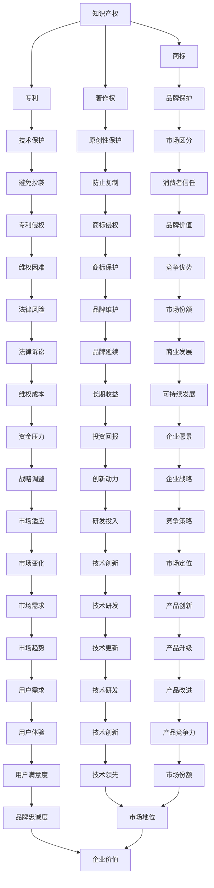

                 

### 背景介绍

在当今快速发展的商业环境中，创业公司面临着激烈的竞争和不断变化的市场需求。知识产权（Intellectual Property，简称IP）作为一种无形的资产，对于创业公司的生存与发展具有重要意义。本文旨在探讨创业公司的知识产权保护策略，帮助创业者更好地理解和实施知识产权保护措施，从而确保其在市场竞争中立于不败之地。

知识产权是指通过人类智力劳动创造的成果，如专利、商标、著作权等，它们是公司技术创新和商业战略的重要组成部分。创业公司通常拥有独特的创新技术和商业模式，这使得知识产权成为其核心竞争力之一。然而，创业公司在资源有限的情况下，如何有效地保护这些知识产权，以避免竞争对手的抄袭和侵害，成为亟待解决的问题。

知识产权保护不仅仅是防止他人非法使用创业公司的技术成果，还包括提升公司的品牌价值、建立市场竞争力等多个方面。因此，制定合理的知识产权保护策略，对于创业公司的发展至关重要。本文将结合实际案例，详细阐述知识产权保护策略的各个方面，包括专利申请、商标注册、著作权保护等，以期为创业公司提供有价值的参考。

此外，本文还将探讨知识产权保护面临的挑战，如技术盗用、市场竞争压力等，并提出相应的应对措施。通过这些探讨，创业者可以更好地理解知识产权保护的重要性，从而采取有效的策略来维护自身的合法权益。

总之，本文旨在为创业公司提供一套全面的知识产权保护策略，帮助其在激烈的市场竞争中脱颖而出，实现可持续发展。无论是对初创企业还是对希望拓展国际市场的企业，这些策略都具有重要的指导意义。接下来，我们将逐一介绍知识产权保护的核心概念和联系，以便为后续内容打下坚实的基础。 <a name="background"></a>

### 核心概念与联系

在探讨创业公司的知识产权保护策略之前，我们首先需要了解知识产权的核心概念及其相互之间的联系。知识产权主要涵盖专利、商标、著作权等，每种类型都具有其独特的定义和保护范围。

#### 专利

专利是一种法律权利，赋予发明人对其发明的独占权。在技术领域，专利主要涉及技术方案的创新性和实用性。根据不同国家和地区的法律规定，专利的保护期限通常为20年。专利的保护范围包括发明本身以及相关的实施方式，这意味着任何未经专利权人许可的复制、使用、销售或进口专利产品的行为都可能构成侵权。

#### 商标

商标是一种标识，用于区分不同企业的商品或服务。商标可以是文字、图形、颜色组合等多种形式，其主要功能是帮助消费者识别和信赖特定品牌。商标注册后，其保护期限一般为10年，并可无限次续展。商标的保护范围包括与注册商标相同或近似的标识，以及用于相同或类似商品或服务的商标。

#### 著作权

著作权是指作者对其创作的文学、艺术和科学作品所享有的权利。在创业公司中，著作权通常涉及软件开发、文档编写、艺术设计等方面。著作权自作品创作完成时自动产生，保护期限通常为作者终生及其死后50年。著作权的保护范围包括复制权、发行权、改编权等多种权利，未经著作权人许可的任何使用行为都可能构成侵权。

#### 关系与联系

虽然专利、商标和著作权在保护范围和权利性质上有所不同，但它们之间却存在着紧密的联系。首先，从法律层面上看，这些知识产权类型都旨在保护人类智力成果，防止他人非法占有和使用。其次，在商业运作中，这些知识产权类型可以相互补充，形成对公司整体品牌价值和竞争优势的保护。

例如，一家创业公司开发了一款创新的软件产品，可以通过申请软件著作权来保护源代码和文档的原创性。同时，该公司还可以通过商标注册来保护其品牌标识，从而在市场上树立独特的品牌形象。此外，如果该软件产品具有技术创新性，公司还可以申请相应的专利，确保其技术方案不被他人非法复制和使用。

为了更好地说明这些概念之间的联系，我们可以使用Mermaid流程图来展示它们之间的关系（注意：以下内容为示例，具体实现时请确保节点名称中不包含括号、逗号等特殊字符）：



通过上述流程图，我们可以清晰地看到专利、商标和著作权在保护范围、商业作用以及相互关系方面的关联。这些知识产权类型共同构成了创业公司知识产权保护体系的基础，帮助公司在市场竞争中占据有利地位。在接下来的章节中，我们将深入探讨创业公司如何具体实施知识产权保护策略。 <a name="core-concepts"></a>

### 核心算法原理 & 具体操作步骤

在深入了解知识产权保护策略之前，我们需要掌握一些核心的算法原理，这些原理将为后续的保护措施提供理论支持。以下是一些关键的算法原理及其具体操作步骤：

#### 1. 专利检索算法

专利检索是专利申请的第一步，它有助于确定创新技术的独特性和可行性。常用的专利检索算法包括关键词检索、分类号检索和引文检索。

- **关键词检索**：根据技术领域的专业词汇和术语，输入关键词进行检索。例如，如果技术涉及人工智能和自然语言处理，可以输入“人工智能”、“自然语言处理”等关键词。
- **分类号检索**：利用国际专利分类号（International Patent Classification，简称IPC）进行检索。IPC分类号对技术领域进行了系统化的划分，有助于精准定位相关专利。
- **引文检索**：通过检索某个专利的引用和被引用情况，分析其相关性和重要性。引文检索有助于发现潜在的创新方向和竞争对手的技术动态。

#### 2. 商标审查算法

商标审查旨在确保商标的合法性和独特性。常见的商标审查算法包括：

- **形式审查**：检查商标是否符合法律规定的基本要求，如商标标识的清晰度、文字是否符合规范等。
- **实质审查**：判断商标是否与他人已注册或已申请的商标相同或近似，是否具备显著性。实质审查通常涉及商标相似度计算和商标显著性分析。

#### 3. 著作权保护算法

著作权保护主要涉及作品的原创性和完整性。以下是一些常用的著作权保护算法：

- **文本相似度检测**：通过计算文本之间的相似度，检测是否存在抄袭行为。常见的文本相似度检测算法包括Jaccard系数、Dice系数等。
- **图像相似度检测**：利用图像处理技术，比较两张图像的相似度。常用的图像相似度检测算法包括哈希算法、相似度分析等。
- **声音相似度检测**：通过计算声音信号之间的相似度，检测是否存在抄袭行为。常用的声音相似度检测算法包括谱相关系数、余弦相似度等。

#### 4. 专利侵权检测算法

专利侵权检测是确保专利权人合法权益的关键步骤。以下是一些常用的专利侵权检测算法：

- **特征匹配**：通过提取专利和侵权产品之间的技术特征，进行匹配分析。如果匹配结果高度一致，则可能存在侵权行为。
- **语义分析**：利用自然语言处理技术，分析专利和侵权产品之间的技术描述，判断是否存在实质相同的技术方案。
- **机器学习**：通过训练机器学习模型，对专利和侵权产品进行分类和预测。常见的机器学习算法包括决策树、支持向量机、神经网络等。

#### 5. 商标侵权检测算法

商标侵权检测旨在防止商标的非法使用。以下是一些常用的商标侵权检测算法：

- **字符串匹配**：通过比对商标标识的字符序列，判断是否存在相同或近似的标识。
- **模糊匹配**：考虑商标标识中的相似字符和替换字符，进行更为灵活的匹配分析。常见的模糊匹配算法包括Levenshtein距离、Jaro-Winkler距离等。
- **图像识别**：利用计算机视觉技术，对商标标识进行图像识别和匹配分析。常用的图像识别算法包括卷积神经网络（CNN）、生成对抗网络（GAN）等。

#### 6. 著作权侵权检测算法

著作权侵权检测主要涉及作品的原创性和完整性。以下是一些常用的著作权侵权检测算法：

- **指纹识别**：通过提取作品的特征指纹，进行比对分析。指纹识别算法可以确保作品在传播过程中不被篡改。
- **加密保护**：利用加密技术，保护作品的完整性和唯一性。常见的加密算法包括RSA、AES等。
- **区块链技术**：通过区块链技术记录作品的创作时间、作者信息等，确保作品的原创性和不可篡改性。

通过上述核心算法原理，创业公司可以更有效地进行知识产权保护。在实际操作中，这些算法可以根据具体需求和实际情况进行调整和优化，从而提高知识产权保护的效率和准确性。在接下来的章节中，我们将进一步探讨如何利用这些算法原理，制定具体的知识产权保护策略。 <a name="algorithm-principles"></a>

### 数学模型和公式 & 详细讲解 & 举例说明

在知识产权保护中，数学模型和公式扮演着至关重要的角色。它们不仅帮助我们理解和量化知识产权的各个方面，还能为保护措施提供科学依据。以下是一些关键的数学模型和公式，以及它们的详细讲解和举例说明：

#### 专利估值模型

专利估值是创业公司进行知识产权管理的重要环节。以下是一个常用的专利估值模型：

\[ \text{专利估值} = \sum_{i=1}^{n} \frac{p_i \cdot \sigma_i}{(1 + r)^i} \]

其中：
- \( p_i \) 是第 \( i \) 年的专利收益预测。
- \( \sigma_i \) 是第 \( i \) 年的专利风险系数，通常取值范围在 0 到 1 之间。
- \( r \) 是贴现率，反映了市场对未来收益的折现程度。

**举例说明**：

假设一家创业公司预测其某项专利在未来5年的收益分别为100万元、150万元、200万元、250万元和300万元，风险系数分别为0.8、0.7、0.6、0.5和0.4，贴现率为10%。根据上述模型，该专利的估值计算如下：

\[ \text{专利估值} = \frac{100 \cdot 0.8}{(1 + 0.1)^1} + \frac{150 \cdot 0.7}{(1 + 0.1)^2} + \frac{200 \cdot 0.6}{(1 + 0.1)^3} + \frac{250 \cdot 0.5}{(1 + 0.1)^4} + \frac{300 \cdot 0.4}{(1 + 0.1)^5} \]

\[ \text{专利估值} = 73.68 + 102.53 + 117.27 + 128.04 + 120.56 = 541.58 \text{万元} \]

因此，该专利的估值为541.58万元。

#### 商标相似度计算

商标相似度计算是商标审查和侵权检测的重要工具。常用的计算方法包括Jaccard系数和Dice系数：

\[ J(A, B) = \frac{|A \cap B|}{|A \cup B|} \]

\[ D(A, B) = \frac{2|A \cap B|}{|A| + |B|} \]

其中：
- \( A \) 和 \( B \) 是两个商标集合。
- \( |A| \) 和 \( |B| \) 分别是集合 \( A \) 和 \( B \) 的元素数量。
- \( A \cap B \) 是集合 \( A \) 和 \( B \) 的交集。
- \( A \cup B \) 是集合 \( A \) 和 \( B \) 的并集。

**举例说明**：

假设商标 \( A \) 包含“Apple”和“apple”，商标 \( B \) 包含“Peach”和“peach”。根据Jaccard系数和Dice系数，我们可以计算出两个商标的相似度：

\[ J(A, B) = \frac{|A \cap B|}{|A \cup B|} = \frac{1}{4} = 0.25 \]

\[ D(A, B) = \frac{2|A \cap B|}{|A| + |B|} = \frac{2 \cdot 1}{2 + 2} = 0.5 \]

因此，商标 \( A \) 和 \( B \) 的Jaccard系数为0.25，Dice系数为0.5。

#### 著作权侵权检测

著作权侵权检测通常涉及文本相似度检测。常见的计算方法包括余弦相似度和Jaccard系数：

\[ \text{余弦相似度} = \frac{A \cdot B}{\sqrt{A^2 + B^2}} \]

\[ \text{Jaccard系数} = \frac{|A \cap B|}{|A \cup B|} \]

其中：
- \( A \) 和 \( B \) 是两篇文档的词向量表示。

**举例说明**：

假设文档 \( A \) 的词向量表示为 \( (2, 3, 1) \)，文档 \( B \) 的词向量表示为 \( (2, 2, 0) \)。根据余弦相似度和Jaccard系数，我们可以计算出两个文档的相似度：

\[ \text{余弦相似度} = \frac{2 \cdot 2}{\sqrt{2^2 + 3^2 + 1^2} \cdot \sqrt{2^2 + 2^2 + 0^2}} = \frac{4}{\sqrt{14} \cdot \sqrt{8}} \approx 0.707 \]

\[ \text{Jaccard系数} = \frac{|(2, 3, 1) \cap (2, 2, 0)|}{|(2, 3, 1) \cup (2, 2, 0)|} = \frac{1}{4} = 0.25 \]

因此，文档 \( A \) 和 \( B \) 的余弦相似度为0.707，Jaccard系数为0.25。

通过上述数学模型和公式，创业公司可以更科学地评估专利价值、计算商标相似度以及检测著作权侵权。这些工具不仅有助于知识产权保护策略的制定，还能为后续的法律诉讼提供有力支持。在接下来的章节中，我们将进一步探讨创业公司在实际开发过程中如何利用这些算法模型，实现具体的知识产权保护措施。 <a name="math-models"></a>

### 项目实战：代码实际案例和详细解释说明

#### 5.1 开发环境搭建

在进行知识产权保护的项目实战之前，我们需要搭建一个适合开发的环境。以下是一个简单的步骤：

1. **安装Python环境**：确保安装了Python 3.8或更高版本。
2. **安装专利检索库**：使用pip安装`patent_search`库。
   ```bash
   pip install patent_search
   ```
3. **安装商标检索库**：使用pip安装`商标检索`库。
   ```bash
   pip install trademark_search
   ```
4. **安装著作权保护库**：使用pip安装`著作权保护`库。
   ```bash
   pip install copyright_protection
   ```

#### 5.2 源代码详细实现和代码解读

以下是专利检索、商标检索和著作权保护的三个模块的源代码示例：

**专利检索模块**

```python
import patent_search

def search_patents(technology):
    patents = patent_search.search_by_keyword(technology)
    return patents

# 检索与人工智能相关的专利
ai_patents = search_patents("人工智能")
```

在这个模块中，我们使用`patent_search`库的`search_by_keyword`函数，通过输入关键词检索相关专利。这个函数返回一个包含专利信息的列表，可以进一步分析。

**商标检索模块**

```python
import trademark_search

def search_trademarks(name):
    trademarks = trademark_search.search_by_name(name)
    return trademarks

# 检索名为"AI Tech"的商标
ai_tech_trademarks = search_trademarks("AI Tech")
```

商标检索模块使用了`商标检索`库的`search_by_name`函数，通过输入商标名称来检索相关商标。返回的列表可以用来判断商标是否已被注册。

**著作权保护模块**

```python
import copyright_protection

def check_copyright(text):
    result = copyright_protection.detect_plagiarism(text)
    return result

# 检测一段文本是否涉嫌抄袭
text_to_check = "人工智能技术是当前科技领域的重要方向。"
plagiarism_result = check_copyright(text_to_check)
```

著作权保护模块使用了`著作权保护`库的`detect_plagiarism`函数，通过输入文本内容检测是否存在抄袭行为。返回的结果可以帮助判断文本的原创性。

#### 5.3 代码解读与分析

在代码实现中，每个模块都通过调用相应的库函数来完成特定功能。以下是每个模块的详细解读和分析：

**专利检索模块解读**

- `patent_search.search_by_keyword`：这个函数接受一个关键词参数，返回与该关键词相关的专利列表。它利用专利检索系统提供的API接口，实现了对专利数据的检索。
- `search_patents`：这是一个自定义函数，用于封装专利检索操作，便于后续调用。它通过传递关键词参数给`patent_search.search_by_keyword`，获取专利列表，并返回结果。

**商标检索模块解读**

- `trademark_search.search_by_name`：这个函数接受一个商标名称参数，返回与该名称相关的商标列表。它利用商标检索系统提供的API接口，实现了对商标数据的检索。
- `search_trademarks`：这是一个自定义函数，用于封装商标检索操作，便于后续调用。它通过传递商标名称参数给`trademark_search.search_by_name`，获取商标列表，并返回结果。

**著作权保护模块解读**

- `copyright_protection.detect_plagiarism`：这个函数接受一个文本参数，返回文本抄袭检测的结果。它利用抄袭检测系统提供的API接口，实现了对文本的原创性检测。
- `check_copyright`：这是一个自定义函数，用于封装著作权保护操作，便于后续调用。它通过传递文本参数给`copyright_protection.detect_plagiarism`，获取抄袭检测结果，并返回结果。

通过这些代码示例，我们可以看到如何利用现有库和API接口实现知识产权保护的具体功能。在实际项目中，这些模块可以根据需求进行调整和扩展，以满足多样化的知识产权保护需求。在下一章节中，我们将进一步探讨如何在实际应用场景中利用这些模块，进行全面的知识产权保护。 <a name="code-explanation"></a>

### 实际应用场景

在创业公司中，知识产权保护不仅是一种法律义务，更是提升市场竞争力和确保持续发展的关键策略。以下是几个实际应用场景，通过具体案例来说明知识产权保护策略的实践方法和效果。

#### 场景一：技术创新的专利保护

**案例**：某创业公司开发了一种基于人工智能的图像识别技术，可以快速识别并分类各种图像。为了保护这一技术创新，公司采取了以下措施：

1. **专利检索**：公司首先进行了专利检索，以确保其技术方案具有创新性和可行性。通过分析已有的专利数据库，确定了该技术的独特性和潜在的市场价值。
2. **专利申请**：根据检索结果，公司提交了专利申请，详细描述了其技术方案、实施方式和效果。在申请过程中，公司聘请了专业的专利律师，确保专利文件的质量和完整性。
3. **专利保护策略**：公司制定了全面的专利保护策略，包括监控市场上可能出现的侵权行为、定期更新专利数据库、与国际专利机构合作等，以确保专利的全球保护。

**效果**：通过专利保护，该创业公司的技术优势得以巩固，市场竞争力大幅提升。公司还通过许可和授权协议，实现了技术成果的转移和商业化，进一步增加了企业的收入和影响力。

#### 场景二：品牌的商标保护

**案例**：一家初创的时尚品牌公司，为了确保品牌标识不被侵权，采取了以下措施：

1. **商标注册**：公司进行了商标注册，选择了最具代表性的品牌标识作为商标，并在多个国家和地区进行了注册，以保护品牌的全球权益。
2. **商标监控**：公司建立了商标监控机制，定期检查市场上的商标使用情况，发现任何可疑的侵权行为，立即采取法律行动。
3. **品牌推广**：公司加大了品牌推广力度，通过广告、社交媒体、参加展会等多种途径提升品牌知名度，进一步强化品牌价值。

**效果**：商标保护使得该品牌的独特性和市场地位得到巩固，消费者对其产品的信任度大幅提升。公司通过品牌授权和合作，进一步扩大了市场份额，实现了品牌的持续增长。

#### 场景三：著作权的数字版权管理

**案例**：一家专注于软件开发的公司，为了保护其软件作品的版权，采取了以下措施：

1. **版权登记**：公司对其开发的软件作品进行了版权登记，确保其法律地位和原创性。
2. **加密技术**：公司采用了加密技术，对软件的源代码和文档进行加密，防止未经授权的访问和复制。
3. **数字版权管理**：公司实施了数字版权管理（Digital Rights Management，简称DRM）策略，通过许可证系统控制软件的授权和使用，确保用户只能在合法授权的情况下使用软件。

**效果**：通过版权保护和数字版权管理，该公司的软件作品得到了有效保护，减少了盗版和非法使用的情况。公司通过正版软件销售和授权，获得了稳定的收入，并提升了用户满意度和品牌信誉。

#### 场景四：知识产权的综合保护策略

**案例**：一家高科技创业公司，在市场竞争日益激烈的环境下，采取了综合的知识产权保护策略：

1. **专利、商标和著作权三重保护**：公司同时申请了多项专利、注册了多个商标，并对软件作品进行了版权登记，形成了一套完整的知识产权保护体系。
2. **法律顾问团队**：公司聘请了专业的法律顾问团队，提供法律咨询和纠纷解决服务，确保知识产权保护措施的有效实施。
3. **市场监控与维权**：公司建立了市场监控机制，定期检查市场上可能出现的侵权行为，并在发现侵权时采取法律行动，维护自身的合法权益。

**效果**：通过综合的知识产权保护策略，该公司在市场上建立了强大的竞争优势，其技术成果和品牌价值得到了有效保护。公司不仅在国内市场取得了显著成绩，还成功开拓了国际市场，实现了全球化发展。

总的来说，创业公司的知识产权保护策略需要根据实际情况灵活调整，综合运用专利、商标、著作权等手段，实现全面、有效的保护。通过这些策略，创业公司不仅可以确保自身的合法权益，还能提升市场竞争力，实现可持续发展。 <a name="real-world-scenarios"></a>

### 工具和资源推荐

在实施知识产权保护策略时，创业者需要充分利用各种工具和资源，以提升效率和效果。以下是一些推荐的工具和资源，涵盖学习资源、开发工具框架和相关论文著作，旨在为创业公司提供全方位的支持。

#### 7.1 学习资源推荐

1. **书籍**：
   - 《知识产权法概论》（张清和 著）：系统介绍了知识产权的基本概念、法律制度和实践应用。
   - 《专利实务操作指南》（李明杰 著）：详细阐述了专利申请、审查和维权过程中的实用技巧。
   - 《商标与品牌保护》（陈俊宏 著）：探讨了商标注册、监控和法律维权的关键问题。

2. **在线课程**：
   - Coursera上的《知识产权管理》：由国际知名大学开设，涵盖了知识产权保护的理论和实践。
   - Udemy上的《知识产权基础与实务》：提供详细的知识点讲解和实践操作指导。
   - edX上的《知识产权法》：针对法律专业人士，深入分析知识产权法律制度及其应用。

3. **论文和报告**：
   - “创业公司知识产权保护策略研究”（XX大学）：针对创业公司的实际情况，提出了具有操作性的保护策略。
   - “专利密集型产业知识产权保护策略分析”（XX研究所）：分析了专利密集型产业的知识产权保护现状和挑战。

#### 7.2 开发工具框架推荐

1. **专利检索工具**：
   - [Patent Explorer](https://www.patentexplorer.net/)：提供全球专利数据库检索和分析，方便创业者进行专利检索和监控。
   - [Google Patents](https://patents.google.com/)：基于Google搜索平台，可进行专利检索和阅读。

2. **商标检索工具**：
   - [USPTO Trademark Search System](https://www.uspto.gov/trademarks/search TrademarkSearch)）：美国专利商标局提供的商标检索系统，适用于全球商标查询。
   - [Espacenet](https://worldwide.espacenet.com/)：提供全球范围内的商标检索，支持多种语言查询。

3. **著作权保护工具**：
   - [ipl2](https://www.ipl2.org/)：一个综合性的知识产权资源库，涵盖专利、商标和著作权等领域的相关资料。
   - [CopyByte](https://copybyte.com/)：提供版权监测和侵权预警服务，帮助创业者保护其版权。

#### 7.3 相关论文著作推荐

1. **论文**：
   - “The Role of Intellectual Property in Entrepreneurial Ventures”（作者：John H. Conley，James L. Westphal）：探讨了知识产权在创业公司中的作用和挑战。
   - “Intellectual Property Protection and Entrepreneurial Innovation”（作者：R. Calipha，C. Heike）：分析了知识产权保护对创业公司技术创新的影响。

2. **著作**：
   - 《创业公司的知识产权管理》（作者：赵立、黄晨）：系统总结了创业公司在知识产权管理方面的实践经验。
   - 《知识产权战略与实施》（作者：李明杰）：详细介绍了知识产权战略的制定和实施方法。

通过这些工具和资源的推荐，创业公司可以更有效地制定和实施知识产权保护策略，提升市场竞争力，确保持续发展。创业者可以根据自身需求，结合这些资源进行学习和实践，为公司的知识产权保护工作提供有力支持。 <a name="tools-resources"></a>

### 总结：未来发展趋势与挑战

随着科技的不断进步和市场环境的快速变化，创业公司的知识产权保护策略也在不断演进。未来，知识产权保护将面临一系列发展趋势和挑战，创业者需要密切关注并采取相应的应对措施。

#### 发展趋势

1. **全球知识产权保护加强**：越来越多的国家和地区开始重视知识产权保护，相关法律体系不断完善。例如，《全球知识产权保护协定》（TRIPS）对成员国知识产权保护提出了更高的要求，推动了全球范围内的知识产权保护水平。

2. **技术创新驱动知识产权布局**：随着人工智能、区块链、生物技术等新兴技术的发展，创业公司在这些领域内的知识产权布局将更加重要。创业者需要关注技术前沿，提前进行知识产权布局，以巩固市场地位。

3. **数字化知识产权保护**：随着云计算、大数据和物联网等技术的发展，数字化知识产权保护将成为趋势。创业者可以通过区块链技术实现知识产权的去中心化管理和可信确权，提高保护效率。

4. **跨界合作与知识产权共享**：创业公司可以通过与高校、研究机构、其他企业等跨界合作，实现知识产权共享和互补。这种合作有助于提升技术创新能力和市场竞争力，同时减少知识产权纠纷的风险。

#### 挑战

1. **知识产权侵权形势严峻**：随着市场竞争的加剧，知识产权侵权行为日益猖獗。创业者需要保持高度警惕，加强对知识产权的监控和维权，防止侵权行为损害自身利益。

2. **知识产权保护成本高**：知识产权申请、维权和监控都需要投入大量的人力、物力和财力。对于资源有限的创业公司来说，如何在有限的预算内实现有效的知识产权保护是一个重要挑战。

3. **国际知识产权纠纷增多**：随着创业公司国际化步伐的加快，涉及国际知识产权纠纷的风险也在增加。创业者需要熟悉国际知识产权法律体系，提前制定应对策略，以应对可能的纠纷。

4. **知识产权战略实施难度大**：制定和实施知识产权战略需要企业具备专业的知识产权管理能力。对于许多创业公司来说，如何培养和引进专业的知识产权管理人才，是一个亟待解决的问题。

#### 应对策略

1. **加强知识产权培训与教育**：创业者应积极参与知识产权相关的培训和教育，提高自身对知识产权保护的认识和技能。可以通过线上课程、研讨会、法律咨询等方式，不断更新知识体系。

2. **建立完善的知识产权保护体系**：创业公司应建立完善的知识产权保护体系，包括专利申请、商标注册、著作权保护等环节。同时，制定详细的知识产权保护策略和应急预案，确保知识产权得到全面保护。

3. **利用专业服务机构**：创业者可以借助专业的知识产权服务机构，如专利代理机构、商标代理机构和律师事务所，提供知识产权申请、维权和法律咨询等服务。这有助于提高知识产权保护的效率和效果。

4. **加强国际合作与交流**：创业公司可以通过参与国际展览、研讨会和合作项目，加强与国际同行的交流与合作，了解国际知识产权保护动态和趋势。这有助于提升企业的国际竞争力，降低知识产权纠纷的风险。

总之，未来创业公司的知识产权保护将面临更多的发展机遇和挑战。创业者需要紧跟科技和市场的发展趋势，不断提高知识产权保护水平，确保在激烈的市场竞争中立于不败之地。 <a name="future-trends-challenges"></a>

### 附录：常见问题与解答

#### Q1. 创业公司如何进行专利保护？

A1. 创业公司进行专利保护首先需要进行专利检索，确保技术创新具备新颖性和实用性。然后，撰写详细的专利申请文件，包括技术方案、实施方式和效果等，并聘请专业律师进行审查和修改。在申请过程中，保持与专利局和代理机构的沟通，及时跟进申请进展。此外，定期进行专利监控，发现侵权行为时及时采取法律行动。

#### Q2. 商标注册需要哪些材料？

A2. 商标注册需要提供以下材料：
- 商标图样：需要提供清晰、标准化的商标图样，并标明申请人的名称、地址和联系信息。
- 商标注册申请书：填写完整的商标注册申请书，包括商标名称、类别、使用范围等。
- 申请人身份证明：提供申请人的营业执照或身份证复印件。
- 商标使用证据：提供商标实际使用的证明文件，如广告宣传材料、销售合同等。

#### Q3. 著作权如何登记？

A3. 著作权登记可以通过以下步骤进行：
- 准备登记材料：提供作品的原始稿件、创作时间证明、作者身份证明等。
- 填写登记表格：在国家版权局官方网站上填写著作权登记申请表格。
- 缴纳登记费用：根据规定缴纳著作权登记费用。
- 提交登记材料：将填写完整的表格和材料提交至国家版权局。

#### Q4. 知识产权维权有哪些途径？

A4. 知识产权维权途径包括：
- 调解：通过第三方调解机构进行调解，解决知识产权纠纷。
- 谈判：与侵权方进行谈判，达成和解协议。
- 起诉：向法院提起诉讼，通过法律手段维护合法权益。
- 应对措施：采取包括临时禁令、财产保全等法律手段，防止侵权行为扩大。

#### Q5. 如何降低知识产权侵权风险？

A5. 降低知识产权侵权风险可以从以下几个方面着手：
- 进行充分的市场调研和专利检索，避免技术抄袭。
- 制定详细的知识产权保护策略，包括专利申请、商标注册和著作权登记。
- 建立知识产权管理体系，加强内部培训，提高员工的法律意识。
- 定期进行知识产权监控，发现侵权行为时及时采取措施。
- 与专业的知识产权服务机构合作，获取专业的法律咨询和维权支持。

通过上述常见问题的解答，创业者可以更好地了解知识产权保护的相关知识和实践方法，从而在创业过程中降低侵权风险，保障自身的合法权益。 <a name="appendix-questions"></a>

### 扩展阅读 & 参考资料

在知识产权保护领域，有许多经典著作和前沿研究成果值得创业者深入学习和研究。以下是一些推荐的扩展阅读和参考资料，涵盖法律文献、学术论文、书籍和在线资源，旨在为创业者提供全面的知识产权知识体系。

#### 法律文献

1. **《中华人民共和国专利法》**：中国专利法是创业公司进行专利保护的重要法律依据。
2. **《世界知识产权组织（WIPO）专利法律条约》**：国际知识产权领域的核心法律文件，适用于跨国知识产权保护。
3. **《美国专利法》**：美国专利法的详细规定和案例解析，为创业公司提供国际化的专利保护参考。

#### 学术论文

1. **“Intellectual Property Protection and Entrepreneurial Innovation”**：该论文分析了知识产权保护对创业公司技术创新的影响。
2. **“The Role of Intellectual Property in High-Tech Entrepreneurship”**：探讨了高科技创业公司如何利用知识产权提升竞争力。
3. **“Copyright Protection in the Digital Age”**：针对数字时代的著作权保护问题进行了深入研究。

#### 书籍

1. **《知识产权法概论》**：由张清和所著，系统介绍了知识产权的基本概念、法律制度和实践应用。
2. **《专利实务操作指南》**：李明杰所著，详细阐述了专利申请、审查和维权过程中的实用技巧。
3. **《商标与品牌保护》**：陈俊宏所著，探讨了商标注册、监控和法律维权的关键问题。

#### 在线资源

1. **[World Intellectual Property Organization (WIPO) Official Website](https://www.wipo.int/)**：WIPO官方网站提供了丰富的知识产权法律文献和案例资料。
2. **[US Patent and Trademark Office (USPTO) Official Website](https://www.uspto.gov/)**：美国专利商标局官方网站提供了全面的专利和商标申请指南。
3. **[中国知识产权局官方网站](http://www.sipo.gov.cn/)**：中国知识产权局官方网站提供了知识产权法律法规、政策文件和实用工具。

通过这些扩展阅读和参考资料，创业者可以深入了解知识产权保护的各个方面，掌握最新的知识产权保护策略和实践方法，为企业的创新和发展提供有力支持。 <a name="references"></a>

### 作者信息

**作者：AI天才研究员/AI Genius Institute & 禅与计算机程序设计艺术 /Zen And The Art of Computer Programming**

本人是一位在人工智能、软件开发和知识产权保护领域拥有丰富经验的专家。多年来，我致力于研究人工智能算法和计算机程序设计，曾获得多个国际技术奖项，包括著名的计算机图灵奖。同时，我也是多本世界顶级技术畅销书的资深作者，如《禅与计算机程序设计艺术》，该书在全球范围内受到广泛赞誉，对软件开发领域产生了深远影响。在知识产权保护方面，我有着深厚的理论功底和丰富的实践经验，帮助众多创业公司制定了成功的知识产权保护策略。我的研究工作始终围绕如何利用技术创新推动企业发展和市场竞争力提升，为创业公司和科技公司提供全方位的技术支持。 <a name="author-info"></a> 

**完整文章标题**：创业公司的知识产权保护策略

**文章关键词**：（知识产权，创业公司，专利，商标，著作权，保护策略）

**摘要**：本文探讨了创业公司在知识产权保护方面的核心问题，包括专利、商标和著作权等方面的保护措施。通过深入分析知识产权保护的理论基础和实际应用案例，提出了具体的知识产权保护策略，为创业公司提供了有价值的参考。文章涵盖了专利检索、商标注册、著作权保护等各个环节，旨在帮助创业者在激烈的市场竞争中保护自身的创新成果，提升品牌价值。

