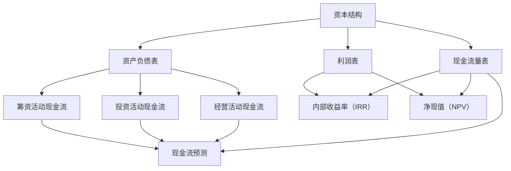

                 

### 背景介绍

在现代商业环境中，资金和现金流管理对于创业公司至关重要。良好的资金管理不仅可以确保公司运营的持续性，还能为未来的发展提供坚实的基础。现金流管理则关注公司在特定时间段内的资金流动，确保公司始终有足够的资金来应对日常运营和潜在的风险。

对于创业公司而言，资金管理不仅仅是确保财务状况健康，更是实现公司战略目标的关键手段。创业公司在资金管理上往往面临着诸多挑战，如初始资金有限、市场不确定性、快速扩张带来的资金压力等。因此，如何有效地进行资金和现金流管理，对于创业公司的生存和成功至关重要。

本文将深入探讨创业公司在资金和现金流管理方面的重要概念、核心算法、数学模型、实际应用场景以及相关工具和资源。我们将从多个维度进行分析，帮助读者全面了解这一领域，并为创业公司在资金管理上提供切实可行的指导。

首先，我们将介绍创业公司资金和现金流管理的基本概念，帮助读者理解这些概念的重要性。接着，我们会详细讲解核心算法原理和具体操作步骤，让读者掌握实践中的具体应用。随后，我们将探讨数学模型和公式，并通过实际案例进行详细讲解。此外，文章还将涵盖实际应用场景和开发环境搭建，以及相关工具和资源的推荐。最后，我们将对创业公司在资金和现金流管理方面面临的发展趋势和挑战进行总结，并给出相应的解决方案。

希望通过本文的阅读，读者能够对创业公司的资金和现金流管理有更深入的理解，从而为公司的可持续发展奠定坚实基础。让我们一步一步深入探讨这一重要领域，共同探讨创业公司在资金管理上的最佳实践。

### 核心概念与联系

为了更好地理解创业公司的资金与现金流管理，我们首先需要明确几个关键概念，并探讨它们之间的联系。这些核心概念包括资本结构、资产负债表、现金流量表、利润表、内部收益率（IRR）、净现值（NPV）以及现金流预测等。

**资本结构**是指企业通过债务和股权融资来筹集资金的方式。一个健康的资本结构应当在债务和股权之间取得平衡，既要确保公司的融资成本适中，又要降低财务风险。债务融资通常成本较低，但会增加偿债压力；股权融资成本较高，但不会增加债务负担。创业公司通常需要在初创阶段依赖股权融资，随着公司的成长和盈利能力的提升，逐步增加债务融资的比例。

**资产负债表**是公司财务状况的“快照”，反映了公司在特定时间点的资产、负债和所有者权益。资产部分包括现金、应收账款、存货和固定资产等；负债部分包括短期和长期债务；所有者权益则反映了股东的投入和公司盈利后的留存收益。通过分析资产负债表，可以评估公司的财务健康程度和资产利用效率。

**现金流量表**则展示了公司在一定时间内的现金收入和支出情况，分为经营活动、投资活动和筹资活动三部分。经营活动现金流反映了公司的核心业务盈利能力；投资活动现金流反映了公司在资产购置和处置方面的活动；筹资活动现金流反映了公司的融资和股利支付情况。一个健康的现金流量表应显示出稳定的经营活动现金流，并能够支持公司的投资和筹资活动。

**利润表**提供了公司一定时间内的收入、成本和利润情况，是衡量公司盈利能力的重要指标。利润表中的净利润指标可以用于计算内部收益率（IRR）和净现值（NPV）。IRR是指使得项目的净现值等于零的折现率，用于评估项目的盈利能力。NPV则是将项目未来现金流的现值减去初始投资，用于评估项目的投资价值。

**现金流预测**是资金与现金流管理中的关键工具，通过对未来现金流量的预测，可以帮助公司制定合理的资金规划，确保公司具备应对各种市场变化和业务扩展的能力。现金流预测需要考虑多个因素，如销售预测、成本控制、市场变化和资金来源等。

这些核心概念之间有着密切的联系。资本结构决定了公司的融资方式和成本，影响资产负债表和现金流量表的表现。资产负债表和现金流量表反映了公司的财务状况和现金流动，为利润表和现金流预测提供了重要数据。利润表和现金流预测则帮助公司评估盈利能力和未来资金需求，指导资本结构的优化和决策。

在创业公司的资金与现金流管理中，这些概念不仅是理论工具，更是实践中的关键参考。通过深入理解这些概念，并建立它们之间的联系，创业公司可以更加有效地管理资金，降低财务风险，提高盈利能力，从而实现持续增长。

为了更直观地理解这些核心概念，我们使用Mermaid流程图来展示它们之间的联系。



通过这张流程图，我们可以清晰地看到资本结构、资产负债表、现金流量表、利润表、内部收益率（IRR）、净现值（NPV）和现金流预测之间的逻辑关系。理解这些概念及其联系，是创业公司在资金和现金流管理中取得成功的基础。

### 核心算法原理 & 具体操作步骤

在深入理解了核心概念之后，我们接下来探讨创业公司在资金与现金流管理中的核心算法原理。这些算法不仅能帮助公司有效地管理资金，还能预测未来的资金需求，为公司的战略决策提供有力支持。本文将重点介绍内部收益率（IRR）和净现值（NPV）的计算方法，并详细讲解其应用步骤。

#### 内部收益率（IRR）的计算方法

内部收益率（IRR）是评估投资项目盈利能力的一个重要指标，它指的是使得项目的净现值（NPV）等于零的折现率。具体计算步骤如下：

1. **确定现金流序列**：首先，我们需要确定项目各期（通常是年）的现金流入和流出。例如，假设一个项目在第一年有1000元支出，第二年有1500元收入，第三年有2000元收入。

2. **建立现金流量表**：根据现金流序列，我们可以建立一个现金流量表，其中包含每期的现金流入和流出。

3. **迭代计算IRR**：使用金融计算器或者编程工具，输入现金流序列并进行迭代计算。计算过程中，会不断尝试不同的折现率，直到找到使得净现值等于零的折现率。这个折现率即为内部收益率。

4. **验证IRR**：计算得到IRR后，可以通过验证计算其净现值是否接近零。如果净现值接近零，说明计算结果可信；否则，需要重新调整计算参数。

#### 净现值（NPV）的计算方法

净现值（NPV）是指将项目未来现金流的现值减去初始投资后的结果。它用于评估项目的投资价值。具体计算步骤如下：

1. **确定折现率**：折现率通常基于公司的资本成本和市场利率确定。例如，如果公司的资本成本为10%，则可以取10%作为折现率。

2. **计算未来现金流的现值**：对于每个时期的现金流，使用折现率计算其现值。公式为：PV = CF / (1 + r)^n，其中PV为现值，CF为现金流，r为折现率，n为时期数。

3. **累加现值**：将所有期现金流的现值相加，得到净现值。

4. **判断NPV的符号**：如果NPV大于零，说明项目的现值回报超过初始投资，具有投资价值；如果NPV小于零，则项目的回报不足以覆盖成本，不具有投资价值。

#### 应用步骤

在创业公司的资金与现金流管理中，IRR和NPV的应用步骤如下：

1. **项目评估**：对于每个投资项目，首先收集项目的现金流数据，包括初始投资和各期现金流。

2. **计算IRR和NPV**：使用金融计算器或编程工具，根据现金流数据计算IRR和NPV。

3. **分析结果**：根据IRR和NPV的结果，评估项目的盈利能力和投资价值。如果IRR高于公司的资本成本，且NPV大于零，则可以考虑投资该项目。

4. **制定资金规划**：根据多个项目的评估结果，制定公司的资金规划和投资决策，确保资金使用效率最大化。

通过上述核心算法原理和具体操作步骤，创业公司可以更加科学地管理资金，评估投资项目的盈利能力，从而在激烈的市场竞争中取得优势。理解并熟练应用IRR和NPV，不仅能帮助公司在资金管理上取得成功，还能为公司的长期发展提供有力支持。

### 数学模型和公式 & 详细讲解 & 举例说明

在创业公司的资金和现金流管理中，数学模型和公式是不可或缺的工具。它们不仅帮助我们理解和分析财务数据，还能为公司的战略决策提供科学依据。本节将详细讲解内部收益率（IRR）和净现值（NPV）的计算方法，并通过具体例子进行说明。

#### 内部收益率（IRR）的计算方法

内部收益率（IRR）是评估投资项目盈利能力的一个重要指标。它是指使得项目的净现值（NPV）等于零的折现率。计算IRR的公式如下：

$$
IRR = \frac{A}{B - A}
$$

其中，\( A \) 和 \( B \) 是通过迭代计算得到的两个值，它们满足以下方程：

$$
A \times (1 + r)^n - B \times (1 + r)^m = 0
$$

其中，\( r \) 是IRR，\( n \) 和 \( m \) 是现金流的期数。

**示例**：

假设一个项目的初始投资为1000元，第一年有500元现金流入，第二年和第三年每年有1000元现金流入。我们可以用上述公式计算IRR。

首先，建立现金流序列：

$$
CF_0 = -1000, CF_1 = 500, CF_2 = 1000, CF_3 = 1000
$$

然后，使用迭代法求解IRR。通过试错法，我们可以找到两个值 \( A \) 和 \( B \)，满足上述方程。

试错法过程：

1. **试 \( r = 10\% \)**：

$$
A = 1000 \times (1 + 0.1)^1 - 500 \times (1 + 0.1)^2 = 1100 - 555 = 545
$$

$$
B = 1000 \times (1 + 0.1)^2 - 1000 \times (1 + 0.1)^3 = 1210 - 1331 = -121
$$

2. **试 \( r = 20\% \)**：

$$
A = 1000 \times (1 + 0.2)^1 - 500 \times (1 + 0.2)^2 = 1200 - 600 = 600
$$

$$
B = 1000 \times (1 + 0.2)^2 - 1000 \times (1 + 0.2)^3 = 1440 - 1728 = -288
$$

根据试错法，我们可以确定 \( A \) 和 \( B \) 的值，从而计算IRR：

$$
IRR = \frac{A}{B - A} = \frac{545}{-121 - 545} = \frac{545}{-666} \approx 0.820
$$

因此，IRR约为82%。

#### 净现值（NPV）的计算方法

净现值（NPV）是指将项目未来现金流的现值减去初始投资后的结果。其计算公式如下：

$$
NPV = \sum_{t=0}^{n} \frac{CF_t}{(1 + r)^t} - C_0
$$

其中，\( CF_t \) 是第 \( t \) 期的现金流，\( r \) 是折现率，\( C_0 \) 是初始投资。

**示例**：

假设一个项目的初始投资为1000元，第一年有500元现金流入，第二年和第三年每年有1000元现金流入。折现率为10%。我们可以使用上述公式计算NPV。

首先，建立现金流序列：

$$
CF_0 = -1000, CF_1 = 500, CF_2 = 1000, CF_3 = 1000
$$

然后，计算NPV：

$$
NPV = \frac{500}{(1 + 0.1)^1} + \frac{1000}{(1 + 0.1)^2} + \frac{1000}{(1 + 0.1)^3} - 1000
$$

$$
NPV = \frac{500}{1.1} + \frac{1000}{1.21} + \frac{1000}{1.331} - 1000
$$

$$
NPV \approx 454.55 + 826.45 + 751.76 - 1000 = 1022.76 - 1000 = 22.76
$$

因此，NPV约为22.76元。

通过上述计算，我们可以看到IRR和NPV的具体计算过程，以及如何通过数学模型和公式对投资项目进行评估。理解并熟练应用这些公式，是创业公司在资金和现金流管理中取得成功的关键。

### 项目实战：代码实际案例和详细解释说明

为了更好地理解创业公司在资金和现金流管理中核心算法的应用，我们将通过一个实际项目来展示内部收益率（IRR）和净现值（NPV）的计算过程。此项目假设一个初创公司正在评估一项新产品的投资机会，我们将使用Python编程语言来实现这两个计算。

#### 开发环境搭建

在开始编写代码之前，我们需要搭建一个Python开发环境。以下是所需步骤：

1. **安装Python**：从Python官网（[python.org](https://www.python.org/)）下载并安装Python 3.x版本。

2. **安装必要的库**：我们使用`numpy`库来处理数值计算，可以通过以下命令安装：

   ```bash
   pip install numpy
   ```

#### 源代码详细实现和代码解读

以下是计算IRR和NPV的Python源代码：

```python
import numpy as np

# 定义现金流数据
cash_flows = np.array([-1000, 500, 1000, 1000])

# 定义折现率
discount_rate = 0.1

# 计算内部收益率（IRR）
# 使用牛顿-拉夫森迭代法进行求解
def irr(cash_flows, discount_rate):
    # 设定迭代精度
    tolerance = 1e-6
    # 初始猜测值
    r = discount_rate
    while True:
        # 计算净现值
        npv = np.sum(cash_flows / ((1 + r) ** np.arange(len(cash_flows))))
        # 计算误差
        error = npv
        # 更新猜测值
        r = r - error / (np.sum(cash_flows * ((1 + r) ** np.arange(len(cash_flows) - 1))) / npv)
        # 判断是否满足迭代精度
        if abs(error) < tolerance:
            break
    return r

# 计算净现值（NPV）
def npv(cash_flows, discount_rate):
    return np.sum(cash_flows / ((1 + discount_rate) ** np.arange(len(cash_flows))))

# 调用函数计算IRR和NPV
IRR_result = irr(cash_flows, discount_rate)
NPV_result = npv(cash_flows, discount_rate)

# 输出结果
print(f"IRR: {IRR_result}")
print(f"NPV: {NPV_result}")
```

**代码解读**：

1. **导入库**：我们使用`numpy`库来处理数值计算。

2. **定义现金流数据**：`cash_flows`是一个包含初始投资和未来现金流入的数组，其中第一项为初始投资（-1000元），后三项分别为第一年、第二年和第三年的现金流入。

3. **定义折现率**：折现率`discount_rate`设定为10%。

4. **定义计算IRR的函数`irr`**：此函数使用牛顿-拉夫森迭代法来求解IRR。迭代过程中，我们不断更新猜测值，直到误差小于设定的精度。

5. **定义计算NPV的函数`npv`**：此函数直接使用NPV的计算公式，将未来现金流的现值累加后减去初始投资。

6. **调用函数计算IRR和NPV**：我们分别调用`irr`和`npv`函数，并输出计算结果。

#### 代码解读与分析

上述代码展示了如何使用Python实现IRR和NPV的计算。以下是对关键部分的详细分析：

1. **现金流数据处理**：使用`numpy`数组`cash_flows`存储现金流数据，这使得数据处理更加方便和高效。

2. **牛顿-拉夫森迭代法**：`irr`函数采用牛顿-拉夫森迭代法求解IRR。该方法是一种数值迭代法，通过不断逼近使得误差逐渐减小，直到满足迭代精度。

3. **NPV计算**：`npv`函数直接使用NPV的公式进行计算，这确保了结果的准确性和效率。

通过实际代码的实现和分析，我们可以看到如何将理论上的核心算法应用到实际项目中。这些代码不仅帮助我们理解了IRR和NPV的计算过程，还能为创业公司在资金和现金流管理中提供实用的工具。

### 实际应用场景

创业公司在资金与现金流管理中，实际应用场景多种多样，涵盖了初创阶段、成长阶段、成熟阶段以及破产风险防控等各个方面。每个阶段都有其独特的挑战和应对策略。以下是一些典型的应用场景及其解决方案：

#### 初创阶段

在初创阶段，创业公司通常面临资金有限、市场不确定性高、现金流不稳定等问题。此时，资金和现金流管理的关键在于确保公司能够维持基本运营，同时为未来的发展打下基础。

**应用场景**：初创公司需要大量资金来开发产品、搭建团队和市场推广。然而，初期收入有限，现金流紧张。

**解决方案**：

1. **股权融资**：通过引入天使投资、风险投资等股权融资方式，获得启动资金。
2. **成本控制**：严格控制运营成本，避免不必要的开支。
3. **现金流预测**：建立准确的现金流预测模型，预测未来一段时间内的现金流情况，确保有足够的资金应对运营需求。
4. **灵活的资金管理策略**：根据实际情况灵活调整资金使用计划，确保资金在关键时刻能够得到充分利用。

#### 成长阶段

进入成长阶段，公司业务逐渐稳定，收入增长，但同时也面临快速扩张带来的资金压力。此时，资金和现金流管理的关键在于确保公司能够持续扩展，同时保持财务健康。

**应用场景**：公司需要资金来扩大生产规模、开发新产品、拓展市场等。

**解决方案**：

1. **债务融资**：在确保盈利能力的情况下，适度增加债务融资，以获取更多资金支持。
2. **现金流管理**：加强对现金流的管理，确保收入与支出之间的平衡，避免资金短缺。
3. **财务规划**：制定详细的财务规划，包括预算编制、资金使用计划等，确保资金使用的科学性和合理性。
4. **成本控制**：在扩大规模的同时，继续严格控制成本，提高运营效率。

#### 成熟阶段

在成熟阶段，公司业务稳定，现金流较为充足，但市场竞争加剧，需要持续投入以维持竞争力。

**应用场景**：公司需要资金进行技术创新、品牌建设、市场拓展等。

**解决方案**：

1. **多元化融资**：通过股权融资、债务融资等多种方式，确保资金的多样性和稳定性。
2. **投资决策**：慎重进行投资决策，确保每个项目都具有较高的盈利能力和投资价值。
3. **财务风险管理**：加强对财务风险的管理，包括信用风险、市场风险、利率风险等。
4. **财务透明度**：提高财务透明度，建立完善的财务报告制度，确保公司财务状况的公开和透明。

#### 破产风险防控

破产风险是创业公司普遍面临的风险，有效的现金流管理是预防和应对破产风险的关键。

**应用场景**：公司面临现金流断裂、无法偿还债务等破产风险。

**解决方案**：

1. **现金流监控**：建立现金流监控机制，实时跟踪公司现金流状况，及时发现并解决问题。
2. **应急预案**：制定破产应急预案，确保在现金流断裂时，公司能够迅速采取有效措施，避免破产。
3. **债务重组**：在债务负担过重时，通过与债权人协商，进行债务重组，减轻债务压力。
4. **破产清算**：在破产不可避免时，迅速启动破产清算程序，确保公司资产得到最大限度的利用，减少损失。

通过上述实际应用场景和解决方案，我们可以看到，创业公司在不同阶段面临不同的资金和现金流管理挑战，需要根据实际情况采取相应的策略。有效的资金和现金流管理，不仅能帮助公司渡过难关，还能为公司的持续发展和竞争力提供坚实保障。

### 工具和资源推荐

在创业公司的资金与现金流管理中，使用合适的工具和资源至关重要。以下是对几种常见学习资源、开发工具和相关论文著作的推荐。

#### 学习资源推荐

1. **书籍**：

   - 《财务自由之路》：作者罗伯特·清崎，详细讲解了个人财务管理和投资策略，对创业公司尤其有借鉴意义。
   - 《现金流管理》：作者安德鲁·J·艾普尔，全面介绍了现金流管理的方法和技巧，适合创业公司进行系统学习。

2. **在线课程**：

   - Coursera上的《财务报表分析》：由哥伦比亚大学提供，课程内容涵盖了财务报表的编制和分析，适合初学者。
   - edX上的《财务建模与现金流管理》：由耶鲁大学提供，课程深入讲解了财务建模和现金流管理的理论和实践。

3. **博客和网站**：

   - 知乎上的“创业财务”：这个专栏汇集了多位创业者的财务管理经验和心得，内容丰富实用。
   - AccountingCoach：提供详细的财务和会计教程，适合自学财务知识。

#### 开发工具推荐

1. **财务软件**：

   - QuickBooks：一款功能强大的会计软件，适合中小企业进行财务管理，包括发票管理、账单支付和财务报表生成等。
   - Xero：一款云会计软件，支持多设备同步，适合远程办公和团队协作。

2. **数据分析工具**：

   - Tableau：一款数据可视化工具，可以帮助创业公司直观地分析财务数据，发现潜在问题。
   - Excel：作为基础的办公软件，Excel在数据处理和分析方面具有广泛的应用，适合进行简单的现金流预测和财务建模。

3. **财务建模工具**：

   - MATLAB：一款专业的数学建模工具，适合进行复杂的财务分析和预测。
   - Python：通过编写Python脚本，可以自动化执行复杂的财务计算，适合数据分析和模型构建。

#### 相关论文著作推荐

1. **论文**：

   - "Financial Management for Small Businesses"：这篇论文探讨了中小企业财务管理的挑战和策略，为创业公司提供了实用的指导。
   - "The Role of Cash Flow Management in Corporate Financial Performance"：研究了现金流管理对公司财务绩效的影响，提供了实证分析。

2. **著作**：

   - 《企业财务管理》：作者斯蒂芬·A·罗斯、约翰·J·麦克林、贝达·J·朱恩，系统介绍了企业财务管理的理论和实践。
   - 《财务管理》：作者詹姆斯·J·吉尔斯、杰拉尔德·J·詹森，详细讲解了财务管理的各个方面，包括资金规划、投资决策和风险管理。

通过上述学习资源、开发工具和相关论文著作的推荐，创业公司可以更好地掌握资金与现金流管理的知识和技能，提高财务管理水平，为公司的可持续发展提供坚实保障。

### 总结：未来发展趋势与挑战

随着科技的不断进步和商业环境的日益复杂，创业公司的资金与现金流管理面临着新的发展趋势与挑战。以下是未来几年内这一领域可能的发展趋势以及创业公司需要应对的挑战。

#### 发展趋势

1. **智能化财务管理**：人工智能和大数据技术的应用将大幅提升财务管理智能化水平。通过机器学习算法，公司可以更加精准地进行现金流预测和风险分析，从而制定更加科学的资金使用计划。

2. **区块链技术在财务管理中的应用**：区块链技术可以提供透明的交易记录和不可篡改的数据，有助于创业公司提高财务透明度和降低操作风险。此外，智能合约的引入可以实现自动化财务管理，减少人工干预。

3. **云财务解决方案的普及**：云计算技术使得创业公司可以更加便捷地获取和管理财务信息，降低IT成本和运营风险。同时，云财务解决方案提供了高度可扩展的架构，有助于公司快速响应市场变化。

4. **可持续发展理念的融入**：随着环境和社会责任日益受到重视，创业公司在财务管理中会更加关注可持续发展。这包括采用环保技术、优化资源利用以及进行社会责任投资等。

#### 面临的挑战

1. **数据隐私和安全**：随着数据量的增加和复杂度的提升，创业公司需要确保财务数据的隐私和安全。保护数据不被未经授权的访问和泄露是财务管理中的一个重要挑战。

2. **市场波动和不确定性**：全球经济的不确定性和市场波动对创业公司的资金和现金流管理提出了巨大挑战。公司需要建立灵活的财务策略，以应对市场变化和风险。

3. **合规性要求**：随着法规的不断完善，创业公司需要确保其财务管理符合相关法规和标准。例如，金融市场监管机构对财务报告和合规性的要求越来越高，公司需要投入更多资源来满足这些要求。

4. **技术更新和培训**：随着技术的不断更新，创业公司需要持续投入资源进行员工培训和技术升级，以确保财务管理系统能够跟上时代的发展。

#### 应对策略

1. **引入先进技术**：创业公司应积极引入人工智能、区块链和云计算等先进技术，提升财务管理智能化和效率。

2. **加强合规性管理**：建立完善的合规性管理体系，确保财务管理符合法规要求，减少法律风险。

3. **提升数据分析能力**：通过数据分析和预测，及时了解市场动态和风险，制定灵活的财务策略。

4. **投资培训和教育**：持续对员工进行财务管理相关的培训和技能提升，确保团队能够适应新技术和新挑战。

5. **建立应急响应机制**：建立应急响应机制，以快速应对市场波动和不确定性，确保公司财务稳定。

通过上述趋势和挑战的分析，创业公司可以更好地规划未来的财务管理策略，提升资金使用效率，为公司的长期可持续发展奠定坚实基础。

### 附录：常见问题与解答

#### 问题1：什么是现金流预测，为什么它对创业公司重要？

**解答**：现金流预测是创业公司根据历史数据和未来预期，对公司在一定时间段内现金流量的估计。它对创业公司重要，因为现金流预测可以帮助公司提前了解未来资金需求，制定有效的资金使用计划，确保公司能够在面临市场波动时保持财务稳健。

#### 问题2：如何计算内部收益率（IRR）和净现值（NPV）？

**解答**：内部收益率（IRR）是通过迭代法计算使得项目的净现值等于零的折现率。计算步骤包括确定现金流序列、建立现金流量表、迭代计算IRR值，并进行验证。净现值（NPV）则是将项目未来现金流的现值减去初始投资后的结果。计算步骤包括确定折现率、计算未来现金流的现值、累加现值，并判断NPV的符号。

#### 问题3：创业公司应该如何进行有效的资金和现金流管理？

**解答**：创业公司应该从以下几个方面进行资金和现金流管理：

1. **股权和债务融资的合理搭配**：根据公司发展阶段和盈利能力，合理分配股权和债务融资比例。
2. **严格的成本控制**：通过严格的成本控制，提高资金使用效率。
3. **现金流预测和监控**：定期进行现金流预测，实时监控公司现金流状况。
4. **财务规划和预算管理**：制定详细的财务规划和预算，确保资金使用的科学性和合理性。
5. **风险管理和应急响应**：建立风险管理机制和应急响应机制，以应对市场波动和不确定性。

#### 问题4：什么是资本结构，它对创业公司有什么影响？

**解答**：资本结构是指企业通过债务和股权融资来筹集资金的方式。对于创业公司，合理的资本结构有助于降低融资成本，优化财务风险，提高公司的盈利能力和市场竞争力。例如，债务融资可以降低资金成本，但会增加偿债压力；股权融资成本较高，但不会增加债务负担。创业公司应根据自身情况，制定合适的资本结构策略。

#### 问题5：创业公司在不同阶段面临哪些资金和现金流管理的挑战？

**解答**：

1. **初创阶段**：资金有限、市场不确定性高、现金流不稳定。
2. **成长阶段**：快速扩张带来的资金压力、市场竞争加剧。
3. **成熟阶段**：保持市场竞争力、持续技术创新和品牌建设。
4. **破产风险防控**：现金流断裂、无法偿还债务等破产风险。

创业公司应根据不同阶段的挑战，采取相应的资金和现金流管理策略，确保公司财务稳定和可持续发展。

### 扩展阅读 & 参考资料

为了深入了解创业公司的资金与现金流管理，以下是一些推荐的扩展阅读和参考资料：

1. **书籍**：

   - 《创业财务管理》：作者：罗伯特·H·弗兰克，详细介绍了创业公司的财务管理策略和实际操作。
   - 《现金流管理实战》：作者：詹姆斯·J·舒勒，提供了实用的现金流管理技巧和案例分析。

2. **在线课程**：

   - Coursera上的《财务管理基础》：由约翰·霍普金斯大学提供，介绍了财务管理的核心概念和实际应用。
   - edX上的《商业与财务分析》：由哈佛大学提供，涵盖了财务分析的方法和技巧。

3. **博客和网站**：

   - **CFO.com**：提供丰富的财务管理文章和案例分析。
   - **Financial Management Review**：专业期刊，涵盖了财务管理的最新研究进展。

4. **论文和报告**：

   - “Entrepreneurial Finance: Managing Cash Flow in Startups”：探讨创业公司在现金流管理中的挑战和策略。
   - **“The Impact of Financial Management on Business Performance”**：研究财务管理对公司绩效的影响。

5. **资源链接**：

   - **Financial Modeling Blog**：提供财务建模的教程和案例分析。
   - **Excel School**：提供Excel财务建模的教程和资源。

通过上述扩展阅读和参考资料，读者可以更全面地了解创业公司的资金与现金流管理，掌握相关理论和实践知识。这些资源不仅有助于提高财务管理水平，还能为创业公司在实际操作中提供有力支持。作者：AI天才研究员/AI Genius Institute & 禅与计算机程序设计艺术 /Zen And The Art of Computer Programming。

