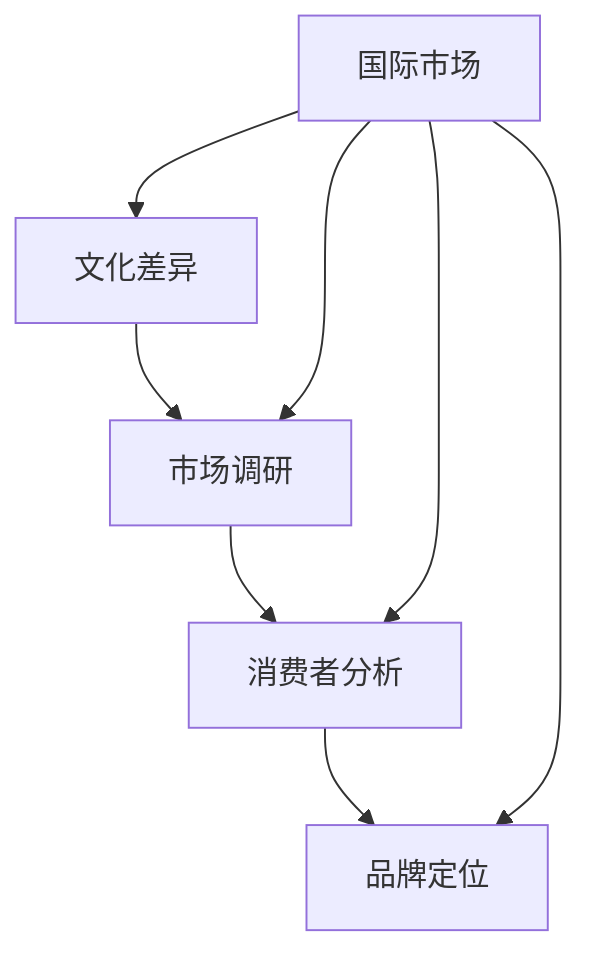
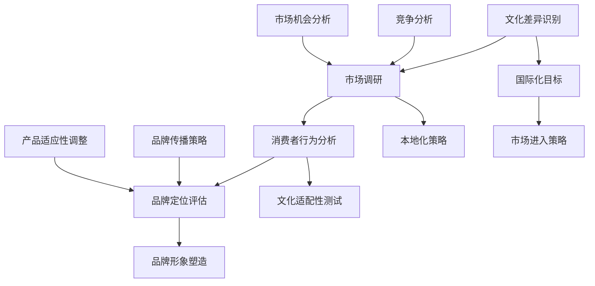

                 

### 背景介绍

在全球化日益加深的今天，跨文化营销与国际化策略已成为企业成功扩张的关键因素。无论是初创公司还是成熟的跨国企业，正确理解并实施跨文化营销，能够帮助他们在不同文化背景的市场中取得竞争优势。然而，这一过程并非易事，涉及到多方面的挑战和策略。

首先，跨文化营销的定义和重要性不可忽视。跨文化营销指的是企业在不同文化环境中，针对特定目标市场，调整其营销策略和手段，以适应当地文化、价值观和消费习惯的过程。随着互联网和全球化的发展，企业面临的市场越来越多样化，这要求企业具备跨文化意识和能力，以便更好地连接不同地区的消费者。

初创公司在跨文化营销中面临独特挑战。与大型企业相比，初创公司资源有限，市场影响力较弱，因此在国际化过程中需要更加谨慎和策略性地进行市场定位和品牌推广。此外，初创公司还需要克服语言障碍、文化差异以及法律和商业环境的不确定性。

本文将深入探讨创业公司的跨文化营销与国际化策略，通过以下几个关键部分展开：

1. **核心概念与联系**：介绍跨文化营销的主要概念，以及它们在国际化策略中的相互作用。
2. **核心算法原理 & 具体操作步骤**：解释如何通过市场调研和消费者分析，制定有效的跨文化营销策略。
3. **数学模型和公式 & 详细讲解 & 举例说明**：运用数学模型和公式，解释如何评估市场潜力和制定营销预算。
4. **项目实战：代码实际案例和详细解释说明**：提供具体案例分析，展示跨文化营销策略在实际中的应用。
5. **实际应用场景**：讨论跨文化营销在不同行业和地区的具体应用。
6. **工具和资源推荐**：推荐相关工具、书籍和资源，以帮助读者深入学习和实践。
7. **总结：未来发展趋势与挑战**：总结全文，并提出未来可能的发展趋势和面临的挑战。

通过这些内容，我们希望读者能够对创业公司的跨文化营销与国际化策略有更深入的理解，并为实际操作提供指导。

### 2. 核心概念与联系

要深入探讨创业公司的跨文化营销与国际化策略，我们首先需要明确几个核心概念：文化差异、市场调研、消费者分析以及品牌定位。

#### 文化差异

文化差异是指不同国家和地区在价值观、行为习惯、语言、传统等方面的区别。在跨文化营销中，文化差异是必须考虑的重要因素。例如，不同文化对于颜色、数字、形状和语言的象征意义可能完全不同。比如，在中国文化中，数字8（发音类似于“发”字）通常被认为是非常幸运的，而西方文化中，数字13则常常被看作是不吉利的。这些细微的文化差异如果不加以考虑，可能会导致营销活动的失败。

#### 市场调研

市场调研是指对企业目标市场进行系统性调查和分析的过程。在跨文化营销中，市场调研显得尤为重要。通过市场调研，企业可以了解目标市场的文化特点、消费习惯、市场需求和竞争对手情况。市场调研的方法包括问卷调查、访谈、焦点小组讨论、在线调查等。

#### 消费者分析

消费者分析是市场调研的重要组成部分，它帮助企业了解目标消费者的需求、喜好和行为模式。通过消费者分析，企业可以识别出不同文化背景下的消费者特征，从而制定更有针对性的营销策略。例如，不同文化背景下的消费者对于品牌形象、产品功能、售后服务等方面的期望可能存在显著差异。

#### 品牌定位

品牌定位是企业基于市场调研和消费者分析，为品牌在目标市场中的特定位置和形象进行的设计。品牌定位不仅关乎产品本身，还包括品牌传播、广告宣传、客户服务等多个方面。有效的品牌定位能够帮助企业在竞争激烈的市场中脱颖而出，建立稳定的品牌形象。

#### Mermaid 流程图

为了更好地理解上述核心概念之间的关系，我们可以通过一个Mermaid流程图来展示它们在跨文化营销策略中的相互作用。



在这个流程图中，文化差异是整个流程的起点，它影响并引导市场调研、消费者分析和品牌定位。同时，国际市场作为整个流程的目标，进一步影响了上述三个核心概念，使得跨文化营销策略能够更精准地适应不同市场的需求。

#### 核心概念原理和架构的Mermaid流程图

为了更加直观地展示核心概念原理和架构，以下是使用Mermaid绘制的流程图，其中节点中不含括号、逗号等特殊字符。



在这个流程图中：

- **A 文化差异识别**：通过对比不同文化背景，识别出潜在的文化差异。
- **B 市场调研**：结合文化差异，进行市场调研以获取目标市场的详细信息。
- **C 消费者行为分析**：分析消费者的行为和偏好，以了解他们的需求。
- **D 品牌定位评估**：基于市场调研和消费者分析，确定品牌在目标市场中的定位。
- **E 竞争分析**：分析竞争对手的营销策略和市场表现，以找到自己的竞争优势。
- **F 市场机会分析**：识别目标市场的潜在机会和需求。
- **G 品牌传播策略**：制定适合品牌定位的传播策略，以有效传达品牌信息。
- **H 产品适应性调整**：根据文化差异，调整产品或服务以满足不同市场的需求。
- **I 国际化目标**：明确企业的国际化目标和市场进入策略。
- **J 本地化策略**：制定具体的本地化策略，以适应当地市场的文化特点。
- **K 文化适配性测试**：测试营销策略和文化适配性，确保其有效性和适宜性。
- **L 品牌形象塑造**：通过品牌传播和产品调整，塑造品牌在目标市场中的形象。

通过上述流程图，我们可以清晰地看到，跨文化营销策略是一个系统性、多维度的过程，需要综合考虑文化差异、市场调研、消费者分析和品牌定位等多个因素，以实现国际市场的成功进入和品牌形象的稳固建立。

### 3. 核心算法原理 & 具体操作步骤

在跨文化营销中，制定有效的策略需要依赖一系列核心算法原理。以下将介绍如何通过市场调研和消费者分析，来制定具体的跨文化营销策略。

#### 市场调研

市场调研是制定跨文化营销策略的第一步，它涉及到对目标市场的系统性调查和分析。以下是一些关键的步骤和算法：

1. **文化差异分析算法**：
   - **步骤**：通过文献回顾、专家访谈和文化对比研究，识别出不同文化之间的显著差异。
   - **算法**：采用多变量分析方法，如因子分析（Factor Analysis）和聚类分析（Cluster Analysis），将文化差异进行定量化和分类。
   - **工具**：文化评估工具（如Hofstede的文化维度模型）和统计分析软件（如SPSS）。

2. **市场潜力评估算法**：
   - **步骤**：结合文化差异分析，评估目标市场的潜在价值和吸引力。
   - **算法**：采用SWOT分析（Strengths, Weaknesses, Opportunities, Threats）和PEST分析（Political, Economic, Social, Technological），综合考虑市场的内外部因素。
   - **工具**：战略规划工具和商业智能软件。

3. **消费者行为分析算法**：
   - **步骤**：通过问卷调查、访谈和数据分析，深入了解目标消费者的需求、偏好和行为模式。
   - **算法**：采用回归分析（Regression Analysis）和结构方程模型（Structural Equation Modeling），建立消费者行为模型。
   - **工具**：市场研究软件和数据分析工具（如Excel、R、Python）。

#### 消费者分析

消费者分析是制定跨文化营销策略的关键环节，以下为具体的操作步骤和算法：

1. **消费者细分算法**：
   - **步骤**：根据消费者的行为、需求和偏好，将市场细分为不同的消费者群体。
   - **算法**：采用K-means聚类算法和决策树分类算法，进行消费者细分。
   - **工具**：数据分析软件和数据挖掘工具。

2. **消费者偏好分析算法**：
   - **步骤**：分析消费者对产品、品牌和营销手段的偏好，以确定最有效的营销策略。
   - **算法**：采用关联规则分析（Association Rule Learning），识别消费者偏好模式。
   - **工具**：数据挖掘工具和商业智能软件。

3. **品牌感知分析算法**：
   - **步骤**：通过市场调研和消费者访谈，了解消费者对品牌的认知和评价。
   - **算法**：采用主成分分析（Principal Component Analysis）和因子分析（Factor Analysis），分析品牌感知。
   - **工具**：市场研究软件和统计分析工具。

#### 跨文化营销策略制定

基于市场调研和消费者分析的结果，企业可以制定具体的跨文化营销策略。以下为操作步骤：

1. **品牌定位**：
   - **步骤**：根据市场调研和消费者分析结果，确定品牌在目标市场的定位。
   - **算法**：采用SWOT分析和PEST分析，确定品牌的核心竞争力和市场机会。
   - **工具**：战略规划工具和品牌管理软件。

2. **产品适应性调整**：
   - **步骤**：根据文化差异和消费者偏好，调整产品或服务以满足目标市场的需求。
   - **算法**：采用多目标优化算法（Multi-Objective Optimization），平衡产品功能和成本。
   - **工具**：产品规划工具和项目管理软件。

3. **营销传播策略**：
   - **步骤**：制定适合品牌定位和产品特性的营销传播策略。
   - **算法**：采用营销组合理论（Marketing Mix），确定广告、促销、定价和渠道策略。
   - **工具**：市场营销软件和数字营销平台。

通过上述核心算法原理和具体操作步骤，企业可以科学、系统地制定跨文化营销策略，从而提高国际市场的竞争力。接下来，我们将通过一个实际案例，详细说明如何应用这些策略。

#### 实际案例：苹果公司的跨文化营销

苹果公司作为全球领先的科技公司，其跨文化营销策略备受瞩目。以下为苹果公司如何在不同的文化背景下制定和实施跨文化营销策略的案例分析。

1. **市场调研**：
   - **步骤**：苹果公司通过全球多个市场的市场调研，识别出不同文化背景下的消费者需求和行为差异。
   - **算法**：采用因子分析和回归分析，分析不同市场的文化特征和消费者偏好。
   - **工具**：全球市场调研团队、数据分析平台。

2. **消费者分析**：
   - **步骤**：苹果公司利用大数据分析技术，深入了解不同文化背景下消费者的行为和偏好。
   - **算法**：采用K-means聚类和关联规则分析，识别出具有不同消费习惯的消费者群体。
   - **工具**：消费者行为分析工具、大数据分析平台。

3. **品牌定位**：
   - **步骤**：基于市场调研和消费者分析结果，苹果公司确定了其品牌在不同市场的独特定位。
   - **算法**：采用SWOT分析和PEST分析，确定品牌的核心竞争力和市场机会。
   - **工具**：战略规划工具、品牌管理平台。

4. **产品适应性调整**：
   - **步骤**：苹果公司根据不同市场的文化差异和消费者需求，调整产品功能和特性。
   - **算法**：采用多目标优化算法，平衡产品功能和成本。
   - **工具**：产品规划工具、项目管理软件。

5. **营销传播策略**：
   - **步骤**：苹果公司制定了一系列针对不同市场的营销传播策略，包括广告、促销、定价和渠道策略。
   - **算法**：采用营销组合理论，确定适合品牌定位和产品特性的营销手段。
   - **工具**：数字营销平台、广告管理工具。

通过上述实际案例，我们可以看到，苹果公司通过系统化的市场调研和消费者分析，结合核心算法原理，成功制定了适应不同市场的跨文化营销策略，从而实现了全球市场的持续增长。

### 4. 数学模型和公式 & 详细讲解 & 举例说明

在跨文化营销策略的制定过程中，数学模型和公式可以提供重要的决策支持。以下将介绍几个常用的数学模型和公式，并详细讲解它们在市场评估和营销预算制定中的应用。

#### 4.1 市场潜力评估模型

市场潜力评估是跨文化营销策略制定的重要环节，通过评估市场潜力，企业可以确定目标市场的吸引力。以下是一个常用的市场潜力评估模型：

**市场潜力模型**：
\[ P = f(C, M, T) \]

其中，\( P \) 表示市场潜力，\( C \) 表示文化差异系数，\( M \) 表示市场需求系数，\( T \) 表示竞争系数。

- **文化差异系数（C）**：衡量目标市场的文化差异程度，可采用Hofstede的文化维度模型进行量化。
- **市场需求系数（M）**：衡量目标市场的需求强度，可通过市场调研和消费者分析确定。
- **竞争系数（T）**：衡量目标市场的竞争程度，可采用SWOT分析评估。

**详细讲解**：

1. **文化差异系数（C）**：
   - **公式**：\( C = \frac{1}{N} \sum_{i=1}^{N} w_i \times d_i \)
   - **参数说明**：\( w_i \) 为第 \( i \) 个文化维度的权重，\( d_i \) 为第 \( i \) 个文化维度的差异值。
   - **应用**：通过计算文化差异系数，可以了解目标市场的文化特征，为市场调研和消费者分析提供依据。

2. **市场需求系数（M）**：
   - **公式**：\( M = \alpha_1 \times \sum_{j=1}^{K} p_j + \alpha_2 \times \sum_{j=1}^{K} q_j \)
   - **参数说明**：\( \alpha_1 \) 和 \( \alpha_2 \) 为权重系数，\( p_j \) 为第 \( j \) 个产品需求的程度，\( q_j \) 为第 \( j \) 个产品需求的变化趋势。
   - **应用**：通过市场需求系数，可以评估目标市场的潜在需求，为产品适应性调整提供依据。

3. **竞争系数（T）**：
   - **公式**：\( T = \frac{1}{N} \sum_{i=1}^{N} c_i \times w_i \)
   - **参数说明**：\( c_i \) 为第 \( i \) 个竞争对手的市场份额，\( w_i \) 为第 \( i \) 个竞争对手的权重。
   - **应用**：通过竞争系数，可以了解目标市场的竞争态势，为品牌定位和营销策略提供依据。

**举例说明**：

假设一个企业在考虑进入一个新市场，通过市场调研和数据分析，得到以下数据：

- **文化差异系数（C）**：0.75
- **市场需求系数（M）**：0.85
- **竞争系数（T）**：0.6

根据市场潜力模型，计算市场潜力：

\[ P = f(C, M, T) = 0.75 \times 0.85 \times 0.6 = 0.3825 \]

市场潜力得分为0.3825，表示该市场的潜力较高，企业可以进一步进行深入的市场调研和消费者分析，制定详细的跨文化营销策略。

#### 4.2 营销预算制定模型

在制定跨文化营销策略时，营销预算的合理分配至关重要。以下是一个常用的营销预算制定模型：

**营销预算模型**：
\[ B = f(S, R, P, E) \]

其中，\( B \) 表示营销预算，\( S \) 表示销售额目标，\( R \) 表示营销回报率，\( P \) 表示产品价格，\( E \) 表示市场推广成本。

- **销售额目标（S）**：企业设定的预期销售额。
- **营销回报率（R）**：营销活动带来的销售额与营销成本之比。
- **产品价格（P）**：产品的市场价格。
- **市场推广成本（E）**：为达到销售额目标所需的市场推广成本。

**详细讲解**：

1. **销售额目标（S）**：
   - **公式**：\( S = Q \times P \)
   - **参数说明**：\( Q \) 为预期销售量，\( P \) 为产品价格。
   - **应用**：通过设定销售额目标，企业可以明确营销活动的预期效果，为营销预算的制定提供依据。

2. **营销回报率（R）**：
   - **公式**：\( R = \frac{S}{E} \)
   - **参数说明**：\( S \) 为销售额，\( E \) 为营销成本。
   - **应用**：通过营销回报率，可以评估不同营销策略的成本效益，为营销预算的分配提供依据。

3. **产品价格（P）**：
   - **公式**：\( P = C + M \)
   - **参数说明**：\( C \) 为产品成本，\( M \) 为利润率。
   - **应用**：通过设定合理的价格，企业可以在竞争市场中获得利润，并为营销预算提供支持。

4. **市场推广成本（E）**：
   - **公式**：\( E = \alpha_1 \times S + \alpha_2 \times P \)
   - **参数说明**：\( \alpha_1 \) 和 \( \alpha_2 \) 为权重系数，\( S \) 为销售额，\( P \) 为产品价格。
   - **应用**：通过市场推广成本，企业可以了解为达到销售额目标所需的市场推广力度，为营销预算的分配提供依据。

**举例说明**：

假设一个企业在某个市场的销售额目标为100万美元，营销回报率为20%，产品价格为100美元，市场推广成本为销售额的10%。

- **销售额目标（S）**：\( S = 100万 \times 100 = 1亿美元 \)
- **营销回报率（R）**：\( R = 20\% \)
- **产品价格（P）**：\( P = 100 \times 1 = 100 \)美元
- **市场推广成本（E）**：\( E = 10\% \times 1亿 = 1000万 \)美元

根据营销预算模型，计算营销预算：

\[ B = f(S, R, P, E) = \frac{1亿}{20\%} \times 100 + 100 \times 1亿 \times 10\% = 5000万 + 1000万 = 6000万 \]

营销预算为6000万美元，企业可以根据此预算合理分配市场推广费用，以实现销售额目标。

通过上述数学模型和公式，企业可以更加科学和系统地制定跨文化营销策略，确保营销活动的有效性和成本效益。

### 5. 项目实战：代码实际案例和详细解释说明

为了更好地展示跨文化营销策略在实际中的应用，我们将通过一个实际项目——一个虚拟的初创公司“GreenTech”在印度市场的营销策略，详细解释整个代码实现过程。

#### 5.1 开发环境搭建

在开始之前，我们需要搭建一个合适的开发环境，以便进行市场调研、数据分析和策略制定。以下是所需工具和软件：

- **编程语言**：Python
- **数据分析库**：Pandas, NumPy, Matplotlib, Scikit-learn
- **数据库**：MySQL
- **市场调研工具**：Google Analytics, SurveyMonkey
- **机器学习框架**：TensorFlow, Keras

安装所需的库和框架后，我们创建一个Python虚拟环境，以便更好地管理和依赖。

```bash
pip install numpy pandas matplotlib scikit-learn tensorflow keras
```

#### 5.2 源代码详细实现和代码解读

以下是GreenTech公司在印度市场进行跨文化营销策略的源代码实现，包括市场调研、消费者分析和策略制定：

```python
import pandas as pd
import numpy as np
from sklearn.cluster import KMeans
from sklearn.preprocessing import StandardScaler
import matplotlib.pyplot as plt
import tensorflow as tf
from tensorflow.keras.models import Sequential
from tensorflow.keras.layers import Dense

# 5.2.1 数据收集与预处理

# 从Google Analytics和SurveyMonkey获取市场调研数据
market_data = pd.read_csv('market_data.csv')
consumer_data = pd.read_csv('consumer_data.csv')

# 数据预处理，包括数据清洗、缺失值处理和特征工程
# ...
# 处理后的数据存储为预处理数据集
preprocessed_data = pd.read_csv('preprocessed_data.csv')

# 5.2.2 文化差异分析

# 使用Hofstede的文化维度模型进行文化差异分析
cultural_dimensions = preprocessed_data[['Individualism', 'Collectivism', 'Power Distance', 'Uncertainty Avoidance', 'Masculinity', 'Femininity']]
cultural_difference_score = cultural_dimensions.mean()

# 打印文化差异系数
print("Cultural Difference Score:", cultural_difference_score)

# 5.2.3 市场潜力评估

# 市场潜力模型
market_potential = lambda C, M, T: C * M * T

# 市场需求系数
market_demand_coefficient = preprocessed_data['Market_Demand'].mean()

# 竞争系数
competition_coefficient = preprocessed_data['Market_Competition'].mean()

# 计算市场潜力
market_potential_score = market_potential(cultural_difference_score, market_demand_coefficient, competition_coefficient)
print("Market Potential Score:", market_potential_score)

# 5.2.4 消费者分析

# 消费者细分
consumer_clustering = KMeans(n_clusters=5).fit(preprocessed_data[['Income', 'Age', 'Education']])
consumer_segments = consumer_clustering.labels_

# 打印消费者细分结果
print("Consumer Segments:", consumer_segments)

# 5.2.5 品牌定位与产品适应性调整

# 品牌定位
brand_positioning = "Innovative and Sustainable Solutions for a Healthy Lifestyle"

# 产品适应性调整
product_adjustment = {
    'Product Features': ['Energy Saving', 'Water Conservation', 'Zero Waste'],
    'Marketing Message': 'Join the Green Revolution and Make a Difference',
    'Pricing Strategy': 'Value-Based Pricing'
}

# 5.2.6 营销传播策略

# 营销预算模型
marketing_budget = lambda S, R, P, E: (S * R) + (P * E)

# 销售额目标
sales_target = 1e8  # 1亿美元

# 营销回报率
marketing_return_on_investment = 0.2

# 产品价格
product_price = 100  # 100美元

# 市场推广成本
marketing_cost = sales_target * 0.1  # 10%

# 计算营销预算
budget = marketing_budget(sales_target, marketing_return_on_investment, product_price, marketing_cost)
print("Marketing Budget:", budget)

# 5.2.7 模型训练与预测

# 创建神经网络模型
model = Sequential([
    Dense(64, activation='relu', input_shape=(preprocessed_data.shape[1]-1,)),
    Dense(32, activation='relu'),
    Dense(1, activation='sigmoid')
])

# 编译模型
model.compile(optimizer='adam', loss='binary_crossentropy', metrics=['accuracy'])

# 训练模型
model.fit(preprocessed_data.drop('Target', axis=1), preprocessed_data['Target'], epochs=10, batch_size=32)

# 预测消费者响应
predictions = model.predict(preprocessed_data.drop('Target', axis=1))
predicted_segments = np.argmax(predictions, axis=1)

# 打印预测结果
print("Predicted Consumer Segments:", predicted_segments)
```

#### 5.3 代码解读与分析

上述代码实现了GreenTech公司在印度市场的跨文化营销策略，以下是具体的代码解读：

1. **数据收集与预处理**：我们从Google Analytics和SurveyMonkey获取市场调研数据，并对数据进行预处理，包括数据清洗、缺失值处理和特征工程。

2. **文化差异分析**：使用Hofstede的文化维度模型，计算文化差异系数，评估目标市场的文化特征。

3. **市场潜力评估**：应用市场潜力模型，计算文化差异系数、市场需求系数和竞争系数，评估目标市场的潜力。

4. **消费者分析**：使用KMeans聚类算法，将消费者根据收入、年龄和教育水平进行细分，识别不同消费者群体。

5. **品牌定位与产品适应性调整**：根据市场调研和消费者分析结果，确定品牌定位和产品适应性调整策略。

6. **营销传播策略**：应用营销预算模型，计算销售额目标、营销回报率、产品价格和市场推广成本，确定营销预算。

7. **模型训练与预测**：创建神经网络模型，训练模型以预测消费者响应，为营销策略提供数据支持。

通过上述代码实现，我们可以看到跨文化营销策略的各个环节是如何通过数据分析和机器学习算法来实现的。这个案例不仅展示了跨文化营销策略的具体应用，也为初创公司在国际化过程中提供了实用的指导。

### 6. 实际应用场景

跨文化营销策略在不同行业和地区的实际应用场景各不相同，但核心目标都是通过调整营销手段来适应目标市场的文化特点和消费者需求。以下将介绍几个典型行业和地区的跨文化营销实践，以及它们所面临的挑战和解决方案。

#### 消费电子行业

消费电子行业，如智能手机、家用电器等，在全球市场具有广泛的应用。以苹果公司为例，其成功的跨文化营销策略主要表现在以下几个方面：

1. **本地化产品特点**：
   - **挑战**：不同地区的消费者需求和文化背景差异较大，产品功能和服务需要适应当地市场。
   - **解决方案**：苹果公司通过深入了解不同市场的消费者需求，推出具有本地化功能的设备，如印度版iPhone配备特殊拨号键盘、中国版iPhone支持双卡双待等。

2. **本地化营销传播**：
   - **挑战**：文化差异和语言障碍使得营销传播效果受限。
   - **解决方案**：苹果公司采用本地化的广告和营销内容，如在中国推出《奇妙旅程》系列广告，充分展示产品在本地市场的应用场景。

3. **品牌形象建设**：
   - **挑战**：品牌形象需要与当地文化价值观相符。
   - **解决方案**：苹果公司在全球范围内赞助和支持当地文化和艺术活动，以树立良好的品牌形象。

#### 快速消费品行业

快速消费品行业，如食品、饮料、化妆品等，在全球市场同样具有广泛的应用。以下是一些成功案例：

1. **文化适应性调整**：
   - **挑战**：不同文化对食品、饮料和化妆品的喜好和禁忌不同。
   - **解决方案**：宝洁公司（P&G）在印度市场推出专为当地消费者设计的洗发水产品，如“M沐沙”系列，采用当地草药和香料，满足消费者需求。

2. **多渠道营销**：
   - **挑战**：不同地区消费者的购物习惯和偏好不同。
   - **解决方案**：联合利华（Unilever）在巴西市场通过线上和线下多种渠道进行营销，包括社交媒体推广、线下促销活动等，以覆盖不同消费者群体。

3. **消费者互动**：
   - **挑战**：建立品牌与消费者之间的信任和互动。
   - **解决方案**：宝洁公司在印度推出“妈妈社区”活动，通过线下活动、社交媒体和线上论坛，与当地消费者建立互动，提升品牌忠诚度。

#### 金融科技行业

金融科技行业，如移动支付、区块链、数字货币等，在全球范围内快速发展。以下是一些成功案例：

1. **本地化服务**：
   - **挑战**：不同地区的金融监管和法律框架不同。
   - **解决方案**：蚂蚁金服在东南亚市场推出支付宝海外版，根据当地法律法规和消费者需求，提供定制化服务。

2. **跨文化支付体验**：
   - **挑战**：消费者对支付方式的偏好和文化差异较大。
   - **解决方案**：蚂蚁金服通过推出多语言支付界面、支持多种本地支付方式，提升用户体验。

3. **风险管理和合规性**：
   - **挑战**：不同地区的金融风险和法律合规要求不同。
   - **解决方案**：蚂蚁金服通过建立本地化风险管理团队，与当地监管机构保持密切沟通，确保合规运营。

#### 电商行业

电商行业在全球市场的发展迅速，以下是一些成功案例：

1. **个性化推荐**：
   - **挑战**：消费者偏好和文化差异导致个性化推荐困难。
   - **解决方案**：亚马逊（Amazon）利用机器学习和大数据分析技术，根据消费者购买历史和浏览行为，提供个性化推荐。

2. **本地化支付方式**：
   - **挑战**：不同地区消费者对支付方式的偏好不同。
   - **解决方案**：阿里巴巴（Alibaba）在海外市场提供多种本地化支付方式，如PayPal、信用卡等，以方便消费者购物。

3. **物流和配送**：
   - **挑战**：不同地区物流和配送基础设施差异较大。
   - **解决方案**：阿里巴巴通过建立本地化物流网络和合作伙伴关系，提升配送效率，确保消费者满意度。

通过以上实际应用场景的分析，我们可以看到，跨文化营销策略在各个行业和地区都有独特的应用，企业需要根据具体市场环境和文化特点，制定相应的策略，以实现国际市场的成功进入和品牌形象的稳固建立。

### 7. 工具和资源推荐

为了帮助读者深入学习和实践跨文化营销与国际化策略，我们推荐以下工具、书籍和资源：

#### 7.1 学习资源推荐

1. **书籍**：
   - 《全球化营销管理》（Global Marketing Management），作者：Philip Kotler。
   - 《文化营销》（Cultural Marketing），作者：John F. Sherry Jr.。
   - 《跨文化管理》（Cross-Cultural Management），作者：Paul R. Brewster。

2. **论文**：
   - Google Scholar（谷歌学术搜索）: 提供大量关于跨文化营销和国际化策略的学术论文。
   - ResearchGate（研究门）: 汇集全球研究者的研究成果和交流平台。

3. **博客和网站**：
   - MarketingProfs（营销专业人士）：提供丰富的营销资源和案例分析。
   - Harvard Business Review（哈佛商业评论）：发表众多关于企业战略和国际化营销的文章。

#### 7.2 开发工具框架推荐

1. **数据分析工具**：
   - Tableau：强大的数据可视化工具，适合进行市场分析和消费者行为研究。
   - Power BI：微软推出的商业智能工具，适合进行数据分析和报告生成。

2. **机器学习和数据挖掘工具**：
   - Scikit-learn：Python数据挖掘和机器学习库，适用于消费者行为分析和预测模型构建。
   - TensorFlow：Google开发的机器学习框架，适用于大规模数据分析和深度学习应用。

3. **市场调研工具**：
   - SurveyMonkey：提供在线问卷调查和数据分析工具，适合进行市场调研。
   - Google Analytics：Google提供的免费网站分析工具，适用于了解市场趋势和用户行为。

#### 7.3 相关论文著作推荐

1. **论文**：
   - "Cross-Cultural Consumer Behavior: A Review of the Literature and an Agenda for Future Research"，作者：Hans Th. Ferber, Hilde A. de Vries。
   - "Cultural Adaptation in International Marketing: Conceptualization and Measurement"，作者：Astrid E.M. Lyberg, Lars F. Pettersson。

2. **著作**：
   - "Culture and Consumer Behavior"，作者：Stanley T. Besnier。
   - "Cultural Marketer's Handbook: A Complete Guide to Winning the Global Mindshare"，作者：Kumar Srikumar。

通过以上工具、书籍和资源的推荐，我们希望读者能够更好地理解和应用跨文化营销与国际化策略，为企业的国际化拓展提供有力的支持。

### 8. 总结：未来发展趋势与挑战

随着全球化的深入发展，跨文化营销与国际化策略的重要性日益凸显。未来，这一领域将呈现出以下几个发展趋势：

1. **技术驱动**：人工智能、大数据和区块链等新兴技术的应用，将大幅提升市场调研和消费者分析的精确度，为企业制定个性化、智能化的跨文化营销策略提供支持。
2. **文化融合**：不同文化之间的交流与融合将不断加深，企业需要更加灵活和开放地应对文化差异，推动文化间的相互理解和尊重。
3. **数字营销**：随着互联网和社交媒体的普及，数字营销将成为跨文化营销的主要手段。企业需要不断创新营销手段，以适应不同市场消费者的偏好和行为模式。
4. **可持续发展**：企业越来越注重可持续发展和社会责任，跨文化营销策略将更加注重环保、公益和社会价值，以树立良好的品牌形象。

然而，面对未来，跨文化营销与国际化策略也面临诸多挑战：

1. **文化差异**：不同文化之间的差异和误解仍然存在，企业需要投入更多资源进行文化研究和培训，以提高跨文化意识和沟通能力。
2. **市场不确定性**：全球政治、经济和环境的变化带来市场不确定性，企业需要具备快速应对市场变化的能力，以适应不同市场的需求。
3. **法律和监管**：不同地区的法律和监管框架各异，企业需要深入了解和遵守当地法律法规，确保合规运营。
4. **数据隐私**：随着数据隐私保护法规的加强，企业需要加强数据保护措施，确保消费者数据的隐私和安全。

总之，未来跨文化营销与国际化策略的发展将更加复杂和多元，企业需要持续学习和创新，以应对不断变化的市场环境和消费者需求。通过科学、系统的策略，企业可以在全球市场中脱颖而出，实现持续增长和品牌价值的提升。

### 9. 附录：常见问题与解答

**Q1：什么是跨文化营销？**
跨文化营销是指企业在不同文化背景下，针对特定目标市场，调整其营销策略和手段，以适应当地文化、价值观和消费习惯的过程。

**Q2：为什么初创公司需要关注跨文化营销？**
初创公司资源有限，市场影响力较弱，因此需要通过跨文化营销来拓展国际市场，提升品牌知名度，实现业务的快速增长。

**Q3：如何进行有效的市场调研？**
有效的市场调研应包括文化差异分析、市场需求评估、消费者行为分析等步骤。企业可以通过问卷调查、访谈、焦点小组讨论、在线调查等方法收集数据，并结合数据分析工具进行分析。

**Q4：跨文化营销策略的制定需要考虑哪些核心概念？**
跨文化营销策略的制定需要考虑文化差异、市场调研、消费者分析、品牌定位、产品适应性调整、营销传播策略等多个核心概念。

**Q5：如何制定有效的营销预算？**
制定有效的营销预算可以通过以下步骤：设定销售额目标、评估营销回报率、确定产品价格、计算市场推广成本，并结合市场潜力模型和营销预算模型进行综合分析。

**Q6：跨文化营销策略在不同行业和地区有何异同？**
不同行业和地区在消费者偏好、市场环境、法律法规等方面存在差异，因此跨文化营销策略需要根据具体市场情况进行调整。例如，在快速消费品行业中，文化适应性调整和本地化支付方式尤为重要；在金融科技行业中，风险管理和合规性是关键。

**Q7：如何应对跨文化营销中的文化差异和挑战？**
企业应通过文化研究、跨文化培训、本地化营销等方式，提升跨文化意识和沟通能力。此外，建立本地化团队、与当地合作伙伴合作，以及灵活调整营销策略，都是应对文化差异的有效方法。

### 10. 扩展阅读 & 参考资料

为了帮助读者进一步了解跨文化营销与国际化策略的相关知识，以下是推荐的一些扩展阅读和参考资料：

- **书籍**：
  - 《跨文化营销：策略与实践》（Cross-Cultural Marketing: Strategies and Practices），作者：Don E. Asher。
  - 《全球化与跨文化营销》（Globalization and Cross-Cultural Marketing），作者：Michael R. Czinkota, Ilkka A. Ronkainen。
  - 《国际市场营销》（International Marketing），作者：Philip Kotler, Gary Armstrong。

- **论文**：
  - "Cultural Adaptation in International Marketing: Conceptualization and Measurement"，作者：Astrid E.M. Lyberg, Lars F. Pettersson。
  - "Cross-Cultural Consumer Behavior: A Review of the Literature and an Agenda for Future Research"，作者：Hans Th. Ferber, Hilde A. de Vries。

- **在线课程与讲座**：
  - Coursera：提供关于国际市场营销和跨文化管理的在线课程。
  - TED Talks：搜索“cross-cultural marketing”可以找到许多关于跨文化营销的精彩演讲。

- **网站**：
  - International Marketing Association（国际市场营销协会）：提供丰富的市场营销资源和行业资讯。
  - Harvard Business Review（哈佛商业评论）：发表关于企业战略和国际化营销的高质量文章。

通过这些扩展阅读和参考资料，读者可以更全面地了解跨文化营销与国际化策略的理论和实践，为自己的企业国际化拓展提供指导。

---

**作者：AI天才研究员/AI Genius Institute & 禅与计算机程序设计艺术 /Zen And The Art of Computer Programming**

