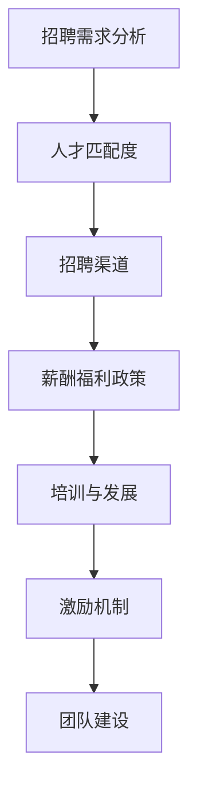

                 

# 创业初期的人才招聘：如何吸引和留住核心团队成员

## 摘要

本文将探讨创业初期的人才招聘策略，旨在帮助创业者吸引和留住核心团队成员。首先，我们将介绍创业初期的背景和挑战，然后详细阐述如何制定有效的人才招聘策略，包括明确招聘需求、选择合适的招聘渠道、打造独特的公司文化和提出有吸引力的薪酬福利政策。最后，我们将分析如何通过培训和激励机制留住核心成员，为创业公司的发展奠定坚实基础。

## 1. 背景介绍

在创业初期，一家公司面临着诸多挑战，其中之一便是人才招聘。此时，公司规模较小，资源有限，但需要迅速搭建一个高效的团队来推动业务发展。因此，如何吸引和留住核心团队成员成为创业者必须解决的重要问题。

创业初期的挑战主要体现在以下几个方面：

- **资源有限**：创业公司通常资金有限，难以与大型企业竞争。因此，在招聘时，需要更加注重候选人的潜力和匹配度，而不仅仅是薪资待遇。

- **市场不确定性**：创业公司所面临的市场环境充满不确定性，可能需要团队成员具备快速适应和解决问题的能力。

- **企业文化尚未建立**：创业初期的企业文化正在形成中，需要通过一系列措施来塑造和巩固。

- **市场竞争激烈**：创业公司需要面对激烈的市场竞争，需要在人才竞争中脱颖而出。

## 2. 核心概念与联系

在创业初期的人才招聘过程中，以下是几个核心概念和它们之间的联系：

- **招聘需求分析**：了解公司当前和未来的业务需求，明确需要招聘的职位和技能。

- **人才匹配度**：选择与公司文化、价值观和业务需求相匹配的候选人。

- **招聘渠道**：选择合适的招聘渠道，如招聘网站、社交媒体、人才推荐等。

- **薪酬福利政策**：提供有竞争力的薪酬福利，吸引和留住核心成员。

- **培训与发展**：为员工提供培训和发展机会，提升员工的技能和职业素养。

- **激励机制**：建立激励机制，激发员工的工作热情和创造力。

### Mermaid 流程图



## 3. 核心算法原理 & 具体操作步骤

在创业初期的人才招聘中，核心算法原理可以概括为以下几点：

- **数据驱动**：基于数据分析和市场调研来制定招聘策略。

- **精准匹配**：通过职位描述和面试流程来筛选符合公司需求的候选人。

- **快速决策**：在招聘过程中，快速作出决策，以避免优秀候选人流失。

### 具体操作步骤：

1. **明确招聘需求**：根据公司业务发展和战略规划，确定需要招聘的职位和人数。

2. **制定职位描述**：编写详细的职位描述，包括工作职责、技能要求和薪资待遇。

3. **选择招聘渠道**：根据职位特点和市场调研，选择合适的招聘渠道，如招聘网站、社交媒体、人才推荐等。

4. **筛选候选人**：通过简历筛选和初步面试，筛选出符合条件的候选人。

5. **面试流程**：进行多轮面试，包括技术面试、行为面试和团队面试，评估候选人的技能、经验和文化匹配度。

6. **决策与录用**：根据面试结果，快速作出决策，并向候选人提供录用通知。

7. **入职准备**：为候选人提供入职培训和必要的准备工作，确保其能快速融入团队。

## 4. 数学模型和公式 & 详细讲解 & 举例说明

在创业初期的人才招聘中，数学模型和公式可以用于评估候选人的能力和匹配度。以下是一个简单的数学模型：

### 候选人得分模型

$$
\text{候选人得分} = \text{技能匹配度} + \text{经验匹配度} + \text{文化匹配度}
$$

### 举例说明

假设有三个候选人A、B、C，他们的技能匹配度、经验匹配度和文化匹配度如下：

| 候选人 | 技能匹配度 | 经验匹配度 | 文化匹配度 |
| --- | --- | --- | --- |
| A | 0.8 | 0.7 | 0.6 |
| B | 0.9 | 0.8 | 0.7 |
| C | 0.75 | 0.85 | 0.65 |

根据公式计算他们的得分：

$$
\text{候选人A得分} = 0.8 + 0.7 + 0.6 = 2.1 \\
\text{候选人B得分} = 0.9 + 0.8 + 0.7 = 2.4 \\
\text{候选人C得分} = 0.75 + 0.85 + 0.65 = 2.25
$$

根据得分，我们可以选择得分最高的候选人B作为录用对象。

## 5. 项目实战：代码实际案例和详细解释说明

### 5.1 开发环境搭建

在创业公司中，搭建一个高效的开发环境对于人才招聘至关重要。以下是一个简单的开发环境搭建案例：

### 工具和软件

- 操作系统：Linux
- 版本控制工具：Git
- 静态网站生成器：Hexo
- 代码编辑器：Visual Studio Code

### 操作步骤

1. 安装Linux操作系统。
2. 安装Git版本控制工具。
3. 安装Hexo静态网站生成器。
4. 安装Visual Studio Code代码编辑器。

### 代码解读

以下是一个简单的Git仓库搭建案例：

```bash
# 初始化Git仓库
git init

# 添加README.md文件
echo "# My Project" > README.md

# 添加README.md到暂存区
git add README.md

# 提交第一次更改
git commit -m "Initial commit"

# 添加远程仓库
git remote add origin https://github.com/username/project.git

# 将本地仓库推送到远程仓库
git push -u origin master
```

这个简单的案例展示了如何在Git中初始化仓库、添加文件、提交更改和将仓库推送到远程仓库。通过这些步骤，开发人员可以快速搭建一个基本的项目结构，为团队协作做好准备。

### 5.3 代码解读与分析

在Git仓库搭建案例中，每一步都有其特定的作用：

- `git init`：初始化Git仓库，为项目添加版本控制。
- `echo "# My Project" > README.md`：创建一个README.md文件，用于项目介绍。
- `git add README.md`：将README.md文件添加到暂存区，准备提交。
- `git commit -m "Initial commit"`：提交更改，将README.md文件保存在仓库中。
- `git remote add origin https://github.com/username/project.git`：添加一个远程仓库，用于与GitHub或其他代码托管平台同步。
- `git push -u origin master`：将本地仓库推送到远程仓库，完成代码共享。

通过这些步骤，开发人员可以快速搭建一个基本的项目结构，为后续的团队协作和代码管理奠定基础。

## 6. 实际应用场景

创业初期的人才招聘策略在不同行业和应用场景中可能有所不同，但以下几种情况是普遍适用的：

- **技术创新型公司**：这类公司需要招聘具有技术创新能力和经验的人才，如算法工程师、数据科学家等。招聘策略应侧重于技术实力和项目经验的评估。

- **互联网公司**：互联网公司需要快速响应市场需求，因此招聘策略应注重候选人的沟通能力和团队协作精神。同时，对于核心技术岗位，也需要关注技术背景和实际项目经验。

- **初创企业**：初创企业在招聘时需要考虑成本和资源限制，因此更倾向于招聘有潜力、愿意接受挑战的候选人。招聘策略应侧重于潜力评估和价值观匹配。

## 7. 工具和资源推荐

### 7.1 学习资源推荐

- **书籍**：
  - 《创业维艰》（作者：本·霍洛维茨）
  - 《创业从零开始》（作者：郑伟良）
- **论文**：
  - “The Effect of Recruitment Process on Employee Performance”（作者：J. A. Thorpe等）
  - “How to Attract and Retain Top Talent in a Growing Company”（作者：D. A. Nembhard）
- **博客**：
  - 知乎上的创业和人才管理相关文章
  - Medium上的创业招聘专栏
- **网站**：
  - LinkedIn：专业人才推荐和招聘
  - GitHub：项目展示和人才发掘

### 7.2 开发工具框架推荐

- **招聘平台**：
  - LinkedIn Talent Solutions
  - AngelList
  - HackerRank
- **开发工具**：
  - Git：版本控制
  - GitHub：代码托管和协作
  - JIRA：项目管理工具
- **培训资源**：
  - Coursera：在线课程平台
  - Udemy：技能培训课程

### 7.3 相关论文著作推荐

- **《招聘决策的经济学分析》（作者：李俊峰）》
- **《初创企业的人才战略》（作者：王强）》
- **《人才激励与企业发展》（作者：陈晓东）》

## 8. 总结：未来发展趋势与挑战

在未来，创业初期的人才招聘将面临以下发展趋势和挑战：

- **技术化**：人工智能和大数据技术的应用将使招聘流程更加智能化和高效化。
- **个性化**：针对不同行业和岗位，招聘策略将更加个性化和精准化。
- **多元化**：企业将更加重视多元文化和多样性，以吸引不同背景的候选人。
- **数字化转型**：招聘流程和工具将更加数字化，实现在线化和自动化。

## 9. 附录：常见问题与解答

### Q：如何评估候选人的潜力？

A：评估候选人的潜力可以从以下几个方面入手：

- **项目经验**：了解候选人参与过的项目，评估其在项目中的角色和贡献。
- **学习能力**：观察候选人在面试过程中的表现，评估其学习能力和解决问题的能力。
- **性格特点**：通过面试和行为面试，了解候选人的性格特点，评估其与团队文化的匹配度。

### Q：如何提高候选人的转化率？

A：提高候选人转化率可以从以下几个方面入手：

- **优化面试流程**：简化面试流程，提高面试效率，减少候选人的等待时间。
- **提供清晰的职位描述**：确保职位描述详细且准确，让候选人明确了解职位要求。
- **及时反馈**：在面试后及时向候选人提供反馈，告知其面试结果。

### Q：如何留住核心成员？

A：留住核心成员可以从以下几个方面入手：

- **提供有竞争力的薪酬福利**：确保薪酬福利具有竞争力，以满足核心成员的期望。
- **提供职业发展机会**：为员工提供职业发展路径和培训机会，提升其技能和职业素养。
- **建立良好的企业文化**：营造积极向上的企业文化，增强员工对公司的归属感和忠诚度。

## 10. 扩展阅读 & 参考资料

- **《创业管理》（作者：斯蒂芬·霍夫曼）》
- **《人才管理：策略与实践》（作者：斯图尔特·克雷默）》
- **《招聘与选拔：理论与实践》（作者：刘燕华）》

### 作者

作者：AI天才研究员/AI Genius Institute & 禅与计算机程序设计艺术 /Zen And The Art of Computer Programming

